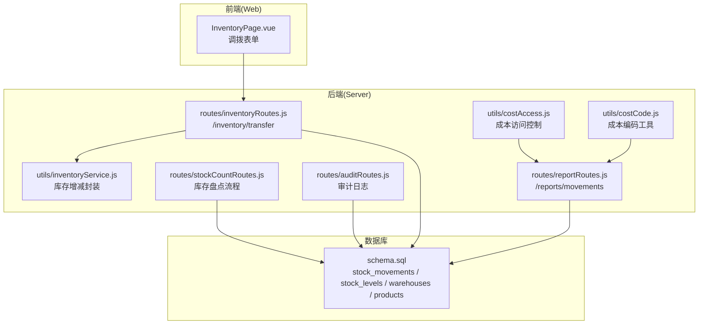
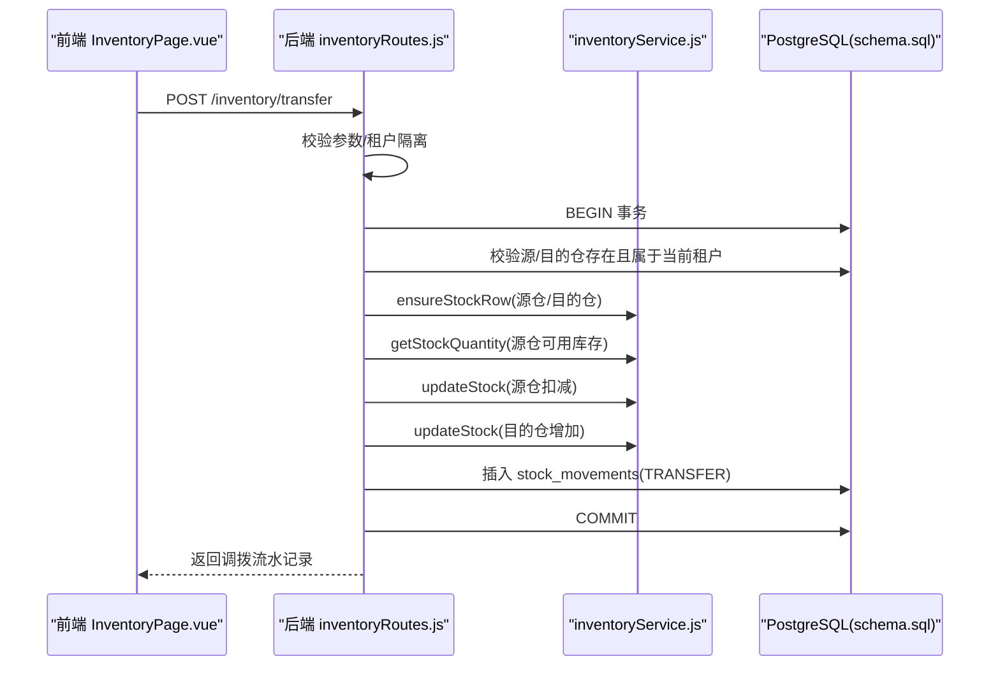
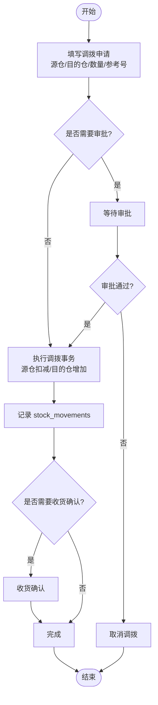
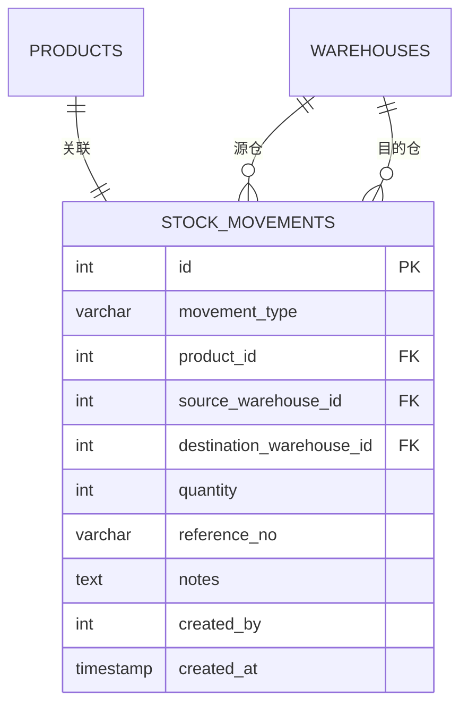
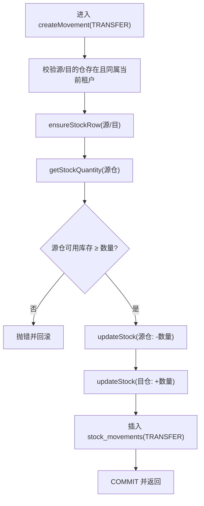
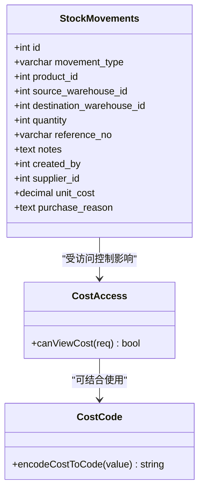
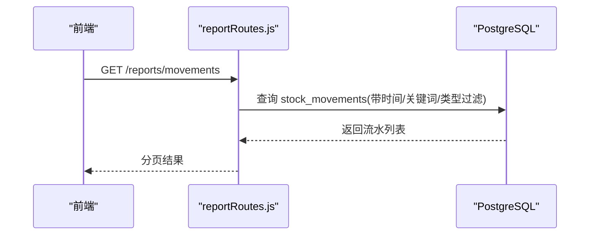
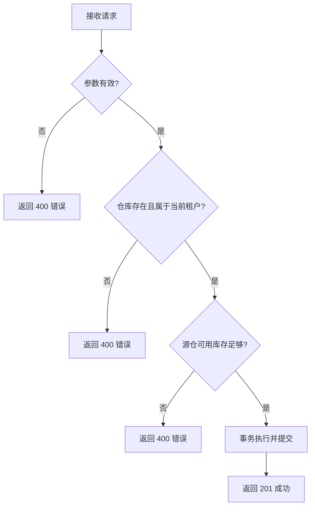
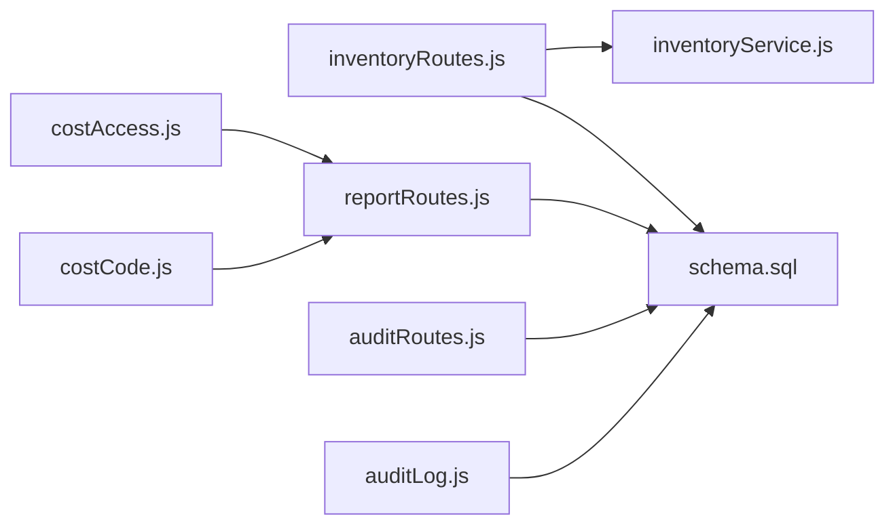

# 库存调拨

<cite>
**本文引用的文件**
- [server/src/routes/inventoryRoutes.js](file://server/src/routes/inventoryRoutes.js)
- [server/src/utils/inventoryService.js](file://server/src/utils/inventoryService.js)
- [server/database/schema.sql](file://server/database/schema.sql)
- [server/src/routes/reportRoutes.js](file://server/src/routes/reportRoutes.js)
- [server/src/routes/stockCountRoutes.js](file://server/src/routes/stockCountRoutes.js)
- [web/src/pages/InventoryPage.vue](file://web/src/pages/InventoryPage.vue)
- [server/src/utils/costAccess.js](file://server/src/utils/costAccess.js)
- [server/src/utils/costCode.js](file://server/src/utils/costCode.js)
- [server/src/routes/auditRoutes.js](file://server/src/routes/auditRoutes.js)
- [server/src/utils/auditLog.js](file://server/src/utils/auditLog.js)
</cite>

## 目录
1. [简介](#简介)
2. [项目结构](#项目结构)
3. [核心组件](#核心组件)
4. [架构总览](#架构总览)
5. [详细组件分析](#详细组件分析)
6. [依赖关系分析](#依赖关系分析)
7. [性能考量](#性能考量)
8. [故障排查指南](#故障排查指南)
9. [结论](#结论)
10. [附录](#附录)

## 简介
本文件面向“库存调拨”功能，基于现有后端路由、数据库模式与前端页面，系统化梳理跨仓库调拨的业务流程、单据生成与管理、库存处理机制、成本记录、状态跟踪、报表分析以及异常处理策略。文档同时指出当前系统在“调拨申请/审批/确认收货”的业务闭环中尚未实现的环节，并给出落地建议。

## 项目结构
后端采用 Express 路由+服务层封装+数据库模式定义的方式组织；前端通过 InventoryPage 提供调拨表单入口；审计日志与报表模块为调拨过程提供可观测性与分析能力。

**图表来源**
- [server/src/routes/inventoryRoutes.js:447](file://server/src/routes/inventoryRoutes.js#L447)
- [server/src/utils/inventoryService.js:1-46](file://server/src/utils/inventoryService.js#L1-L46)
- [server/database/schema.sql:237-248](file://server/database/schema.sql#L237-L248)
- [server/src/routes/reportRoutes.js:134-258](file://server/src/routes/reportRoutes.js#L134-L258)
- [server/src/routes/stockCountRoutes.js:1-458](file://server/src/routes/stockCountRoutes.js#L1-L458)
- [server/src/routes/auditRoutes.js:1-113](file://server/src/routes/auditRoutes.js#L1-L113)
- [server/src/utils/costAccess.js:1-32](file://server/src/utils/costAccess.js#L1-L32)
- [server/src/utils/costCode.js:1-63](file://server/src/utils/costCode.js#L1-L63)

**章节来源**
- [server/src/routes/inventoryRoutes.js:1-536](file://server/src/routes/inventoryRoutes.js#L1-L536)
- [server/src/utils/inventoryService.js:1-46](file://server/src/utils/inventoryService.js#L1-L46)
- [server/database/schema.sql:125-248](file://server/database/schema.sql#L125-L248)
- [server/src/routes/reportRoutes.js:1-261](file://server/src/routes/reportRoutes.js#L1-L261)
- [server/src/routes/stockCountRoutes.js:1-458](file://server/src/routes/stockCountRoutes.js#L1-L458)
- [web/src/pages/InventoryPage.vue:306-338](file://web/src/pages/InventoryPage.vue#L306-L338)
- [server/src/routes/auditRoutes.js:1-113](file://server/src/routes/auditRoutes.js#L1-L113)
- [server/src/utils/costAccess.js:1-32](file://server/src/utils/costAccess.js#L1-L32)
- [server/src/utils/costCode.js:1-63](file://server/src/utils/costCode.js#L1-L63)

## 核心组件
- 调拨路由与事务：后端提供统一的库存移动处理函数，支持入库(IN)、出库(OUT)与调拨(TRANSFER)，并在单次请求中以事务包裹，确保调出仓扣减与调入仓增加的原子性。
- 库存服务封装：提供 ensureStockRow/getStockQuantity/updateStock 的统一封装，避免各接口重复写事务代码。
- 数据模型：stock_movements 记录所有库存移动；stock_levels 记录每个产品在每个仓库的实时库存与占用；warehouses/products 提供仓库与产品元数据。
- 前端调拨入口：InventoryPage 提供调拨表单，包含源仓、目的仓、数量、参考号、备注等字段。
- 报表与审计：movements 报表支持按时间、关键词、类型筛选；audit 日志提供操作轨迹；成本访问控制用于敏感信息展示。

**章节来源**
- [server/src/routes/inventoryRoutes.js:237-449](file://server/src/routes/inventoryRoutes.js#L237-L449)
- [server/src/utils/inventoryService.js:1-46](file://server/src/utils/inventoryService.js#L1-L46)
- [server/database/schema.sql:237-248](file://server/database/schema.sql#L237-L248)
- [web/src/pages/InventoryPage.vue:306-338](file://web/src/pages/InventoryPage.vue#L306-L338)
- [server/src/routes/reportRoutes.js:134-258](file://server/src/routes/reportRoutes.js#L134-L258)
- [server/src/routes/auditRoutes.js:16-110](file://server/src/routes/auditRoutes.js#L16-L110)

## 架构总览
下图展示了调拨从“前端提交→后端校验→事务执行→记录流水”的完整链路。

**图表来源**
- [server/src/routes/inventoryRoutes.js:358-430](file://server/src/routes/inventoryRoutes.js#L358-L430)
- [server/src/utils/inventoryService.js:3-39](file://server/src/utils/inventoryService.js#L3-L39)
- [server/database/schema.sql:237-248](file://server/database/schema.sql#L237-L248)

## 详细组件分析

### 调拨业务流程
- 调拨申请：前端 InventoryPage.vue 提供表单，管理员/经理可提交调拨请求，包含产品、源仓、目的仓、数量、参考号、备注。
- 审批流程：当前后端未实现“申请→审批→执行”的状态流转。可在 stock_movements 增加状态字段或引入独立的调拨单据表以承载审批状态。
- 执行调拨：后端统一在 createMovement 中完成校验、事务与流水记录。
- 确认收货：当前后端未提供“收货确认”接口。可在 stock_movements 或新增单据表中增加“已收货”状态与确认接口。

**章节来源**
- [web/src/pages/InventoryPage.vue:306-338](file://web/src/pages/InventoryPage.vue#L306-L338)
- [server/src/routes/inventoryRoutes.js:358-430](file://server/src/routes/inventoryRoutes.js#L358-L430)

### 调拨单据生成与管理
- 单据类型：调拨对应 stock_movements.movement_type='TRANSFER'。
- 关键字段：product_id、source_warehouse_id、destination_warehouse_id、quantity、reference_no、notes、created_by。
- 参考号：前端可传入 referenceNo，便于外部追踪。
- 状态：当前未在 stock_movements 引入状态字段，建议扩展 status 字段以支持“待调拨/调拨中/已完成/已取消”。

**图表来源**
- [server/database/schema.sql:237-248](file://server/database/schema.sql#L237-L248)

**章节来源**
- [server/src/routes/inventoryRoutes.js:401-427](file://server/src/routes/inventoryRoutes.js#L401-L427)
- [server/database/schema.sql:237-248](file://server/database/schema.sql#L237-L248)

### 库存处理机制与事务一致性
- 事务边界：调拨在单个请求中以 BEGIN/COMMIT 包裹，确保源仓扣减与目的仓增加要么都成功，要么都回滚。
- 可用库存校验：源仓可用库存 = onHand - allocated，不足则拒绝调拨。
- 行级更新：通过 ensureStockRow 确保存在 stock_levels 记录，再以 updateStock 更新数量与占用。

**图表来源**
- [server/src/routes/inventoryRoutes.js:358-430](file://server/src/routes/inventoryRoutes.js#L358-L430)
- [server/src/utils/inventoryService.js:3-39](file://server/src/utils/inventoryService.js#L3-L39)

**章节来源**
- [server/src/routes/inventoryRoutes.js:358-430](file://server/src/routes/inventoryRoutes.js#L358-L430)
- [server/src/utils/inventoryService.js:14-39](file://server/src/utils/inventoryService.js#L14-L39)

### 调拨成本计算与记录
- 成本字段：stock_movements 新增了 supplier_id、unit_cost、purchase_reason 字段，可用于记录采购成本与原因。
- 成本访问控制：通过 costAccess 控制敏感成本信息的可见性。
- 成本编码：costCode 提供金额编码工具，可用于内部成本标识，但当前未在调拨中直接使用。

**图表来源**
- [server/database/schema.sql:358-365](file://server/database/schema.sql#L358-L365)
- [server/src/utils/costAccess.js:25-27](file://server/src/utils/costAccess.js#L25-L27)
- [server/src/utils/costCode.js:29-57](file://server/src/utils/costCode.js#L29-L57)

**章节来源**
- [server/database/schema.sql:358-365](file://server/database/schema.sql#L358-L365)
- [server/src/utils/costAccess.js:1-32](file://server/src/utils/costAccess.js#L1-L32)
- [server/src/utils/costCode.js:1-63](file://server/src/utils/costCode.js#L1-L63)

### 调拨状态跟踪与监控
- 现状：movements 报表支持按类型筛选（IN/OUT/TRANSFER），并可按关键词、时间范围查询。
- 建议：为调拨增加状态字段（待调拨/调拨中/已完成/已取消），并提供状态变更接口与审计日志。

**图表来源**
- [server/src/routes/reportRoutes.js:134-258](file://server/src/routes/reportRoutes.js#L134-L258)

**章节来源**
- [server/src/routes/reportRoutes.js:134-258](file://server/src/routes/reportRoutes.js#L134-L258)

### 调拨报表生成与分析
- 库存报表：支持按产品、仓库、分类检索，导出时可拉取全量数据。
- 流水报表：支持时间范围、关键词、类型筛选，便于分析调拨频率与规模。
- 成本分析：结合 unit_cost 与 stock_movements 可做单位成本与变动趋势分析（需成本访问权限）。

**章节来源**
- [server/src/routes/reportRoutes.js:17-132](file://server/src/routes/reportRoutes.js#L17-L132)
- [server/src/routes/reportRoutes.js:134-258](file://server/src/routes/reportRoutes.js#L134-L258)
- [server/src/utils/costAccess.js:25-27](file://server/src/utils/costAccess.js#L25-L27)

### 异常处理
- 典型异常：
  - 参数缺失：productId/quantity 必须大于 0。
  - 仓库不存在或不属于当前租户。
  - 源仓可用库存不足。
  - 源仓=目的仓。
- 处理方式：后端捕获错误并回滚事务，返回错误信息给前端。

**图表来源**
- [server/src/routes/inventoryRoutes.js:243-430](file://server/src/routes/inventoryRoutes.js#L243-L430)

**章节来源**
- [server/src/routes/inventoryRoutes.js:243-430](file://server/src/routes/inventoryRoutes.js#L243-L430)

## 依赖关系分析
- 路由依赖：inventoryRoutes 依赖 inventoryService 进行库存读写；依赖数据库 schema 定义的表结构。
- 报表依赖：reportRoutes 依赖 stock_movements 与关联表进行聚合查询。
- 审计依赖：auditRoutes 与 auditLog 提供统一审计写入能力。
- 成本依赖：costAccess 控制成本字段可见性；costCode 提供编码工具。

**图表来源**
- [server/src/routes/inventoryRoutes.js:1-12](file://server/src/routes/inventoryRoutes.js#L1-L12)
- [server/src/utils/inventoryService.js:1-46](file://server/src/utils/inventoryService.js#L1-L46)
- [server/database/schema.sql:125-248](file://server/database/schema.sql#L125-L248)
- [server/src/routes/reportRoutes.js:1-10](file://server/src/routes/reportRoutes.js#L1-L10)
- [server/src/routes/auditRoutes.js:1-10](file://server/src/routes/auditRoutes.js#L1-L10)
- [server/src/utils/auditLog.js:1-40](file://server/src/utils/auditLog.js#L1-L40)
- [server/src/utils/costAccess.js:1-32](file://server/src/utils/costAccess.js#L1-L32)
- [server/src/utils/costCode.js:1-63](file://server/src/utils/costCode.js#L1-L63)

**章节来源**
- [server/src/routes/inventoryRoutes.js:1-12](file://server/src/routes/inventoryRoutes.js#L1-L12)
- [server/src/utils/inventoryService.js:1-46](file://server/src/utils/inventoryService.js#L1-L46)
- [server/database/schema.sql:125-248](file://server/database/schema.sql#L125-L248)
- [server/src/routes/reportRoutes.js:1-10](file://server/src/routes/reportRoutes.js#L1-L10)
- [server/src/routes/auditRoutes.js:1-10](file://server/src/routes/auditRoutes.js#L1-L10)
- [server/src/utils/auditLog.js:1-40](file://server/src/utils/auditLog.js#L1-L40)
- [server/src/utils/costAccess.js:1-32](file://server/src/utils/costAccess.js#L1-L32)
- [server/src/utils/costCode.js:1-63](file://server/src/utils/costCode.js#L1-L63)

## 性能考量
- 分页与索引：库存与流水查询广泛使用分页与索引（如 idx_stock_movements_created_at），建议在高频查询场景保持索引有效性。
- 事务粒度：调拨在单事务中完成，避免长时间持有锁；建议在高并发场景评估批量调拨的拆分策略。
- 成本字段访问：成本字段的可见性通过 JWT 头部令牌控制，避免不必要的字段暴露。

[本节为通用指导，不涉及具体文件分析]

## 故障排查指南
- 常见错误
  - “仓库不属于当前公司”：检查租户隔离参数与仓库归属。
  - “可用库存不足”：核对 onHand 与 allocated 的差值。
  - “源仓=目的仓”：调拨必须不同仓库。
- 排查步骤
  - 查看 movements 报表定位调拨记录。
  - 结合审计日志定位操作人与时间。
  - 使用库存报表核对调拨前后库存变化。

**章节来源**
- [server/src/routes/inventoryRoutes.js:243-430](file://server/src/routes/inventoryRoutes.js#L243-L430)
- [server/src/routes/reportRoutes.js:134-258](file://server/src/routes/reportRoutes.js#L134-L258)
- [server/src/routes/auditRoutes.js:16-110](file://server/src/routes/auditRoutes.js#L16-L110)
- [server/src/utils/auditLog.js:1-40](file://server/src/utils/auditLog.js#L1-L40)

## 结论
- 系统已具备完整的跨仓库调拨事务一致性与流水记录能力，满足“调拨申请→执行调拨→记录流水”的核心需求。
- 尚未覆盖的业务闭环包括：调拨申请/审批/确认收货的状态管理与审计追踪，建议在 stock_movements 或新增单据表中引入状态字段与审批流程。
- 成本报价与成本访问控制已具备基础能力，可结合实际业务逐步完善成本分摊与分析。

[本节为总结，不涉及具体文件分析]

## 附录

### 建议的调拨状态与单据表设计
- 在 stock_movements 增加 status 字段，支持“待调拨/调拨中/已完成/已取消”，并配套审批与收货确认接口。
- 若需更复杂的审批流，可引入独立的“调拨单据表”，包含申请人、审批人、审批意见、收货人、收货时间等字段。

[本节为概念性建议，不涉及具体文件分析]