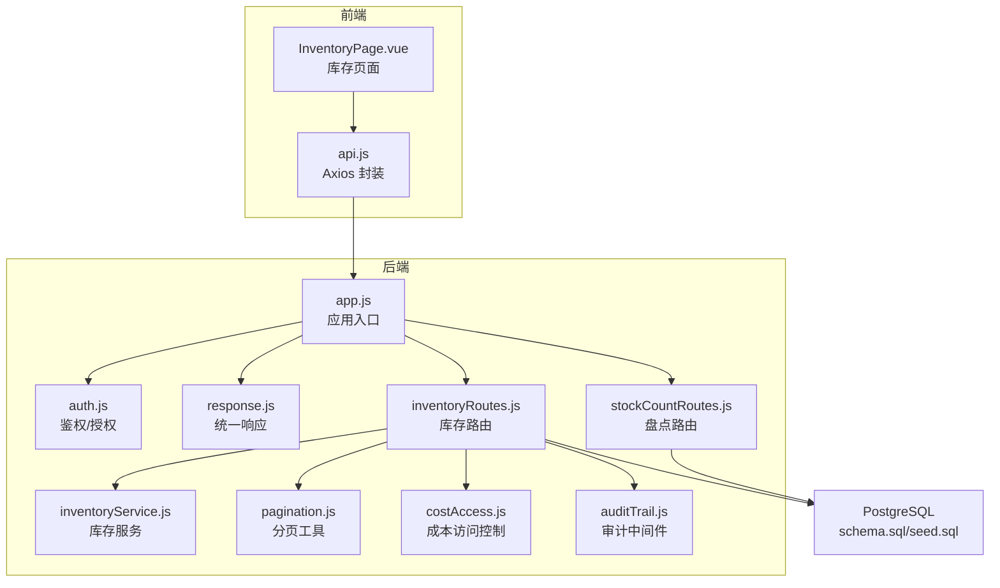
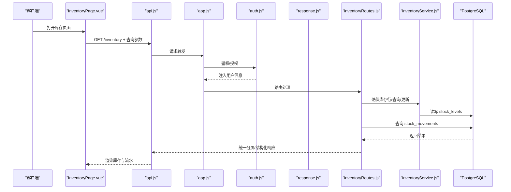
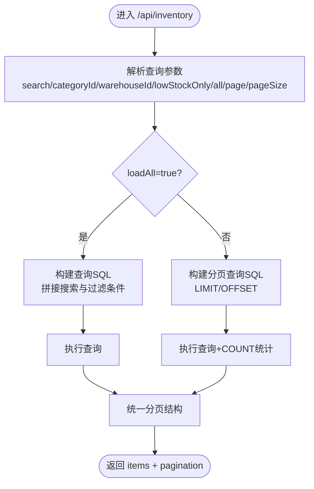
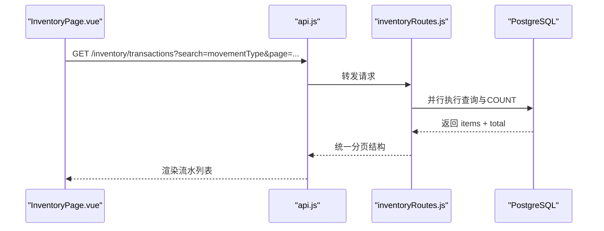
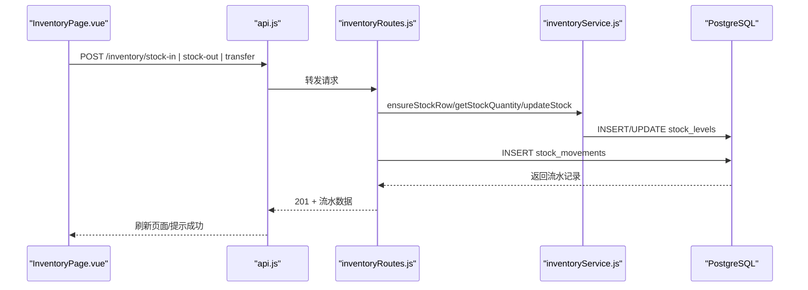
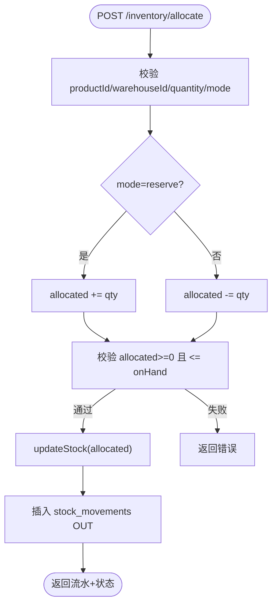
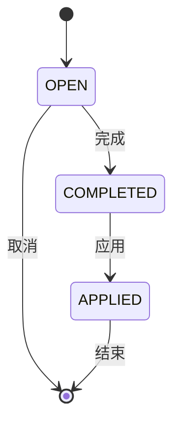
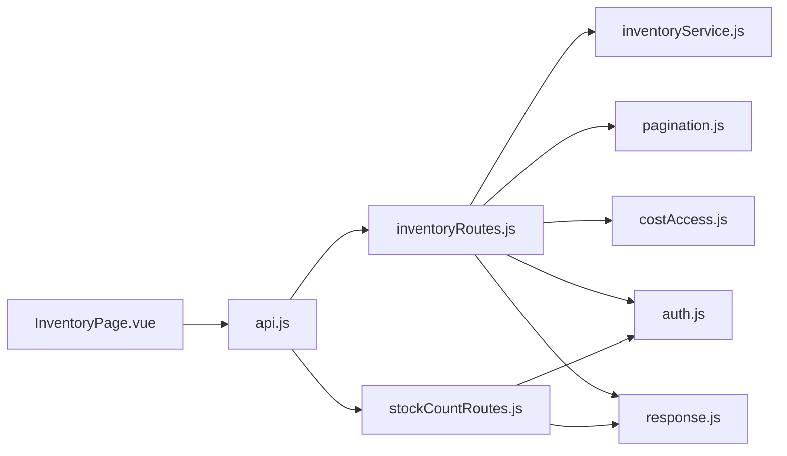

# 库存管理系统

<cite>
**本文引用的文件**
- [server/src/app.js](file://server/src/app.js)
- [server/src/routes/inventoryRoutes.js](file://server/src/routes/inventoryRoutes.js)
- [server/src/utils/inventoryService.js](file://server/src/utils/inventoryService.js)
- [server/src/utils/pagination.js](file://server/src/utils/pagination.js)
- [server/src/middleware/auth.js](file://server/src/middleware/auth.js)
- [server/src/middleware/response.js](file://server/src/middleware/response.js)
- [server/src/middleware/auditTrail.js](file://server/src/middleware/auditTrail.js)
- [server/src/utils/costAccess.js](file://server/src/utils/costAccess.js)
- [server/src/utils/auditLog.js](file://server/src/utils/auditLog.js)
- [server/src/routes/stockCountRoutes.js](file://server/src/routes/stockCountRoutes.js)
- [server/database/schema.sql](file://server/database/schema.sql)
- [server/database/seed.sql](file://server/database/seed.sql)
- [web/src/pages/InventoryPage.vue](file://web/src/pages/InventoryPage.vue)
- [web/src/services/api.js](file://web/src/services/api.js)
- [README.md](file://README.md)
- [postman/inventory_system_backend.postman_collection.json](file://postman/inventory_system_backend.postman_collection.json)
</cite>

## 目录
1. [简介](#简介)
2. [项目结构](#项目结构)
3. [核心组件](#核心组件)
4. [架构总览](#架构总览)
5. [详细组件分析](#详细组件分析)
6. [依赖关系分析](#依赖关系分析)
7. [性能考量](#性能考量)
8. [故障排查指南](#故障排查指南)
9. [结论](#结论)
10. [附录](#附录)

## 简介
本项目是一个基于 Vue 3 + Node.js + Express + PostgreSQL 的全栈库存管理系统，提供实时库存跟踪、库存操作（入库、出库、调拨）、库存分配与预留、库存查询与搜索、库存事务流水与历史追踪、安全库存与低库存告警、盘点流程等功能。系统通过统一响应中间件、鉴权与角色授权、审计日志等机制保障安全性与可观测性。

## 项目结构
系统采用前后端分离架构：
- 后端（server）：Express + PostgreSQL，提供 REST API、鉴权、分页、审计等能力
- 前端（web）：Vue 3 + Tailwind CSS，提供库存操作界面、搜索与分页展示
- 数据库（server/database）：初始化表结构与种子数据



**图表来源**
- [server/src/app.js:1-67](file://server/src/app.js#L1-L67)
- [server/src/routes/inventoryRoutes.js:1-493](file://server/src/routes/inventoryRoutes.js#L1-L493)
- [server/src/routes/stockCountRoutes.js:1-434](file://server/src/routes/stockCountRoutes.js#L1-L434)
- [server/src/utils/inventoryService.js:1-45](file://server/src/utils/inventoryService.js#L1-L45)
- [server/src/utils/pagination.js:1-28](file://server/src/utils/pagination.js#L1-L28)
- [server/src/middleware/auth.js:1-46](file://server/src/middleware/auth.js#L1-L46)
- [server/src/middleware/response.js:1-62](file://server/src/middleware/response.js#L1-L62)
- [server/src/middleware/auditTrail.js](file://server/src/middleware/auditTrail.js)
- [server/src/utils/costAccess.js:1-32](file://server/src/utils/costAccess.js#L1-L32)
- [server/database/schema.sql:1-447](file://server/database/schema.sql#L1-L447)

**章节来源**
- [README.md:1-105](file://README.md#L1-L105)
- [server/src/app.js:1-67](file://server/src/app.js#L1-L67)

## 核心组件
- 鉴权与授权：JWT 验证、角色授权（ADMIN/MANAGER/STAFF）
- 统一响应中间件：标准化成功/失败响应格式与请求 ID
- 库存服务：封装库存行确保、查询与更新逻辑
- 分页工具：统一分页参数与分页结构
- 成本访问控制：基于二次令牌的成本价查看授权
- 审计中间件：记录关键操作的审计日志上下文
- 库存路由：库存总览、交易流水、入库/出库/调拨、分配与预留
- 盘点路由：创建、编辑、完成、应用差异的全流程

**章节来源**
- [server/src/middleware/auth.js:1-46](file://server/src/middleware/auth.js#L1-L46)
- [server/src/middleware/response.js:1-62](file://server/src/middleware/response.js#L1-L62)
- [server/src/utils/inventoryService.js:1-45](file://server/src/utils/inventoryService.js#L1-L45)
- [server/src/utils/pagination.js:1-28](file://server/src/utils/pagination.js#L1-L28)
- [server/src/utils/costAccess.js:1-32](file://server/src/utils/costAccess.js#L1-L32)
- [server/src/middleware/auditTrail.js](file://server/src/middleware/auditTrail.js)
- [server/src/routes/inventoryRoutes.js:1-493](file://server/src/routes/inventoryRoutes.js#L1-L493)
- [server/src/routes/stockCountRoutes.js:1-434](file://server/src/routes/stockCountRoutes.js#L1-L434)

## 架构总览
系统通过中间件链路串联鉴权、响应包装、审计与业务路由，库存与盘点相关接口均在事务中执行，保证数据一致性；前端通过 Axios 封装统一携带认证与成本访问令牌，按需展示成本价。



**图表来源**
- [web/src/pages/InventoryPage.vue:113-150](file://web/src/pages/InventoryPage.vue#L113-L150)
- [web/src/services/api.js:1-45](file://web/src/services/api.js#L1-L45)
- [server/src/app.js:26-67](file://server/src/app.js#L26-L67)
- [server/src/middleware/auth.js:1-46](file://server/src/middleware/auth.js#L1-L46)
- [server/src/middleware/response.js:1-62](file://server/src/middleware/response.js#L1-L62)
- [server/src/routes/inventoryRoutes.js:17-151](file://server/src/routes/inventoryRoutes.js#L17-L151)
- [server/src/utils/inventoryService.js:1-45](file://server/src/utils/inventoryService.js#L1-L45)

## 详细组件分析

### 库存查询与搜索（分页、过滤、高级搜索）
- 支持关键词搜索（产品名/SKU/条码/分类/仓库名称/编码），并支持分类、仓库过滤与低库存筛选
- 提供“加载全部”模式与分页模式，分页参数统一处理，避免超界与过大页尺寸
- 成本价根据成本访问令牌决定是否可见



**图表来源**
- [server/src/routes/inventoryRoutes.js:17-151](file://server/src/routes/inventoryRoutes.js#L17-L151)
- [server/src/utils/pagination.js:1-28](file://server/src/utils/pagination.js#L1-L28)

**章节来源**
- [server/src/routes/inventoryRoutes.js:17-151](file://server/src/routes/inventoryRoutes.js#L17-L151)
- [server/src/utils/pagination.js:1-28](file://server/src/utils/pagination.js#L1-L28)
- [web/src/pages/InventoryPage.vue:113-150](file://web/src/pages/InventoryPage.vue#L113-L150)

### 库存事务流水与历史追踪
- 支持按关键词与类型（IN/OUT/TRANSFER）检索最近流水
- 流水记录包含产品、来源/目的仓、数量、参考号、创建人与时间
- 分页查询与总数统计并行执行，提升性能



**图表来源**
- [server/src/routes/inventoryRoutes.js:154-227](file://server/src/routes/inventoryRoutes.js#L154-L227)
- [web/src/pages/InventoryPage.vue:113-150](file://web/src/pages/InventoryPage.vue#L113-L150)

**章节来源**
- [server/src/routes/inventoryRoutes.js:154-227](file://server/src/routes/inventoryRoutes.js#L154-L227)
- [web/src/pages/InventoryPage.vue:113-150](file://web/src/pages/InventoryPage.vue#L113-L150)

### 库存操作：入库、出库、调拨
- 入库：必须指定产品、仓库与正数数量；事务内确保库存行存在并增加在手量，同时插入一条 IN 类型流水
- 出库：必须指定产品、仓库与正数数量；校验可用库存（在手-预留）充足后再扣减
- 调拨：必须指定源/目的仓且不同；校验源仓可用库存充足，分别更新源仓扣减与目的仓增加



**图表来源**
- [server/src/routes/inventoryRoutes.js:229-415](file://server/src/routes/inventoryRoutes.js#L229-L415)
- [server/src/utils/inventoryService.js:1-45](file://server/src/utils/inventoryService.js#L1-L45)
- [web/src/pages/InventoryPage.vue:244-369](file://web/src/pages/InventoryPage.vue#L244-L369)

**章节来源**
- [server/src/routes/inventoryRoutes.js:229-415](file://server/src/routes/inventoryRoutes.js#L229-L415)
- [server/src/utils/inventoryService.js:1-45](file://server/src/utils/inventoryService.js#L1-L45)
- [web/src/pages/InventoryPage.vue:244-369](file://web/src/pages/InventoryPage.vue#L244-L369)

### 库存分配与预留机制
- 支持 reserve/release 两种模式，校验分配量不为负且不超过在手量
- 更新库存行的 allocated_quantity，并生成一条 OUT 类型流水用于记录预留/释放
- 返回当前在手、预留与可用库存状态



**图表来源**
- [server/src/routes/inventoryRoutes.js:417-490](file://server/src/routes/inventoryRoutes.js#L417-L490)

**章节来源**
- [server/src/routes/inventoryRoutes.js:417-490](file://server/src/routes/inventoryRoutes.js#L417-L490)

### 盘点流程（创建、编辑、完成、应用）
- 创建：为指定仓库生成盘点单并预填所有在库商品的期望数量
- 编辑：仅开放状态可修改，保存时计算差异数量
- 完成：将未录入的数量按期望数量补齐并标记完成
- 应用：仅管理员/经理可执行，按差异数量更新在库量并生成出入库流水



**图表来源**
- [server/src/routes/stockCountRoutes.js:87-164](file://server/src/routes/stockCountRoutes.js#L87-L164)
- [server/src/routes/stockCountRoutes.js:221-271](file://server/src/routes/stockCountRoutes.js#L221-L271)
- [server/src/routes/stockCountRoutes.js:273-324](file://server/src/routes/stockCountRoutes.js#L273-L324)
- [server/src/routes/stockCountRoutes.js:326-431](file://server/src/routes/stockCountRoutes.js#L326-L431)

**章节来源**
- [server/src/routes/stockCountRoutes.js:1-434](file://server/src/routes/stockCountRoutes.js#L1-L434)

### 数据模型与索引
- 关键实体：users、categories、warehouses、products、stock_levels、stock_movements、stock_counts、stock_count_items、audit_logs
- 索引覆盖高频查询字段，如产品分类、仓库、库存流水创建时间、审计日志等

```mermaid
erDiagram
USERS {
int id PK
varchar full_name
varchar email UK
varchar role
boolean is_active
}
CATEGORIES {
int id PK
varchar name UK
}
WAREHOUSES {
int id PK
varchar name
varchar code UK
}
PRODUCTS {
int id PK
varchar name
varchar sku UK
int category_id FK
}
STOCK_LEVELS {
int id PK
int product_id FK
int warehouse_id FK
int quantity
int allocated_quantity
}
STOCK_MOVEMENTS {
int id PK
varchar movement_type
int product_id FK
int source_warehouse_id FK
int destination_warehouse_id FK
int quantity
varchar reference_no
}
STOCK_COUNTS {
int id PK
int warehouse_id FK
varchar status
}
STOCK_COUNT_ITEMS {
int id PK
int stock_count_id FK
int product_id FK
int warehouse_id FK
int expected_quantity
int counted_quantity
int difference_quantity
}
AUDIT_LOGS {
int id PK
int user_id FK
varchar action
varchar entity_type
varchar entity_id
}
USERS ||--o{ STOCK_MOVEMENTS : creates
CATEGORIES ||--o{ PRODUCTS : contains
WAREHOUSES ||--o{ STOCK_LEVELS : contains
PRODUCTS ||--o{ STOCK_LEVELS : has
PRODUCTS ||--o{ STOCK_MOVEMENTS : affects
WAREHOUSES ||--o{ STOCK_MOVEMENTS : source/dest
WAREHOUSES ||--o{ STOCK_COUNTS : hosts
STOCK_COUNTS ||--o{ STOCK_COUNT_ITEMS : contains
```

**图表来源**
- [server/database/schema.sql:125-288](file://server/database/schema.sql#L125-L288)

**章节来源**
- [server/database/schema.sql:1-447](file://server/database/schema.sql#L1-L447)

## 依赖关系分析
- 路由层依赖数据库连接池与查询工具，库存路由进一步依赖库存服务与分页工具
- 中间件层提供鉴权、响应包装与审计，统一注入到各路由
- 前端通过 Axios 封装统一携带认证与成本访问令牌，简化调用



**图表来源**
- [server/src/routes/inventoryRoutes.js:1-8](file://server/src/routes/inventoryRoutes.js#L1-L8)
- [server/src/routes/stockCountRoutes.js:1-6](file://server/src/routes/stockCountRoutes.js#L1-L6)
- [web/src/pages/InventoryPage.vue:1-10](file://web/src/pages/InventoryPage.vue#L1-L10)
- [web/src/services/api.js:1-45](file://web/src/services/api.js#L1-L45)

**章节来源**
- [server/src/routes/inventoryRoutes.js:1-8](file://server/src/routes/inventoryRoutes.js#L1-L8)
- [server/src/routes/stockCountRoutes.js:1-6](file://server/src/routes/stockCountRoutes.js#L1-L6)
- [web/src/pages/InventoryPage.vue:1-10](file://web/src/pages/InventoryPage.vue#L1-L10)
- [web/src/services/api.js:1-45](file://web/src/services/api.js#L1-L45)

## 性能考量
- 分页与搜索：库存与流水接口均采用 LIMIT/OFFSET 与 COUNT 并行，避免大数据集全量扫描
- 索引优化：针对高频过滤字段建立索引，如产品分类、仓库、库存流水创建时间、审计日志时间等
- 事务隔离：库存操作与盘点应用均在事务中执行，保证一致性与并发安全
- 前端缓存：前端页面按需刷新，减少重复请求

[本节为通用性能建议，无需特定文件引用]

## 故障排查指南
- 鉴权失败：确认 Authorization 头部携带有效 JWT，或前端登录后本地存储的 token 是否正确
- 成本价不可见：确认已通过解锁接口获取成本访问令牌并正确携带 x-cost-access-token
- 库存不足：出库/调拨前检查可用库存（在手-预留），确保满足需求
- 事务回滚：当出现约束冲突或余额不足时，接口会回滚并返回错误信息
- 统一响应：后端统一返回 success/false 与 requestId，便于前端定位问题

**章节来源**
- [server/src/middleware/auth.js:1-46](file://server/src/middleware/auth.js#L1-L46)
- [server/src/utils/costAccess.js:1-32](file://server/src/utils/costAccess.js#L1-L32)
- [server/src/middleware/response.js:1-62](file://server/src/middleware/response.js#L1-L62)
- [server/src/routes/inventoryRoutes.js:292-350](file://server/src/routes/inventoryRoutes.js#L292-L350)

## 结论
该库存管理系统以清晰的分层架构、完善的中间件体系与严谨的事务处理，实现了从库存查询、实时跟踪到出入库与调拨、分配预留、流水与历史追踪、盘点全流程的完整闭环。配合前端交互与统一响应机制，既满足初学者快速上手，也为开发者提供了良好的扩展空间。

## 附录

### API 调用示例（基于 Postman 集合）
- 健康检查：GET /api/health
- 登录：POST /api/auth/login（设置 token）
- 成本解锁：POST /api/products/cost-access（设置成本访问令牌）
- 获取库存：GET /api/inventory（支持 search、categoryId、warehouseId、lowStockOnly、all、page、pageSize）
- 获取流水：GET /api/inventory/transactions（支持 search、movementType、page、pageSize）
- 入库：POST /api/inventory/stock-in（需要 ADMIN/MANAGER/STAFF 角色）
- 出库：POST /api/inventory/stock-out（需要 ADMIN/MANAGER/STAFF 角色）
- 调拨：POST /api/inventory/transfer（需要 ADMIN/MANAGER 角色）
- 分配/释放：POST /api/inventory/allocate（需要 ADMIN/MANAGER/STAFF 角色）

**章节来源**
- [postman/inventory_system_backend.postman_collection.json:10-200](file://postman/inventory_system_backend.postman_collection.json#L10-L200)

### 数据模型说明（关键字段）
- stock_levels：product_id、warehouse_id、quantity、allocated_quantity、updated_at
- stock_movements：movement_type（IN/OUT/TRANSFER）、product_id、source_warehouse_id、destination_warehouse_id、quantity、reference_no、notes、created_by、created_at
- stock_counts：warehouse_id、status（OPEN/COMPLETED/APPLIED）、notes、created_by、completed_by、applied_by、created_at、completed_at、applied_at
- stock_count_items：stock_count_id、product_id、warehouse_id、expected_quantity、counted_quantity、difference_quantity、notes

**章节来源**
- [server/database/schema.sql:125-288](file://server/database/schema.sql#L125-L288)

### 最佳实践
- 安全库存：在产品层面设置 reorder_level，结合低库存告警中心及时补货
- 库存准确性：定期执行盘点，应用差异后生成流水，保持账实一致
- 盘点流程：OPEN -> EDIT/COMPLETE -> APPLY，仅允许管理员/经理应用差异
- 权限控制：不同角色仅能执行对应操作，避免越权
- 错误处理：统一响应与审计日志，便于问题追溯与修复

**章节来源**
- [server/src/routes/stockCountRoutes.js:326-431](file://server/src/routes/stockCountRoutes.js#L326-L431)
- [server/src/middleware/auditTrail.js](file://server/src/middleware/auditTrail.js)