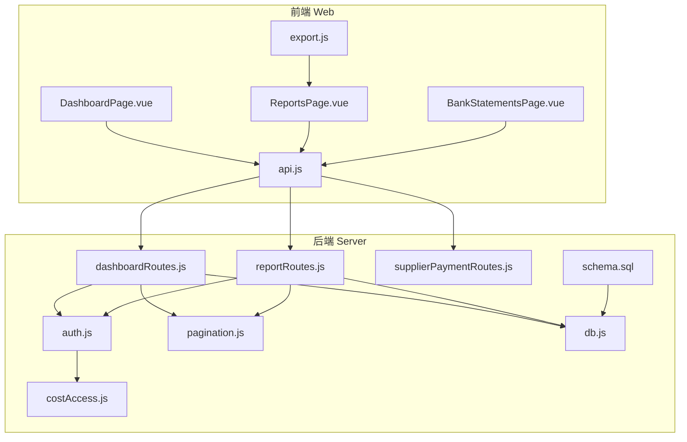
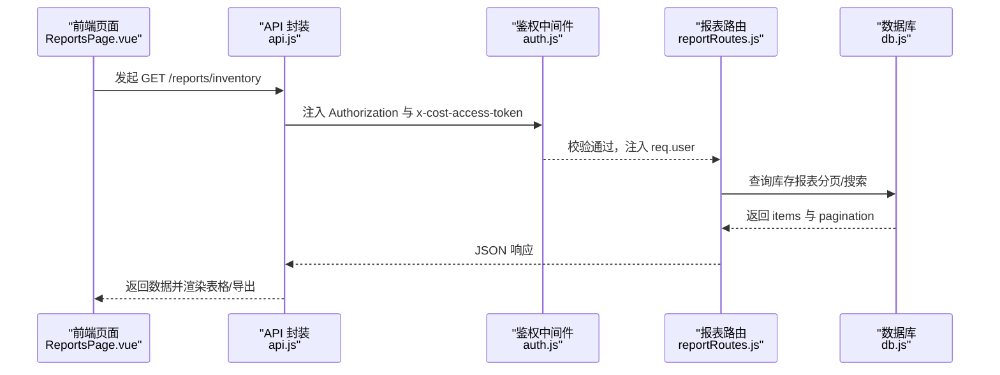
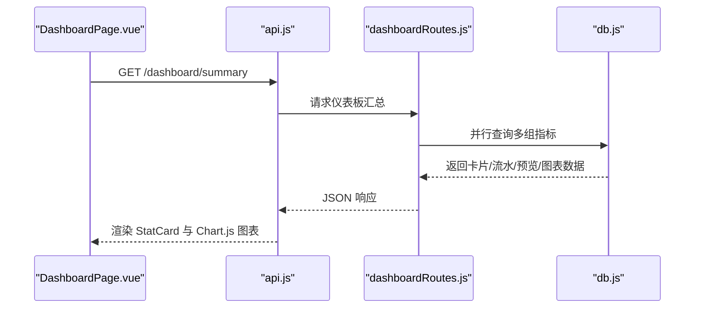
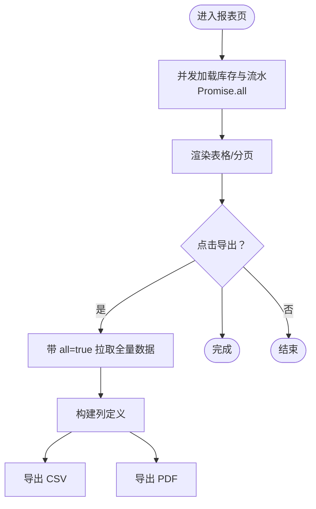
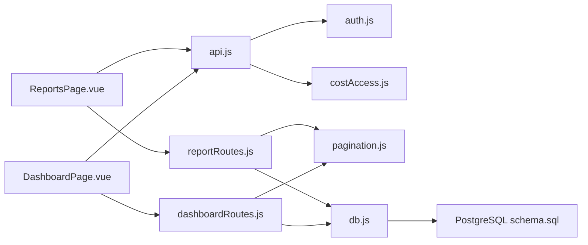
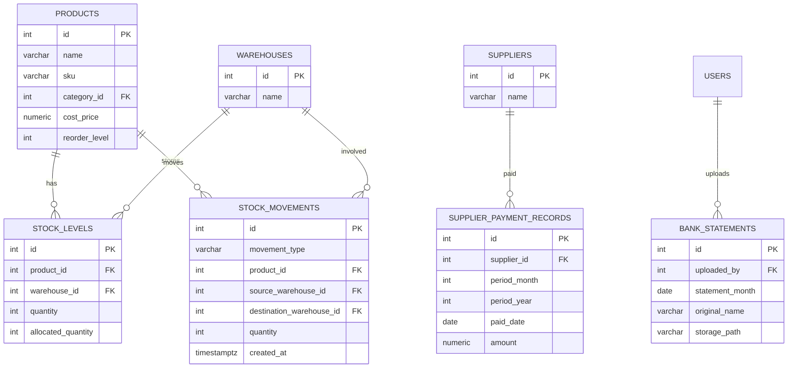

# 报表与分析系统

<cite>
**本文引用的文件**
- [server/src/routes/reportRoutes.js](file://server/src/routes/reportRoutes.js)
- [web/src/pages/ReportsPage.vue](file://web/src/pages/ReportsPage.vue)
- [server/src/routes/dashboardRoutes.js](file://server/src/routes/dashboardRoutes.js)
- [web/src/pages/DashboardPage.vue](file://web/src/pages/DashboardPage.vue)
- [web/src/components/StatCard.vue](file://web/src/components/StatCard.vue)
- [server/src/middleware/auth.js](file://server/src/middleware/auth.js)
- [server/src/utils/costAccess.js](file://server/src/utils/costAccess.js)
- [web/src/utils/export.js](file://web/src/utils/export.js)
- [server/src/config/db.js](file://server/src/config/db.js)
- [server/src/utils/pagination.js](file://server/src/utils/pagination.js)
- [server/database/schema.sql](file://server/database/schema.sql)
- [web/src/services/api.js](file://web/src/services/api.js)
- [server/src/routes/supplierPaymentRoutes.js](file://server/src/routes/supplierPaymentRoutes.js)
- [web/src/pages/BankStatementsPage.vue](file://web/src/pages/BankStatementsPage.vue)
</cite>

## 目录
1. [简介](#简介)
2. [项目结构](#项目结构)
3. [核心组件](#核心组件)
4. [架构总览](#架构总览)
5. [详细组件分析](#详细组件分析)
6. [依赖关系分析](#依赖关系分析)
7. [性能考量](#性能考量)
8. [故障排查指南](#故障排查指南)
9. [结论](#结论)
10. [附录](#附录)

## 简介
本系统围绕“报表与分析”目标，提供仪表板概览、库存与流水报表、图表可视化、报表导出、权限与数据安全、模板化与刷新策略等能力。后端基于 Express + PostgreSQL，前端采用 Vue 3 + Chart.js，覆盖库存报表、流水报表、供应商付款记录与银行对账单等模块，满足业务决策的数据洞察需求，并兼顾移动端与响应式设计。

## 项目结构
- 后端（server）
  - 路由层：仪表板与报表路由、鉴权中间件、分页工具、数据库连接
  - 服务层：市场同步、订单同步（用于扩展销售分析）
  - 工具层：成本访问令牌、分页参数、审计日志、成本编码等
  - 数据库：PostgreSQL 结构与索引，支撑库存、流水、供应商、银行对账等主题
- 前端（web）
  - 页面：仪表板、报表、银行对账单、供应商付款等
  - 组件：通用卡片、分页条、全局提示等
  - 服务：API 封装，统一拦截器注入认证与成本访问令牌
  - 工具：CSV/PDF 导出、国际化、货币格式化等

**图表来源**
- [web/src/pages/DashboardPage.vue:1-800](file://web/src/pages/DashboardPage.vue#L1-L800)
- [web/src/pages/ReportsPage.vue:1-384](file://web/src/pages/ReportsPage.vue#L1-L384)
- [web/src/pages/BankStatementsPage.vue:1-279](file://web/src/pages/BankStatementsPage.vue#L1-L279)
- [web/src/services/api.js:1-45](file://web/src/services/api.js#L1-L45)
- [web/src/utils/export.js:1-91](file://web/src/utils/export.js#L1-L91)
- [server/src/routes/dashboardRoutes.js:1-123](file://server/src/routes/dashboardRoutes.js#L1-L123)
- [server/src/routes/reportRoutes.js:1-252](file://server/src/routes/reportRoutes.js#L1-L252)
- [server/src/routes/supplierPaymentRoutes.js:1-176](file://server/src/routes/supplierPaymentRoutes.js#L1-L176)
- [server/src/middleware/auth.js:1-46](file://server/src/middleware/auth.js#L1-L46)
- [server/src/utils/costAccess.js:1-32](file://server/src/utils/costAccess.js#L1-L32)
- [server/src/utils/pagination.js:1-28](file://server/src/utils/pagination.js#L1-L28)
- [server/src/config/db.js:1-25](file://server/src/config/db.js#L1-L25)
- [server/database/schema.sql:1-447](file://server/database/schema.sql#L1-L447)

**章节来源**
- [server/src/routes/dashboardRoutes.js:1-123](file://server/src/routes/dashboardRoutes.js#L1-L123)
- [server/src/routes/reportRoutes.js:1-252](file://server/src/routes/reportRoutes.js#L1-L252)
- [web/src/pages/DashboardPage.vue:1-800](file://web/src/pages/DashboardPage.vue#L1-L800)
- [web/src/pages/ReportsPage.vue:1-384](file://web/src/pages/ReportsPage.vue#L1-L384)
- [web/src/pages/BankStatementsPage.vue:1-279](file://web/src/pages/BankStatementsPage.vue#L1-L279)
- [server/database/schema.sql:1-447](file://server/database/schema.sql#L1-L447)

## 核心组件
- 仪表板路由与页面
  - 后端提供汇总卡片、近期流水、低库存预览、月度流水趋势、按仓库/分类的库存聚合
  - 前端以卡片与多种图表（折线、柱状、环形）呈现，支持用户个性化图表显隐、类型与尺寸
- 报表路由与页面
  - 库存报表：支持搜索、分页；导出时可一次性拉取全量数据
  - 流水报表：支持时间范围、关键词搜索、分页；导出时可一次性拉取全量数据
  - 前端提供 CSV/PDF 导出按钮，导出时自动切换“导出中”状态
- 成本访问控制
  - 通过专用头部携带成本访问令牌，仅管理员/经理在授权范围内可见成本价与库存金额
- 权限与安全
  - JWT 鉴权中间件，角色授权，审计上下文
- 数据库与索引
  - 关键表：产品、仓库、库存、流水、供应商、银行对账、供应商付款记录等
  - 多处索引优化查询性能（如流水按时间倒序、库存按产品/仓库等）

**章节来源**
- [server/src/routes/dashboardRoutes.js:9-120](file://server/src/routes/dashboardRoutes.js#L9-L120)
- [web/src/pages/DashboardPage.vue:103-137](file://web/src/pages/DashboardPage.vue#L103-L137)
- [server/src/routes/reportRoutes.js:15-127](file://server/src/routes/reportRoutes.js#L15-L127)
- [web/src/pages/ReportsPage.vue:62-183](file://web/src/pages/ReportsPage.vue#L62-L183)
- [server/src/middleware/auth.js:5-40](file://server/src/middleware/auth.js#L5-L40)
- [server/src/utils/costAccess.js:5-27](file://server/src/utils/costAccess.js#L5-L27)
- [server/database/schema.sql:125-288](file://server/database/schema.sql#L125-L288)

## 架构总览
系统采用前后端分离架构，前端通过 Axios 统一注入认证与成本访问令牌，后端通过中间件进行鉴权与授权，数据库采用 PostgreSQL 并建立多类索引提升查询效率。

**图表来源**
- [web/src/pages/ReportsPage.vue:62-97](file://web/src/pages/ReportsPage.vue#L62-L97)
- [web/src/services/api.js:8-24](file://web/src/services/api.js#L8-L24)
- [server/src/middleware/auth.js:5-29](file://server/src/middleware/auth.js#L5-L29)
- [server/src/routes/reportRoutes.js:16-127](file://server/src/routes/reportRoutes.js#L16-L127)
- [server/src/config/db.js:21-24](file://server/src/config/db.js#L21-L24)

## 详细组件分析

### 仪表板设计与实时数据展示
- 卡片数据：产品数、仓库数、低库存数、在库总数
- 近期流水：最新 10 条出入库/调拨记录
- 低库存预览：按缺货程度排序的前 N 商品
- 图表维度：
  - 月度流水趋势（近 6 个月）
  - 按仓库的库存分布
  - 按分类的库存分布
- 用户偏好：
  - 可显隐图表、选择图表类型（折线/柱状/环形）、设置尺寸（小/中/大）
  - 支持拖拽重排图表顺序，本地持久化用户偏好

**图表来源**
- [server/src/routes/dashboardRoutes.js:23-100](file://server/src/routes/dashboardRoutes.js#L23-L100)
- [web/src/pages/DashboardPage.vue:103-137](file://web/src/pages/DashboardPage.vue#L103-L137)
- [web/src/components/StatCard.vue:1-16](file://web/src/components/StatCard.vue#L1-L16)

**章节来源**
- [server/src/routes/dashboardRoutes.js:9-120](file://server/src/routes/dashboardRoutes.js#L9-L120)
- [web/src/pages/DashboardPage.vue:1-800](file://web/src/pages/DashboardPage.vue#L1-L800)
- [web/src/components/StatCard.vue:1-16](file://web/src/components/StatCard.vue#L1-L16)

### 库存报表与导出
- 功能特性
  - 支持关键词搜索（产品/仓库/类别），分页加载
  - 成本价与库存金额在具备成本访问权限时可见，否则显示掩码
  - 导出时可一次性拉取全量数据（all=true），前端导出 CSV/PDF
- 数据聚合
  - 在库数量、占用数量、可用数量、补货线、库存金额（可用数量 × 成本价）
- 前端交互
  - 加载状态与错误提示
  - 导出按钮切换“导出中”状态，避免重复点击

**图表来源**
- [web/src/pages/ReportsPage.vue:62-183](file://web/src/pages/ReportsPage.vue#L62-L183)
- [server/src/routes/reportRoutes.js:16-127](file://server/src/routes/reportRoutes.js#L16-L127)
- [web/src/utils/export.js:1-91](file://web/src/utils/export.js#L1-L91)

**章节来源**
- [server/src/routes/reportRoutes.js:15-127](file://server/src/routes/reportRoutes.js#L15-L127)
- [web/src/pages/ReportsPage.vue:33-183](file://web/src/pages/ReportsPage.vue#L33-L183)
- [server/src/utils/costAccess.js:25-27](file://server/src/utils/costAccess.js#L25-L27)

### 流水报表与导出
- 功能特性
  - 时间范围过滤（起止日期）、关键词搜索（产品/仓库/人员/单号/类型）
  - 分页加载与全量导出
- 数据字段
  - 类型、产品、来源/去向仓库、数量、经办人、时间
- 前端交互
  - 表格与移动端卡片布局，支持导出 CSV/PDF

**章节来源**
- [server/src/routes/reportRoutes.js:129-249](file://server/src/routes/reportRoutes.js#L129-L249)
- [web/src/pages/ReportsPage.vue:44-183](file://web/src/pages/ReportsPage.vue#L44-L183)

### 图表组件使用与自定义配置
- 图表类型
  - 折线图：月度流水趋势
  - 柱状图：按仓库/分类的库存分布
  - 环形图：按分类的库存占比
- 自定义项
  - 显隐开关、图表类型选择、尺寸选择
  - 拖拽排序与本地持久化
- 前端实现
  - 使用 Chart.js 与 vue-chartjs 组件映射
  - 计算属性生成数据集与标签

**章节来源**
- [web/src/pages/DashboardPage.vue:139-226](file://web/src/pages/DashboardPage.vue#L139-L226)
- [web/src/pages/DashboardPage.vue:235-271](file://web/src/pages/DashboardPage.vue#L235-L271)

### 数据聚合算法与统计计算
- 库存报表
  - 可用数量 = 在库数量 - 占用数量
  - 库存金额 = 可用数量 × 成本价（受成本访问控制）
- 月度流水趋势
  - 按自然月聚合流水次数，近 6 个月
- 仓库/分类库存分布
  - 按仓库或分类聚合总在库数量，降序排列
- 低库存预览
  - 按缺货程度（补货线 - 在库数量）降序，取前 N

**章节来源**
- [server/src/routes/reportRoutes.js:66-99](file://server/src/routes/dashboardRoutes.js#L66-L99)
- [server/src/routes/reportRoutes.js:27-64](file://server/src/routes/reportRoutes.js#L27-L64)

### 报表权限控制与数据安全
- 鉴权
  - 所有报表路由均通过 JWT 鉴权中间件
  - 角色授权用于限制敏感操作（如供应商付款记录的增删改）
- 成本访问
  - 通过自定义头部携带成本访问令牌，仅管理员/经理可见成本价与库存金额
- 审计
  - 对关键操作（如供应商付款记录的创建/删除）记录审计上下文

**章节来源**
- [server/src/middleware/auth.js:5-40](file://server/src/middleware/auth.js#L5-L40)
- [server/src/utils/costAccess.js:5-27](file://server/src/utils/costAccess.js#L5-L27)
- [server/src/routes/supplierPaymentRoutes.js:114-174](file://server/src/routes/supplierPaymentRoutes.js#L114-L174)

### 报表模板定制、数据刷新策略与性能优化
- 模板定制
  - 仪表板图表显隐、类型、尺寸、顺序均可自定义，本地存储持久化
- 刷新策略
  - 前端支持手动刷新与分页切换触发重新加载
  - 导出时一次性拉取全量数据，避免分页导出的不一致
- 性能优化
  - 统一分页参数与分页结构，避免重复逻辑
  - 数据库建立多处索引（如流水按时间倒序、库存按产品/仓库等）
  - 并行查询多个指标，减少往返时间

**章节来源**
- [web/src/pages/DashboardPage.vue:175-271](file://web/src/pages/DashboardPage.vue#L175-L271)
- [server/src/utils/pagination.js:2-27](file://server/src/utils/pagination.js#L2-L27)
- [server/database/schema.sql:410-447](file://server/database/schema.sql#L410-L447)

### 移动端适配与响应式设计
- 移动端布局
  - 报表页在小屏下以卡片形式展示，保留关键字段
  - 仪表板在小屏下以卡片与表格混合布局呈现
- 响应式交互
  - 图表面板支持折叠/展开，用户偏好保存在本地存储
  - 分页条在移动端与桌面端均可用

**章节来源**
- [web/src/pages/ReportsPage.vue:259-380](file://web/src/pages/ReportsPage.vue#L259-L380)
- [web/src/pages/DashboardPage.vue:587-710](file://web/src/pages/DashboardPage.vue#L587-L710)

## 依赖关系分析

**图表来源**
- [web/src/pages/ReportsPage.vue:1-384](file://web/src/pages/ReportsPage.vue#L1-L384)
- [web/src/pages/DashboardPage.vue:1-800](file://web/src/pages/DashboardPage.vue#L1-L800)
- [web/src/services/api.js:1-45](file://web/src/services/api.js#L1-L45)
- [server/src/middleware/auth.js:1-46](file://server/src/middleware/auth.js#L1-L46)
- [server/src/utils/costAccess.js:1-32](file://server/src/utils/costAccess.js#L1-L32)
- [server/src/routes/reportRoutes.js:1-252](file://server/src/routes/reportRoutes.js#L1-L252)
- [server/src/routes/dashboardRoutes.js:1-123](file://server/src/routes/dashboardRoutes.js#L1-L123)
- [server/src/utils/pagination.js:1-28](file://server/src/utils/pagination.js#L1-L28)
- [server/src/config/db.js:1-25](file://server/src/config/db.js#L1-L25)
- [server/database/schema.sql:1-447](file://server/database/schema.sql#L1-L447)

**章节来源**
- [server/src/config/db.js:1-25](file://server/src/config/db.js#L1-L25)
- [server/database/schema.sql:1-447](file://server/database/schema.sql#L1-L447)

## 性能考量
- 查询层面
  - 使用 LIMIT/OFFSET 实现分页，避免一次性拉取大量数据
  - 并行查询多个指标，缩短首屏等待时间
- 存储层面
  - 为高频查询字段建立索引，如流水按时间倒序、库存按产品/仓库等
- 前端层面
  - 导出时一次性拉取全量数据，避免多次请求导致的数据不一致
  - 本地存储用户偏好，减少每次进入页面的初始化开销

[本节为通用指导，无需特定文件引用]

## 故障排查指南
- 鉴权失败
  - 检查请求头是否包含有效的 Authorization 与成本访问令牌
  - 确认用户状态为激活且角色具备访问权限
- 报表加载失败
  - 查看网络拦截器返回的错误消息，确认后端返回的 message 字段
  - 检查分页参数与搜索条件是否合理
- 导出异常
  - 确认导出按钮处于“导出中”状态，避免重复点击
  - 检查浏览器弹窗拦截与下载权限

**章节来源**
- [web/src/services/api.js:26-42](file://web/src/services/api.js#L26-L42)
- [server/src/middleware/auth.js:5-29](file://server/src/middleware/auth.js#L5-L29)
- [web/src/pages/ReportsPage.vue:220-229](file://web/src/pages/ReportsPage.vue#L220-L229)

## 结论
本系统通过统一的鉴权与成本访问控制、完善的报表与图表能力、灵活的导出与模板化配置，为库存与运营分析提供了可靠支撑。结合数据库索引与并行查询等优化手段，能够在保证安全性的同时提供良好的用户体验与性能表现。后续可在销售分析与财务报表方面进一步扩展（如订单与收入分析、利润表等），并与现有报表体系协同工作。

[本节为总结性内容，无需特定文件引用]

## 附录

### 数据模型（简化）

**图表来源**
- [server/database/schema.sql:32-288](file://server/database/schema.sql#L32-L288)