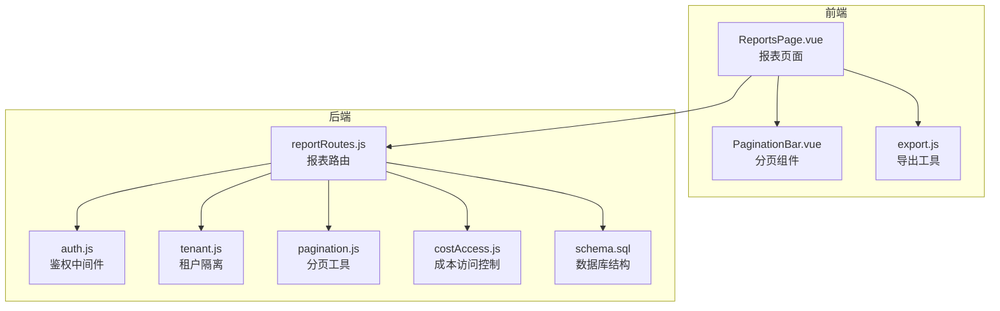
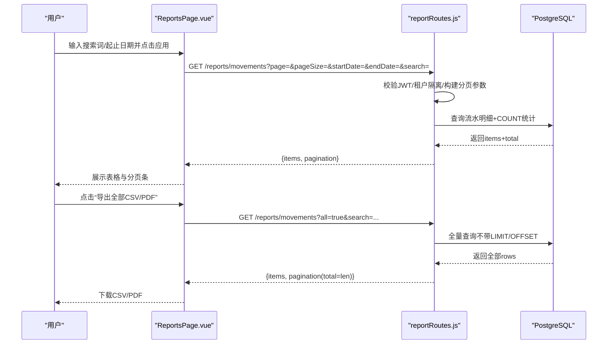
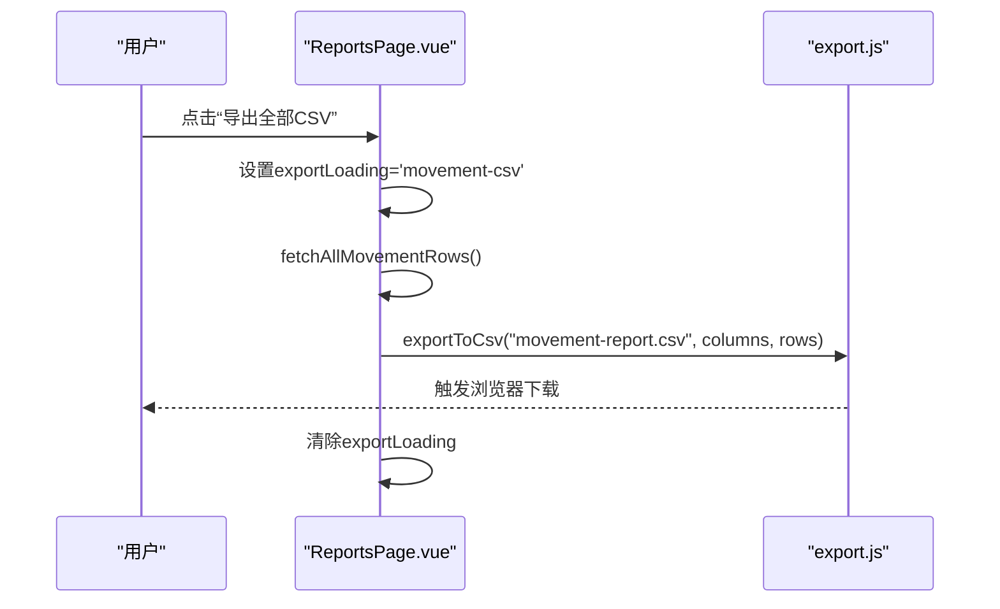
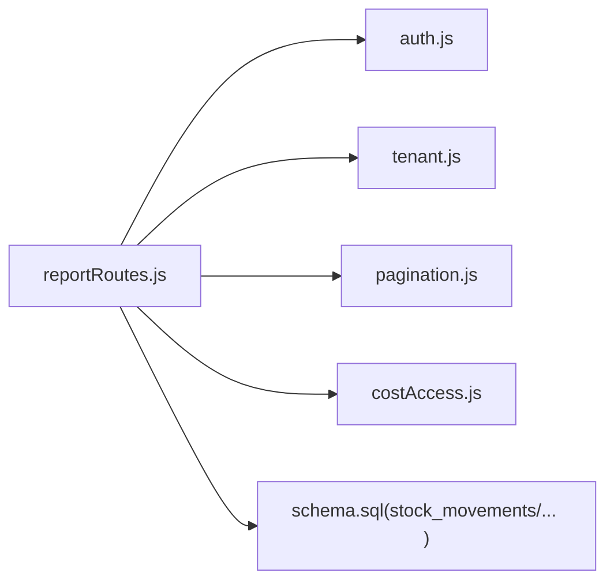

# 库存变动报表

<cite>
**本文引用的文件**
- [server/src/routes/reportRoutes.js](file://server/src/routes/reportRoutes.js)
- [web/src/pages/ReportsPage.vue](file://web/src/pages/ReportsPage.vue)
- [server/database/schema.sql](file://server/database/schema.sql)
- [server/src/utils/pagination.js](file://server/src/utils/pagination.js)
- [web/src/utils/export.js](file://web/src/utils/export.js)
- [web/src/components/PaginationBar.vue](file://web/src/components/PaginationBar.vue)
- [server/src/utils/costAccess.js](file://server/src/utils/costAccess.js)
- [server/src/utils/tenant.js](file://server/src/utils/tenant.js)
- [server/src/middleware/auth.js](file://server/src/middleware/auth.js)
- [server/src/routes/inventoryRoutes.js](file://server/src/routes/inventoryRoutes.js)
- [server/src/routes/stockCountRoutes.js](file://server/src/routes/stockCountRoutes.js)
</cite>

## 目录
1. [简介](#简介)
2. [项目结构](#项目结构)
3. [核心组件](#核心组件)
4. [架构总览](#架构总览)
5. [详细组件分析](#详细组件分析)
6. [依赖关系分析](#依赖关系分析)
7. [性能考量](#性能考量)
8. [故障排查指南](#故障排查指南)
9. [结论](#结论)
10. [附录](#附录)

## 简介
本文件面向“库存变动报表”功能，系统性阐述库存流动记录的展示与分析能力。内容覆盖数据结构定义、报表字段语义、库存变动类型分类逻辑、时间范围筛选与搜索过滤、分页机制与性能优化、导出能力（CSV/PDF）以及错误处理与交互优化最佳实践。读者无需深入代码即可理解如何使用与扩展该功能。

## 项目结构
- 后端采用 Express 路由层暴露报表接口，统一鉴权与租户隔离，提供库存总览与流水报表两个接口。
- 前端通过 Reports 页面聚合两个报表，支持搜索、时间筛选、分页与导出。
- 数据模型以 stock_movements 为核心，关联产品、仓库与用户，支持 IN/OUT/TRANSFER 三类变动。



图表来源
- [server/src/routes/reportRoutes.js:1-261](file://server/src/routes/reportRoutes.js#L1-L261)
- [web/src/pages/ReportsPage.vue:1-384](file://web/src/pages/ReportsPage.vue#L1-L384)
- [server/database/schema.sql:237-248](file://server/database/schema.sql#L237-L248)

章节来源
- [server/src/routes/reportRoutes.js:1-261](file://server/src/routes/reportRoutes.js#L1-L261)
- [web/src/pages/ReportsPage.vue:1-384](file://web/src/pages/ReportsPage.vue#L1-L384)
- [server/database/schema.sql:237-248](file://server/database/schema.sql#L237-L248)

## 核心组件
- 报表路由：提供库存总览与库存流水两个接口，支持分页、搜索与时间范围筛选。
- 前端报表页面：负责表单输入（搜索词、起止日期）、分页切换、并发加载两个报表、导出 CSV/PDF。
- 导出工具：封装 CSV 与 PDF 导出流程，支持标题、列头与数据映射。
- 分页组件：提供上一页/下一页与总数提示，触发父组件变更页码。
- 成本访问控制：根据角色与专用令牌决定是否显示成本价与库存金额。
- 租户隔离：所有查询均附加 tenant_id 过滤，确保多租户数据安全。

章节来源
- [server/src/routes/reportRoutes.js:17-132](file://server/src/routes/reportRoutes.js#L17-L132)
- [server/src/routes/reportRoutes.js:134-258](file://server/src/routes/reportRoutes.js#L134-L258)
- [web/src/pages/ReportsPage.vue:62-183](file://web/src/pages/ReportsPage.vue#L62-L183)
- [web/src/utils/export.js:1-91](file://web/src/utils/export.js#L1-L91)
- [web/src/components/PaginationBar.vue:1-51](file://web/src/components/PaginationBar.vue#L1-L51)
- [server/src/utils/costAccess.js:25-27](file://server/src/utils/costAccess.js#L25-L27)
- [server/src/utils/tenant.js:9-14](file://server/src/utils/tenant.js#L9-L14)

## 架构总览
报表功能遵循“前端页面 + 后端路由 + 数据库”的分层架构。前端发起请求携带查询参数，后端统一鉴权与租户隔离，执行分页查询与计数，返回标准化分页结构；导出时前端可请求“全量”数据以满足批量导出需求。



图表来源
- [web/src/pages/ReportsPage.vue:62-183](file://web/src/pages/ReportsPage.vue#L62-L183)
- [server/src/routes/reportRoutes.js:134-258](file://server/src/routes/reportRoutes.js#L134-L258)

## 详细组件分析

### 数据结构与字段语义
- 库存流水（stock_movements）核心字段
  - movement_type：变动类型，枚举值为 IN/OUT/TRANSFER。
  - product_id：产品标识，关联 products。
  - source_warehouse_id / destination_warehouse_id：来源/去向仓库，允许为空（对应供应商/客户场景）。
  - quantity：数量，大于0。
  - reference_no：单号/参考号。
  - notes：备注。
  - created_by：创建者，关联 users。
  - created_at：创建时间。
- 前端展示字段映射
  - 类型、产品、来源、去向、数量、操作人、时间。
  - 来源/去向为空时，前端以“供应商/客户”占位显示，便于识别外部场景。

章节来源
- [server/database/schema.sql:237-248](file://server/database/schema.sql#L237-L248)
- [web/src/pages/ReportsPage.vue:44-52](file://web/src/pages/ReportsPage.vue#L44-L52)

### 库存变动类型分类逻辑
- 入库（IN）：通常来自采购或调拨转入，quantity 增加。
- 出库（OUT）：销售或内部领用，quantity 减少。
- 调拨（TRANSFER）：同一公司内仓库间转移，源仓库扣减、目的仓库增加。
- 盘点调整：通过库存盘点流程产生，依据差异 delta 自动插入 IN 或 OUT 变动。

```mermaid
flowchart TD
Start(["提交库存操作"]) --> Type{"类型选择"}
Type --> |入库(IN)| IN["写入 stock_movements(IN)<br/>增加目标仓库存"]
Type --> |出库(OUT)| OUT["写入 stock_movements(OUT)<br/>减少源仓库存"]
Type --> |调拨(TRANSFER)| TRANS["写入两条记录<br/>源仓OUT+目的仓IN"]
Type --> |盘点调整| ADJ["计算差异 delta<br/>delta>0: IN; delta<0: OUT"]
IN --> End(["完成"])
OUT --> End
TRANS --> End
ADJ --> End
```

图表来源
- [server/src/routes/inventoryRoutes.js:336-399](file://server/src/routes/inventoryRoutes.js#L336-L399)
- [server/src/routes/stockCountRoutes.js:400-428](file://server/src/routes/stockCountRoutes.js#L400-L428)

章节来源
- [server/src/routes/inventoryRoutes.js:336-399](file://server/src/routes/inventoryRoutes.js#L336-L399)
- [server/src/routes/stockCountRoutes.js:400-428](file://server/src/routes/stockCountRoutes.js#L400-L428)

### 时间范围筛选与查询参数传递
- 接口参数
  - startDate / endDate：时间范围过滤，支持空值表示无限制。
  - search：关键词模糊匹配，支持产品名/SKU、单号、变动类型、仓库名、操作人姓名等。
  - page / pageSize：分页参数，受工具函数约束最小1最大100。
  - all：布尔标志，true 时返回全量数据（不分页）。
- 后端实现要点
  - 使用 ILIKE 模糊匹配，统一构造搜索模式。
  - 时间范围通过条件表达式传参，null 表示忽略该边界。
  - 并行执行“查询明细+COUNT统计”，保证分页信息准确。

章节来源
- [server/src/routes/reportRoutes.js:134-258](file://server/src/routes/reportRoutes.js#L134-L258)
- [server/src/utils/pagination.js:1-28](file://server/src/utils/pagination.js#L1-L28)

### 搜索功能实现
- 支持的搜索维度
  - 产品：名称、SKU、条码。
  - 仓库：名称。
  - 单号：reference_no。
  - 变动类型：movement_type。
  - 操作人：created_by 对应 users.full_name。
- 实现机制
  - 将 search 统一转为 %term% 模式，通过 OR 条件组合匹配。
  - 前端在应用按钮点击时一次性提交搜索词与时间范围。

章节来源
- [web/src/pages/ReportsPage.vue:195-214](file://web/src/pages/ReportsPage.vue#L195-L214)
- [server/src/routes/reportRoutes.js:166-175](file://server/src/routes/reportRoutes.js#L166-L175)

### 分页机制与性能优化
- 分页参数
  - page 默认1，pageSize 默认10，上限100。
  - offset = (page-1)*pageSize。
- 性能策略
  - 并行查询：同时执行“明细查询+COUNT统计”，降低等待时间。
  - 索引优化：stock_movements 创建了按产品与时间的索引，有利于高频查询。
  - 全量导出：当 all=true 时返回全部数据，避免前端多次请求。
- 前端交互
  - PaginationBar 组件仅负责页码变更事件，不关心具体查询细节。
  - 列表在移动端以卡片形式展示，桌面端以表格展示，兼顾不同设备体验。

章节来源
- [server/src/utils/pagination.js:1-28](file://server/src/utils/pagination.js#L1-L28)
- [server/src/routes/reportRoutes.js:68-129](file://server/src/routes/reportRoutes.js#L68-L129)
- [web/src/components/PaginationBar.vue:14-20](file://web/src/components/PaginationBar.vue#L14-L20)
- [server/database/schema.sql:417-418](file://server/database/schema.sql#L417-L418)

### 报表导出（CSV/PDF）
- 导出流程
  - 前端点击“导出全部”按钮，设置 exportLoading 标识，调用 fetchAll*Rows 获取全量数据。
  - 调用 exportToCsv 或 exportToPdf，传入列定义与数据行。
- CSV
  - 以 UTF-8-BOM 写入，列头为国际化标签，单元格值转义双引号。
- PDF
  - 使用 jspdf 与 jspdf-autotable，横向 A4，表头深色背景，正文紧凑排版。
- 注意事项
  - 导出前需确保当前筛选条件已生效（搜索词、起止日期）。
  - 大数据量导出可能耗时较长，建议在弱网环境下谨慎使用。



图表来源
- [web/src/pages/ReportsPage.vue:157-181](file://web/src/pages/ReportsPage.vue#L157-L181)
- [web/src/utils/export.js:1-91](file://web/src/utils/export.js#L1-L91)

章节来源
- [web/src/pages/ReportsPage.vue:131-181](file://web/src/pages/ReportsPage.vue#L131-L181)
- [web/src/utils/export.js:1-91](file://web/src/utils/export.js#L1-L91)

### 错误处理、加载状态与用户交互优化
- 错误处理
  - 后端捕获异常并返回统一错误消息，前端读取响应体 message 字段展示。
  - 导出失败时清除 loading 标志并提示错误。
- 加载状态
  - 并发加载两个报表时设置 loading；导出时设置 exportLoading 提示“按当前筛选导出全部”。
- 交互优化
  - 搜索与时间筛选在应用按钮统一提交，避免频繁请求。
  - 分页条禁用无效按钮，提升可预期性。
  - 成本价与库存金额在无权限时显示占位符，保护敏感信息。

章节来源
- [server/src/routes/reportRoutes.js:129-131](file://server/src/routes/reportRoutes.js#L129-L131)
- [web/src/pages/ReportsPage.vue:92-96](file://web/src/pages/ReportsPage.vue#L92-L96)
- [web/src/pages/ReportsPage.vue:220-228](file://web/src/pages/ReportsPage.vue#L220-L228)

## 依赖关系分析
- 报表路由依赖
  - 鉴权中间件：确保 JWT 有效且租户上下文存在。
  - 租户隔离：所有查询附加 tenant_id 过滤。
  - 分页工具：统一参数解析与分页结构。
  - 成本访问控制：根据角色与专用令牌决定是否返回成本价与库存金额。
- 数据模型依赖
  - stock_movements 关联 products、warehouses、users。
  - 索引覆盖常用查询路径（产品、时间、仓库），提升查询效率。



图表来源
- [server/src/routes/reportRoutes.js:1-10](file://server/src/routes/reportRoutes.js#L1-L10)
- [server/src/middleware/auth.js:5-61](file://server/src/middleware/auth.js#L5-L61)
- [server/src/utils/tenant.js:9-14](file://server/src/utils/tenant.js#L9-L14)
- [server/src/utils/pagination.js:1-28](file://server/src/utils/pagination.js#L1-L28)
- [server/src/utils/costAccess.js:25-27](file://server/src/utils/costAccess.js#L25-L27)
- [server/database/schema.sql:237-248](file://server/database/schema.sql#L237-L248)

章节来源
- [server/src/routes/reportRoutes.js:1-10](file://server/src/routes/reportRoutes.js#L1-L10)
- [server/src/middleware/auth.js:5-61](file://server/src/middleware/auth.js#L5-L61)
- [server/src/utils/tenant.js:9-14](file://server/src/utils/tenant.js#L9-L14)
- [server/src/utils/pagination.js:1-28](file://server/src/utils/pagination.js#L1-L28)
- [server/src/utils/costAccess.js:25-27](file://server/src/utils/costAccess.js#L25-L27)
- [server/database/schema.sql:237-248](file://server/database/schema.sql#L237-L248)

## 性能考量
- 查询层面
  - 使用 ILIKE 模糊匹配时注意索引利用，必要时考虑全文索引或物化视图。
  - 并行查询明细与计数，显著降低首屏等待时间。
- 分页层面
  - 严格限制 pageSize 上限，避免超大页码导致内存压力。
  - 对高频字段建立索引（如 created_at、product_id）。
- 导出层面
  - 全量导出仅在 all=true 时启用，避免常规分页请求被滥用。
  - 大数据量导出建议在后台任务队列异步生成并提供下载链接。

## 故障排查指南
- 401 未认证
  - 检查请求头 Authorization 是否为 Bearer Token，Token 是否过期。
- 403 租户状态异常
  - 确认当前用户所属租户状态为 ACTIVE。
- 400 参数非法
  - page 必须≥1，pageSize 必须在[1,100]区间；search 为空时不会触发过滤。
- 500 服务器错误
  - 查看后端日志定位 SQL 异常或连接池问题；前端展示通用错误消息。
- 导出失败
  - 确认网络稳定，检查浏览器弹窗拦截；确认当前筛选条件有效。

章节来源
- [server/src/middleware/auth.js:9-60](file://server/src/middleware/auth.js#L9-L60)
- [server/src/routes/reportRoutes.js:129-131](file://server/src/routes/reportRoutes.js#L129-L131)
- [web/src/pages/ReportsPage.vue:92-96](file://web/src/pages/ReportsPage.vue#L92-L96)

## 结论
库存变动报表通过清晰的数据模型、严格的租户隔离与完善的分页/导出机制，实现了高效稳定的库存流动可视化。结合成本访问控制与友好的前端交互，既能满足日常运营查看，也能支撑批量导出与审计需求。后续可在索引优化、异步导出与缓存策略方面进一步增强大规模场景下的性能表现。

## 附录
- 常用接口
  - GET /reports/inventory：库存总览（支持搜索、分页、全量导出）。
  - GET /reports/movements：库存流水（支持时间范围、搜索、分页、全量导出）。
- 前端列定义
  - 库存总览：产品、SKU、仓库、在库、占用、可用、补货线、库存金额。
  - 库存流水：类型、产品、来源、去向、数量、操作人、时间。
- 成本访问
  - 仅管理员/经理在具备专用令牌时可见成本价与库存金额。

章节来源
- [server/src/routes/reportRoutes.js:17-132](file://server/src/routes/reportRoutes.js#L17-L132)
- [server/src/routes/reportRoutes.js:134-258](file://server/src/routes/reportRoutes.js#L134-L258)
- [web/src/pages/ReportsPage.vue:33-52](file://web/src/pages/ReportsPage.vue#L33-L52)
- [server/src/utils/costAccess.js:25-27](file://server/src/utils/costAccess.js#L25-L27)