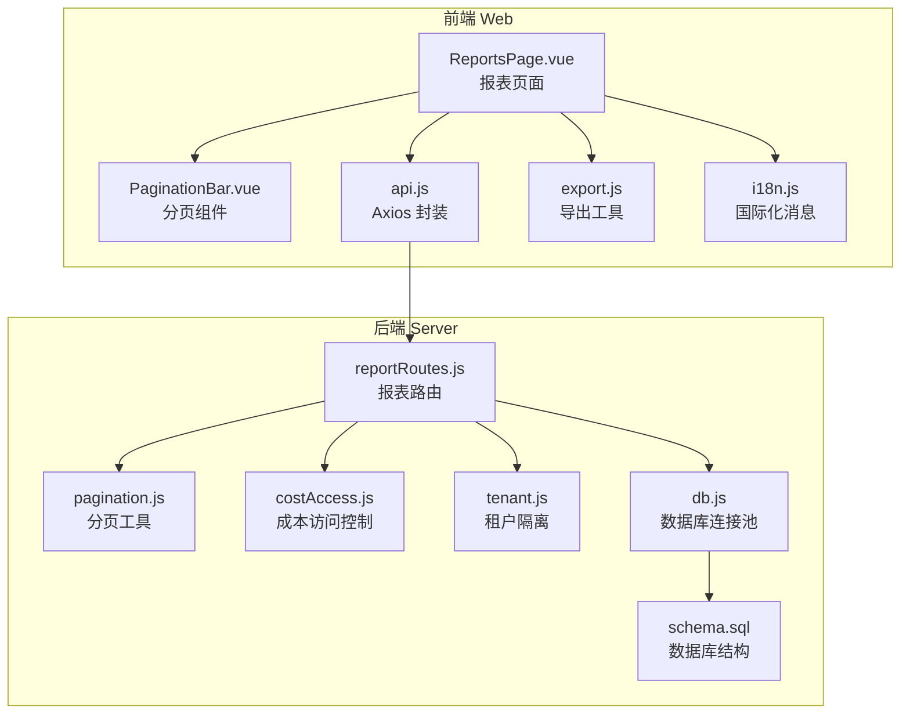
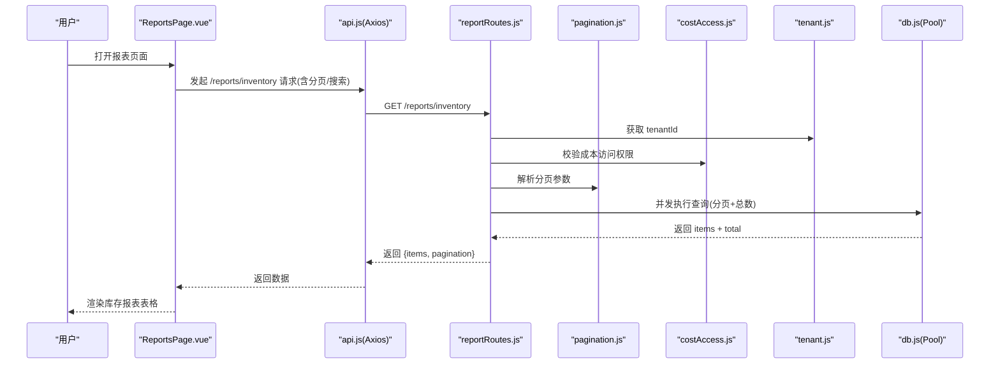
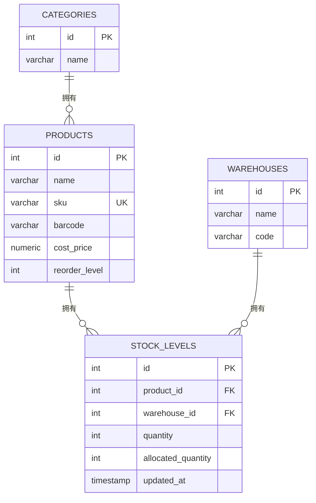
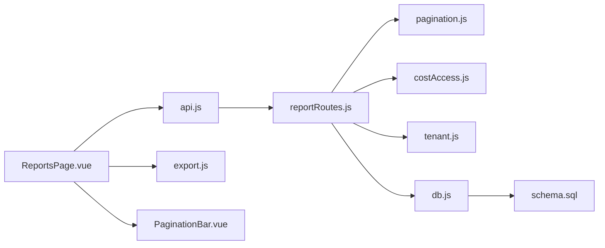

# 库存报表

<cite>
**本文引用的文件列表**
- [reportRoutes.js](file://server/src/routes/reportRoutes.js)
- [ReportsPage.vue](file://web/src/pages/ReportsPage.vue)
- [inventoryService.js](file://server/src/utils/inventoryService.js)
- [api.js](file://web/src/services/api.js)
- [pagination.js](file://server/src/utils/pagination.js)
- [schema.sql](file://server/database/schema.sql)
- [PaginationBar.vue](file://web/src/components/PaginationBar.vue)
- [export.js](file://web/src/utils/export.js)
- [db.js](file://server/src/config/db.js)
- [i18n.js](file://web/src/utils/i18n.js)
- [costAccess.js](file://server/src/utils/costAccess.js)
- [tenant.js](file://server/src/utils/tenant.js)
- [index.js](file://web/src/router/index.js)
</cite>

## 目录
1. [简介](#简介)
2. [项目结构](#项目结构)
3. [核心组件](#核心组件)
4. [架构总览](#架构总览)
5. [详细组件分析](#详细组件分析)
6. [依赖关系分析](#依赖关系分析)
7. [性能考量](#性能考量)
8. [故障排查指南](#故障排查指南)
9. [结论](#结论)
10. [附录](#附录)

## 简介
本文件面向“库存报表”功能，系统性阐述库存估值报表的实现原理与数据处理逻辑，覆盖以下方面：
- 数据来源与字段含义：产品信息、仓库分配、在库数量、占用数量、可用数量、库存价值等
- 过滤与搜索机制：按产品名称、SKU、仓库名称、类别名称等多维检索
- 分页加载与性能优化：并发查询、参数校验、索引与限制
- 导出能力：CSV 与 PDF 生成、模板定制与批量导出
- UI 交互设计：响应式表格、移动端适配、加载状态与错误提示
- 错误处理、加载状态管理与国际化支持

## 项目结构
库存报表功能由前端 Vue 页面与后端 Express 路由共同实现，数据库采用 PostgreSQL，通过统一的分页与租户隔离工具进行查询封装。

图表来源
- [ReportsPage.vue:1-384](file://web/src/pages/ReportsPage.vue#L1-L384)
- [PaginationBar.vue:1-51](file://web/src/components/PaginationBar.vue#L1-L51)
- [api.js:1-45](file://web/src/services/api.js#L1-L45)
- [export.js:1-91](file://web/src/utils/export.js#L1-L91)
- [reportRoutes.js:1-261](file://server/src/routes/reportRoutes.js#L1-L261)
- [pagination.js:1-28](file://server/src/utils/pagination.js#L1-L28)
- [costAccess.js:1-32](file://server/src/utils/costAccess.js#L1-L32)
- [tenant.js:1-43](file://server/src/utils/tenant.js#L1-L43)
- [db.js:1-29](file://server/src/config/db.js#L1-L29)
- [schema.sql:1-447](file://server/database/schema.sql#L1-L447)

章节来源
- [ReportsPage.vue:1-384](file://web/src/pages/ReportsPage.vue#L1-L384)
- [reportRoutes.js:1-261](file://server/src/routes/reportRoutes.js#L1-L261)
- [schema.sql:125-133](file://server/database/schema.sql#L125-L133)

## 核心组件
- 前端报表页面：负责渲染库存报表与流水报表、处理过滤器、分页、导出与国际化展示。
- 后端报表路由：提供库存报表与流水报表的 GET 接口，支持搜索、分页与全量导出。
- 分页工具：统一分页参数解析与分页结构构建。
- 成本访问控制：基于 JWT 的成本价可见性授权。
- 租户隔离：确保查询按 tenant_id 隔离，防止跨租户数据泄露。
- 数据库连接池：根据环境变量决定是否启用 SSL、超时配置等。
- 导出工具：CSV 与 PDF 生成，支持模板化表头与内容。

章节来源
- [ReportsPage.vue:1-384](file://web/src/pages/ReportsPage.vue#L1-L384)
- [reportRoutes.js:17-132](file://server/src/routes/reportRoutes.js#L17-L132)
- [pagination.js:1-28](file://server/src/utils/pagination.js#L1-L28)
- [costAccess.js:25-27](file://server/src/utils/costAccess.js#L25-L27)
- [tenant.js:9-14](file://server/src/utils/tenant.js#L9-L14)
- [db.js:1-29](file://server/src/config/db.js#L1-L29)
- [export.js:1-91](file://web/src/utils/export.js#L1-L91)

## 架构总览
库存报表的前后端交互流程如下：

图表来源
- [ReportsPage.vue:62-97](file://web/src/pages/ReportsPage.vue#L62-L97)
- [reportRoutes.js:17-132](file://server/src/routes/reportRoutes.js#L17-L132)
- [pagination.js:2-12](file://server/src/utils/pagination.js#L2-L12)
- [costAccess.js:25-27](file://server/src/utils/costAccess.js#L25-L27)
- [tenant.js:9-14](file://server/src/utils/tenant.js#L9-L14)
- [db.js:19-23](file://server/src/config/db.js#L19-L23)

## 详细组件分析

### 数据模型与字段定义
库存报表涉及的核心表与字段如下：
- 产品表：名称、SKU、条码、成本价、补货线等
- 仓库表：名称、代码等
- 库存明细表：产品、仓库、在库数量、占用数量、更新时间
- 类别表：名称（用于报表搜索）

图表来源
- [schema.sql:32-54](file://server/database/schema.sql#L32-L54)
- [schema.sql:125-133](file://server/database/schema.sql#L125-L133)
- [schema.sql:15-20](file://server/database/schema.sql#L15-L20)

章节来源
- [schema.sql:32-54](file://server/database/schema.sql#L32-L54)
- [schema.sql:125-133](file://server/database/schema.sql#L125-L133)
- [schema.sql:15-20](file://server/database/schema.sql#L15-L20)

### 字段含义与计算逻辑
- 在库数量：stock_levels.quantity
- 占用数量：stock_levels.allocated_quantity
- 可用量：MAX(on_hand - allocated, 0)
- 库存价值：可用数量 × 成本价（仅授权用户可见）
- 补货线：products.reorder_level
- 搜索维度：产品名称、SKU、条码、仓库名称、类别名称

章节来源
- [reportRoutes.js:36-39](file://server/src/routes/reportRoutes.js#L36-L39)
- [reportRoutes.js:44-52](file://server/src/routes/reportRoutes.js#L44-L52)

### 过滤与搜索机制
- 关键词搜索：支持模糊匹配产品名称、SKU、条码、仓库名称、类别名称
- 时间范围：流水报表支持开始/结束日期过滤
- 全量导出：前端传入 all=true，后端一次性返回全部数据（仍按 tenant_id 隔离）

章节来源
- [reportRoutes.js:12-14](file://server/src/routes/reportRoutes.js#L12-L14)
- [reportRoutes.js:44-52](file://server/src/routes/reportRoutes.js#L44-L52)
- [reportRoutes.js:135-175](file://server/src/routes/reportRoutes.js#L135-L175)

### 分页加载与性能优化
- 分页参数：page 默认 1，pageSize 默认 10，最大 100；offset = (page-1)×pageSize
- 并发查询：同时获取 items 与 total，减少往返
- 查询限制：全量导出模式下不使用 LIMIT/OFFSET
- 租户隔离：所有查询均附加 tenant_id 过滤
- 数据库索引：stock_levels 上存在 product_id、warehouse_id 索引，有利于 JOIN 与过滤

章节来源
- [pagination.js:2-12](file://server/src/utils/pagination.js#L2-L12)
- [reportRoutes.js:68-119](file://server/src/routes/reportRoutes.js#L68-L119)
- [reportRoutes.js:187-249](file://server/src/routes/reportRoutes.js#L187-L249)
- [schema.sql:415-416](file://server/database/schema.sql#L415-L416)

### 导出功能
- CSV 导出：生成 UTF-8-BOM 的 CSV 文件，表头为列标签，内容为对应字段值
- PDF 导出：使用 jsPDF + jspdf-autotable，横向 A4，表头深色背景，正文 9pt
- 批量导出：当 all=true 时，后端一次性返回全部行，前端直接导出
- 模板定制：列定义来自前端列配置，标题随国际化切换

章节来源
- [export.js:1-20](file://web/src/utils/export.js#L1-L20)
- [export.js:22-51](file://web/src/utils/export.js#L22-L51)
- [ReportsPage.vue:115-181](file://web/src/pages/ReportsPage.vue#L115-L181)

### UI 交互设计
- 响应式表格：移动端以卡片形式展示，桌面端以表格展示
- 国际化：列标题与文案根据本地语言切换
- 加载状态：请求期间显示加载提示，导出期间显示导出提示
- 错误提示：捕获后端错误消息并展示

章节来源
- [ReportsPage.vue:259-306](file://web/src/pages/ReportsPage.vue#L259-L306)
- [ReportsPage.vue:337-378](file://web/src/pages/ReportsPage.vue#L337-L378)
- [i18n.js:1-189](file://web/src/utils/i18n.js#L1-L189)

### 成本价可见性控制
- 成本访问令牌：通过自定义请求头携带，服务端验证 JWT 并校验用途与用户一致性
- 前端请求头：api.js 自动注入成本访问令牌与 UI 语言
- 后端返回：若无权限，后端将 cost_price 与 stock_value 置空

章节来源
- [costAccess.js:5-27](file://server/src/utils/costAccess.js#L5-L27)
- [api.js:17-21](file://web/src/services/api.js#L17-L21)
- [reportRoutes.js:59-63](file://server/src/routes/reportRoutes.js#L59-L63)

### 租户隔离与安全
- 租户上下文：中间件在认证后设置 req.tenantId
- 查询约束：所有报表查询均附加 tenant_id 过滤
- 安全校验：缺失租户上下文会抛错

章节来源
- [tenant.js:9-14](file://server/src/utils/tenant.js#L9-L14)
- [reportRoutes.js:44-52](file://server/src/routes/reportRoutes.js#L44-L52)
- [reportRoutes.js:107-115](file://server/src/routes/reportRoutes.js#L107-L115)

### 数据库连接与 SSL
- 连接池：基于环境变量动态决定是否启用 SSL、超时时间
- 生产建议：在云数据库或公网连接时启用 SSL

章节来源
- [db.js:3-15](file://server/src/config/db.js#L3-L15)
- [db.js:19-23](file://server/src/config/db.js#L19-L23)

## 依赖关系分析
- 前端依赖
  - Axios：统一请求拦截与响应处理
  - jsPDF + autotable：PDF 导出
  - Pinia：国际化状态管理
- 后端依赖
  - pg.Pool：PostgreSQL 连接池
  - jsonwebtoken：成本访问令牌校验
  - 自定义工具：分页、租户隔离、成本访问控制

图表来源
- [ReportsPage.vue:1-384](file://web/src/pages/ReportsPage.vue#L1-L384)
- [api.js:1-45](file://web/src/services/api.js#L1-L45)
- [export.js:1-91](file://web/src/utils/export.js#L1-L91)
- [PaginationBar.vue:1-51](file://web/src/components/PaginationBar.vue#L1-L51)
- [reportRoutes.js:1-261](file://server/src/routes/reportRoutes.js#L1-L261)
- [pagination.js:1-28](file://server/src/utils/pagination.js#L1-L28)
- [costAccess.js:1-32](file://server/src/utils/costAccess.js#L1-L32)
- [tenant.js:1-43](file://server/src/utils/tenant.js#L1-L43)
- [db.js:1-29](file://server/src/config/db.js#L1-L29)
- [schema.sql:1-447](file://server/database/schema.sql#L1-L447)

## 性能考量
- 分页参数限制：pageSize 最大 100，避免过大页导致内存压力
- 并发查询：同时获取 items 与 total，降低延迟
- 索引优化：stock_levels 已建立 product_id、warehouse_id 索引
- 大数据量导出：全量导出模式下一次性返回，适合前端批量导出
- 数据库 SSL：生产环境建议开启 SSL，提升网络传输安全性

章节来源
- [pagination.js:3-4](file://server/src/utils/pagination.js#L3-L4)
- [reportRoutes.js:68-119](file://server/src/routes/reportRoutes.js#L68-L119)
- [schema.sql:415-416](file://server/database/schema.sql#L415-L416)
- [db.js:19-23](file://server/src/config/db.js#L19-L23)

## 故障排查指南
- 无成本价显示
  - 检查是否正确传递成本访问令牌
  - 确认用户角色具备成本访问权限
- 租户数据为空
  - 确认认证中间件已设置 tenantId
  - 检查请求头是否包含正确的租户标识
- 导出失败
  - 确认浏览器允许弹窗下载
  - 检查网络是否稳定，避免中断
- 分页异常
  - 确认 page、pageSize 参数合法
  - 检查后端日志是否存在查询错误

章节来源
- [costAccess.js:5-27](file://server/src/utils/costAccess.js#L5-L27)
- [tenant.js:9-14](file://server/src/utils/tenant.js#L9-L14)
- [export.js:1-20](file://web/src/utils/export.js#L1-L20)
- [pagination.js:2-12](file://server/src/utils/pagination.js#L2-L12)

## 结论
库存报表功能通过前后端协同，实现了：
- 多维搜索与分页加载
- 成本价可见性控制与租户隔离
- 高效的并发查询与导出能力
- 国际化与响应式 UI 设计

该实现兼顾了可扩展性与易维护性，适合在多租户场景下稳定运行。

## 附录
- 路由与页面映射
  - 报表页面路由：/reports
  - 报表接口：/api/reports/inventory、/api/reports/movements

章节来源
- [index.js:133-137](file://web/src/router/index.js#L133-L137)
- [reportRoutes.js:17-132](file://server/src/routes/reportRoutes.js#L17-L132)