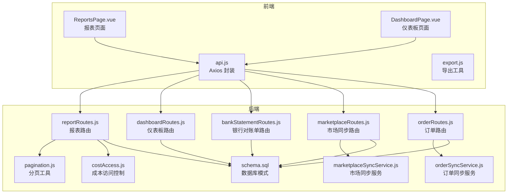
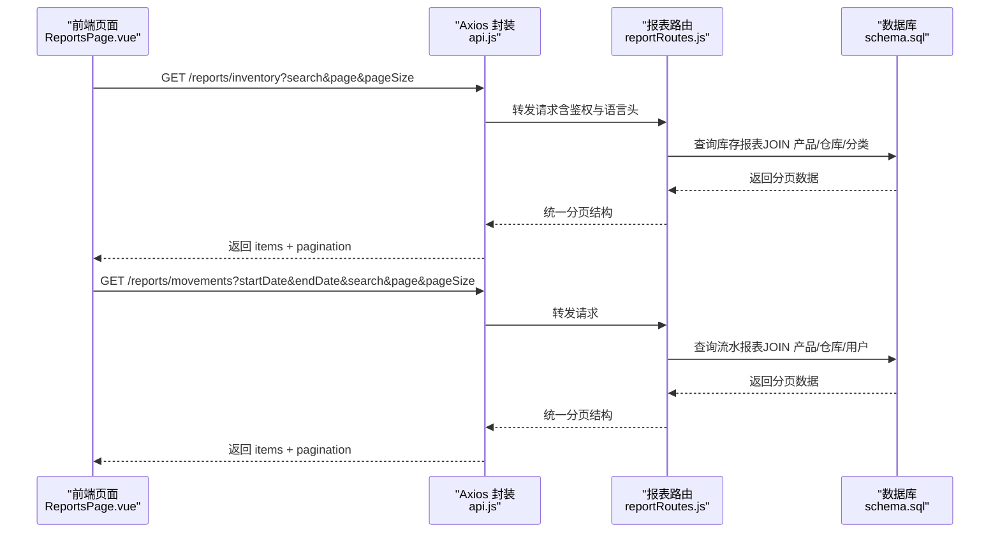
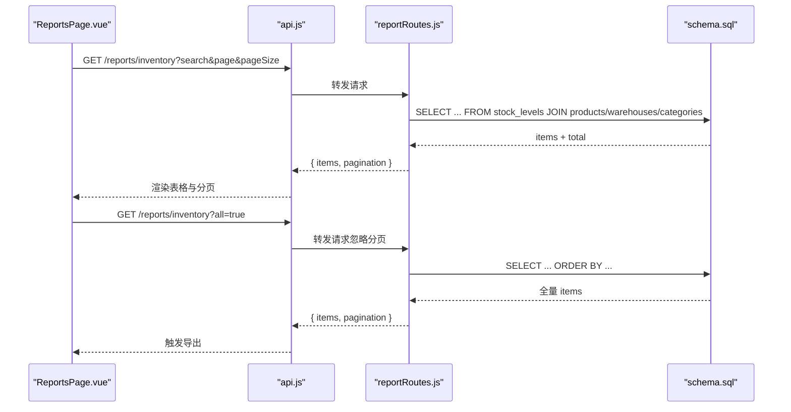
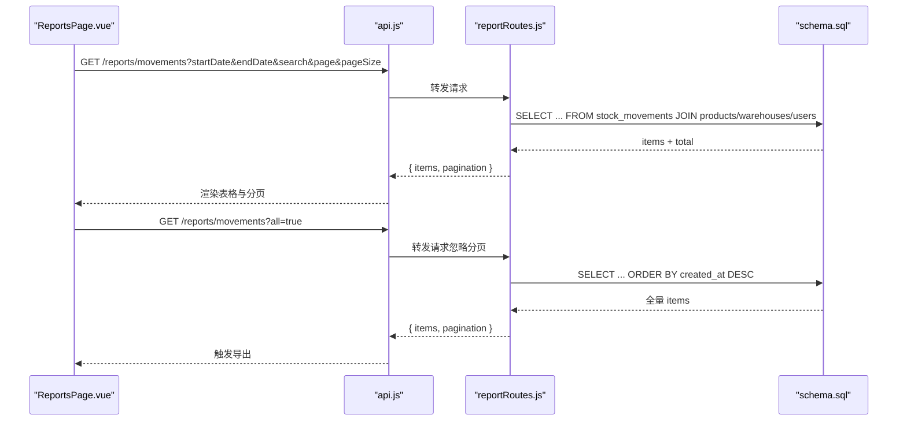
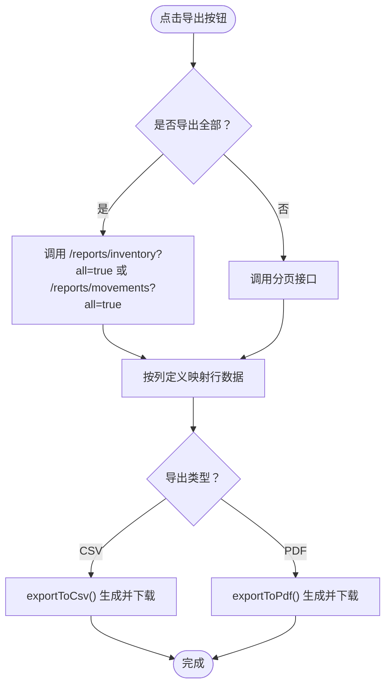
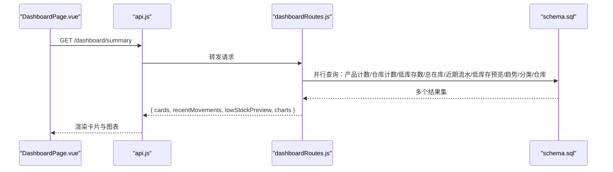
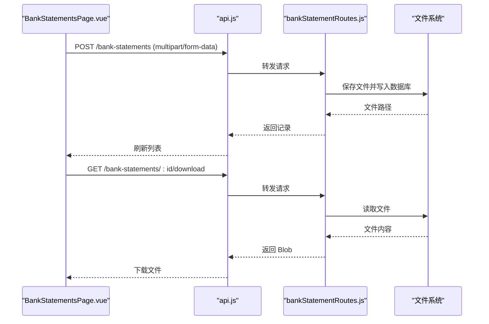
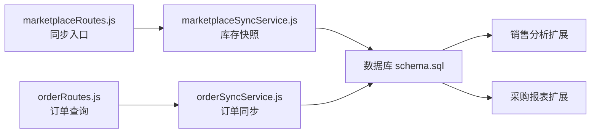
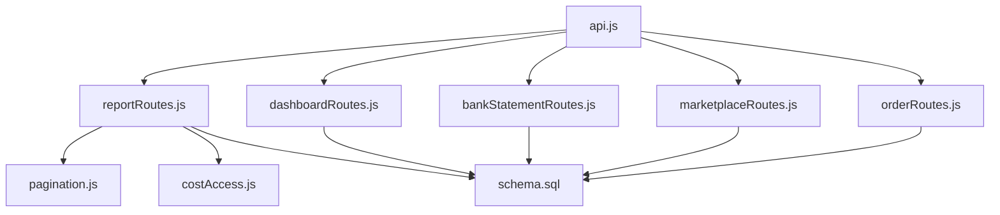

# 报表分析模块

<cite>
**本文档引用的文件**
- [reportRoutes.js](file://server/src/routes/reportRoutes.js)
- [ReportsPage.vue](file://web/src/pages/ReportsPage.vue)
- [api.js](file://web/src/services/api.js)
- [export.js](file://web/src/utils/export.js)
- [schema.sql](file://server/database/schema.sql)
- [pagination.js](file://server/src/utils/pagination.js)
- [costAccess.js](file://server/src/utils/costAccess.js)
- [dashboardRoutes.js](file://server/src/routes/dashboardRoutes.js)
- [bankStatementRoutes.js](file://server/src/routes/bankStatementRoutes.js)
- [DashboardPage.vue](file://web/src/pages/DashboardPage.vue)
- [marketplaceRoutes.js](file://server/src/routes/marketplaceRoutes.js)
- [orderRoutes.js](file://server/src/routes/orderRoutes.js)
- [orderSyncService.js](file://server/src/services/orderSyncService.js)
- [marketplaceSyncService.js](file://server/src/services/marketplaceSyncService.js)
</cite>

## 目录
1. [简介](#简介)
2. [项目结构](#项目结构)
3. [核心组件](#核心组件)
4. [架构总览](#架构总览)
5. [详细组件分析](#详细组件分析)
6. [依赖关系分析](#依赖关系分析)
7. [性能考虑](#性能考虑)
8. [故障排查指南](#故障排查指南)
9. [结论](#结论)
10. [附录](#附录)

## 简介
本模块聚焦于库存报表、流水报表与基础财务数据的呈现与导出，同时提供仪表板的实时可视化能力。当前实现覆盖以下功能：
- 库存报表：按产品、仓库、补货线与库存金额进行展示与导出
- 流水报表：按时间范围、关键词检索与分页展示出入库与调拨流水
- 导出能力：CSV、PDF 批量导出，支持“导出全部”以满足审计与对账需求
- 实时分析：仪表板卡片与图表，展示近期流水、低库存预览与库存分布趋势
- 财务基础：银行对账单上传与管理，为后续利润与成本分析奠定基础

注：销售分析与采购报表在当前代码库中未发现直接实现；市场同步与订单数据可用于未来扩展销售分析。

## 项目结构
报表分析模块由三层组成：
- 前端页面层：负责交互、筛选、分页与导出触发
- 服务层：封装 API 请求、导出工具与国际化
- 后端路由层：提供报表接口，执行查询、分页与租户隔离

**图示来源**
- [ReportsPage.vue:1-384](file://web/src/pages/ReportsPage.vue#L1-L384)
- [DashboardPage.vue:25-226](file://web/src/pages/DashboardPage.vue#L25-L226)
- [api.js:1-45](file://web/src/services/api.js#L1-L45)
- [export.js:1-91](file://web/src/utils/export.js#L1-L91)
- [reportRoutes.js:1-261](file://server/src/routes/reportRoutes.js#L1-L261)
- [dashboardRoutes.js:1-136](file://server/src/routes/dashboardRoutes.js#L1-L136)
- [bankStatementRoutes.js:1-261](file://server/src/routes/bankStatementRoutes.js#L1-L261)
- [marketplaceRoutes.js:1-685](file://server/src/routes/marketplaceRoutes.js#L1-L685)
- [orderRoutes.js:39-123](file://server/src/routes/orderRoutes.js#L39-L123)
- [orderSyncService.js:1-73](file://server/src/services/orderSyncService.js#L1-L73)
- [marketplaceSyncService.js:1-159](file://server/src/services/marketplaceSyncService.js#L1-L159)
- [pagination.js:1-28](file://server/src/utils/pagination.js#L1-L28)
- [costAccess.js:1-32](file://server/src/utils/costAccess.js#L1-L32)
- [schema.sql:1-447](file://server/database/schema.sql#L1-L447)

**章节来源**
- [ReportsPage.vue:1-384](file://web/src/pages/ReportsPage.vue#L1-L384)
- [reportRoutes.js:1-261](file://server/src/routes/reportRoutes.js#L1-L261)
- [schema.sql:1-447](file://server/database/schema.sql#L1-L447)

## 核心组件
- 报表路由（库存、流水）：提供分页、搜索与租户隔离，支持“导出全部”模式
- 前端报表页面：双报表并排展示，支持筛选与分页联动，导出 CSV/PDF
- 导出工具：CSV/PDF 生成与下载，支持批量导出
- 仪表板路由：汇总卡片、近期流水、低库存预览与三大图表数据
- 银行对账单路由：上传、下载、删除与分页列表
- 成本访问控制：基于 JWT 的成本价格可见性控制
- 分页工具：统一的分页参数与响应结构

**章节来源**
- [reportRoutes.js:16-132](file://server/src/routes/reportRoutes.js#L16-L132)
- [reportRoutes.js:134-258](file://server/src/routes/reportRoutes.js#L134-L258)
- [ReportsPage.vue:62-181](file://web/src/pages/ReportsPage.vue#L62-L181)
- [export.js:1-91](file://web/src/utils/export.js#L1-L91)
- [dashboardRoutes.js:10-134](file://server/src/routes/dashboardRoutes.js#L10-L134)
- [bankStatementRoutes.js:81-243](file://server/src/routes/bankStatementRoutes.js#L81-L243)
- [costAccess.js:25-27](file://server/src/utils/costAccess.js#L25-L27)
- [pagination.js:1-28](file://server/src/utils/pagination.js#L1-L28)

## 架构总览
报表分析模块采用前后端分离架构：
- 前端通过 Axios 发起请求，自动注入认证与语言头，拦截响应并统一封装
- 后端路由统一鉴权与租户隔离，使用分页工具构建标准分页结构
- 报表接口支持关键词搜索与时间范围过滤，导出时可切换“导出全部”模式绕过分页限制
- 仪表板接口聚合多类数据，供前端图表渲染

**图示来源**
- [ReportsPage.vue:62-97](file://web/src/pages/ReportsPage.vue#L62-L97)
- [api.js:7-24](file://web/src/services/api.js#L7-L24)
- [reportRoutes.js:17-132](file://server/src/routes/reportRoutes.js#L17-L132)
- [reportRoutes.js:135-258](file://server/src/routes/reportRoutes.js#L135-L258)
- [schema.sql:125-248](file://server/database/schema.sql#L125-L248)

## 详细组件分析

### 库存报表组件
- 数据来源：stock_levels × 产品 × 仓库 × 分类
- 计算逻辑：
  - 可用数量 = 在库数量 - 已分配数量（非负）
  - 库存金额 = 可用数量 × 成本单价（受成本访问令牌控制）
- 关键字段：产品名称、SKU、仓库、在库、占用、可用、补货线、库存金额
- 搜索：支持产品名、SKU、条码、仓库名、分类名模糊匹配
- 分页：统一分页参数与响应结构
- 导出：CSV/PDF，支持“导出全部”（all=true）

**图示来源**
- [ReportsPage.vue:62-129](file://web/src/pages/ReportsPage.vue#L62-L129)
- [reportRoutes.js:17-132](file://server/src/routes/reportRoutes.js#L17-L132)
- [schema.sql:125-133](file://server/database/schema.sql#L125-L133)

**章节来源**
- [reportRoutes.js:17-132](file://server/src/routes/reportRoutes.js#L17-L132)
- [ReportsPage.vue:33-60](file://web/src/pages/ReportsPage.vue#L33-L60)
- [ReportsPage.vue:115-129](file://web/src/pages/ReportsPage.vue#L115-L129)

### 流水报表组件
- 数据来源：stock_movements × 产品 × 仓库（源/目的）× 用户
- 时间维度：支持开始/结束日期过滤
- 搜索：支持产品名、SKU、单号、类型、仓库名、操作人
- 分页：统一分页参数与响应结构
- 导出：CSV/PDF，支持“导出全部”

**图示来源**
- [ReportsPage.vue:77-85](file://web/src/pages/ReportsPage.vue#L77-L85)
- [reportRoutes.js:135-258](file://server/src/routes/reportRoutes.js#L135-L258)
- [schema.sql:237-248](file://server/database/schema.sql#L237-L248)

**章节来源**
- [reportRoutes.js:135-258](file://server/src/routes/reportRoutes.js#L135-L258)
- [ReportsPage.vue:44-52](file://web/src/pages/ReportsPage.vue#L44-L52)
- [ReportsPage.vue:123-181](file://web/src/pages/ReportsPage.vue#L123-L181)

### 导出功能组件
- CSV 导出：列头转义、值转义、BOM 处理与 Blob 下载
- PDF 导出：jsPDF + autoTable，标题与表头样式
- 批量导出：当 all=true 时，后端返回全量数据，前端一次性导出
- 模板定制：列定义由前端维护，便于扩展字段与顺序

**图示来源**
- [ReportsPage.vue:115-181](file://web/src/pages/ReportsPage.vue#L115-L181)
- [export.js:1-91](file://web/src/utils/export.js#L1-L91)

**章节来源**
- [ReportsPage.vue:115-181](file://web/src/pages/ReportsPage.vue#L115-L181)
- [export.js:1-91](file://web/src/utils/export.js#L1-L91)

### 实时分析组件（仪表板）
- 卡片数据：产品数、仓库数、低库存数、总在库
- 近期流水：最近若干条出入库/调拨记录
- 低库存预览：部分低库存项
- 图表数据：库存趋势、按分类分布、按仓库分布
- 仪表板页面：支持图表类型与尺寸偏好，动态渲染

**图示来源**
- [dashboardRoutes.js:14-130](file://server/src/routes/dashboardRoutes.js#L14-L130)
- [DashboardPage.vue:66-81](file://web/src/pages/DashboardPage.vue#L66-L81)
- [DashboardPage.vue:198-226](file://web/src/pages/DashboardPage.vue#L198-L226)

**章节来源**
- [dashboardRoutes.js:10-134](file://server/src/routes/dashboardRoutes.js#L10-L134)
- [DashboardPage.vue:48-58](file://web/src/pages/DashboardPage.vue#L48-L58)
- [DashboardPage.vue:198-226](file://web/src/pages/DashboardPage.vue#L198-L226)

### 财务基础（银行对账单）
- 上传：支持 PDF、图片、Excel，校验 MIME 类型与大小
- 列表：按月与上传时间倒序分页显示
- 下载/删除：鉴权与租户隔离
- 用途：为后续利润与成本统计提供原始凭证数据

**图示来源**
- [bankStatementRoutes.js:116-202](file://server/src/routes/bankStatementRoutes.js#L116-L202)
- [ReportsPage.vue:69-111](file://web/src/pages/BankStatementsPage.vue#L69-L111)

**章节来源**
- [bankStatementRoutes.js:81-243](file://server/src/routes/bankStatementRoutes.js#L81-L243)
- [ReportsPage.vue:46-125](file://web/src/pages/BankStatementsPage.vue#L46-L125)

### 销售分析与采购报表（扩展建议）
当前代码库未直接实现销售分析与采购报表，但具备以下数据基础：
- 市场同步：从 Shopee/Lazada/TikTok 获取库存快照，可用于销售趋势分析
- 订单路由：查询外部订单与订单明细，可用于销售统计
- 订单同步服务：将外部订单写入内部订单表，形成销售流水

**图示来源**
- [marketplaceRoutes.js:153-213](file://server/src/routes/marketplaceRoutes.js#L153-L213)
- [marketplaceSyncService.js:113-153](file://server/src/services/marketplaceSyncService.js#L113-L153)
- [orderRoutes.js:39-123](file://server/src/routes/orderRoutes.js#L39-L123)
- [orderSyncService.js:19-73](file://server/src/services/orderSyncService.js#L19-L73)
- [schema.sql:196-219](file://server/database/schema.sql#L196-L219)

**章节来源**
- [marketplaceRoutes.js:512-593](file://server/src/routes/marketplaceRoutes.js#L512-L593)
- [orderRoutes.js:39-123](file://server/src/routes/orderRoutes.js#L39-L123)
- [orderSyncService.js:1-73](file://server/src/services/orderSyncService.js#L1-L73)
- [marketplaceSyncService.js:1-159](file://server/src/services/marketplaceSyncService.js#L1-L159)

## 依赖关系分析
- 报表路由依赖：
  - 分页工具：统一参数解析与分页结构
  - 成本访问控制：根据角色与令牌决定是否返回成本与库存金额
  - 租户隔离：通过中间件与工具函数确保数据隔离
- 前端依赖：
  - Axios 封装：自动注入 token、成本访问令牌与语言头
  - 导出工具：CSV/PDF 生成
- 数据库模式：
  - 报表涉及的核心表：products、warehouses、stock_levels、stock_movements、categories
  - 仪表板与银行对账单涉及：audit_logs、bank_statements 等

**图示来源**
- [reportRoutes.js:1-10](file://server/src/routes/reportRoutes.js#L1-L10)
- [pagination.js:1-28](file://server/src/utils/pagination.js#L1-L28)
- [costAccess.js:1-32](file://server/src/utils/costAccess.js#L1-L32)
- [schema.sql:125-248](file://server/database/schema.sql#L125-L248)
- [api.js:1-45](file://web/src/services/api.js#L1-L45)
- [dashboardRoutes.js:1-136](file://server/src/routes/dashboardRoutes.js#L1-L136)
- [bankStatementRoutes.js:1-261](file://server/src/routes/bankStatementRoutes.js#L1-L261)
- [marketplaceRoutes.js:1-685](file://server/src/routes/marketplaceRoutes.js#L1-L685)
- [orderRoutes.js:1-123](file://server/src/routes/orderRoutes.js#L1-L123)

**章节来源**
- [reportRoutes.js:1-10](file://server/src/routes/reportRoutes.js#L1-L10)
- [pagination.js:1-28](file://server/src/utils/pagination.js#L1-L28)
- [costAccess.js:1-32](file://server/src/utils/costAccess.js#L1-L32)
- [api.js:1-45](file://web/src/services/api.js#L1-L45)

## 性能考虑
- 分页与并发：
  - 报表接口默认分页，导出时可切换“导出全部”，前端一次性拉取全量数据
  - 流水报表与仪表板均采用 Promise.all 并发查询，减少往返延迟
- 索引优化：
  - stock_movements 创建了按 created_at 的索引，有利于时间范围查询
  - 建议为 products.sku、stock_levels.product_id、stock_levels.warehouse_id 等常用过滤字段建立索引
- 成本数据访问：
  - 成本价格与库存金额仅在具备成本访问令牌时返回，避免敏感数据泄露
- 导出性能：
  - CSV/PDF 生成在浏览器端进行，建议对大体量导出增加进度提示与分批导出策略

[本节为通用指导，不直接分析具体文件]

## 故障排查指南
- 报表加载失败：
  - 检查鉴权与租户上下文是否正确设置
  - 确认分页参数范围（page ∈ [1, +∞)，pageSize ∈ [1, 100]）
- 导出异常：
  - 确认“导出全部”模式下后端返回全量数据
  - 检查前端列定义与数据映射是否一致
- 银行对账单：
  - 上传失败：检查文件类型与大小限制
  - 下载失败：确认文件存在且权限允许
- 成本数据缺失：
  - 确认成本访问令牌有效且角色为 ADMIN/MANAGER
- 仪表板数据异常：
  - 检查数据库索引是否存在，必要时重建索引

**章节来源**
- [reportRoutes.js:129-131](file://server/src/routes/reportRoutes.js#L129-L131)
- [ReportsPage.vue:92-96](file://web/src/pages/ReportsPage.vue#L92-L96)
- [bankStatementRoutes.js:245-258](file://server/src/routes/bankStatementRoutes.js#L245-L258)
- [costAccess.js:5-22](file://server/src/utils/costAccess.js#L5-L22)

## 结论
报表分析模块已实现库存与流水的基础报表、导出与仪表板可视化能力，具备良好的扩展性。销售分析与采购报表可通过现有市场同步与订单数据进一步完善；财务统计可结合银行对账单逐步落地。建议持续优化索引、分页与导出策略，提升大数据量场景下的用户体验。

[本节为总结性内容，不直接分析具体文件]

## 附录
- 自定义报表建议：
  - 字段选择：在前端列定义中增删列，保持与后端返回字段一致
  - 条件筛选：在路由层增加可选过滤参数（如仓库、分类、状态等）
  - 排序规则：后端提供排序参数，前端传递至路由
  - 保存模板：前端本地存储用户偏好，或后端持久化用户配置
- 性能优化清单：
  - 为高频查询字段建立索引
  - 使用并发查询与分页，避免一次性全量拉取
  - 对超大数据量导出增加分批与进度提示
  - 缓存热点报表（如低频静态报表）以降低数据库压力

[本节为通用指导，不直接分析具体文件]