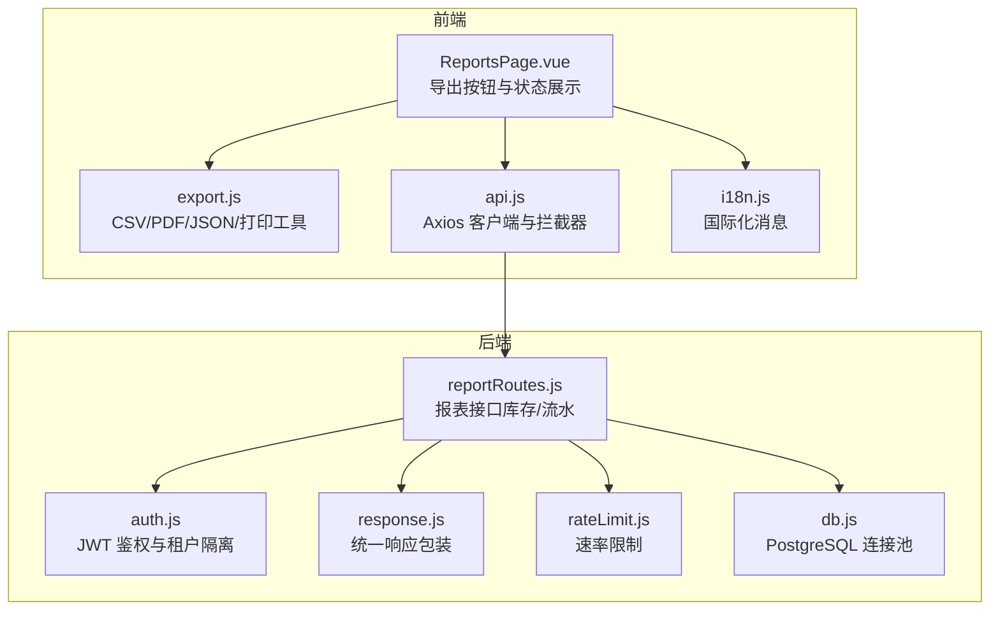
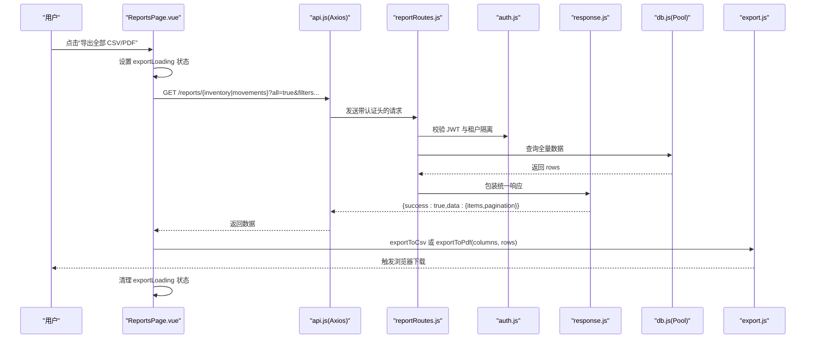
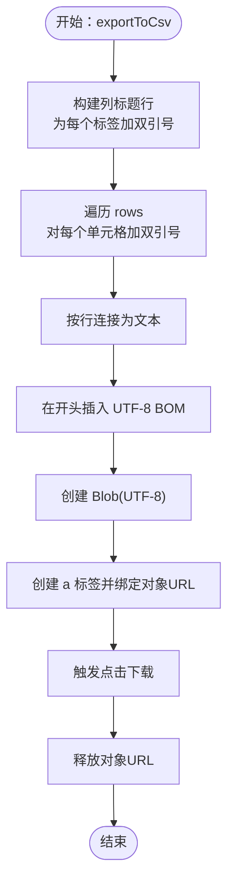
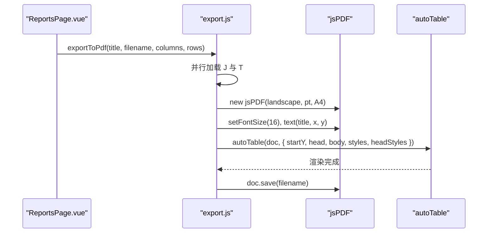
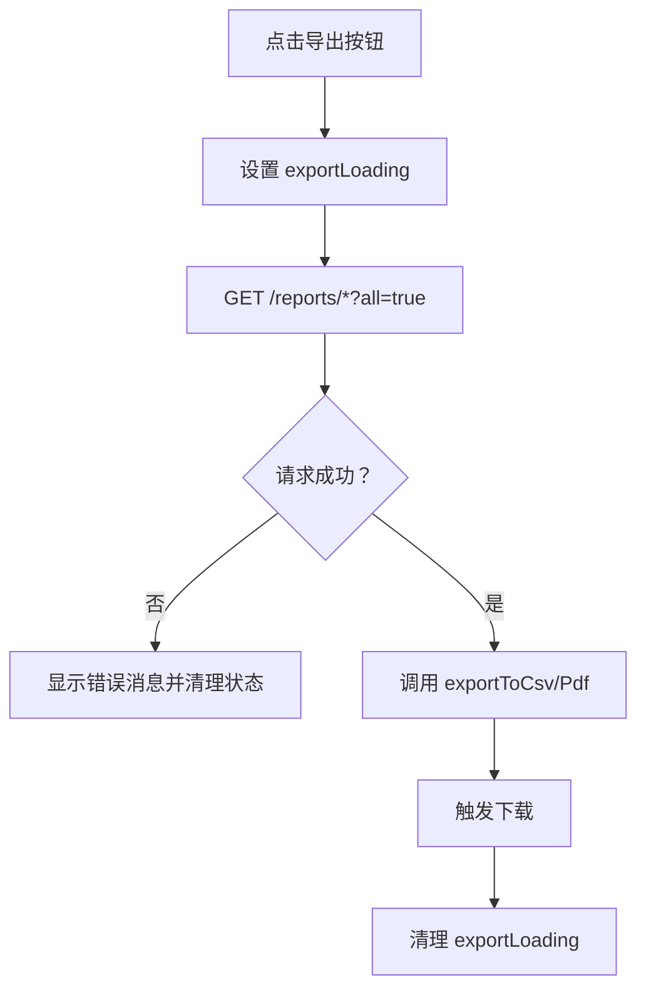
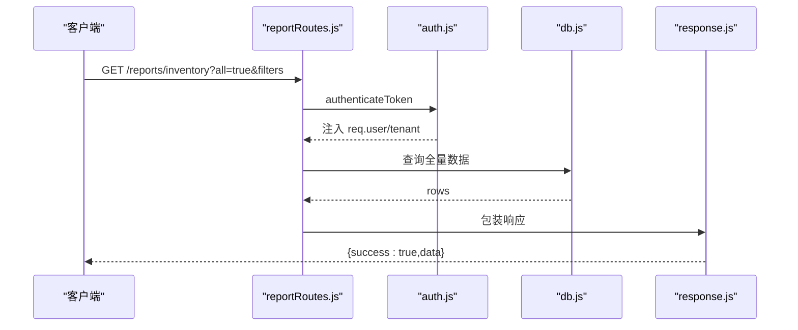
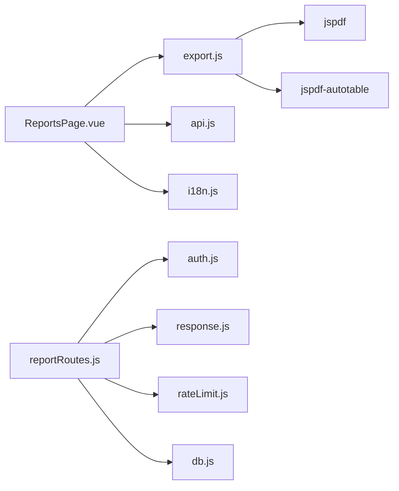

# 报表导出功能

<cite>
**本文引用的文件**
- [export.js](file://web/src/utils/export.js)
- [ReportsPage.vue](file://web/src/pages/ReportsPage.vue)
- [reportRoutes.js](file://server/src/routes/reportRoutes.js)
- [api.js](file://web/src/services/api.js)
- [i18n.js](file://web/src/utils/i18n.js)
- [auth.js](file://server/src/middleware/auth.js)
- [response.js](file://server/src/middleware/response.js)
- [rateLimit.js](file://server/src/middleware/rateLimit.js)
- [db.js](file://server/src/config/db.js)
</cite>

## 目录
1. [简介](#简介)
2. [项目结构](#项目结构)
3. [核心组件](#核心组件)
4. [架构概览](#架构概览)
5. [详细组件分析](#详细组件分析)
6. [依赖关系分析](#依赖关系分析)
7. [性能考量](#性能考量)
8. [故障排除指南](#故障排除指南)
9. [结论](#结论)
10. [附录](#附录)

## 简介
本文件系统性阐述报表导出功能的技术实现，覆盖前端 CSV 与 PDF 导出、后端报表接口、异步导出流程、模板定制化（列标题国际化、数据格式化、样式配置）、性能优化策略、错误处理与用户反馈、以及安全限制（文件大小、格式验证、防滥用）。目标读者既包括需要快速上手的开发者，也包括希望理解整体实现的非技术用户。

## 项目结构
报表导出涉及前后端协作：前端负责交互、模板与格式化、触发导出；后端提供报表数据接口，支持按筛选条件一次性导出全量数据，并通过鉴权与限流保障安全稳定。

图表来源
- [ReportsPage.vue:1-384](file://web/src/pages/ReportsPage.vue#L1-L384)
- [export.js:1-91](file://web/src/utils/export.js#L1-L91)
- [api.js:1-45](file://web/src/services/api.js#L1-L45)
- [reportRoutes.js:1-261](file://server/src/routes/reportRoutes.js#L1-L261)
- [auth.js:1-87](file://server/src/middleware/auth.js#L1-L87)
- [response.js:1-61](file://server/src/middleware/response.js#L1-L61)
- [rateLimit.js:1-39](file://server/src/middleware/rateLimit.js#L1-L39)
- [db.js:1-29](file://server/src/config/db.js#L1-L29)

章节来源
- [ReportsPage.vue:1-384](file://web/src/pages/ReportsPage.vue#L1-L384)
- [export.js:1-91](file://web/src/utils/export.js#L1-L91)
- [api.js:1-45](file://web/src/services/api.js#L1-L45)
- [reportRoutes.js:1-261](file://server/src/routes/reportRoutes.js#L1-L261)

## 核心组件
- 前端导出工具
  - CSV 导出：生成 UTF-8 BOM 的 CSV 文本，转为 Blob 并触发浏览器下载。
  - PDF 导出：动态加载 jspdf 与 jspdf-autotable，设置页面方向与样式，渲染表头与数据。
  - JSON 导出：序列化数据为 JSON 并下载。
  - HTML 打印：在新窗口输出带样式的 HTML 表格并调用浏览器打印。
- 前端报表页面
  - 提供“导出全部 CSV/PDF”按钮，结合 loading 与 exportLoading 状态反馈。
  - 使用国际化消息与本地化列标题。
  - 支持按当前筛选条件一次性拉取全量数据再导出。
- 后端报表接口
  - 库存报表：支持搜索、分页；当查询参数 all=true 时一次性返回全量数据。
  - 流水报表：支持时间范围、关键词搜索与分页；同样支持 all=true。
  - 鉴权：所有报表接口均需 JWT 认证，并按租户隔离数据。
  - 统一响应：后端统一包装 success/data/requestId，便于前端消费。
  - 速率限制：默认每分钟最多 30 次请求，超过则返回 429。

章节来源
- [export.js:1-91](file://web/src/utils/export.js#L1-L91)
- [ReportsPage.vue:131-181](file://web/src/pages/ReportsPage.vue#L131-L181)
- [reportRoutes.js:17-132](file://server/src/routes/reportRoutes.js#L17-L132)
- [reportRoutes.js:135-258](file://server/src/routes/reportRoutes.js#L135-L258)
- [auth.js:5-61](file://server/src/middleware/auth.js#L5-L61)
- [response.js:9-34](file://server/src/middleware/response.js#L9-L34)
- [rateLimit.js:9-35](file://server/src/middleware/rateLimit.js#L9-L35)

## 架构概览
下图展示从用户点击导出按钮到文件下载的完整链路，包括前端状态管理、API 请求、后端鉴权与数据查询、以及导出工具生成文件并触发下载。

图表来源
- [ReportsPage.vue:131-181](file://web/src/pages/ReportsPage.vue#L131-L181)
- [api.js:8-24](file://web/src/services/api.js#L8-L24)
- [reportRoutes.js:17-132](file://server/src/routes/reportRoutes.js#L17-L132)
- [auth.js:5-61](file://server/src/middleware/auth.js#L5-L61)
- [response.js:9-34](file://server/src/middleware/response.js#L9-L34)
- [db.js:19-23](file://server/src/config/db.js#L19-L23)
- [export.js:1-91](file://web/src/utils/export.js#L1-L91)

## 详细组件分析

### CSV 导出实现
- 数据转换
  - 列标题与每行单元格均以双引号包裹，确保包含逗号或换行的字段正确解析。
  - 字符串化空值时使用空字符串，避免输出“undefined/null”。
- 字符编码与 BOM
  - 使用 UTF-8 编码并在内容前加入 U+FEFF BOM，提升 Excel 等工具的兼容性。
- 特殊字符转义
  - 双引号字符被替换为两个双引号，符合 CSV 转义规范。
- 文件下载
  - 将拼接后的 CSV 文本放入 Blob，创建临时 URL，触发 a 标签下载，随后释放对象 URL。

图表来源
- [export.js:1-20](file://web/src/utils/export.js#L1-L20)

章节来源
- [export.js:1-20](file://web/src/utils/export.js#L1-L20)

### PDF 导出实现
- 动态模块加载
  - 并行加载 jspdf 与 jspdf-autotable，避免阻塞主线程。
- 页面布局与样式
  - 方向：横向；单位：点；纸张：A4。
  - 标题：设置字号并定位。
  - 表格：设置起始坐标、表头、主体数据、字体大小、单元格内边距。
  - 表头样式：设置填充色等。
- 分页处理
  - autoTable 自动处理长表格的分页与跨页表头，无需手动干预。
- 下载保存
  - 调用文档实例保存方法触发下载。

图表来源
- [export.js:22-51](file://web/src/utils/export.js#L22-L51)
- [ReportsPage.vue:144-154](file://web/src/pages/ReportsPage.vue#L144-L154)

章节来源
- [export.js:22-51](file://web/src/utils/export.js#L22-L51)
- [ReportsPage.vue:144-154](file://web/src/pages/ReportsPage.vue#L144-L154)

### 异步导出与进度反馈
- 大数据量导出
  - 前端通过查询参数 all=true 拉取全量数据，避免分页多次请求。
- 进度提示
  - exportLoading 字段标识当前导出任务类型，UI 展示“正在按当前筛选条件导出全部结果…”。
- 错误处理
  - 导出过程中捕获异常，设置错误消息并清理导出状态。
- 超时管理
  - 当前实现未显式设置超时，建议在 Axios 层增加 timeout 配置以避免长时间挂起。

图表来源
- [ReportsPage.vue:131-181](file://web/src/pages/ReportsPage.vue#L131-L181)
- [api.js:8-24](file://web/src/services/api.js#L8-L24)

章节来源
- [ReportsPage.vue:131-181](file://web/src/pages/ReportsPage.vue#L131-L181)
- [api.js:8-24](file://web/src/services/api.js#L8-L24)

### 模板定制化支持
- 列标题国际化
  - 前端列定义直接使用本地化字符串，支持中英切换。
- 数据格式化
  - 示例：库存金额格式化为货币字符串；空值显示占位符。
- 样式配置
  - PDF 表头背景色、字体大小、单元格内边距等通过样式对象配置。
  - CSV 采用标准转义与 UTF-8 BOM，确保多语言与 Excel 兼容。

章节来源
- [ReportsPage.vue:33-60](file://web/src/pages/ReportsPage.vue#L33-L60)
- [i18n.js:1-189](file://web/src/utils/i18n.js#L1-L189)
- [export.js:41-48](file://web/src/utils/export.js#L41-L48)

### 后端报表接口与鉴权
- 接口能力
  - 库存报表：支持搜索（产品/仓库/类别）、分页；all=true 返回全量。
  - 流水报表：支持时间范围、关键词搜索、分页；all=true 返回全量。
- 鉴权与隔离
  - 所有路由前置 JWT 校验，校验失败返回 401；租户状态异常返回 403。
  - 租户 ID 注入到请求上下文，业务查询按 tenant_id 隔离。
- 统一响应
  - 成功：{success:true,data}；失败：{success:false,code,message,details,requestId}。
- 速率限制
  - 默认每分钟最多 30 次请求，超过返回 429 并设置 Retry-After。

图表来源
- [reportRoutes.js:17-132](file://server/src/routes/reportRoutes.js#L17-L132)
- [auth.js:5-61](file://server/src/middleware/auth.js#L5-L61)
- [db.js:19-23](file://server/src/config/db.js#L19-L23)
- [response.js:9-34](file://server/src/middleware/response.js#L9-L34)

章节来源
- [reportRoutes.js:17-132](file://server/src/routes/reportRoutes.js#L17-L132)
- [reportRoutes.js:135-258](file://server/src/routes/reportRoutes.js#L135-L258)
- [auth.js:5-61](file://server/src/middleware/auth.js#L5-L61)
- [response.js:9-34](file://server/src/middleware/response.js#L9-L34)
- [rateLimit.js:9-35](file://server/src/middleware/rateLimit.js#L9-L35)

## 依赖关系分析
- 前端
  - ReportsPage.vue 依赖 export.js、api.js、i18n.js。
  - export.js 依赖 jspdf 与 jspdf-autotable（动态导入）。
- 后端
  - reportRoutes.js 依赖 db.js、auth.js、response.js、rateLimit.js。
  - db.js 基于 pg 的连接池，支持按环境变量决定是否启用 SSL。

图表来源
- [ReportsPage.vue:1-384](file://web/src/pages/ReportsPage.vue#L1-L384)
- [export.js:22-26](file://web/src/utils/export.js#L22-L26)
- [api.js:1-45](file://web/src/services/api.js#L1-L45)
- [reportRoutes.js:1-261](file://server/src/routes/reportRoutes.js#L1-L261)
- [auth.js:1-87](file://server/src/middleware/auth.js#L1-L87)
- [response.js:1-61](file://server/src/middleware/response.js#L1-L61)
- [rateLimit.js:1-39](file://server/src/middleware/rateLimit.js#L1-L39)
- [db.js:1-29](file://server/src/config/db.js#L1-L29)

章节来源
- [ReportsPage.vue:1-384](file://web/src/pages/ReportsPage.vue#L1-L384)
- [export.js:22-26](file://web/src/utils/export.js#L22-L26)
- [reportRoutes.js:1-261](file://server/src/routes/reportRoutes.js#L1-L261)

## 性能考量
- 内存管理
  - CSV/PDF 生成在前端进行，全量数据一次性拼接可能造成内存压力。建议在大数据场景下：
    - 限制导出条数或默认只导出分页可见数据；
    - 对超大导出任务提供“分批导出”或“后台任务队列”方案。
- 流式处理
  - 当前实现未采用流式写入，建议后续引入 ReadableStream 或服务端流式导出（如服务端生成 CSV 并以流形式返回）。
- 并发导出
  - 前端未限制并发导出任务；建议：
    - 在 UI 层禁止同时发起多个导出；
    - 在后端为每个用户会话设置导出任务队列上限。
- 传输体积
  - 全量导出可能产生较大 JSON；建议：
    - 优先使用 CSV；
    - 对数值型字段进行必要的格式化与截断，减少冗余精度。

[本节为通用性能建议，不直接分析具体文件，故无章节来源]

## 故障排除指南
- 常见问题与处理
  - 导出按钮无响应
    - 检查 exportLoading 是否被正确清理；确认网络请求未被拦截器抛错。
  - 导出失败
    - 查看前端错误消息；检查后端统一响应中的 message 与 code。
  - 权限不足
    - 确认 JWT 是否存在且有效；检查租户状态是否为 ACTIVE。
  - 429 太多请求
    - 降低导出频率或调整速率限制配置。
- 用户反馈机制
  - UI 层通过 errorMessage 与 exportLoading 提示当前状态；
  - 后端通过 response.js 统一返回 {success, code, message, requestId}，便于前端定位问题。

章节来源
- [ReportsPage.vue:216-228](file://web/src/pages/ReportsPage.vue#L216-L228)
- [response.js:9-34](file://server/src/middleware/response.js#L9-L34)
- [rateLimit.js:23-29](file://server/src/middleware/rateLimit.js#L23-L29)
- [auth.js:5-61](file://server/src/middleware/auth.js#L5-L61)

## 结论
本导出功能以“前端模板 + 后端全量数据”的模式实现，具备良好的扩展性与用户体验。CSV 与 PDF 工具分别满足轻量与专业排版需求；国际化与样式配置使模板易于定制。建议在后续版本中引入流式导出、导出队列与超时控制，进一步提升大体量场景下的稳定性与性能。

## 附录
- 安全与合规要点
  - 文件大小限制：后端未对导出文件大小做硬性限制，建议在服务端生成导出时限制最大行数或字节数。
  - 格式验证：导出仅支持 CSV/PDF/JSON/HTML 打印，未发现恶意格式风险。
  - 恶意文件防护：导出流程不接收外部文件输入，不存在上传类风险。
  - 防滥用：已启用速率限制与鉴权，建议结合 IP 黑名单与导出限额策略。

章节来源
- [reportRoutes.js:17-132](file://server/src/routes/reportRoutes.js#L17-L132)
- [rateLimit.js:9-35](file://server/src/middleware/rateLimit.js#L9-L35)
- [auth.js:5-61](file://server/src/middleware/auth.js#L5-L61)