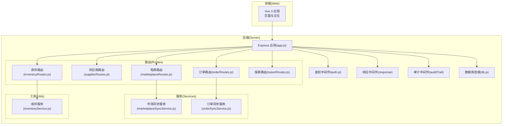
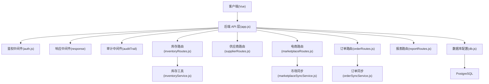
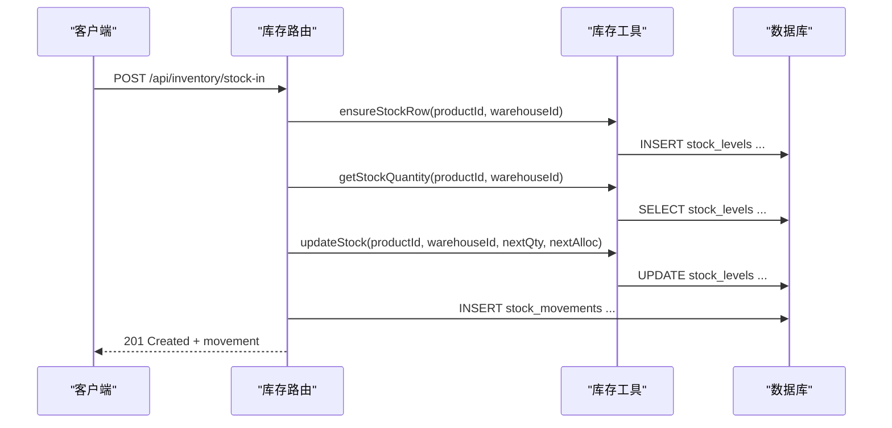
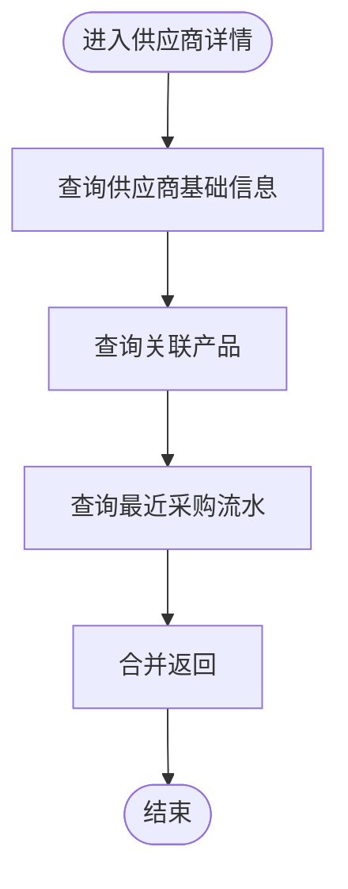
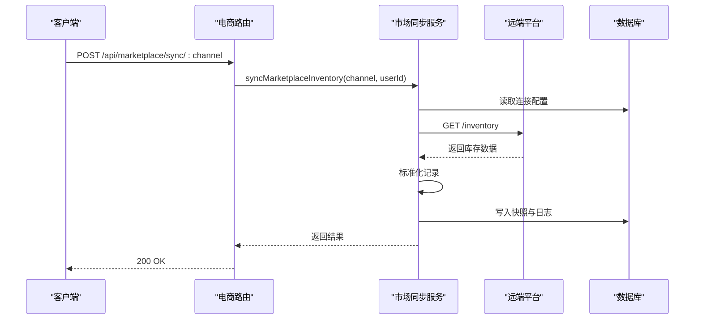
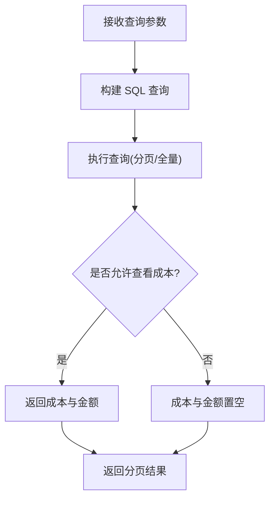
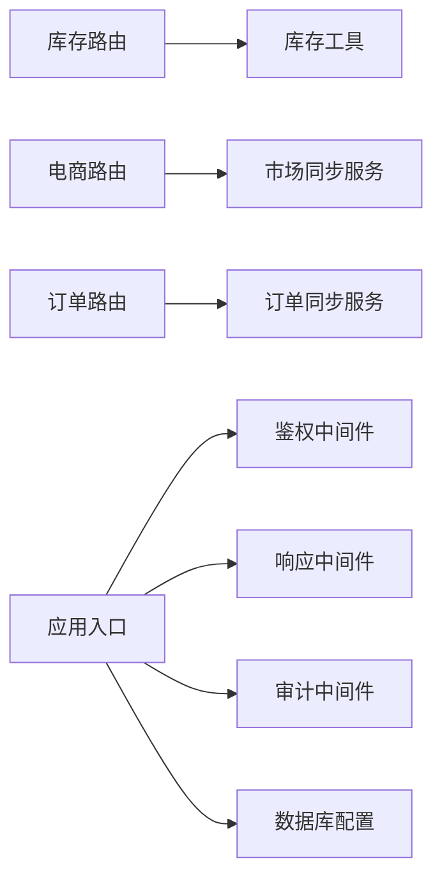
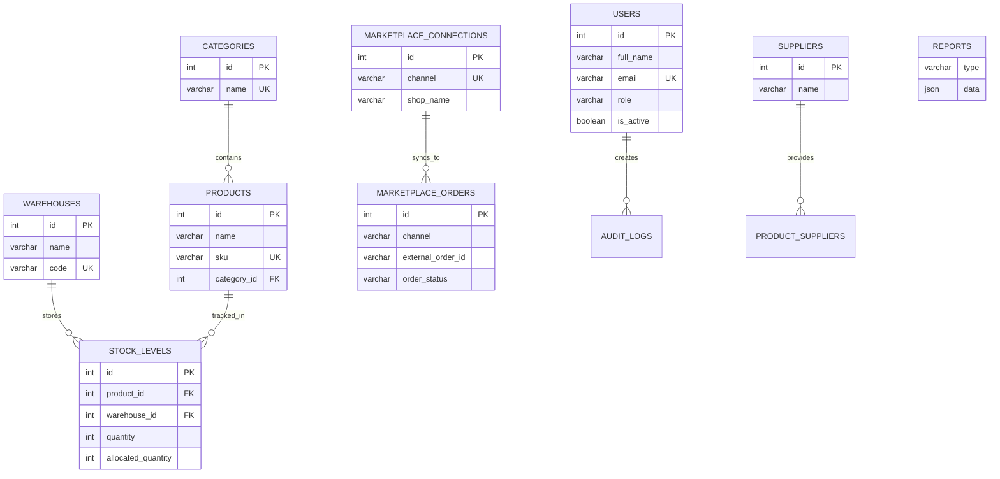

# 核心功能模块

<cite>
**本文引用的文件**
- [README.md](file://README.md)
- [app.js](file://server/src/app.js)
- [package.json](file://server/package.json)
- [schema.sql](file://server/database/schema.sql)
- [inventoryRoutes.js](file://server/src/routes/inventoryRoutes.js)
- [supplierRoutes.js](file://server/src/routes/supplierRoutes.js)
- [marketplaceRoutes.js](file://server/src/routes/marketplaceRoutes.js)
- [orderRoutes.js](file://server/src/routes/orderRoutes.js)
- [reportRoutes.js](file://server/src/routes/reportRoutes.js)
- [inventoryService.js](file://server/src/utils/inventoryService.js)
- [marketplaceSyncService.js](file://server/src/services/marketplaceSyncService.js)
- [orderSyncService.js](file://server/src/services/orderSyncService.js)
- [auth.js](file://server/src/middleware/auth.js)
- [db.js](file://server/src/config/db.js)
</cite>

## 目录
1. [简介](#简介)
2. [项目结构](#项目结构)
3. [核心组件](#核心组件)
4. [架构总览](#架构总览)
5. [详细组件分析](#详细组件分析)
6. [依赖分析](#依赖分析)
7. [性能考虑](#性能考虑)
8. [故障排查指南](#故障排查指南)
9. [结论](#结论)
10. [附录](#附录)

## 简介
本系统是一个基于 Vue 3 + Node.js + Express + PostgreSQL 的全栈库存管理系统，覆盖库存、产品、供应商、电商集成、订单处理与报表分析等核心模块。系统提供角色权限控制、低库存预警、库存盘点、电商多平台对接、审计日志与统一错误处理等能力，满足中小企业的日常运营与决策分析需求。

## 项目结构
后端采用 Express 框架，通过路由模块化组织功能；数据库采用 PostgreSQL，结构由 schema.sql 定义；前端使用 Vue 3 构建仪表盘界面。整体通过中间件实现鉴权、响应封装、审计与限流；服务层负责电商同步与订单同步；工具层封装通用业务逻辑（如库存操作）。

**图表来源**
- [app.js:1-67](file://server/src/app.js#L1-L67)
- [auth.js:1-46](file://server/src/middleware/auth.js#L1-L46)
- [db.js:1-25](file://server/src/config/db.js#L1-L25)
- [inventoryRoutes.js:1-493](file://server/src/routes/inventoryRoutes.js#L1-L493)
- [supplierRoutes.js:1-370](file://server/src/routes/supplierRoutes.js#L1-L370)
- [marketplaceRoutes.js:1-641](file://server/src/routes/marketplaceRoutes.js#L1-L641)
- [orderRoutes.js:1-113](file://server/src/routes/orderRoutes.js#L1-L113)
- [reportRoutes.js:1-252](file://server/src/routes/reportRoutes.js#L1-L252)
- [inventoryService.js:1-45](file://server/src/utils/inventoryService.js#L1-L45)
- [marketplaceSyncService.js:1-146](file://server/src/services/marketplaceSyncService.js#L1-L146)
- [orderSyncService.js:1-119](file://server/src/services/orderSyncService.js#L1-L119)

**章节来源**
- [README.md:1-105](file://README.md#L1-L105)
- [app.js:1-67](file://server/src/app.js#L1-L67)

## 核心组件
- 鉴权与权限控制：JWT 验证与基于角色的授权，确保不同角色访问受限资源。
- 数据库连接：基于环境变量的连接池配置，支持本地与生产 SSL 判定。
- 路由模块：按功能拆分，统一挂载在 /api 下，便于扩展与维护。
- 电商集成：支持 Shopee/Lazada/TikTok，提供连接配置、OAuth、库存与订单同步、错误日志与状态概览。
- 库存管理：支持入库、出库、调拨、预留/释放、可用量计算与流水查询。
- 供应商管理：供应商增删改查、状态变更、关联产品与最近采购记录。
- 报表分析：库存报表与流水报表，支持搜索、分页与成本字段可见性控制。
- 审计与错误：统一审计日志、错误中间件与响应封装，保障可观测性与一致性。

**章节来源**
- [auth.js:1-46](file://server/src/middleware/auth.js#L1-L46)
- [db.js:1-25](file://server/src/config/db.js#L1-L25)
- [app.js:1-67](file://server/src/app.js#L1-L67)
- [marketplaceRoutes.js:1-641](file://server/src/routes/marketplaceRoutes.js#L1-L641)
- [inventoryRoutes.js:1-493](file://server/src/routes/inventoryRoutes.js#L1-L493)
- [supplierRoutes.js:1-370](file://server/src/routes/supplierRoutes.js#L1-L370)
- [reportRoutes.js:1-252](file://server/src/routes/reportRoutes.js#L1-L252)

## 架构总览
系统采用前后端分离架构，后端通过中间件统一处理安全、日志与审计；路由层负责对外 API；服务层封装第三方电商同步；工具层抽象通用业务逻辑；数据库通过连接池提供高并发访问。

**图表来源**
- [app.js:1-67](file://server/src/app.js#L1-L67)
- [auth.js:1-46](file://server/src/middleware/auth.js#L1-L46)
- [db.js:1-25](file://server/src/config/db.js#L1-L25)
- [inventoryRoutes.js:1-493](file://server/src/routes/inventoryRoutes.js#L1-L493)
- [supplierRoutes.js:1-370](file://server/src/routes/supplierRoutes.js#L1-L370)
- [marketplaceRoutes.js:1-641](file://server/src/routes/marketplaceRoutes.js#L1-L641)
- [orderRoutes.js:1-113](file://server/src/routes/orderRoutes.js#L1-L113)
- [reportRoutes.js:1-252](file://server/src/routes/reportRoutes.js#L1-L252)
- [inventoryService.js:1-45](file://server/src/utils/inventoryService.js#L1-L45)
- [marketplaceSyncService.js:1-146](file://server/src/services/marketplaceSyncService.js#L1-L146)
- [orderSyncService.js:1-119](file://server/src/services/orderSyncService.js#L1-L119)

## 详细组件分析

### 库存管理模块
- 功能特性
  - 库存总览：支持按仓库、品类、关键词与低库存筛选，分页与全量加载。
  - 流水查询：按类型与关键词检索，支持分页。
  - 库存变动：入库(IN)、出库(OUT)、调拨(TRANSFER)，均在事务中保证一致性。
  - 库存分配：预留/释放订单占用，更新可用量并生成流水。
- 关键流程
  - 创建库存行：若不存在则插入默认行。
  - 读取库存：返回在手与已分配数量。
  - 更新库存：原子性更新数量与更新时间戳。
  - 变动入账：根据类型写入 stock_movements 并记录操作人。
- 使用场景
  - 日常出入库与调拨作业。
  - 订单履约前的库存占用与释放。
  - 大批量库存报表导出。
- API 示例（路径）
  - GET /api/inventory：分页查询库存总览
  - GET /api/inventory/transactions：分页查询流水
  - POST /api/inventory/stock-in：入库
  - POST /api/inventory/stock-out：出库
  - POST /api/inventory/transfer：调拨
  - POST /api/inventory/allocate：预留/释放
- 错误处理
  - 参数校验失败返回 400。
  - 可用量不足或负数分配抛出业务异常，回滚事务并返回错误信息。
  - 服务器内部错误统一由兜底中间件处理。

**图表来源**
- [inventoryRoutes.js:229-403](file://server/src/routes/inventoryRoutes.js#L229-L403)
- [inventoryService.js:1-45](file://server/src/utils/inventoryService.js#L1-L45)

**章节来源**
- [inventoryRoutes.js:1-493](file://server/src/routes/inventoryRoutes.js#L1-L493)
- [inventoryService.js:1-45](file://server/src/utils/inventoryService.js#L1-L45)

### 产品与分类管理（概述）
- 数据模型要点
  - 产品：名称、SKU、条码、品类、单位、成本价、建议价、重购点等。
  - 分类：名称唯一，描述与时间戳。
  - 产品图片与组合品：支持主图排序、组合内子项数量。
- 业务流程
  - 新增/编辑产品时，支持设置成本价、建议价与重购点。
  - 产品与仓库维度的库存水平存储于 stock_levels。
- API 与页面
  - 前端页面：ProductsPage、ProductDetailPage、ProductFormPage。
  - 后端未提供独立的产品路由文件，产品相关操作通过库存与电商模块间接体现。

**章节来源**
- [schema.sql:32-124](file://server/database/schema.sql#L32-L124)

### 供应商管理模块
- 功能特性
  - 供应商列表：支持状态过滤、关键词搜索、多种排序方式与分页。
  - 供应商详情：基本信息、关联产品清单、最近采购流水。
  - 供应商维护：创建、更新、启用/停用。
- API 示例（路径）
  - GET /api/suppliers：分页查询供应商
  - GET /api/suppliers/:id：供应商详情
  - POST /api/suppliers：创建供应商
  - PUT /api/suppliers/:id：更新供应商
  - PATCH /api/suppliers/:id/status：更新状态
  - DELETE /api/suppliers/:id：删除供应商
- 审计与权限
  - 所有变更写入审计上下文，仅管理员与经理可操作。

**图表来源**
- [supplierRoutes.js:171-232](file://server/src/routes/supplierRoutes.js#L171-L232)

**章节来源**
- [supplierRoutes.js:1-370](file://server/src/routes/supplierRoutes.js#L1-L370)

### 电商集成与订单处理模块
- 支持平台：Shopee、Lazada、TikTok。
- 连接与认证
  - 连接配置：保存渠道、店铺名、API 基址、访问令牌、元数据与启用状态。
  - OAuth：生成 state、持久化过期时间、回调校验与清理。
  - 连接测试：调用远端健康接口验证连通性。
- 库存同步
  - 从远端拉取库存快照，标准化字段，写入 marketplace_inventory_snapshots 并记录同步日志。
- 订单同步
  - 从远端拉取订单，标准化后写入 marketplace_orders 与 marketplace_order_items，去重并更新时间戳。
- 状态概览与错误日志
  - 汇总各渠道连接、最后同步时间、失败次数、订单与发货单数量、近七日错误数。
  - 记录错误日志以便追踪。

**图表来源**
- [marketplaceRoutes.js:144-202](file://server/src/routes/marketplaceRoutes.js#L144-L202)
- [marketplaceSyncService.js:100-140](file://server/src/services/marketplaceSyncService.js#L100-L140)

**章节来源**
- [marketplaceRoutes.js:1-641](file://server/src/routes/marketplaceRoutes.js#L1-L641)
- [marketplaceSyncService.js:1-146](file://server/src/services/marketplaceSyncService.js#L1-L146)
- [orderSyncService.js:1-119](file://server/src/services/orderSyncService.js#L1-L119)

### 报表分析模块
- 库存报表
  - 支持按产品、SKU、条码、仓库、品类搜索，分页与全量导出。
  - 可见性控制：仅具备成本查看权限的用户可见成本价与库存金额。
- 流水报表
  - 支持起止时间、关键词搜索与分页。
- API 示例（路径）
  - GET /api/reports/inventory：库存报表
  - GET /api/reports/movements：流水报表

**图表来源**
- [reportRoutes.js:16-127](file://server/src/routes/reportRoutes.js#L16-L127)

**章节来源**
- [reportRoutes.js:1-252](file://server/src/routes/reportRoutes.js#L1-L252)

### 订单处理模块
- 功能特性
  - 订单同步：按渠道拉取订单并写入数据库，支持去重与更新。
  - 订单列表：按渠道、状态、关键词搜索，分页。
  - 订单详情：返回订单与明细。
- API 示例（路径）
  - POST /api/orders/sync/:channel：同步订单
  - GET /api/orders：订单列表
  - GET /api/orders/:id：订单详情

**章节来源**
- [orderRoutes.js:1-113](file://server/src/routes/orderRoutes.js#L1-L113)
- [orderSyncService.js:1-119](file://server/src/services/orderSyncService.js#L1-L119)

## 依赖分析
- 组件耦合
  - 路由层依赖中间件与数据库；库存路由依赖库存工具；电商路由依赖同步服务；报表路由依赖成本访问控制。
- 外部依赖
  - 数据库：PostgreSQL（pg 连接池）。
  - 电商：远端平台 API（Shopee/Lazada/TikTok），通过环境变量或数据库配置提供端点与令牌。
- 循环依赖
  - 未发现循环依赖迹象，模块职责清晰。

**图表来源**
- [inventoryRoutes.js:1-493](file://server/src/routes/inventoryRoutes.js#L1-L493)
- [inventoryService.js:1-45](file://server/src/utils/inventoryService.js#L1-L45)
- [marketplaceRoutes.js:1-641](file://server/src/routes/marketplaceRoutes.js#L1-L641)
- [marketplaceSyncService.js:1-146](file://server/src/services/marketplaceSyncService.js#L1-L146)
- [orderRoutes.js:1-113](file://server/src/routes/orderRoutes.js#L1-L113)
- [orderSyncService.js:1-119](file://server/src/services/orderSyncService.js#L1-L119)
- [auth.js:1-46](file://server/src/middleware/auth.js#L1-L46)
- [db.js:1-25](file://server/src/config/db.js#L1-L25)

**章节来源**
- [package.json:15-29](file://server/package.json#L15-L29)

## 性能考虑
- 分页与索引
  - 列表接口普遍支持分页，配合数据库索引（如库存、订单、供应商、审计日志等）提升查询性能。
- 并发与事务
  - 库存变动在事务中执行，避免并发导致的数据不一致。
- 限流
  - 电商同步与 OAuth 接口配置了速率限制，防止突发流量影响稳定性。
- 导出优化
  - 报表支持“全量”模式，前端可拉取更大页码以支持导出。

**章节来源**
- [inventoryRoutes.js:17-151](file://server/src/routes/inventoryRoutes.js#L17-L151)
- [reportRoutes.js:16-249](file://server/src/routes/reportRoutes.js#L16-L249)
- [marketplaceRoutes.js:11-12](file://server/src/routes/marketplaceRoutes.js#L11-L12)

## 故障排查指南
- 登录与健康检查
  - 后端健康：访问 /api/health 确认服务运行。
  - 前端登录：访问登录页，若提示“后端服务正常”，可直接登录。
- 数据库初始化
  - 确保已创建数据库并执行 schema.sql 与 seed.sql。
- 电商连接
  - 检查连接配置是否完整（端点、令牌），并通过“连接测试”验证。
  - 查看错误日志与同步日志定位问题。
- 权限与鉴权
  - 确认 JWT 有效且用户存在且启用。
  - 不同角色对应不同操作权限，403 表示无权限。
- 统一错误处理
  - 服务器内部错误由兜底中间件统一返回，避免泄露堆栈。

**章节来源**
- [README.md:66-105](file://README.md#L66-L105)
- [app.js:57-64](file://server/src/app.js#L57-L64)
- [auth.js:5-29](file://server/src/middleware/auth.js#L5-L29)

## 结论
该系统围绕库存为核心，向上承接电商订单与供应商管理，向下输出报表分析，形成闭环。通过中间件与服务层解耦，模块边界清晰，具备良好的扩展性与可维护性。建议在生产环境中完善监控告警、缓存策略与更细粒度的权限控制。

## 附录

### 数据模型（简化 ER 图）

**图表来源**
- [schema.sql:2-447](file://server/database/schema.sql#L2-L447)