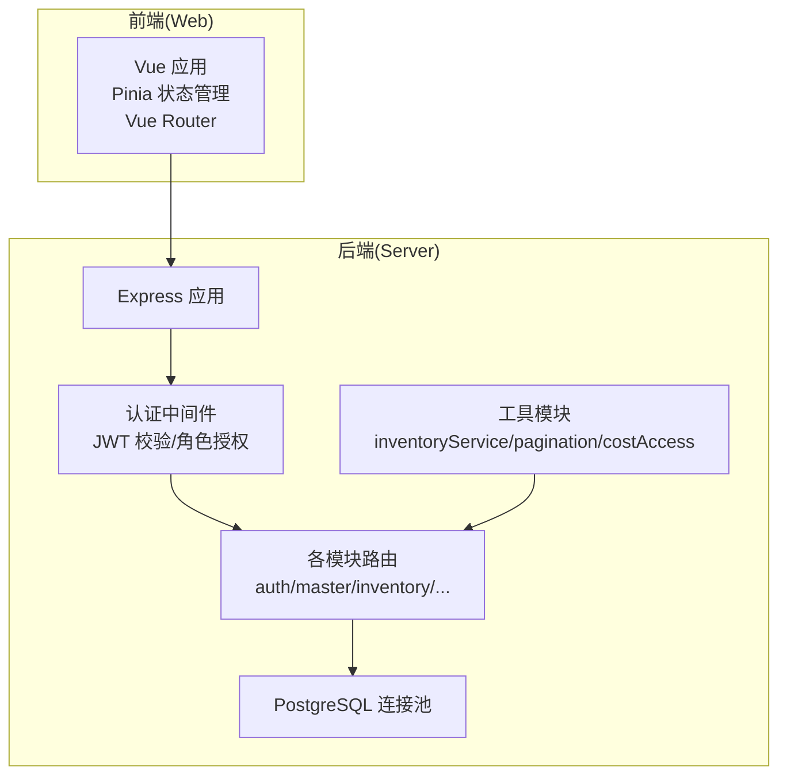
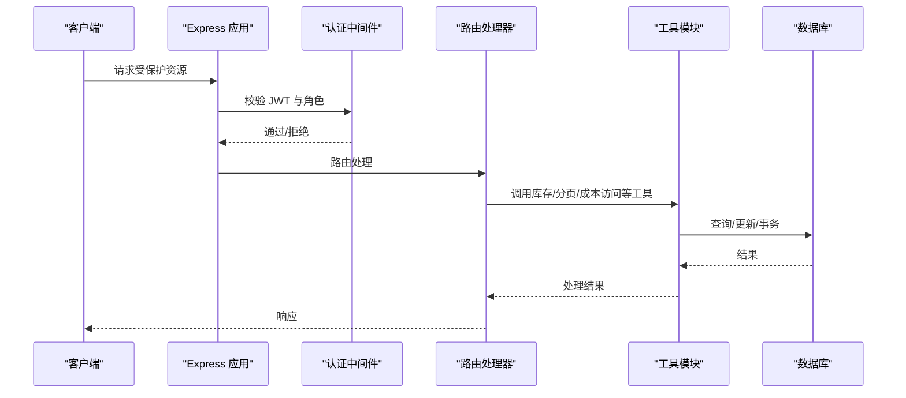
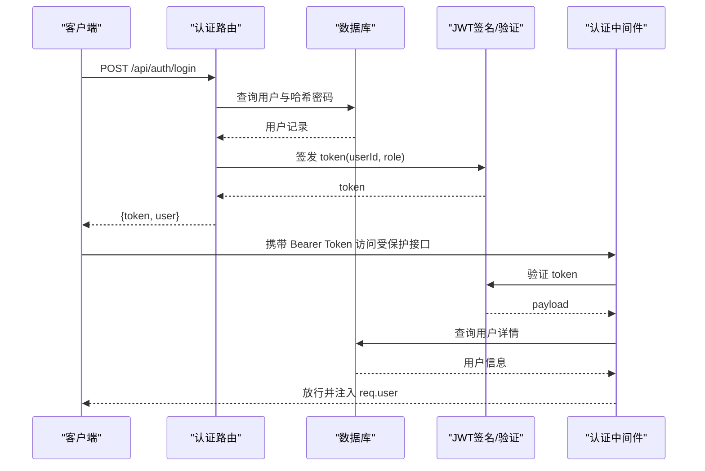
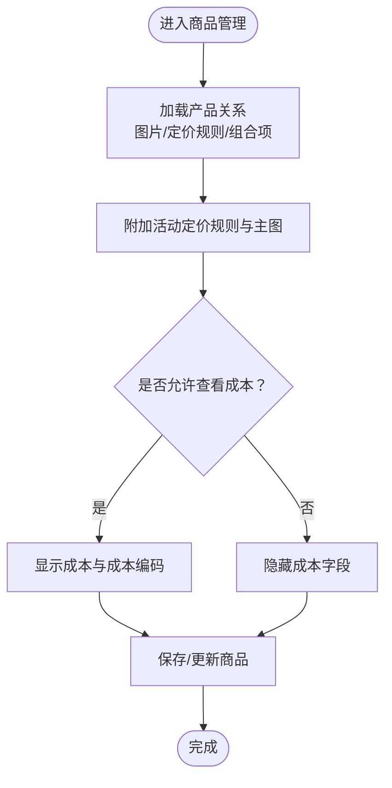
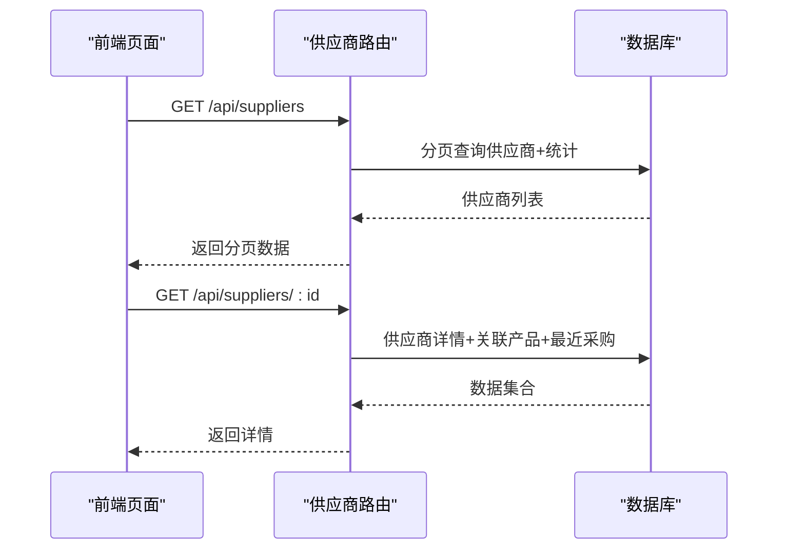
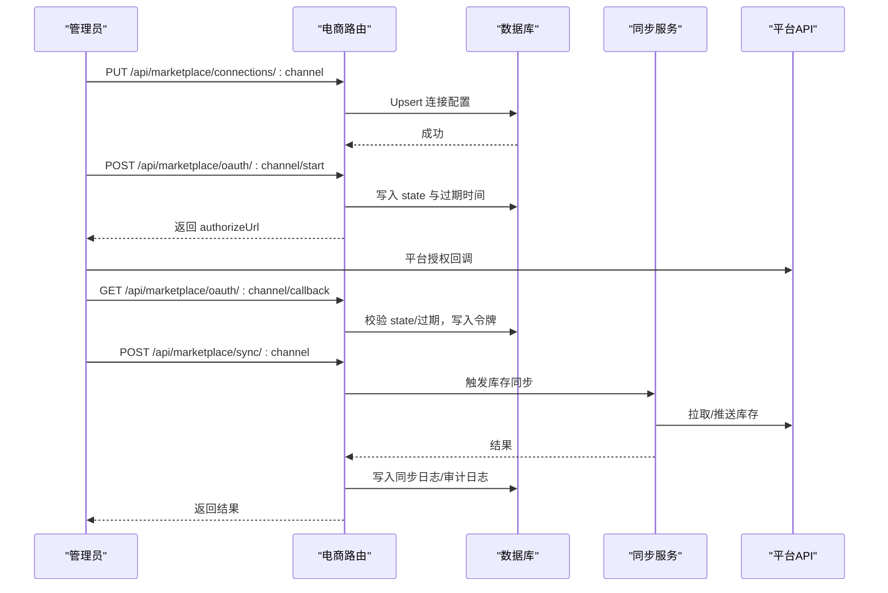
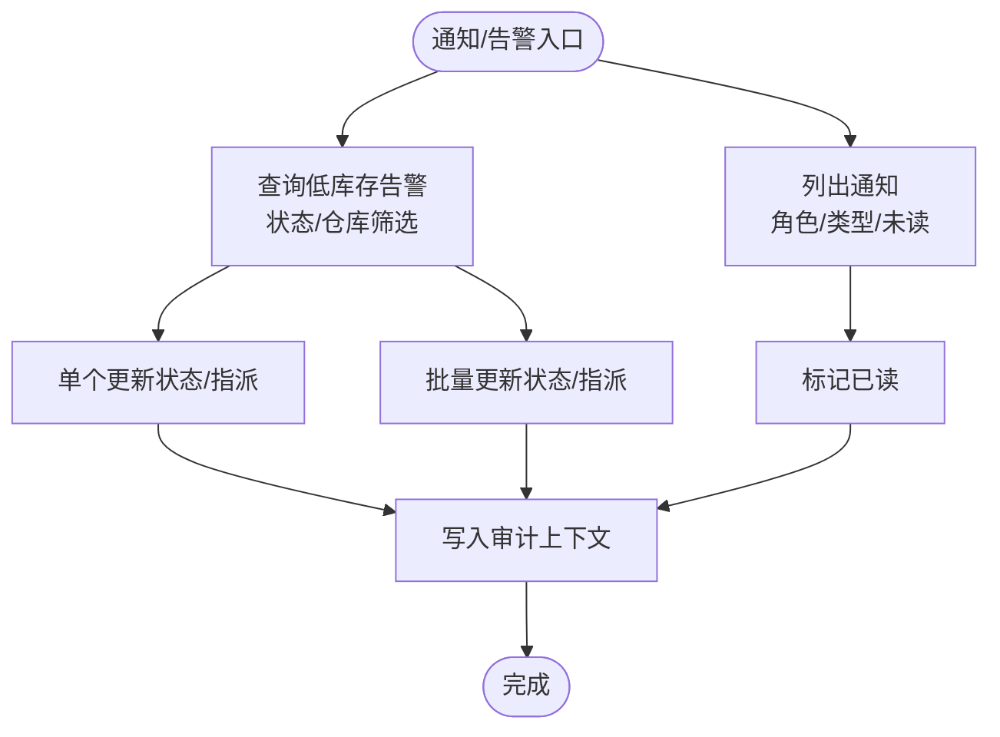
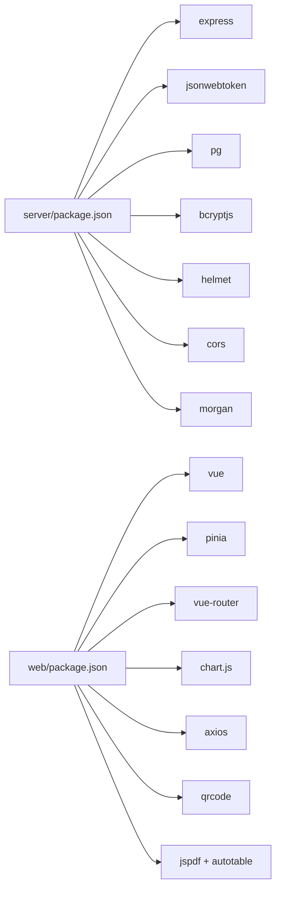

# 核心功能模块

<cite>
**本文引用的文件**
- [server/src/app.js](file://server/src/app.js)
- [server/src/server.js](file://server/src/server.js)
- [server/src/middleware/auth.js](file://server/src/middleware/auth.js)
- [server/src/routes/authRoutes.js](file://server/src/routes/authRoutes.js)
- [server/src/routes/inventoryRoutes.js](file://server/src/routes/inventoryRoutes.js)
- [server/src/routes/masterRoutes.js](file://server/src/routes/masterRoutes.js)
- [server/src/routes/supplierRoutes.js](file://server/src/routes/supplierRoutes.js)
- [server/src/routes/marketplaceRoutes.js](file://server/src/routes/marketplaceRoutes.js)
- [server/src/routes/reportRoutes.js](file://server/src/routes/reportRoutes.js)
- [server/src/routes/alertsRoutes.js](file://server/src/routes/alertsRoutes.js)
- [server/src/routes/notificationRoutes.js](file://server/src/routes/notificationRoutes.js)
- [server/src/utils/inventoryService.js](file://server/src/utils/inventoryService.js)
- [server/package.json](file://server/package.json)
- [web/src/main.js](file://web/src/main.js)
- [web/package.json](file://web/package.json)
</cite>

## 目录
1. [引言](#引言)
2. [项目结构](#项目结构)
3. [核心组件](#核心组件)
4. [架构总览](#架构总览)
5. [详细组件分析](#详细组件分析)
6. [依赖关系分析](#依赖关系分析)
7. [性能考量](#性能考量)
8. [故障排查指南](#故障排查指南)
9. [结论](#结论)
10. [附录](#附录)

## 引言
本文件面向库存管理系统的核心功能模块，围绕以下主题展开：用户认证与权限控制（JWT、角色授权、会话管理）、商品与分类管理、供应商管理、库存管理（查询、出入库、调拨、分配/释放、盘点）、仓库管理、电商集成（平台连接、商品同步、订单同步）、报表分析（库存与流水）、通知与告警中心。文档在技术深度与可读性之间取得平衡，既提供代码级分析，也给出可视化图示、流程图与最佳实践建议。

## 项目结构
后端基于 Express，采用模块化路由组织，中间件统一处理安全、审计与响应格式；前端基于 Vue 3 + Pinia + Vue Router，通过 Axios 调用后端 API。数据库连接池由 pg 提供，启动时进行数据库连通性检查。



**图表来源**
- [server/src/app.js:25-53](file://server/src/app.js#L25-L53)
- [server/src/server.js:13-25](file://server/src/server.js#L13-L25)
- [server/src/middleware/auth.js:5-29](file://server/src/middleware/auth.js#L5-L29)
- [server/src/utils/inventoryService.js:1-45](file://server/src/utils/inventoryService.js#L1-L45)

**章节来源**
- [server/src/app.js:1-65](file://server/src/app.js#L1-L65)
- [server/src/server.js:1-28](file://server/src/server.js#L1-L28)
- [web/src/main.js:1-14](file://web/src/main.js#L1-L14)

## 核心组件
- 认证与权限：JWT 验证、角色授权中间件，登录接口返回 token 与用户信息，支持刷新登录态。
- 商品与分类：产品主数据维护、定价规则、图片与组合品管理、成本价格历史与变更通知。
- 供应商：供应商增删改查、状态切换、与产品关联、最近采购记录。
- 库存：库存总览、流水查询、入库/出库/调拨、库存分配/释放、事务一致性保障。
- 仓库：仓库查询与筛选、启用状态控制。
- 电商集成：Shopee/Lazada/TikTok 平台连接、OAuth 启动与回调、库存/订单同步、错误日志与健康检查。
- 报表：库存报表、流水报表（时间范围、关键词）。
- 通知与告警：系统通知（按角色/类型过滤）、低库存告警（状态、指派、批量更新）。

**章节来源**
- [server/src/routes/authRoutes.js:17-69](file://server/src/routes/authRoutes.js#L17-L69)
- [server/src/middleware/auth.js:32-40](file://server/src/middleware/auth.js#L32-L40)
- [server/src/routes/masterRoutes.js:664-800](file://server/src/routes/masterRoutes.js#L664-L800)
- [server/src/routes/supplierRoutes.js:23-92](file://server/src/routes/supplierRoutes.js#L23-L92)
- [server/src/routes/inventoryRoutes.js:17-151](file://server/src/routes/inventoryRoutes.js#L17-L151)
- [server/src/routes/marketplaceRoutes.js:47-70](file://server/src/routes/marketplaceRoutes.js#L47-L70)
- [server/src/routes/reportRoutes.js:16-127](file://server/src/routes/reportRoutes.js#L16-L127)
- [server/src/routes/alertsRoutes.js:80-197](file://server/src/routes/alertsRoutes.js#L80-L197)
- [server/src/routes/notificationRoutes.js:15-54](file://server/src/routes/notificationRoutes.js#L15-L54)

## 架构总览
后端启动时进行数据库连通性校验，随后挂载统一中间件与路由。认证中间件对所有受保护路由生效，角色授权中间件限制特定操作的执行者范围。库存相关接口通过工具模块确保事务一致性与库存行存在性。



**图表来源**
- [server/src/app.js:27-53](file://server/src/app.js#L27-L53)
- [server/src/middleware/auth.js:5-29](file://server/src/middleware/auth.js#L5-L29)
- [server/src/utils/inventoryService.js:1-45](file://server/src/utils/inventoryService.js#L1-L45)
- [server/src/routes/inventoryRoutes.js:229-403](file://server/src/routes/inventoryRoutes.js#L229-L403)

**章节来源**
- [server/src/app.js:27-53](file://server/src/app.js#L27-L53)
- [server/src/server.js:13-25](file://server/src/server.js#L13-L25)

## 详细组件分析

### 用户认证与权限控制
- JWT 登录：校验邮箱/密码，生成带有效期的 token，返回用户信息（含偏好货币）。
- 刷新登录态：携带 Bearer Token 的请求头访问“/api/auth/me”恢复用户上下文。
- 中间件：
  - authenticateToken：解析 Authorization 头，验证 JWT，查询用户并注入 req.user。
  - authorizeRoles：基于用户角色放行或拒绝。
- 安全与审计：统一响应中间件与审计日志中间件贯穿应用。



**图表来源**
- [server/src/routes/authRoutes.js:17-69](file://server/src/routes/authRoutes.js#L17-L69)
- [server/src/middleware/auth.js:5-29](file://server/src/middleware/auth.js#L5-L29)

**章节来源**
- [server/src/routes/authRoutes.js:17-69](file://server/src/routes/authRoutes.js#L17-L69)
- [server/src/middleware/auth.js:32-40](file://server/src/middleware/auth.js#L32-L40)

### 商品与分类管理
- 商品主数据：生成唯一产品编码、标准化价格、定价规则（默认/多渠道）、组合品（套餐）拆解与保存。
- 成本与价格：成本价格变更记录与阈值触发的通知策略，支持成本字段遮蔽与成本访问令牌。
- 关系加载：批量加载图片、定价规则、组合项，附加活动定价规则与主图。
- 分类：支持搜索、分页、启用状态筛选。



**图表来源**
- [server/src/routes/masterRoutes.js:465-490](file://server/src/routes/masterRoutes.js#L465-L490)
- [server/src/routes/masterRoutes.js:115-137](file://server/src/routes/masterRoutes.js#L115-L137)

**章节来源**
- [server/src/routes/masterRoutes.js:18-93](file://server/src/routes/masterRoutes.js#L18-L93)
- [server/src/routes/masterRoutes.js:465-490](file://server/src/routes/masterRoutes.js#L465-L490)

### 供应商管理
- 供应商列表：支持关键词搜索、状态筛选、排序（名称/创建/更新/交货期），分页。
- 供应商详情：基本信息、关联产品、最近采购流水。
- 供应商维护：创建/更新/状态切换/删除，审计上下文记录。



**图表来源**
- [server/src/routes/supplierRoutes.js:23-92](file://server/src/routes/supplierRoutes.js#L23-L92)
- [server/src/routes/supplierRoutes.js:150-211](file://server/src/routes/supplierRoutes.js#L150-L211)

**章节来源**
- [server/src/routes/supplierRoutes.js:23-92](file://server/src/routes/supplierRoutes.js#L23-L92)
- [server/src/routes/supplierRoutes.js:150-211](file://server/src/routes/supplierRoutes.js#L150-L211)

### 库存管理
- 库存总览：支持搜索（名称/SKU/条码/分类/仓库）、分类/仓库筛选、仅缺货模式、分页与总数查询。
- 流水查询：按关键词与类型筛选，支持分页。
- 出入库/调拨/分配：
  - 入库：校验仓库、确保库存行、更新库存数量、写入流水。
  - 出库：校验可用库存（已分配扣减后）充足、更新库存、写入流水。
  - 调拨：源仓与目的仓必须不同，校验源仓可用、更新源仓扣减与目的仓加增。
  - 分配/释放：仅调整已分配数量，不改变在手数量，写入对应流水。
- 工具模块：ensureStockRow/getStockQuantity/updateStock 封装库存行存在性与更新，配合事务保证一致性。

```mermaid
flowchart TD
Enter(["发起库存操作"]) --> Type{"操作类型？"}
Type --> |入库(IN)| In["校验仓库与数量<br/>确保库存行存在<br/>更新在手数量"]
Type --> |出库(OUT)| Out["校验可用数量充足<br/>更新在手数量"]
Type --> |调拨(TRANSFER)| Xfer["校验源仓可用充足<br/>源仓扣减+目的仓加增"]
Type --> |分配/释放| Alloc["仅调整已分配数量"]
In --> WriteIn["写入入库流水"]
Out --> WriteOut["写入出库流水"]
Xfer --> WriteXfer["写入调拨流水"]
Alloc --> WriteAlloc["写入分配/释放流水"]
WriteIn --> Commit["提交事务"]
WriteOut --> Commit
WriteXfer --> Commit
WriteAlloc --> Commit
Commit --> Done(["完成"])
```

**图表来源**
- [server/src/routes/inventoryRoutes.js:229-403](file://server/src/routes/inventoryRoutes.js#L229-L403)
- [server/src/utils/inventoryService.js:1-45](file://server/src/utils/inventoryService.js#L1-L45)

**章节来源**
- [server/src/routes/inventoryRoutes.js:17-151](file://server/src/routes/inventoryRoutes.js#L17-L151)
- [server/src/routes/inventoryRoutes.js:154-227](file://server/src/routes/inventoryRoutes.js#L154-L227)
- [server/src/routes/inventoryRoutes.js:405-490](file://server/src/routes/inventoryRoutes.js#L405-L490)
- [server/src/utils/inventoryService.js:1-45](file://server/src/utils/inventoryService.js#L1-L45)

### 仓库管理
- 仓库查询：支持关键词搜索、启用状态筛选、分页。
- 仓库维护：创建/更新/删除（受角色限制），审计上下文记录。

**章节来源**
- [server/src/routes/masterRoutes.js:775-800](file://server/src/routes/masterRoutes.js#L775-L800)

### 电商集成（平台连接、商品同步、订单处理）
- 平台连接：支持 Shopee/Lazada/TikTok，保存连接信息（访问令牌/刷新令牌/元数据/启用状态）。
- OAuth：启动授权（生成 state、过期时间、重定向地址），回调校验 state 与过期、写入连接信息。
- 库存同步：按通道触发同步，记录同步日志与错误日志，审计日志记录。
- 订单同步：按通道触发订单同步。
- 错误与健康：错误日志表、连接测试（健康检查）。



**图表来源**
- [server/src/routes/marketplaceRoutes.js:72-142](file://server/src/routes/marketplaceRoutes.js#L72-L142)
- [server/src/routes/marketplaceRoutes.js:204-269](file://server/src/routes/marketplaceRoutes.js#L204-L269)
- [server/src/routes/marketplaceRoutes.js:144-202](file://server/src/routes/marketplaceRoutes.js#L144-L202)

**章节来源**
- [server/src/routes/marketplaceRoutes.js:47-70](file://server/src/routes/marketplaceRoutes.js#L47-L70)
- [server/src/routes/marketplaceRoutes.js:72-142](file://server/src/routes/marketplaceRoutes.js#L72-L142)
- [server/src/routes/marketplaceRoutes.js:204-269](file://server/src/routes/marketplaceRoutes.js#L204-L269)
- [server/src/routes/marketplaceRoutes.js:595-638](file://server/src/routes/marketplaceRoutes.js#L595-L638)

### 报表分析
- 库存报表：支持关键词搜索、导出全量（all=true）、分页；可遮蔽成本与库存价值。
- 流水报表：支持时间范围、关键词搜索、分页。

**章节来源**
- [server/src/routes/reportRoutes.js:16-127](file://server/src/routes/reportRoutes.js#L16-L127)
- [server/src/routes/reportRoutes.js:130-249](file://server/src/routes/reportRoutes.js#L130-L249)

### 通知系统与告警中心
- 通知：按角色/类型/未读筛选，标记已读。
- 低库存告警：查询缺货/低于安全线的库存，支持状态（OPEN/READ/IGNORED）、指派、批量更新。



**图表来源**
- [server/src/routes/notificationRoutes.js:15-54](file://server/src/routes/notificationRoutes.js#L15-L54)
- [server/src/routes/alertsRoutes.js:80-197](file://server/src/routes/alertsRoutes.js#L80-L197)
- [server/src/routes/alertsRoutes.js:199-232](file://server/src/routes/alertsRoutes.js#L199-L232)
- [server/src/routes/alertsRoutes.js:234-287](file://server/src/routes/alertsRoutes.js#L234-L287)

**章节来源**
- [server/src/routes/notificationRoutes.js:15-54](file://server/src/routes/notificationRoutes.js#L15-L54)
- [server/src/routes/alertsRoutes.js:80-197](file://server/src/routes/alertsRoutes.js#L80-L197)
- [server/src/routes/alertsRoutes.js:199-232](file://server/src/routes/alertsRoutes.js#L199-L232)
- [server/src/routes/alertsRoutes.js:234-287](file://server/src/routes/alertsRoutes.js#L234-L287)

## 依赖关系分析
- 后端依赖：Express、CORS、Helmet、Morgan、PostgreSQL、JWT、Bcrypt、Multer、Rate Limiter。
- 前端依赖：Vue 3、Pinia、Vue Router、Chart.js、QRCode、Axios、jsPDF 等。



**图表来源**
- [server/package.json:15-29](file://server/package.json#L15-L29)
- [web/package.json:12-32](file://web/package.json#L12-L32)

**章节来源**
- [server/package.json:1-31](file://server/package.json#L1-L31)
- [web/package.json:1-34](file://web/package.json#L1-L34)

## 性能考量
- 分页与总数分离：库存总览、流水、用户/分类/供应商/报表均采用“分页查询 + 单独计数”以降低大数据量下的负载。
- 批量查询与并发：库存报表与告警汇总使用聚合查询与 LATERAL JOIN，减少往返次数。
- 事务封装：库存出入库/调拨/分配均在事务内执行，确保一致性与回滚。
- 缓存与导出：前端可使用 all=true 导出全量数据，但需注意内存与网络压力，建议结合分页与筛选条件。
- 速率限制：认证登录、电商同步与 OAuth 使用独立限流器，防止滥用。

[本节为通用指导，无需具体文件引用]

## 故障排查指南
- 认证失败
  - 症状：401 未授权或 403 权限不足。
  - 排查：确认 Authorization 头格式为 Bearer Token；检查 JWT 是否过期；核对用户状态与角色。
- 数据库连接失败
  - 症状：启动时报数据库超时。
  - 排查：检查环境变量与连接串；确认数据库可达；查看启动超时配置。
- 库存操作异常
  - 症状：出库/调拨提示库存不足或事务回滚。
  - 排查：确认在手数量与已分配数量；检查源仓与目的仓是否相同；查看事务日志。
- 电商同步失败
  - 症状：同步返回失败或错误日志。
  - 排查：检查连接配置、访问令牌、通道是否受支持；查看同步日志与错误日志；执行连接测试。

**章节来源**
- [server/src/middleware/auth.js:9-28](file://server/src/middleware/auth.js#L9-L28)
- [server/src/server.js:18-24](file://server/src/server.js#L18-L24)
- [server/src/routes/inventoryRoutes.js:292-351](file://server/src/routes/inventoryRoutes.js#L292-L351)
- [server/src/routes/marketplaceRoutes.js:172-201](file://server/src/routes/marketplaceRoutes.js#L172-L201)
- [server/src/routes/marketplaceRoutes.js:564-593](file://server/src/routes/marketplaceRoutes.js#L564-L593)

## 结论
本系统以模块化路由与中间件为核心，围绕库存全生命周期管理构建了从商品、供应商、仓库到电商集成与报表分析的完整能力。通过 JWT 与角色授权保障安全，通过事务与工具模块确保库存一致性，通过审计与日志完善可观测性。建议在生产环境中结合速率限制、监控告警与定期盘点，持续优化性能与稳定性。

[本节为总结，无需具体文件引用]

## 附录
- 使用示例与最佳实践
  - 登录与会话：登录后保存 token，后续请求统一携带 Bearer Token；刷新登录态使用“/api/auth/me”。
  - 库存操作：优先使用“库存总览”筛选与分页；出入库/调拨前先查询可用量；批量操作使用“批量更新告警”减少交互。
  - 电商集成：先配置连接信息，再启动 OAuth 获取授权，最后执行同步；关注错误日志与健康检查。
  - 报表导出：使用“/api/reports/inventory?all=true”导出全量数据，结合前端导出组件生成 PDF/Excel。
  - 通知与告警：按角色订阅通知；及时处理低库存告警并指派责任人，定期复盘。

[本节为通用指导，无需具体文件引用]