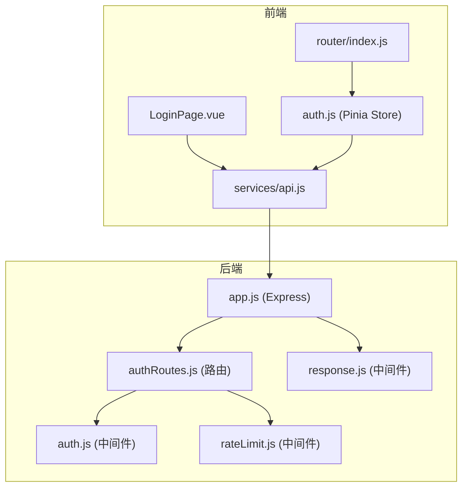
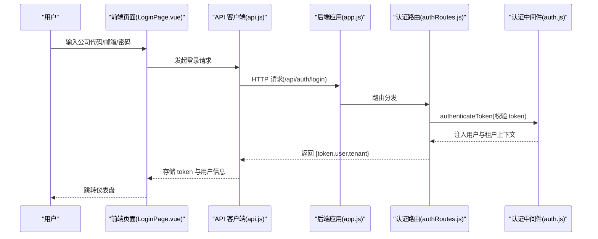
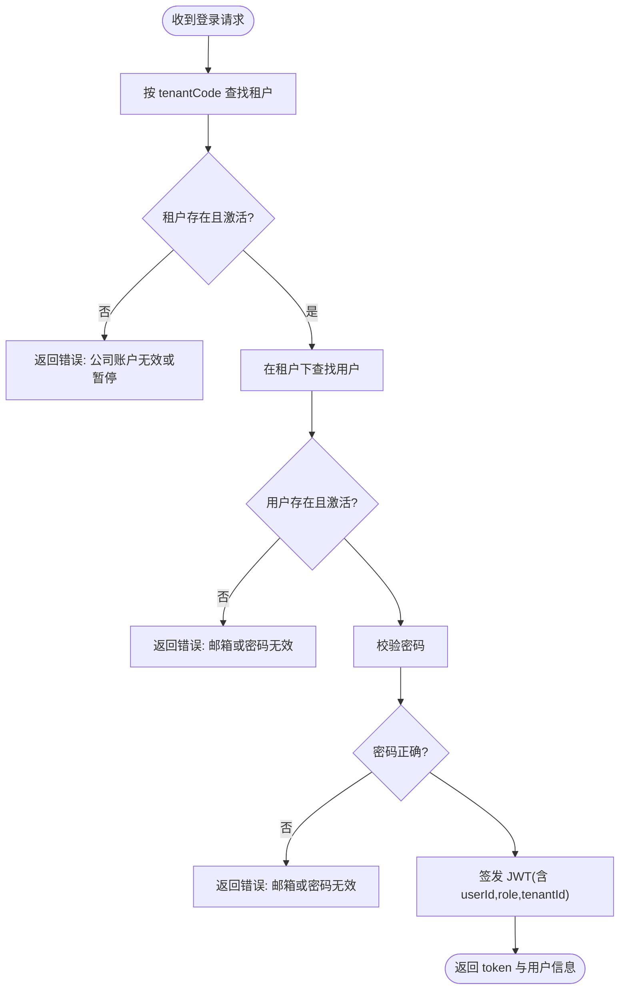
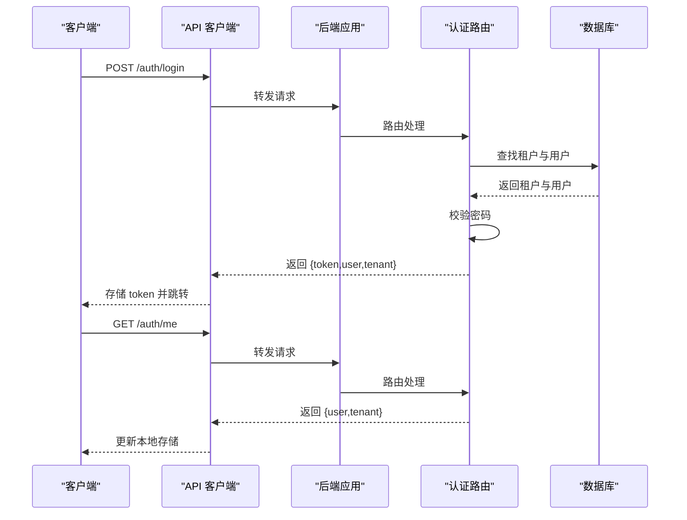
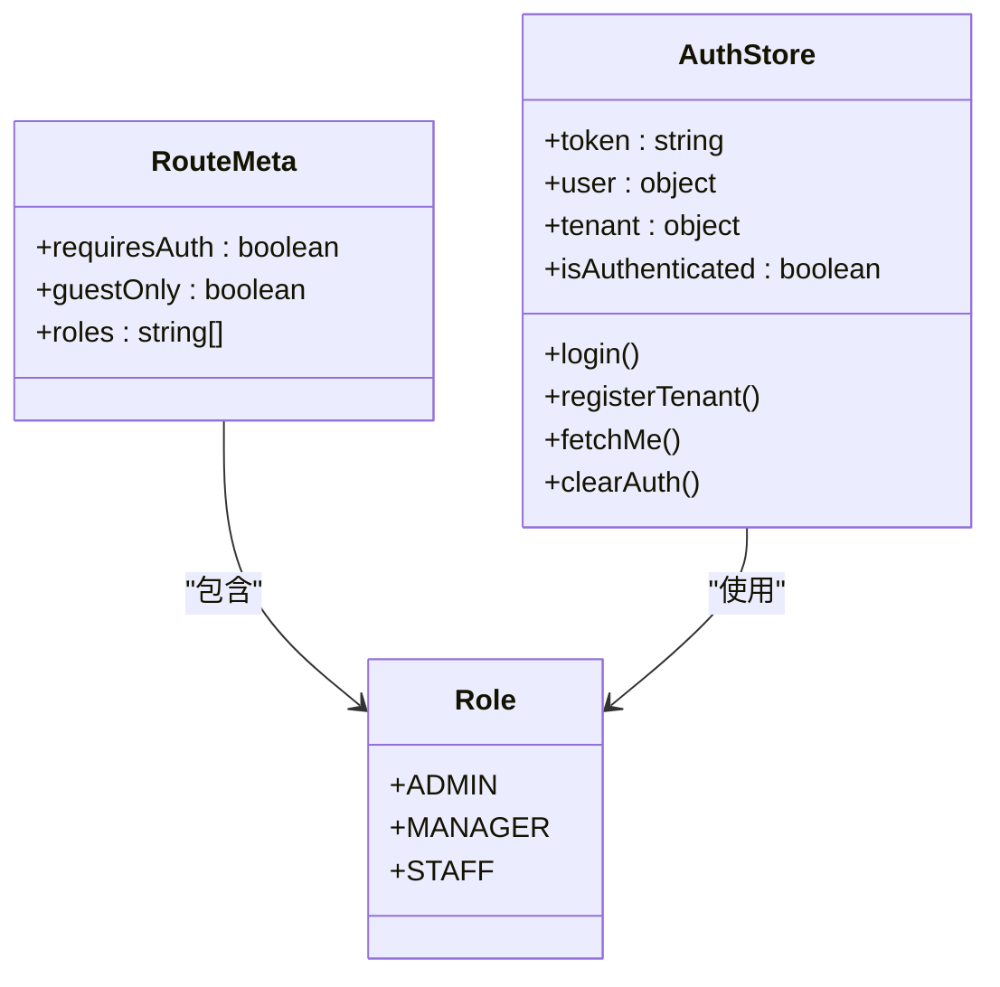
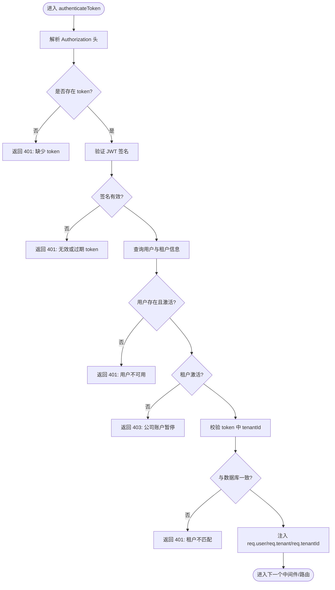
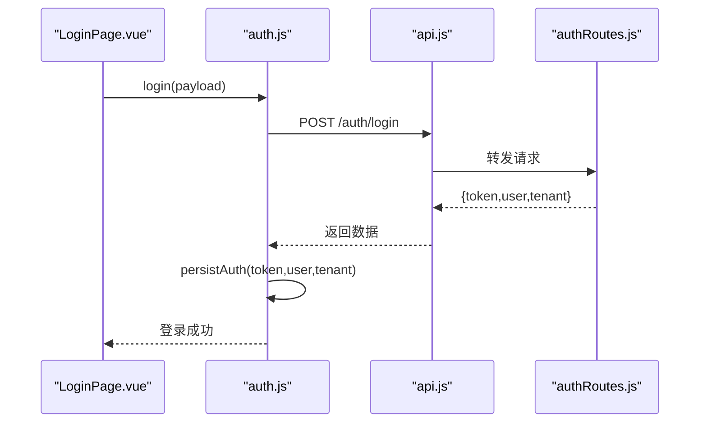
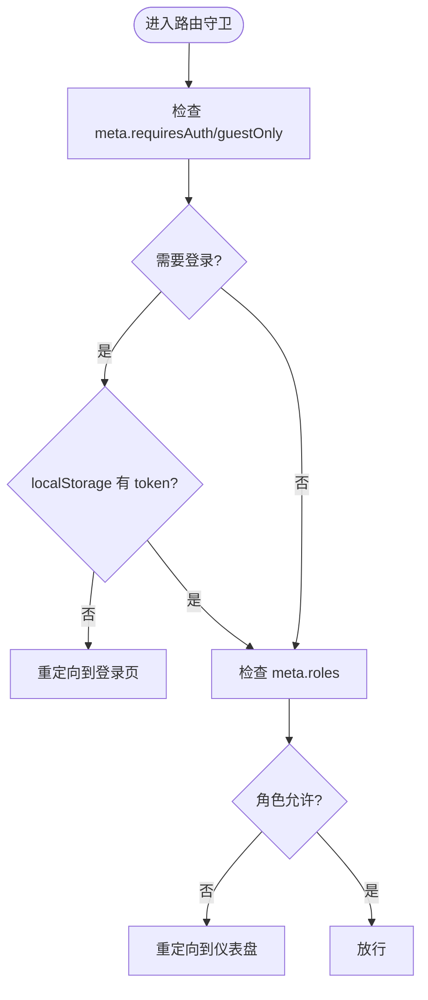
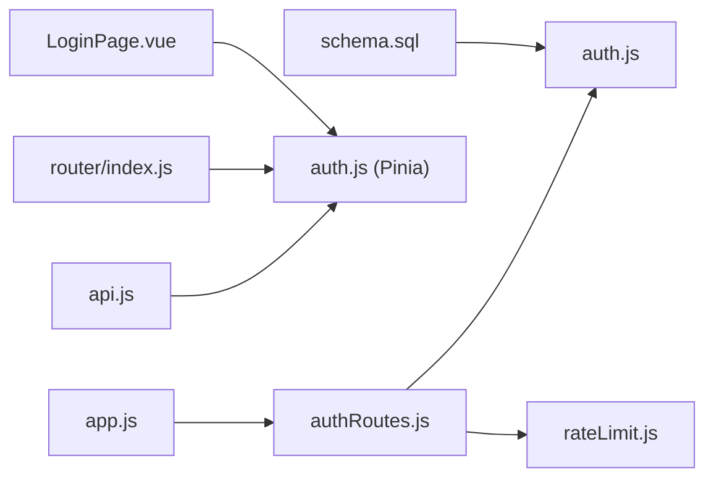

# 用户认证模块

<cite>
**本文档引用的文件**
- [server/src/middleware/auth.js](file://server/src/middleware/auth.js)
- [server/src/routes/authRoutes.js](file://server/src/routes/authRoutes.js)
- [web/src/stores/auth.js](file://web/src/stores/auth.js)
- [web/src/router/index.js](file://web/src/router/index.js)
- [server/src/middleware/rateLimit.js](file://server/src/middleware/rateLimit.js)
- [server/src/middleware/response.js](file://server/src/middleware/response.js)
- [web/src/services/api.js](file://web/src/services/api.js)
- [web/src/pages/LoginPage.vue](file://web/src/pages/LoginPage.vue)
- [server/src/app.js](file://server/src/app.js)
- [web/src/constants/accessGuide.js](file://web/src/constants/accessGuide.js)
- [server/database/schema.sql](file://server/database/schema.sql)
</cite>

## 目录
1. [简介](#简介)
2. [项目结构](#项目结构)
3. [核心组件](#核心组件)
4. [架构总览](#架构总览)
5. [详细组件分析](#详细组件分析)
6. [依赖关系分析](#依赖关系分析)
7. [性能考量](#性能考量)
8. [故障排查指南](#故障排查指南)
9. [结论](#结论)
10. [附录](#附录)

## 简介
本文件系统性阐述库存管理系统的用户认证模块，涵盖以下主题：
- JWT 认证机制：令牌生成、验证与跨租户校验
- 用户登录与注册流程：含租户选择、速率限制与事务注册
- 权限控制系统：基于角色的访问控制（ADMIN、MANAGER、STAFF）
- 认证中间件工作原理：token 解析、用户信息注入、租户上下文与权限校验
- 前端认证状态管理：Pinia Store 持久化、Axios 请求拦截器、路由守卫与动态菜单
- 安全与错误处理：CORS、Helmet、速率限制、统一响应包装与调试建议

## 项目结构
认证相关的核心文件分布如下：
- 后端
  - 认证中间件：server/src/middleware/auth.js
  - 认证路由：server/src/routes/authRoutes.js
  - 通用中间件：server/src/middleware/rateLimit.js、server/src/middleware/response.js
  - 应用入口：server/src/app.js
  - 数据库模式：server/database/schema.sql
- 前端
  - 认证 Store：web/src/stores/auth.js
  - 路由与守卫：web/src/router/index.js
  - API 客户端：web/src/services/api.js
  - 登录页：web/src/pages/LoginPage.vue
  - 角色权限说明：web/src/constants/accessGuide.js

**图表来源**
- [server/src/app.js:1-91](file://server/src/app.js#L1-L91)
- [server/src/routes/authRoutes.js:1-180](file://server/src/routes/authRoutes.js#L1-L180)
- [server/src/middleware/auth.js:1-87](file://server/src/middleware/auth.js#L1-L87)
- [server/src/middleware/rateLimit.js:1-40](file://server/src/middleware/rateLimit.js#L1-L40)
- [server/src/middleware/response.js:1-62](file://server/src/middleware/response.js#L1-L62)
- [web/src/services/api.js:1-45](file://web/src/services/api.js#L1-L45)
- [web/src/stores/auth.js:1-120](file://web/src/stores/auth.js#L1-L120)
- [web/src/router/index.js:1-209](file://web/src/router/index.js#L1-L209)
- [web/src/pages/LoginPage.vue:1-320](file://web/src/pages/LoginPage.vue#L1-L320)

**章节来源**
- [server/src/app.js:1-91](file://server/src/app.js#L1-L91)
- [server/src/routes/authRoutes.js:1-180](file://server/src/routes/authRoutes.js#L1-L180)
- [server/src/middleware/auth.js:1-87](file://server/src/middleware/auth.js#L1-L87)
- [server/src/middleware/rateLimit.js:1-40](file://server/src/middleware/rateLimit.js#L1-L40)
- [server/src/middleware/response.js:1-62](file://server/src/middleware/response.js#L1-L62)
- [web/src/services/api.js:1-45](file://web/src/services/api.js#L1-L45)
- [web/src/stores/auth.js:1-120](file://web/src/stores/auth.js#L1-L120)
- [web/src/router/index.js:1-209](file://web/src/router/index.js#L1-L209)
- [web/src/pages/LoginPage.vue:1-320](file://web/src/pages/LoginPage.vue#L1-L320)

## 核心组件
- 后端认证中间件
  - authenticateToken：解析 Authorization 头中的 Bearer Token，校验签名与租户一致性，将用户与租户上下文注入请求对象
  - authorizeRoles：基于角色的访问控制中间件
  - requireTenant：确保业务路由具备租户上下文
- 认证路由
  - POST /auth/login：支持 tenantCode 选择租户，校验密码，签发带 tenantId 的 JWT
  - POST /auth/register-tenant：创建租户与初始 ADMIN 用户，事务内保证一致性，签发 JWT
  - GET /auth/me：刷新前端登录态
- 前端认证 Store
  - 使用 localStorage 持久化 token、用户与租户信息，提供登录、注册、刷新与清理方法
- 前端路由守卫
  - 基于 meta 字段控制登录态与角色访问；支持 guestOnly、requiresAuth、roles
- API 客户端
  - Axios 请求拦截器自动附加 Authorization 头；统一响应包装与错误透传
- 速率限制与响应包装
  - 登录/注册速率限制；统一响应格式，便于前端处理

**章节来源**
- [server/src/middleware/auth.js:1-87](file://server/src/middleware/auth.js#L1-L87)
- [server/src/routes/authRoutes.js:1-180](file://server/src/routes/authRoutes.js#L1-L180)
- [web/src/stores/auth.js:1-120](file://web/src/stores/auth.js#L1-L120)
- [web/src/router/index.js:1-209](file://web/src/router/index.js#L1-L209)
- [server/src/middleware/rateLimit.js:1-40](file://server/src/middleware/rateLimit.js#L1-L40)
- [server/src/middleware/response.js:1-62](file://server/src/middleware/response.js#L1-L62)
- [web/src/services/api.js:1-45](file://web/src/services/api.js#L1-L45)

## 架构总览
认证模块采用“前后端分离 + JWT”的架构：
- 前端通过 API 客户端发起登录/注册请求，后端返回 JWT 与用户信息
- 前端 Store 持久化 token 并在每次请求中通过拦截器附加 Authorization
- 后端中间件解析并验证 JWT，注入用户与租户上下文，进行角色与租户一致性校验
- 路由守卫结合 Store 状态与 meta 规则进行前端侧访问控制

**图表来源**
- [web/src/pages/LoginPage.vue:73-90](file://web/src/pages/LoginPage.vue#L73-L90)
- [web/src/services/api.js:8-24](file://web/src/services/api.js#L8-L24)
- [server/src/app.js:64](file://server/src/app.js#L64)
- [server/src/routes/authRoutes.js:22-98](file://server/src/routes/authRoutes.js#L22-L98)
- [server/src/middleware/auth.js:5-61](file://server/src/middleware/auth.js#L5-L61)

## 详细组件分析

### JWT 认证机制
- 令牌生成
  - 登录成功后签发包含 userId、role、tenantId 的 JWT，有效期 8 小时
  - 注册租户成功后同样签发 JWT，实现自动登录
- 令牌验证
  - 中间件从 Authorization 头解析 Bearer token，使用环境变量中的密钥验证签名
  - 查询用户与租户信息，校验用户状态与租户状态
  - 核对 token 中的 tenantId 与数据库记录一致，防止跨租户 token 泄露
- 令牌刷新与续期
  - 当前实现未提供专用刷新接口；前端通过 GET /auth/me 恢复登录态
  - 建议在生产环境增加独立的刷新接口，以降低长期持有 token 的风险

**图表来源**
- [server/src/routes/authRoutes.js:22-98](file://server/src/routes/authRoutes.js#L22-L98)

**章节来源**
- [server/src/routes/authRoutes.js:66-71](file://server/src/routes/authRoutes.js#L66-L71)
- [server/src/middleware/auth.js:13-61](file://server/src/middleware/auth.js#L13-L61)

### 用户登录与注册流程
- 登录流程
  - 支持 tenantCode（新）或不传（兼容 DEFAULT 租户）
  - 校验租户状态与用户状态，bcrypt 校验密码
  - 成功后返回 token、用户与租户信息
- 注册租户流程
  - 校验字段与密码长度规则
  - 使用数据库事务创建租户与 ADMIN 用户，防止部分失败
  - 成功后签发 JWT 并返回结果
- 登录态恢复
  - 前端通过 GET /auth/me 恢复用户与租户信息，刷新本地存储

**图表来源**
- [server/src/routes/authRoutes.js:22-98](file://server/src/routes/authRoutes.js#L22-L98)
- [server/src/routes/authRoutes.js:174-177](file://server/src/routes/authRoutes.js#L174-L177)
- [web/src/stores/auth.js:84-106](file://web/src/stores/auth.js#L84-L106)

**章节来源**
- [server/src/routes/authRoutes.js:22-98](file://server/src/routes/authRoutes.js#L22-L98)
- [server/src/routes/authRoutes.js:100-172](file://server/src/routes/authRoutes.js#L100-L172)
- [web/src/stores/auth.js:52-106](file://web/src/stores/auth.js#L52-L106)

### 权限控制系统
- 角色定义
  - ADMIN：系统配置、主数据治理、库存调整审批、报表与审计
  - MANAGER：日常仓储运营、库存监控、调拨与盘点执行
  - STAFF：一线收发货与盘点录入，不可进行系统级配置
- 角色差异与访问控制
  - 路由 meta.roles 控制页面访问；未满足角色将被重定向至仪表盘
  - 后端中间件 authorizeRoles 进一步保障接口级权限
- 租户隔离
  - JWT 包含 tenantId，中间件校验 token 与数据库租户一致性，防止跨租户访问

**图表来源**
- [web/src/router/index.js:46-106](file://web/src/router/index.js#L46-L106)
- [server/src/middleware/auth.js:64-72](file://server/src/middleware/auth.js#L64-L72)
- [web/src/constants/accessGuide.js:1-75](file://web/src/constants/accessGuide.js#L1-L75)

**章节来源**
- [web/src/router/index.js:46-106](file://web/src/router/index.js#L46-L106)
- [server/src/middleware/auth.js:64-72](file://server/src/middleware/auth.js#L64-L72)
- [web/src/constants/accessGuide.js:1-75](file://web/src/constants/accessGuide.js#L1-L75)

### 认证中间件工作原理
- authenticateToken
  - 解析 Authorization 头，校验 JWT 签名
  - 查询用户与租户信息，校验用户与租户状态
  - 校验 token 中 tenantId 与数据库一致
  - 将 req.user、req.tenant、req.tenantId 注入请求对象
- authorizeRoles
  - 校验 req.user.role 是否在允许列表中
- requireTenant
  - 确保业务路由具备租户上下文

**图表来源**
- [server/src/middleware/auth.js:5-61](file://server/src/middleware/auth.js#L5-L61)

**章节来源**
- [server/src/middleware/auth.js:5-80](file://server/src/middleware/auth.js#L5-L80)

### 前端认证状态管理
- Store 持久化
  - 使用 localStorage 存储 token、用户与租户信息
  - 提供 clearAuth 清理状态与通知存储
- 登录与注册
  - login：调用 /auth/login，成功后持久化并设置首选货币
  - registerTenant：调用 /auth/register-tenant，成功后自动登录
- 登录态恢复
  - fetchMe：调用 /auth/me，更新用户与租户信息，失败时清理状态
- 请求拦截器
  - 自动附加 Authorization 头，统一响应包装与错误透传

**图表来源**
- [web/src/pages/LoginPage.vue:73-90](file://web/src/pages/LoginPage.vue#L73-L90)
- [web/src/stores/auth.js:52-67](file://web/src/stores/auth.js#L52-L67)
- [web/src/services/api.js:8-24](file://web/src/services/api.js#L8-L24)
- [server/src/routes/authRoutes.js:22-98](file://server/src/routes/authRoutes.js#L22-L98)

**章节来源**
- [web/src/stores/auth.js:19-119](file://web/src/stores/auth.js#L19-L119)
- [web/src/services/api.js:1-45](file://web/src/services/api.js#L1-L45)
- [web/src/pages/LoginPage.vue:73-115](file://web/src/pages/LoginPage.vue#L73-L115)

### 路由守卫与动态菜单
- 路由守卫逻辑
  - requiresAuth：未登录跳转登录页
  - guestOnly：已登录跳转仪表盘
  - roles：角色不在允许列表时跳转仪表盘
- 动态菜单
  - 路由 meta.roles 决定页面是否展示
  - 结合用户角色与权限常量，前端可渲染对应菜单项

**图表来源**
- [web/src/router/index.js:187-206](file://web/src/router/index.js#L187-L206)

**章节来源**
- [web/src/router/index.js:29-180](file://web/src/router/index.js#L29-L180)

## 依赖关系分析
- 后端
  - app.js 引入并挂载认证路由与中间件
  - authRoutes 依赖 auth 中间件与速率限制中间件
  - 数据库 schema 定义用户角色枚举与租户关联
- 前端
  - router 依赖 auth store 的登录状态
  - api.js 依赖 auth store 的 token 并在拦截器中使用
  - LoginPage.vue 依赖 auth store 与路由跳转

**图表来源**
- [server/src/app.js:64-80](file://server/src/app.js#L64-L80)
- [server/src/routes/authRoutes.js:1-8](file://server/src/routes/authRoutes.js#L1-L8)
- [server/src/middleware/auth.js:1-2](file://server/src/middleware/auth.js#L1-L2)
- [server/src/middleware/rateLimit.js:1-7](file://server/src/middleware/rateLimit.js#L1-L7)
- [web/src/services/api.js:1-6](file://web/src/services/api.js#L1-L6)
- [web/src/stores/auth.js:1-6](file://web/src/stores/auth.js#L1-L6)
- [web/src/router/index.js:1-6](file://web/src/router/index.js#L1-L6)
- [web/src/pages/LoginPage.vue:1-7](file://web/src/pages/LoginPage.vue#L1-L7)
- [server/database/schema.sql:2-11](file://server/database/schema.sql#L2-L11)

**章节来源**
- [server/src/app.js:1-91](file://server/src/app.js#L1-L91)
- [server/src/routes/authRoutes.js:1-180](file://server/src/routes/authRoutes.js#L1-L180)
- [server/src/middleware/auth.js:1-87](file://server/src/middleware/auth.js#L1-L87)
- [server/src/middleware/rateLimit.js:1-40](file://server/src/middleware/rateLimit.js#L1-L40)
- [web/src/services/api.js:1-45](file://web/src/services/api.js#L1-L45)
- [web/src/stores/auth.js:1-120](file://web/src/stores/auth.js#L1-L120)
- [web/src/router/index.js:1-209](file://web/src/router/index.js#L1-L209)
- [web/src/pages/LoginPage.vue:1-320](file://web/src/pages/LoginPage.vue#L1-L320)
- [server/database/schema.sql:1-200](file://server/database/schema.sql#L1-L200)

## 性能考量
- 令牌有效期
  - 当前 8 小时，建议根据业务场景评估是否缩短以提升安全性
- 速率限制
  - 登录 1 分钟最多 10 次，注册 1 小时最多 5 次，可按需调整
- 请求拦截器
  - 自动附加 Authorization 头，减少重复代码
- 响应包装
  - 统一 success/code/message 结构，便于前端快速判断

[本节为通用指导，无需特定文件来源]

## 故障排查指南
- 常见错误与定位
  - 401 缺少或无效 token：检查前端是否正确存储与发送 Authorization 头
  - 401 用户不可用/租户暂停：检查用户与租户状态
  - 403 权限不足：确认用户角色与路由 meta.roles 配置
  - 429 请求过多：检查速率限制配置与客户端重试策略
- 调试建议
  - 后端启用 morgan 日志，观察请求路径与状态码
  - 前端在 api.js interceptors 中打印请求/响应，定位错误消息
  - 使用浏览器开发者工具 Network 面板检查 Authorization 头与响应体
- 错误处理
  - response.js 将错误统一包装为 {success:false, code, message, details}
  - 前端拦截器将失败响应 message 透传到 error.message

**章节来源**
- [server/src/middleware/response.js:9-57](file://server/src/middleware/response.js#L9-L57)
- [web/src/services/api.js:26-42](file://web/src/services/api.js#L26-L42)
- [server/src/middleware/rateLimit.js:23-34](file://server/src/middleware/rateLimit.js#L23-L34)

## 结论
本认证模块通过 JWT 实现前后端分离的会话管理，配合前端 Pinia Store、路由守卫与后端中间件，构建了完整的登录、注册、权限控制与租户隔离方案。建议后续补充独立的 token 刷新接口与更细粒度的权限模型，以进一步提升安全性与可维护性。

[本节为总结，无需特定文件来源]

## 附录
- 数据库角色约束
  - 用户表 role 字段限定为 ADMIN、MANAGER、STAFF
- 角色权限概览
  - 参考 accessGuide 常量，明确各角色职责与页面访问范围

**章节来源**
- [server/database/schema.sql:7](file://server/database/schema.sql#L7)
- [web/src/constants/accessGuide.js:1-75](file://web/src/constants/accessGuide.js#L1-L75)