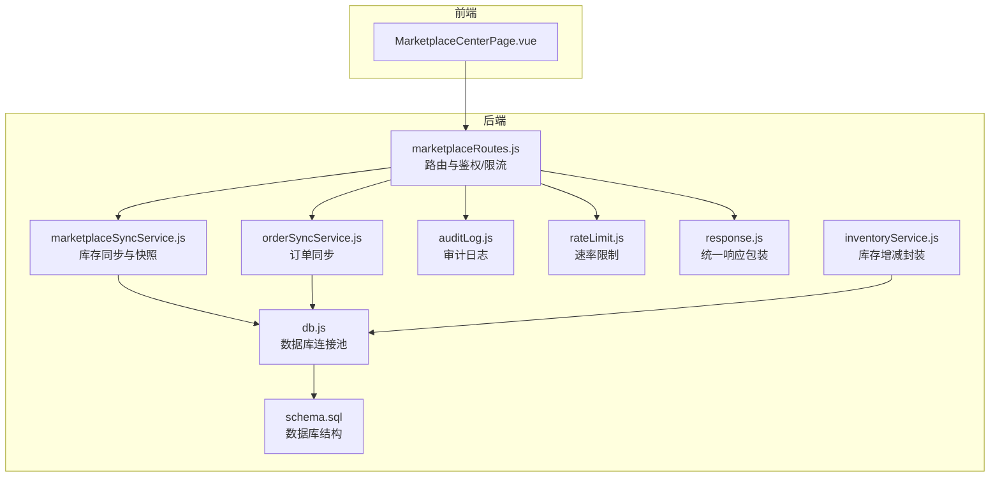
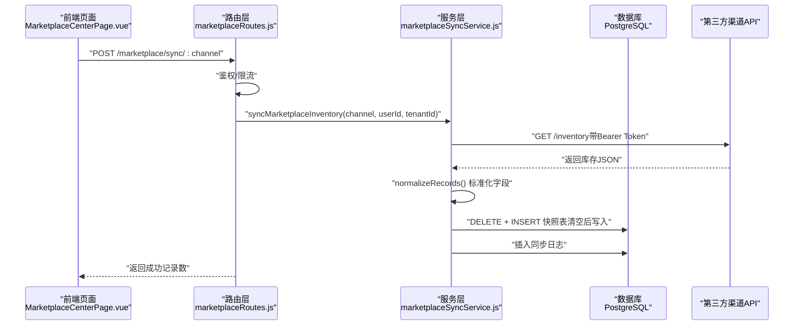
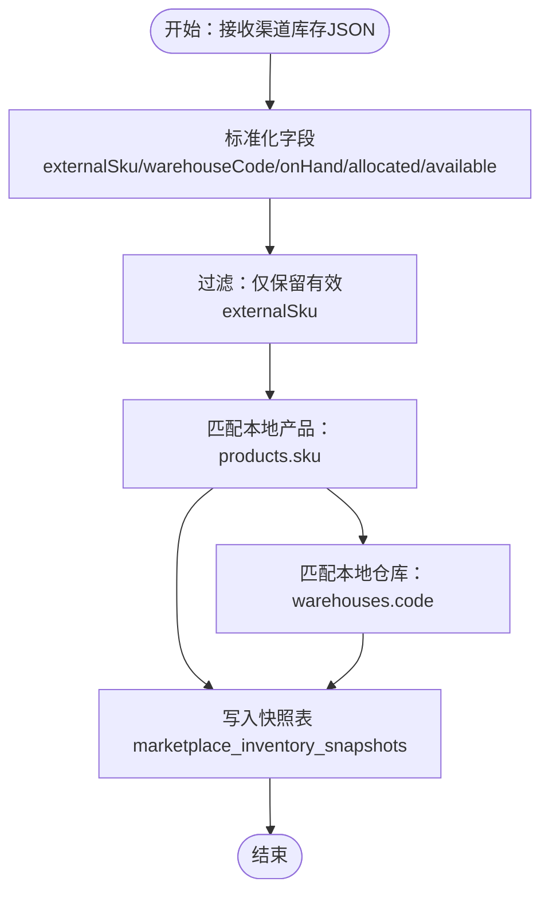
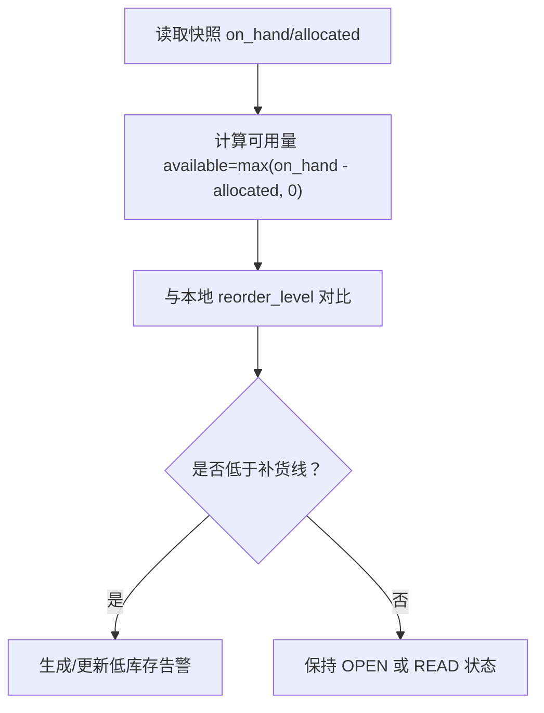
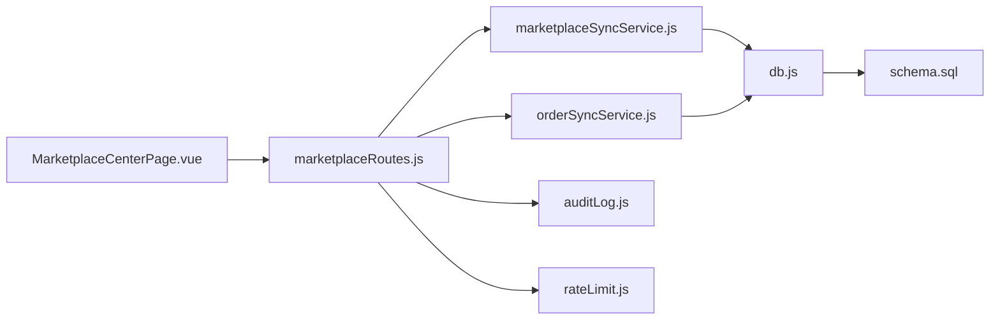

# 商品同步

<cite>
**本文引用的文件**
- [server/src/services/marketplaceSyncService.js](file://server/src/services/marketplaceSyncService.js)
- [server/src/routes/marketplaceRoutes.js](file://server/src/routes/marketplaceRoutes.js)
- [server/src/services/orderSyncService.js](file://server/src/services/orderSyncService.js)
- [server/src/utils/inventoryService.js](file://server/src/utils/inventoryService.js)
- [server/src/config/db.js](file://server/src/config/db.js)
- [server/database/schema.sql](file://server/database/schema.sql)
- [web/src/pages/MarketplaceCenterPage.vue](file://web/src/pages/MarketplaceCenterPage.vue)
- [web/src/utils/money.js](file://web/src/utils/money.js)
- [web/src/stores/currency.js](file://web/src/stores/currency.js)
- [server/src/middleware/rateLimit.js](file://server/src/middleware/rateLimit.js)
- [server/src/middleware/response.js](file://server/src/middleware/response.js)
- [server/src/utils/auditLog.js](file://server/src/utils/auditLog.js)
</cite>

## 目录
1. [简介](#简介)
2. [项目结构](#项目结构)
3. [核心组件](#核心组件)
4. [架构总览](#架构总览)
5. [详细组件分析](#详细组件分析)
6. [依赖分析](#依赖分析)
7. [性能考虑](#性能考虑)
8. [故障排查指南](#故障排查指南)
9. [结论](#结论)
10. [附录](#附录)

## 简介
本文件面向电商库存系统的“商品同步”能力，围绕平台（Shopee/Lazada/TikTok）商品与库存数据的接入、映射、落库与可观测性展开，重点覆盖以下方面：
- 商品数据映射规则：SKU/外部SKU、仓库编码、价格字段转换、库存数量映射
- 同步策略：增量同步（快照表）、全量替换（每次清空后写入）、实时同步（请求即触发）
- 商品状态管理：上架/下架（由平台订单状态驱动）、商品变更追踪（审计日志）
- 库存同步机制：多仓库库存分配、可用库存计算、库存预警与缺货处理
- 数据转换规则：价格格式处理、货币转换、税费计算（系统支持范围）
- 失败处理、重试机制与数据一致性保障：限流、幂等写入、错误日志、审计追踪

## 项目结构
后端采用 Express + PostgreSQL，前端为 Vue 单页应用。商品同步涉及的关键模块如下：
- 路由层：市场渠道连接、OAuth、同步任务、错误与概览查询
- 服务层：商品库存同步、订单同步、库存通用操作封装
- 工具层：数据库连接、审计日志、响应包装、速率限制
- 数据层：Schema 定义（连接、快照、日志、库存、告警等）

图表来源
- [server/src/routes/marketplaceRoutes.js:1-685](file://server/src/routes/marketplaceRoutes.js#L1-L685)
- [server/src/services/marketplaceSyncService.js:1-159](file://server/src/services/marketplaceSyncService.js#L1-L159)
- [server/src/services/orderSyncService.js:1-128](file://server/src/services/orderSyncService.js#L1-L128)
- [server/src/utils/inventoryService.js:1-46](file://server/src/utils/inventoryService.js#L1-L46)
- [server/src/config/db.js:1-29](file://server/src/config/db.js#L1-L29)
- [server/database/schema.sql:1-447](file://server/database/schema.sql#L1-L447)

章节来源
- [server/src/routes/marketplaceRoutes.js:1-685](file://server/src/routes/marketplaceRoutes.js#L1-L685)
- [server/src/services/marketplaceSyncService.js:1-159](file://server/src/services/marketplaceSyncService.js#L1-L159)
- [server/src/services/orderSyncService.js:1-128](file://server/src/services/orderSyncService.js#L1-L128)
- [server/src/utils/inventoryService.js:1-46](file://server/src/utils/inventoryService.js#L1-L46)
- [server/src/config/db.js:1-29](file://server/src/config/db.js#L1-L29)
- [server/database/schema.sql:1-447](file://server/database/schema.sql#L1-L447)

## 核心组件
- 市场渠道连接与配置
  - 支持渠道：Shopee、Lazada、TikTok
  - 连接配置存储于 marketplace_connections，支持租户隔离与激活状态
  - 提供连接测试、OAuth 授权流程（开始与回调）
- 商品库存同步
  - 从渠道拉取库存数据，标准化字段（外部SKU、仓库编码、在手/占用/可用数量）
  - 将标准化后的记录写入 marketplace_inventory_snapshots 快照表
  - 记录同步日志 marketplace_sync_logs，包含状态、条数、原始响应
- 订单同步
  - 拉取订单列表，标准化订单与明细，按租户+渠道+外部订单号去重写入
  - 订单项匹配本地 SKU，生成 marketplace_order_items
- 库存服务封装
  - 统一的库存行确保、查询与更新，支持租户隔离
- 错误与审计
  - marketplace_error_logs 记录错误事件（含请求ID）
  - audit_logs 记录关键操作（连接、同步、OAuth、告警状态变更）
- 速率限制与统一响应
  - 限流中间件按 IP+命名空间控制 QPS
  - 统一响应包装，透传 x-request-id 便于问题定位

章节来源
- [server/src/routes/marketplaceRoutes.js:18-682](file://server/src/routes/marketplaceRoutes.js#L18-L682)
- [server/src/services/marketplaceSyncService.js:3-153](file://server/src/services/marketplaceSyncService.js#L3-L153)
- [server/src/services/orderSyncService.js:4-123](file://server/src/services/orderSyncService.js#L4-L123)
- [server/src/utils/inventoryService.js:3-44](file://server/src/utils/inventoryService.js#L3-L44)
- [server/src/middleware/rateLimit.js:1-39](file://server/src/middleware/rateLimit.js#L1-L39)
- [server/src/middleware/response.js:1-61](file://server/src/middleware/response.js#L1-L61)
- [server/src/utils/auditLog.js:1-39](file://server/src/utils/auditLog.js#L1-L39)

## 架构总览
商品同步整体流程分为“渠道连接配置 → 拉取数据 → 标准化 → 落库/快照 → 日志与审计 → 可视化与告警”。前端 MarketplaceCenterPage.vue 提供配置、测试、同步与错误概览入口。

图表来源
- [server/src/routes/marketplaceRoutes.js:153-213](file://server/src/routes/marketplaceRoutes.js#L153-L213)
- [server/src/services/marketplaceSyncService.js:113-153](file://server/src/services/marketplaceSyncService.js#L113-L153)

章节来源
- [server/src/routes/marketplaceRoutes.js:153-213](file://server/src/routes/marketplaceRoutes.js#L153-L213)
- [server/src/services/marketplaceSyncService.js:113-153](file://server/src/services/marketplaceSyncService.js#L113-L153)

## 详细组件分析

### 商品数据映射规则
- 外部SKU映射
  - 优先使用 items[].sku；若无则尝试 externalSku
  - 仅当 externalSku 存在时才写入快照，用于后续匹配本地产品
- 仓库编码映射
  - 从 items[].warehouseCode 或 warehouse_code 匹配本地 warehouses.code
  - 若未提供或未匹配，则 warehouse_id 为空，保留外部标识但不绑定本地仓库
- 库存数量映射
  - 在手数量：onHand 或 on_hand 或 quantity，默认 0
  - 已占用数量：allocated 或 order_allocated，默认 0
  - 可用数量：available 或 warehouse_available，若缺失则按 max(在手-占用, 0) 计算
- 原始载荷
  - 将原始条目 payload 以 JSONB 形式存入快照，便于回溯与调试

图表来源
- [server/src/services/marketplaceSyncService.js:40-111](file://server/src/services/marketplaceSyncService.js#L40-L111)

章节来源
- [server/src/services/marketplaceSyncService.js:40-111](file://server/src/services/marketplaceSyncService.js#L40-L111)

### 同步策略
- 增量同步（基于快照）
  - 每次同步前清空当前租户+渠道的快照表，再全量写入最新结果
  - 优点：简单可靠、便于对比差异；缺点：未做逐条增量更新
- 全量同步
  - 当前实现即为“全量替换”，通过 DELETE + INSERT 实现
- 实时同步
  - 请求即触发，无后台队列；前端按钮直接调用 /sync/:channel
- 订单同步策略
  - 拉取订单列表，按租户+渠道+外部订单号去重写入
  - 订单明细按外部SKU匹配本地产品，支持后续发货/出库联动

章节来源
- [server/src/services/marketplaceSyncService.js:61-111](file://server/src/services/marketplaceSyncService.js#L61-L111)
- [server/src/services/orderSyncService.js:19-123](file://server/src/services/orderSyncService.js#L19-L123)
- [web/src/pages/MarketplaceCenterPage.vue:218-246](file://web/src/pages/MarketplaceCenterPage.vue#L218-L246)

### 商品状态管理与变更追踪
- 上架/下架
  - 本仓库未直接暴露“上架/下架”开关；可通过订单状态与库存可用量间接反映
  - 订单状态字段 order_status 由渠道返回，可用于业务侧判断（如待发货、已取消等）
- 商品变更追踪
  - marketplace_connections 的更新、OAuth 开始/回调、同步任务均写入 audit_logs
  - marketplace_error_logs 记录错误事件，包含请求ID，便于端到端追踪

章节来源
- [server/src/routes/marketplaceRoutes.js:22-48](file://server/src/routes/marketplaceRoutes.js#L22-L48)
- [server/src/routes/marketplaceRoutes.js:126-151](file://server/src/routes/marketplaceRoutes.js#L126-L151)
- [server/src/routes/marketplaceRoutes.js:255-261](file://server/src/routes/marketplaceRoutes.js#L255-L261)
- [server/src/routes/marketplaceRoutes.js:368-374](file://server/src/routes/marketplaceRoutes.js#L368-L374)
- [server/src/routes/marketplaceRoutes.js:424-430](file://server/src/routes/marketplaceRoutes.js#L424-L430)
- [server/src/routes/marketplaceRoutes.js:646-651](file://server/src/routes/marketplaceRoutes.js#L646-L651)

### 库存同步机制与可用量计算
- 多仓库库存分配
  - 通过 warehouseCode 字段匹配本地仓库；未匹配则保留外部仓库标识
- 可用库存计算
  - 可用数量 = max(在手数量 - 已占用数量, 0)
- 与本地库存表的关系
  - 快照表 marketplace_inventory_snapshots 仅作“渠道视角”的库存快照
  - 本地 stock_levels 为系统内部库存，需结合业务流程进行对账与更新（本仓库未提供自动对账逻辑）
- 库存预警与缺货
  - 本地库存低于 reorder_level 时，生成低库存告警（low_stock_alert_states）
  - 前端“低库存提醒”与“告警中心”展示当前缺口与状态

图表来源
- [server/src/services/marketplaceSyncService.js:46-48](file://server/src/services/marketplaceSyncService.js#L46-L48)
- [server/database/schema.sql:290-300](file://server/database/schema.sql#L290-L300)

章节来源
- [server/src/services/marketplaceSyncService.js:46-48](file://server/src/services/marketplaceSyncService.js#L46-L48)
- [server/database/schema.sql:290-300](file://server/database/schema.sql#L290-L300)

### 数据转换规则
- 价格格式处理
  - 前端使用 formatMoney，按币种与区域格式化显示
  - 币种来源：用户偏好（users.preferred_currency），默认 MYR
- 货币转换
  - 本仓库未实现自动汇率转换；渠道返回的 currency 与金额字段未做换算
- 税费计算
  - 本仓库未内置税费计算逻辑；如需，可在业务层扩展

章节来源
- [web/src/utils/money.js:1-16](file://web/src/utils/money.js#L1-L16)
- [web/src/stores/currency.js:1-21](file://web/src/stores/currency.js#L1-L21)
- [server/database/schema.sql:196-208](file://server/database/schema.sql#L196-L208)

### 失败处理、重试机制与数据一致性
- 失败处理
  - 同步失败时写入 marketplace_sync_logs（status=FAILED），并记录错误日志 marketplace_error_logs
  - 前端展示错误概览与详情，包含请求ID，便于定位
- 重试机制
  - 本仓库未实现自动重试；建议在上游定时任务或外部调度器中按失败日志重试
- 数据一致性
  - 快照写入采用“清空+全量写入”，避免部分更新导致的不一致
  - 订单同步按租户+渠道+外部订单号去重，避免重复写入
  - 速率限制防止突发流量压垮下游

章节来源
- [server/src/routes/marketplaceRoutes.js:183-211](file://server/src/routes/marketplaceRoutes.js#L183-L211)
- [server/src/routes/marketplaceRoutes.js:637-682](file://server/src/routes/marketplaceRoutes.js#L637-L682)
- [server/src/middleware/rateLimit.js:9-35](file://server/src/middleware/rateLimit.js#L9-L35)

## 依赖分析
- 组件耦合
  - marketplaceRoutes 依赖 marketplaceSyncService 与 orderSyncService
  - 服务层依赖 db.js 进行 SQL 查询
  - 通用审计与响应包装被路由层广泛使用
- 外部依赖
  - 第三方渠道 API（Shopee/Lazada/TikTok）
  - 前端 Vue 生态（Pinia、Vue Router、组件库）

图表来源
- [server/src/routes/marketplaceRoutes.js:1-685](file://server/src/routes/marketplaceRoutes.js#L1-L685)
- [server/src/services/marketplaceSyncService.js:1-159](file://server/src/services/marketplaceSyncService.js#L1-L159)
- [server/src/services/orderSyncService.js:1-128](file://server/src/services/orderSyncService.js#L1-L128)
- [server/src/config/db.js:1-29](file://server/src/config/db.js#L1-L29)
- [server/database/schema.sql:1-447](file://server/database/schema.sql#L1-L447)

章节来源
- [server/src/routes/marketplaceRoutes.js:1-685](file://server/src/routes/marketplaceRoutes.js#L1-L685)
- [server/src/services/marketplaceSyncService.js:1-159](file://server/src/services/marketplaceSyncService.js#L1-L159)
- [server/src/services/orderSyncService.js:1-128](file://server/src/services/orderSyncService.js#L1-L128)
- [server/src/config/db.js:1-29](file://server/src/config/db.js#L1-L29)
- [server/database/schema.sql:1-447](file://server/database/schema.sql#L1-L447)

## 性能考虑
- 速率限制
  - marketplace 同步与 OAuth 使用独立命名空间的限流，窗口 60s，最大 12 次/分（同步）与 20 次/分（OAuth）
- 并发与幂等
  - 同步采用“清空+全量写入”，避免并发写入竞争
  - 订单同步按外部订单号去重，减少重复处理
- 数据库索引
  - 快照、订单、错误日志等表均有索引，提升查询效率
- 建议
  - 对于高并发场景，可引入异步队列与重试机制
  - 对长链路调用增加超时与熔断策略

章节来源
- [server/src/middleware/rateLimit.js:9-35](file://server/src/middleware/rateLimit.js#L9-L35)
- [server/src/routes/marketplaceRoutes.js:13-14](file://server/src/routes/marketplaceRoutes.js#L13-L14)
- [server/database/schema.sql:419-425](file://server/database/schema.sql#L419-L425)

## 故障排查指南
- 常见问题定位
  - 查看 marketplace_sync_logs 获取最近一次同步状态与记录数
  - 查看 marketplace_error_logs 获取错误码、消息与详情，结合 x-request-id
  - 使用 MarketplaceCenterPage.vue 的“错误日志”分页与筛选
- 连接与认证
  - 使用“连接测试”检查渠道 endpoint 与 token 是否正确
  - OAuth 流程：先保存配置，再启动授权，最后回调处理
- 库存不一致
  - 检查快照表中的 external_sku 与 warehouse_code 是否正确
  - 如需对账，可比对快照与本地 stock_levels 的差异

章节来源
- [server/src/routes/marketplaceRoutes.js:458-479](file://server/src/routes/marketplaceRoutes.js#L458-L479)
- [server/src/routes/marketplaceRoutes.js:595-635](file://server/src/routes/marketplaceRoutes.js#L595-L635)
- [server/src/routes/marketplaceRoutes.js:396-456](file://server/src/routes/marketplaceRoutes.js#L396-L456)
- [server/src/routes/marketplaceRoutes.js:215-394](file://server/src/routes/marketplaceRoutes.js#L215-L394)

## 结论
本仓库实现了电商渠道库存与订单的接入与落库，具备完善的错误日志、审计与可视化能力。商品同步采用“全量替换快照”的策略，简单可靠；若未来需要更细粒度的增量同步与自动对账，可在现有基础上扩展队列与对账逻辑。

## 附录
- 关键表结构要点
  - marketplace_connections：渠道连接配置（租户隔离）
  - marketplace_inventory_snapshots：库存快照（外部SKU/仓库/数量）
  - marketplace_sync_logs：同步日志（类型、状态、记录数）
  - marketplace_error_logs：错误日志（操作、错误码、详情）
  - stock_levels：本地库存（产品+仓库）
  - low_stock_alert_states：低库存告警状态
- 前端页面
  - MarketplaceCenterPage.vue：连接配置、测试、同步、错误概览

章节来源
- [server/database/schema.sql:161-208](file://server/database/schema.sql#L161-L208)
- [server/database/schema.sql:125-159](file://server/database/schema.sql#L125-L159)
- [server/database/schema.sql:137-146](file://server/database/schema.sql#L137-L146)
- [server/database/schema.sql:184-194](file://server/database/schema.sql#L184-L194)
- [server/database/schema.sql:290-300](file://server/database/schema.sql#L290-L300)
- [web/src/pages/MarketplaceCenterPage.vue:1-477](file://web/src/pages/MarketplaceCenterPage.vue#L1-L477)