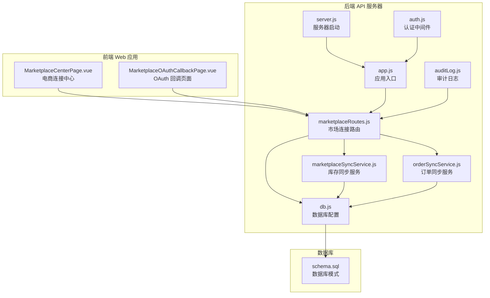
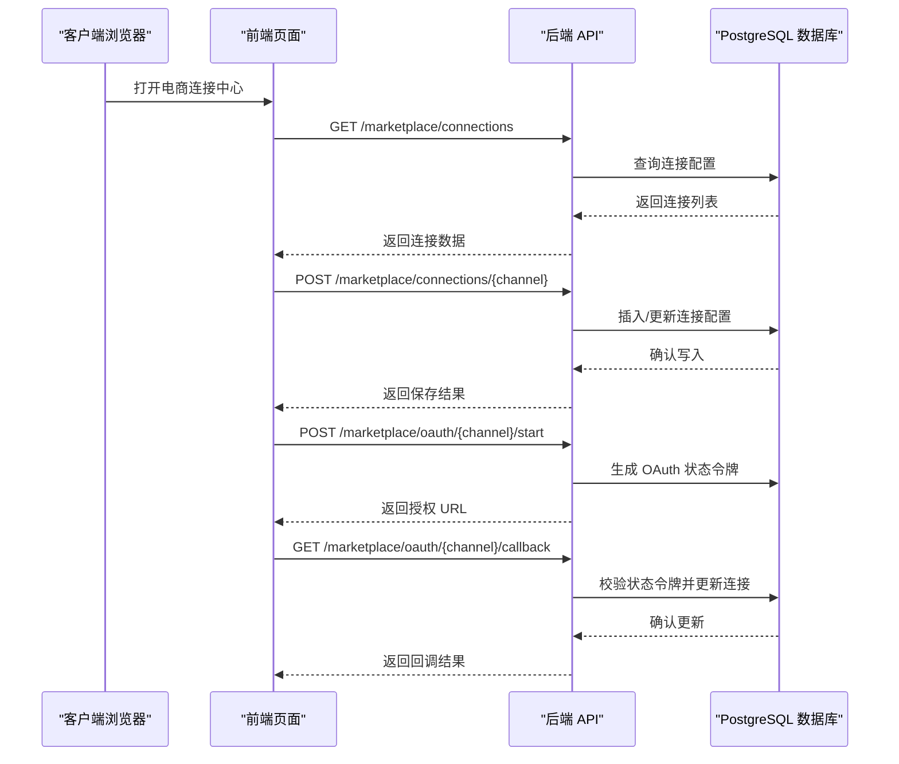
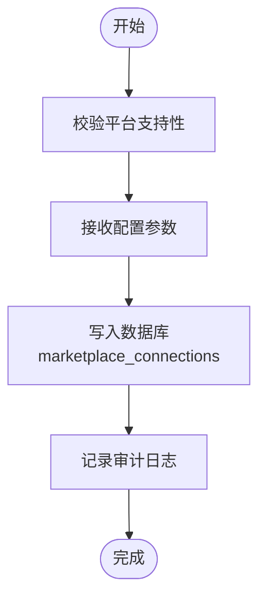
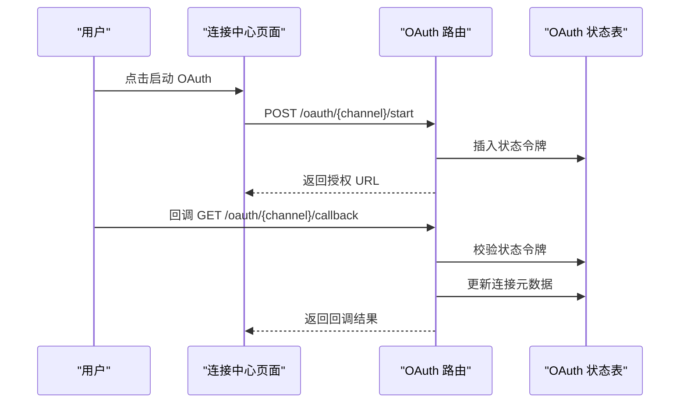
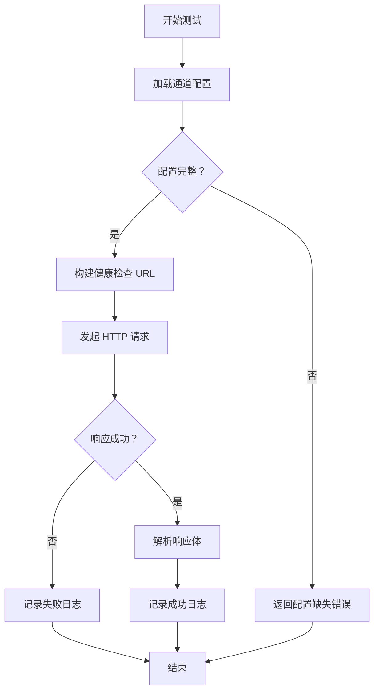
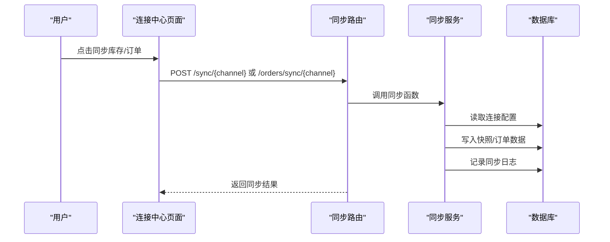
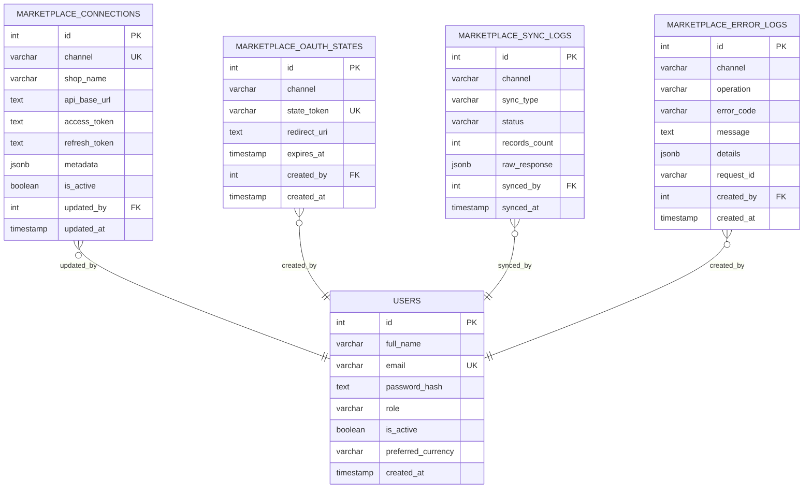
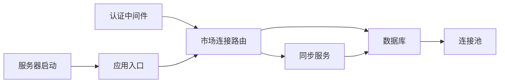

# 平台连接管理

<cite>
**本文档引用的文件**
- [server/src/routes/marketplaceRoutes.js](file://server/src/routes/marketplaceRoutes.js)
- [server/src/services/marketplaceSyncService.js](file://server/src/services/marketplaceSyncService.js)
- [server/src/services/orderSyncService.js](file://server/src/services/orderSyncService.js)
- [web/src/pages/MarketplaceCenterPage.vue](file://web/src/pages/MarketplaceCenterPage.vue)
- [web/src/pages/MarketplaceOAuthCallbackPage.vue](file://web/src/pages/MarketplaceOAuthCallbackPage.vue)
- [server/database/schema.sql](file://server/database/schema.sql)
- [server/src/config/db.js](file://server/src/config/db.js)
- [server/src/app.js](file://server/src/app.js)
- [server/src/server.js](file://server/src/server.js)
- [server/src/middleware/auth.js](file://server/src/middleware/auth.js)
- [server/src/utils/auditLog.js](file://server/src/utils/auditLog.js)
</cite>

## 目录
1. [简介](#简介)
2. [项目结构](#项目结构)
3. [核心组件](#核心组件)
4. [架构概览](#架构概览)
5. [详细组件分析](#详细组件分析)
6. [依赖关系分析](#依赖关系分析)
7. [性能考虑](#性能考虑)
8. [故障排除指南](#故障排除指南)
9. [结论](#结论)
10. [附录](#附录)

## 简介
本文件详细阐述库存管理系统的平台连接管理功能，涵盖 Shopee、Lazada、TikTok 等电商平台的连接配置与管理。内容包括：
- 连接配置流程：平台基本信息录入、API 端点设置、认证参数配置与连接状态管理
- OAuth 认证流程：授权链接生成、回调处理、token 存储与自动刷新机制
- 连接测试功能：健康检查、连通性验证与错误诊断
- 连接状态监控：活跃状态标记、最后更新时间与连接历史记录
- 最佳实践：安全设置、性能优化与故障排除指南

## 项目结构
系统采用前后端分离架构，后端基于 Express 提供 REST API，前端使用 Vue 3 构建管理界面。数据库为 PostgreSQL，使用连接池进行高效访问。

**图表来源**
- [server/src/app.js:1-91](file://server/src/app.js#L1-L91)
- [server/src/server.js:1-28](file://server/src/server.js#L1-L28)
- [server/src/routes/marketplaceRoutes.js:1-685](file://server/src/routes/marketplaceRoutes.js#L1-L685)
- [server/src/services/marketplaceSyncService.js:1-159](file://server/src/services/marketplaceSyncService.js#L1-L159)
- [server/src/services/orderSyncService.js:1-128](file://server/src/services/orderSyncService.js#L1-L128)
- [server/database/schema.sql:161-194](file://server/database/schema.sql#L161-L194)

**章节来源**
- [server/src/app.js:1-91](file://server/src/app.js#L1-L91)
- [server/src/server.js:1-28](file://server/src/server.js#L1-L28)
- [server/src/config/db.js:1-29](file://server/src/config/db.js#L1-L29)
- [server/database/schema.sql:161-194](file://server/database/schema.sql#L161-L194)

## 核心组件
- 市场连接路由：提供连接查询、更新、OAuth 流程、同步任务与状态监控接口
- 同步服务：封装各平台的库存与订单数据同步逻辑
- 数据库模式：定义连接、OAuth 状态、错误日志、同步日志等表结构
- 前端页面：电商连接中心与 OAuth 回调页面，提供可视化配置与操作界面

**章节来源**
- [server/src/routes/marketplaceRoutes.js:50-151](file://server/src/routes/marketplaceRoutes.js#L50-L151)
- [server/src/services/marketplaceSyncService.js:18-38](file://server/src/services/marketplaceSyncService.js#L18-L38)
- [server/src/services/orderSyncService.js:19-24](file://server/src/services/orderSyncService.js#L19-L24)
- [server/database/schema.sql:137-194](file://server/database/schema.sql#L137-L194)

## 架构概览
系统通过统一的认证中间件确保请求安全性，所有市场连接相关操作均需管理员或经理权限。OAuth 流程包含状态令牌生成、授权回调处理与连接信息持久化。同步服务负责从各平台拉取数据并写入本地快照与日志。

**图表来源**
- [server/src/routes/marketplaceRoutes.js:215-394](file://server/src/routes/marketplaceRoutes.js#L215-L394)
- [server/database/schema.sql:174-182](file://server/database/schema.sql#L174-L182)

**章节来源**
- [server/src/middleware/auth.js:1-87](file://server/src/middleware/auth.js#L1-L87)
- [server/src/routes/marketplaceRoutes.js:215-394](file://server/src/routes/marketplaceRoutes.js#L215-L394)

## 详细组件分析

### 连接配置流程
- 支持平台：Shopee、Lazada、TikTok
- 必填字段：店铺名称、API 基础 URL、访问令牌
- 可选字段：刷新令牌、元数据、是否激活
- 更新策略：按租户与平台唯一键进行插入或更新，保留最后修改人与时间戳

**图表来源**
- [server/src/routes/marketplaceRoutes.js:78-151](file://server/src/routes/marketplaceRoutes.js#L78-L151)
- [server/database/schema.sql:161-172](file://server/database/schema.sql#L161-L172)

**章节来源**
- [server/src/routes/marketplaceRoutes.js:78-151](file://server/src/routes/marketplaceRoutes.js#L78-L151)
- [web/src/pages/MarketplaceCenterPage.vue:136-159](file://web/src/pages/MarketplaceCenterPage.vue#L136-L159)

### OAuth 认证流程
- 授权链接生成：根据连接配置中的基础 URL 与元数据中的授权路径拼接
- 状态令牌：随机生成 10 分钟有效期，存储于 oauth_states 表
- 回调处理：校验状态令牌有效性，提取 code 并更新连接元数据
- 自动刷新：当前实现未包含自动刷新逻辑，建议在后续版本中扩展

**图表来源**
- [server/src/routes/marketplaceRoutes.js:215-394](file://server/src/routes/marketplaceRoutes.js#L215-L394)
- [server/database/schema.sql:174-182](file://server/database/schema.sql#L174-L182)

**章节来源**
- [server/src/routes/marketplaceRoutes.js:215-394](file://server/src/routes/marketplaceRoutes.js#L215-L394)
- [web/src/pages/MarketplaceOAuthCallbackPage.vue:19-54](file://web/src/pages/MarketplaceOAuthCallbackPage.vue#L19-L54)

### 连接测试功能
- 健康检查：基于连接配置中的端点替换为 /health 进行 GET 请求
- 连通性验证：检查响应状态码与 JSON 解析
- 错误诊断：记录错误日志与审计事件，便于问题追踪

**图表来源**
- [server/src/routes/marketplaceRoutes.js:396-456](file://server/src/routes/marketplaceRoutes.js#L396-L456)

**章节来源**
- [server/src/routes/marketplaceRoutes.js:396-456](file://server/src/routes/marketplaceRoutes.js#L396-L456)

### 同步任务与状态监控
- 库存同步：从平台端点拉取库存数据，标准化后写入快照表并记录同步日志
- 订单同步：拉取订单数据，标准化后写入订单与订单项表，记录同步日志
- 状态概览：聚合连接、同步、订单、发货与错误统计信息

**图表来源**
- [server/src/routes/marketplaceRoutes.js:153-213](file://server/src/routes/marketplaceRoutes.js#L153-L213)
- [server/src/routes/marketplaceRoutes.js:637-682](file://server/src/routes/marketplaceRoutes.js#L637-L682)
- [server/src/services/marketplaceSyncService.js:113-153](file://server/src/services/marketplaceSyncService.js#L113-L153)
- [server/src/services/orderSyncService.js:19-123](file://server/src/services/orderSyncService.js#L19-L123)

**章节来源**
- [server/src/routes/marketplaceRoutes.js:153-213](file://server/src/routes/marketplaceRoutes.js#L153-L213)
- [server/src/routes/marketplaceRoutes.js:637-682](file://server/src/routes/marketplaceRoutes.js#L637-L682)
- [server/src/services/marketplaceSyncService.js:113-153](file://server/src/services/marketplaceSyncService.js#L113-L153)
- [server/src/services/orderSyncService.js:19-123](file://server/src/services/orderSyncService.js#L19-L123)

### 数据模型
系统使用 PostgreSQL 存储连接配置、OAuth 状态、同步日志与错误日志等信息。关键表包括：

**图表来源**
- [server/database/schema.sql:161-194](file://server/database/schema.sql#L161-L194)

**章节来源**
- [server/database/schema.sql:161-194](file://server/database/schema.sql#L161-L194)

## 依赖关系分析
- 安全中间件：JWT 认证与角色授权确保只有具备权限的用户可以操作连接配置
- 数据库连接：PostgreSQL 连接池提供高并发访问能力，支持 SSL 配置
- 前后端通信：CORS 配置允许指定域名访问 API，统一错误处理避免敏感信息泄露

**图表来源**
- [server/src/middleware/auth.js:1-87](file://server/src/middleware/auth.js#L1-L87)
- [server/src/app.js:1-91](file://server/src/app.js#L1-L91)
- [server/src/server.js:1-28](file://server/src/server.js#L1-L28)
- [server/src/config/db.js:19-23](file://server/src/config/db.js#L19-L23)

**章节来源**
- [server/src/middleware/auth.js:1-87](file://server/src/middleware/auth.js#L1-L87)
- [server/src/app.js:28-58](file://server/src/app.js#L28-L58)
- [server/src/config/db.js:19-23](file://server/src/config/db.js#L19-L23)

## 性能考虑
- 速率限制：为同步与 OAuth 操作设置独立的速率限制器，防止滥用与过载
- 数据库索引：为常用查询字段建立索引，提升连接查询、错误日志检索与同步日志排序性能
- 连接池：合理配置连接池大小与超时时间，避免数据库连接争用
- 缓存策略：对于频繁读取的连接配置，可在应用层引入缓存以减少数据库压力

**章节来源**
- [server/src/routes/marketplaceRoutes.js:12-14](file://server/src/routes/marketplaceRoutes.js#L12-L14)
- [server/database/schema.sql:419-426](file://server/database/schema.sql#L419-L426)
- [server/src/config/db.js:19-23](file://server/src/config/db.js#L19-L23)

## 故障排除指南
- OAuth 状态无效：检查状态令牌是否过期或已被消费，确认回调参数完整性
- 连接测试失败：验证 API 基础 URL 与访问令牌配置，检查网络连通性与平台端点可用性
- 同步任务异常：查看同步日志与错误日志，定位具体失败环节并重试
- 权限不足：确认用户角色为 ADMIN 或 MANAGER，检查租户上下文是否正确

**章节来源**
- [server/src/routes/marketplaceRoutes.js:284-394](file://server/src/routes/marketplaceRoutes.js#L284-L394)
- [server/src/routes/marketplaceRoutes.js:396-456](file://server/src/routes/marketplaceRoutes.js#L396-L456)
- [server/src/routes/marketplaceRoutes.js:153-213](file://server/src/routes/marketplaceRoutes.js#L153-L213)
- [server/src/middleware/auth.js:64-72](file://server/src/middleware/auth.js#L64-L72)

## 结论
本系统提供了完整的平台连接管理能力，涵盖多平台配置、OAuth 流程、同步任务与状态监控。通过严格的权限控制、完善的日志记录与错误处理，确保了连接配置的安全性与可靠性。建议后续增强自动刷新机制与更细粒度的监控指标，以进一步提升用户体验与运维效率。

## 附录
- 环境变量配置示例：SHOPEE_SYNC_ENDPOINT、SHOPEE_ACCESS_TOKEN、LAZADA_*、TIKTOK_* 等
- 前端页面交互：电商连接中心提供直观的配置界面与操作按钮
- 审计与日志：所有关键操作均记录审计日志与错误日志，便于追溯与分析

**章节来源**
- [server/src/services/marketplaceSyncService.js:3-16](file://server/src/services/marketplaceSyncService.js#L3-L16)
- [web/src/pages/MarketplaceCenterPage.vue:1-477](file://web/src/pages/MarketplaceCenterPage.vue#L1-L477)
- [server/src/utils/auditLog.js:1-40](file://server/src/utils/auditLog.js#L1-L40)