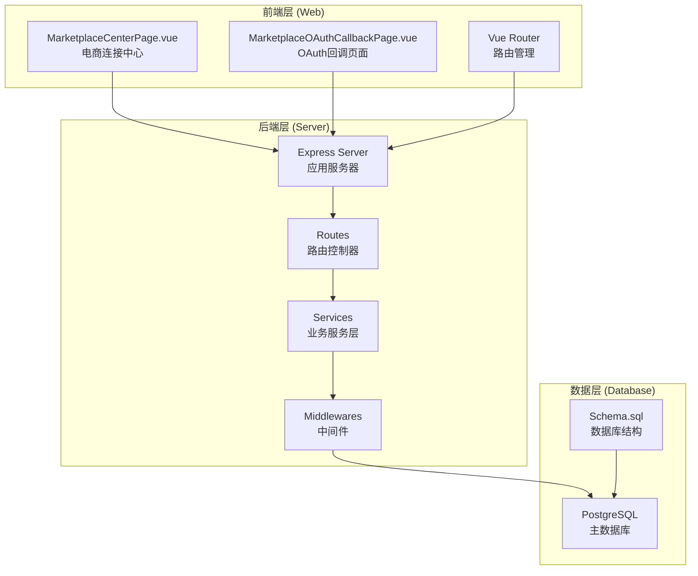
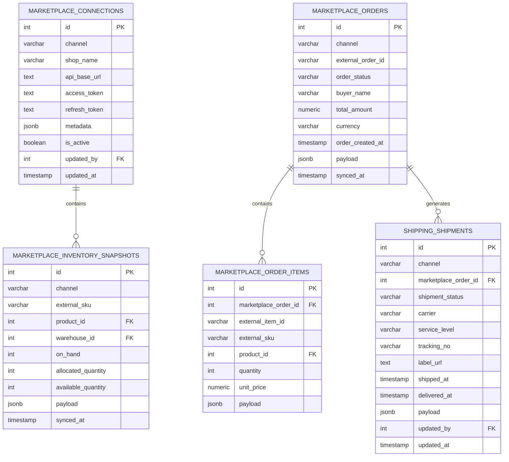
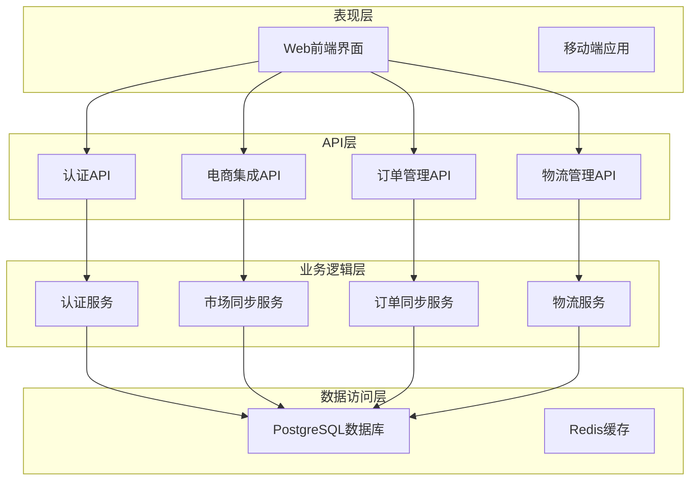
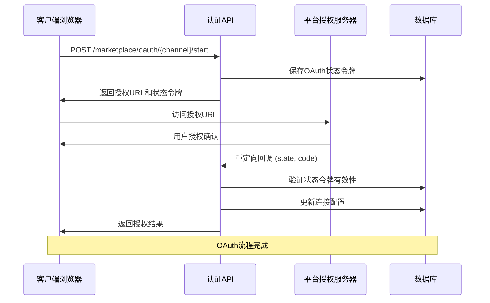
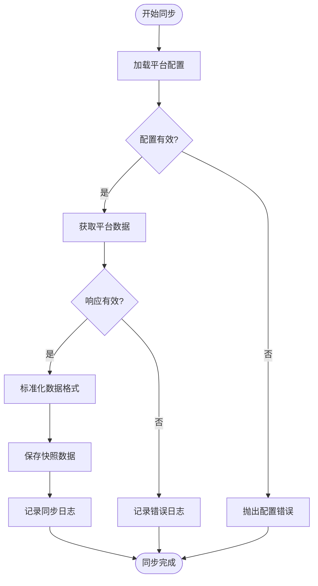
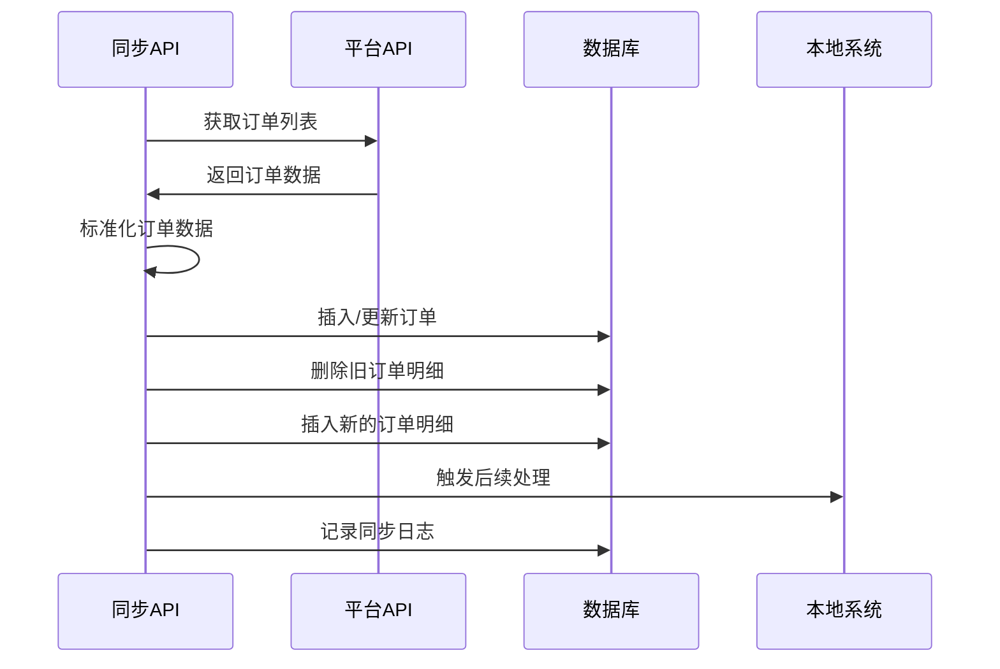
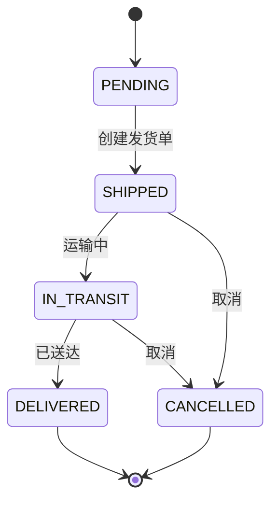
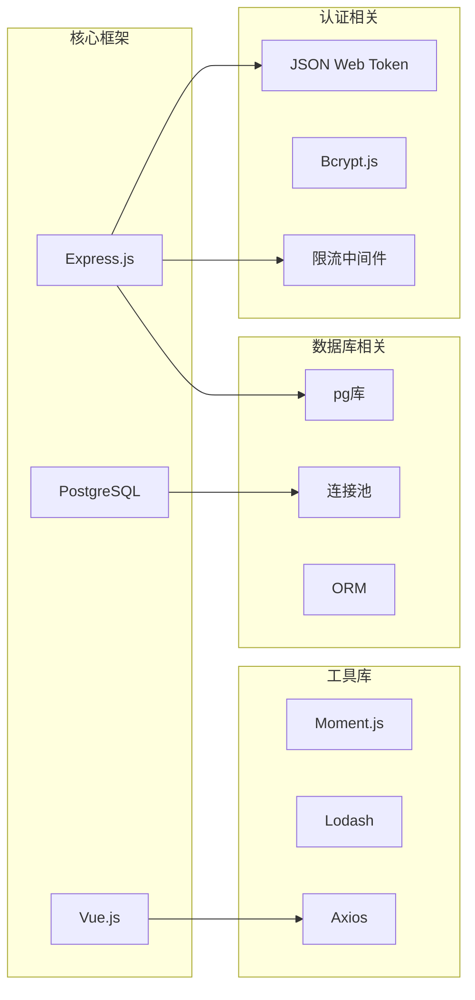
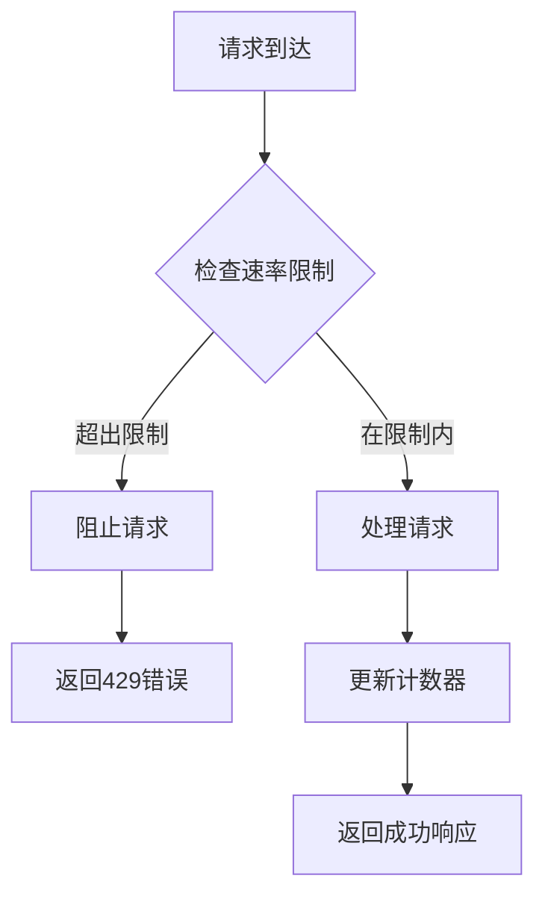
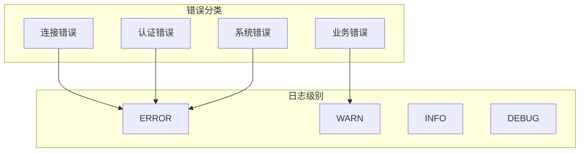

# 电商集成模块

<cite>
**本文档引用的文件**
- [marketplaceRoutes.js](file://server/src/routes/marketplaceRoutes.js)
- [marketplaceSyncService.js](file://server/src/services/marketplaceSyncService.js)
- [orderRoutes.js](file://server/src/routes/orderRoutes.js)
- [orderSyncService.js](file://server/src/services/orderSyncService.js)
- [schema.sql](file://server/database/schema.sql)
- [db.js](file://server/src/config/db.js)
- [rateLimit.js](file://server/src/middleware/rateLimit.js)
- [auditLog.js](file://server/src/utils/auditLog.js)
- [MarketplaceCenterPage.vue](file://web/src/pages/MarketplaceCenterPage.vue)
- [MarketplaceOAuthCallbackPage.vue](file://web/src/pages/MarketplaceOAuthCallbackPage.vue)
- [shippingRoutes.js](file://server/src/routes/shippingRoutes.js)
- [authRoutes.js](file://server/src/routes/authRoutes.js)
</cite>

## 目录
1. [简介](#简介)
2. [项目结构](#项目结构)
3. [核心组件](#核心组件)
4. [架构概览](#架构概览)
5. [详细组件分析](#详细组件分析)
6. [依赖关系分析](#依赖关系分析)
7. [性能考虑](#性能考虑)
8. [故障排除指南](#故障排除指南)
9. [结论](#结论)

## 简介

电商集成模块是一个完整的电商平台连接解决方案，支持 Shopee、Lazada 和 TikTok 三大主流电商平台。该模块提供了从 OAuth 授权、商品同步、订单处理到物流跟踪的全链路集成能力，旨在帮助用户实现多平台库存和订单的统一管理。

模块采用前后端分离架构，后端基于 Node.js + Express 提供 RESTful API，前端使用 Vue.js 构建用户界面，数据库采用 PostgreSQL 存储所有业务数据。

## 项目结构

电商集成模块主要由以下几部分组成：

**图表来源**
- [MarketplaceCenterPage.vue:1-477](file://web/src/pages/MarketplaceCenterPage.vue#L1-L477)
- [marketplaceRoutes.js:1-685](file://server/src/routes/marketplaceRoutes.js#L1-L685)
- [schema.sql:1-447](file://server/database/schema.sql#L1-L447)

**章节来源**
- [marketplaceRoutes.js:1-685](file://server/src/routes/marketplaceRoutes.js#L1-L685)
- [schema.sql:1-447](file://server/database/schema.sql#L1-L447)

## 核心组件

### 支持的电商平台

模块目前支持以下三个主要电商平台：

| 平台 | 代码标识 | API端点 | 认证方式 |
|------|----------|---------|----------|
| Shopee | `shopee` | `SHOPEE_SYNC_ENDPOINT` | OAuth 2.0 |
| Lazada | `lazada` | `LAZADA_SYNC_ENDPOINT` | OAuth 2.0 |
| TikTok | `tiktok` | `TIKTOK_SYNC_ENDPOINT` | OAuth 2.0 |

### 数据模型设计

系统采用关系型数据库设计，核心表结构如下：

**图表来源**
- [schema.sql:148-235](file://server/database/schema.sql#L148-L235)

**章节来源**
- [schema.sql:148-235](file://server/database/schema.sql#L148-L235)

## 架构概览

电商集成模块采用分层架构设计，确保了良好的可维护性和扩展性：

**图表来源**
- [marketplaceRoutes.js:1-685](file://server/src/routes/marketplaceRoutes.js#L1-L685)
- [orderRoutes.js:1-124](file://server/src/routes/orderRoutes.js#L1-L124)
- [shippingRoutes.js:1-168](file://server/src/routes/shippingRoutes.js#L1-L168)

## 详细组件分析

### OAuth 认证流程

OAuth 认证是电商集成的核心安全机制，支持三种不同的授权模式：

#### OAuth 授权流程

**图表来源**
- [marketplaceRoutes.js:215-394](file://server/src/routes/marketplaceRoutes.js#L215-L394)

#### OAuth 状态管理

系统实现了完整的 OAuth 状态管理机制：

| 组件 | 功能 | 安全特性 |
|------|------|----------|
| `marketplace_oauth_states` | 存储临时授权状态 | 10分钟过期时间 |
| `marketplace_connections` | 存储最终连接信息 | 加密存储敏感令牌 |
| `metadata.oauth` | 存储OAuth元数据 | 最近授权时间戳 |

**章节来源**
- [marketplaceRoutes.js:215-394](file://server/src/routes/marketplaceRoutes.js#L215-L394)
- [schema.sql:174-182](file://server/database/schema.sql#L174-L182)

### 商品同步功能

商品同步模块负责从各个电商平台获取商品库存信息并进行本地化处理：

#### 商品同步流程

**图表来源**
- [marketplaceSyncService.js:113-153](file://server/src/services/marketplaceSyncService.js#L113-L153)

#### 数据标准化规则

系统实现了灵活的数据标准化机制，支持不同平台的数据格式差异：

| 字段 | Shopee | Lazada | TikTok | 标准化字段 |
|------|--------|--------|--------|------------|
| SKU | `sku` | `externalSku` | `sku` | `externalSku` |
| 库存数量 | `onHand` | `on_hand` | `quantity` | `onHandQuantity` |
| 已分配数量 | `allocated` | `order_allocated` | `allocated` | `allocatedQuantity` |
| 可用数量 | `available` | `warehouse_available` | `available` | `availableQuantity` |

**章节来源**
- [marketplaceSyncService.js:40-59](file://server/src/services/marketplaceSyncService.js#L40-L59)

### 订单同步机制

订单同步模块负责从电商平台获取订单信息并进行本地化处理：

#### 订单同步流程

**图表来源**
- [orderSyncService.js:19-123](file://server/src/services/orderSyncService.js#L19-L123)

#### 订单状态管理

系统支持完整的订单生命周期管理：

| 状态 | 描述 | 业务含义 |
|------|------|----------|
| `PENDING` | 待处理 | 新订单创建 |
| `CONFIRMED` | 已确认 | 商家确认订单 |
| `SHIPPED` | 已发货 | 商品已发出 |
| `DELIVERED` | 已送达 | 客户收到商品 |
| `CANCELLED` | 已取消 | 订单取消 |
| `REFUNDED` | 已退款 | 退款完成 |

**章节来源**
- [orderSyncService.js:4-17](file://server/src/services/orderSyncService.js#L4-L17)
- [schema.sql:196-208](file://server/database/schema.sql#L196-L208)

### 物流跟踪集成

物流跟踪模块提供了完整的物流状态管理和运单号同步功能：

#### 物流状态管理

**图表来源**
- [shippingRoutes.js:120-166](file://server/src/routes/shippingRoutes.js#L120-L166)

#### 发货处理流程

系统支持多种发货方式：

| 方式 | 描述 | 使用场景 |
|------|------|----------|
| 手动发货 | 人工输入运单号 | 小批量订单 |
| 自动发货 | 从平台API获取 | 大批量订单 |
| 批量发货 | 一次性处理多个订单 | 促销活动 |

**章节来源**
- [shippingRoutes.js:70-118](file://server/src/routes/shippingRoutes.js#L70-L118)

## 依赖关系分析

### 技术栈依赖

**图表来源**
- [authRoutes.js:1-180](file://server/src/routes/authRoutes.js#L1-L180)
- [db.js:1-29](file://server/src/config/db.js#L1-L29)

### 组件耦合度分析

系统采用了松耦合的设计原则：

| 层级 | 耦合类型 | 设计原则 | 实现方式 |
|------|----------|----------|----------|
| 表现层 | 低耦合 | 无状态设计 | Vue组件化 |
| API层 | 中等耦合 | 单一职责 | 路由控制器 |
| 业务层 | 低耦合 | 依赖注入 | 服务类封装 |
| 数据层 | 低耦合 | 数据抽象 | ORM映射 |

**章节来源**
- [marketplaceRoutes.js:1-685](file://server/src/routes/marketplaceRoutes.js#L1-L685)
- [orderRoutes.js:1-124](file://server/src/routes/orderRoutes.js#L1-L124)

## 性能考虑

### 速率限制机制

系统实现了多层次的速率限制机制：

**图表来源**
- [rateLimit.js:9-35](file://server/src/middleware/rateLimit.js#L9-L35)

### 缓存策略

系统采用了多级缓存策略：

| 缓存层级 | 类型 | 用途 | 生命周期 |
|----------|------|------|----------|
| 应用层缓存 | 内存缓存 | 配置数据 | 短期 |
| 数据库索引 | PostgreSQL索引 | 查询优化 | 持久化 |
| 前端缓存 | 浏览器缓存 | 页面资源 | 会话期 |

**章节来源**
- [rateLimit.js:1-40](file://server/src/middleware/rateLimit.js#L1-L40)

## 故障排除指南

### 常见问题诊断

#### OAuth 授权失败

**症状**: 授权回调返回错误

**可能原因**:
1. OAuth 状态令牌过期
2. 回调URL不匹配
3. 平台配置错误

**解决步骤**:
1. 检查 `marketplace_oauth_states` 表中的状态令牌
2. 验证回调URL配置
3. 重新发起授权流程

#### 商品同步失败

**症状**: 库存同步返回错误

**可能原因**:
1. API端点配置错误
2. 访问令牌失效
3. 平台API限制

**解决步骤**:
1. 使用连接测试功能验证配置
2. 检查访问令牌有效期
3. 查看错误日志获取详细信息

#### 订单同步异常

**症状**: 订单数据不完整或重复

**可能原因**:
1. 数据标准化规则不匹配
2. 并发同步冲突
3. 数据库约束冲突

**解决步骤**:
1. 检查数据标准化映射
2. 实施并发控制机制
3. 清理重复数据

**章节来源**
- [marketplaceRoutes.js:22-32](file://server/src/routes/marketplaceRoutes.js#L22-L32)
- [orderSyncService.js:19-24](file://server/src/services/orderSyncService.js#L19-L24)

### 错误日志分析

系统提供了完善的错误追踪机制：

**图表来源**
- [marketplaceRoutes.js:22-32](file://server/src/routes/marketplaceRoutes.js#L22-L32)

**章节来源**
- [schema.sql:184-194](file://server/database/schema.sql#L184-L194)

## 结论

电商集成模块提供了一个完整、可扩展的多平台电商解决方案。通过精心设计的架构和完善的错误处理机制，该模块能够满足大多数电商集成需求。

### 主要优势

1. **多平台支持**: 支持 Shopee、Lazada、TikTok 三大主流平台
2. **安全可靠**: 完整的 OAuth 认证和权限控制
3. **数据一致**: 标准化的数据映射和同步机制
4. **可观测性**: 完善的日志记录和错误追踪
5. **可扩展性**: 模块化设计便于功能扩展

### 未来改进方向

1. **API限制处理**: 实现更智能的重试机制和限流策略
2. **增量同步**: 支持基于时间戳的增量数据同步
3. **批量处理**: 优化大量数据的处理性能
4. **监控告警**: 添加实时监控和告警功能
5. **自动化运维**: 实现自动化的部署和配置管理

该模块为电商企业实现多平台统一管理提供了坚实的技术基础，通过持续的优化和扩展，能够更好地满足不断变化的业务需求。