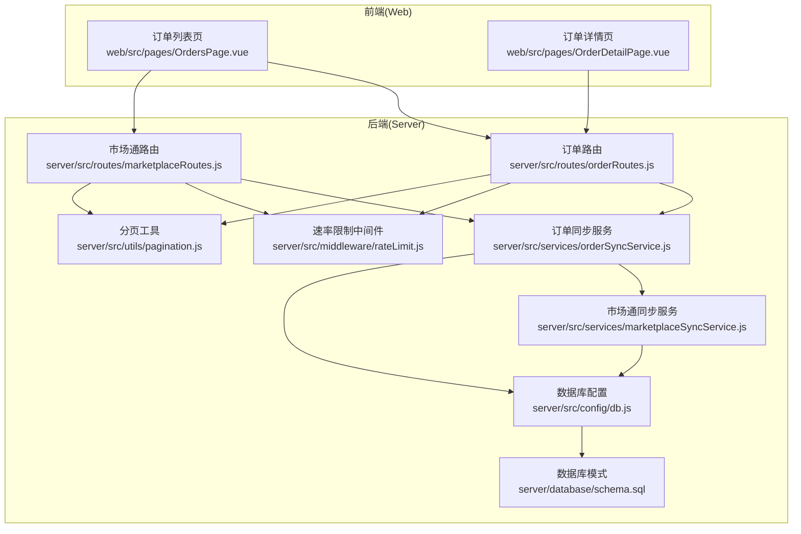
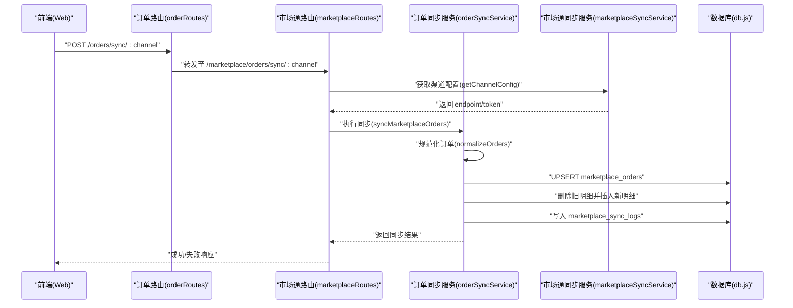
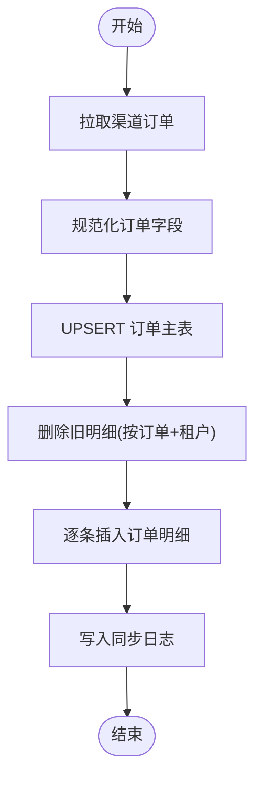
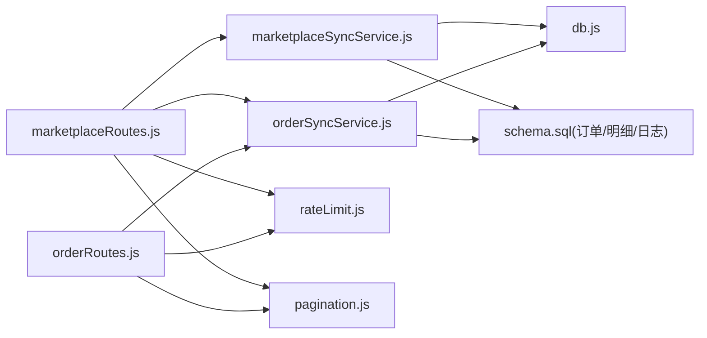
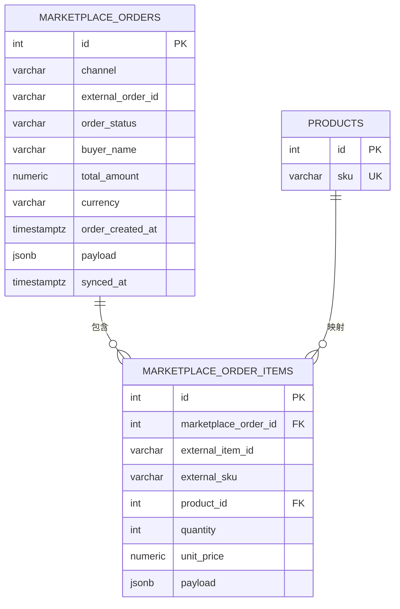

# 订单同步

<cite>
**本文引用的文件**
- [server/src/services/orderSyncService.js](file://server/src/services/orderSyncService.js)
- [server/src/routes/orderRoutes.js](file://server/src/routes/orderRoutes.js)
- [server/src/routes/marketplaceRoutes.js](file://server/src/routes/marketplaceRoutes.js)
- [server/src/services/marketplaceSyncService.js](file://server/src/services/marketplaceSyncService.js)
- [server/src/config/db.js](file://server/src/config/db.js)
- [server/database/schema.sql](file://server/database/schema.sql)
- [server/src/middleware/rateLimit.js](file://server/src/middleware/rateLimit.js)
- [server/src/utils/pagination.js](file://server/src/utils/pagination.js)
- [server/src/utils/auditLog.js](file://server/src/utils/auditLog.js)
- [server/src/middleware/auditTrail.js](file://server/src/middleware/auditTrail.js)
- [web/src/pages/OrdersPage.vue](file://web/src/pages/OrdersPage.vue)
- [web/src/pages/OrderDetailPage.vue](file://web/src/pages/OrderDetailPage.vue)
</cite>

## 目录
1. [简介](#简介)
2. [项目结构](#项目结构)
3. [核心组件](#核心组件)
4. [架构总览](#架构总览)
5. [详细组件分析](#详细组件分析)
6. [依赖关系分析](#依赖关系分析)
7. [性能考量](#性能考量)
8. [故障排查指南](#故障排查指南)
9. [结论](#结论)
10. [附录](#附录)

## 简介
本文件系统性阐述电商订单同步功能的设计与实现，覆盖从平台拉取订单、规范化处理、入库持久化、状态更新、以及前端展示与操作的全链路。重点包括：
- 订单获取流程：支持 Shopee/Lazada/TikTok 三大渠道，通过统一配置与动态 endpoint 拉取订单。
- 订单筛选与分页：按渠道、状态、关键词进行筛选与分页查询。
- 数据完整性：订单主体、明细、产品关联、原始 payload 存储。
- 冲突与去重：基于租户+渠道+外部订单号的唯一约束，UPSERT 更新。
- 性能与可靠性：限流、并发查询、审计与错误日志、SSL 连接控制。

## 项目结构
后端采用 Express 路由 + 服务层 + 数据库层分层；前端使用 Vue 页面调用后端接口完成订单列表与详情展示。

图表来源
- [server/src/routes/orderRoutes.js:1-124](file://server/src/routes/orderRoutes.js#L1-L124)
- [server/src/routes/marketplaceRoutes.js:1-200](file://server/src/routes/marketplaceRoutes.js#L1-L200)
- [server/src/services/orderSyncService.js:1-128](file://server/src/services/orderSyncService.js#L1-L128)
- [server/src/services/marketplaceSyncService.js:1-159](file://server/src/services/marketplaceSyncService.js#L1-L159)
- [server/src/middleware/rateLimit.js:1-40](file://server/src/middleware/rateLimit.js#L1-L40)
- [server/src/utils/pagination.js:1-28](file://server/src/utils/pagination.js#L1-L28)
- [server/src/config/db.js:1-29](file://server/src/config/db.js#L1-L29)
- [server/database/schema.sql:137-219](file://server/database/schema.sql#L137-L219)

章节来源
- [server/src/routes/orderRoutes.js:1-124](file://server/src/routes/orderRoutes.js#L1-L124)
- [server/src/routes/marketplaceRoutes.js:1-200](file://server/src/routes/marketplaceRoutes.js#L1-L200)
- [server/src/services/orderSyncService.js:1-128](file://server/src/services/orderSyncService.js#L1-L128)
- [server/src/services/marketplaceSyncService.js:1-159](file://server/src/services/marketplaceSyncService.js#L1-L159)
- [server/src/config/db.js:1-29](file://server/src/config/db.js#L1-L29)
- [server/database/schema.sql:137-219](file://server/database/schema.sql#L137-L219)

## 核心组件
- 订单同步服务：负责从渠道拉取订单、规范化字段、UPSERT 订单与明细、记录同步日志。
- 订单路由：提供订单列表查询、详情查询、触发同步等接口。
- 市场通路由：提供连接配置、健康检查、库存与订单同步入口。
- 配置与中间件：数据库连接（含 SSL 控制）、速率限制、分页工具、审计日志。
- 数据库模式：定义订单、订单明细、同步日志、错误日志等表结构及索引。

章节来源
- [server/src/services/orderSyncService.js:1-128](file://server/src/services/orderSyncService.js#L1-L128)
- [server/src/routes/orderRoutes.js:1-124](file://server/src/routes/orderRoutes.js#L1-L124)
- [server/src/routes/marketplaceRoutes.js:637-682](file://server/src/routes/marketplaceRoutes.js#L637-L682)
- [server/src/config/db.js:1-29](file://server/src/config/db.js#L1-L29)
- [server/src/middleware/rateLimit.js:1-40](file://server/src/middleware/rateLimit.js#L1-L40)
- [server/src/utils/pagination.js:1-28](file://server/src/utils/pagination.js#L1-L28)
- [server/database/schema.sql:137-219](file://server/database/schema.sql#L137-L219)

## 架构总览
订单同步整体流程：前端触发同步 → 后端路由校验与限流 → 服务层获取渠道配置 → 拉取订单 → 规范化 → UPSERT 订单与明细 → 写入同步日志 → 返回结果。

图表来源
- [server/src/routes/marketplaceRoutes.js:637-682](file://server/src/routes/marketplaceRoutes.js#L637-L682)
- [server/src/services/orderSyncService.js:19-123](file://server/src/services/orderSyncService.js#L19-L123)
- [server/src/services/marketplaceSyncService.js:19-38](file://server/src/services/marketplaceSyncService.js#L19-L38)

## 详细组件分析

### 订单获取与规范化
- 获取渠道配置：优先读取租户级连接配置，若未配置则回退到环境变量。
- 动态 endpoint：将 inventory endpoint 替换为 orders endpoint 拉取订单。
- 规范化字段：统一外部订单号、状态、买家名、金额、币种、下单时间、明细数组等。
- 过滤条件：仅保留存在外部订单号的记录。

章节来源
- [server/src/services/orderSyncService.js:4-17](file://server/src/services/orderSyncService.js#L4-L17)
- [server/src/services/orderSyncService.js:19-40](file://server/src/services/orderSyncService.js#L19-L40)
- [server/src/services/marketplaceSyncService.js:19-38](file://server/src/services/marketplaceSyncService.js#L19-L38)

### 订单入库与去重
- 主表插入/更新：以租户+渠道+外部订单号为唯一键，UPSERT 更新状态、金额、币种、下单时间、payload，并刷新 synced_at。
- 明细清理与重建：先按订单与租户删除旧明细，再插入新明细，确保与上游 payload 完全一致。
- 产品匹配：按外部 SKU 查询本地产品 ID，缺失时保留外部 SKU 与原始明细。

图表来源
- [server/src/services/orderSyncService.js:42-117](file://server/src/services/orderSyncService.js#L42-L117)

章节来源
- [server/src/services/orderSyncService.js:42-117](file://server/src/services/orderSyncService.js#L42-L117)

### 订单筛选与分页查询
- 支持筛选：渠道、订单状态、关键词（外部订单号或买家名）。
- 并发查询：同时查询列表与总数，提升分页性能。
- 排序：按下单时间降序，其次按同步时间降序。

章节来源
- [server/src/routes/orderRoutes.js:33-88](file://server/src/routes/orderRoutes.js#L33-L88)
- [server/src/utils/pagination.js:1-28](file://server/src/utils/pagination.js#L1-L28)

### 前端交互
- 订单列表页：支持选择渠道、状态、关键词搜索，点击“同步”触发对应渠道同步。
- 订单详情页：展示订单概览与明细，包含产品名称/SKU/数量/单价。

章节来源
- [web/src/pages/OrdersPage.vue:33-78](file://web/src/pages/OrdersPage.vue#L33-L78)
- [web/src/pages/OrderDetailPage.vue:19-36](file://web/src/pages/OrderDetailPage.vue#L19-L36)

### 错误处理与审计
- 失败日志：同步失败写入 marketplace_sync_logs（状态 FAILED），并记录错误详情。
- 错误日志：统一写入 marketplace_error_logs，便于追踪。
- 审计日志：对关键操作（如订单同步）写入 audit_logs，记录用户、路径、元数据等。

章节来源
- [server/src/routes/marketplaceRoutes.js:656-681](file://server/src/routes/marketplaceRoutes.js#L656-L681)
- [server/src/utils/auditLog.js:1-40](file://server/src/utils/auditLog.js#L1-L40)
- [server/src/middleware/auditTrail.js:1-86](file://server/src/middleware/auditTrail.js#L1-L86)

## 依赖关系分析

图表来源
- [server/src/routes/orderRoutes.js:1-124](file://server/src/routes/orderRoutes.js#L1-L124)
- [server/src/routes/marketplaceRoutes.js:1-200](file://server/src/routes/marketplaceRoutes.js#L1-L200)
- [server/src/services/orderSyncService.js:1-128](file://server/src/services/orderSyncService.js#L1-L128)
- [server/src/services/marketplaceSyncService.js:1-159](file://server/src/services/marketplaceSyncService.js#L1-L159)
- [server/src/middleware/rateLimit.js:1-40](file://server/src/middleware/rateLimit.js#L1-L40)
- [server/src/utils/pagination.js:1-28](file://server/src/utils/pagination.js#L1-L28)
- [server/src/config/db.js:1-29](file://server/src/config/db.js#L1-L29)
- [server/database/schema.sql:137-219](file://server/database/schema.sql#L137-L219)

章节来源
- [server/src/routes/orderRoutes.js:1-124](file://server/src/routes/orderRoutes.js#L1-L124)
- [server/src/routes/marketplaceRoutes.js:1-200](file://server/src/routes/marketplaceRoutes.js#L1-L200)
- [server/src/services/orderSyncService.js:1-128](file://server/src/services/orderSyncService.js#L1-L128)
- [server/src/services/marketplaceSyncService.js:1-159](file://server/src/services/marketplaceSyncService.js#L1-L159)
- [server/src/config/db.js:1-29](file://server/src/config/db.js#L1-L29)
- [server/database/schema.sql:137-219](file://server/database/schema.sql#L137-L219)

## 性能考量
- 速率限制：订单同步接口默认每分钟最多 12 次请求，避免对渠道 API 的突发压力。
- 并发查询：列表页同时查询数据与总数，减少往返延迟。
- 索引优化：对订单表的 channel、status、订单明细表的订单外键建立索引，加速筛选与连接。
- 连接池与 SSL：根据连接字符串与环境变量自动判断是否启用 SSL，降低网络开销与安全风险。
- UPSERT 与批量写入：单次同步循环内按订单粒度写入，避免大事务；明细先删后插保证一致性。

章节来源
- [server/src/middleware/rateLimit.js:9-35](file://server/src/middleware/rateLimit.js#L9-L35)
- [server/src/routes/orderRoutes.js:39-87](file://server/src/routes/orderRoutes.js#L39-L87)
- [server/database/schema.sql:419-426](file://server/database/schema.sql#L419-L426)
- [server/src/config/db.js:3-23](file://server/src/config/db.js#L3-L23)

## 故障排查指南
- 同步失败
  - 检查渠道连接配置是否完整（endpoint/token），或租户级连接是否存在。
  - 查看 marketplace_sync_logs 中的失败记录与原始响应。
  - 查看 marketplace_error_logs 中的错误码与详情。
- 速率限制
  - 若返回 429，请等待桶恢复后再试；可调整限流窗口与最大请求数。
- 数据不一致
  - 确认是否正确执行了“删除旧明细并插入新明细”的流程。
  - 检查外部订单号是否唯一，避免跨租户/跨渠道冲突。
- 审计与可观测性
  - 通过 audit_logs 追踪操作轨迹，定位异常请求来源。

章节来源
- [server/src/routes/marketplaceRoutes.js:656-681](file://server/src/routes/marketplaceRoutes.js#L656-L681)
- [server/src/utils/auditLog.js:1-40](file://server/src/utils/auditLog.js#L1-L40)
- [server/src/middleware/auditTrail.js:47-81](file://server/src/middleware/auditTrail.js#L47-L81)
- [server/database/schema.sql:137-194](file://server/database/schema.sql#L137-L194)

## 结论
该订单同步模块以清晰的分层设计实现了从多渠道拉取订单、规范化入库、状态更新与前端展示的闭环。通过唯一键约束与明细重建保障数据一致性，结合速率限制、审计与错误日志形成可靠的可观测体系。建议后续扩展：
- 支持时间范围筛选与增量拉取（基于 order_created_at 或 updated_at）。
- 引入幂等令牌与重试队列，进一步增强可靠性。
- 对高频渠道增加异步任务队列与批量写入优化。

## 附录

### 数据模型（订单与明细）

图表来源
- [server/database/schema.sql:196-219](file://server/database/schema.sql#L196-L219)

### 订单状态映射与更新逻辑
- 规范化阶段将状态统一转为大写，默认值为 PENDING。
- UPSERT 时直接覆盖 order_status 字段，实现状态更新。
- 建议在业务侧补充状态机校验（如仅允许合法迁移），以避免非法状态变更。

章节来源
- [server/src/services/orderSyncService.js:8-9](file://server/src/services/orderSyncService.js#L8-L9)
- [server/src/services/orderSyncService.js:50-57](file://server/src/services/orderSyncService.js#L50-L57)

### 订单处理流程（确认/发货/退款/取消）
- 订单确认：由渠道订单状态驱动，系统通过同步更新 order_status。
- 发货处理：通过发货路由创建 shipping_shipments，将 shipment_status 设为 SHIPPED 并记录物流信息。
- 退款/取消：当前订单同步未包含退款/取消专用字段，可在后续扩展中引入退款状态字段并在发货路由中支持状态流转。

章节来源
- [server/src/routes/shippingRoutes.js:70-127](file://server/src/routes/shippingRoutes.js#L70-L127)
- [server/database/schema.sql:221-235](file://server/database/schema.sql#L221-L235)

### 订单数据完整性
- 订单主体：channel、external_order_id、order_status、buyer_name、total_amount、currency、order_created_at、payload。
- 明细：external_item_id、external_sku、product_id、quantity、unit_price、payload。
- 关联：通过 marketplace_order_id 与 product_id 关联订单与产品。

章节来源
- [server/src/services/orderSyncService.js:45-107](file://server/src/services/orderSyncService.js#L45-L107)
- [server/database/schema.sql:196-219](file://server/database/schema.sql#L196-L219)

### 订单冲突处理与去重
- 唯一键：(tenant_id, channel, external_order_id)，避免重复插入。
- 冲突策略：ON CONFLICT DO UPDATE，覆盖状态、金额、币种、下单时间与 payload，并刷新 synced_at。
- 明细去重：每次同步前删除旧明细，确保与上游 payload 一致。

章节来源
- [server/database/schema.sql:207](file://server/database/schema.sql#L207)
- [server/src/services/orderSyncService.js:49-58](file://server/src/services/orderSyncService.js#L49-L58)
- [server/src/services/orderSyncService.js:75-79](file://server/src/services/orderSyncService.js#L75-L79)

### 性能优化与监控告警建议
- 性能优化
  - 列表页并发查询、合理分页大小。
  - 为常用筛选字段建立索引（已具备）。
  - 限流策略按渠道与租户维度细化。
- 错误处理
  - 失败时统一写入 marketplace_sync_logs 与 marketplace_error_logs。
  - 审计日志记录关键操作与元数据。
- 监控告警
  - 建议接入外部监控（如指标采集与告警），对失败率、响应时间、同步延迟进行告警。

章节来源
- [server/src/routes/marketplaceRoutes.js:656-681](file://server/src/routes/marketplaceRoutes.js#L656-L681)
- [server/src/utils/auditLog.js:1-40](file://server/src/utils/auditLog.js#L1-L40)
- [server/src/middleware/auditTrail.js:47-81](file://server/src/middleware/auditTrail.js#L47-L81)