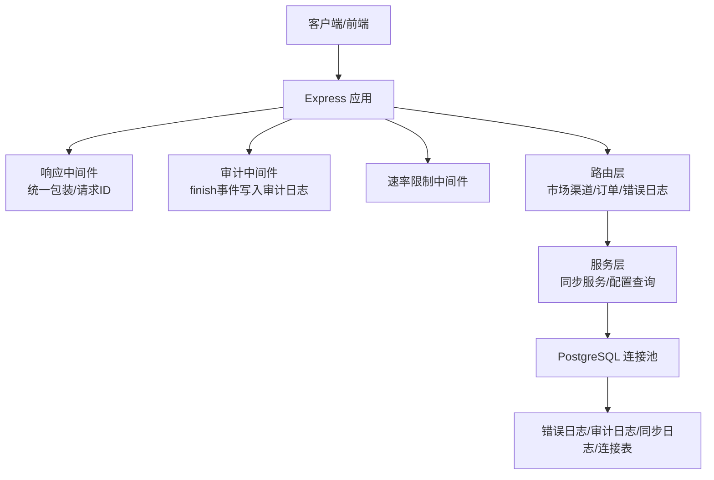
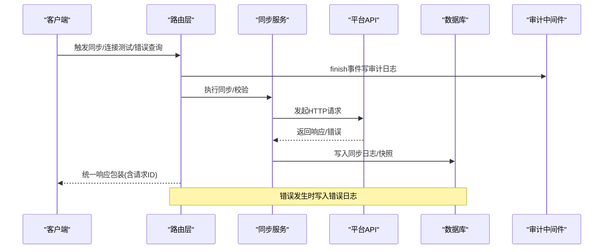
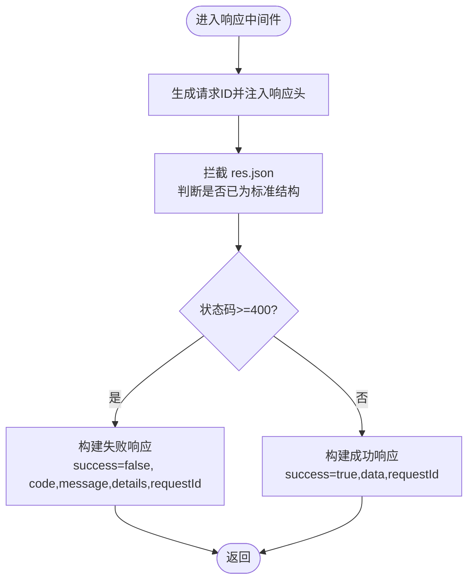
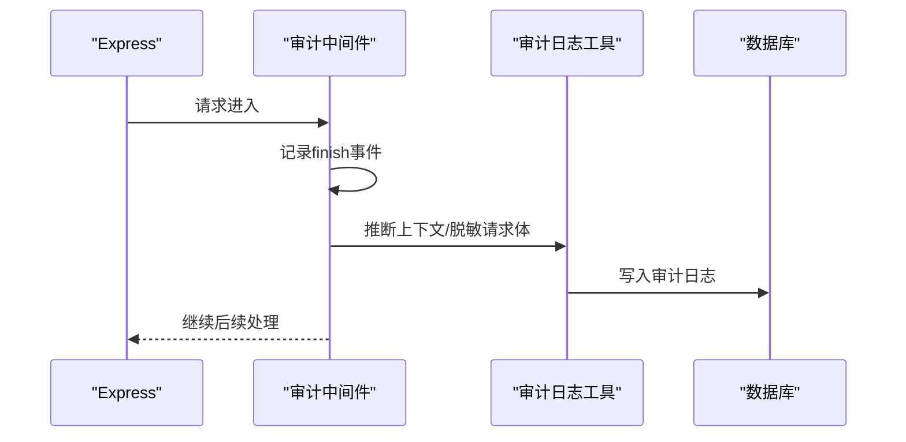
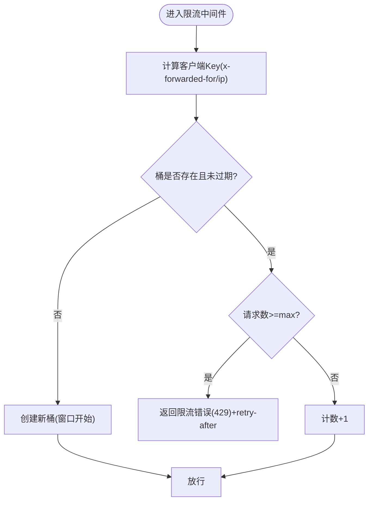
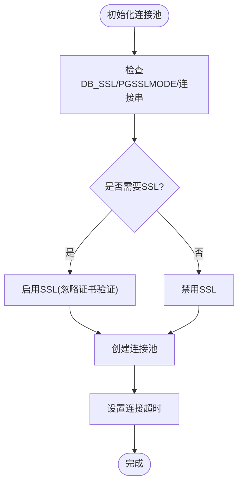
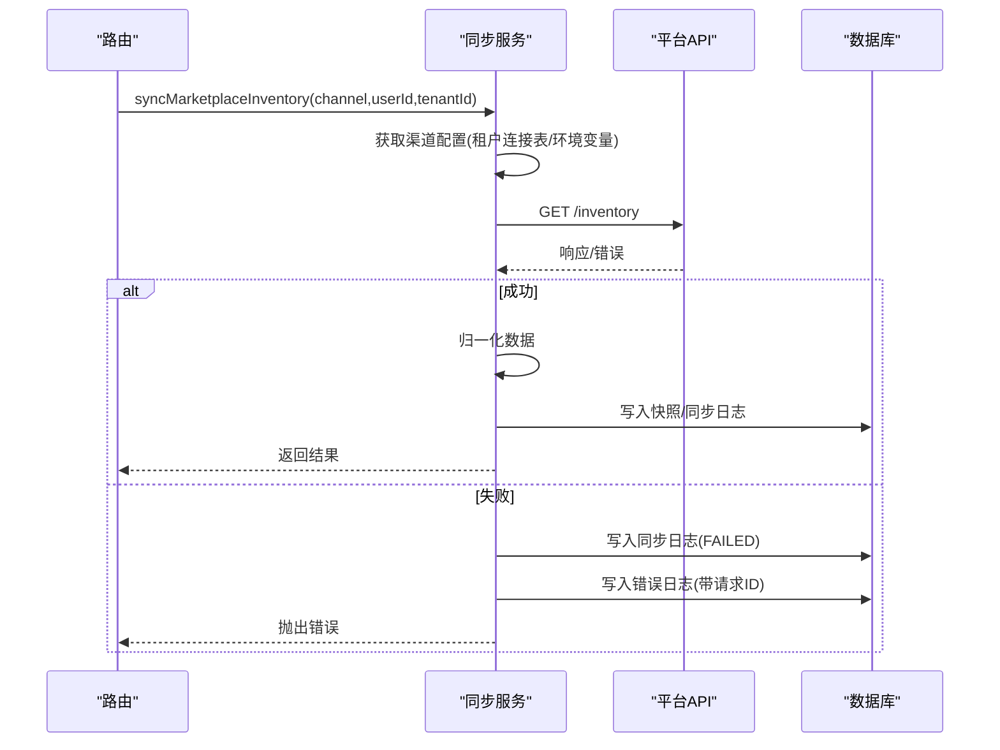
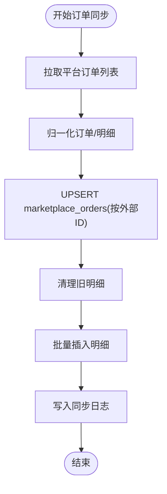
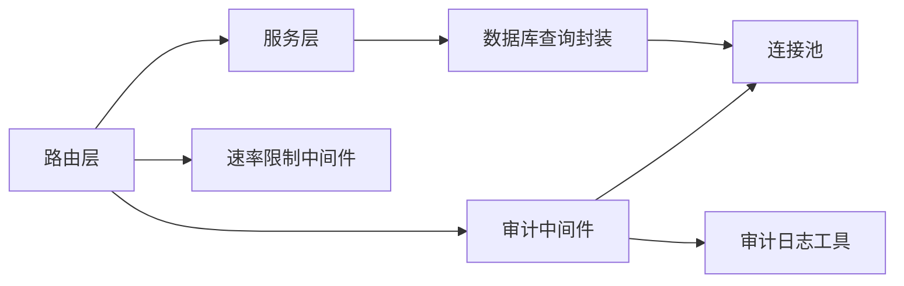
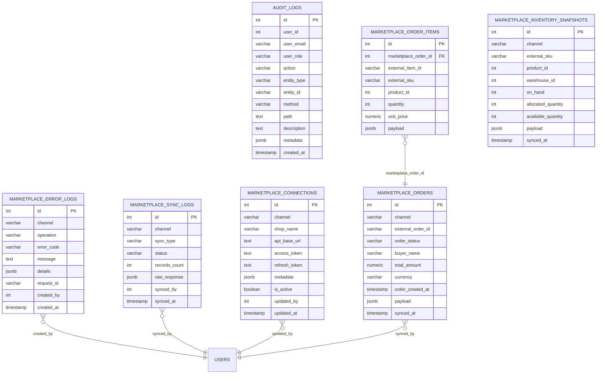

# 错误处理与监控

<cite>
**本文引用的文件**
- [server/src/app.js](file://server/src/app.js)
- [server/src/middleware/response.js](file://server/src/middleware/response.js)
- [server/src/middleware/auditTrail.js](file://server/src/middleware/auditTrail.js)
- [server/src/middleware/rateLimit.js](file://server/src/middleware/rateLimit.js)
- [server/src/config/db.js](file://server/src/config/db.js)
- [server/src/utils/auditLog.js](file://server/src/utils/auditLog.js)
- [server/src/services/marketplaceSyncService.js](file://server/src/services/marketplaceSyncService.js)
- [server/src/services/orderSyncService.js](file://server/src/services/orderSyncService.js)
- [server/src/routes/marketplaceRoutes.js](file://server/src/routes/marketplaceRoutes.js)
- [server/src/routes/orderRoutes.js](file://server/src/routes/orderRoutes.js)
- [server/database/schema.sql](file://server/database/schema.sql)
</cite>

## 目录
1. [简介](#简介)
2. [项目结构](#项目结构)
3. [核心组件](#核心组件)
4. [架构总览](#架构总览)
5. [详细组件分析](#详细组件分析)
6. [依赖关系分析](#依赖关系分析)
7. [性能考量](#性能考量)
8. [故障排查指南](#故障排查指南)
9. [结论](#结论)
10. [附录](#附录)

## 简介
本文件面向电商系统集成场景，系统性梳理错误处理与监控机制，覆盖以下方面：
- 错误分类体系：连接错误、认证错误、数据错误、网络错误的识别与处理
- 错误日志记录：错误详情捕获、请求ID关联、上下文信息保存
- 错误恢复策略：自动重试机制、降级处理、手动干预流程
- 监控指标：同步成功率、响应时间、错误率、平台可用性
- 告警机制：阈值设置、通知渠道、紧急响应流程
- 性能优化建议、故障排查与稳定性保障

## 项目结构
后端采用 Express + PostgreSQL 架构，核心模块包括：
- 中间件层：统一响应包装、审计日志、速率限制、CORS/Helmet 安全头、 Morgan 日志
- 路由层：市场渠道对接、订单同步、错误与审计日志查询等
- 服务层：市场库存/订单同步、数据库查询封装
- 数据层：PostgreSQL 表结构与索引，支持错误日志、审计日志、同步日志等

图表来源
- [server/src/app.js:47-58](file://server/src/app.js#L47-L58)
- [server/src/middleware/response.js:3-57](file://server/src/middleware/response.js#L3-L57)
- [server/src/middleware/auditTrail.js:47-81](file://server/src/middleware/auditTrail.js#L47-L81)
- [server/src/middleware/rateLimit.js:9-35](file://server/src/middleware/rateLimit.js#L9-L35)
- [server/src/config/db.js:17-28](file://server/src/config/db.js#L17-L28)
- [server/src/routes/marketplaceRoutes.js:12-16](file://server/src/routes/marketplaceRoutes.js#L12-L16)
- [server/src/services/marketplaceSyncService.js:113-153](file://server/src/services/marketplaceSyncService.js#L113-L153)
- [server/database/schema.sql:137-194](file://server/database/schema.sql#L137-L194)

章节来源
- [server/src/app.js:26-91](file://server/src/app.js#L26-L91)
- [server/src/middleware/response.js:1-62](file://server/src/middleware/response.js#L1-L62)
- [server/src/middleware/auditTrail.js:1-86](file://server/src/middleware/auditTrail.js#L1-L86)
- [server/src/middleware/rateLimit.js:1-40](file://server/src/middleware/rateLimit.js#L1-L40)
- [server/src/config/db.js:1-29](file://server/src/config/db.js#L1-L29)
- [server/src/routes/marketplaceRoutes.js:12-685](file://server/src/routes/marketplaceRoutes.js#L12-L685)
- [server/src/services/marketplaceSyncService.js:1-159](file://server/src/services/marketplaceSyncService.js#L1-L159)
- [server/src/services/orderSyncService.js:1-128](file://server/src/services/orderSyncService.js#L1-L128)
- [server/database/schema.sql:137-194](file://server/database/schema.sql#L137-L194)

## 核心组件
- 统一响应中间件：为所有接口返回统一结构，自动注入请求ID；错误时标准化错误载荷
- 审计中间件：在请求完成时记录审计日志，含用户、路径、方法、状态码、请求体脱敏等
- 速率限制中间件：基于内存桶的限流，防止突发流量冲击
- 数据库连接池：根据环境变量动态决定 SSL 与超时，确保连接稳定性
- 同步服务：封装市场渠道库存/订单拉取、归一化、入库与同步日志记录
- 路由层：集中处理错误日志、审计日志、连接测试、同步触发与状态概览

章节来源
- [server/src/middleware/response.js:3-57](file://server/src/middleware/response.js#L3-L57)
- [server/src/middleware/auditTrail.js:47-81](file://server/src/middleware/auditTrail.js#L47-L81)
- [server/src/middleware/rateLimit.js:9-35](file://server/src/middleware/rateLimit.js#L9-L35)
- [server/src/config/db.js:17-28](file://server/src/config/db.js#L17-L28)
- [server/src/services/marketplaceSyncService.js:113-153](file://server/src/services/marketplaceSyncService.js#L113-L153)
- [server/src/routes/marketplaceRoutes.js:22-48](file://server/src/routes/marketplaceRoutes.js#L22-L48)

## 架构总览
系统通过中间件统一处理请求生命周期，路由层负责业务编排，服务层执行外部调用与数据持久化，数据库承载审计、错误与同步日志。

图表来源
- [server/src/routes/marketplaceRoutes.js:153-213](file://server/src/routes/marketplaceRoutes.js#L153-L213)
- [server/src/services/marketplaceSyncService.js:124-148](file://server/src/services/marketplaceSyncService.js#L124-L148)
- [server/src/middleware/auditTrail.js:47-81](file://server/src/middleware/auditTrail.js#L47-L81)
- [server/database/schema.sql:137-194](file://server/database/schema.sql#L137-L194)

## 详细组件分析

### 统一响应与请求ID
- 生成请求ID并注入响应头，所有响应统一结构，错误时自动填充成功标志、错误码、消息与请求ID
- 提供 res.success/res.fail 封装，便于路由层快速返回一致格式

图表来源
- [server/src/middleware/response.js:3-57](file://server/src/middleware/response.js#L3-L57)

章节来源
- [server/src/middleware/response.js:3-57](file://server/src/middleware/response.js#L3-L57)

### 审计日志与上下文
- 在响应完成事件中记录审计日志，自动推断动作类型、实体类型、实体ID与描述
- 对敏感字段进行脱敏（如密码），记录状态码、请求体摘要、方法与路径
- 异常时仅记录错误，不影响主流程

图表来源
- [server/src/middleware/auditTrail.js:47-81](file://server/src/middleware/auditTrail.js#L47-L81)
- [server/src/utils/auditLog.js:1-35](file://server/src/utils/auditLog.js#L1-L35)

章节来源
- [server/src/middleware/auditTrail.js:14-45](file://server/src/middleware/auditTrail.js#L14-L45)
- [server/src/utils/auditLog.js:1-35](file://server/src/utils/auditLog.js#L1-L35)

### 速率限制
- 基于内存桶实现每IP/命名空间的滑动窗口限流
- 超限时返回统一错误结构，并设置 retry-after 头

图表来源
- [server/src/middleware/rateLimit.js:9-35](file://server/src/middleware/rateLimit.js#L9-L35)

章节来源
- [server/src/middleware/rateLimit.js:9-35](file://server/src/middleware/rateLimit.js#L9-L35)

### 数据库连接与SSL策略
- 根据连接字符串与环境变量动态决定是否启用SSL，支持本地/内网免SSL
- 设置连接超时，避免长时间阻塞

图表来源
- [server/src/config/db.js:3-23](file://server/src/config/db.js#L3-L23)

章节来源
- [server/src/config/db.js:3-23](file://server/src/config/db.js#L3-L23)

### 市场渠道同步与错误日志
- 支持 Shopee/Lazada/TikTok 三类渠道，优先从租户连接表读取配置，否则回退到环境变量
- 拉取库存/订单后进行数据归一化与入库，同时写入同步日志
- 发生异常时写入错误日志表，包含请求ID、操作、错误码、消息与详情

图表来源
- [server/src/services/marketplaceSyncService.js:113-153](file://server/src/services/marketplaceSyncService.js#L113-L153)
- [server/src/routes/marketplaceRoutes.js:153-213](file://server/src/routes/marketplaceRoutes.js#L153-L213)
- [server/database/schema.sql:137-194](file://server/database/schema.sql#L137-L194)

章节来源
- [server/src/services/marketplaceSyncService.js:18-38](file://server/src/services/marketplaceSyncService.js#L18-L38)
- [server/src/services/marketplaceSyncService.js:113-153](file://server/src/services/marketplaceSyncService.js#L113-L153)
- [server/src/routes/marketplaceRoutes.js:22-48](file://server/src/routes/marketplaceRoutes.js#L22-L48)

### 订单同步与幂等更新
- 订单同步按外部订单ID去重，使用 ON CONFLICT 更新以保证幂等
- 清理旧明细后重新插入，确保与平台最新状态一致

图表来源
- [server/src/services/orderSyncService.js:19-123](file://server/src/services/orderSyncService.js#L19-L123)

章节来源
- [server/src/services/orderSyncService.js:19-123](file://server/src/services/orderSyncService.js#L19-L123)

### 错误分类与处理
- 连接错误：渠道配置缺失、平台健康检查失败、HTTP 非 OK
- 认证错误：缺少令牌、OAuth 回调错误、状态无效或过期
- 数据错误：外部SKU为空、数据解析失败、重复键冲突
- 网络错误：连接超时、DNS 解析失败、平台不可达

章节来源
- [server/src/services/marketplaceSyncService.js:120-134](file://server/src/services/marketplaceSyncService.js#L120-L134)
- [server/src/routes/marketplaceRoutes.js:215-394](file://server/src/routes/marketplaceRoutes.js#L215-L394)
- [server/src/routes/marketplaceRoutes.js:396-456](file://server/src/routes/marketplaceRoutes.js#L396-L456)

### 错误日志记录与请求ID关联
- 所有路由错误均写入 marketplace_error_logs，包含 channel、operation、error_code、message、details、request_id、created_by
- 响应中间件统一注入请求ID，便于跨服务追踪

章节来源
- [server/src/routes/marketplaceRoutes.js:22-48](file://server/src/routes/marketplaceRoutes.js#L22-L48)
- [server/src/middleware/response.js:4-6](file://server/src/middleware/response.js#L4-L6)
- [server/database/schema.sql:184-194](file://server/database/schema.sql#L184-L194)

### 错误恢复策略
- 自动重试：在路由层对同步接口设置速率限制，避免频繁重试导致雪崩；可在上层调度器实现指数退避
- 降级处理：当平台不可用时，记录错误日志并返回可读错误，同时保留历史快照
- 手动干预：提供连接测试、OAuth 流程、错误日志查询与概览页面，支持人工介入修复

章节来源
- [server/src/middleware/rateLimit.js:9-35](file://server/src/middleware/rateLimit.js#L9-L35)
- [server/src/routes/marketplaceRoutes.js:396-456](file://server/src/routes/marketplaceRoutes.js#L396-L456)
- [server/src/routes/marketplaceRoutes.js:595-635](file://server/src/routes/marketplaceRoutes.js#L595-L635)

### 监控指标
- 同步成功率：按渠道统计成功/失败次数，结合 marketplace_sync_logs
- 响应时间：可通过审计日志中的元数据与平台侧埋点统计
- 错误率：7天错误总数/同步总次数，来自 marketplace_error_logs
- 平台可用性：连接测试健康状态与同步日志状态

章节来源
- [server/src/routes/marketplaceRoutes.js:512-593](file://server/src/routes/marketplaceRoutes.js#L512-L593)
- [server/database/schema.sql:137-146](file://server/database/schema.sql#L137-L146)
- [server/database/schema.sql:184-194](file://server/database/schema.sql#L184-L194)

### 告警机制
- 阈值设置：错误率、失败同步比例、连接测试失败次数
- 通知渠道：可扩展至邮件/IM/Webhook，结合错误日志与审计日志
- 紧急响应：分级告警、值班轮换、自动化降级开关

章节来源
- [server/src/routes/marketplaceRoutes.js:512-593](file://server/src/routes/marketplaceRoutes.js#L512-L593)
- [server/src/middleware/rateLimit.js:23-28](file://server/src/middleware/rateLimit.js#L23-L28)

## 依赖关系分析
- 路由依赖服务层与审计工具，服务层依赖数据库查询封装
- 审计中间件依赖数据库连接池与审计日志工具
- 速率限制中间件独立运行，不依赖业务逻辑

图表来源
- [server/src/routes/marketplaceRoutes.js:12-16](file://server/src/routes/marketplaceRoutes.js#L12-L16)
- [server/src/services/marketplaceSyncService.js:1-159](file://server/src/services/marketplaceSyncService.js#L1-L159)
- [server/src/utils/auditLog.js:1-35](file://server/src/utils/auditLog.js#L1-L35)
- [server/src/config/db.js:17-28](file://server/src/config/db.js#L17-L28)

章节来源
- [server/src/routes/marketplaceRoutes.js:12-16](file://server/src/routes/marketplaceRoutes.js#L12-L16)
- [server/src/services/marketplaceSyncService.js:1-159](file://server/src/services/marketplaceSyncService.js#L1-L159)
- [server/src/utils/auditLog.js:1-35](file://server/src/utils/auditLog.js#L1-L35)
- [server/src/config/db.js:17-28](file://server/src/config/db.js#L17-L28)

## 性能考量
- 连接池与SSL：合理设置连接超时与SSL策略，避免长连接阻塞
- 限流策略：针对同步接口设置合理的窗口与上限，防止平台被压垮
- 批量写入：同步服务中对明细批量插入，减少事务开销
- 索引优化：对错误日志、同步日志、订单表建立必要索引，提升查询性能

章节来源
- [server/src/config/db.js:17-23](file://server/src/config/db.js#L17-L23)
- [server/src/middleware/rateLimit.js:9-35](file://server/src/middleware/rateLimit.js#L9-L35)
- [server/src/services/orderSyncService.js:75-109](file://server/src/services/orderSyncService.js#L75-L109)
- [server/database/schema.sql:419-426](file://server/database/schema.sql#L419-L426)

## 故障排查指南
- 连接测试失败
  - 检查渠道配置是否正确，确认 endpoint 与 token 是否存在
  - 使用连接测试接口验证平台健康状态
- 同步失败
  - 查看 marketplace_sync_logs 与 marketplace_error_logs，定位具体错误码与详情
  - 关注请求ID，结合审计日志与平台侧日志交叉比对
- OAuth 回调异常
  - 校验 state 是否有效且未过期
  - 检查回调参数与平台返回的错误信息
- 速率限制
  - 检查客户端IP与命名空间，调整限流参数或等待冷却

章节来源
- [server/src/routes/marketplaceRoutes.js:396-456](file://server/src/routes/marketplaceRoutes.js#L396-L456)
- [server/src/routes/marketplaceRoutes.js:595-635](file://server/src/routes/marketplaceRoutes.js#L595-L635)
- [server/src/routes/marketplaceRoutes.js:284-394](file://server/src/routes/marketplaceRoutes.js#L284-L394)
- [server/src/middleware/rateLimit.js:23-28](file://server/src/middleware/rateLimit.js#L23-L28)

## 结论
本系统通过统一响应、审计日志、速率限制与完善的错误日志表，实现了电商集成场景下的可观测性与可恢复性。建议在现有基础上进一步引入平台侧埋点、分布式追踪与告警平台，以实现更细粒度的性能与可用性监控。

## 附录
- 数据模型（节选）：错误日志、审计日志、同步日志、连接表、订单与明细

图表来源
- [server/database/schema.sql:137-235](file://server/database/schema.sql#L137-L235)