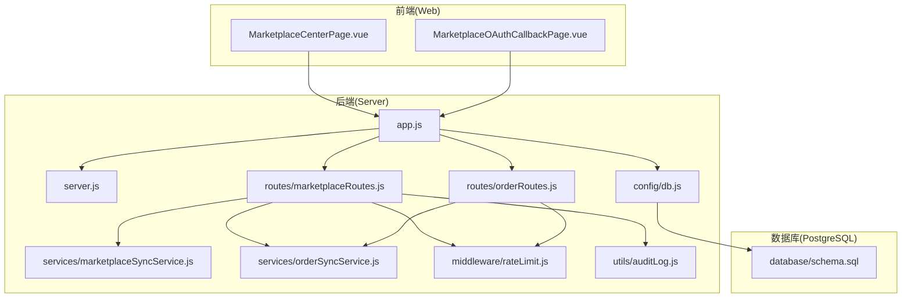
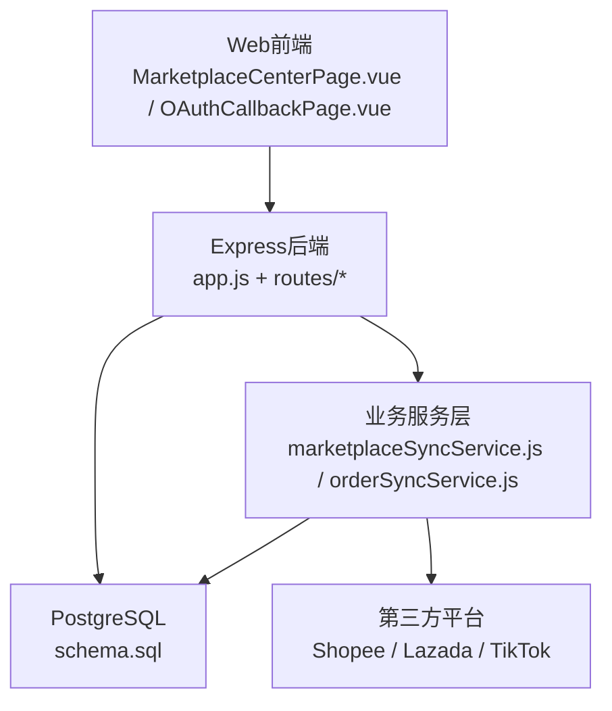
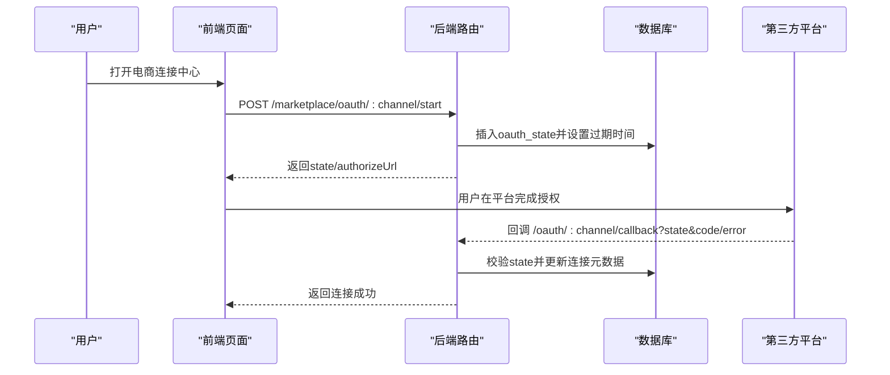
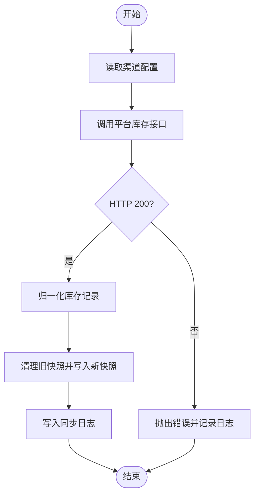
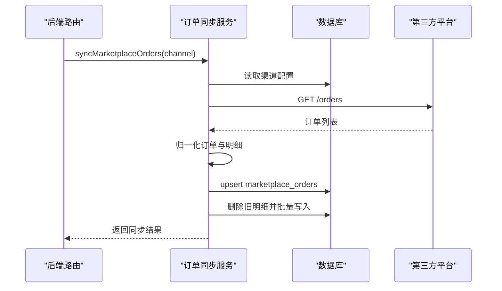
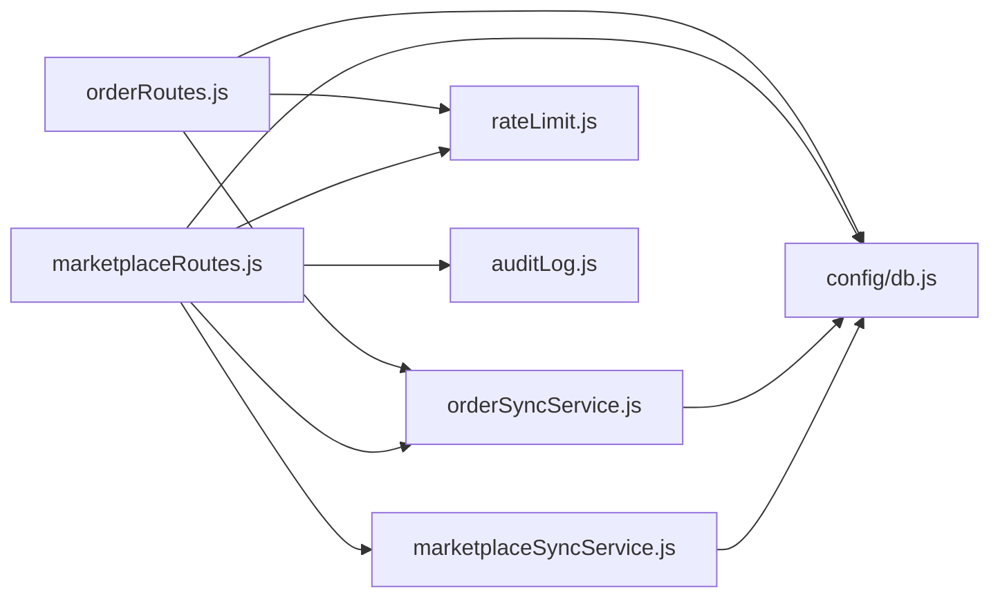

# 电商集成系统

<cite>
**本文引用的文件**
- [server/src/app.js](file://server/src/app.js)
- [server/src/server.js](file://server/src/server.js)
- [server/src/config/db.js](file://server/src/config/db.js)
- [server/database/schema.sql](file://server/database/schema.sql)
- [server/src/services/marketplaceSyncService.js](file://server/src/services/marketplaceSyncService.js)
- [server/src/services/orderSyncService.js](file://server/src/services/orderSyncService.js)
- [server/src/routes/marketplaceRoutes.js](file://server/src/routes/marketplaceRoutes.js)
- [server/src/routes/orderRoutes.js](file://server/src/routes/orderRoutes.js)
- [server/src/middleware/rateLimit.js](file://server/src/middleware/rateLimit.js)
- [server/src/utils/auditLog.js](file://server/src/utils/auditLog.js)
- [web/src/pages/MarketplaceCenterPage.vue](file://web/src/pages/MarketplaceCenterPage.vue)
- [web/src/pages/MarketplaceOAuthCallbackPage.vue](file://web/src/pages/MarketplaceOAuthCallbackPage.vue)
- [POSTMAN_BACKEND_GUIDE.md](file://POSTMAN_BACKEND_GUIDE.md)
- [package.json](file://package.json)
</cite>

## 目录
1. [简介](#简介)
2. [项目结构](#项目结构)
3. [核心组件](#核心组件)
4. [架构总览](#架构总览)
5. [详细组件分析](#详细组件分析)
6. [依赖关系分析](#依赖关系分析)
7. [性能考量](#性能考量)
8. [故障排除指南](#故障排除指南)
9. [结论](#结论)
10. [附录](#附录)

## 简介
本系统是一个面向多电商平台（Shopee、Lazada、TikTok Shop）的集成与同步平台，提供以下能力：
- 连接配置与OAuth授权流程管理
- 实时库存与订单数据的抓取、归一化与持久化
- 错误日志与审计追踪
- 前端“电商连接中心”统一入口，支持连接测试、同步任务与错误监控

系统采用前后端分离架构：后端基于Express + PostgreSQL，前端基于Vue 3 + Vite，通过REST API进行交互。

## 项目结构
后端核心目录与职责：
- server/src/app.js：应用入口与中间件装配
- server/src/server.js：服务启动与数据库健康检查
- server/src/config/db.js：PostgreSQL连接池配置
- server/src/routes/*：业务路由层（市场连接、订单、库存等）
- server/src/services/*：业务服务层（同步逻辑）
- server/src/middleware/*：中间件（限流、响应包装、鉴权等）
- server/database/schema.sql：数据库表结构与索引定义
- server/src/utils/auditLog.js：审计日志写入工具
- web/src/pages/*：前端页面组件（电商连接中心、OAuth回调）



**图表来源**
- [server/src/app.js:1-67](file://server/src/app.js#L1-L67)
- [server/src/server.js:1-28](file://server/src/server.js#L1-L28)
- [server/src/config/db.js:1-25](file://server/src/config/db.js#L1-L25)
- [server/src/routes/marketplaceRoutes.js:1-641](file://server/src/routes/marketplaceRoutes.js#L1-L641)
- [server/src/routes/orderRoutes.js:1-113](file://server/src/routes/orderRoutes.js#L1-L113)
- [server/src/services/marketplaceSyncService.js:1-146](file://server/src/services/marketplaceSyncService.js#L1-L146)
- [server/src/services/orderSyncService.js:1-119](file://server/src/services/orderSyncService.js#L1-L119)
- [server/src/middleware/rateLimit.js:1-40](file://server/src/middleware/rateLimit.js#L1-L40)
- [server/src/utils/auditLog.js:1-38](file://server/src/utils/auditLog.js#L1-L38)
- [server/database/schema.sql:1-447](file://server/database/schema.sql#L1-L447)

**章节来源**
- [server/src/app.js:1-67](file://server/src/app.js#L1-L67)
- [server/src/server.js:1-28](file://server/src/server.js#L1-L28)
- [server/src/config/db.js:1-25](file://server/src/config/db.js#L1-L25)
- [server/database/schema.sql:1-447](file://server/database/schema.sql#L1-L447)

## 核心组件
- 连接配置与OAuth
  - 支持Shopee/Lazada/TikTok三类渠道
  - 通过“电商连接中心”页面保存基础URL、访问令牌、是否启用等
  - OAuth流程：生成state、记录过期时间、回调校验并落库
- 库存同步
  - 从各平台拉取库存快照，归一化字段（可用量=在手-已分配）
  - 写入快照表与同步日志
- 订单同步
  - 从各平台拉取订单，按外部订单号去重
  - 写入订单主表与明细表，支持重复同步幂等
- 错误与审计
  - 统一错误日志表记录操作、错误码、详情
  - 审计日志记录用户行为与元数据
- 限流与安全
  - 基于内存桶的滑动窗口限流
  - 中间件统一响应包装与错误兜底

**章节来源**
- [server/src/routes/marketplaceRoutes.js:47-142](file://server/src/routes/marketplaceRoutes.js#L47-L142)
- [server/src/services/marketplaceSyncService.js:18-140](file://server/src/services/marketplaceSyncService.js#L18-L140)
- [server/src/services/orderSyncService.js:4-114](file://server/src/services/orderSyncService.js#L4-L114)
- [server/src/middleware/rateLimit.js:1-40](file://server/src/middleware/rateLimit.js#L1-L40)
- [server/src/utils/auditLog.js:1-38](file://server/src/utils/auditLog.js#L1-L38)

## 架构总览
系统采用“前端页面 + 后端REST + 数据库”的三层架构。前端通过统一API网关访问后端，后端通过连接池访问数据库，同时对外发起第三方平台请求。



**图表来源**
- [web/src/pages/MarketplaceCenterPage.vue:1-477](file://web/src/pages/MarketplaceCenterPage.vue#L1-L477)
- [web/src/pages/MarketplaceOAuthCallbackPage.vue:1-81](file://web/src/pages/MarketplaceOAuthCallbackPage.vue#L1-L81)
- [server/src/app.js:1-67](file://server/src/app.js#L1-L67)
- [server/src/services/marketplaceSyncService.js:1-146](file://server/src/services/marketplaceSyncService.js#L1-L146)
- [server/src/services/orderSyncService.js:1-119](file://server/src/services/orderSyncService.js#L1-L119)
- [server/database/schema.sql:137-235](file://server/database/schema.sql#L137-L235)

## 详细组件分析

### 连接配置与OAuth流程
- 连接配置
  - 支持保存渠道、店铺名、API基础URL、访问令牌、刷新令牌、元数据、是否启用
  - 支持按渠道覆盖配置或使用环境变量兜底
- OAuth流程
  - 启动：生成state并入库，记录过期时间，拼装授权URL
  - 回调：校验state存在性与有效期，接收code或错误信息，更新连接元数据并删除state
  - 测试：对连接的健康接口发起请求验证连通性



**图表来源**
- [server/src/routes/marketplaceRoutes.js:204-375](file://server/src/routes/marketplaceRoutes.js#L204-L375)
- [server/src/utils/auditLog.js:1-38](file://server/src/utils/auditLog.js#L1-L38)

**章节来源**
- [server/src/routes/marketplaceRoutes.js:72-142](file://server/src/routes/marketplaceRoutes.js#L72-L142)
- [server/src/routes/marketplaceRoutes.js:204-375](file://server/src/routes/marketplaceRoutes.js#L204-L375)
- [web/src/pages/MarketplaceCenterPage.vue:176-216](file://web/src/pages/MarketplaceCenterPage.vue#L176-L216)
- [web/src/pages/MarketplaceOAuthCallbackPage.vue:19-48](file://web/src/pages/MarketplaceOAuthCallbackPage.vue#L19-L48)

### 库存同步机制
- 配置优先级：数据库连接表 > 环境变量兜底
- 归一化策略：统一外部SKU、仓库编码、在手/已分配/可用数量
- 幂等写入：先清空该渠道旧快照，再批量插入新快照
- 日志记录：成功写入同步日志表



**图表来源**
- [server/src/services/marketplaceSyncService.js:100-140](file://server/src/services/marketplaceSyncService.js#L100-L140)
- [server/src/routes/marketplaceRoutes.js:144-202](file://server/src/routes/marketplaceRoutes.js#L144-L202)

**章节来源**
- [server/src/services/marketplaceSyncService.js:18-98](file://server/src/services/marketplaceSyncService.js#L18-L98)
- [server/src/services/marketplaceSyncService.js:100-140](file://server/src/services/marketplaceSyncService.js#L100-L140)
- [server/src/routes/marketplaceRoutes.js:144-202](file://server/src/routes/marketplaceRoutes.js#L144-L202)

### 订单同步处理
- 归一化策略：统一外部订单号、状态、买家名、金额、币种、下单时间、明细
- 幂等写入：按渠道+外部订单号唯一约束，重复同步时更新字段并刷新时间戳
- 明细落库：删除旧明细后批量写入，匹配内部产品ID



**图表来源**
- [server/src/services/orderSyncService.js:19-114](file://server/src/services/orderSyncService.js#L19-L114)
- [server/src/routes/orderRoutes.js:13-29](file://server/src/routes/orderRoutes.js#L13-L29)

**章节来源**
- [server/src/services/orderSyncService.js:4-114](file://server/src/services/orderSyncService.js#L4-L114)
- [server/src/routes/orderRoutes.js:31-110](file://server/src/routes/orderRoutes.js#L31-L110)

### 数据模型与索引
- 关键表
  - marketplace_connections：渠道连接配置
  - marketplace_oauth_states：OAuth状态
  - marketplace_sync_logs：同步日志
  - marketplace_inventory_snapshots：库存快照
  - marketplace_orders / marketplace_order_items：订单与明细
  - shipping_shipments：发货单据
  - audit_logs：审计日志
- 索引
  - 对常用查询字段建立索引，如渠道、状态、创建时间等

```mermaid
erDiagram
MARKETPLACE_CONNECTIONS {
int id PK
varchar channel UK
varchar shop_name
text api_base_url
text access_token
text refresh_token
jsonb metadata
boolean is_active
int updated_by FK
timestamp updated_at
}
MARKETPLACE_OAUTH_STATES {
int id PK
varchar channel
varchar state_token UK
text redirect_uri
timestamp expires_at
int created_by FK
timestamp created_at
}
MARKETPLACE_SYNC_LOGS {
int id PK
varchar channel
varchar sync_type
varchar status
int records_count
jsonb raw_response
int synced_by FK
timestamp synced_at
}
MARKETPLACE_INVENTORY_SNAPSHOTS {
int id PK
varchar channel
varchar external_sku
int product_id FK
int warehouse_id FK
int on_hand
int allocated_quantity
int available_quantity
jsonb payload
timestamp synced_at
}
MARKETPLACE_ORDERS {
int id PK
varchar channel
varchar external_order_id
varchar order_status
varchar buyer_name
numeric total_amount
varchar currency
timestamp order_created_at
jsonb payload
timestamp synced_at
unique(channel, external_order_id)
}
MARKETPLACE_ORDER_ITEMS {
int id PK
int marketplace_order_id FK
varchar external_item_id
varchar external_sku
int product_id FK
int quantity
numeric unit_price
jsonb payload
}
SHIPMENT_SHIPMENTS {
int id PK
varchar channel
int marketplace_order_id FK
varchar shipment_status
varchar carrier
varchar service_level
varchar tracking_no
text label_url
timestamp shipped_at
timestamp delivered_at
jsonb payload
int updated_by FK
timestamp updated_at
}
AUDIT_LOGS {
int id PK
int user_id FK
varchar user_email
varchar user_role
varchar action
varchar entity_type
varchar entity_id
varchar method
text path
text description
jsonb metadata
timestamp created_at
}
MARKETPLACE_CONNECTIONS ||--o{ MARKETPLACE_OAUTH_STATES : "has"
MARKETPLACE_ORDERS ||--o{ MARKETPLACE_ORDER_ITEMS : "contains"
MARKETPLACE_ORDERS ||--o{ SHIPMENT_SHIPMENTS : "generates"
```

**图表来源**
- [server/database/schema.sql:161-235](file://server/database/schema.sql#L161-L235)

**章节来源**
- [server/database/schema.sql:137-235](file://server/database/schema.sql#L137-L235)

## 依赖关系分析
- 路由层依赖服务层与数据库工具
- 服务层依赖数据库查询与第三方平台接口
- 限流中间件贯穿路由层，控制同步频率
- 审计日志在关键操作点被调用



**图表来源**
- [server/src/routes/marketplaceRoutes.js:1-641](file://server/src/routes/marketplaceRoutes.js#L1-L641)
- [server/src/routes/orderRoutes.js:1-113](file://server/src/routes/orderRoutes.js#L1-L113)
- [server/src/services/marketplaceSyncService.js:1-146](file://server/src/services/marketplaceSyncService.js#L1-L146)
- [server/src/services/orderSyncService.js:1-119](file://server/src/services/orderSyncService.js#L1-L119)
- [server/src/middleware/rateLimit.js:1-40](file://server/src/middleware/rateLimit.js#L1-L40)
- [server/src/utils/auditLog.js:1-38](file://server/src/utils/auditLog.js#L1-L38)
- [server/src/config/db.js:1-25](file://server/src/config/db.js#L1-L25)

**章节来源**
- [server/src/routes/marketplaceRoutes.js:1-641](file://server/src/routes/marketplaceRoutes.js#L1-L641)
- [server/src/routes/orderRoutes.js:1-113](file://server/src/routes/orderRoutes.js#L1-L113)
- [server/src/middleware/rateLimit.js:1-40](file://server/src/middleware/rateLimit.js#L1-L40)

## 性能考量
- 分页与索引
  - 列表查询均支持分页与条件过滤，数据库侧建立多处索引以降低扫描成本
- 批量写入
  - 库存快照采用“清空+批量插入”，减少碎片与重复
- 事务与幂等
  - 订单同步使用ON CONFLICT更新，避免重复写入带来的脏数据
- 限流
  - 同步接口默认每分钟最多12次，防止触发第三方平台限流或自身压力峰值

**章节来源**
- [server/database/schema.sql:419-446](file://server/database/schema.sql#L419-L446)
- [server/src/services/marketplaceSyncService.js:60-98](file://server/src/services/marketplaceSyncService.js#L60-L98)
- [server/src/services/orderSyncService.js:42-100](file://server/src/services/orderSyncService.js#L42-L100)
- [server/src/middleware/rateLimit.js:9-35](file://server/src/middleware/rateLimit.js#L9-L35)

## 故障排除指南
- 连接测试失败
  - 检查渠道配置是否完整（基础URL、访问令牌）
  - 使用“连接测试”接口验证第三方健康端点
- OAuth回调失败
  - 校验state是否存在且未过期
  - 确认回调参数（state/code/error）齐全
- 同步失败
  - 查看“同步日志”与“错误日志”，定位具体渠道与错误码
  - 检查第三方平台返回状态码与响应体
- 限流导致失败
  - 观察429响应中的retry-after提示，等待后再试
- 审计与追踪
  - 通过审计日志定位操作人、方法、路径与元数据

**章节来源**
- [server/src/routes/marketplaceRoutes.js:377-435](file://server/src/routes/marketplaceRoutes.js#L377-L435)
- [server/src/routes/marketplaceRoutes.js:271-375](file://server/src/routes/marketplaceRoutes.js#L271-L375)
- [server/src/routes/marketplaceRoutes.js:144-202](file://server/src/routes/marketplaceRoutes.js#L144-L202)
- [server/src/middleware/rateLimit.js:23-29](file://server/src/middleware/rateLimit.js#L23-L29)
- [server/src/utils/auditLog.js:1-38](file://server/src/utils/auditLog.js#L1-L38)

## 结论
本系统提供了多电商平台的标准化接入与同步能力，具备完善的配置、授权、同步、审计与错误追踪机制。通过数据库索引、批量写入与幂等设计，保障了大规模数据场景下的稳定性与一致性；通过限流与统一错误日志，提升了系统的可观测性与可维护性。

## 附录

### 集成配置步骤（概要）
- 在“电商连接中心”页面保存渠道配置（基础URL、访问令牌、是否启用）
- 启动OAuth：点击“启动OAuth”，在新标签页完成平台授权
- 回调处理：平台回调后自动处理并更新连接元数据
- 连接测试：点击“测试连接”验证第三方健康端点
- 执行同步：分别执行“同步库存”和“同步订单”

**章节来源**
- [web/src/pages/MarketplaceCenterPage.vue:136-246](file://web/src/pages/MarketplaceCenterPage.vue#L136-L246)
- [server/src/routes/marketplaceRoutes.js:204-375](file://server/src/routes/marketplaceRoutes.js#L204-L375)

### API调用示例（参考）
- 登录与认证
  - POST /api/auth/login（获取token）
  - GET /api/auth/me（获取当前用户）
- 市场连接
  - PUT /api/marketplace/connections/:channel（保存配置）
  - POST /api/marketplace/connections/:channel/test（连接测试）
  - POST /api/marketplace/sync/:channel（同步库存）
  - POST /api/marketplace/orders/sync/:channel（同步订单）
  - GET /api/marketplace/errors（错误日志）
- 订单查询
  - GET /api/orders（分页查询）
  - GET /api/orders/:id（订单详情）

**章节来源**
- [POSTMAN_BACKEND_GUIDE.md:28-302](file://POSTMAN_BACKEND_GUIDE.md#L28-L302)
- [server/src/routes/marketplaceRoutes.js:47-638](file://server/src/routes/marketplaceRoutes.js#L47-L638)
- [server/src/routes/orderRoutes.js:13-110](file://server/src/routes/orderRoutes.js#L13-L110)

### 最佳实践
- 数据映射
  - 统一外部SKU与仓库编码，缺失时保留占位值便于后续修复
- 价格与促销
  - 建议在上游系统维护渠道定价规则，同步时仅做对齐与校验
- 冲突处理
  - 订单按渠道+外部订单号去重；库存快照按渠道全量替换，确保一致性
- 自动化与效率
  - 使用定时任务定期执行库存/订单同步
  - 将失败重试纳入调度器，结合错误日志进行人工干预

**章节来源**
- [server/src/services/marketplaceSyncService.js:39-58](file://server/src/services/marketplaceSyncService.js#L39-L58)
- [server/src/services/orderSyncService.js:4-17](file://server/src/services/orderSyncService.js#L4-L17)