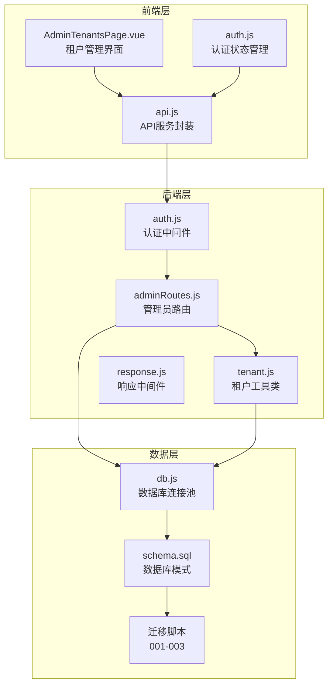
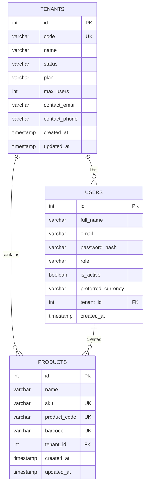
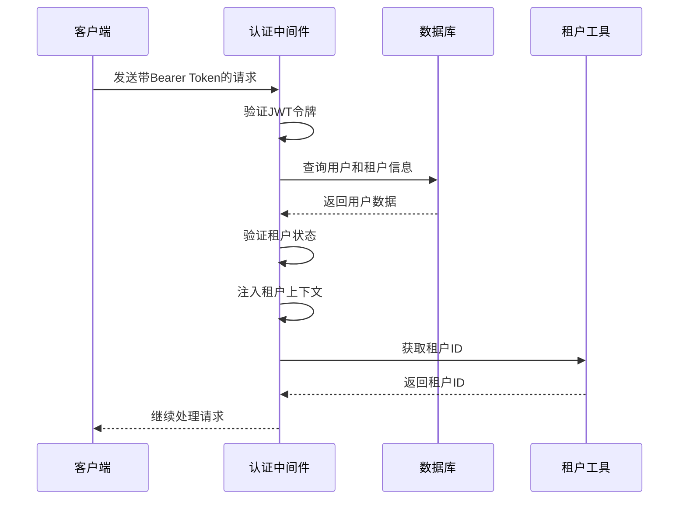
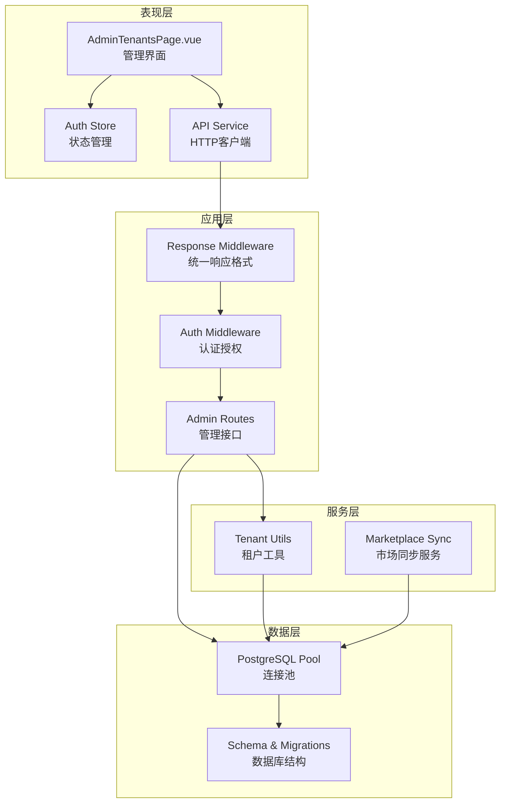
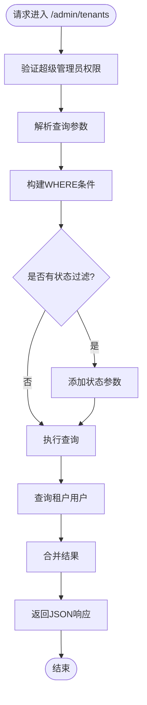
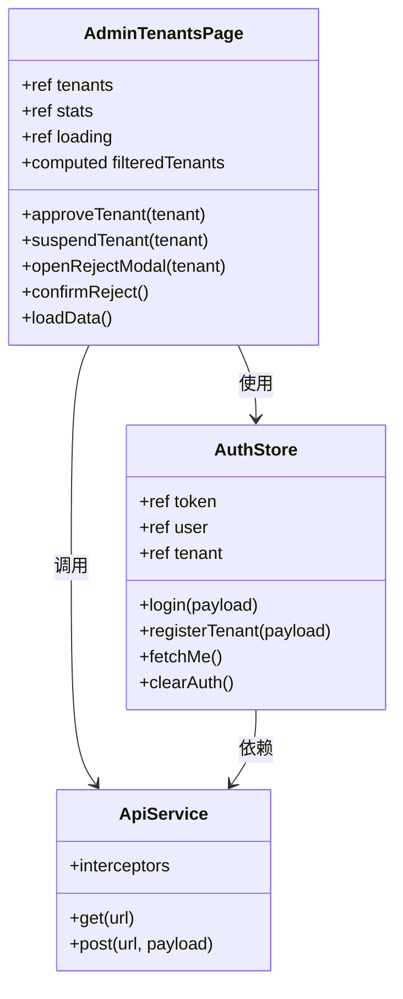
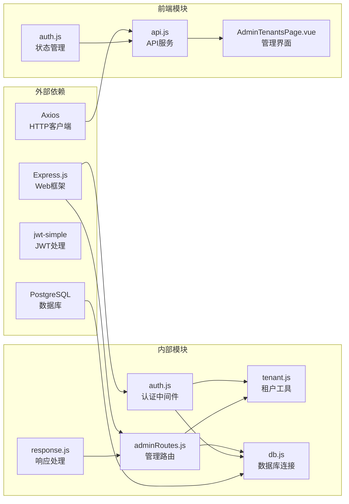

# 租户管理模块

<cite>
**本文档引用的文件**
- [tenant.js](file://server/src/utils/tenant.js)
- [auth.js](file://server/src/middleware/auth.js)
- [adminRoutes.js](file://server/src/routes/adminRoutes.js)
- [schema.sql](file://server/database/schema.sql)
- [001_add_multi_tenant.sql](file://server/database/migrations/001_add_multi_tenant.sql)
- [002_fix_unique_constraints.sql](file://server/database/migrations/002_fix_unique_constraints.sql)
- [003_super_admin_approval.sql](file://server/database/migrations/003_super_admin_approval.sql)
- [AdminTenantsPage.vue](file://web/src/pages/AdminTenantsPage.vue)
- [db.js](file://server/src/config/db.js)
- [response.js](file://server/src/middleware/response.js)
- [marketplaceSyncService.js](file://server/src/services/marketplaceSyncService.js)
- [auth.js](file://web/src/stores/auth.js)
- [api.js](file://web/src/services/api.js)
</cite>

## 目录
1. [简介](#简介)
2. [项目结构](#项目结构)
3. [核心组件](#核心组件)
4. [架构概览](#架构概览)
5. [详细组件分析](#详细组件分析)
6. [依赖关系分析](#依赖关系分析)
7. [性能考虑](#性能考虑)
8. [故障排除指南](#故障排除指南)
9. [结论](#结论)

## 简介

租户管理模块是库存管理系统中的核心功能之一，实现了多租户架构下的企业级应用支持。该模块通过数据库层面的租户隔离、前端管理界面以及完善的审核机制，为企业用户提供了一个安全、可扩展的多租户解决方案。

系统采用基于角色的访问控制（RBAC）模型，支持超级管理员（SUPER_ADMIN）对所有租户进行统一管理，同时确保各租户间的数据完全隔离。模块包含完整的租户生命周期管理，从注册申请到审核批准，再到日常运营维护。

## 项目结构

租户管理模块在项目中的组织结构如下：

**图表来源**
- [AdminTenantsPage.vue:1-292](file://web/src/pages/AdminTenantsPage.vue#L1-L292)
- [auth.js:1-96](file://server/src/middleware/auth.js#L1-L96)
- [adminRoutes.js:1-189](file://server/src/routes/adminRoutes.js#L1-L189)

**章节来源**
- [AdminTenantsPage.vue:1-292](file://web/src/pages/AdminTenantsPage.vue#L1-L292)
- [auth.js:1-96](file://server/src/middleware/auth.js#L1-L96)
- [adminRoutes.js:1-189](file://server/src/routes/adminRoutes.js#L1-L189)

## 核心组件

### 数据库架构

系统采用多租户数据库设计，所有业务表都增加了 `tenant_id` 字段进行数据隔离：

**图表来源**
- [schema.sql:1-447](file://server/database/schema.sql#L1-L447)
- [001_add_multi_tenant.sql:1-100](file://server/database/migrations/001_add_multi_tenant.sql#L1-L100)

### 租户工具类

租户工具类提供了关键的租户隔离功能：

- **getTenantId(req)**: 从请求对象中提取当前租户ID
- **tenantWhere(tableAlias, paramIndex)**: 生成带有租户过滤条件的SQL片段
- **appendTenant(params, tenantId)**: 将租户ID追加到查询参数中

**章节来源**
- [tenant.js:1-43](file://server/src/utils/tenant.js#L1-L43)

### 认证与授权

认证中间件实现了完整的租户上下文注入：

**图表来源**
- [auth.js:5-61](file://server/src/middleware/auth.js#L5-L61)
- [tenant.js:9-14](file://server/src/utils/tenant.js#L9-L14)

**章节来源**
- [auth.js:1-96](file://server/src/middleware/auth.js#L1-L96)
- [tenant.js:1-43](file://server/src/utils/tenant.js#L1-L43)

## 架构概览

租户管理模块采用分层架构设计，确保了清晰的职责分离和良好的可维护性：

**图表来源**
- [AdminTenantsPage.vue:1-292](file://web/src/pages/AdminTenantsPage.vue#L1-L292)
- [auth.js:1-96](file://server/src/middleware/auth.js#L1-L96)
- [adminRoutes.js:1-189](file://server/src/routes/adminRoutes.js#L1-L189)
- [db.js:1-29](file://server/src/config/db.js#L1-L29)

## 详细组件分析

### 管理员租户管理路由

管理员路由提供了完整的租户生命周期管理功能：

#### 租户列表查询

**图表来源**
- [adminRoutes.js:12-48](file://server/src/routes/adminRoutes.js#L12-L48)

#### 租户状态管理

系统支持四种租户状态的完整生命周期：

| 状态 | 描述 | 可执行操作 |
|------|------|------------|
| PENDING | 待审核 | 批准、拒绝 |
| ACTIVE | 已激活 | 暂停、删除 |
| REJECTED | 已拒绝 | 重新提交申请 |
| SUSPENDED | 已暂停 | 恢复激活 |

**章节来源**
- [adminRoutes.js:1-189](file://server/src/routes/adminRoutes.js#L1-L189)
- [003_super_admin_approval.sql:11-26](file://server/database/migrations/003_super_admin_approval.sql#L11-L26)

### 前端管理界面

Vue.js前端组件提供了直观的租户管理界面：

**图表来源**
- [AdminTenantsPage.vue:1-292](file://web/src/pages/AdminTenantsPage.vue#L1-L292)
- [auth.js:19-126](file://web/src/stores/auth.js#L19-L126)
- [api.js:1-45](file://web/src/services/api.js#L1-L45)

**章节来源**
- [AdminTenantsPage.vue:1-292](file://web/src/pages/AdminTenantsPage.vue#L1-L292)
- [auth.js:1-126](file://web/src/stores/auth.js#L1-L126)
- [api.js:1-45](file://web/src/services/api.js#L1-L45)

### 数据库迁移策略

系统通过三个主要迁移脚本实现多租户架构：

#### 第一阶段：基础架构改造

- 创建 `tenants` 主表
- 为所有业务表添加 `tenant_id` 外键
- 修改唯一约束为租户内唯一
- 添加性能优化索引

#### 第二阶段：约束完善

- 修复 `system_settings` 的唯一约束
- 更新 `marketplace_*` 表的复合唯一键
- 补充缺失的租户索引

#### 第三阶段：超级管理员机制

- 扩展租户状态枚举
- 添加审核元数据字段
- 创建系统租户和默认超级管理员

**章节来源**
- [001_add_multi_tenant.sql:1-100](file://server/database/migrations/001_add_multi_tenant.sql#L1-L100)
- [002_fix_unique_constraints.sql:1-44](file://server/database/migrations/002_fix_unique_constraints.sql#L1-L44)
- [003_super_admin_approval.sql:1-53](file://server/database/migrations/003_super_admin_approval.sql#L1-L53)

## 依赖关系分析

租户管理模块的依赖关系体现了清晰的分层设计：

**图表来源**
- [auth.js:1-96](file://server/src/middleware/auth.js#L1-L96)
- [adminRoutes.js:1-189](file://server/src/routes/adminRoutes.js#L1-L189)
- [tenant.js:1-43](file://server/src/utils/tenant.js#L1-L43)
- [db.js:1-29](file://server/src/config/db.js#L1-L29)

**章节来源**
- [auth.js:1-96](file://server/src/middleware/auth.js#L1-L96)
- [adminRoutes.js:1-189](file://server/src/routes/adminRoutes.js#L1-L189)
- [tenant.js:1-43](file://server/src/utils/tenant.js#L1-L43)
- [db.js:1-29](file://server/src/config/db.js#L1-L29)

## 性能考虑

### 数据库性能优化

1. **索引策略**
   - 为 `tenant_id` 字段建立专门索引
   - 为高频查询字段创建复合索引
   - 优化唯一约束以支持租户内唯一性

2. **查询优化**
   - 使用参数化查询防止SQL注入
   - 实施适当的连接顺序优化
   - 利用数据库连接池提高并发性能

3. **缓存策略**
   - 对静态配置信息进行缓存
   - 实施合理的查询结果缓存
   - 避免不必要的重复查询

### 前端性能优化

1. **组件优化**
   - 使用计算属性缓存复杂数据处理
   - 实施虚拟滚动处理大量数据
   - 优化事件处理器避免频繁重渲染

2. **网络优化**
   - 批量API请求减少HTTP开销
   - 实施请求去重机制
   - 优化图片和资源加载

## 故障排除指南

### 常见问题及解决方案

#### 认证失败
**症状**: 用户无法登录或频繁退出
**可能原因**:
- JWT密钥配置错误
- 令牌过期或格式不正确
- 租户状态异常

**解决步骤**:
1. 检查 `JWT_SECRET` 环境变量
2. 验证令牌格式是否符合Bearer规范
3. 确认用户租户状态为ACTIVE

#### 数据隔离问题
**症状**: 用户能看到其他公司的数据
**可能原因**:
- 缺少租户过滤条件
- 租户ID未正确传递
- 数据库约束被绕过

**解决步骤**:
1. 确保所有查询都包含 `tenant_id` 过滤
2. 验证 `getTenantId()` 函数调用
3. 检查数据库唯一约束配置

#### 权限不足
**症状**: 管理员无法访问租户管理功能
**可能原因**:
- 用户角色不是SUPER_ADMIN
- 缺少必要的中间件
- 认证流程中断

**解决步骤**:
1. 验证用户角色为SUPER_ADMIN
2. 确认中间件按正确顺序加载
3. 检查认证流程完整性

**章节来源**
- [auth.js:5-61](file://server/src/middleware/auth.js#L5-L61)
- [tenant.js:9-14](file://server/src/utils/tenant.js#L9-L14)
- [adminRoutes.js:8-8](file://server/src/routes/adminRoutes.js#L8-L8)

## 结论

租户管理模块通过精心设计的多租户架构，为企业提供了安全可靠的多租户解决方案。模块具有以下特点：

1. **安全性**: 完整的租户隔离机制，确保数据安全
2. **可扩展性**: 支持无限数量的租户，易于扩展
3. **易用性**: 直观的管理界面和完善的审核流程
4. **可靠性**: 完善的错误处理和故障恢复机制

该模块的成功实施为整个库存管理系统的多租户能力奠定了坚实基础，为企业级应用提供了可靠的技术支撑。通过持续的优化和改进，模块将继续满足不断增长的业务需求。