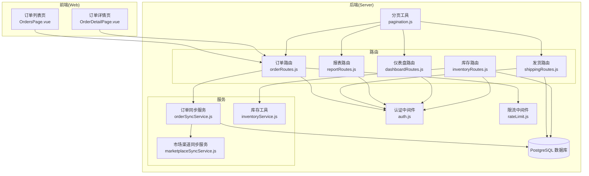
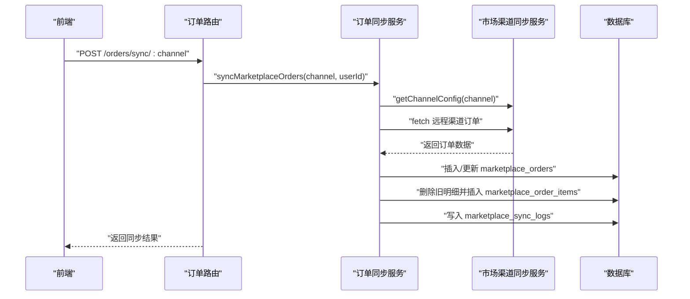
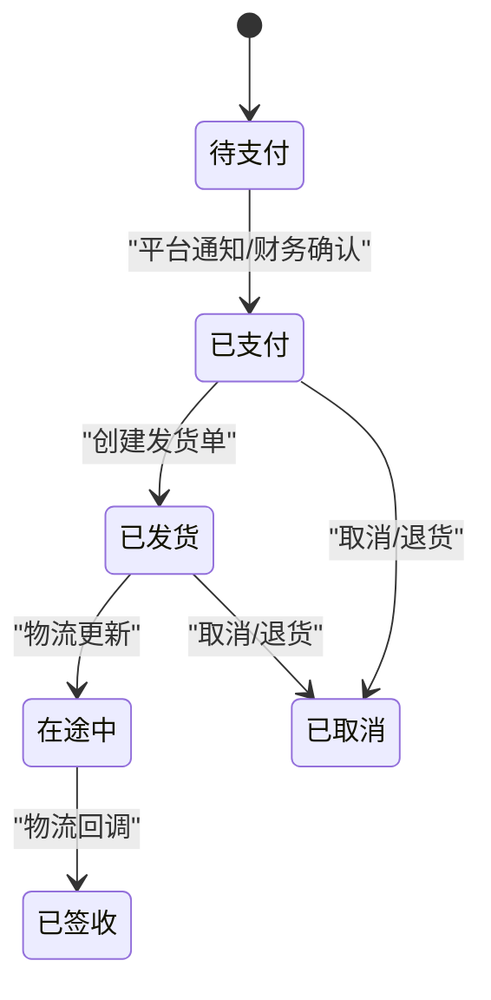
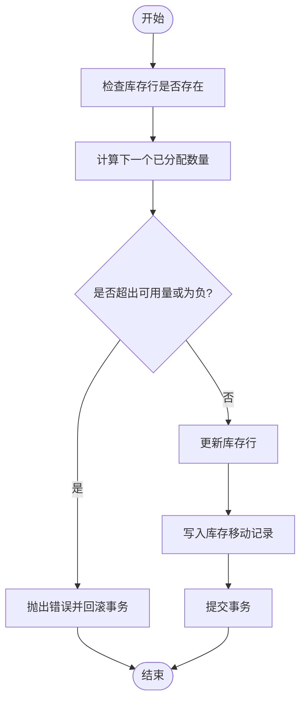
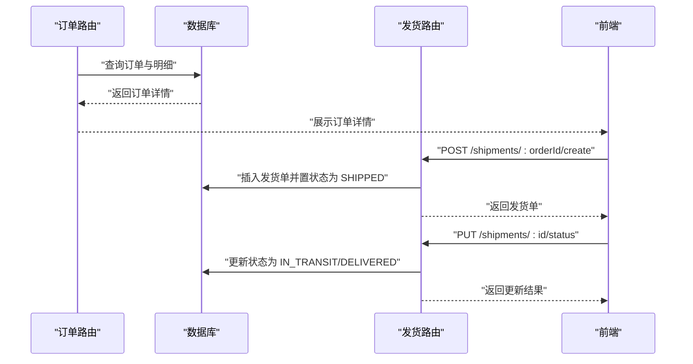
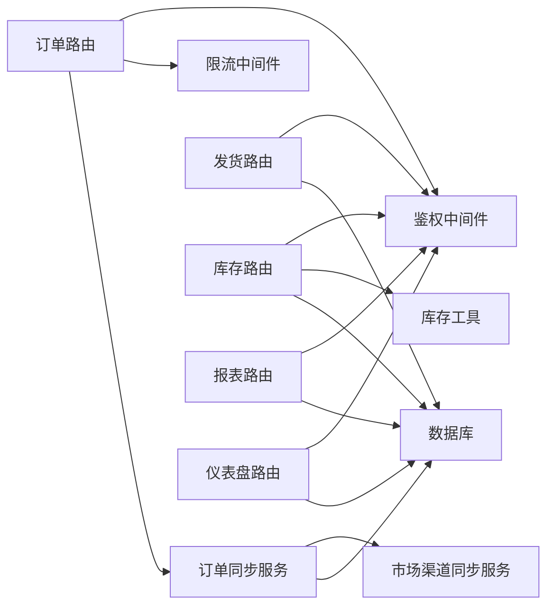

# 订单处理系统

<cite>
**本文引用的文件**
- [orderRoutes.js](file://server/src/routes/orderRoutes.js)
- [orderSyncService.js](file://server/src/services/orderSyncService.js)
- [marketplaceSyncService.js](file://server/src/services/marketplaceSyncService.js)
- [shippingRoutes.js](file://server/src/routes/shippingRoutes.js)
- [inventoryService.js](file://server/src/utils/inventoryService.js)
- [schema.sql](file://server/database/schema.sql)
- [auth.js](file://server/src/middleware/auth.js)
- [rateLimit.js](file://server/src/middleware/rateLimit.js)
- [pagination.js](file://server/src/utils/pagination.js)
- [OrdersPage.vue](file://web/src/pages/OrdersPage.vue)
- [OrderDetailPage.vue](file://web/src/pages/OrderDetailPage.vue)
- [reportRoutes.js](file://server/src/routes/reportRoutes.js)
- [dashboardRoutes.js](file://server/src/routes/dashboardRoutes.js)
- [inventoryRoutes.js](file://server/src/routes/inventoryRoutes.js)
</cite>

## 目录
1. [简介](#简介)
2. [项目结构](#项目结构)
3. [核心组件](#核心组件)
4. [架构总览](#架构总览)
5. [详细组件分析](#详细组件分析)
6. [依赖关系分析](#依赖关系分析)
7. [性能考量](#性能考量)
8. [故障排查指南](#故障排查指南)
9. [结论](#结论)
10. [附录](#附录)

## 简介
本文件面向订单处理系统，围绕订单生命周期管理（从创建、处理到完成）进行深入说明，涵盖订单状态管理、订单分拣与打包流程、订单与库存系统的集成（预留、扣减与释放）、发货与物流跟踪、异常处理（取消、退货、换货）、订单数据结构与状态转换规则、业务逻辑、性能优化建议与最佳实践，以及订单相关的报表与数据分析能力。

## 项目结构
系统采用前后端分离架构：
- 后端基于 Node.js + Express，数据库使用 PostgreSQL，通过 SQL 脚本初始化表结构与索引。
- 前端基于 Vue 3，提供订单列表、详情、同步、发货管理与报表等页面。
- 订单模块主要由订单路由、订单同步服务、发货路由、库存工具与报表路由组成；同时与市场渠道连接配置、鉴权与限流中间件协同工作。

图表来源
- [OrdersPage.vue:1-192](file://web/src/pages/OrdersPage.vue#L1-L192)
- [OrderDetailPage.vue:1-104](file://web/src/pages/OrderDetailPage.vue#L1-L104)
- [orderRoutes.js:1-113](file://server/src/routes/orderRoutes.js#L1-L113)
- [shippingRoutes.js:1-155](file://server/src/routes/shippingRoutes.js#L1-L155)
- [reportRoutes.js:1-252](file://server/src/routes/reportRoutes.js#L1-L252)
- [dashboardRoutes.js:1-123](file://server/src/routes/dashboardRoutes.js#L1-L123)
- [orderSyncService.js:1-119](file://server/src/services/orderSyncService.js#L1-L119)
- [marketplaceSyncService.js:1-146](file://server/src/services/marketplaceSyncService.js#L1-L146)
- [inventoryService.js:1-45](file://server/src/utils/inventoryService.js#L1-L45)
- [auth.js:1-46](file://server/src/middleware/auth.js#L1-L46)
- [rateLimit.js:1-40](file://server/src/middleware/rateLimit.js#L1-L40)
- [pagination.js:1-28](file://server/src/utils/pagination.js#L1-L28)

章节来源
- [orderRoutes.js:1-113](file://server/src/routes/orderRoutes.js#L1-L113)
- [shippingRoutes.js:1-155](file://server/src/routes/shippingRoutes.js#L1-L155)
- [orderSyncService.js:1-119](file://server/src/services/orderSyncService.js#L1-L119)
- [marketplaceSyncService.js:1-146](file://server/src/services/marketplaceSyncService.js#L1-L146)
- [inventoryService.js:1-45](file://server/src/utils/inventoryService.js#L1-L45)
- [schema.sql:1-447](file://server/database/schema.sql#L1-L447)
- [auth.js:1-46](file://server/src/middleware/auth.js#L1-L46)
- [rateLimit.js:1-40](file://server/src/middleware/rateLimit.js#L1-L40)
- [pagination.js:1-28](file://server/src/utils/pagination.js#L1-L28)
- [OrdersPage.vue:1-192](file://web/src/pages/OrdersPage.vue#L1-L192)
- [OrderDetailPage.vue:1-104](file://web/src/pages/OrderDetailPage.vue#L1-L104)

## 核心组件
- 订单路由与同步
  - 提供订单列表查询、详情查询、按渠道与状态筛选、关键词搜索与分页。
  - 支持从 Shopee/Lazada/TikTok 渠道同步订单，写入 marketplace_orders 与 marketplace_order_items，并记录同步日志。
- 发货路由
  - 支持创建发货单、更新发货状态（PENDING/SHIPPED/IN_TRANSIT/DELIVERED/CANCELLED），并记录物流信息与更新人。
- 库存工具
  - 统一封装库存预留/释放与可用量计算，确保事务一致性。
- 报表与仪表盘
  - 提供库存报表、流水报表、仪表盘汇总（产品数、仓库数、缺货项、最近流水、趋势图等）。
- 鉴权与限流
  - JWT 鉴权与基于角色的授权；对订单同步接口设置独立限流策略。

章节来源
- [orderRoutes.js:31-110](file://server/src/routes/orderRoutes.js#L31-L110)
- [orderSyncService.js:19-114](file://server/src/services/orderSyncService.js#L19-L114)
- [shippingRoutes.js:64-152](file://server/src/routes/shippingRoutes.js#L64-L152)
- [inventoryService.js:2-44](file://server/src/utils/inventoryService.js#L2-L44)
- [reportRoutes.js:16-249](file://server/src/routes/reportRoutes.js#L16-L249)
- [dashboardRoutes.js:10-120](file://server/src/routes/dashboardRoutes.js#L10-L120)
- [auth.js:5-40](file://server/src/middleware/auth.js#L5-L40)
- [rateLimit.js:9-35](file://server/src/middleware/rateLimit.js#L9-L35)

## 架构总览
系统围绕“订单-库存-物流”三域协作：
- 订单域：从第三方渠道抓取订单，维护订单与明细。
- 库存域：提供库存预留/释放与可用量计算，保障订单履约。
- 物流域：创建与跟踪发货状态，对接外部物流信息。

图表来源
- [orderRoutes.js:13-29](file://server/src/routes/orderRoutes.js#L13-L29)
- [orderSyncService.js:19-114](file://server/src/services/orderSyncService.js#L19-L114)
- [marketplaceSyncService.js:18-37](file://server/src/services/marketplaceSyncService.js#L18-L37)

## 详细组件分析

### 订单生命周期与状态管理
- 生命周期阶段
  - 订单创建：从第三方渠道同步至 marketplace_orders。
  - 订单处理：核对订单明细、准备库存（预留）、生成拣货任务。
  - 订单完成：发货（创建发货单并更新状态）、物流跟踪、确认收货。
- 状态定义
  - 订单状态：PENDING、PAID、SHIPPED、CANCELLED（示例，具体以渠道返回为准）。
  - 发货状态：PENDING、SHIPPED、IN_TRANSIT、DELIVERED、CANCELLED。
- 状态转换规则
  - 订单：PENDING → PAID（平台通知/财务确认）→ SHIPPED（创建发货单）→ DELIVERED（物流回调）。
  - 发货：PENDING → SHIPPED（创建发货单）→ IN_TRANSIT → DELIVERED。

章节来源
- [orderRoutes.js:13-29](file://server/src/routes/orderRoutes.js#L13-L29)
- [shippingRoutes.js:108-152](file://server/src/routes/shippingRoutes.js#L108-L152)

### 订单与库存集成（预留/扣减/释放）
- 预留（reserve）
  - 作用：锁定库存用于订单履约，防止超卖。
  - 触发时机：订单创建后、拣货前。
  - 实现要点：在事务中确保 stock_levels 行存在，计算 nextAllocated 并校验不超可用量，写入 stock_movements。
- 扣减（release）
  - 作用：订单完成或发货后，将预留库存转为实际出库。
  - 触发时机：发货单创建并标记为 SHIPPED 或 DELIVERED。
  - 实现要点：减少 allocated_quantity，同时增加出库移动记录。
- 释放（release）
  - 作用：订单取消或超时未支付时，释放预留库存。
  - 触发时机：订单状态变更为 CANCELLED。
  - 实现要点：减少 allocated_quantity 并写入对应移动记录。

图表来源
- [inventoryRoutes.js:417-490](file://server/src/routes/inventoryRoutes.js#L417-L490)
- [inventoryService.js:2-44](file://server/src/utils/inventoryService.js#L2-L44)

章节来源
- [inventoryRoutes.js:417-490](file://server/src/routes/inventoryRoutes.js#L417-L490)
- [inventoryService.js:2-44](file://server/src/utils/inventoryService.js#L2-L44)

### 订单分拣与打包流程
- 分拣
  - 基于订单明细与仓库库存，生成拣货任务，优先选择可用量充足且距离最近的仓库。
- 打包
  - 按包裹维度打印面单，绑定物流单号，更新发货状态为 SHIPPED。
- 跟踪
  - 通过物流状态更新接口，将 IN_TRANSIT/DELIVERED 状态写回系统，驱动订单完成闭环。

图表来源
- [orderRoutes.js:83-110](file://server/src/routes/orderRoutes.js#L83-L110)
- [shippingRoutes.js:64-152](file://server/src/routes/shippingRoutes.js#L64-L152)

章节来源
- [orderRoutes.js:83-110](file://server/src/routes/orderRoutes.js#L83-L110)
- [shippingRoutes.js:64-152](file://server/src/routes/shippingRoutes.js#L64-L152)

### 订单异常处理（取消、退货、换货）
- 取消
  - 将订单状态置为 CANCELLED，触发库存释放（release）。
- 退货
  - 创建退货单据，记录退货原因与数量，更新库存为入库（IN）。
- 换货
  - 创建换货单据，先执行退货入库，再生成新订单或补发包裹。

章节来源
- [shippingRoutes.js:108-152](file://server/src/routes/shippingRoutes.js#L108-L152)
- [inventoryRoutes.js:417-490](file://server/src/routes/inventoryRoutes.js#L417-L490)

### 订单数据结构与索引
- 订单主表 marketplace_orders
  - 关键字段：channel、external_order_id、order_status、buyer_name、total_amount、currency、order_created_at、payload、synced_at。
  - 索引：channel、order_status、created_at。
- 订单明细表 marketplace_order_items
  - 关键字段：marketplace_order_id、external_item_id、external_sku、product_id、quantity、unit_price、payload。
  - 索引：marketplace_order_id。
- 发货表 shipping_shipments
  - 关键字段：channel、marketplace_order_id、shipment_status、carrier、service_level、tracking_no、label_url、shipped_at、delivered_at、payload、updated_by、updated_at。
  - 索引：shipment_status、tracking_no。
- 库存表 stock_levels
  - 关键字段：product_id、warehouse_id、quantity、allocated_quantity、updated_at。
  - 索引：product_id、warehouse_id。

章节来源
- [schema.sql:196-235](file://server/database/schema.sql#L196-L235)
- [schema.sql:410-447](file://server/database/schema.sql#L410-L447)

### 订单报表与数据分析
- 库存报表
  - 支持按产品、SKU、条码、仓库、品类搜索与分页，导出时可一次性拉取全量。
- 流水报表
  - 支持按时间范围、关键词搜索与分页，展示出入库类型、数量、参考单号、仓库与经手人。
- 仪表盘
  - 展示产品数、仓库数、缺货项、总在库数量、最近流水、缺货预览、月度流水趋势、按仓库与品类的库存分布。

章节来源
- [reportRoutes.js:16-249](file://server/src/routes/reportRoutes.js#L16-L249)
- [dashboardRoutes.js:10-120](file://server/src/routes/dashboardRoutes.js#L10-L120)

## 依赖关系分析
- 组件耦合
  - 订单路由依赖鉴权中间件与限流中间件，调用订单同步服务；订单同步服务依赖市场渠道同步服务与数据库。
  - 发货路由依赖鉴权中间件与数据库；库存路由依赖库存工具与数据库。
  - 报表与仪表盘路由依赖鉴权中间件与数据库。
- 外部依赖
  - 第三方渠道（Shopee/Lazada/TikTok）API，通过 marketplace_connections 配置访问令牌与基础地址。
- 潜在风险
  - 订单同步与库存操作需在事务中执行，避免并发导致的超卖或数据不一致。
  - 发货状态更新需幂等设计，防止重复回调造成状态错乱。

图表来源
- [orderRoutes.js:1-12](file://server/src/routes/orderRoutes.js#L1-L12)
- [shippingRoutes.js:1-8](file://server/src/routes/shippingRoutes.js#L1-L8)
- [inventoryRoutes.js:1-10](file://server/src/routes/inventoryRoutes.js#L1-L10)
- [reportRoutes.js:1-9](file://server/src/routes/reportRoutes.js#L1-L9)
- [dashboardRoutes.js:1-7](file://server/src/routes/dashboardRoutes.js#L1-L7)
- [orderSyncService.js:1-2](file://server/src/services/orderSyncService.js#L1-L2)
- [marketplaceSyncService.js:1-2](file://server/src/services/marketplaceSyncService.js#L1-L2)
- [auth.js:1-6](file://server/src/middleware/auth.js#L1-L6)
- [rateLimit.js:1-7](file://server/src/middleware/rateLimit.js#L1-L7)
- [inventoryService.js:1-2](file://server/src/utils/inventoryService.js#L1-L2)

章节来源
- [orderRoutes.js:1-12](file://server/src/routes/orderRoutes.js#L1-L12)
- [shippingRoutes.js:1-8](file://server/src/routes/shippingRoutes.js#L1-L8)
- [inventoryRoutes.js:1-10](file://server/src/routes/inventoryRoutes.js#L1-L10)
- [reportRoutes.js:1-9](file://server/src/routes/reportRoutes.js#L1-L9)
- [dashboardRoutes.js:1-7](file://server/src/routes/dashboardRoutes.js#L1-L7)
- [orderSyncService.js:1-2](file://server/src/services/orderSyncService.js#L1-L2)
- [marketplaceSyncService.js:1-2](file://server/src/services/marketplaceSyncService.js#L1-L2)
- [auth.js:1-6](file://server/src/middleware/auth.js#L1-L6)
- [rateLimit.js:1-7](file://server/src/middleware/rateLimit.js#L1-L7)
- [inventoryService.js:1-2](file://server/src/utils/inventoryService.js#L1-L2)

## 性能考量
- 查询性能
  - 使用分页工具统一处理分页参数，避免大页码与超大页尺寸。
  - 对高频查询字段建立索引（如订单状态、发货状态、仓库与产品主键）。
- 写入性能
  - 订单同步批量插入明细前先清理旧明细，减少冗余数据。
  - 库存预留/释放与移动记录在事务中执行，降低锁竞争。
- 接口限流
  - 对订单同步接口设置独立限流桶，避免突发同步导致数据库压力。
- 缓存与异步
  - 对高频报表与汇总数据可引入缓存层（Redis）或物化视图，定期刷新。
  - 发货状态更新可采用消息队列异步处理，提升吞吐。

章节来源
- [pagination.js:2-27](file://server/src/utils/pagination.js#L2-L27)
- [schema.sql:410-447](file://server/database/schema.sql#L410-L447)
- [rateLimit.js:9-35](file://server/src/middleware/rateLimit.js#L9-L35)
- [orderSyncService.js:74-99](file://server/src/services/orderSyncService.js#L74-L99)
- [inventoryRoutes.js:430-490](file://server/src/routes/inventoryRoutes.js#L430-L490)

## 故障排查指南
- 鉴权失败
  - 确认请求头携带有效的 Bearer Token，且用户处于激活状态。
- 权限不足
  - 确认当前用户角色具备相应操作权限（管理员/经理/员工）。
- 订单同步失败
  - 检查 marketplace_connections 中渠道配置与令牌是否正确；查看 marketplace_error_logs 获取错误详情。
- 库存不足或超卖
  - 核对 allocated_quantity 与 on_hand 的关系；确保预留/释放流程在事务中执行。
- 发货状态异常
  - 检查 shipping_shipments 的状态更新接口是否被重复调用；确保状态值在允许集合内。

章节来源
- [auth.js:5-40](file://server/src/middleware/auth.js#L5-L40)
- [marketplaceSyncService.js:18-37](file://server/src/services/marketplaceSyncService.js#L18-L37)
- [orderSyncService.js:22-37](file://server/src/services/orderSyncService.js#L22-L37)
- [shippingRoutes.js:112-114](file://server/src/routes/shippingRoutes.js#L112-L114)
- [inventoryRoutes.js:442-448](file://server/src/routes/inventoryRoutes.js#L442-L448)

## 结论
该订单处理系统以清晰的模块划分与完善的数据库设计为基础，实现了从订单同步、库存预留/释放到发货跟踪的完整闭环。通过鉴权、限流与分页等基础设施保障了系统的安全性与稳定性；借助报表与仪表盘提升了运营可视化水平。后续可在缓存、异步与消息队列方面进一步优化，以应对更高并发与更复杂的业务场景。

## 附录
- 前端页面
  - 订单列表页与详情页负责展示与操作订单，调用后端订单路由与发货路由。
- 最佳实践
  - 严格区分“预留/扣减/释放”的业务语义与触发时机。
  - 对状态更新接口做幂等与边界校验。
  - 定期审查索引与查询计划，持续优化慢查询。

章节来源
- [OrdersPage.vue:33-80](file://web/src/pages/OrdersPage.vue#L33-L80)
- [OrderDetailPage.vue:19-36](file://web/src/pages/OrderDetailPage.vue#L19-L36)