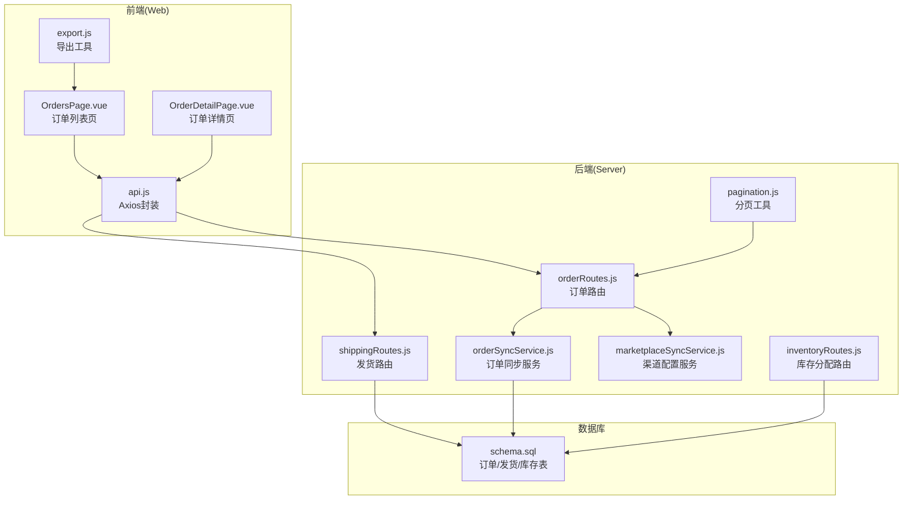
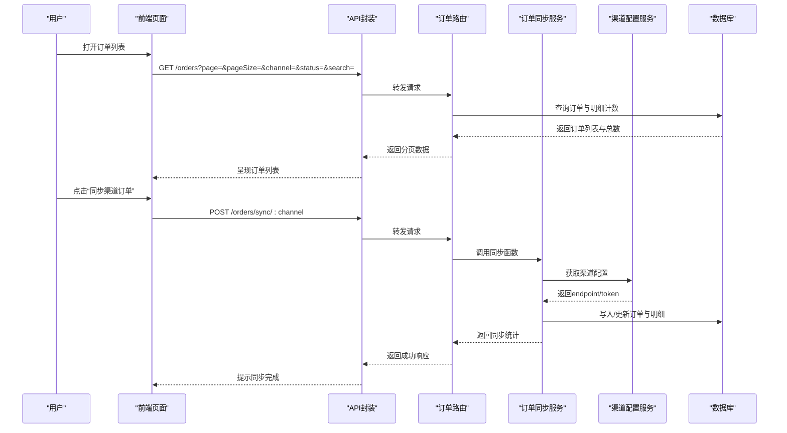
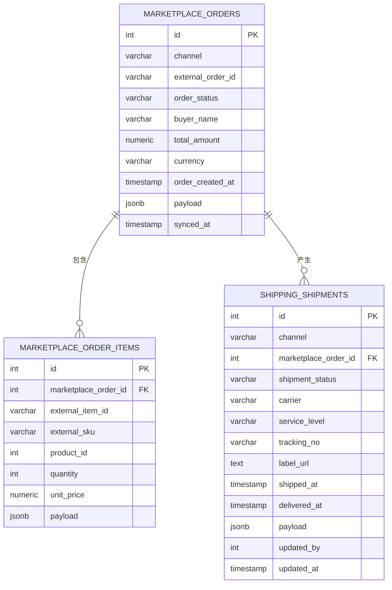
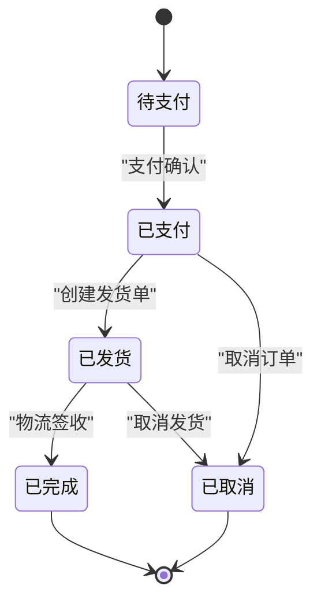
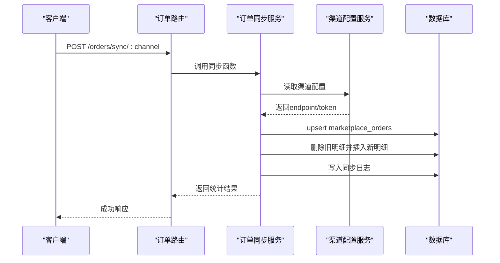
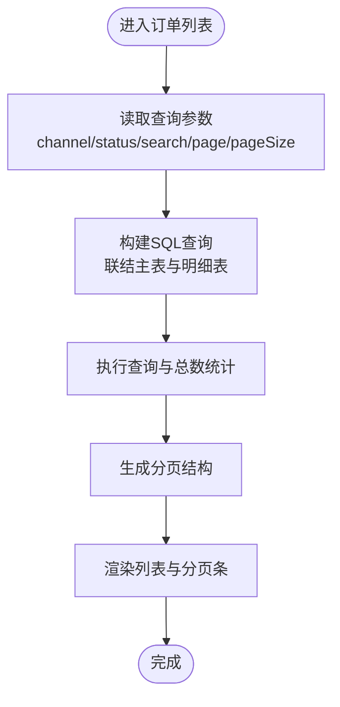
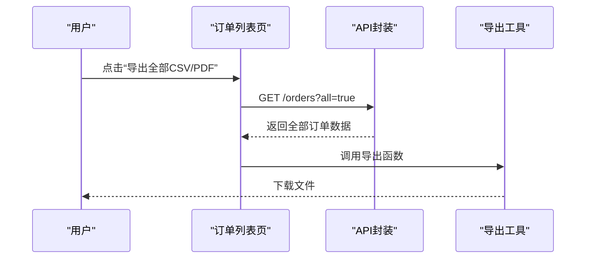
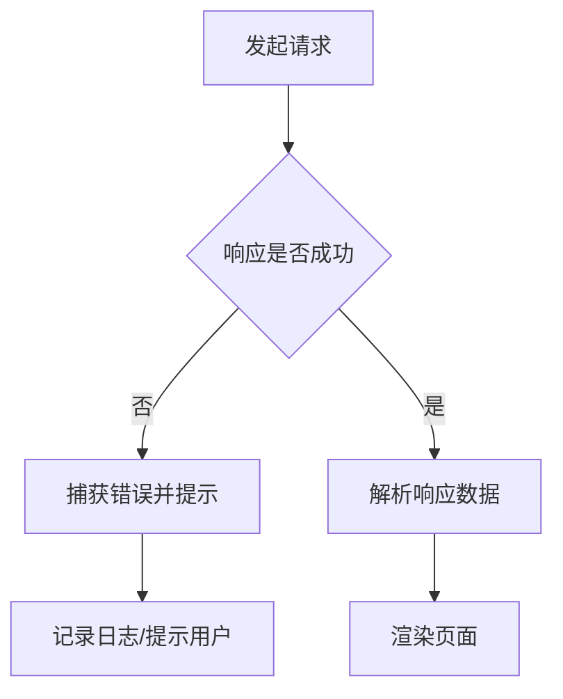
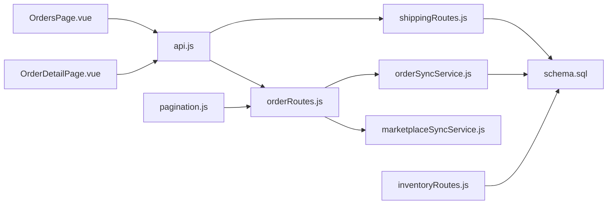

# 订单管理模块

<cite>
**本文档引用的文件**
- [orderRoutes.js](file://server/src/routes/orderRoutes.js)
- [orderSyncService.js](file://server/src/services/orderSyncService.js)
- [marketplaceSyncService.js](file://server/src/services/marketplaceSyncService.js)
- [OrdersPage.vue](file://web/src/pages/OrdersPage.vue)
- [OrderDetailPage.vue](file://web/src/pages/OrderDetailPage.vue)
- [schema.sql](file://server/database/schema.sql)
- [shippingRoutes.js](file://server/src/routes/shippingRoutes.js)
- [pagination.js](file://server/src/utils/pagination.js)
- [export.js](file://web/src/utils/export.js)
- [api.js](file://web/src/services/api.js)
- [inventoryRoutes.js](file://server/src/routes/inventoryRoutes.js)
</cite>

## 目录
1. [简介](#简介)
2. [项目结构](#项目结构)
3. [核心组件](#核心组件)
4. [架构总览](#架构总览)
5. [详细组件分析](#详细组件分析)
6. [依赖关系分析](#依赖关系分析)
7. [性能考虑](#性能考虑)
8. [故障排除指南](#故障排除指南)
9. [结论](#结论)
10. [附录](#附录)

## 简介
本文件为库存管理系统的订单管理模块提供全面技术文档，涵盖从电商渠道订单同步、订单列表与详情展示、发货处理到库存分配与释放的完整流程。文档重点说明：
- 订单数据模型与字段定义
- 订单状态流转与业务规则
- 订单处理流程（库存锁定/释放、发货创建）
- 订单查询与筛选能力
- 订单导出能力（CSV/PDF/HTML 打印）
- 异常处理与错误日志机制

## 项目结构
订单管理模块由前端页面、后端路由与服务层、数据库表结构共同组成，采用前后端分离架构，通过统一的 API 接口进行交互。

**图表来源**
- [OrdersPage.vue:1-192](file://web/src/pages/OrdersPage.vue#L1-L192)
- [OrderDetailPage.vue:1-104](file://web/src/pages/OrderDetailPage.vue#L1-L104)
- [api.js:1-45](file://web/src/services/api.js#L1-L45)
- [orderRoutes.js:1-124](file://server/src/routes/orderRoutes.js#L1-L124)
- [shippingRoutes.js:17-127](file://server/src/routes/shippingRoutes.js#L17-L127)
- [orderSyncService.js:1-128](file://server/src/services/orderSyncService.js#L1-L128)
- [marketplaceSyncService.js:1-159](file://server/src/services/marketplaceSyncService.js#L1-L159)
- [pagination.js:1-28](file://server/src/utils/pagination.js#L1-L28)
- [schema.sql:196-235](file://server/database/schema.sql#L196-L235)
- [export.js:1-91](file://web/src/utils/export.js#L1-L91)

**章节来源**
- [OrdersPage.vue:1-192](file://web/src/pages/OrdersPage.vue#L1-L192)
- [OrderDetailPage.vue:1-104](file://web/src/pages/OrderDetailPage.vue#L1-L104)
- [orderRoutes.js:1-124](file://server/src/routes/orderRoutes.js#L1-L124)
- [shippingRoutes.js:17-127](file://server/src/routes/shippingRoutes.js#L17-L127)
- [orderSyncService.js:1-128](file://server/src/services/orderSyncService.js#L1-L128)
- [marketplaceSyncService.js:1-159](file://server/src/services/marketplaceSyncService.js#L1-L159)
- [pagination.js:1-28](file://server/src/utils/pagination.js#L1-L28)
- [schema.sql:196-235](file://server/database/schema.sql#L196-L235)
- [export.js:1-91](file://web/src/utils/export.js#L1-L91)

## 核心组件
- 前端组件
  - 订单列表页：提供筛选（渠道、状态、关键词）、分页、同步电商订单、跳转详情等功能。
  - 订单详情页：展示订单基础信息与明细项。
  - 导出工具：支持 CSV、PDF、HTML 打印导出。
  - API 封装：统一带上鉴权与成本访问令牌，处理响应包装。
- 后端组件
  - 订单路由：提供订单列表、详情查询、电商订单同步。
  - 发货路由：提供发货单创建与状态更新。
  - 订单同步服务：从电商渠道拉取订单并写入本地表。
  - 渠道配置服务：读取租户级渠道配置或回退到环境变量。
  - 分页工具：统一处理分页参数与返回结构。
  - 库存分配路由：实现订单库存锁定与释放。
- 数据库表
  - marketplace_orders/marketplace_order_items：电商订单与明细。
  - shipping_shipments：发货单与物流状态。
  - marketplace_connections/marketplace_sync_logs：渠道连接与同步日志。

**章节来源**
- [OrdersPage.vue:1-192](file://web/src/pages/OrdersPage.vue#L1-L192)
- [OrderDetailPage.vue:1-104](file://web/src/pages/OrderDetailPage.vue#L1-L104)
- [export.js:1-91](file://web/src/utils/export.js#L1-L91)
- [api.js:1-45](file://web/src/services/api.js#L1-L45)
- [orderRoutes.js:1-124](file://server/src/routes/orderRoutes.js#L1-L124)
- [shippingRoutes.js:17-127](file://server/src/routes/shippingRoutes.js#L17-L127)
- [orderSyncService.js:1-128](file://server/src/services/orderSyncService.js#L1-L128)
- [marketplaceSyncService.js:1-159](file://server/src/services/marketplaceSyncService.js#L1-L159)
- [pagination.js:1-28](file://server/src/utils/pagination.js#L1-L28)
- [schema.sql:196-235](file://server/database/schema.sql#L196-L235)

## 架构总览
订单管理模块遵循“前端页面 → API 路由 → 服务层 → 数据库”的分层设计，支持多电商渠道（Shopee/Lazada/TikTok）订单同步与发货处理。

**图表来源**
- [OrdersPage.vue:33-78](file://web/src/pages/OrdersPage.vue#L33-L78)
- [orderRoutes.js:14-31](file://server/src/routes/orderRoutes.js#L14-L31)
- [orderSyncService.js:19-123](file://server/src/services/orderSyncService.js#L19-L123)
- [marketplaceSyncService.js:19-38](file://server/src/services/marketplaceSyncService.js#L19-L38)
- [schema.sql:196-219](file://server/database/schema.sql#L196-L219)

**章节来源**
- [OrdersPage.vue:33-78](file://web/src/pages/OrdersPage.vue#L33-L78)
- [orderRoutes.js:14-31](file://server/src/routes/orderRoutes.js#L14-L31)
- [orderSyncService.js:19-123](file://server/src/services/orderSyncService.js#L19-L123)
- [marketplaceSyncService.js:19-38](file://server/src/services/marketplaceSyncService.js#L19-L38)

## 详细组件分析

### 订单数据模型
- 订单主表 marketplace_orders
  - 字段：渠道、外部订单号、订单状态、买家名称、总金额、币种、下单时间、原始负载、同步时间等。
  - 约束：外键租户隔离，唯一索引保证同一渠道下外部订单号唯一。
- 订单明细表 marketplace_order_items
  - 字段：关联订单、外部明细ID/SKU、产品ID、数量、单价、原始负载。
  - 关系：一对多关联订单主表。
- 发货单表 shipping_shipments
  - 字段：渠道、关联订单、发货状态、快递公司、服务等级、运单号、面单链接、发货/派送时间、原始负载、更新人与时间。
  - 索引：按状态与更新时间建立索引以优化查询。

**图表来源**
- [schema.sql:196-235](file://server/database/schema.sql#L196-L235)

**章节来源**
- [schema.sql:196-235](file://server/database/schema.sql#L196-L235)

### 订单状态流转
- 支持状态：PENDING（待支付）、PAID（已支付）、SHIPPED（已发货）、CANCELLED（已取消）等。
- 订单同步时根据电商返回状态更新本地订单状态；发货路由支持设置发货状态并记录发货时间。
- 发货状态扩展：PENDING、SHIPPED、IN_TRANSIT、DELIVERED、CANCELLED。

**图表来源**
- [orderRoutes.js:34-88](file://server/src/routes/orderRoutes.js#L34-L88)
- [shippingRoutes.js:120-127](file://server/src/routes/shippingRoutes.js#L120-L127)

**章节来源**
- [orderRoutes.js:34-88](file://server/src/routes/orderRoutes.js#L34-L88)
- [shippingRoutes.js:120-127](file://server/src/routes/shippingRoutes.js#L120-L127)

### 订单处理流程
- 订单同步
  - 从电商渠道获取订单，标准化字段后写入 marketplace_orders；同时删除旧明细并插入新明细。
  - 记录同步日志 marketplace_sync_logs。
- 库存处理
  - 订单创建后可调用库存分配接口进行锁定（保留模式）或释放（释放模式），确保可用库存不超卖。
  - 库存变动记录 stock_movements。
- 发货处理
  - 创建发货单时设置状态为 SHIPPED 并记录发货时间；支持后续状态更新（如 IN_TRANSIT/DELIVERED/CANCELLED）。

**图表来源**
- [orderRoutes.js:14-31](file://server/src/routes/orderRoutes.js#L14-L31)
- [orderSyncService.js:19-123](file://server/src/services/orderSyncService.js#L19-L123)
- [marketplaceSyncService.js:19-38](file://server/src/services/marketplaceSyncService.js#L19-L38)

**章节来源**
- [orderSyncService.js:19-123](file://server/src/services/orderSyncService.js#L19-L123)
- [marketplaceSyncService.js:19-38](file://server/src/services/marketplaceSyncService.js#L19-L38)
- [inventoryRoutes.js:475-533](file://server/src/routes/inventoryRoutes.js#L475-L533)

### 订单查询与筛选
- 查询参数
  - 渠道：shopee/lazada/tiktok 或空（全部）。
  - 状态：all/PENDING/PAID/SHIPPED/CANCELLED。
  - 搜索：支持外部订单号或买家名称模糊匹配。
  - 分页：page/pageSize 统一处理，范围限制在 1-100。
- 查询逻辑
  - 主表与明细表联结，按下单时间倒序、同步时间倒序排序。
  - 使用 ILIKE 进行大小写无关匹配，COALESCE 处理空值。
- 前端交互
  - 列表页提供筛选器与分页条，点击“同步”按钮触发对应渠道同步。

**图表来源**
- [orderRoutes.js:33-88](file://server/src/routes/orderRoutes.js#L33-L88)
- [pagination.js:2-12](file://server/src/utils/pagination.js#L2-L12)

**章节来源**
- [orderRoutes.js:33-88](file://server/src/routes/orderRoutes.js#L33-L88)
- [pagination.js:2-12](file://server/src/utils/pagination.js#L2-L12)
- [OrdersPage.vue:33-78](file://web/src/pages/OrdersPage.vue#L33-L78)

### 订单导出功能
- 支持格式
  - CSV：列标题与行数据导出，UTF-8-BOM 编码。
  - PDF：使用 jsPDF + autoTable 生成横向 A4 报表。
  - HTML 打印：打开新窗口打印指定内容。
- 前端调用
  - 在订单列表页可直接导出当前筛选条件下的全部数据。
- 典型流程
  - 获取全部行数据 → 调用导出函数 → 浏览器下载文件。

**图表来源**
- [OrdersPage.vue:33-78](file://web/src/pages/OrdersPage.vue#L33-L78)
- [export.js:1-91](file://web/src/utils/export.js#L1-L91)

**章节来源**
- [export.js:1-91](file://web/src/utils/export.js#L1-L91)
- [OrdersPage.vue:33-78](file://web/src/pages/OrdersPage.vue#L33-L78)

### 异常处理与错误日志
- 订单同步
  - 渠道配置缺失或请求失败时抛出错误；同步日志记录成功/失败与条数。
- 发货状态
  - 非法状态会返回 400 错误；状态转换需在允许集合内。
- 前端错误
  - API 拦截器统一提取错误消息并提示；页面捕获错误显示。

**图表来源**
- [orderRoutes.js:14-31](file://server/src/routes/orderRoutes.js#L14-L31)
- [shippingRoutes.js:120-127](file://server/src/routes/shippingRoutes.js#L120-L127)
- [api.js:26-42](file://web/src/services/api.js#L26-L42)

**章节来源**
- [orderRoutes.js:14-31](file://server/src/routes/orderRoutes.js#L14-L31)
- [shippingRoutes.js:120-127](file://server/src/routes/shippingRoutes.js#L120-L127)
- [api.js:26-42](file://web/src/services/api.js#L26-L42)

## 依赖关系分析
- 前端依赖
  - Axios 封装统一请求头与响应处理。
  - 导出工具独立于业务逻辑，便于复用。
- 后端依赖
  - 订单路由依赖鉴权中间件、分页工具与租户上下文。
  - 订单同步服务依赖渠道配置服务与数据库。
  - 发货路由依赖数据库与鉴权中间件。
- 数据库依赖
  - 订单与发货表通过外键关联，索引覆盖常用查询维度。

**图表来源**
- [OrdersPage.vue:1-192](file://web/src/pages/OrdersPage.vue#L1-L192)
- [OrderDetailPage.vue:1-104](file://web/src/pages/OrderDetailPage.vue#L1-L104)
- [api.js:1-45](file://web/src/services/api.js#L1-L45)
- [orderRoutes.js:1-124](file://server/src/routes/orderRoutes.js#L1-L124)
- [shippingRoutes.js:17-127](file://server/src/routes/shippingRoutes.js#L17-L127)
- [orderSyncService.js:1-128](file://server/src/services/orderSyncService.js#L1-L128)
- [marketplaceSyncService.js:1-159](file://server/src/services/marketplaceSyncService.js#L1-L159)
- [pagination.js:1-28](file://server/src/utils/pagination.js#L1-L28)
- [schema.sql:196-235](file://server/database/schema.sql#L196-L235)
- [inventoryRoutes.js:475-533](file://server/src/routes/inventoryRoutes.js#L475-L533)

**章节来源**
- [OrdersPage.vue:1-192](file://web/src/pages/OrdersPage.vue#L1-L192)
- [OrderDetailPage.vue:1-104](file://web/src/pages/OrderDetailPage.vue#L1-L104)
- [api.js:1-45](file://web/src/services/api.js#L1-L45)
- [orderRoutes.js:1-124](file://server/src/routes/orderRoutes.js#L1-L124)
- [shippingRoutes.js:17-127](file://server/src/routes/shippingRoutes.js#L17-L127)
- [orderSyncService.js:1-128](file://server/src/services/orderSyncService.js#L1-L128)
- [marketplaceSyncService.js:1-159](file://server/src/services/marketplaceSyncService.js#L1-L159)
- [pagination.js:1-28](file://server/src/utils/pagination.js#L1-L28)
- [schema.sql:196-235](file://server/database/schema.sql#L196-L235)
- [inventoryRoutes.js:475-533](file://server/src/routes/inventoryRoutes.js#L475-L533)

## 性能考虑
- 查询优化
  - 对订单状态、渠道、创建时间建立索引，提升筛选与排序效率。
  - 使用 ILIKE 与 COALESCE 时注意全表扫描风险，建议在高频字段上建立合适索引。
- 分页策略
  - 统一分页参数范围（1-100），避免大页请求导致内存压力。
- 并发控制
  - 订单同步接口使用限流中间件，防止频繁拉取造成渠道封禁。
- 库存一致性
  - 库存分配/释放使用事务，确保分配量不超过可用量。

[本节为通用性能建议，无需特定文件引用]

## 故障排除指南
- 订单同步失败
  - 检查渠道配置是否正确（endpoint/token），确认网络连通性与权限。
  - 查看同步日志表 marketplace_sync_logs 的状态与记录数。
- 发货状态无效
  - 确认传入状态在允许集合内（PENDING/SHIPPED/IN_TRANSIT/DELIVERED/CANCELLED）。
- 订单查询为空
  - 检查筛选条件（渠道/状态/关键词）是否过于严格；尝试清空筛选重试。
- 导出失败
  - 确认已获取全部数据后再导出；检查浏览器弹窗拦截与存储空间。

**章节来源**
- [orderSyncService.js:19-37](file://server/src/services/orderSyncService.js#L19-L37)
- [shippingRoutes.js:120-127](file://server/src/routes/shippingRoutes.js#L120-L127)
- [orderRoutes.js:33-88](file://server/src/routes/orderRoutes.js#L33-L88)
- [export.js:62-90](file://web/src/utils/export.js#L62-L90)

## 结论
订单管理模块通过清晰的数据模型、完善的同步与发货流程、灵活的查询与导出能力，实现了从电商订单接入到履约执行的闭环管理。建议在生产环境中进一步完善：
- 增加订单状态变更审计日志
- 实现订单退款与售后流程的扩展点
- 加强库存超卖防护与对账机制
- 优化大数据量下的分页与查询性能

[本节为总结性内容，无需特定文件引用]

## 附录
- 常用接口
  - GET /orders：订单列表与分页
  - GET /orders/:id：订单详情
  - POST /orders/sync/:channel：同步指定渠道订单
  - POST /shipping/shipments/:orderId/create：创建发货单
  - PUT /shipping/shipments/:id/status：更新发货状态
- 前端导出
  - CSV/PDF/HTML 打印导出工具函数

**章节来源**
- [orderRoutes.js:33-121](file://server/src/routes/orderRoutes.js#L33-L121)
- [shippingRoutes.js:70-127](file://server/src/routes/shippingRoutes.js#L70-L127)
- [export.js:1-91](file://web/src/utils/export.js#L1-L91)