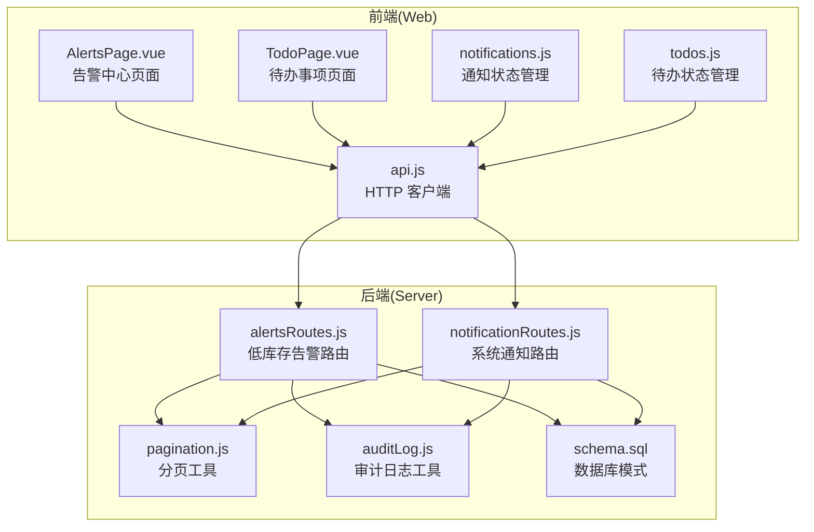
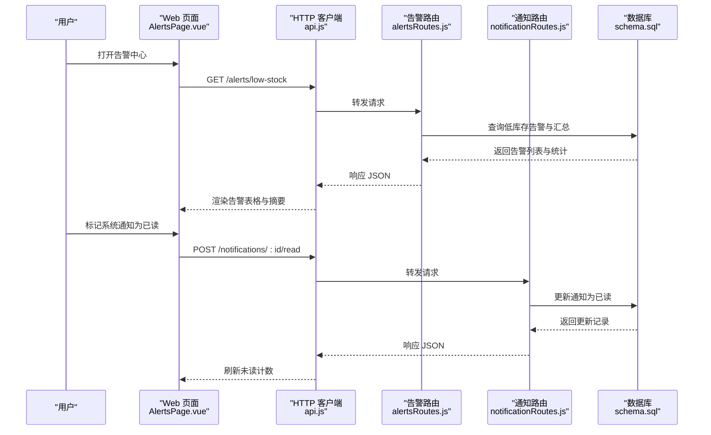
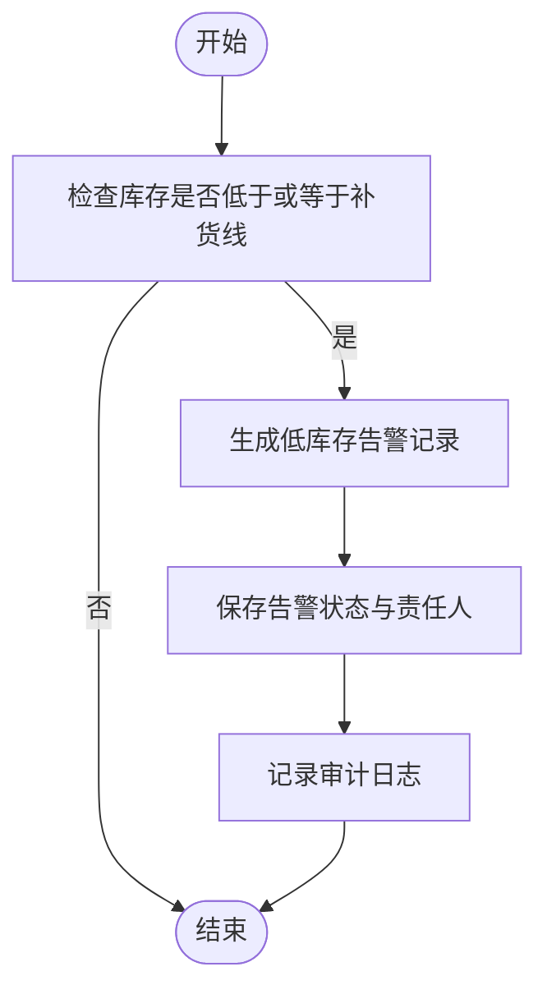
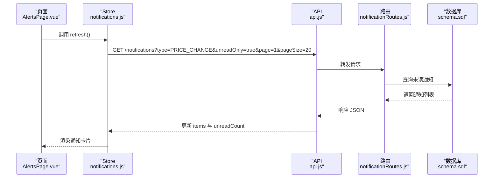
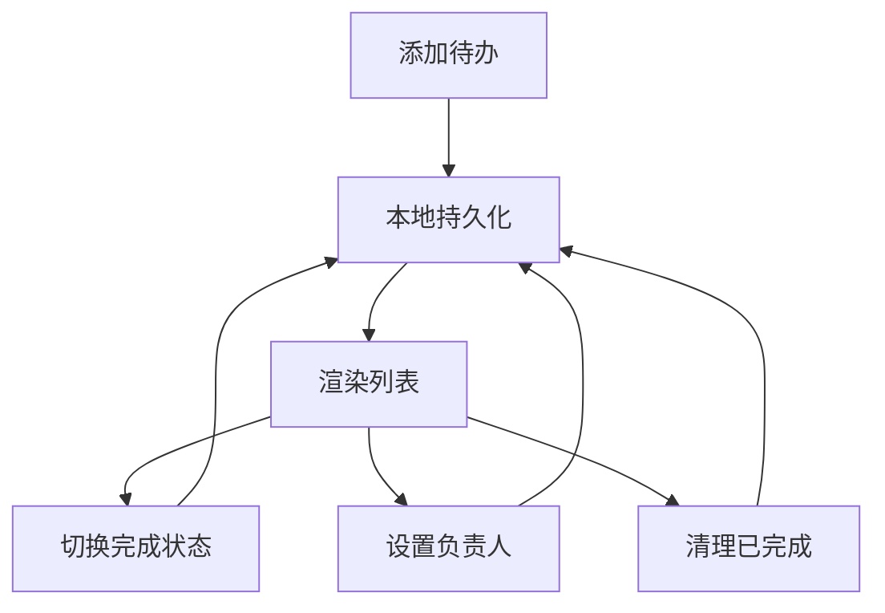
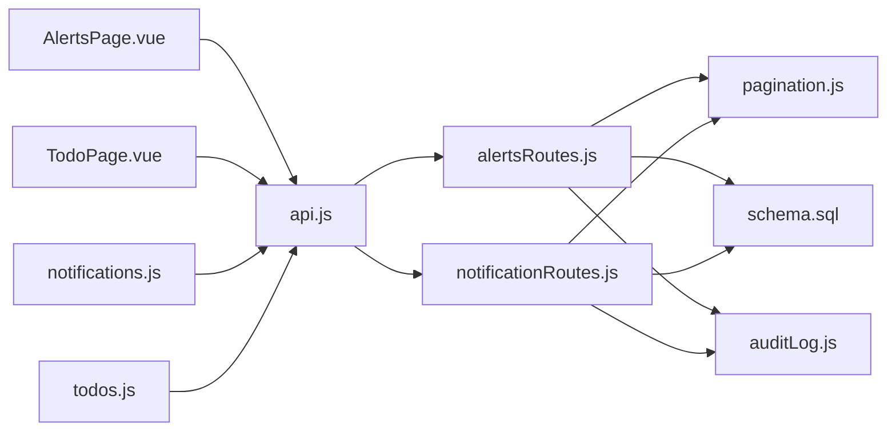
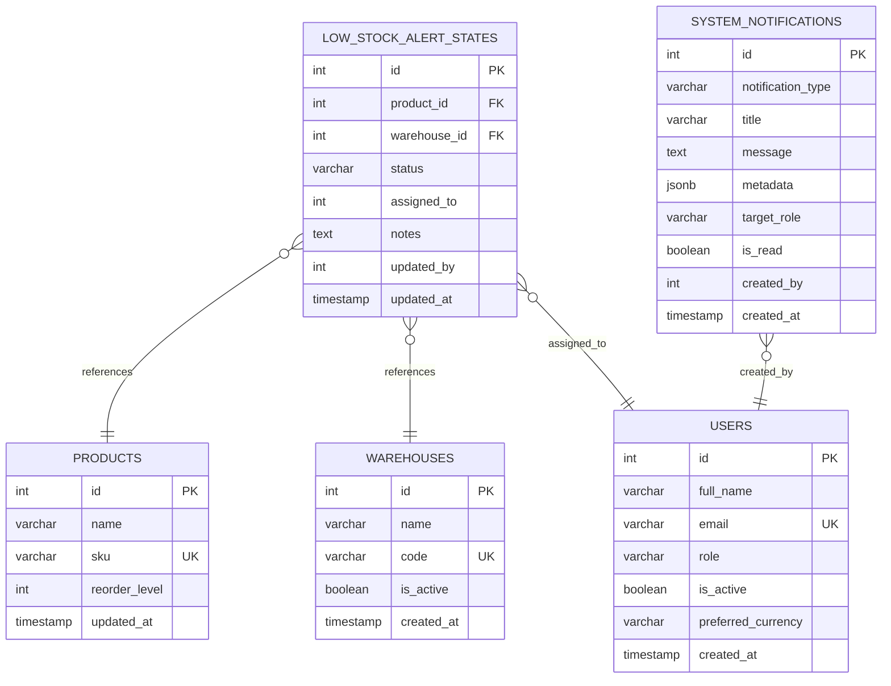

# 通知告警模块

<cite>
**本文档引用的文件**
- [alertsRoutes.js](file://server/src/routes/alertsRoutes.js)
- [notificationRoutes.js](file://server/src/routes/notificationRoutes.js)
- [schema.sql](file://server/database/schema.sql)
- [pagination.js](file://server/src/utils/pagination.js)
- [AlertsPage.vue](file://web/src/pages/AlertsPage.vue)
- [TodoPage.vue](file://web/src/pages/TodoPage.vue)
- [notifications.js](file://web/src/stores/notifications.js)
- [todos.js](file://web/src/stores/todos.js)
- [api.js](file://web/src/services/api.js)
- [auditLog.js](file://server/src/utils/auditLog.js)
</cite>

## 目录
1. [简介](#简介)
2. [项目结构](#项目结构)
3. [核心组件](#核心组件)
4. [架构总览](#架构总览)
5. [详细组件分析](#详细组件分析)
6. [依赖关系分析](#依赖关系分析)
7. [性能考虑](#性能考虑)
8. [故障排除指南](#故障排除指南)
9. [结论](#结论)
10. [附录](#附录)

## 简介
本模块涵盖系统消息、库存告警和任务提醒三大功能域，提供从数据采集、规则判定、状态管理到多渠道通知的完整闭环。系统通过低库存告警驱动库存补货流程，通过系统通知承载业务变更与异常信息，并通过本地化待办事项支撑日常运营任务。

## 项目结构
后端采用 Express 路由组织功能，前端使用 Vue + Pinia 管理状态与交互。数据库通过统一的模式定义存储告警状态、系统通知与审计日志。

**图表来源**
- [AlertsPage.vue:1-723](file://web/src/pages/AlertsPage.vue#L1-L723)
- [TodoPage.vue:1-131](file://web/src/pages/TodoPage.vue#L1-L131)
- [notifications.js:1-52](file://web/src/stores/notifications.js#L1-L52)
- [todos.js:1-91](file://web/src/stores/todos.js#L1-L91)
- [api.js:1-45](file://web/src/services/api.js#L1-L45)
- [alertsRoutes.js:1-311](file://server/src/routes/alertsRoutes.js#L1-L311)
- [notificationRoutes.js:1-91](file://server/src/routes/notificationRoutes.js#L1-L91)
- [pagination.js:1-28](file://server/src/utils/pagination.js#L1-L28)
- [auditLog.js:1-39](file://server/src/utils/auditLog.js#L1-L39)
- [schema.sql:290-388](file://server/database/schema.sql#L290-L388)

**章节来源**
- [AlertsPage.vue:1-723](file://web/src/pages/AlertsPage.vue#L1-L723)
- [TodoPage.vue:1-131](file://web/src/pages/TodoPage.vue#L1-L131)
- [notifications.js:1-52](file://web/src/stores/notifications.js#L1-L52)
- [todos.js:1-91](file://web/src/stores/todos.js#L1-L91)
- [api.js:1-45](file://web/src/services/api.js#L1-L45)
- [alertsRoutes.js:1-311](file://server/src/routes/alertsRoutes.js#L1-L311)
- [notificationRoutes.js:1-91](file://server/src/routes/notificationRoutes.js#L1-L91)
- [pagination.js:1-28](file://server/src/utils/pagination.js#L1-L28)
- [auditLog.js:1-39](file://server/src/utils/auditLog.js#L1-L39)
- [schema.sql:290-388](file://server/database/schema.sql#L290-L388)

## 核心组件
- 低库存告警服务：基于库存与补货线计算，生成告警并支持状态流转与责任人分配。
- 系统通知中心：按角色与类型过滤展示系统消息，支持标记已读与分页查询。
- 待办事项管理：本地持久化的个人任务清单，支持指派与完成状态切换。
- 分页与审计：统一分页参数与审计日志记录，保障可追溯性。

**章节来源**
- [alertsRoutes.js:87-205](file://server/src/routes/alertsRoutes.js#L87-L205)
- [notificationRoutes.js:16-58](file://server/src/routes/notificationRoutes.js#L16-L58)
- [todos.js:19-90](file://web/src/stores/todos.js#L19-L90)
- [pagination.js:1-28](file://server/src/utils/pagination.js#L1-L28)
- [auditLog.js:1-39](file://server/src/utils/auditLog.js#L1-L39)

## 架构总览
系统采用前后端分离架构，前端负责用户交互与状态管理，后端提供 REST 接口与数据持久化。通知与告警通过数据库表进行状态化管理，审计日志贯穿关键操作。

**图表来源**
- [AlertsPage.vue:113-135](file://web/src/pages/AlertsPage.vue#L113-L135)
- [alertsRoutes.js:87-205](file://server/src/routes/alertsRoutes.js#L87-L205)
- [notificationRoutes.js:60-88](file://server/src/routes/notificationRoutes.js#L60-L88)
- [schema.sql:290-388](file://server/database/schema.sql#L290-L388)

## 详细组件分析

### 低库存告警模块
- 触发条件：当库存数量小于等于补货线时触发告警。
- 数据模型：通过 stock_levels 与 products 关联，结合 warehouses、categories、suppliers 等维度聚合。
- 状态管理：支持 OPEN、READ、IGNORED 三种状态；支持责任人分配与备注。
- 批量操作：支持批量更新状态与责任人，便于快速处理。
- 审计追踪：所有告警更新均记录审计日志。

**图表来源**
- [alertsRoutes.js:44-85](file://server/src/routes/alertsRoutes.js#L44-L85)
- [alertsRoutes.js:15-42](file://server/src/routes/alertsRoutes.js#L15-L42)
- [auditLog.js:1-39](file://server/src/utils/auditLog.js#L1-L39)
- [schema.sql:290-300](file://server/database/schema.sql#L290-L300)

**章节来源**
- [alertsRoutes.js:87-205](file://server/src/routes/alertsRoutes.js#L87-L205)
- [alertsRoutes.js:207-251](file://server/src/routes/alertsRoutes.js#L207-L251)
- [alertsRoutes.js:253-308](file://server/src/routes/alertsRoutes.js#L253-L308)
- [schema.sql:290-300](file://server/database/schema.sql#L290-L300)
- [auditLog.js:1-39](file://server/src/utils/auditLog.js#L1-L39)

### 系统通知模块
- 类型与目标：支持按通知类型与目标角色过滤；支持仅显示未读。
- 分页与查询：统一分页参数，支持类型与未读筛选。
- 已读标记：单条通知标记已读，同时记录审计上下文。
- 前端集成：Pinia Store 管理未读计数与列表，支持刷新与标记已读。

**图表来源**
- [AlertsPage.vue:137-156](file://web/src/pages/AlertsPage.vue#L137-L156)
- [notifications.js:13-31](file://web/src/stores/notifications.js#L13-L31)
- [notificationRoutes.js:16-58](file://server/src/routes/notificationRoutes.js#L16-L58)
- [schema.sql:378-388](file://server/database/schema.sql#L378-L388)

**章节来源**
- [notificationRoutes.js:16-58](file://server/src/routes/notificationRoutes.js#L16-L58)
- [notificationRoutes.js:60-88](file://server/src/routes/notificationRoutes.js#L60-L88)
- [notifications.js:13-31](file://web/src/stores/notifications.js#L13-L31)
- [AlertsPage.vue:137-156](file://web/src/pages/AlertsPage.vue#L137-L156)
- [schema.sql:378-388](file://server/database/schema.sql#L378-L388)

### 待办事项模块
- 本地持久化：使用 localStorage 存储用户待办，避免跨设备同步。
- 指派与完成：支持设置负责人与切换完成状态；管理员可为他人创建任务。
- 清理与统计：支持清理已完成任务与剩余数量统计。

**图表来源**
- [todos.js:28-75](file://web/src/stores/todos.js#L28-L75)
- [TodoPage.vue:19-48](file://web/src/pages/TodoPage.vue#L19-L48)

**章节来源**
- [todos.js:19-90](file://web/src/stores/todos.js#L19-L90)
- [TodoPage.vue:1-131](file://web/src/pages/TodoPage.vue#L1-L131)

### 通知渠道与推送机制
- 站内消息：通过系统通知表存储，前端以卡片形式展示与标记已读。
- 邮件/短信/微信：当前代码库未发现具体实现；可在后端扩展通知发送器或集成第三方通道，在系统通知表中增加通道字段与发送状态。

[本节为概念性说明，不直接分析具体文件]

### 告警级别与处理流程
- 现有状态：OPEN、READ、IGNORED。
- 处理流程：查看告警 → 选择状态/责任人 → 批量更新 → 审计记录。
- 建议扩展：引入严重等级（如高/中/低），与响应时限绑定；增加自动提醒与升级机制。

[本节为概念性说明，不直接分析具体文件]

### 任务管理功能
- 待办事项：本地存储、指派、完成状态切换。
- 工作流审批：当前未见审批流程实现；可通过扩展系统通知与审计日志实现审批通知与状态跟踪。
- 进度跟踪：建议在任务项中增加进度字段与里程碑节点。

[本节为概念性说明，不直接分析具体文件]

### 通知设置与个人偏好
- 当前实现：前端未提供通知偏好设置界面；可扩展系统设置表存储用户偏好的通知类型、频率与免打扰时段。
- 建议：在前端 Settings 页面增加开关与时间段配置，后端根据用户偏好过滤通知。

[本节为概念性说明，不直接分析具体文件]

### 告警去噪、重复告警与历史分析
- 去噪策略：基于产品+仓库维度的唯一告警状态，避免重复插入；可扩展阈值与窗口期控制。
- 重复告警：通过状态机与审计日志追踪重复行为；建议增加“静默期”与“重复计数”字段。
- 历史分析：利用审计日志与通知历史表进行趋势分析与报表生成。

[本节为概念性说明，不直接分析具体文件]

## 依赖关系分析
- 前端依赖：Vue 组件依赖 Pinia Store 与 HTTP 客户端；路由依赖统一分页工具。
- 后端依赖：路由依赖数据库连接与分页工具；审计日志工具统一写入格式。
- 数据依赖：低库存告警依赖库存与产品表；系统通知依赖通知表与用户角色。

**图表来源**
- [AlertsPage.vue:1-723](file://web/src/pages/AlertsPage.vue#L1-L723)
- [TodoPage.vue:1-131](file://web/src/pages/TodoPage.vue#L1-L131)
- [notifications.js:1-52](file://web/src/stores/notifications.js#L1-L52)
- [todos.js:1-91](file://web/src/stores/todos.js#L1-L91)
- [api.js:1-45](file://web/src/services/api.js#L1-L45)
- [alertsRoutes.js:1-311](file://server/src/routes/alertsRoutes.js#L1-L311)
- [notificationRoutes.js:1-91](file://server/src/routes/notificationRoutes.js#L1-L91)
- [pagination.js:1-28](file://server/src/utils/pagination.js#L1-L28)
- [auditLog.js:1-39](file://server/src/utils/auditLog.js#L1-L39)
- [schema.sql:290-388](file://server/database/schema.sql#L290-L388)

**章节来源**
- [AlertsPage.vue:1-723](file://web/src/pages/AlertsPage.vue#L1-L723)
- [TodoPage.vue:1-131](file://web/src/pages/TodoPage.vue#L1-L131)
- [notifications.js:1-52](file://web/src/stores/notifications.js#L1-L52)
- [todos.js:1-91](file://web/src/stores/todos.js#L1-L91)
- [api.js:1-45](file://web/src/services/api.js#L1-L45)
- [alertsRoutes.js:1-311](file://server/src/routes/alertsRoutes.js#L1-L311)
- [notificationRoutes.js:1-91](file://server/src/routes/notificationRoutes.js#L1-L91)
- [pagination.js:1-28](file://server/src/utils/pagination.js#L1-L28)
- [auditLog.js:1-39](file://server/src/utils/auditLog.js#L1-L39)
- [schema.sql:290-388](file://server/database/schema.sql#L290-L388)

## 性能考虑
- 分页与索引：后端统一分页参数，数据库为关键表建立索引（如通知类型、创建时间、告警状态）。
- 并行查询：告警列表同时查询数据、总数与汇总，减少往返次数。
- 前端缓存：通知与待办使用 Pinia 管理内存状态，减少重复请求。

[本节为通用指导，不直接分析具体文件]

## 故障排除指南
- 告警状态更新失败：检查状态枚举与权限校验；确认租户隔离与产品/仓库存在性校验。
- 通知未显示：检查类型过滤与未读筛选；确认用户角色匹配目标角色。
- 审计日志缺失：确认审计上下文是否正确设置；检查写入函数参数。

**章节来源**
- [alertsRoutes.js:207-251](file://server/src/routes/alertsRoutes.js#L207-L251)
- [notificationRoutes.js:60-88](file://server/src/routes/notificationRoutes.js#L60-L88)
- [auditLog.js:1-39](file://server/src/utils/auditLog.js#L1-L39)

## 结论
通知告警模块以低库存告警为核心，结合系统通知与本地待办，形成完整的运营提醒体系。现有实现具备清晰的状态管理与审计能力，建议后续扩展通知渠道、告警级别与去噪策略，以提升系统的智能化与可运维性。

## 附录
- 数据模型概览（低库存告警与系统通知）

**图表来源**
- [schema.sql:290-300](file://server/database/schema.sql#L290-L300)
- [schema.sql:378-388](file://server/database/schema.sql#L378-L388)
- [schema.sql:2-11](file://server/database/schema.sql#L2-L11)