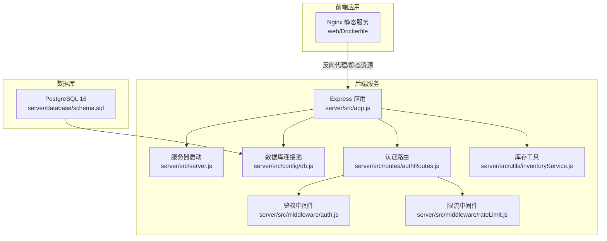
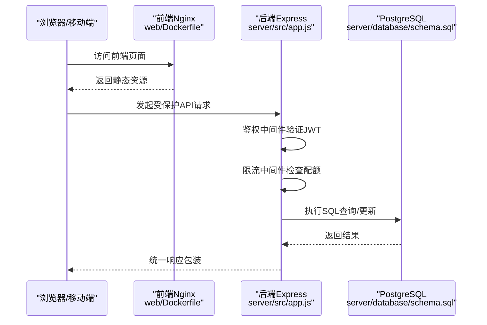
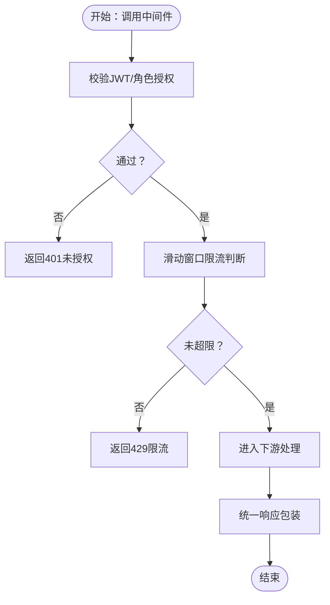
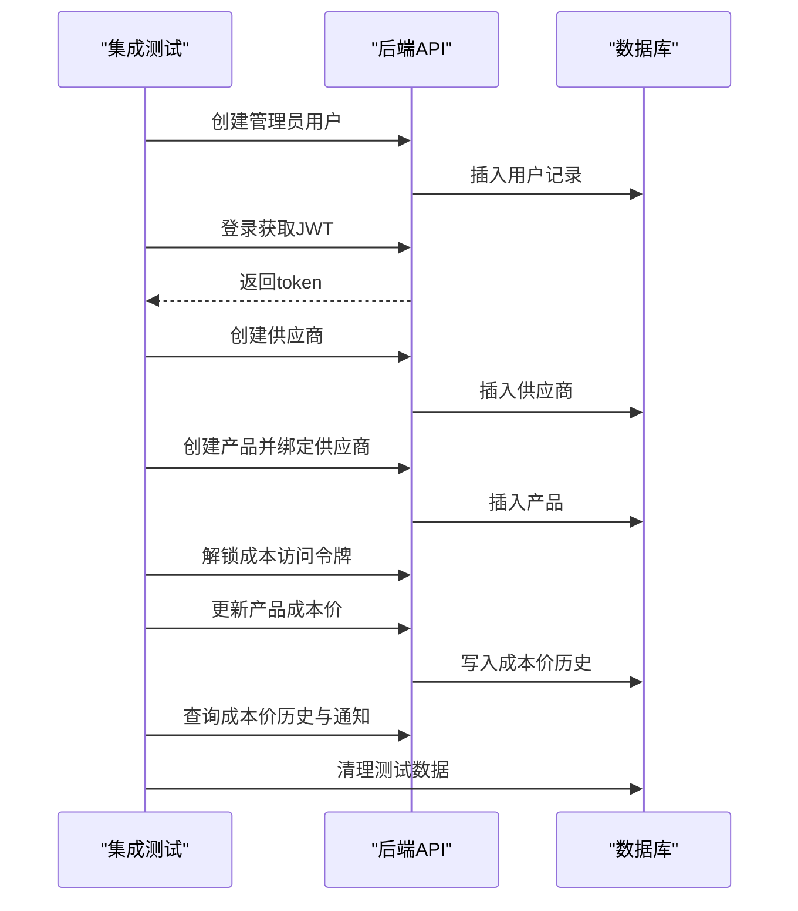
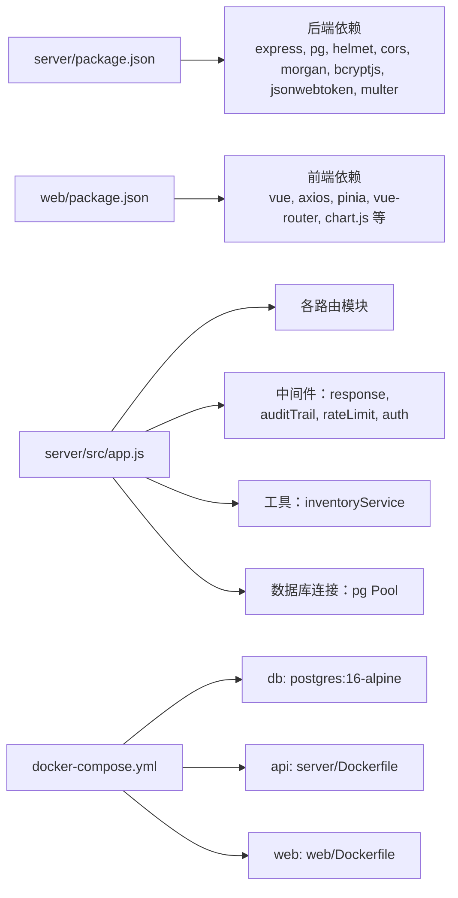

# 测试与部署

<cite>
**本文引用的文件**
- [server/package.json](file://server/package.json)
- [web/package.json](file://web/package.json)
- [docker-compose.yml](file://docker-compose.yml)
- [server/Dockerfile](file://server/Dockerfile)
- [web/Dockerfile](file://web/Dockerfile)
- [server/test/integration.test.js](file://server/test/integration.test.js)
- [server/test/middleware.test.js](file://server/test/middleware.test.js)
- [postman/inventory_system_backend.postman_collection.json](file://postman/inventory_system_backend.postman_collection.json)
- [server/src/app.js](file://server/src/app.js)
- [server/src/server.js](file://server/src/server.js)
- [server/src/config/db.js](file://server/src/config/db.js)
- [server/src/routes/authRoutes.js](file://server/src/routes/authRoutes.js)
- [server/src/middleware/auth.js](file://server/src/middleware/auth.js)
- [server/src/middleware/rateLimit.js](file://server/src/middleware/rateLimit.js)
- [server/src/utils/inventoryService.js](file://server/src/utils/inventoryService.js)
- [server/database/schema.sql](file://server/database/schema.sql)
- [README.md](file://README.md)
</cite>

## 目录
1. [引言](#引言)
2. [项目结构](#项目结构)
3. [核心组件](#核心组件)
4. [架构总览](#架构总览)
5. [详细组件分析](#详细组件分析)
6. [依赖关系分析](#依赖关系分析)
7. [性能考量](#性能考量)
8. [故障排除指南](#故障排除指南)
9. [结论](#结论)
10. [附录](#附录)

## 引言
本文件面向库存管理系统的测试策略与部署流程，覆盖单元测试、集成测试与API测试的实施方法；详述测试框架配置、测试用例编写与持续集成思路；并提供基于Docker的容器化部署全链路说明（镜像构建、容器编排与环境配置），以及生产环境最佳实践（性能优化、监控告警、备份策略）、故障排除、日志分析与系统维护操作，同时涵盖自动化部署、回滚策略与扩展性考虑。

## 项目结构
项目采用前后端分离架构：
- 后端服务（server）：基于Express + PostgreSQL，提供REST API与数据库迁移脚本。
- 前端应用（web）：基于Vue 3 + Vite + Nginx，打包后由Nginx提供静态资源。
- 部署编排：使用docker-compose统一编排数据库、后端API与前端Web服务。

图表来源
- [server/src/app.js:1-67](file://server/src/app.js#L1-L67)
- [server/src/server.js:1-28](file://server/src/server.js#L1-L28)
- [server/src/config/db.js:1-25](file://server/src/config/db.js#L1-L25)
- [server/src/routes/authRoutes.js:1-72](file://server/src/routes/authRoutes.js#L1-L72)
- [server/src/middleware/auth.js:1-46](file://server/src/middleware/auth.js#L1-L46)
- [server/src/middleware/rateLimit.js:1-40](file://server/src/middleware/rateLimit.js#L1-L40)
- [server/src/utils/inventoryService.js:1-45](file://server/src/utils/inventoryService.js#L1-L45)
- [web/Dockerfile:1-19](file://web/Dockerfile#L1-L19)
- [server/database/schema.sql:1-447](file://server/database/schema.sql#L1-L447)

章节来源
- [README.md:22-29](file://README.md#L22-L29)
- [docker-compose.yml:1-57](file://docker-compose.yml#L1-L57)

## 核心组件
- Express应用与中间件：统一响应包装、审计日志、CORS、Helmet、Morgan日志、健康检查端点。
- 路由与鉴权：JWT登录、用户信息查询、基于角色的授权控制。
- 限流中间件：基于内存桶的滑动窗口限流，支持命名空间隔离。
- 数据库连接：基于环境变量的连接字符串与SSL策略，带超时配置。
- 库存工具：封装库存增减与事务一致性保障的通用逻辑。
- 前端静态服务：多阶段构建+Nginx分发，暴露80端口。

章节来源
- [server/src/app.js:1-67](file://server/src/app.js#L1-L67)
- [server/src/server.js:1-28](file://server/src/server.js#L1-L28)
- [server/src/config/db.js:1-25](file://server/src/config/db.js#L1-L25)
- [server/src/routes/authRoutes.js:1-72](file://server/src/routes/authRoutes.js#L1-L72)
- [server/src/middleware/auth.js:1-46](file://server/src/middleware/auth.js#L1-L46)
- [server/src/middleware/rateLimit.js:1-40](file://server/src/middleware/rateLimit.js#L1-L40)
- [server/src/utils/inventoryService.js:1-45](file://server/src/utils/inventoryService.js#L1-L45)
- [web/Dockerfile:1-19](file://web/Dockerfile#L1-L19)

## 架构总览
下图展示从客户端到后端API再到数据库的整体交互路径，以及容器编排关系。

图表来源
- [server/src/app.js:28-56](file://server/src/app.js#L28-L56)
- [server/src/middleware/auth.js:1-46](file://server/src/middleware/auth.js#L1-L46)
- [server/src/middleware/rateLimit.js:1-40](file://server/src/middleware/rateLimit.js#L1-L40)
- [server/src/config/db.js:1-25](file://server/src/config/db.js#L1-L25)
- [server/database/schema.sql:1-447](file://server/database/schema.sql#L1-L447)

## 详细组件分析

### 测试策略与实施

#### 单元测试
- 目标：验证中间件行为（响应包装、错误包装、限流）与工具函数（库存操作）。
- 框架：Node内置测试框架（--test），断言严格模式。
- 关键点：
  - 响应中间件：确保成功/失败响应被统一封装，包含请求ID与错误码。
  - 限流中间件：在限定窗口内达到最大请求数后返回限流错误。
  - 库存工具：封装库存行存在性保证、查询与更新，便于复用与测试。

图表来源
- [server/src/middleware/auth.js:1-46](file://server/src/middleware/auth.js#L1-L46)
- [server/src/middleware/rateLimit.js:1-40](file://server/src/middleware/rateLimit.js#L1-L40)
- [server/src/app.js:28-34](file://server/src/app.js#L28-L34)

章节来源
- [server/test/middleware.test.js:1-52](file://server/test/middleware.test.js#L1-L52)
- [server/src/utils/inventoryService.js:1-45](file://server/src/utils/inventoryService.js#L1-L45)

#### 集成测试
- 目标：端到端验证业务流程，如供应商与产品关联、成本价变更历史与通知、登录鉴权等。
- 方法：通过Supertest发起HTTP请求，结合数据库清理与随机化数据避免副作用。
- 关键点：
  - 条件运行：通过环境变量控制是否执行数据库相关测试。
  - 登录流程：先创建管理员用户，再登录获取JWT。
  - 成本价变更：解锁成本访问令牌后更新产品成本价，验证历史记录与通知生成。
  - 清理策略：无论成功与否，均删除测试数据以保持环境干净。

图表来源
- [server/test/integration.test.js:1-162](file://server/test/integration.test.js#L1-L162)
- [server/src/config/db.js:1-25](file://server/src/config/db.js#L1-L25)

章节来源
- [server/test/integration.test.js:1-162](file://server/test/integration.test.js#L1-L162)

#### API测试（Postman）
- 目标：覆盖登录、产品、库存、报表、预警、盘点等常用API场景。
- 用法：导入集合与环境，设置基础URL与认证参数，按顺序执行。
- 关键场景：
  - 登录：设置全局token与用户角色。
  - 成本解锁：设置成本访问令牌。
  - 产品：列表、详情、创建、更新、删除。
  - 库存：入库、出库、调拨、交易流水。
  - 报表：库存报表、出入库报表。
  - 预警：低库存列表、批量更新。
  - 盘点：创建、明细、保存、完成、应用。

章节来源
- [postman/inventory_system_backend.postman_collection.json:1-585](file://postman/inventory_system_backend.postman_collection.json#L1-L585)

### 部署流程与容器化

#### 镜像构建
- 后端镜像（server）：
  - 基于Alpine Node镜像，仅安装生产依赖，复制源码，暴露4000端口，CMD启动。
- 前端镜像（web）：
  - 多阶段构建：第一阶段安装依赖并构建，第二阶段使用Nginx提供静态服务，默认暴露80端口。

章节来源
- [server/Dockerfile:1-13](file://server/Dockerfile#L1-L13)
- [web/Dockerfile:1-19](file://web/Dockerfile#L1-L19)

#### 容器编排与环境配置
- 编排内容：db（PostgreSQL 16）、api（Express）、web（Nginx）。
- 环境变量：
  - 数据库：数据库名、用户名、密码、卷映射初始化脚本。
  - API：端口、数据库连接串、JWT密钥、第三方平台同步端点与令牌。
  - Web：反向代理至后端API。
- 健康检查：数据库健康探针，API依赖数据库健康启动。

章节来源
- [docker-compose.yml:1-57](file://docker-compose.yml#L1-L57)

#### 启停与重置
- 启动：docker compose up -d --build
- 访问：前端8080端口，后端4000端口健康检查
- 停止：docker compose down
- 重置：docker compose down -v 并重建

章节来源
- [README.md:73-105](file://README.md#L73-L105)

### 生产环境最佳实践

#### 性能优化
- 连接池与SSL：根据连接串与环境自动启用SSL，合理设置连接超时。
- 限流策略：为登录等敏感接口设置更严格的限流窗口与阈值，避免暴力破解。
- 日志与审计：开启Morgan与审计中间件，区分开发与生产日志级别。
- 前端缓存：Nginx静态资源缓存策略与压缩，减少带宽占用。

章节来源
- [server/src/config/db.js:1-25](file://server/src/config/db.js#L1-L25)
- [server/src/middleware/rateLimit.js:1-40](file://server/src/middleware/rateLimit.js#L1-L40)
- [server/src/app.js:28-34](file://server/src/app.js#L28-L34)

#### 监控与告警
- 健康检查：/api/health端点用于Kubernetes或负载均衡探活。
- 日志采集：容器标准输出接入集中式日志系统（如ELK/Fluentd）。
- 指标监控：结合限流命中率、数据库连接数、响应时间等指标建立告警。

章节来源
- [server/src/app.js:36-38](file://server/src/app.js#L36-L38)
- [docker-compose.yml:16-20](file://docker-compose.yml#L16-L20)

#### 备份策略
- 数据库备份：定期导出schema与数据，保留多版本归档，验证恢复流程。
- 配置备份：敏感环境变量与密钥集中管理，不纳入镜像层。
- 回滚基线：镜像版本与数据库迁移脚本版本化管理。

章节来源
- [server/database/schema.sql:1-447](file://server/database/schema.sql#L1-L447)

### 自动化部署与回滚
- CI/CD建议：
  - 触发条件：push到主分支或打标签。
  - 步骤：安装依赖、运行单元测试、构建镜像、推送仓库、编排部署、健康检查、回滚策略。
- 回滚策略：滚动回滚至上一个稳定镜像版本，必要时回退数据库迁移。
- 扩展性：水平扩展API节点，共享数据库；前端可多副本部署提升可用性。

章节来源
- [server/package.json:6-10](file://server/package.json#L6-L10)
- [web/package.json:6-11](file://web/package.json#L6-L11)
- [docker-compose.yml:1-57](file://docker-compose.yml#L1-L57)

## 依赖关系分析

图表来源
- [server/package.json:15-29](file://server/package.json#L15-L29)
- [web/package.json:12-23](file://web/package.json#L12-L23)
- [server/src/app.js:1-67](file://server/src/app.js#L1-L67)
- [docker-compose.yml:1-57](file://docker-compose.yml#L1-L57)

章节来源
- [server/package.json:1-31](file://server/package.json#L1-L31)
- [web/package.json:1-34](file://web/package.json#L1-L34)
- [docker-compose.yml:1-57](file://docker-compose.yml#L1-L57)

## 性能考量
- 数据库层面：为高频查询字段建立索引（如产品、库存、订单、审计日志等），定期分析统计信息。
- API层面：对大列表接口启用分页与搜索过滤，避免一次性返回海量数据。
- 中间件层面：合理设置Body大小限制与日志级别，避免成为瓶颈。
- 前端层面：静态资源压缩与缓存，减少首屏加载时间。

章节来源
- [server/database/schema.sql:410-447](file://server/database/schema.sql#L410-L447)
- [server/src/app.js:31-32](file://server/src/app.js#L31-L32)

## 故障排除指南
- 启动失败（数据库连接超时）：
  - 现象：启动阶段等待数据库就绪超时并退出。
  - 排查：检查DATABASE_URL、网络连通性、数据库健康状态、初始化脚本是否执行。
- 认证失败：
  - 现象：登录返回401或JWT无效。
  - 排查：确认JWT_SECRET一致、用户存在且激活、密码正确。
- 限流触发：
  - 现象：频繁请求返回429。
  - 排查：调整限流窗口与阈值，或在测试环境关闭限流。
- 健康检查：
  - 使用/api/health确认后端存活，再访问前端页面确认联调正常。

章节来源
- [server/src/server.js:13-25](file://server/src/server.js#L13-L25)
- [server/src/config/db.js:1-25](file://server/src/config/db.js#L1-L25)
- [server/src/middleware/auth.js:1-46](file://server/src/middleware/auth.js#L1-L46)
- [server/src/middleware/rateLimit.js:1-40](file://server/src/middleware/rateLimit.js#L1-L40)
- [server/src/app.js:36-38](file://server/src/app.js#L36-L38)

## 结论
本项目提供了完善的测试与部署基础设施：Node内置测试框架用于单元与集成测试，Postman集合覆盖主要API场景；docker-compose实现一键本地部署；生产环境建议结合限流、SSL、日志与监控体系，配合数据库备份与版本化发布，确保系统稳定性与可维护性。

## 附录

### 测试命令与脚本
- 后端测试：使用Node内置测试框架，支持条件运行数据库相关测试。
- 前端测试：项目未提供专用测试脚本，建议在CI中进行构建与预览验证。

章节来源
- [server/package.json:6-10](file://server/package.json#L6-L10)
- [web/package.json:6-11](file://web/package.json#L6-L11)

### API测试清单（基于Postman集合）
- 健康检查、登录、用户信息、成本解锁、产品增删改查、库存出入库与调拨、报表、预警、盘点全流程。

章节来源
- [postman/inventory_system_backend.postman_collection.json:10-585](file://postman/inventory_system_backend.postman_collection.json#L10-L585)