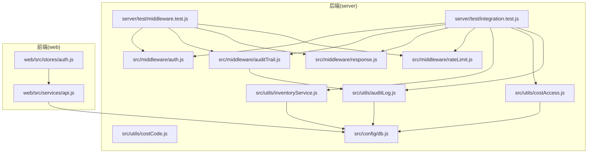
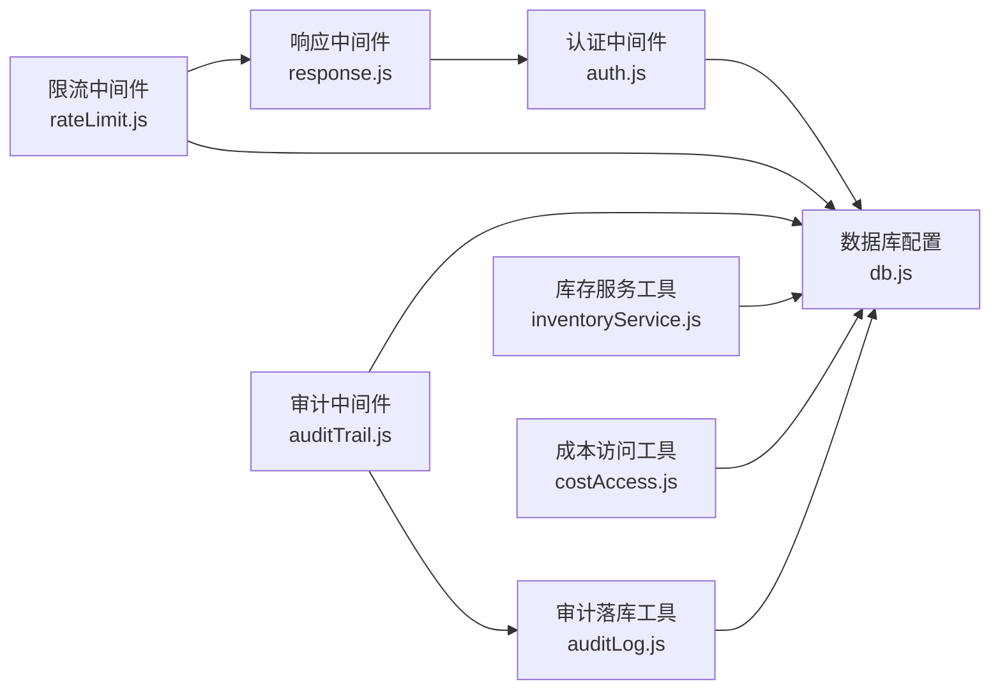
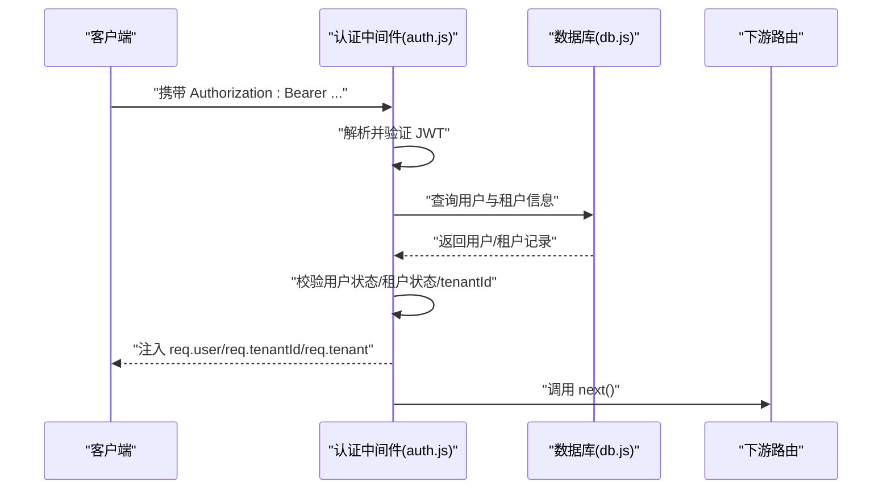
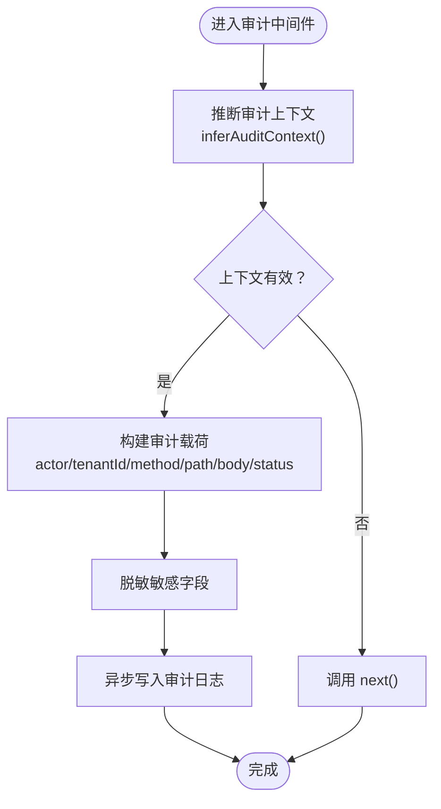
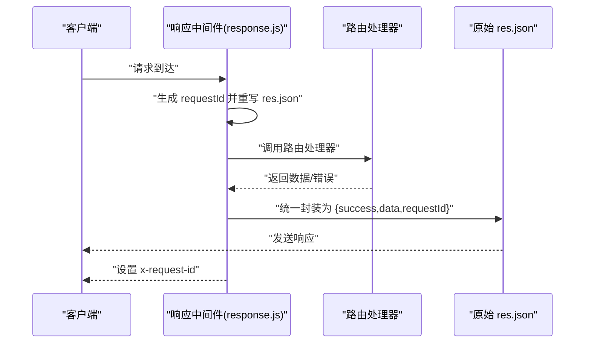
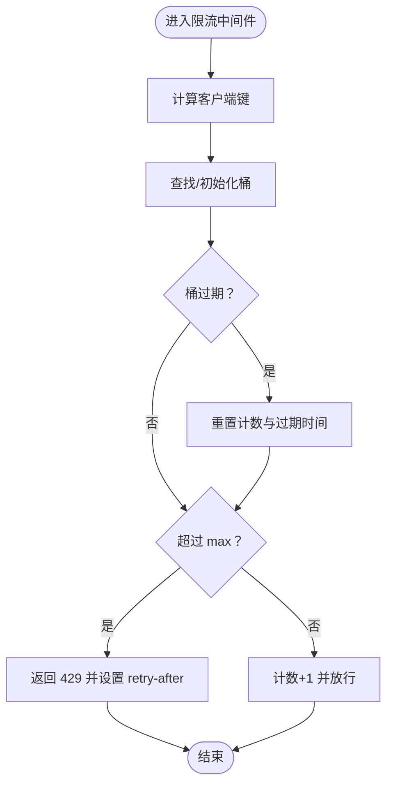
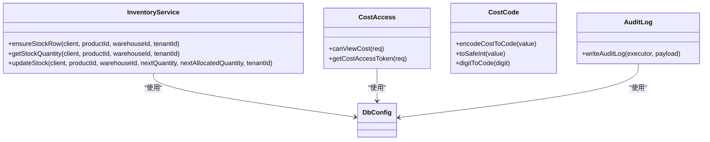
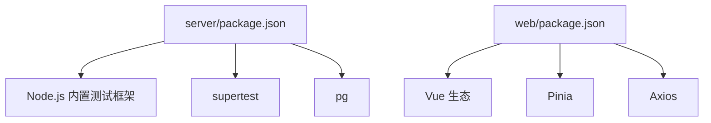

# 单元测试

<cite>
**本文引用的文件**
- [server/test/middleware.test.js](file://server/test/middleware.test.js)
- [server/test/integration.test.js](file://server/test/integration.test.js)
- [server/package.json](file://server/package.json)
- [web/package.json](file://web/package.json)
- [server/src/middleware/auth.js](file://server/src/middleware/auth.js)
- [server/src/middleware/auditTrail.js](file://server/src/middleware/auditTrail.js)
- [server/src/middleware/response.js](file://server/src/middleware/response.js)
- [server/src/middleware/rateLimit.js](file://server/src/middleware/rateLimit.js)
- [server/src/utils/inventoryService.js](file://server/src/utils/inventoryService.js)
- [server/src/utils/costAccess.js](file://server/src/utils/costAccess.js)
- [server/src/utils/costCode.js](file://server/src/utils/costCode.js)
- [server/src/utils/auditLog.js](file://server/src/utils/auditLog.js)
- [server/src/config/db.js](file://server/src/config/db.js)
- [web/src/services/api.js](file://web/src/services/api.js)
- [web/src/stores/auth.js](file://web/src/stores/auth.js)
</cite>

## 目录
1. [简介](#简介)
2. [项目结构](#项目结构)
3. [核心组件](#核心组件)
4. [架构总览](#架构总览)
5. [详细组件分析](#详细组件分析)
6. [依赖分析](#依赖分析)
7. [性能考虑](#性能考虑)
8. [故障排查指南](#故障排查指南)
9. [结论](#结论)
10. [附录](#附录)

## 简介
本文件系统化梳理库存管理系统的单元测试与集成测试实践，覆盖后端中间件（认证、审计日志、响应包装、限流）、业务工具函数（库存服务、成本访问令牌、成本编码、审计落库）、以及前端服务与状态管理的可测性设计。文档同时给出测试框架选择与配置、测试用例编写规范、Mock 与隔离策略、覆盖率与质量标准建议，并通过图示展示关键流程。

## 项目结构
- 后端测试位于 server/test，包含中间件测试与集成测试。
- 前端位于 web，使用 Vite 构建，Pinia 状态管理，Axios 封装 API 请求。
- 测试框架：后端使用 Node.js 内置测试框架；前端未在仓库中发现官方测试脚本配置。

图表来源
- [server/test/middleware.test.js:1-52](file://server/test/middleware.test.js#L1-L52)
- [server/test/integration.test.js:1-162](file://server/test/integration.test.js#L1-L162)
- [server/src/middleware/auth.js:1-87](file://server/src/middleware/auth.js#L1-L87)
- [server/src/middleware/auditTrail.js:1-86](file://server/src/middleware/auditTrail.js#L1-L86)
- [server/src/middleware/response.js:1-62](file://server/src/middleware/response.js#L1-L62)
- [server/src/middleware/rateLimit.js:1-40](file://server/src/middleware/rateLimit.js#L1-L40)
- [server/src/utils/inventoryService.js:1-46](file://server/src/utils/inventoryService.js#L1-L46)
- [server/src/utils/costAccess.js:1-32](file://server/src/utils/costAccess.js#L1-L32)
- [server/src/utils/auditLog.js:1-40](file://server/src/utils/auditLog.js#L1-L40)
- [server/src/config/db.js](file://server/src/config/db.js)
- [web/src/services/api.js:1-45](file://web/src/services/api.js#L1-L45)
- [web/src/stores/auth.js:1-120](file://web/src/stores/auth.js#L1-L120)

章节来源
- [server/test/middleware.test.js:1-52](file://server/test/middleware.test.js#L1-L52)
- [server/test/integration.test.js:1-162](file://server/test/integration.test.js#L1-L162)
- [server/package.json:1-31](file://server/package.json#L1-L31)
- [web/package.json:1-34](file://web/package.json#L1-L34)

## 核心组件
- 认证中间件：解析并验证 JWT，注入用户与租户上下文，支持角色授权与租户强制校验。
- 审计日志中间件：推断审计动作与实体，清洗敏感字段，异步写入审计日志表。
- 响应中间件：统一封装成功/失败响应，生成请求 ID，提供 success/fail 辅助方法。
- 限流中间件：基于内存桶的滑动窗口限流，支持命名空间与窗口参数。
- 库存服务工具：封装库存行确保、查询与更新，按 tenant_id 隔离。
- 成本访问工具：校验成本查看专用令牌，判定是否具备成本可见权限。
- 成本编码工具：将数值安全转换为可读编码，支持边界与类型校验。
- 审计落库工具：将审计载荷持久化至数据库。
- 前端 API 封装：拦截器自动注入 Authorization 与成本访问令牌，统一对错误消息透传。
- 前端认证状态：Pinia Store 管理 token、用户、租户与本地持久化。

章节来源
- [server/src/middleware/auth.js:1-87](file://server/src/middleware/auth.js#L1-L87)
- [server/src/middleware/auditTrail.js:1-86](file://server/src/middleware/auditTrail.js#L1-L86)
- [server/src/middleware/response.js:1-62](file://server/src/middleware/response.js#L1-L62)
- [server/src/middleware/rateLimit.js:1-40](file://server/src/middleware/rateLimit.js#L1-L40)
- [server/src/utils/inventoryService.js:1-46](file://server/src/utils/inventoryService.js#L1-L46)
- [server/src/utils/costAccess.js:1-32](file://server/src/utils/costAccess.js#L1-L32)
- [server/src/utils/costCode.js:1-63](file://server/src/utils/costCode.js#L1-L63)
- [server/src/utils/auditLog.js:1-40](file://server/src/utils/auditLog.js#L1-L40)
- [web/src/services/api.js:1-45](file://web/src/services/api.js#L1-L45)
- [web/src/stores/auth.js:1-120](file://web/src/stores/auth.js#L1-L120)

## 架构总览
下图展示后端中间件与工具之间的交互关系，以及与数据库的依赖。

图表来源
- [server/src/middleware/response.js:1-62](file://server/src/middleware/response.js#L1-L62)
- [server/src/middleware/auth.js:1-87](file://server/src/middleware/auth.js#L1-L87)
- [server/src/middleware/rateLimit.js:1-40](file://server/src/middleware/rateLimit.js#L1-L40)
- [server/src/middleware/auditTrail.js:1-86](file://server/src/middleware/auditTrail.js#L1-L86)
- [server/src/utils/auditLog.js:1-40](file://server/src/utils/auditLog.js#L1-L40)
- [server/src/utils/inventoryService.js:1-46](file://server/src/utils/inventoryService.js#L1-L46)
- [server/src/utils/costAccess.js:1-32](file://server/src/utils/costAccess.js#L1-L32)
- [server/src/config/db.js](file://server/src/config/db.js)

## 详细组件分析

### 认证中间件测试策略
- 测试目标
  - 缺失 Token 返回 401。
  - Token 解析失败或过期返回 401。
  - 用户不存在或非激活状态返回 401。
  - 租户状态非 ACTIVE 返回 403。
  - Token 中 tenantId 与数据库不一致返回 401。
  - 角色授权中间件拒绝无权限访问。
  - 强制租户上下文中间件缺失时返回 401。
- 测试方法
  - 使用 supertest 发起受保护路由请求，构造不同 JWT 与用户状态。
  - 在测试前准备数据库中的用户与租户记录，确保租户状态与用户绑定一致。
  - 使用随机邮箱与密码，测试后清理测试数据。
- 断言要点
  - 状态码与响应体字段 success/code/message/requestId。
  - 注入 req.user、req.tenantId、req.tenant 的完整性。
- 隔离与 Mock
  - 使用数据库事务或临时表进行隔离；对鉴权失败场景，直接构造无效 token 或篡改 payload。
  - 对外部依赖（如数据库查询）采用真实连接，但仅在测试期间插入/删除测试数据。

图表来源
- [server/src/middleware/auth.js:1-87](file://server/src/middleware/auth.js#L1-L87)
- [server/src/config/db.js](file://server/src/config/db.js)

章节来源
- [server/src/middleware/auth.js:1-87](file://server/src/middleware/auth.js#L1-L87)

### 审计日志中间件测试策略
- 测试目标
  - 登录成功且方法为 POST /api/auth/login 时记录 LOGIN 审计。
  - 非 2xx 响应不记录审计。
  - 其他写操作根据路径推断 entityType/action/entityId。
  - 敏感字段（如 password）被脱敏。
  - 异步写入审计日志，异常不影响主流程。
- 测试方法
  - 使用中间件包装测试应用，构造不同请求与响应状态。
  - 在审计上下文中注入 auditUser 或 req.user，验证 actor 字段。
  - 断言写入审计日志表的字段一致性。
- 断言要点
  - 上下文推断结果（action/entityType/entityId）。
  - 脱敏后的请求体。
  - 日志条目包含 tenantId、userId、method、path、metadata。
- 隔离与 Mock
  - 可以 Mock writeAuditLog 实现，断言调用参数；或使用真实数据库验证落库。

图表来源
- [server/src/middleware/auditTrail.js:1-86](file://server/src/middleware/auditTrail.js#L1-L86)
- [server/src/utils/auditLog.js:1-40](file://server/src/utils/auditLog.js#L1-L40)

章节来源
- [server/src/middleware/auditTrail.js:1-86](file://server/src/middleware/auditTrail.js#L1-L86)
- [server/src/utils/auditLog.js:1-40](file://server/src/utils/auditLog.js#L1-L40)

### 响应中间件测试策略
- 测试目标
  - 成功响应自动包裹 success=true、data、requestId。
  - 失败响应自动包裹 success=false、code/message/details、requestId。
  - 支持 res.success()/res.fail() 辅助方法。
  - 设置 x-request-id 响应头。
- 测试方法
  - 使用 supertest 发起 GET/POST 请求，分别触发成功与错误分支。
  - 断言响应体结构与头部。
- 断言要点
  - success、data/code/message/requestId 字段存在且类型正确。
  - requestId 与 x-request-id 一致。

图表来源
- [server/src/middleware/response.js:1-62](file://server/src/middleware/response.js#L1-L62)

章节来源
- [server/src/middleware/response.js:1-62](file://server/src/middleware/response.js#L1-L62)

### 限流中间件测试策略
- 测试目标
  - 在窗口内请求次数不超过阈值时放行。
  - 超过阈值返回 429，携带 RATE_LIMITED 错误码与 retry-after。
- 测试方法
  - 连续发起请求直至触发限流，断言状态码与响应体字段。
  - 使用不同命名空间与 IP 场景验证隔离。
- 断言要点
  - 429 状态码与 code=RATE_LIMITED。
  - retry-after 头部或响应详情包含重试秒数。

图表来源
- [server/src/middleware/rateLimit.js:1-40](file://server/src/middleware/rateLimit.js#L1-L40)

章节来源
- [server/src/middleware/rateLimit.js:1-40](file://server/src/middleware/rateLimit.js#L1-L40)

### 业务逻辑服务测试（库存、成本、审计）
- 库存服务
  - 测试 ensureStockRow：确保库存行存在（冲突忽略），按 tenant_id 隔离。
  - 测试 getStockQuantity：查询在库与已分配数量，返回数值型默认值。
  - 测试 updateStock：原子更新数量与时间戳，按 tenant_id 隔离。
- 成本访问
  - 测试 canViewCost：当请求头携带合法成本访问令牌且用户角色为 ADMIN/MANAGER 时返回真。
- 成本编码
  - 测试 encodeCostToCode：对整数安全转换，支持 0–99、0–999、0–9999 的编码规则，非法输入返回空。
- 审计落库
  - 测试 writeAuditLog：将载荷写入 audit_logs 表，metadata 序列化为 JSONB。

图表来源
- [server/src/utils/inventoryService.js:1-46](file://server/src/utils/inventoryService.js#L1-L46)
- [server/src/utils/costAccess.js:1-32](file://server/src/utils/costAccess.js#L1-L32)
- [server/src/utils/costCode.js:1-63](file://server/src/utils/costCode.js#L1-L63)
- [server/src/utils/auditLog.js:1-40](file://server/src/utils/auditLog.js#L1-L40)
- [server/src/config/db.js](file://server/src/config/db.js)

章节来源
- [server/src/utils/inventoryService.js:1-46](file://server/src/utils/inventoryService.js#L1-L46)
- [server/src/utils/costAccess.js:1-32](file://server/src/utils/costAccess.js#L1-L32)
- [server/src/utils/costCode.js:1-63](file://server/src/utils/costCode.js#L1-L63)
- [server/src/utils/auditLog.js:1-40](file://server/src/utils/auditLog.js#L1-L40)

### 前端组件与服务测试（概念性指导）
- API 封装
  - 自动注入 Authorization 与成本访问令牌，统一对错误响应进行消息透传。
  - 建议在测试中 Mock axios，断言请求头与拦截器行为。
- 认证状态
  - Pinia Store 管理 token、用户、租户与本地存储；建议使用测试环境隔离本地存储。
- Vue 组件
  - 对于展示型组件，建议使用 DOM 测试工具（如 @testing-library/vue）进行快照与交互测试。
  - 对于依赖 API 的组件，建议 Mock api.js 并断言渲染与副作用。

章节来源
- [web/src/services/api.js:1-45](file://web/src/services/api.js#L1-L45)
- [web/src/stores/auth.js:1-120](file://web/src/stores/auth.js#L1-L120)

## 依赖分析
- 后端测试依赖
  - Node.js 内置测试框架与 supertest。
  - 数据库连接与查询工具（pg）。
- 前端测试依赖
  - 仓库未提供官方测试脚本，建议引入 @vitejs/plugin-vue 与测试运行器（如 Vitest）进行组件与服务测试。

图表来源
- [server/package.json:1-31](file://server/package.json#L1-L31)
- [web/package.json:1-34](file://web/package.json#L1-L34)

章节来源
- [server/package.json:1-31](file://server/package.json#L1-L31)
- [web/package.json:1-34](file://web/package.json#L1-L34)

## 性能考虑
- 中间件链路短、无阻塞 I/O：认证与限流为纯 CPU/内存操作，审计日志异步写入，避免阻塞主请求。
- 响应包装与拦截器：减少重复样板代码，降低出错概率。
- 建议
  - 对高频路由启用限流，合理设置窗口与阈值。
  - 审计日志写入失败不应影响业务响应，可在生产中增加重试与死信队列。

## 故障排查指南
- 认证失败
  - 检查 Authorization 头格式与 JWT 有效性。
  - 核对用户状态与租户状态是否为 ACTIVE。
- 审计日志缺失
  - 确认请求方法与状态码满足记录条件。
  - 检查敏感字段是否被正确脱敏。
- 响应格式异常
  - 确认响应中间件是否正确重写 res.json。
  - 检查 res.success/res.fail 是否被正确调用。
- 限流误伤
  - 核对命名空间与客户端 IP 计算逻辑。
  - 检查窗口与阈值配置。

章节来源
- [server/src/middleware/auth.js:1-87](file://server/src/middleware/auth.js#L1-L87)
- [server/src/middleware/auditTrail.js:1-86](file://server/src/middleware/auditTrail.js#L1-L86)
- [server/src/middleware/response.js:1-62](file://server/src/middleware/response.js#L1-L62)
- [server/src/middleware/rateLimit.js:1-40](file://server/src/middleware/rateLimit.js#L1-L40)

## 结论
本项目在后端实现了完善的中间件与工具层测试，覆盖认证、审计、响应包装与限流等关键能力。业务工具函数（库存、成本、审计落库）具备清晰职责与可测试性。前端通过 API 封装与状态管理提供了良好的可测性基础。建议后续补充前端组件与服务的单元测试，并完善覆盖率与质量门禁。

## 附录

### 测试框架选择与配置
- 后端
  - 使用 Node.js 内置测试框架，命令为 npm 脚本中的 node --test。
  - 依赖 supertest 发起 HTTP 请求。
- 前端
  - 仓库未提供测试脚本，建议引入 Vitest 与 @vitejs/plugin-vue 进行组件与服务测试。

章节来源
- [server/package.json:1-31](file://server/package.json#L1-L31)
- [web/package.json:1-34](file://web/package.json#L1-L34)

### 测试用例编写规范
- 断言方法
  - 使用 strict 断言进行精确比较，优先断言响应体字段与状态码。
  - 对日期/UUID 类字段断言存在性与格式特征。
- 测试数据准备与清理
  - 集成测试中使用随机后缀与 bcrypt 加密，测试后清理 users/suppliers/products 等表。
  - 本地测试中使用 Mock 或内存数据库，避免污染真实数据。
- 测试隔离
  - 使用独立命名空间与客户端键进行限流隔离。
  - 使用独立租户 ID 隔离库存与审计数据。

章节来源
- [server/test/integration.test.js:1-162](file://server/test/integration.test.js#L1-L162)
- [server/test/middleware.test.js:1-52](file://server/test/middleware.test.js#L1-L52)

### Mock 对象与测试隔离
- Mock 建议
  - 对数据库查询使用真实连接但仅在测试块内插入/删除。
  - 对外部服务（如审计落库）可 Mock 以断言调用参数。
- 隔离技术
  - 使用独立数据库用户与测试模式。
  - 使用随机标识符与唯一邮箱，确保并发测试不互相干扰。

章节来源
- [server/src/middleware/auditTrail.js:1-86](file://server/src/middleware/auditTrail.js#L1-L86)
- [server/src/utils/auditLog.js:1-40](file://server/src/utils/auditLog.js#L1-L40)

### 测试覆盖率与质量标准
- 覆盖率建议
  - 关键中间件与工具函数达到 90%+ 行覆盖率。
  - 业务逻辑（库存、成本、审计）达到 85%+ 行覆盖率。
- 质量标准
  - 每个分支至少一个反例用例。
  - 错误路径明确断言错误码与消息。
  - 异步流程断言回调与异常捕获。