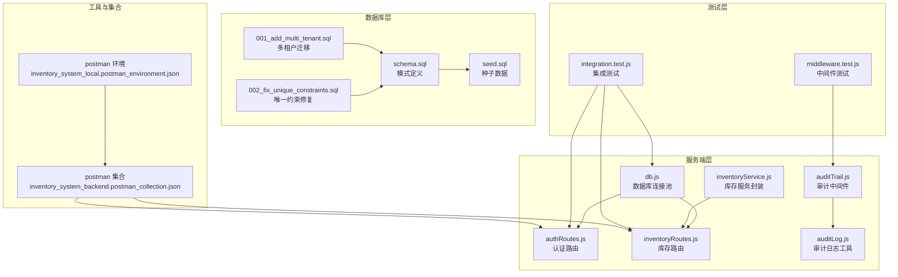
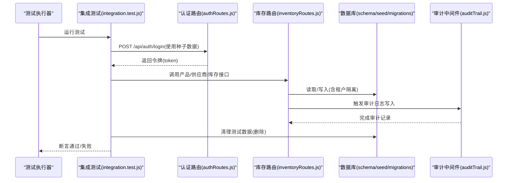
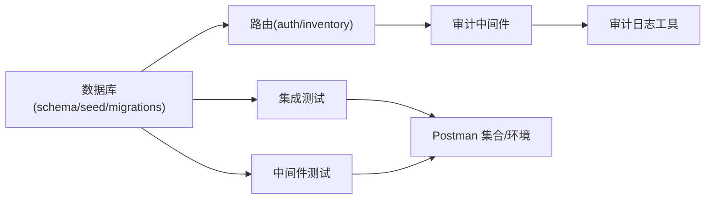

# 测试数据管理

<cite>
**本文引用的文件**
- [schema.sql](file://server/database/schema.sql)
- [seed.sql](file://server/database/seed.sql)
- [001_add_multi_tenant.sql](file://server/database/migrations/001_add_multi_tenant.sql)
- [002_fix_unique_constraints.sql](file://server/database/migrations/002_fix_unique_constraints.sql)
- [db.js](file://server/src/config/db.js)
- [integration.test.js](file://server/test/integration.test.js)
- [middleware.test.js](file://server/test/middleware.test.js)
- [auditTrail.js](file://server/src/middleware/auditTrail.js)
- [auditLog.js](file://server/src/utils/auditLog.js)
- [inventoryService.js](file://server/src/utils/inventoryService.js)
- [authRoutes.js](file://server/src/routes/authRoutes.js)
- [inventoryRoutes.js](file://server/src/routes/inventoryRoutes.js)
- [package.json](file://server/package.json)
- [inventory_system_backend.postman_collection.json](file://postman/inventory_system_backend.postman_collection.json)
- [inventory_system_local.postman_environment.json](file://postman/inventory_system_local.postman_environment.json)
</cite>

## 目录
1. [简介](#简介)
2. [项目结构](#项目结构)
3. [核心组件](#核心组件)
4. [架构总览](#架构总览)
5. [详细组件分析](#详细组件分析)
6. [依赖关系分析](#依赖关系分析)
7. [性能考量](#性能考量)
8. [故障排查指南](#故障排查指南)
9. [结论](#结论)
10. [附录](#附录)

## 简介
本文件面向库存管理系统的测试数据管理，系统性阐述测试数据的准备、生成与初始化、隔离与清理、随机化与去重、版本与迁移、环境同步与备份恢复、安全与隐私、性能优化与批量处理、以及监控与质量验证等策略与实践。文档以仓库中现有的数据库模式、种子数据、迁移脚本、测试用例、中间件与路由实现为依据，结合 Postman 集合与环境变量，给出可落地的操作建议。

## 项目结构
- 数据库层：包含模式定义、种子数据与多租户迁移脚本，用于构建初始测试数据与支撑多租户隔离。
- 服务端层：包含数据库连接配置、认证与鉴权路由、库存操作路由、审计日志中间件与工具函数，以及集成测试与中间件测试。
- 测试层：包含基于 Node:test 的集成测试与中间件测试，演示测试数据的动态生成与清理。
- 工具与集合：包含 Postman 集合与本地环境变量，便于手工测试与自动化调用。

图表来源
- [schema.sql:1-447](file://server/database/schema.sql#L1-L447)
- [seed.sql:1-114](file://server/database/seed.sql#L1-L114)
- [001_add_multi_tenant.sql:1-100](file://server/database/migrations/001_add_multi_tenant.sql#L1-L100)
- [002_fix_unique_constraints.sql:1-44](file://server/database/migrations/002_fix_unique_constraints.sql#L1-L44)
- [db.js:1-29](file://server/src/config/db.js#L1-L29)
- [authRoutes.js:1-180](file://server/src/routes/authRoutes.js#L1-L180)
- [inventoryRoutes.js:1-536](file://server/src/routes/inventoryRoutes.js#L1-L536)
- [auditTrail.js:1-86](file://server/src/middleware/auditTrail.js#L1-L86)
- [auditLog.js:1-40](file://server/src/utils/auditLog.js#L1-L40)
- [inventoryService.js:1-46](file://server/src/utils/inventoryService.js#L1-L46)
- [integration.test.js:1-162](file://server/test/integration.test.js#L1-L162)
- [middleware.test.js:1-52](file://server/test/middleware.test.js#L1-L52)
- [inventory_system_backend.postman_collection.json:1-200](file://postman/inventory_system_backend.postman_collection.json#L1-L200)
- [inventory_system_local.postman_environment.json:1-18](file://postman/inventory_system_local.postman_environment.json#L1-L18)

章节来源
- [schema.sql:1-447](file://server/database/schema.sql#L1-L447)
- [seed.sql:1-114](file://server/database/seed.sql#L1-L114)
- [001_add_multi_tenant.sql:1-100](file://server/database/migrations/001_add_multi_tenant.sql#L1-L100)
- [002_fix_unique_constraints.sql:1-44](file://server/database/migrations/002_fix_unique_constraints.sql#L1-L44)
- [db.js:1-29](file://server/src/config/db.js#L1-L29)
- [authRoutes.js:1-180](file://server/src/routes/authRoutes.js#L1-L180)
- [inventoryRoutes.js:1-536](file://server/src/routes/inventoryRoutes.js#L1-L536)
- [auditTrail.js:1-86](file://server/src/middleware/auditTrail.js#L1-L86)
- [auditLog.js:1-40](file://server/src/utils/auditLog.js#L1-L40)
- [inventoryService.js:1-46](file://server/src/utils/inventoryService.js#L1-L46)
- [integration.test.js:1-162](file://server/test/integration.test.js#L1-L162)
- [middleware.test.js:1-52](file://server/test/middleware.test.js#L1-L52)
- [inventory_system_backend.postman_collection.json:1-200](file://postman/inventory_system_backend.postman_collection.json#L1-L200)
- [inventory_system_local.postman_environment.json:1-18](file://postman/inventory_system_local.postman_environment.json#L1-L18)

## 核心组件
- 数据库模式与种子数据：通过 schema.sql 定义完整业务模型，seed.sql 提供初始测试账号、基础分类、仓库与示例商品及库存水平，确保最小可用测试集。
- 多租户迁移：迁移脚本将全局唯一约束改为租户内唯一，并为各业务表增加 tenant_id 字段，为测试数据隔离奠定基础。
- 数据库连接与 SSL 控制：db.js 提供连接池与 SSL 选择逻辑，保障测试环境连接稳定性。
- 认证与鉴权路由：authRoutes.js 实现登录、注册租户、用户信息等接口，支持租户维度的用户隔离。
- 库存路由与服务：inventoryRoutes.js 提供库存列表、交易流水、入库/出库/调拨等操作；inventoryService.js 封装库存行确保、查询与更新逻辑。
- 审计与日志：auditTrail.js 在响应完成后写入审计日志；auditLog.js 提供统一写入工具。
- 测试与中间件：integration.test.js 展示动态生成测试数据与清理流程；middleware.test.js 验证响应包装与限流中间件行为。
- Postman 集合与环境：提供登录、成本解锁、产品增删改查等接口调用模板与环境变量，便于手工与自动化测试。

章节来源
- [schema.sql:1-447](file://server/database/schema.sql#L1-L447)
- [seed.sql:1-114](file://server/database/seed.sql#L1-L114)
- [001_add_multi_tenant.sql:1-100](file://server/database/migrations/001_add_multi_tenant.sql#L1-L100)
- [002_fix_unique_constraints.sql:1-44](file://server/database/migrations/002_fix_unique_constraints.sql#L1-L44)
- [db.js:1-29](file://server/src/config/db.js#L1-L29)
- [authRoutes.js:1-180](file://server/src/routes/authRoutes.js#L1-L180)
- [inventoryRoutes.js:1-536](file://server/src/routes/inventoryRoutes.js#L1-L536)
- [inventoryService.js:1-46](file://server/src/utils/inventoryService.js#L1-L46)
- [auditTrail.js:1-86](file://server/src/middleware/auditTrail.js#L1-L86)
- [auditLog.js:1-40](file://server/src/utils/auditLog.js#L1-L40)
- [integration.test.js:1-162](file://server/test/integration.test.js#L1-L162)
- [middleware.test.js:1-52](file://server/test/middleware.test.js#L1-L52)
- [inventory_system_backend.postman_collection.json:1-200](file://postman/inventory_system_backend.postman_collection.json#L1-L200)
- [inventory_system_local.postman_environment.json:1-18](file://postman/inventory_system_local.postman_environment.json#L1-L18)

## 架构总览
测试数据管理贯穿“准备—初始化—隔离—清理—验证—监控”的闭环。下图展示测试数据在数据库层、服务端层与测试层的交互路径。

图表来源
- [integration.test.js:1-162](file://server/test/integration.test.js#L1-L162)
- [authRoutes.js:1-180](file://server/src/routes/authRoutes.js#L1-L180)
- [inventoryRoutes.js:1-536](file://server/src/routes/inventoryRoutes.js#L1-L536)
- [schema.sql:1-447](file://server/database/schema.sql#L1-L447)
- [seed.sql:1-114](file://server/database/seed.sql#L1-L114)
- [001_add_multi_tenant.sql:1-100](file://server/database/migrations/001_add_multi_tenant.sql#L1-L100)
- [auditTrail.js:1-86](file://server/src/middleware/auditTrail.js#L1-L86)

## 详细组件分析

### 数据库层：模式、种子与迁移
- 模式定义：覆盖用户、分类、仓库、产品、库存、价格规则、市场对接、订单、运输、库存变动、盘点、审计日志、低库存告警、供应商、支付记录、通知、设置、银行单据等表，包含大量唯一索引与业务约束，保证数据一致性。
- 种子数据：提供管理员、经理、员工与测试账户，基础分类与仓库，以及两条示例商品与对应库存水平，便于快速启动测试。
- 多租户迁移：为所有业务表新增 tenant_id 字段，将全局唯一约束改为租户内唯一，确保测试数据在不同租户间相互隔离。
- 唯一约束修复：针对 system_settings、marketplace_connections、marketplace_orders 等表进行唯一约束调整与索引补充，保证 ON CONFLICT 正常工作。

章节来源
- [schema.sql:1-447](file://server/database/schema.sql#L1-L447)
- [seed.sql:1-114](file://server/database/seed.sql#L1-L114)
- [001_add_multi_tenant.sql:1-100](file://server/database/migrations/001_add_multi_tenant.sql#L1-L100)
- [002_fix_unique_constraints.sql:1-44](file://server/database/migrations/002_fix_unique_constraints.sql#L1-L44)

### 数据库连接与 SSL 控制
- 连接池：通过 pg.Pool 创建连接池，支持超时配置与 SSL 选择逻辑，适配本地与生产环境。
- SSL 选择：根据 DATABASE_URL 与环境变量自动判断是否启用 SSL，避免内网/本地环境不必要的证书校验。

章节来源
- [db.js:1-29](file://server/src/config/db.js#L1-L29)

### 认证与鉴权：租户维度的用户隔离
- 登录：支持 tenant_code 参数，先查询租户再在租户内查找用户，签发包含 tenantId 的 JWT。
- 注册租户：事务内创建租户与管理员用户，确保原子性。
- 中间件：审计中间件在响应完成后写入审计日志，包含用户、实体、方法、路径与元数据。

章节来源
- [authRoutes.js:1-180](file://server/src/routes/authRoutes.js#L1-L180)
- [auditTrail.js:1-86](file://server/src/middleware/auditTrail.js#L1-L86)
- [auditLog.js:1-40](file://server/src/utils/auditLog.js#L1-L40)

### 库存路由与服务：事务与隔离
- 库存操作：提供库存列表、交易流水、入库/出库/调拨、预留/释放等功能，均在事务中执行，确保一致性。
- 服务封装：ensureStockRow 确保存在库存行；getStockQuantity 查询可用数量；updateStock 更新数量，配合 ON CONFLICT 使用。
- 租户隔离：所有查询与写入均带上 tenant_id，防止跨租户数据污染。

章节来源
- [inventoryRoutes.js:1-536](file://server/src/routes/inventoryRoutes.js#L1-L536)
- [inventoryService.js:1-46](file://server/src/utils/inventoryService.js#L1-L46)

### 测试层：动态生成与清理
- 动态生成：集成测试中通过随机后缀生成唯一邮箱、SKU、条码等，避免冲突。
- 清理策略：在 finally 块中删除测试创建的产品、供应商与用户，确保测试间独立性。
- 条件运行：通过 RUN_DB_TESTS 环境变量控制数据库相关测试的执行开关。

章节来源
- [integration.test.js:1-162](file://server/test/integration.test.js#L1-L162)
- [middleware.test.js:1-52](file://server/test/middleware.test.js#L1-L52)

### Postman 集合与环境：手工与自动化测试
- 集合：包含健康检查、认证、成本解锁、产品增删改查、交易流水等接口，便于手工测试与 CI 自动化。
- 环境：提供 base_url、token、cost_access_token、user_role、product_id、warehouse_id 等变量，简化调用。

章节来源
- [inventory_system_backend.postman_collection.json:1-200](file://postman/inventory_system_backend.postman_collection.json#L1-L200)
- [inventory_system_local.postman_environment.json:1-18](file://postman/inventory_system_local.postman_environment.json#L1-L18)

## 依赖关系分析
- 数据库层依赖：schema 与 seed 为测试提供初始数据；迁移脚本为多租户隔离提供基础。
- 服务端层依赖：路由依赖数据库连接与中间件；库存服务依赖路由；审计中间件依赖审计日志工具。
- 测试层依赖：集成测试依赖路由与数据库；中间件测试依赖响应中间件与限流中间件。
- 工具与集合依赖：Postman 集合依赖路由与环境变量。

图表来源
- [schema.sql:1-447](file://server/database/schema.sql#L1-L447)
- [seed.sql:1-114](file://server/database/seed.sql#L1-L114)
- [001_add_multi_tenant.sql:1-100](file://server/database/migrations/001_add_multi_tenant.sql#L1-L100)
- [authRoutes.js:1-180](file://server/src/routes/authRoutes.js#L1-L180)
- [inventoryRoutes.js:1-536](file://server/src/routes/inventoryRoutes.js#L1-L536)
- [auditTrail.js:1-86](file://server/src/middleware/auditTrail.js#L1-L86)
- [auditLog.js:1-40](file://server/src/utils/auditLog.js#L1-L40)
- [integration.test.js:1-162](file://server/test/integration.test.js#L1-L162)
- [middleware.test.js:1-52](file://server/test/middleware.test.js#L1-L52)
- [inventory_system_backend.postman_collection.json:1-200](file://postman/inventory_system_backend.postman_collection.json#L1-L200)
- [inventory_system_local.postman_environment.json:1-18](file://postman/inventory_system_local.postman_environment.json#L1-L18)

章节来源
- [schema.sql:1-447](file://server/database/schema.sql#L1-L447)
- [seed.sql:1-114](file://server/database/seed.sql#L1-L114)
- [001_add_multi_tenant.sql:1-100](file://server/database/migrations/001_add_multi_tenant.sql#L1-L100)
- [authRoutes.js:1-180](file://server/src/routes/authRoutes.js#L1-L180)
- [inventoryRoutes.js:1-536](file://server/src/routes/inventoryRoutes.js#L1-L536)
- [auditTrail.js:1-86](file://server/src/middleware/auditTrail.js#L1-L86)
- [auditLog.js:1-40](file://server/src/utils/auditLog.js#L1-L40)
- [integration.test.js:1-162](file://server/test/integration.test.js#L1-L162)
- [middleware.test.js:1-52](file://server/test/middleware.test.js#L1-L52)
- [inventory_system_backend.postman_collection.json:1-200](file://postman/inventory_system_backend.postman_collection.json#L1-L200)
- [inventory_system_local.postman_environment.json:1-18](file://postman/inventory_system_local.postman_environment.json#L1-L18)

## 性能考量
- 分页与索引：库存列表与交易流水接口支持分页，配合 schema 中的大量索引，降低大数据量下的查询延迟。
- 并行查询：库存列表接口使用 Promise.all 并行获取数据与总数，减少往返时间。
- 事务批处理：库存变动在事务中执行，减少锁竞争与回滚风险。
- 连接池与超时：合理设置连接池与超时参数，避免测试环境资源耗尽。

章节来源
- [inventoryRoutes.js:1-536](file://server/src/routes/inventoryRoutes.js#L1-L536)
- [schema.sql:410-447](file://server/database/schema.sql#L410-L447)
- [db.js:1-29](file://server/src/config/db.js#L1-L29)

## 故障排查指南
- 测试未执行：确认 RUN_DB_TESTS 环境变量设置为 true。
- 登录失败：检查种子数据中的邮箱与密码是否正确，以及 tenant_code 是否匹配。
- 唯一约束冲突：检查 ON CONFLICT 策略与随机化后缀是否生效。
- 审计日志缺失：确认审计中间件已挂载且写入成功。
- 连接失败：检查 DATABASE_URL 与 SSL 设置，必要时禁用 SSL 或调整超时。

章节来源
- [integration.test.js:1-162](file://server/test/integration.test.js#L1-L162)
- [authRoutes.js:1-180](file://server/src/routes/authRoutes.js#L1-L180)
- [auditTrail.js:1-86](file://server/src/middleware/auditTrail.js#L1-L86)
- [db.js:1-29](file://server/src/config/db.js#L1-L29)

## 结论
本系统通过“模式—种子—迁移—连接—路由—中间件—测试—集合”的完整链路，实现了测试数据的标准化准备、隔离与清理。结合 Postman 集合与环境变量，既满足手工测试也支持自动化执行。建议在持续集成中固定使用种子数据作为基线，配合随机化与去重策略生成测试数据，并通过审计日志与监控指标保障数据一致性与可追溯性。

## 附录

### 测试数据生成与初始化方法
- 初始化脚本：使用 schema.sql 与 seed.sql 构建最小可用测试集。
- 随机化策略：在测试中使用随机后缀生成唯一标识符，避免冲突。
- ON CONFLICT：利用数据库的 ON CONFLICT (DO NOTHING/DO UPDATE) 保证幂等性。
- 种子数据：包含管理员、经理、员工与测试账户，基础分类与仓库，示例商品与库存。

章节来源
- [schema.sql:1-447](file://server/database/schema.sql#L1-L447)
- [seed.sql:1-114](file://server/database/seed.sql#L1-L114)
- [integration.test.js:1-162](file://server/test/integration.test.js#L1-L162)

### 测试数据隔离与清理机制
- 多租户隔离：迁移脚本为所有表增加 tenant_id 并调整唯一约束，确保测试数据在不同租户间隔离。
- 清理策略：在集成测试的 finally 块中删除测试创建的数据，确保测试间独立性。
- 审计追踪：审计中间件记录每次变更，便于问题定位与回溯。

章节来源
- [001_add_multi_tenant.sql:1-100](file://server/database/migrations/001_add_multi_tenant.sql#L1-L100)
- [002_fix_unique_constraints.sql:1-44](file://server/database/migrations/002_fix_unique_constraints.sql#L1-L44)
- [integration.test.js:1-162](file://server/test/integration.test.js#L1-L162)
- [auditTrail.js:1-86](file://server/src/middleware/auditTrail.js#L1-L86)

### 随机数据生成与去重
- 随机后缀：使用随机字符串作为邮箱、SKU、条码等字段的后缀，提高唯一性。
- 去重策略：结合 ON CONFLICT 与唯一索引，确保重复插入时不会破坏数据完整性。

章节来源
- [integration.test.js:1-162](file://server/test/integration.test.js#L1-L162)
- [schema.sql:410-447](file://server/database/schema.sql#L410-L447)

### 版本管理与迁移策略
- 迁移脚本：001_add_multi_tenant.sql 与 002_fix_unique_constraints.sql 逐步演进，确保唯一约束与索引的正确性。
- 建议：在版本升级时，先应用迁移脚本，再运行测试，确保测试数据与生产一致。

章节来源
- [001_add_multi_tenant.sql:1-100](file://server/database/migrations/001_add_multi_tenant.sql#L1-L100)
- [002_fix_unique_constraints.sql:1-44](file://server/database/migrations/002_fix_unique_constraints.sql#L1-L44)

### 测试环境数据同步与备份恢复
- 同步：通过 Postman 集合与环境变量，将登录与关键接口调用标准化，便于在不同环境间同步。
- 备份恢复：建议在 CI 中定期导出数据库快照，测试结束后恢复到种子状态。

章节来源
- [inventory_system_backend.postman_collection.json:1-200](file://postman/inventory_system_backend.postman_collection.json#L1-L200)
- [inventory_system_local.postman_environment.json:1-18](file://postman/inventory_system_local.postman_environment.json#L1-L18)

### 测试数据安全与隐私保护
- 审计日志：敏感字段在审计日志中进行脱敏处理，避免泄露。
- 限流与速率控制：通过限流中间件防止暴力尝试与滥用。
- 环境变量：数据库连接与 JWT 密钥通过环境变量管理，避免硬编码。

章节来源
- [auditTrail.js:1-86](file://server/src/middleware/auditTrail.js#L1-L86)
- [middleware.test.js:1-52](file://server/test/middleware.test.js#L1-L52)
- [db.js:1-29](file://server/src/config/db.js#L1-L29)

### 性能优化与批量数据处理
- 分页与索引：列表接口采用分页与索引，提升大数据量场景下的性能。
- 并行查询：使用 Promise.all 并行获取数据与总数，减少等待时间。
- 事务批处理：库存变动在事务中执行，减少锁竞争。

章节来源
- [inventoryRoutes.js:1-536](file://server/src/routes/inventoryRoutes.js#L1-L536)
- [schema.sql:410-447](file://server/database/schema.sql#L410-L447)

### 测试数据监控与质量验证
- 监控：通过审计日志与错误日志监控异常请求与失败率。
- 质量验证：使用集成测试断言关键接口返回值与状态码，确保功能正确性。

章节来源
- [auditTrail.js:1-86](file://server/src/middleware/auditTrail.js#L1-L86)
- [integration.test.js:1-162](file://server/test/integration.test.js#L1-L162)
- [middleware.test.js:1-52](file://server/test/middleware.test.js#L1-L52)