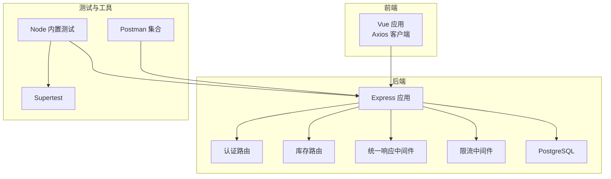
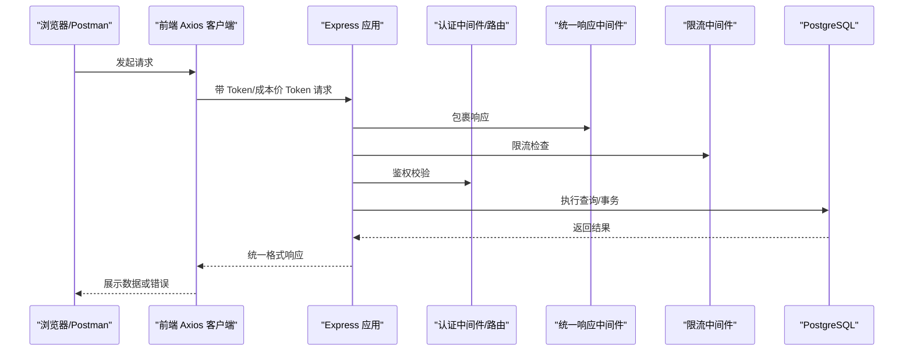
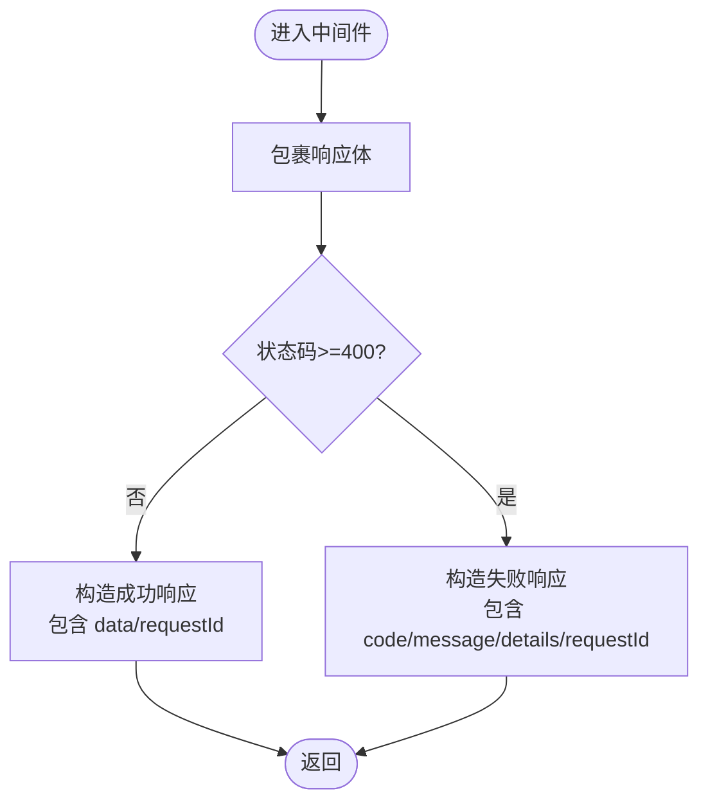
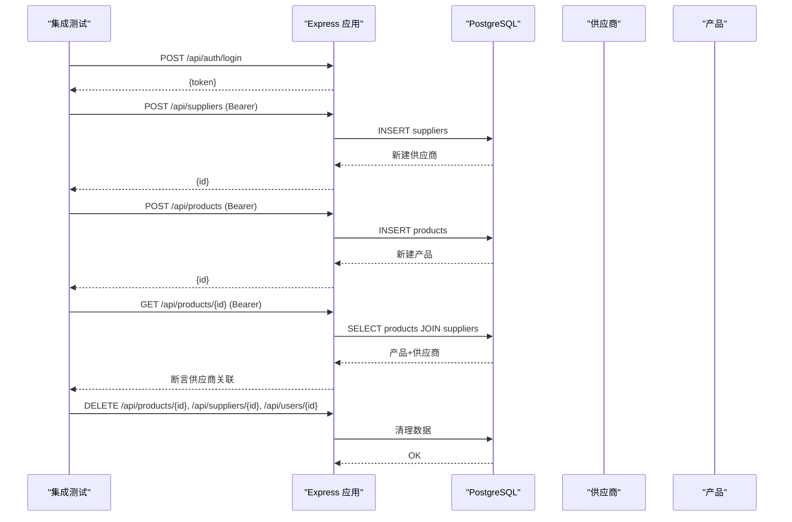
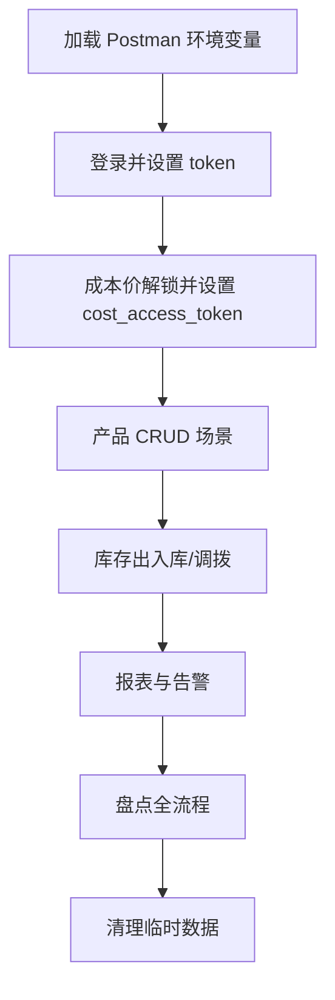
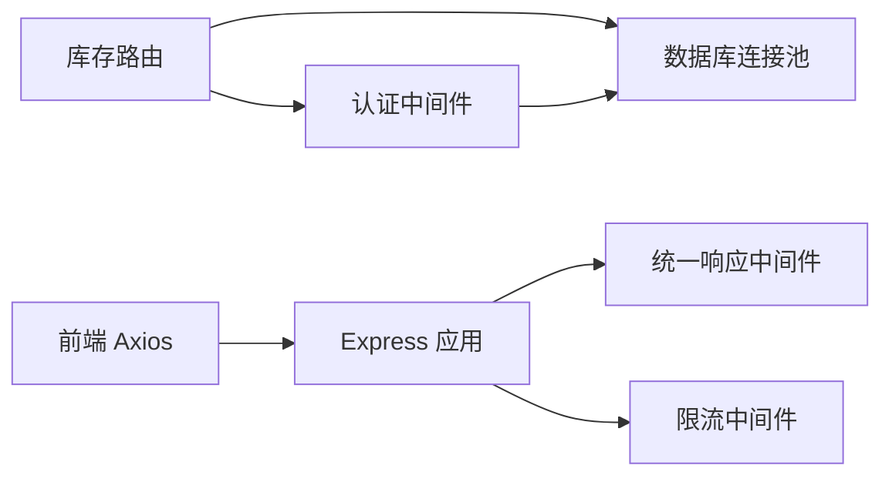

# 测试策略

<cite>
**本文引用的文件**
- [server/package.json](file://server/package.json)
- [web/package.json](file://web/package.json)
- [server/test/integration.test.js](file://server/test/integration.test.js)
- [server/test/middleware.test.js](file://server/test/middleware.test.js)
- [postman/inventory_system_backend.postman_collection.json](file://postman/inventory_system_backend.postman_collection.json)
- [postman/inventory_system_local.postman_environment.json](file://postman/inventory_system_local.postman_environment.json)
- [server/src/app.js](file://server/src/app.js)
- [server/src/server.js](file://server/src/server.js)
- [server/src/config/db.js](file://server/src/config/db.js)
- [server/src/routes/inventoryRoutes.js](file://server/src/routes/inventoryRoutes.js)
- [server/src/routes/authRoutes.js](file://server/src/routes/authRoutes.js)
- [server/src/middleware/response.js](file://server/src/middleware/response.js)
- [server/src/middleware/rateLimit.js](file://server/src/middleware/rateLimit.js)
- [web/src/services/api.js](file://web/src/services/api.js)
- [docker-compose.yml](file://docker-compose.yml)
- [server/database/schema.sql](file://server/database/schema.sql)
- [server/database/seed.sql](file://server/database/seed.sql)
</cite>

## 目录
1. [引言](#引言)
2. [项目结构](#项目结构)
3. [核心组件](#核心组件)
4. [架构总览](#架构总览)
5. [详细组件分析](#详细组件分析)
6. [依赖分析](#依赖分析)
7. [性能考虑](#性能考虑)
8. [故障排查指南](#故障排查指南)
9. [结论](#结论)
10. [附录](#附录)

## 引言
本测试策略文档面向库存管理系统，覆盖后端服务与前端应用的测试方法与质量保证流程。内容包括单元测试策略（后端中间件与工具）、集成测试设计（API 与数据库）、端到端测试配置与自动化、测试数据管理与环境隔离、测试覆盖率与质量门禁、CI/CD 中的测试流程、最佳实践与调试技巧、测试用例编写指南以及性能与压力测试实施策略。

## 项目结构
系统由三部分组成：
- 后端服务（Node.js + Express + PostgreSQL）：提供 REST API、认证鉴权、审计日志、限流等能力，并通过统一响应包装与错误兜底。
- 前端应用（Vue 3 + Vite）：通过 Axios 封装的 API 客户端访问后端，自动注入认证与成本价访问令牌。
- Postman 集合：提供后端 API 的手工与自动化测试集合，包含健康检查、认证、产品、库存、报表、告警、盘点等场景。
- 测试套件：Node 内置测试框架 + supertest 进行后端集成与中间件测试；前端无内置测试脚本，建议引入 Vitest/Jest 等进行单元测试。
- 数据库：PostgreSQL，使用 docker-compose 提供本地开发与测试环境，初始化 schema 与 seed 数据。

图表来源
- [server/src/app.js:1-65](file://server/src/app.js#L1-L65)
- [server/src/server.js:1-28](file://server/src/server.js#L1-L28)
- [server/src/config/db.js:1-25](file://server/src/config/db.js#L1-L25)
- [web/src/services/api.js:1-45](file://web/src/services/api.js#L1-L45)
- [postman/inventory_system_backend.postman_collection.json:1-585](file://postman/inventory_system_backend.postman_collection.json#L1-L585)
- [server/test/integration.test.js:1-162](file://server/test/integration.test.js#L1-L162)
- [server/test/middleware.test.js:1-52](file://server/test/middleware.test.js#L1-L52)

章节来源
- [server/src/app.js:1-65](file://server/src/app.js#L1-L65)
- [server/src/server.js:1-28](file://server/src/server.js#L1-L28)
- [server/src/config/db.js:1-25](file://server/src/config/db.js#L1-L25)
- [web/src/services/api.js:1-45](file://web/src/services/api.js#L1-L45)
- [postman/inventory_system_backend.postman_collection.json:1-585](file://postman/inventory_system_backend.postman_collection.json#L1-L585)
- [server/test/integration.test.js:1-162](file://server/test/integration.test.js#L1-L162)
- [server/test/middleware.test.js:1-52](file://server/test/middleware.test.js#L1-L52)

## 核心组件
- 统一响应中间件：对所有响应进行包裹，确保成功与失败路径的一致性，附带请求 ID 便于追踪。
- 限流中间件：基于客户端 IP 与命名空间的滑动窗口计数，超过阈值返回 429 并提示重试时间。
- 认证路由：登录接口支持速率限制，返回 JWT 与用户信息；刷新接口用于恢复登录态。
- 库存路由：提供库存总览、交易流水、入库/出库/调拨等操作，内部使用事务保障一致性。
- 数据库连接池：根据连接字符串与环境变量决定是否启用 SSL、超时时间等参数。
- Axios 客户端：自动注入 Authorization 与成本价访问令牌，统一封装响应与错误处理。
- Postman 集合：覆盖健康检查、认证、产品、库存、报表、告警、盘点等常用场景，支持环境变量与预/测试脚本。

章节来源
- [server/src/middleware/response.js:1-62](file://server/src/middleware/response.js#L1-L62)
- [server/src/middleware/rateLimit.js:1-40](file://server/src/middleware/rateLimit.js#L1-L40)
- [server/src/routes/authRoutes.js:1-72](file://server/src/routes/authRoutes.js#L1-L72)
- [server/src/routes/inventoryRoutes.js:1-493](file://server/src/routes/inventoryRoutes.js#L1-L493)
- [server/src/config/db.js:1-25](file://server/src/config/db.js#L1-L25)
- [web/src/services/api.js:1-45](file://web/src/services/api.js#L1-L45)
- [postman/inventory_system_backend.postman_collection.json:1-585](file://postman/inventory_system_backend.postman_collection.json#L1-L585)

## 架构总览
下图展示从浏览器到后端 API，再到数据库的典型请求链路，以及测试在各层的切入位置。

图表来源
- [web/src/services/api.js:1-45](file://web/src/services/api.js#L1-L45)
- [server/src/app.js:1-65](file://server/src/app.js#L1-L65)
- [server/src/middleware/response.js:1-62](file://server/src/middleware/response.js#L1-L62)
- [server/src/middleware/rateLimit.js:1-40](file://server/src/middleware/rateLimit.js#L1-L40)
- [server/src/routes/authRoutes.js:1-72](file://server/src/routes/authRoutes.js#L1-L72)
- [server/src/config/db.js:1-25](file://server/src/config/db.js#L1-L25)

## 详细组件分析

### 单元测试策略（后端中间件与工具）
- 统一响应中间件测试要点
  - 成功路径：响应体包含 success=true、data 字段与 x-request-id 头。
  - 失败路径：响应体包含 success=false、code、message、details 与 requestId。
  - 请求 ID 注入与透传。
- 限流中间件测试要点
  - 在阈值内连续请求应放行。
  - 超过阈值应返回 429，设置 retry-after 头或字段。
  - 不同命名空间独立计数。
- 推荐断言点
  - 状态码、响应体字段存在性与类型。
  - 请求头 x-request-id 与响应头一致性。
  - 429 场景下的 retry-after 与错误码。

图表来源
- [server/test/middleware.test.js:1-52](file://server/test/middleware.test.js#L1-L52)
- [server/src/middleware/response.js:1-62](file://server/src/middleware/response.js#L1-L62)

章节来源
- [server/test/middleware.test.js:1-52](file://server/test/middleware.test.js#L1-L52)
- [server/src/middleware/response.js:1-62](file://server/src/middleware/response.js#L1-L62)
- [server/src/middleware/rateLimit.js:1-40](file://server/src/middleware/rateLimit.js#L1-L40)

### 集成测试策略（API 与数据库）
- 测试目标
  - 验证供应商 CRUD 与产品供应商绑定关系。
  - 验证成本价解锁、更新、历史记录与通知生成。
  - 验证库存总览、交易流水、入库/出库/调拨、分配/释放等核心流程。
- 测试环境
  - 使用数据库连接池，支持通过环境变量控制是否运行数据库相关测试。
  - 使用 supertest 发送 HTTP 请求，断言状态码与响应体结构。
- 数据清理
  - 测试结束后删除临时创建的用户、供应商、产品及通知，确保测试隔离。
- 关键流程断言
  - 登录成功返回 token，后续请求需携带 Authorization。
  - 成本价访问解锁后，请求需携带 x-cost-access-token。
  - 库存变动后，交易流水与可用库存计算正确。

图表来源
- [server/test/integration.test.js:1-162](file://server/test/integration.test.js#L1-L162)
- [server/src/routes/inventoryRoutes.js:1-493](file://server/src/routes/inventoryRoutes.js#L1-L493)
- [server/src/routes/authRoutes.js:1-72](file://server/src/routes/authRoutes.js#L1-L72)
- [server/src/config/db.js:1-25](file://server/src/config/db.js#L1-L25)

章节来源
- [server/test/integration.test.js:1-162](file://server/test/integration.test.js#L1-L162)
- [server/src/routes/inventoryRoutes.js:1-493](file://server/src/routes/inventoryRoutes.js#L1-L493)
- [server/src/routes/authRoutes.js:1-72](file://server/src/routes/authRoutes.js#L1-L72)
- [server/src/config/db.js:1-25](file://server/src/config/db.js#L1-L25)

### 端到端测试（Postman）
- Postman 集成
  - 支持环境变量 base_url、token、cost_access_token、user_role、product_id、warehouse_id、stock_count_id。
  - 预请求脚本注入时间戳变量，测试脚本自动提取 token 与资源 ID。
- 典型场景
  - 健康检查、登录、获取当前用户、成本价解锁、产品增删改查、库存出入库/调拨、报表、告警、审计日志、盘点全流程。
- 自动化执行
  - 可在 CI 中使用 newman 或 Postman 新版 CLI 执行集合，结合环境文件与全局变量。
- 建议
  - 将敏感变量放入环境文件，避免硬编码。
  - 对关键步骤增加断言与提取，确保链路完整性。

图表来源
- [postman/inventory_system_backend.postman_collection.json:1-585](file://postman/inventory_system_backend.postman_collection.json#L1-L585)
- [postman/inventory_system_local.postman_environment.json:1-18](file://postman/inventory_system_local.postman_environment.json#L1-L18)

章节来源
- [postman/inventory_system_backend.postman_collection.json:1-585](file://postman/inventory_system_backend.postman_collection.json#L1-L585)
- [postman/inventory_system_local.postman_environment.json:1-18](file://postman/inventory_system_local.postman_environment.json#L1-L18)

### 测试数据管理与环境隔离
- 数据库初始化
  - docker-compose 启动时挂载 schema.sql 与 seed.sql，确保测试环境具备一致的初始状态。
- 测试数据隔离
  - 集成测试使用随机后缀生成唯一邮箱与 SKU，测试结束删除对应记录。
  - Postman 场景通过环境变量与测试脚本动态注入与提取 ID，避免相互污染。
- 环境变量
  - RUN_DB_TESTS 控制是否执行数据库相关测试。
  - STARTUP_DB_TIMEOUT_MS 控制启动阶段数据库连接超时。
  - DATABASE_URL、JWT_SECRET、PGSSLMODE 等影响连接与安全行为。

章节来源
- [docker-compose.yml:1-57](file://docker-compose.yml#L1-L57)
- [server/database/schema.sql](file://server/database/schema.sql)
- [server/database/seed.sql](file://server/database/seed.sql)
- [server/test/integration.test.js:1-162](file://server/test/integration.test.js#L1-L162)
- [server/src/server.js:1-28](file://server/src/server.js#L1-L28)
- [server/src/config/db.js:1-25](file://server/src/config/db.js#L1-L25)

### 覆盖率要求与质量门禁
- 覆盖率建议
  - 关键业务路由（如库存、认证）达到 80%+ 行覆盖率。
  - 中间件（响应、限流、审计）达到 90%+。
  - 工具函数（库存服务、分页、成本访问）达到 80%+。
- 质量门禁
  - 未达覆盖率阈值禁止合并。
  - 集成测试与 Postman 场景必须通过。
  - 429 限流与错误兜底路径必须有单测覆盖。

[本节为通用指导，无需列出具体文件来源]

### CI/CD 中的测试流程
- 建议流水线步骤
  - 安装依赖：后端与前端分别安装。
  - 启动数据库容器（docker-compose）。
  - 初始化数据库（schema/seed）。
  - 运行 Node 内置测试（含数据库开关）。
  - 运行 Postman 集合（newman 或新版 CLI）。
  - 前端单元测试（建议引入 Vitest/Jest）。
  - 生成覆盖率报告并上传。
- 触发条件
  - Pull Request 与主分支推送触发。
  - 仅在通过测试后允许构建镜像与部署。

[本节为通用指导，无需列出具体文件来源]

### 测试最佳实践与调试技巧
- 最佳实践
  - 以场景驱动编写测试，优先覆盖高风险路径（库存不足、事务回滚、鉴权失败）。
  - 使用环境变量与配置文件分离不同环境，避免硬编码。
  - 对外部依赖（数据库、第三方 API）使用最小化模拟或真实容器。
  - 统一日志与追踪 ID，便于定位问题。
- 调试技巧
  - 启用 Morgan 日志，观察请求/响应。
  - 使用 x-request-id 关联前后端日志。
  - 在 Postman 中逐步执行，利用测试脚本输出变量值。
  - 针对限流问题，检查命名空间与 IP 归属。

[本节为通用指导，无需列出具体文件来源]

### 测试用例编写指南与数据准备
- 编写指南
  - 明确前置条件（登录、成本价解锁、创建资源）。
  - 设计正向与反向用例（缺少参数、权限不足、库存不足、限流）。
  - 断言响应结构、状态码、业务规则一致性。
- 数据准备
  - 使用随机化字段（邮箱、SKU、时间戳）避免冲突。
  - 通过环境变量与测试脚本自动注入 ID。
  - 清理阶段确保幂等删除。

[本节为通用指导，无需列出具体文件来源]

### 性能测试与压力测试
- 性能测试策略
  - 使用压测工具（如 k6、Artillery）对高频接口（登录、产品列表、库存总览）施压。
  - 关注 P95/P99 延迟、吞吐量与错误率。
  - 结合限流中间件验证 429 场景下的稳定性。
- 压力测试
  - 逐步提升并发与请求数，观察数据库连接池与事务锁竞争。
  - 监控数据库慢查询与连接数峰值。
  - 针对库存变更接口（入库/出库/调拨）重点压测。

[本节为通用指导，无需列出具体文件来源]

## 依赖分析
- 组件耦合
  - 路由依赖认证中间件与数据库连接池。
  - 统一响应中间件被所有路由共享，保证一致性。
  - 限流中间件按命名空间独立计数，降低耦合。
- 外部依赖
  - PostgreSQL 连接池与 SSL 配置受环境变量影响。
  - 前端 Axios 客户端依赖后端 API 约定的响应结构。
- 循环依赖
  - 当前结构清晰，未发现循环依赖迹象。

图表来源
- [server/src/routes/inventoryRoutes.js:1-493](file://server/src/routes/inventoryRoutes.js#L1-L493)
- [server/src/routes/authRoutes.js:1-72](file://server/src/routes/authRoutes.js#L1-L72)
- [server/src/app.js:1-65](file://server/src/app.js#L1-L65)
- [server/src/middleware/response.js:1-62](file://server/src/middleware/response.js#L1-L62)
- [server/src/middleware/rateLimit.js:1-40](file://server/src/middleware/rateLimit.js#L1-L40)
- [server/src/config/db.js:1-25](file://server/src/config/db.js#L1-L25)
- [web/src/services/api.js:1-45](file://web/src/services/api.js#L1-L45)

章节来源
- [server/src/routes/inventoryRoutes.js:1-493](file://server/src/routes/inventoryRoutes.js#L1-L493)
- [server/src/routes/authRoutes.js:1-72](file://server/src/routes/authRoutes.js#L1-L72)
- [server/src/app.js:1-65](file://server/src/app.js#L1-L65)
- [server/src/middleware/response.js:1-62](file://server/src/middleware/response.js#L1-L62)
- [server/src/middleware/rateLimit.js:1-40](file://server/src/middleware/rateLimit.js#L1-L40)
- [server/src/config/db.js:1-25](file://server/src/config/db.js#L1-L25)
- [web/src/services/api.js:1-45](file://web/src/services/api.js#L1-L45)

## 性能考虑
- 分页与检索
  - 库存与交易接口支持分页与多字段模糊检索，避免一次性返回大量数据。
- 事务与锁
  - 库存出入库与调拨使用事务，减少不一致风险；注意并发场景下的锁竞争。
- 限流与超时
  - 登录接口与全局限流中间件配合，防止恶意刷取；数据库连接超时可配置。
- 前端优化
  - Axios 统一拦截器减少重复逻辑，避免重复请求头拼接。

[本节为通用指导，无需列出具体文件来源]

## 故障排查指南
- 启动失败（数据库连接超时）
  - 检查 docker-compose 是否健康，确认 schema/seed 是否正确挂载。
  - 查看启动日志与超时配置。
- 认证失败
  - 确认登录请求体字段完整，检查 JWT_SECRET 是否正确。
  - 确保前端已正确注入 Authorization 与成本价 Token。
- 429 限流
  - 检查命名空间与客户端 IP，确认桶状态与过期时间。
- 响应格式异常
  - 确认统一响应中间件已注册，检查自定义 res.success/res.fail 是否被误用。

章节来源
- [server/src/server.js:1-28](file://server/src/server.js#L1-L28)
- [docker-compose.yml:1-57](file://docker-compose.yml#L1-L57)
- [server/src/middleware/rateLimit.js:1-40](file://server/src/middleware/rateLimit.js#L1-L40)
- [server/src/middleware/response.js:1-62](file://server/src/middleware/response.js#L1-L62)
- [web/src/services/api.js:1-45](file://web/src/services/api.js#L1-L45)

## 结论
本测试策略围绕“单元测试（中间件与工具）+ 集成测试（API 与数据库）+ 端到端测试（Postman）”三位一体展开，辅以测试数据管理、环境隔离、覆盖率与质量门禁、CI/CD 流程、最佳实践与性能压力测试建议。通过统一响应与限流中间件、严格的鉴权与事务保障，以及 Postman 场景化的端到端验证，能够有效提升系统质量与交付效率。

## 附录
- 前端测试建议
  - 引入 Vitest/Jest，针对 Vue 组件与组合式函数进行单元测试。
  - 使用 @testing-library/vue 进行 DOM 交互测试。
- 后端测试建议
  - 为工具函数（库存服务、分页、成本访问）补充单测。
  - 使用 supertest 对路由进行更细粒度的断言。
- 文档与脚本
  - 保持 Postman 集合与环境文件同步更新。
  - 在 CI 中统一执行 Node 测试与 Postman 集合。

[本节为通用指导，无需列出具体文件来源]