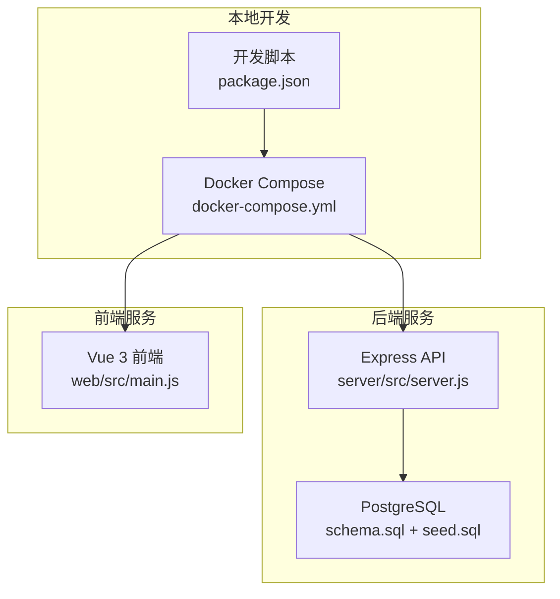
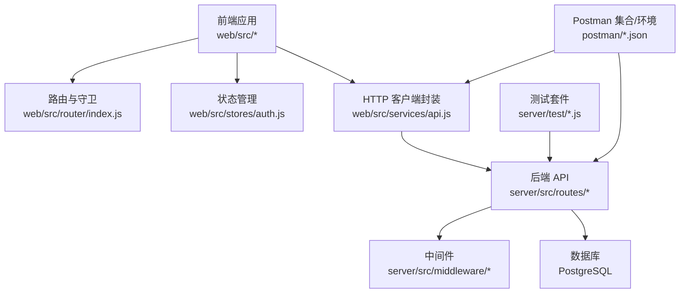
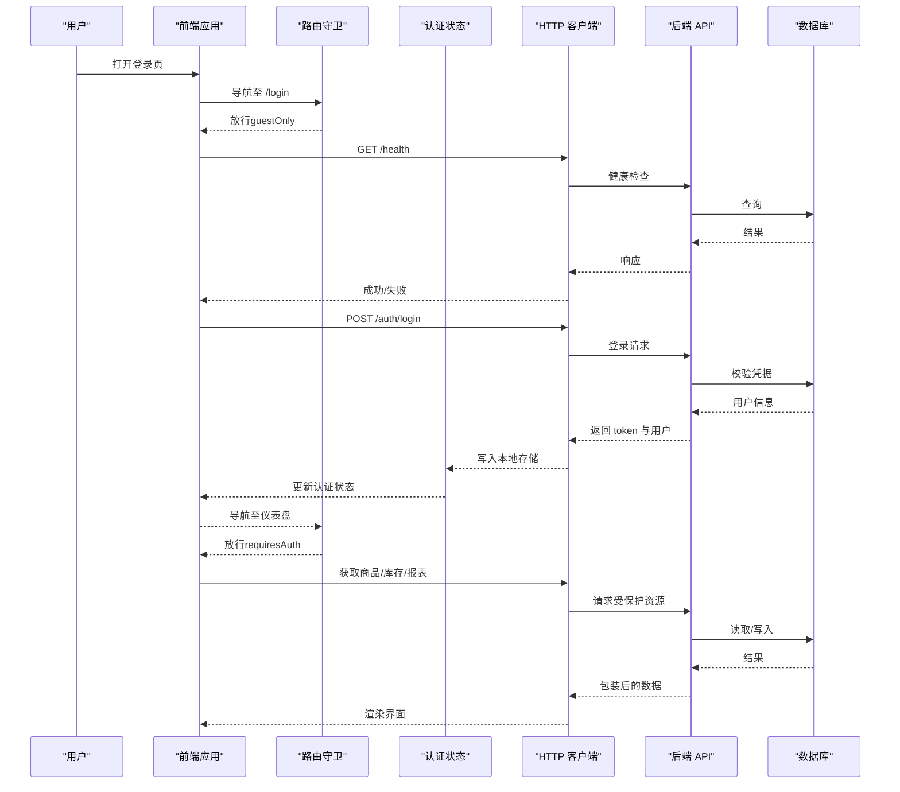
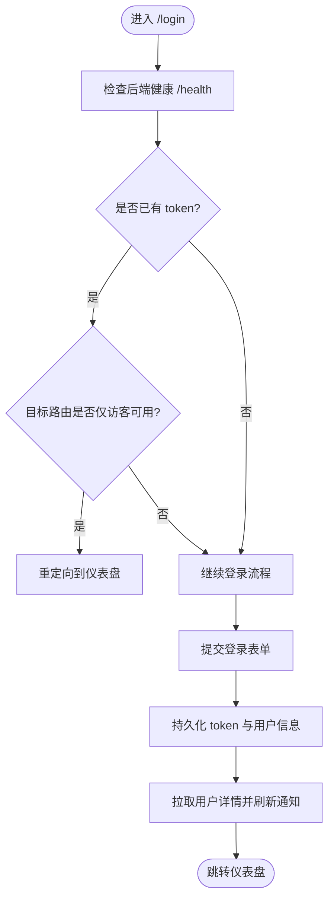
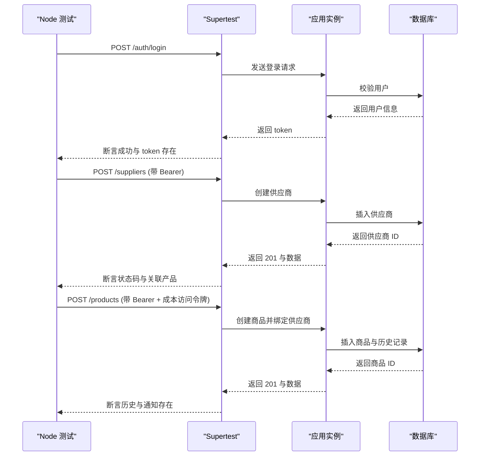
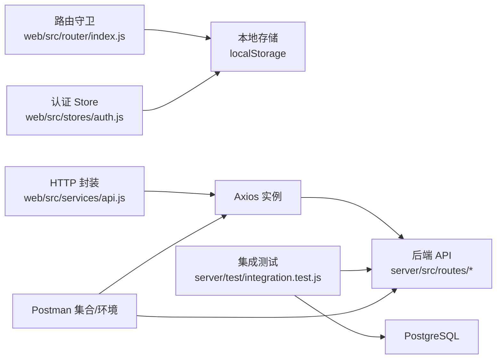

# 端到端测试

<cite>
**本文引用的文件**
- [README.md](file://README.md)
- [package.json](file://package.json)
- [docker-compose.yml](file://docker-compose.yml)
- [server/package.json](file://server/package.json)
- [web/package.json](file://web/package.json)
- [server/test/integration.test.js](file://server/test/integration.test.js)
- [server/test/middleware.test.js](file://server/test/middleware.test.js)
- [postman/inventory_system_backend.postman_collection.json](file://postman/inventory_system_backend.postman_collection.json)
- [postman/inventory_system_local.postman_environment.json](file://postman/inventory_system_local.postman_environment.json)
- [web/src/router/index.js](file://web/src/router/index.js)
- [web/src/services/api.js](file://web/src/services/api.js)
- [web/src/stores/auth.js](file://web/src/stores/auth.js)
- [web/src/pages/LoginPage.vue](file://web/src/pages/LoginPage.vue)
- [web/src/pages/DashboardPage.vue](file://web/src/pages/DashboardPage.vue)
</cite>

## 目录
1. [简介](#简介)
2. [项目结构](#项目结构)
3. [核心组件](#核心组件)
4. [架构总览](#架构总览)
5. [详细组件分析](#详细组件分析)
6. [依赖关系分析](#依赖关系分析)
7. [性能考量](#性能考量)
8. [故障排查指南](#故障排查指南)
9. [结论](#结论)
10. [附录](#附录)

## 简介
本文件面向库存管理系统，系统采用前后端分离架构：前端为基于 Vue 3 的仪表盘应用，后端为基于 Node.js + Express 的 API 服务，数据库为 PostgreSQL。本文档聚焦于端到端测试策略与自动化流程，覆盖以下方面：
- 用户工作流测试：登录、商品管理、库存操作、报表生成等完整流程
- 前端应用端到端测试：Vue 组件、路由导航、状态管理
- API 端到端测试：请求-响应链路验证与数据流转
- 跨浏览器与移动端适配测试建议
- 测试环境搭建与测试数据管理策略
- 自动化测试脚本编写与 CI/CD 集成方法
- 测试报告生成与结果分析工具使用

## 项目结构
项目采用多包结构，包含后端 API 与前端 Web 应用，二者通过 Docker Compose 编排运行，数据库初始化由 schema.sql 与 seed.sql 完成。

图示来源
- [package.json:1-20](file://package.json#L1-L20)
- [docker-compose.yml:1-57](file://docker-compose.yml#L1-L57)

章节来源
- [README.md:22-54](file://README.md#L22-L54)
- [package.json:6-12](file://package.json#L6-L12)
- [docker-compose.yml:1-57](file://docker-compose.yml#L1-L57)

## 核心组件
- 后端测试框架：Node.js 原生测试 + supertest，覆盖中间件与集成场景
- 前端测试基础：Vue Router、Pinia 状态管理、Axios 封装
- API 文档与环境：Postman 集合与环境变量，便于手工与自动化测试
- 运行编排：Docker Compose 提供一致的测试环境

章节来源
- [server/package.json:9](file://server/package.json#L9)
- [web/package.json:6-11](file://web/package.json#L6-L11)
- [postman/inventory_system_backend.postman_collection.json:1-585](file://postman/inventory_system_backend.postman_collection.json#L1-L585)
- [postman/inventory_system_local.postman_environment.json:1-18](file://postman/inventory_system_local.postman_environment.json#L1-L18)

## 架构总览
端到端测试贯穿三层：前端 UI 层、API 层、数据库层。测试策略以 Postman 集合驱动 API 行为，结合 Node.js 原生测试与前端路由/状态管理进行端到端验证。

图示来源
- [web/src/router/index.js:175-202](file://web/src/router/index.js#L175-L202)
- [web/src/stores/auth.js:19-90](file://web/src/stores/auth.js#L19-L90)
- [web/src/services/api.js:1-45](file://web/src/services/api.js#L1-L45)
- [server/test/integration.test.js:1-162](file://server/test/integration.test.js#L1-L162)
- [postman/inventory_system_backend.postman_collection.json:1-585](file://postman/inventory_system_backend.postman_collection.json#L1-L585)

## 详细组件分析

### 用户工作流测试（登录 → 商品管理 → 库存操作 → 报表）
该流程覆盖认证、成本解锁、商品增删改查、库存出入库/调拨、低库存告警、盘点与报表导出等关键路径。

图示来源
- [web/src/pages/LoginPage.vue:29-52](file://web/src/pages/LoginPage.vue#L29-L52)
- [web/src/stores/auth.js:44-58](file://web/src/stores/auth.js#L44-L58)
- [web/src/router/index.js:181-199](file://web/src/router/index.js#L181-L199)
- [web/src/services/api.js:8-24](file://web/src/services/api.js#L8-L24)
- [postman/inventory_system_backend.postman_collection.json:32-77](file://postman/inventory_system_backend.postman_collection.json#L32-L77)

章节来源
- [web/src/pages/LoginPage.vue:1-136](file://web/src/pages/LoginPage.vue#L1-L136)
- [web/src/stores/auth.js:19-90](file://web/src/stores/auth.js#L19-L90)
- [web/src/router/index.js:175-202](file://web/src/router/index.js#L175-L202)
- [postman/inventory_system_backend.postman_collection.json:1-585](file://postman/inventory_system_backend.postman_collection.json#L1-L585)

### 前端应用端到端测试（Vue 组件、路由、状态）
- 路由与守卫：基于 meta 字段控制登录态与角色权限；支持 guestOnly 与 requiresAuth
- 状态管理：Pinia Store 统一管理 token、用户信息、加载状态；持久化到 localStorage
- HTTP 封装：Axios 拦截器自动注入 Authorization 与成本访问令牌，统一封装响应结构
- 登录页：内置健康检查提示与默认测试账户，便于快速验证

图示来源
- [web/src/router/index.js:181-199](file://web/src/router/index.js#L181-L199)
- [web/src/stores/auth.js:28-41](file://web/src/stores/auth.js#L28-L41)
- [web/src/services/api.js:26-42](file://web/src/services/api.js#L26-L42)
- [web/src/pages/LoginPage.vue:41-50](file://web/src/pages/LoginPage.vue#L41-L50)

章节来源
- [web/src/router/index.js:1-202](file://web/src/router/index.js#L1-L202)
- [web/src/stores/auth.js:1-90](file://web/src/stores/auth.js#L1-L90)
- [web/src/services/api.js:1-45](file://web/src/services/api.js#L1-L45)
- [web/src/pages/LoginPage.vue:1-136](file://web/src/pages/LoginPage.vue#L1-L136)

### API 端到端测试（请求-响应链路与数据流转）
- Node.js 原生测试：使用 supertest 发送 HTTP 请求，断言响应码与业务字段
- 集成测试：创建管理员用户、登录获取 token、执行供应商与商品 CRUD、成本价格历史与通知
- 中间件测试：响应包装与速率限制中间件行为验证
- Postman 集成：集合中预置登录、成本解锁、商品/库存/报表等接口，配合环境变量完成链路测试

图示来源
- [server/test/integration.test.js:30-87](file://server/test/integration.test.js#L30-L87)
- [server/test/integration.test.js:89-160](file://server/test/integration.test.js#L89-L160)
- [server/test/middleware.test.js:9-51](file://server/test/middleware.test.js#L9-L51)
- [postman/inventory_system_backend.postman_collection.json:32-77](file://postman/inventory_system_backend.postman_collection.json#L32-L77)

章节来源
- [server/test/integration.test.js:1-162](file://server/test/integration.test.js#L1-L162)
- [server/test/middleware.test.js:1-52](file://server/test/middleware.test.js#L1-L52)
- [postman/inventory_system_backend.postman_collection.json:1-585](file://postman/inventory_system_backend.postman_collection.json#L1-L585)

### 跨浏览器与移动端适配测试
- 跨浏览器：建议在主流浏览器（Chrome、Firefox、Safari）与 Edge 上验证路由守卫、状态持久化与 API 交互
- 移动端：验证登录页输入框、图表容器、导航栏在小屏设备上的布局与交互
- 建议工具：使用 Playwright 或 Cypress 进行端到端 UI 测试，配置多浏览器矩阵与设备模拟

[本节为通用实践建议，不直接分析具体文件]

### 测试环境搭建与测试数据管理
- 使用 Docker Compose 启动数据库、API 与前端，确保环境一致性
- 初始化数据库：schema.sql 与 seed.sql 在容器启动时自动执行
- 测试数据：后端集成测试通过随机后缀生成唯一标识，测试结束后清理
- Postman 环境变量：token、成本访问令牌、用户角色、产品 ID、仓库 ID、盘点 ID 等

章节来源
- [docker-compose.yml:14-15](file://docker-compose.yml#L14-L15)
- [server/test/integration.test.js:11-28](file://server/test/integration.test.js#L11-L28)
- [postman/inventory_system_local.postman_environment.json:1-18](file://postman/inventory_system_local.postman_environment.json#L1-L18)

### 自动化测试脚本编写与 CI/CD 集成
- 后端测试：在 server 目录下执行原生测试，可设置环境变量控制数据库测试开关
- 前端测试：建议引入 Vitest + @vue/test-utils 进行组件与状态管理单元测试；Cypress/Playwright 进行端到端 UI 测试
- CI/CD：在流水线中顺序执行以下步骤
  - 拉取代码与依赖安装
  - 启动 Docker Compose
  - 执行数据库初始化
  - 运行后端 Node 测试
  - 运行前端单元测试与端到端测试
  - 生成测试报告并上传 Artifacts

章节来源
- [server/package.json:9](file://server/package.json#L9)
- [package.json:6-12](file://package.json#L6-L12)
- [docker-compose.yml:1-57](file://docker-compose.yml#L1-L57)

### 测试报告生成与结果分析
- 后端：Node.js 原生测试输出简洁，建议结合 GitHub Actions/JUnit 报告或第三方报告工具
- 前端：Vitest/Cypress 可生成 HTML/XML 报告，结合覆盖率工具（如 c8/vitest-coverage）输出覆盖率
- API：Postman 可导出测试集合与环境，结合 Newman 执行并生成报告

[本节为通用实践建议，不直接分析具体文件]

## 依赖关系分析
- 前端依赖后端 API：路由守卫依赖本地存储中的 token；HTTP 封装依赖全局 Axios 实例
- 后端依赖数据库：集成测试通过数据库查询与清理保证隔离性
- 测试依赖环境：Postman 集合与环境变量驱动端到端链路

图示来源
- [web/src/router/index.js:181-199](file://web/src/router/index.js#L181-L199)
- [web/src/stores/auth.js:28-41](file://web/src/stores/auth.js#L28-L41)
- [web/src/services/api.js:8-24](file://web/src/services/api.js#L8-L24)
- [server/test/integration.test.js:15-28](file://server/test/integration.test.js#L15-L28)
- [postman/inventory_system_backend.postman_collection.json:32-77](file://postman/inventory_system_backend.postman_collection.json#L32-L77)

章节来源
- [web/src/router/index.js:1-202](file://web/src/router/index.js#L1-L202)
- [web/src/stores/auth.js:1-90](file://web/src/stores/auth.js#L1-L90)
- [web/src/services/api.js:1-45](file://web/src/services/api.js#L1-L45)
- [server/test/integration.test.js:1-162](file://server/test/integration.test.js#L1-L162)
- [postman/inventory_system_backend.postman_collection.json:1-585](file://postman/inventory_system_backend.postman_collection.json#L1-L585)

## 性能考量
- 前端：路由懒加载与按需组件加载；图表渲染在需要时才注册；分页与搜索减少一次性数据量
- 后端：中间件统一响应包装与速率限制，避免过载
- 测试：集成测试使用最小必要数据集，测试完成后清理，避免数据库膨胀

[本节为通用指导，不直接分析具体文件]

## 故障排查指南
- 登录失败：检查后端健康检查是否可达；确认数据库初始化是否完成；核对测试账户与密码
- 权限错误：确认路由守卫中 requiresAuth 与角色校验逻辑；检查本地存储中的 token 与用户角色
- API 异常：查看中间件响应包装是否正确；核对 Postman 环境变量中的 token 与成本访问令牌
- 数据不一致：集成测试结束时清理插入的数据，避免影响后续测试

章节来源
- [README.md:66-71](file://README.md#L66-L71)
- [web/src/pages/LoginPage.vue:29-52](file://web/src/pages/LoginPage.vue#L29-L52)
- [web/src/router/index.js:181-199](file://web/src/router/index.js#L181-L199)
- [server/test/middleware.test.js:9-51](file://server/test/middleware.test.js#L9-L51)

## 结论
本项目具备良好的端到端测试基础：后端使用 Node.js 原生测试与 supertest，前端具备完善的路由、状态与 HTTP 封装，Postman 集合提供了可复用的 API 场景。建议在此基础上引入前端端到端测试工具（如 Cypress/Playwright），完善跨浏览器与移动端验证，并在 CI/CD 中自动化执行，形成闭环的质量保障体系。

## 附录
- 测试账户与登录指引见项目说明
- Docker Compose 提供一键启动的测试环境
- Postman 集合与环境变量用于手工与自动化测试

章节来源
- [README.md:55-64](file://README.md#L55-L64)
- [README.md:80-105](file://README.md#L80-L105)
- [postman/inventory_system_backend.postman_collection.json:1-585](file://postman/inventory_system_backend.postman_collection.json#L1-L585)
- [postman/inventory_system_local.postman_environment.json:1-18](file://postman/inventory_system_local.postman_environment.json#L1-L18)