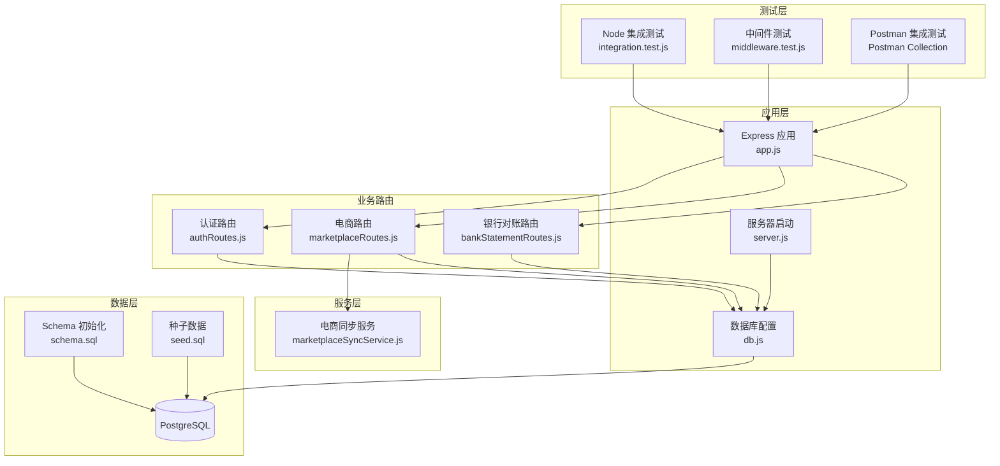
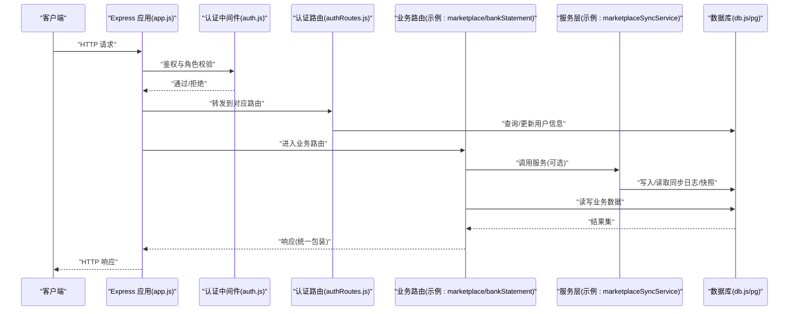
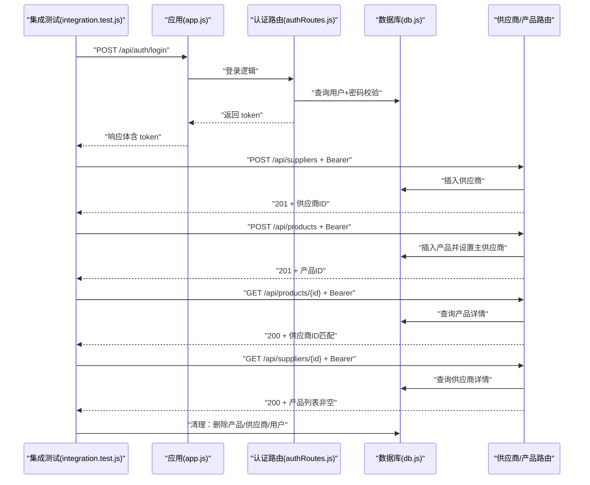
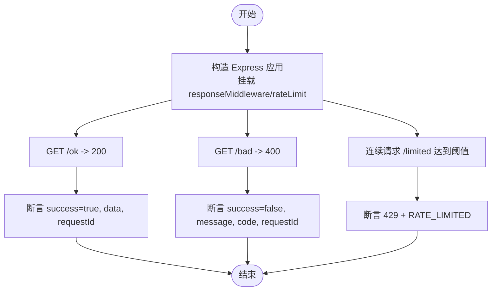
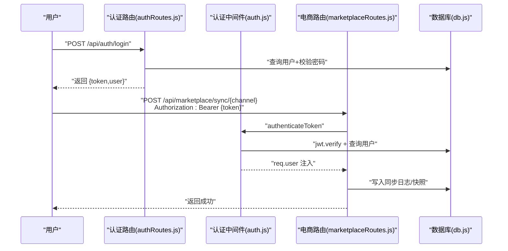
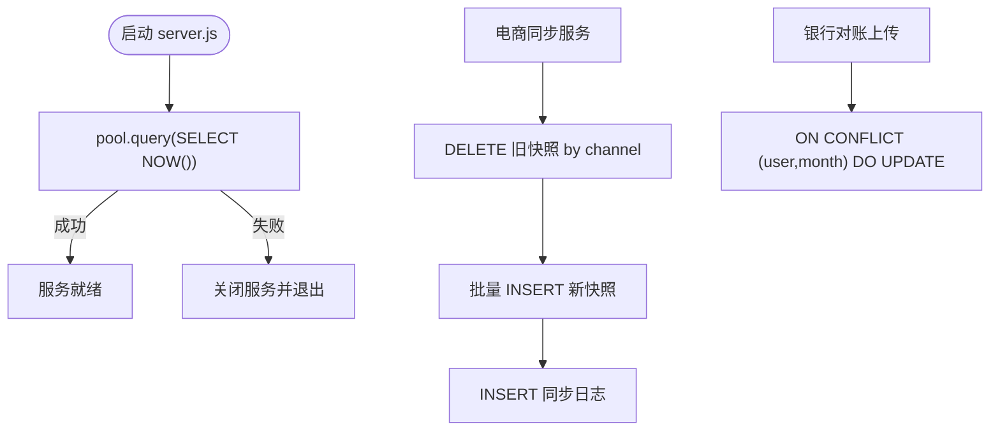
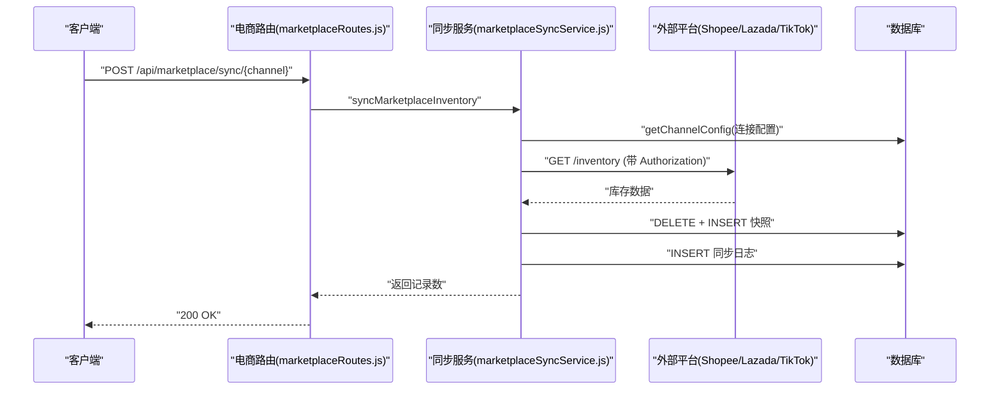
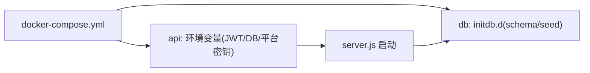
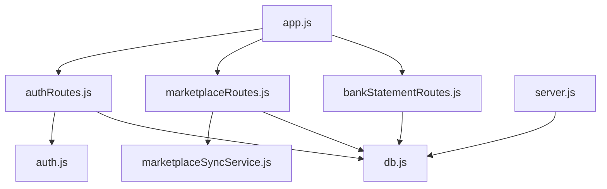

# 集成测试

<cite>
**本文引用的文件**   
- [server/test/integration.test.js](file://server/test/integration.test.js)
- [server/test/middleware.test.js](file://server/test/middleware.test.js)
- [server/src/app.js](file://server/src/app.js)
- [server/src/server.js](file://server/src/server.js)
- [server/src/config/db.js](file://server/src/config/db.js)
- [server/src/middleware/auth.js](file://server/src/middleware/auth.js)
- [server/src/routes/authRoutes.js](file://server/src/routes/authRoutes.js)
- [server/src/routes/marketplaceRoutes.js](file://server/src/routes/marketplaceRoutes.js)
- [server/src/services/marketplaceSyncService.js](file://server/src/services/marketplaceSyncService.js)
- [server/src/routes/bankStatementRoutes.js](file://server/src/routes/bankStatementRoutes.js)
- [server/database/schema.sql](file://server/database/schema.sql)
- [server/database/seed.sql](file://server/database/seed.sql)
- [postman/inventory_system_backend.postman_collection.json](file://postman/inventory_system_backend.postman_collection.json)
- [postman/inventory_system_local.postman_environment.json](file://postman/inventory_system_local.postman_environment.json)
- [docker-compose.yml](file://docker-compose.yml)
- [server/package.json](file://server/package.json)
</cite>

## 目录
1. [简介](#简介)
2. [项目结构](#项目结构)
3. [核心组件](#核心组件)
4. [架构总览](#架构总览)
5. [详细组件分析](#详细组件分析)
6. [依赖关系分析](#依赖关系分析)
7. [性能考虑](#性能考虑)
8. [故障排查指南](#故障排查指南)
9. [结论](#结论)
10. [附录](#附录)

## 简介
本文件面向库存管理系统，提供一套完整的集成测试设计与执行策略，覆盖以下方面：
- API 集成测试：HTTP 请求测试、响应验证、错误处理测试
- 数据库集成测试：事务处理、数据一致性、连接测试
- 用户认证与授权：JWT 令牌验证、权限控制测试
- 第三方服务集成测试：电商平台（Shopee/Lazada/TikTok）API 同步、银行对账单上传/下载/删除
- 测试环境配置与种子数据管理
- 测试数据隔离与清理策略
- 性能基准与负载测试实施建议

## 项目结构
后端采用 Express 应用，通过统一中间件栈提供 REST API；数据库使用 PostgreSQL，初始化脚本与种子数据在容器启动时自动执行；测试分为 Node 内置测试与 Postman 集成测试两部分。

**图表来源**
- [server/src/app.js:1-65](file://server/src/app.js#L1-L65)
- [server/src/server.js:1-28](file://server/src/server.js#L1-L28)
- [server/src/config/db.js:1-25](file://server/src/config/db.js#L1-L25)
- [server/src/routes/authRoutes.js:1-72](file://server/src/routes/authRoutes.js#L1-L72)
- [server/src/routes/marketplaceRoutes.js:1-641](file://server/src/routes/marketplaceRoutes.js#L1-L641)
- [server/src/services/marketplaceSyncService.js:1-146](file://server/src/services/marketplaceSyncService.js#L1-L146)
- [server/src/routes/bankStatementRoutes.js:1-255](file://server/src/routes/bankStatementRoutes.js#L1-L255)
- [server/database/schema.sql:1-420](file://server/database/schema.sql#L1-L420)
- [server/database/seed.sql:1-114](file://server/database/seed.sql#L1-L114)

**章节来源**
- [server/src/app.js:1-65](file://server/src/app.js#L1-L65)
- [server/src/server.js:1-28](file://server/src/server.js#L1-L28)
- [server/src/config/db.js:1-25](file://server/src/config/db.js#L1-L25)
- [server/database/schema.sql:1-420](file://server/database/schema.sql#L1-L420)
- [server/database/seed.sql:1-114](file://server/database/seed.sql#L1-L114)

## 核心组件
- 应用与启动
  - 应用入口集中注册中间件与路由，提供统一健康检查与兜底错误处理
  - 启动时进行数据库连接超时保护，失败则优雅关闭
- 认证与授权
  - 基于 JWT 的 Token 校验与角色授权中间件
  - 登录接口支持限流，返回审计上下文
- 数据库
  - 连接池配置，按环境决定 SSL 行为与连接超时
  - Schema 定义完整，包含库存、电商同步、对账单等核心表
  - 种子数据提供初始用户、仓库、商品与库存水平
- 第三方服务
  - 电商同步服务封装通道配置、记录归一化与快照落库
  - 银行对账单上传/下载/删除，含文件类型与大小限制
- 测试
  - Node 集成测试：供应商/产品 CRUD、成本价历史与通知、中间件与限流
  - Postman 集成测试：全量 API 场景编排与变量传递

**章节来源**
- [server/src/app.js:1-65](file://server/src/app.js#L1-L65)
- [server/src/server.js:1-28](file://server/src/server.js#L1-L28)
- [server/src/middleware/auth.js:1-46](file://server/src/middleware/auth.js#L1-L46)
- [server/src/routes/authRoutes.js:1-72](file://server/src/routes/authRoutes.js#L1-L72)
- [server/src/config/db.js:1-25](file://server/src/config/db.js#L1-L25)
- [server/database/schema.sql:1-420](file://server/database/schema.sql#L1-L420)
- [server/database/seed.sql:1-114](file://server/database/seed.sql#L1-L114)
- [server/test/integration.test.js:1-162](file://server/test/integration.test.js#L1-L162)
- [server/test/middleware.test.js:1-52](file://server/test/middleware.test.js#L1-L52)
- [postman/inventory_system_backend.postman_collection.json:1-585](file://postman/inventory_system_backend.postman_collection.json#L1-L585)

## 架构总览
下图展示从客户端到数据库的典型调用链路，以及关键断言点（认证、授权、响应包装、限流、数据库一致性）。

**图表来源**
- [server/src/app.js:1-65](file://server/src/app.js#L1-L65)
- [server/src/middleware/auth.js:1-46](file://server/src/middleware/auth.js#L1-L46)
- [server/src/routes/authRoutes.js:1-72](file://server/src/routes/authRoutes.js#L1-L72)
- [server/src/routes/marketplaceRoutes.js:1-641](file://server/src/routes/marketplaceRoutes.js#L1-L641)
- [server/src/services/marketplaceSyncService.js:1-146](file://server/src/services/marketplaceSyncService.js#L1-L146)
- [server/src/routes/bankStatementRoutes.js:1-255](file://server/src/routes/bankStatementRoutes.js#L1-L255)
- [server/src/config/db.js:1-25](file://server/src/config/db.js#L1-L25)

## 详细组件分析

### API 集成测试设计与执行策略
- 供应商与产品 CRUD 及关联验证
  - 自动创建管理员用户并登录获取 Token
  - 创建供应商与产品，断言返回状态码与关键字段
  - 查询产品详情与供应商详情，断言关联关系存在
  - 清理阶段删除产品、供应商与用户，确保测试隔离
- 成本价历史与通知
  - 通过解锁接口获取成本访问 Token
  - 更新产品成本价，断言历史记录与通知生成
  - 清理阶段删除产品与相关系统通知及用户
- 断言要点
  - 状态码：2xx 成功、4xx 错误
  - 响应体：success 字段、data 结构、分页字段
  - 头部：统一响应包装、请求 ID
- 执行开关
  - 通过环境变量控制是否运行数据库相关测试

**图表来源**
- [server/test/integration.test.js:38-87](file://server/test/integration.test.js#L38-L87)
- [server/src/routes/authRoutes.js:17-69](file://server/src/routes/authRoutes.js#L17-L69)
- [server/src/config/db.js:21-24](file://server/src/config/db.js#L21-L24)

**章节来源**
- [server/test/integration.test.js:38-160](file://server/test/integration.test.js#L38-L160)
- [server/src/routes/authRoutes.js:17-69](file://server/src/routes/authRoutes.js#L17-L69)
- [server/src/config/db.js:21-24](file://server/src/config/db.js#L21-L24)

### 中间件与限流集成测试
- 统一响应包装
  - 成功与失败路径均被包装为统一结构，包含 success、data 或错误字段、请求 ID
- 速率限制
  - 在测试中触发限流阈值，断言返回 429 与特定错误码
- 执行方式
  - 使用 supertest 直接构造 Express 应用实例进行测试

**图表来源**
- [server/test/middleware.test.js:9-50](file://server/test/middleware.test.js#L9-L50)

**章节来源**
- [server/test/middleware.test.js:1-52](file://server/test/middleware.test.js#L1-L52)

### 认证与授权集成测试
- JWT 令牌验证
  - 登录成功后返回 token 与用户信息；未携带或无效 token 将被拒绝
- 角色授权
  - 路由级基于角色的访问控制，仅 ADMIN/MANAGER 可操作电商连接与同步
- 审计与日志
  - 登录与关键操作写入审计日志，便于追踪

**图表来源**
- [server/src/routes/authRoutes.js:17-69](file://server/src/routes/authRoutes.js#L17-L69)
- [server/src/middleware/auth.js:5-29](file://server/src/middleware/auth.js#L5-L29)
- [server/src/routes/marketplaceRoutes.js:144-202](file://server/src/routes/marketplaceRoutes.js#L144-L202)
- [server/src/config/db.js:21-24](file://server/src/config/db.js#L21-L24)

**章节来源**
- [server/src/middleware/auth.js:1-46](file://server/src/middleware/auth.js#L1-L46)
- [server/src/routes/authRoutes.js:1-72](file://server/src/routes/authRoutes.js#L1-L72)
- [server/src/routes/marketplaceRoutes.js:47-142](file://server/src/routes/marketplaceRoutes.js#L47-L142)

### 数据库集成测试
- 连接与健康检查
  - 启动时对数据库执行心跳查询，超时则终止进程
- 事务与一致性
  - 电商同步服务在单次同步中删除旧快照并批量写入新快照，保证一致性
  - 银行对账单上传使用唯一约束避免重复记录
- 数据初始化
  - 通过 schema.sql 与 seed.sql 提供初始数据，确保测试可重复性

**图表来源**
- [server/src/server.js:13-25](file://server/src/server.js#L13-L25)
- [server/src/services/marketplaceSyncService.js:60-98](file://server/src/services/marketplaceSyncService.js#L60-L98)
- [server/src/routes/bankStatementRoutes.js:127-149](file://server/src/routes/bankStatementRoutes.js#L127-L149)
- [server/database/schema.sql:137-194](file://server/database/schema.sql#L137-L194)
- [server/database/seed.sql:1-114](file://server/database/seed.sql#L1-114)

**章节来源**
- [server/src/server.js:1-28](file://server/src/server.js#L1-L28)
- [server/src/services/marketplaceSyncService.js:100-140](file://server/src/services/marketplaceSyncService.js#L100-L140)
- [server/src/routes/bankStatementRoutes.js:114-165](file://server/src/routes/bankStatementRoutes.js#L114-L165)
- [server/database/schema.sql:1-420](file://server/database/schema.sql#L1-L420)
- [server/database/seed.sql:1-114](file://server/database/seed.sql#L1-L114)

### 第三方服务集成测试
- 电商同步
  - 支持 Shopee/Lazada/TikTok 通道，优先使用数据库中已配置的连接信息，否则回退到环境变量
  - 归一化外部库存数据，写入快照表并记录同步日志
  - 提供连接测试接口，验证通道端点与令牌可用性
- 银行对账单
  - 支持 PDF/JPEG/PNG/WEBP/XLS/XLSX 上传，限制最大 25MB
  - 下载与删除受权限控制，仅上传者或管理员可操作
  - 文件存储在本地目录，路径与元数据持久化至数据库

**图表来源**
- [server/src/routes/marketplaceRoutes.js:144-202](file://server/src/routes/marketplaceRoutes.js#L144-L202)
- [server/src/services/marketplaceSyncService.js:18-37](file://server/src/services/marketplaceSyncService.js#L18-L37)
- [server/src/services/marketplaceSyncService.js:100-140](file://server/src/services/marketplaceSyncService.js#L100-L140)
- [server/src/config/db.js:21-24](file://server/src/config/db.js#L21-L24)

**章节来源**
- [server/src/routes/marketplaceRoutes.js:1-641](file://server/src/routes/marketplaceRoutes.js#L1-L641)
- [server/src/services/marketplaceSyncService.js:1-146](file://server/src/services/marketplaceSyncService.js#L1-L146)
- [server/src/routes/bankStatementRoutes.js:1-255](file://server/src/routes/bankStatementRoutes.js#L1-L255)

### 测试环境配置与种子数据管理
- Docker Compose
  - 自动挂载 schema.sql 与 seed.sql 到数据库初始化目录
  - API 服务注入数据库连接串、JWT 密钥与各平台同步端点/令牌
- 环境变量
  - RUN_DB_TESTS 控制数据库相关测试是否执行
  - STARTUP_DB_TIMEOUT_MS 控制启动时数据库连接超时
  - PGSSLMODE、NODE_ENV 决定 SSL 行为
- 种子数据
  - 提供 ADMIN/MANAGER/STAFF 测试账户与基础仓库、商品、库存水平

**图表来源**
- [docker-compose.yml:1-57](file://docker-compose.yml#L1-L57)
- [server/src/server.js:18-24](file://server/src/server.js#L18-L24)
- [server/src/config/db.js:3-11](file://server/src/config/db.js#L3-L11)
- [server/database/seed.sql:1-28](file://server/database/seed.sql#L1-L28)

**章节来源**
- [docker-compose.yml:1-57](file://docker-compose.yml#L1-L57)
- [server/src/server.js:1-28](file://server/src/server.js#L1-L28)
- [server/src/config/db.js:1-25](file://server/src/config/db.js#L1-L25)
- [server/database/seed.sql:1-114](file://server/database/seed.sql#L1-L114)

### 测试数据隔离与清理策略
- 随机化标识
  - 使用随机后缀生成唯一邮箱、SKU、条形码等，避免冲突
- 原子化清理
  - 每个测试用例在 finally 分支中删除创建的数据，确保无残留
- 事务边界
  - 对于需要事务隔离的场景，可在测试前开启事务并在失败时回滚（建议）

**章节来源**
- [server/test/integration.test.js:11-28](file://server/test/integration.test.js#L11-L28)
- [server/test/integration.test.js:78-86](file://server/test/integration.test.js#L78-L86)
- [server/test/integration.test.js:153-159](file://server/test/integration.test.js#L153-L159)

### 性能基准与负载测试实施建议
- 基准测试
  - 使用压测工具对高频接口（如库存查询、报表导出）进行单接口吞吐与延迟测量
  - 关注数据库索引命中率与慢查询日志
- 负载测试
  - 模拟多用户并发登录、批量库存同步、对账单上传等场景
  - 监控限流触发频率、数据库连接池饱和度与队列等待时间
- 建议指标
  - P50/P95/P99 延迟、错误率、吞吐量、CPU/内存/GC 周期
  - 数据库锁等待、连接池等待时间

## 依赖关系分析
- 组件耦合
  - 路由依赖认证中间件与数据库配置
  - 电商路由依赖同步服务与审计日志工具
  - 银行对账路由依赖文件上传中间件与数据库
- 外部依赖
  - PostgreSQL 连接池、JWT 签发与校验、Multer 文件上传
- 循环依赖
  - 当前结构未见循环依赖，路由与服务分层清晰

**图表来源**
- [server/src/app.js:1-65](file://server/src/app.js#L1-L65)
- [server/src/middleware/auth.js:1-46](file://server/src/middleware/auth.js#L1-L46)
- [server/src/routes/authRoutes.js:1-72](file://server/src/routes/authRoutes.js#L1-L72)
- [server/src/routes/marketplaceRoutes.js:1-641](file://server/src/routes/marketplaceRoutes.js#L1-L641)
- [server/src/services/marketplaceSyncService.js:1-146](file://server/src/services/marketplaceSyncService.js#L1-L146)
- [server/src/routes/bankStatementRoutes.js:1-255](file://server/src/routes/bankStatementRoutes.js#L1-L255)
- [server/src/server.js:1-28](file://server/src/server.js#L1-L28)
- [server/src/config/db.js:1-25](file://server/src/config/db.js#L1-L25)

**章节来源**
- [server/src/app.js:1-65](file://server/src/app.js#L1-L65)
- [server/src/server.js:1-28](file://server/src/server.js#L1-L28)
- [server/src/config/db.js:1-25](file://server/src/config/db.js#L1-L25)

## 性能考虑
- 数据库层
  - 合理使用索引（如库存、订单、审计日志等），避免全表扫描
  - 批量写入（如电商快照）减少往返次数
- 应用层
  - 限流策略防止突发流量击穿下游
  - 统一响应包装减少前端解析负担
- 文件上传
  - 控制文件大小与类型，避免磁盘与内存压力

## 故障排查指南
- 启动失败（数据库连接）
  - 检查 DATABASE_URL、STARTUP_DB_TIMEOUT_MS、SSL 配置
  - 查看容器健康检查与日志
- 认证失败
  - 确认 JWT_SECRET 设置正确，Token 未过期
  - 检查用户状态与角色
- 电商同步失败
  - 校验通道配置与令牌，查看同步日志与错误日志
- 银行对账上传失败
  - 检查文件类型、大小限制与上传目录权限

**章节来源**
- [server/src/server.js:18-24](file://server/src/server.js#L18-L24)
- [server/src/middleware/auth.js:5-29](file://server/src/middleware/auth.js#L5-L29)
- [server/src/routes/marketplaceRoutes.js:172-201](file://server/src/routes/marketplaceRoutes.js#L172-L201)
- [server/src/routes/bankStatementRoutes.js:239-252](file://server/src/routes/bankStatementRoutes.js#L239-L252)

## 结论
本集成测试方案以 Node 内置测试与 Postman 编排为核心，结合数据库初始化与环境配置，覆盖认证授权、业务流程、第三方服务与基础设施的关键路径。通过严格的断言与清理策略，确保测试可重复且不互相干扰；配合性能与负载测试建议，可进一步保障系统在高并发下的稳定性与一致性。

## 附录
- Postman 集成测试
  - 使用集合中的环境变量与预请求脚本，自动完成登录、设置 Token、生成时间戳等
  - 建议在 CI 中以环境变量注入数据库与平台密钥，确保可复现

**章节来源**
- [postman/inventory_system_backend.postman_collection.json:1-585](file://postman/inventory_system_backend.postman_collection.json#L1-L585)
- [postman/inventory_system_local.postman_environment.json](file://postman/inventory_system_local.postman_environment.json)