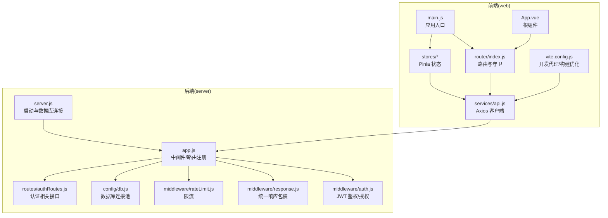
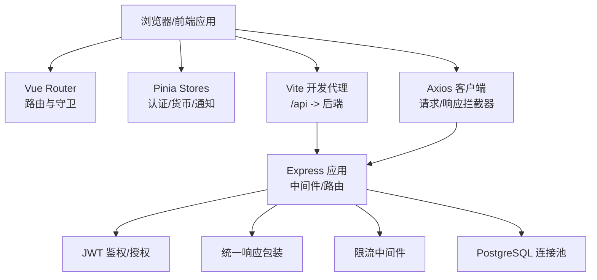
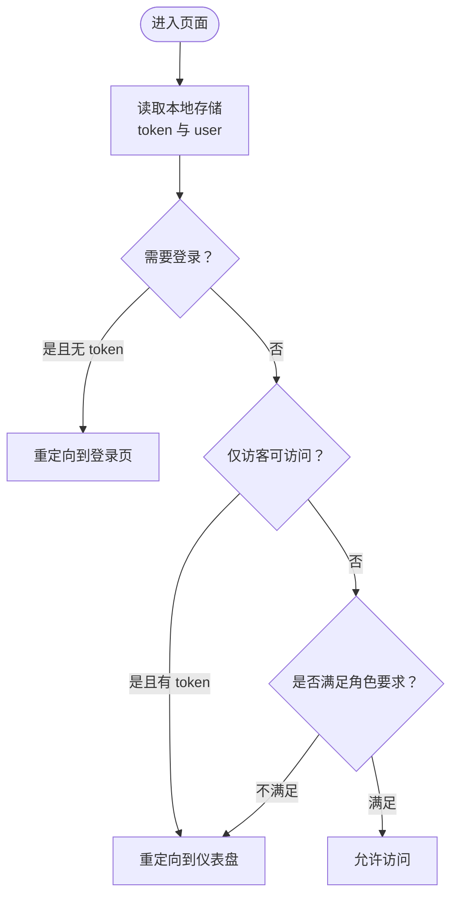
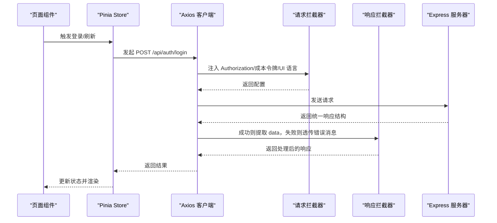
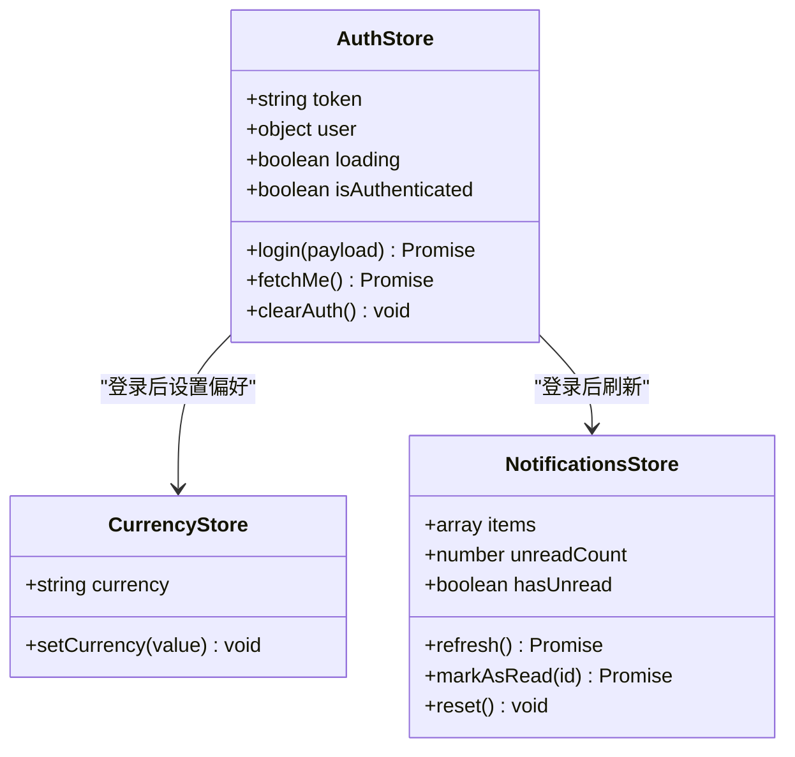
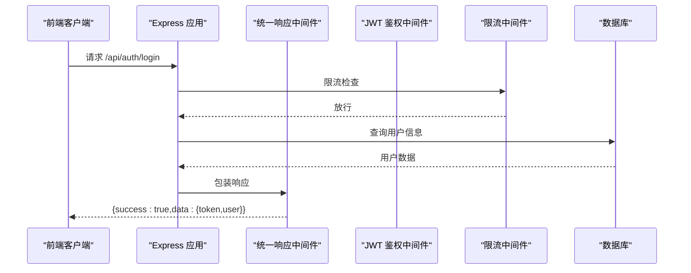
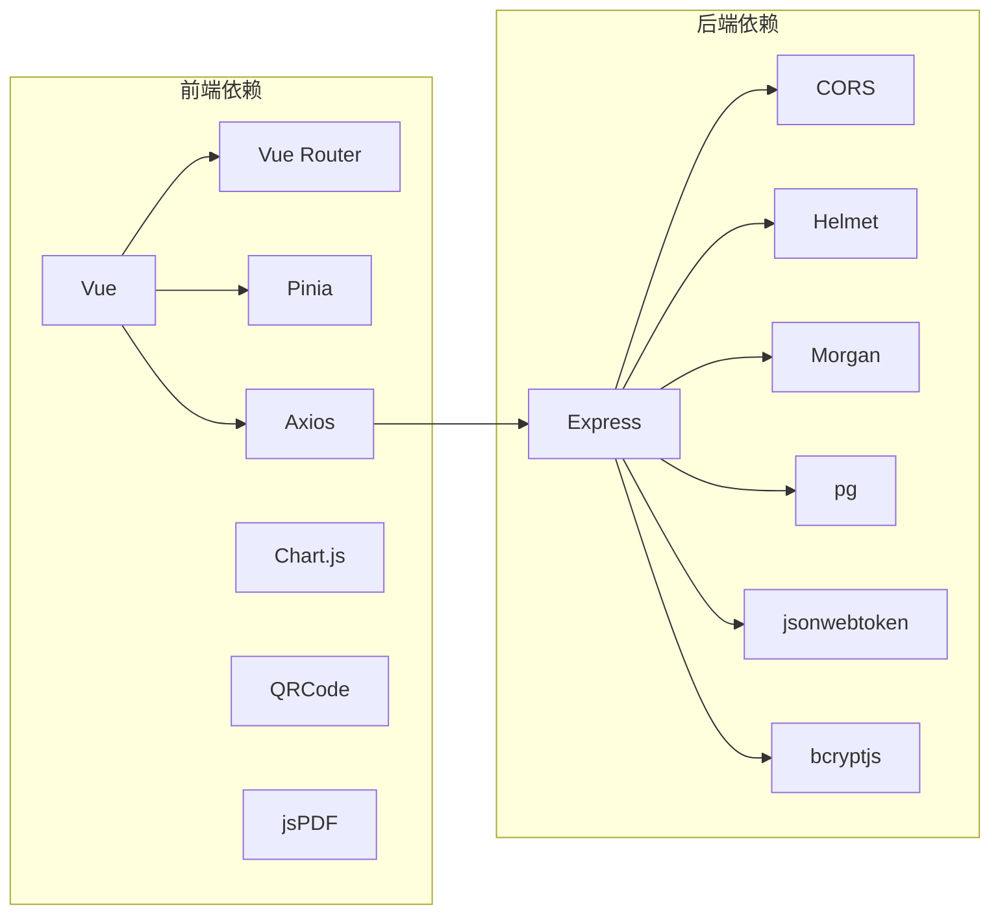

# 前后端分离架构

<cite>
**本文引用的文件**
- [web/src/main.js](file://web/src/main.js)
- [web/src/router/index.js](file://web/src/router/index.js)
- [web/src/services/api.js](file://web/src/services/api.js)
- [web/src/stores/auth.js](file://web/src/stores/auth.js)
- [web/src/stores/currency.js](file://web/src/stores/currency.js)
- [web/src/stores/notifications.js](file://web/src/stores/notifications.js)
- [web/src/App.vue](file://web/src/App.vue)
- [web/vite.config.js](file://web/vite.config.js)
- [server/src/app.js](file://server/src/app.js)
- [server/src/server.js](file://server/src/server.js)
- [server/src/middleware/auth.js](file://server/src/middleware/auth.js)
- [server/src/middleware/response.js](file://server/src/middleware/response.js)
- [server/src/middleware/rateLimit.js](file://server/src/middleware/rateLimit.js)
- [server/src/config/db.js](file://server/src/config/db.js)
- [server/src/routes/authRoutes.js](file://server/src/routes/authRoutes.js)
- [web/package.json](file://web/package.json)
- [server/package.json](file://server/package.json)
</cite>

## 目录
1. [引言](#引言)
2. [项目结构](#项目结构)
3. [核心组件](#核心组件)
4. [架构总览](#架构总览)
5. [详细组件分析](#详细组件分析)
6. [依赖关系分析](#依赖关系分析)
7. [性能考虑](#性能考虑)
8. [故障排查指南](#故障排查指南)
9. [结论](#结论)
10. [附录](#附录)

## 引言
本文件面向前后端分离的库存管理系统，系统采用 Vue.js 前端与 Express 后端协同工作。前端通过 Axios 客户端调用后端 RESTful API，使用 Vue Router 进行前端路由与鉴权守卫，使用 Pinia 实现状态管理；后端基于 Express 提供统一的 REST 接口，内置 CORS、安全头、审计日志与统一响应包装，并通过 JWT 实现鉴权与基于角色的授权。

## 项目结构
系统分为两个独立工程：
- 前端工程（web）：基于 Vite + Vue 3 + Vue Router + Pinia，负责用户界面与交互逻辑。
- 后端工程（server）：基于 Express + PostgreSQL，负责业务逻辑与数据持久化。

图表来源
- [web/src/main.js:1-14](file://web/src/main.js#L1-L14)
- [web/src/router/index.js:1-202](file://web/src/router/index.js#L1-L202)
- [web/src/services/api.js:1-45](file://web/src/services/api.js#L1-L45)
- [web/src/App.vue:1-9](file://web/src/App.vue#L1-L9)
- [web/vite.config.js:1-46](file://web/vite.config.js#L1-L46)
- [server/src/app.js:1-65](file://server/src/app.js#L1-L65)
- [server/src/server.js:1-28](file://server/src/server.js#L1-L28)
- [server/src/middleware/auth.js:1-46](file://server/src/middleware/auth.js#L1-L46)
- [server/src/middleware/response.js:1-62](file://server/src/middleware/response.js#L1-L62)
- [server/src/middleware/rateLimit.js:1-40](file://server/src/middleware/rateLimit.js#L1-L40)
- [server/src/config/db.js:1-25](file://server/src/config/db.js#L1-L25)
- [server/src/routes/authRoutes.js:1-72](file://server/src/routes/authRoutes.js#L1-L72)

章节来源
- [web/src/main.js:1-14](file://web/src/main.js#L1-L14)
- [web/src/router/index.js:1-202](file://web/src/router/index.js#L1-L202)
- [web/src/services/api.js:1-45](file://web/src/services/api.js#L1-L45)
- [web/src/App.vue:1-9](file://web/src/App.vue#L1-L9)
- [web/vite.config.js:1-46](file://web/vite.config.js#L1-L46)
- [server/src/app.js:1-65](file://server/src/app.js#L1-L65)
- [server/src/server.js:1-28](file://server/src/server.js#L1-L28)

## 核心组件
- 前端应用入口与状态管理：在应用入口统一挂载 Pinia 与路由，便于全局共享状态与导航。
- 路由与鉴权守卫：基于 meta 字段定义访问要求（是否需要登录、角色限制），结合本地存储进行前置守卫判断。
- API 客户端：统一创建 Axios 实例，设置基础 URL，注入请求拦截器（携带令牌、成本中心令牌、语言等），统一响应拦截器（提取 data 或透传错误消息）。
- 状态管理（Pinia）：包含认证、货币、通知等模块，支持持久化与跨页面恢复。
- 后端中间件：Helmet 安全头、CORS 跨域、统一响应包装、审计日志、JWT 鉴权与基于角色授权、限流。
- 数据库连接：PostgreSQL 连接池，支持 SSL 与超时配置。

章节来源
- [web/src/main.js:1-14](file://web/src/main.js#L1-L14)
- [web/src/router/index.js:180-199](file://web/src/router/index.js#L180-L199)
- [web/src/services/api.js:1-45](file://web/src/services/api.js#L1-L45)
- [web/src/stores/auth.js:1-90](file://web/src/stores/auth.js#L1-L90)
- [server/src/app.js:27-33](file://server/src/app.js#L27-L33)
- [server/src/middleware/auth.js:1-46](file://server/src/middleware/auth.js#L1-L46)
- [server/src/middleware/response.js:1-62](file://server/src/middleware/response.js#L1-L62)
- [server/src/middleware/rateLimit.js:1-40](file://server/src/middleware/rateLimit.js#L1-L40)
- [server/src/config/db.js:1-25](file://server/src/config/db.js#L1-L25)

## 架构总览
系统遵循前后端分离的典型协作模式：
- 前端通过 Axios 发起 REST 请求，后端以 JSON 作为主要数据交换格式。
- 前端路由负责页面级导航与鉴权控制，后端路由负责资源级 API 控制。
- 前端状态管理集中维护用户会话、偏好设置与通知等，后端通过 JWT 保障会话安全。

图表来源
- [web/src/router/index.js:1-202](file://web/src/router/index.js#L1-L202)
- [web/src/stores/auth.js:1-90](file://web/src/stores/auth.js#L1-L90)
- [web/src/services/api.js:1-45](file://web/src/services/api.js#L1-L45)
- [web/vite.config.js:8-16](file://web/vite.config.js#L8-L16)
- [server/src/app.js:27-53](file://server/src/app.js#L27-L53)
- [server/src/middleware/auth.js:1-46](file://server/src/middleware/auth.js#L1-L46)
- [server/src/middleware/response.js:1-62](file://server/src/middleware/response.js#L1-L62)
- [server/src/middleware/rateLimit.js:1-40](file://server/src/middleware/rateLimit.js#L1-L40)
- [server/src/config/db.js:1-25](file://server/src/config/db.js#L1-L25)

## 详细组件分析

### 前端路由与鉴权守卫
- 路由定义：采用动态导入与 meta 元信息，声明访问要求（requiresAuth/guestOnly/roles）。
- 前置守卫：读取本地存储中的用户与令牌，按需重定向至登录或仪表盘，并校验角色权限。
- 页面组件：各功能页面按路由懒加载，减少首屏体积。

图表来源
- [web/src/router/index.js:180-199](file://web/src/router/index.js#L180-L199)

章节来源
- [web/src/router/index.js:1-202](file://web/src/router/index.js#L1-L202)

### API 客户端与拦截器
- Axios 实例：设置基础 URL（优先环境变量），统一注入请求头（Authorization、成本中心令牌、UI 语言）。
- 响应拦截：若后端返回统一结构且 success 为真，则提取 data；若失败则将 message 写入 error.message，便于前端统一处理。
- 使用场景：认证登录、获取用户信息、通知列表、标记已读等。

图表来源
- [web/src/services/api.js:1-45](file://web/src/services/api.js#L1-L45)
- [server/src/routes/authRoutes.js:17-64](file://server/src/routes/authRoutes.js#L17-L64)
- [server/src/middleware/response.js:9-34](file://server/src/middleware/response.js#L9-L34)

章节来源
- [web/src/services/api.js:1-45](file://web/src/services/api.js#L1-L45)
- [server/src/routes/authRoutes.js:1-72](file://server/src/routes/authRoutes.js#L1-L72)
- [server/src/middleware/response.js:1-62](file://server/src/middleware/response.js#L1-L62)

### 认证与状态管理（Pinia）
- 认证 Store：维护 token 与用户信息，持久化到 localStorage；提供登录、拉取当前用户、清理会话方法；登录成功后联动货币与通知模块。
- 货币 Store：维护用户偏好的货币单位，限定合法值并持久化。
- 通知 Store：拉取未读通知、标记已读、重置状态，支持分页参数。

图表来源
- [web/src/stores/auth.js:1-90](file://web/src/stores/auth.js#L1-L90)
- [web/src/stores/currency.js:1-21](file://web/src/stores/currency.js#L1-L21)
- [web/src/stores/notifications.js:1-52](file://web/src/stores/notifications.js#L1-L52)

章节来源
- [web/src/stores/auth.js:1-90](file://web/src/stores/auth.js#L1-L90)
- [web/src/stores/currency.js:1-21](file://web/src/stores/currency.js#L1-L21)
- [web/src/stores/notifications.js:1-52](file://web/src/stores/notifications.js#L1-L52)

### 后端中间件与路由
- 中间件：
  - 安全头与跨域：Helmet、CORS 默认启用。
  - 统一响应包装：所有响应统一为 { success, data/code/message/details/requestId } 结构，错误码与消息规范化。
  - 审计日志：记录请求 ID 并附加到响应头。
  - 限流：基于 IP 的滑动窗口限流，支持命名空间区分不同路由。
  - JWT 鉴权：解析 Authorization 头中的 Bearer Token，校验并回写用户信息到请求对象。
- 路由：
  - 认证路由：POST /api/auth/login（带登录限流）、GET /api/auth/me。
  - 其他业务路由：按模块划分（库存、报表、警报、审计、订单、供应商、通知、设置、银行流水等）。

图表来源
- [server/src/app.js:27-53](file://server/src/app.js#L27-L53)
- [server/src/middleware/response.js:9-34](file://server/src/middleware/response.js#L9-L34)
- [server/src/middleware/auth.js:5-29](file://server/src/middleware/auth.js#L5-L29)
- [server/src/middleware/rateLimit.js:9-35](file://server/src/middleware/rateLimit.js#L9-L35)
- [server/src/routes/authRoutes.js:17-64](file://server/src/routes/authRoutes.js#L17-L64)

章节来源
- [server/src/app.js:1-65](file://server/src/app.js#L1-L65)
- [server/src/middleware/response.js:1-62](file://server/src/middleware/response.js#L1-L62)
- [server/src/middleware/auth.js:1-46](file://server/src/middleware/auth.js#L1-L46)
- [server/src/middleware/rateLimit.js:1-40](file://server/src/middleware/rateLimit.js#L1-L40)
- [server/src/routes/authRoutes.js:1-72](file://server/src/routes/authRoutes.js#L1-L72)

### CORS 与跨域处理
- 后端默认启用 CORS 中间件，允许跨域请求。
- 前端开发阶段通过 Vite 代理将 /api 前缀转发到后端地址，避免浏览器同源策略限制。

章节来源
- [server/src/app.js:29](file://server/src/app.js#L29)
- [web/vite.config.js:10-15](file://web/vite.config.js#L10-L15)

### 数据交换格式与 REST 设计
- 统一响应结构：后端统一返回 { success, data/code/message/details/requestId }，前端响应拦截器自动提取 data，简化前端处理。
- 错误处理：后端通过 res.fail/res.success 或标准状态码返回错误信息，前端拦截器将 message 写入 error.message，便于统一提示。
- 资源命名：API 路由采用名词复数形式（如 /api/inventory、/api/orders），符合 REST 风格。

章节来源
- [server/src/middleware/response.js:9-54](file://server/src/middleware/response.js#L9-L54)
- [web/src/services/api.js:26-42](file://web/src/services/api.js#L26-L42)

## 依赖关系分析
- 前端依赖：Vue 3、Vue Router、Pinia、Axios、Chart.js、QRCode、PDF 工具等。
- 后端依赖：Express、CORS、Helmet、Morgan、jsonwebtoken、bcryptjs、pg、multer 等。
- 构建与部署：前端使用 Vite 与 Cloudflare 插件，支持 Worker 部署；后端使用 Node.js 启动脚本。

图表来源
- [web/package.json:12-22](file://web/package.json#L12-L22)
- [server/package.json:15-24](file://server/package.json#L15-L24)

章节来源
- [web/package.json:1-34](file://web/package.json#L1-L34)
- [server/package.json:1-31](file://server/package.json#L1-L31)

## 性能考虑
- 前端构建分包：通过 Vite 的 manualChunks 将图表、PDF、扫描器与核心框架分别打包，提升缓存命中率与首屏性能。
- 后端连接池：PostgreSQL 连接池与 SSL 适配，生产环境自动启用 SSL，降低网络延迟与安全风险。
- 限流策略：针对登录等敏感接口设置限流，防止暴力破解与滥用。
- 响应体大小：后端 JSON 解析限制为 8MB，避免过大请求导致内存压力。

章节来源
- [web/vite.config.js:17-44](file://web/vite.config.js#L17-L44)
- [server/src/config/db.js:13-19](file://server/src/config/db.js#L13-L19)
- [server/src/middleware/rateLimit.js:9-35](file://server/src/middleware/rateLimit.js#L9-L35)
- [server/src/app.js:30](file://server/src/app.js#L30)

## 故障排查指南
- 登录失败或 401：
  - 检查前端是否正确传递 Authorization 头与成本中心令牌。
  - 检查后端 JWT 密钥与用户状态是否有效。
- 跨域问题：
  - 确认后端 CORS 已启用，前端代理 /api 是否指向正确后端地址。
- 统一响应错误：
  - 查看响应中的 code/message/details/requestId，定位具体错误来源。
- 数据库连接失败：
  - 检查 DATABASE_URL、SSL 配置与连接超时设置，确认服务启动前数据库可用。

章节来源
- [web/src/services/api.js:8-24](file://web/src/services/api.js#L8-L24)
- [server/src/middleware/auth.js:5-29](file://server/src/middleware/auth.js#L5-L29)
- [server/src/app.js:29](file://server/src/app.js#L29)
- [server/src/middleware/response.js:9-54](file://server/src/middleware/response.js#L9-L54)
- [server/src/config/db.js:3-11](file://server/src/config/db.js#L3-L11)

## 结论
本系统通过清晰的前后端职责划分与标准化的 REST 协议实现了高内聚低耦合的架构。前端以 Vue Router 与 Pinia 构建用户体验，后端以 Express 提供安全、可扩展的 API 层。统一响应与拦截器设计降低了前后端对接复杂度，限流与安全中间件提升了系统稳定性与安全性。建议在生产环境中进一步完善监控与日志追踪，并持续优化前端分包策略与后端连接池参数。

## 附录
- 开发代理配置：前端 Vite 将 /api 代理到后端端口，便于联调。
- 健康检查：后端提供 /api/health 快速检测服务状态。
- 启动流程：后端启动时先尝试数据库连接，失败则优雅退出。

章节来源
- [web/vite.config.js:8-16](file://web/vite.config.js#L8-L16)
- [server/src/app.js:35-37](file://server/src/app.js#L35-L37)
- [server/src/server.js:13-25](file://server/src/server.js#L13-L25)