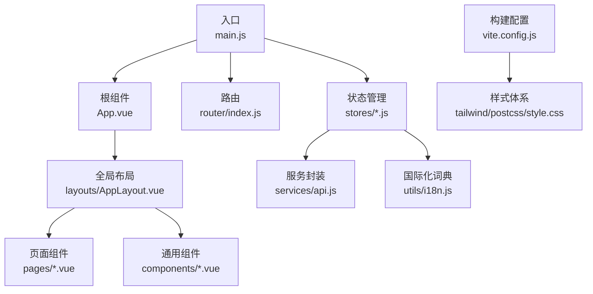
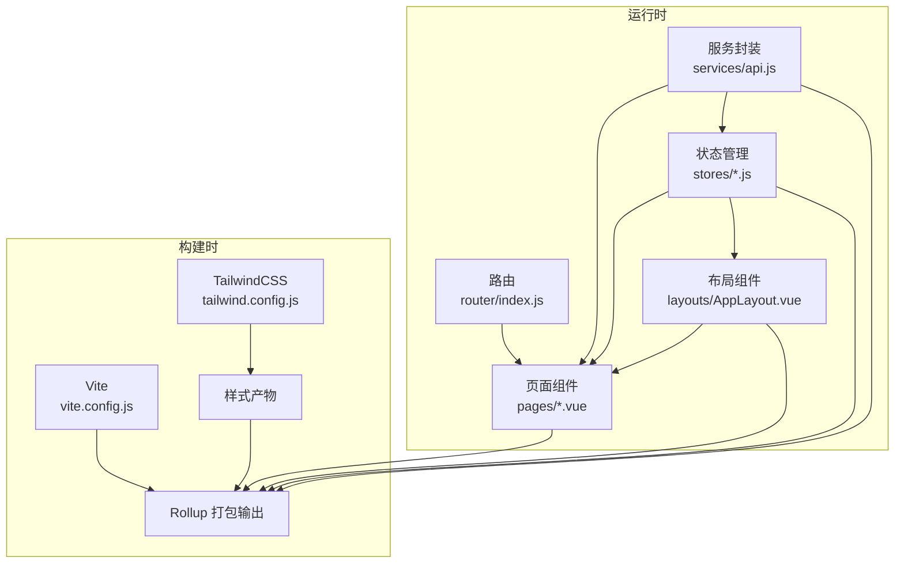
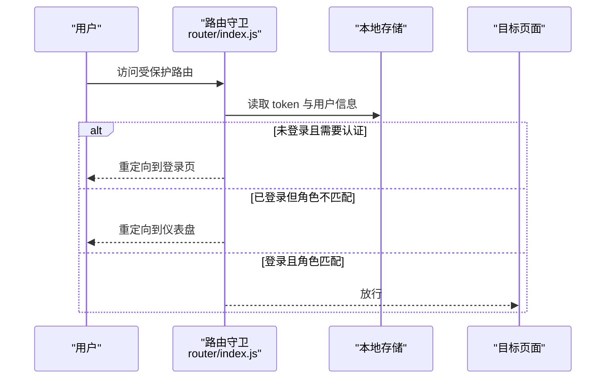
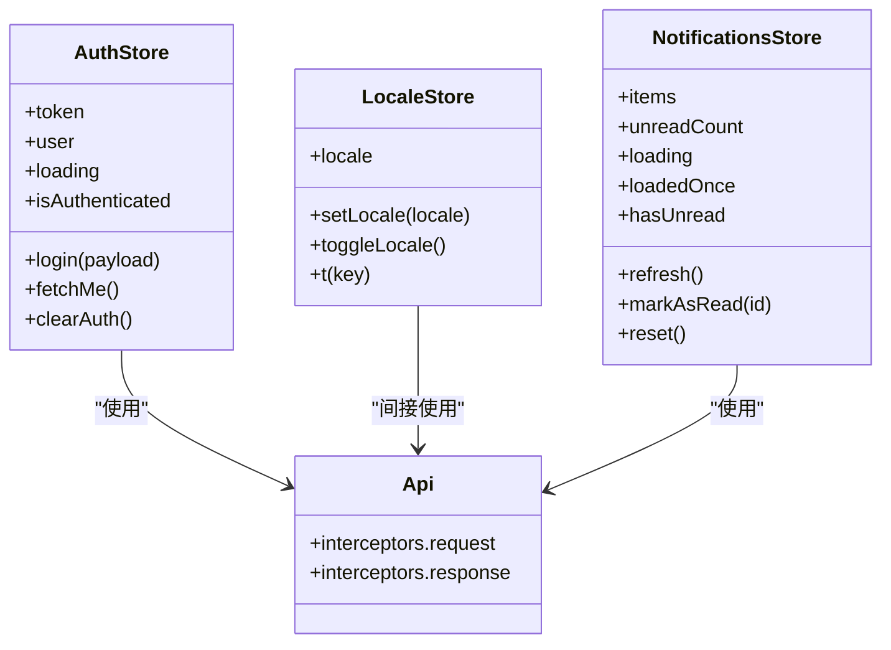
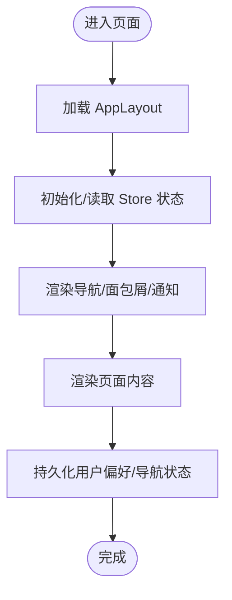
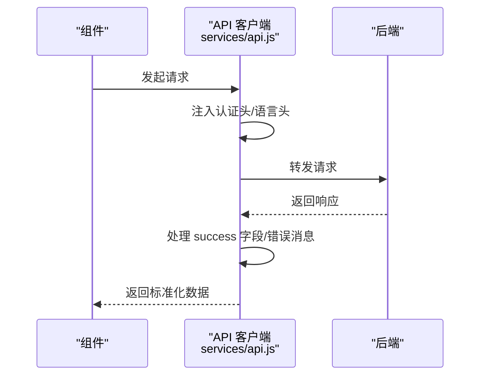
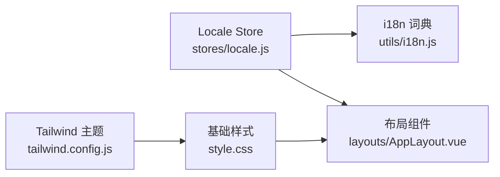
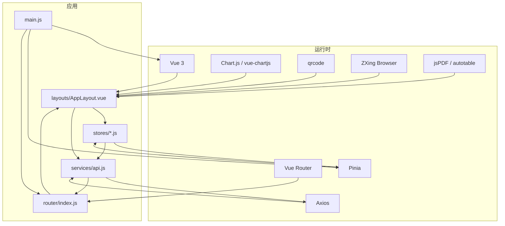

# 前端架构

<cite>
**本文引用的文件**
- [main.js](file://web/src/main.js)
- [App.vue](file://web/src/App.vue)
- [router/index.js](file://web/src/router/index.js)
- [vite.config.js](file://web/vite.config.js)
- [package.json](file://web/package.json)
- [stores/auth.js](file://web/src/stores/auth.js)
- [stores/locale.js](file://web/src/stores/locale.js)
- [stores/notifications.js](file://web/src/stores/notifications.js)
- [stores/costAccess.js](file://web/src/stores/costAccess.js)
- [stores/currency.js](file://web/src/stores/currency.js)
- [stores/toast.js](file://web/src/stores/toast.js)
- [stores/todos.js](file://web/src/stores/todos.js)
- [services/api.js](file://web/src/services/api.js)
- [layouts/AppLayout.vue](file://web/src/layouts/AppLayout.vue)
- [components/GlobalToastCenter.vue](file://web/src/components/GlobalToastCenter.vue)
- [utils/i18n.js](file://web/src/utils/i18n.js)
- [tailwind.config.js](file://web/tailwind.config.js)
- [postcss.config.js](file://web/postcss.config.js)
- [style.css](file://web/src/style.css)
</cite>

## 目录
1. [引言](#引言)
2. [项目结构](#项目结构)
3. [核心组件](#核心组件)
4. [架构总览](#架构总览)
5. [详细组件分析](#详细组件分析)
6. [依赖关系分析](#依赖关系分析)
7. [性能考虑](#性能考虑)
8. [故障排查指南](#故障排查指南)
9. [结论](#结论)
10. [附录](#附录)

## 引言
本文件面向库存管理系统的前端架构，聚焦 Vue 3 单页应用的设计与实现，涵盖组件层次、路由与鉴权、状态管理、构建与优化、国际化与主题、以及性能与可维护性最佳实践。目标是帮助开发者与产品团队快速理解系统结构与扩展点。

## 项目结构
前端位于 web 目录，采用“功能域+分层”的组织方式：
- 入口与根组件：main.js、App.vue
- 路由：router/index.js（基于 Vue Router 的历史模式与动态导入）
- 状态管理：stores/*（基于 Pinia 的模块化 Store）
- 页面：pages/*（按业务域划分）
- 布局与通用组件：layouts/*、components/*
- 服务与工具：services/*、utils/*
- 构建与样式：vite.config.js、tailwind.config.js、postcss.config.js、style.css
- 依赖与脚本：package.json

图示来源
- [main.js:1-14](file://web/src/main.js#L1-L14)
- [App.vue:1-9](file://web/src/App.vue#L1-L9)
- [router/index.js:1-209](file://web/src/router/index.js#L1-L209)
- [services/api.js:1-45](file://web/src/services/api.js#L1-L45)
- [layouts/AppLayout.vue:1-831](file://web/src/layouts/AppLayout.vue#L1-L831)

章节来源
- [main.js:1-14](file://web/src/main.js#L1-L14)
- [router/index.js:1-209](file://web/src/router/index.js#L1-L209)
- [package.json:1-34](file://web/package.json#L1-L34)

## 核心组件
- 应用入口与挂载：在入口文件中创建应用实例，统一注册 Pinia 与路由，随后挂载到 DOM。
- 根组件：根组件负责渲染路由视图与全局提示中心。
- 全局布局：AppLayout 提供导航、面包屑、通知中心、用户操作等横切能力。
- 通用组件：如全局 Toast 中心、统计卡片、分页条等。
- 服务层：统一的 API 客户端，内置请求/响应拦截器，集中处理认证头、成本访问令牌与本地化头。
- 状态管理：以模块化 Store 形式组织，覆盖认证、语言、通知、货币、待办、全局提示等。

章节来源
- [main.js:1-14](file://web/src/main.js#L1-L14)
- [App.vue:1-9](file://web/src/App.vue#L1-L9)
- [services/api.js:1-45](file://web/src/services/api.js#L1-L45)
- [stores/auth.js:1-90](file://web/src/stores/auth.js#L1-L90)
- [stores/locale.js:1-38](file://web/src/stores/locale.js#L1-L38)
- [stores/notifications.js:1-52](file://web/src/stores/notifications.js#L1-L52)
- [components/GlobalToastCenter.vue:1-41](file://web/src/components/GlobalToastCenter.vue#L1-L41)

## 架构总览
系统采用“路由驱动页面、Pinia 驱动状态、Axios 封装 API”的三层架构。路由负责页面级导航与鉴权守卫；状态管理负责跨页面共享的数据与行为；服务层负责网络请求与错误处理；布局组件承载导航、通知与用户交互；构建工具负责开发体验与产物优化。

图示来源
- [router/index.js:1-209](file://web/src/router/index.js#L1-L209)
- [layouts/AppLayout.vue:1-831](file://web/src/layouts/AppLayout.vue#L1-L831)
- [stores/auth.js:1-90](file://web/src/stores/auth.js#L1-L90)
- [services/api.js:1-45](file://web/src/services/api.js#L1-L45)
- [vite.config.js:1-46](file://web/vite.config.js#L1-L46)
- [tailwind.config.js:1-18](file://web/tailwind.config.js#L1-L18)

## 详细组件分析

### 路由与鉴权
- 路由采用 history 模式与动态导入，所有页面均通过函数式导入实现懒加载。
- 前置守卫校验登录态、访客限制与角色授权，未满足条件时重定向至登录或仪表盘。
- 路由元信息包含权限角色与导航键，用于布局侧边栏与面包屑的联动。

图示来源
- [router/index.js:187-206](file://web/src/router/index.js#L187-L206)

章节来源
- [router/index.js:1-209](file://web/src/router/index.js#L1-L209)

### 状态管理（Pinia）与模块化
- 认证模块：持久化 token 与用户信息，提供登录、拉取个人信息、清理会话等方法。
- 语言模块：维护当前语言与切换逻辑，提供 t(key) 查询翻译。
- 通知模块：拉取未读通知、标记已读、加载状态与计数。
- 其他模块：货币、成本访问、全局提示、待办等，均以 Store 形式独立管理。

图示来源
- [stores/auth.js:1-90](file://web/src/stores/auth.js#L1-L90)
- [stores/locale.js:1-38](file://web/src/stores/locale.js#L1-L38)
- [stores/notifications.js:1-52](file://web/src/stores/notifications.js#L1-L52)
- [services/api.js:1-45](file://web/src/services/api.js#L1-L45)

章节来源
- [stores/auth.js:1-90](file://web/src/stores/auth.js#L1-L90)
- [stores/locale.js:1-38](file://web/src/stores/locale.js#L1-L38)
- [stores/notifications.js:1-52](file://web/src/stores/notifications.js#L1-L52)

### 布局与页面组织
- AppLayout 负责：
  - 导航栏/侧边栏切换与折叠状态持久化
  - 分组导航与面包屑生成
  - 用户信息、语言切换、通知中心、登出
  - 引导向导与全局提示联动
- 页面按业务域组织于 pages 目录，通过路由元信息与导航键关联，便于统一权限与导航展示。

图示来源
- [layouts/AppLayout.vue:1-831](file://web/src/layouts/AppLayout.vue#L1-L831)

章节来源
- [layouts/AppLayout.vue:1-831](file://web/src/layouts/AppLayout.vue#L1-L831)

### 服务层与 API 封装
- Axios 实例集中配置 baseURL、请求/响应拦截器。
- 请求拦截：自动附加 Authorization、成本访问令牌与 UI 语言头。
- 响应拦截：统一处理 success 字段与错误消息透传，简化页面调用。

图示来源
- [services/api.js:1-45](file://web/src/services/api.js#L1-L45)

章节来源
- [services/api.js:1-45](file://web/src/services/api.js#L1-L45)

### 国际化与主题
- 国际化：通过 locale Store 与 i18n 词典实现，支持 en/cn 双语，提供 t(key) 查询与切换。
- 主题：Tailwind 自定义品牌色，基础样式统一背景与文本色，布局组件使用语义化颜色类。

图示来源
- [stores/locale.js:1-38](file://web/src/stores/locale.js#L1-L38)
- [utils/i18n.js:1-189](file://web/src/utils/i18n.js#L1-L189)
- [tailwind.config.js:1-18](file://web/tailwind.config.js#L1-L18)
- [style.css:1-18](file://web/src/style.css#L1-L18)

章节来源
- [utils/i18n.js:1-189](file://web/src/utils/i18n.js#L1-L189)
- [tailwind.config.js:1-18](file://web/tailwind.config.js#L1-L18)
- [style.css:1-18](file://web/src/style.css#L1-L18)

### 通用组件与全局提示
- GlobalToastCenter：全局提示中心，根据提示类型渲染不同样式，支持动作按钮与关闭。
- 其他通用组件：图标、扫描器、统计卡片、分页条等，按需复用。

章节来源
- [components/GlobalToastCenter.vue:1-41](file://web/src/components/GlobalToastCenter.vue#L1-L41)

## 依赖关系分析
- 运行时依赖：Vue 3、Vue Router、Pinia、Axios、Chart.js 与 vue-chartjs、QRCode、@zxing/browser（扫码）、jspdf 与 jspdf-autotable（导出）。
- 开发依赖：Vite、@vitejs/plugin-vue、TailwindCSS、PostCSS、Wrangler（Cloudflare Workers）。
- 关键耦合点：
  - AppLayout 依赖多个 Store（认证、语言、通知）与路由。
  - 页面通过 API 服务与后端交互，Store 作为数据源。
  - 构建配置对第三方库进行手动分包，减少首屏体积。

图示来源
- [package.json:12-32](file://web/package.json#L12-L32)
- [main.js:1-14](file://web/src/main.js#L1-L14)
- [router/index.js:1-209](file://web/src/router/index.js#L1-L209)
- [services/api.js:1-45](file://web/src/services/api.js#L1-L45)
- [layouts/AppLayout.vue:1-831](file://web/src/layouts/AppLayout.vue#L1-L831)

章节来源
- [package.json:1-34](file://web/package.json#L1-L34)

## 性能考虑
- 代码分割与懒加载：路由页面全部采用动态导入，实现按需加载。
- 手动分包策略：针对图表、PDF、扫码与核心框架库分别拆分，降低缓存失效影响并提升二次加载效率。
- 构建代理与热更新：开发服务器代理 /api 到后端，提升联调效率。
- 样式体积控制：Tailwind 按需扫描，避免引入未使用类名。

章节来源
- [vite.config.js:17-45](file://web/vite.config.js#L17-L45)
- [router/index.js:3-27](file://web/src/router/index.js#L3-L27)

## 故障排查指南
- 登录态异常
  - 检查路由守卫是否正确读取本地存储中的 token 与用户信息。
  - 确认前置守卫对 requiresAuth/guestOnly/roles 的判断逻辑。
- 接口请求失败
  - 查看请求拦截器是否正确注入 Authorization 与语言头。
  - 检查响应拦截器对 success 字段与错误消息的处理。
- 通知中心不刷新
  - 确认通知 Store 的 refresh 方法被调用，且 loadedOnce 标记正确。
- 国际化显示异常
  - 检查 locale Store 的当前语言与词典键是否存在。
- 样式问题
  - 确认 Tailwind 扫描路径与自定义颜色配置正确。

章节来源
- [router/index.js:187-206](file://web/src/router/index.js#L187-L206)
- [services/api.js:8-42](file://web/src/services/api.js#L8-L42)
- [stores/notifications.js:13-38](file://web/src/stores/notifications.js#L13-L38)
- [stores/locale.js:21-29](file://web/src/stores/locale.js#L21-L29)
- [tailwind.config.js:4-14](file://web/tailwind.config.js#L4-L14)

## 结论
该前端架构以 Vue 3 + Pinia + Vue Router 为核心，结合 Axios 服务封装与 Tailwind 样式体系，实现了清晰的职责分离与良好的可扩展性。通过路由懒加载与手动分包策略，兼顾了首屏性能与长期缓存收益。国际化与主题体系完善，便于多语言与品牌定制。建议在后续迭代中持续关注 Store 模块边界、页面加载态与错误边界的一致性设计。

## 附录
- 构建与部署
  - 开发：npm run dev
  - 预览/部署：npm run preview / npm run deploy（结合 Wrangler）
- 关键环境变量
  - VITE_API_URL：后端 API 基础地址（默认 /api）

章节来源
- [package.json:6-11](file://web/package.json#L6-L11)
- [services/api.js:3-5](file://web/src/services/api.js#L3-L5)