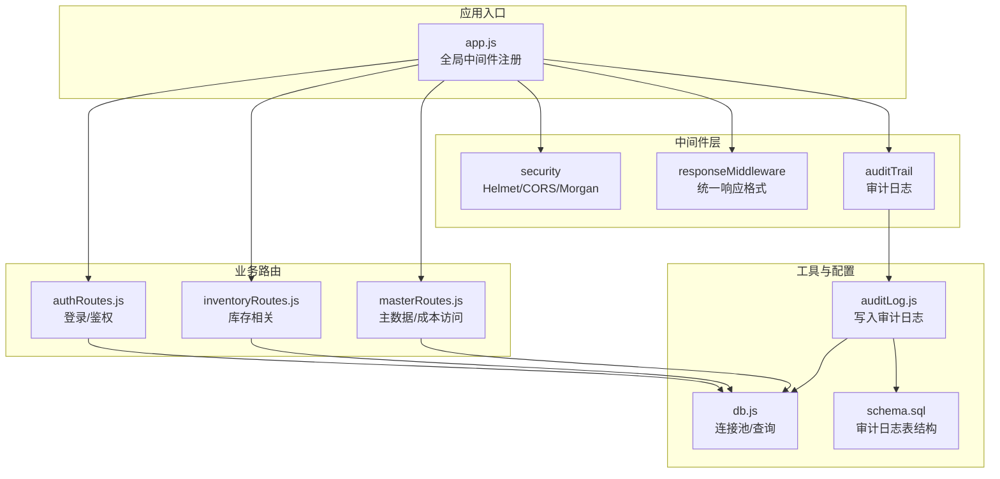
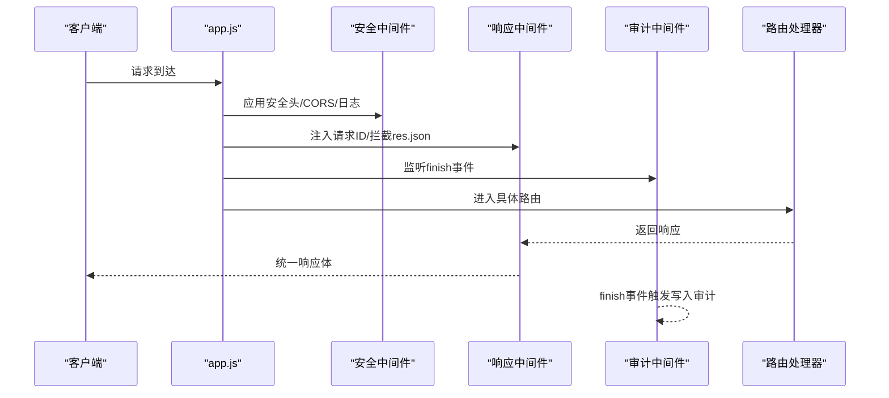
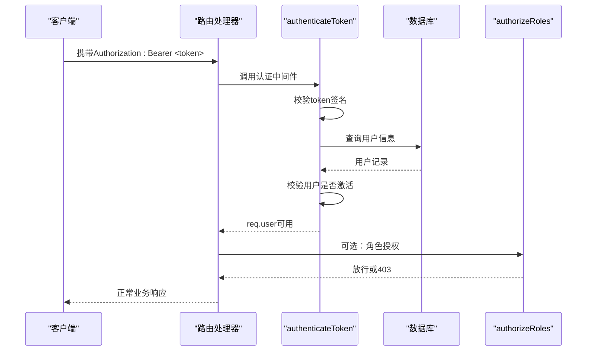
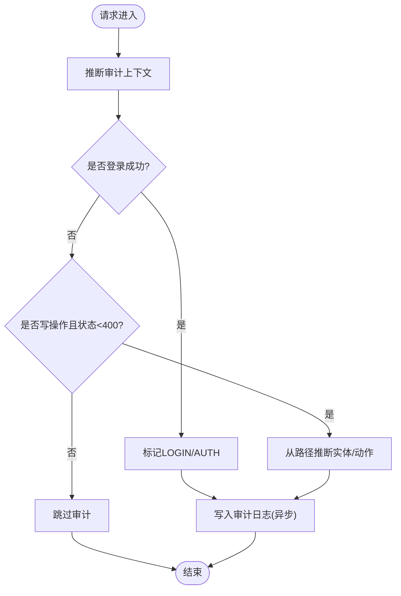
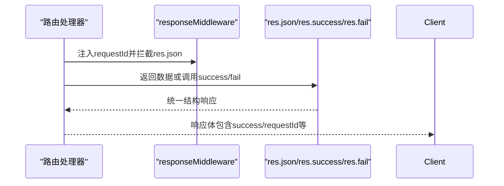
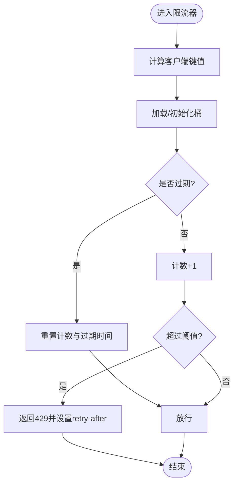
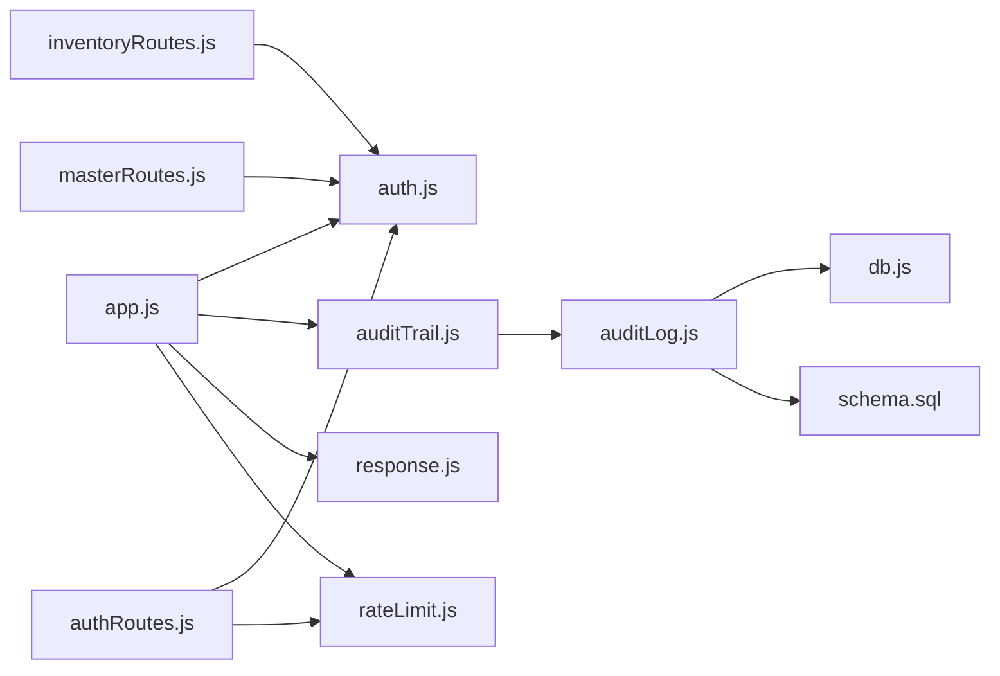

# 中间件系统

<cite>
**本文引用的文件**
- [server/src/app.js](file://server/src/app.js)
- [server/src/middleware/auth.js](file://server/src/middleware/auth.js)
- [server/src/middleware/auditTrail.js](file://server/src/middleware/auditTrail.js)
- [server/src/middleware/rateLimit.js](file://server/src/middleware/rateLimit.js)
- [server/src/middleware/response.js](file://server/src/middleware/response.js)
- [server/src/routes/authRoutes.js](file://server/src/routes/authRoutes.js)
- [server/src/routes/inventoryRoutes.js](file://server/src/routes/inventoryRoutes.js)
- [server/src/routes/masterRoutes.js](file://server/src/routes/masterRoutes.js)
- [server/src/utils/auditLog.js](file://server/src/utils/auditLog.js)
- [server/src/config/db.js](file://server/src/config/db.js)
- [server/database/schema.sql](file://server/database/schema.sql)
- [server/test/middleware.test.js](file://server/test/middleware.test.js)
</cite>

## 目录
1. [简介](#简介)
2. [项目结构](#项目结构)
3. [核心组件](#核心组件)
4. [架构总览](#架构总览)
5. [详细组件分析](#详细组件分析)
6. [依赖关系分析](#依赖关系分析)
7. [性能考量](#性能考量)
8. [故障排查指南](#故障排查指南)
9. [结论](#结论)
10. [附录](#附录)

## 简介
本文件系统性梳理库存管理系统的中间件体系，覆盖以下关键能力：
- 执行顺序与职责分工
- 认证中间件的 JWT 验证、权限检查与会话管理
- 审计追踪中间件的操作日志记录、数据脱敏与合规
- 响应标准化中间件的数据格式统一、错误处理与 API 一致性
- 速率限制中间件的防 DDoS 与用户体验平衡
- 自定义中间件开发指南与最佳实践

## 项目结构
中间件位于 server/src/middleware 目录，配合 app.js 的全局注册与各路由模块按需使用。审计日志写入通过 utils/auditLog.js 调用数据库连接池完成，数据库结构由 schema.sql 定义。

图表来源
- [server/src/app.js:28-34](file://server/src/app.js#L28-L34)
- [server/src/middleware/response.js:3-57](file://server/src/middleware/response.js#L3-L57)
- [server/src/middleware/auditTrail.js:47-79](file://server/src/middleware/auditTrail.js#L47-L79)
- [server/src/utils/auditLog.js:1-33](file://server/src/utils/auditLog.js#L1-L33)
- [server/src/config/db.js:15-19](file://server/src/config/db.js#L15-L19)
- [server/database/schema.sql:275-288](file://server/database/schema.sql#L275-L288)

章节来源
- [server/src/app.js:26-56](file://server/src/app.js#L26-L56)

## 核心组件
- 认证中间件：负责从 Authorization 头解析 Bearer Token，校验签名与用户有效性，并将用户信息注入请求对象；同时提供基于角色的授权中间件。
- 审计追踪中间件：在响应完成后推断操作上下文，对敏感字段进行脱敏，写入审计日志表。
- 响应标准化中间件：统一请求 ID、成功/失败响应结构、错误码与消息，增强 API 一致性。
- 速率限制中间件：基于内存桶（Map）实现滑动窗口限流，支持命名空间隔离与自定义窗口与阈值。

章节来源
- [server/src/middleware/auth.js:5-29](file://server/src/middleware/auth.js#L5-L29)
- [server/src/middleware/auth.js:32-40](file://server/src/middleware/auth.js#L32-L40)
- [server/src/middleware/auditTrail.js:47-79](file://server/src/middleware/auditTrail.js#L47-L79)
- [server/src/middleware/response.js:3-57](file://server/src/middleware/response.js#L3-L57)
- [server/src/middleware/rateLimit.js:9-35](file://server/src/middleware/rateLimit.js#L9-L35)

## 架构总览
中间件在应用启动阶段按顺序注册，形成“安全头/CORS/日志 -> 统一响应 -> 审计”的基础链路；业务路由根据需要叠加认证与速率限制。

图表来源
- [server/src/app.js:28-34](file://server/src/app.js#L28-L34)
- [server/src/middleware/response.js:3-57](file://server/src/middleware/response.js#L3-L57)
- [server/src/middleware/auditTrail.js:47-79](file://server/src/middleware/auditTrail.js#L47-L79)

## 详细组件分析

### 认证中间件（JWT 与角色授权）
- JWT 验证流程
  - 从 Authorization 头提取 Bearer Token
  - 使用环境变量中的密钥验证签名
  - 查询用户信息并校验是否激活
  - 将用户信息挂载到 req.user，供后续中间件与路由使用
- 角色授权
  - authorizeRoles(...) 返回一个中间件，仅允许指定角色继续
  - 未满足条件时返回 403

图表来源
- [server/src/middleware/auth.js:5-29](file://server/src/middleware/auth.js#L5-L29)
- [server/src/middleware/auth.js:32-40](file://server/src/middleware/auth.js#L32-L40)
- [server/src/routes/authRoutes.js:67-69](file://server/src/routes/authRoutes.js#L67-L69)

章节来源
- [server/src/middleware/auth.js:5-29](file://server/src/middleware/auth.js#L5-L29)
- [server/src/middleware/auth.js:32-40](file://server/src/middleware/auth.js#L32-L40)
- [server/src/routes/authRoutes.js:67-69](file://server/src/routes/authRoutes.js#L67-L69)

### 审计追踪中间件（操作日志与合规）
- 上下文推断
  - 对登录成功场景自动识别为 LOGIN/AUTH
  - 其他写操作（POST/PUT/PATCH/DELETE）且状态码 < 400 时，从路径推断实体类型与动作
- 数据脱敏
  - 对请求体中的敏感字段（如密码）进行脱敏标记
- 写入审计
  - 在响应 finish 事件后异步写入数据库
  - 记录用户标识、角色、方法、路径、描述与元数据（含状态码与脱敏后的请求体）

图表来源
- [server/src/middleware/auditTrail.js:14-45](file://server/src/middleware/auditTrail.js#L14-L45)
- [server/src/middleware/auditTrail.js:47-79](file://server/src/middleware/auditTrail.js#L47-L79)
- [server/src/utils/auditLog.js:1-33](file://server/src/utils/auditLog.js#L1-L33)

章节来源
- [server/src/middleware/auditTrail.js:47-79](file://server/src/middleware/auditTrail.js#L47-L79)
- [server/src/utils/auditLog.js:1-33](file://server/src/utils/auditLog.js#L1-L33)
- [server/database/schema.sql:275-288](file://server/database/schema.sql#L275-L288)

### 响应标准化中间件（统一格式与错误处理）
- 注入请求 ID 并设置响应头
- 重写 res.json：非统一结构时自动包装为 {success, code, message, details, requestId}
- 提供 res.success 与 res.fail 快捷方法，便于业务层统一输出
- 与全局错误中间件配合，确保异常不会泄露堆栈

图表来源
- [server/src/middleware/response.js:3-57](file://server/src/middleware/response.js#L3-L57)
- [server/src/app.js:57-64](file://server/src/app.js#L57-L64)

章节来源
- [server/src/middleware/response.js:3-57](file://server/src/middleware/response.js#L3-L57)
- [server/src/app.js:57-64](file://server/src/app.js#L57-L64)

### 速率限制中间件（防 DDoS 与体验平衡）
- 滑动窗口限流
  - 以命名空间区分不同路由或功能
  - 优先使用 x-forwarded-for，其次 req.ip，生成键值
  - 当前窗口过期则重置计数与过期时间；否则递增计数
  - 达到阈值时返回 429，并设置 retry-after
- 与业务路由结合
  - 登录接口单独配置更严格的窗口与阈值
  - 其他接口可按需调整

图表来源
- [server/src/middleware/rateLimit.js:9-35](file://server/src/middleware/rateLimit.js#L9-L35)
- [server/src/routes/authRoutes.js:10-14](file://server/src/routes/authRoutes.js#L10-L14)

章节来源
- [server/src/middleware/rateLimit.js:9-35](file://server/src/middleware/rateLimit.js#L9-L35)
- [server/src/routes/authRoutes.js:10-14](file://server/src/routes/authRoutes.js#L10-L14)

### 自定义中间件开发指南与最佳实践
- 设计原则
  - 单一职责：每个中间件专注一个领域（认证、审计、限流、响应）
  - 无副作用：不修改上游状态，仅在必要时注入 req/res 扩展
  - 异步安全：审计等 IO 操作使用异步并在 finish 事件后执行
- 开发步骤
  - 明确输入/输出：请求扩展、响应拦截或错误处理
  - 错误处理：统一转换为 res.fail 或标准错误响应
  - 性能考虑：避免阻塞 IO，必要时使用异步与缓存
  - 可测试性：提供最小化示例与断言，参考现有测试用例
- 示例参考
  - 响应标准化：参考 response.js 的 res.json 包装与 res.success/fail
  - 限流策略：参考 rateLimit.js 的命名空间与滑动窗口
  - 审计上下文：参考 auditTrail.js 的路径推断与脱敏

章节来源
- [server/test/middleware.test.js:9-50](file://server/test/middleware.test.js#L9-L50)
- [server/src/middleware/response.js:3-57](file://server/src/middleware/response.js#L3-L57)
- [server/src/middleware/rateLimit.js:9-35](file://server/src/middleware/rateLimit.js#L9-L35)
- [server/src/middleware/auditTrail.js:47-79](file://server/src/middleware/auditTrail.js#L47-L79)

## 依赖关系分析
- app.js 将中间件按顺序注册，形成全局链路
- 各路由模块按需引入认证与限流中间件
- 审计日志依赖数据库连接池与审计日志表结构

图表来源
- [server/src/app.js:26-56](file://server/src/app.js#L26-L56)
- [server/src/routes/authRoutes.js:5-6](file://server/src/routes/authRoutes.js#L5-L6)
- [server/src/routes/inventoryRoutes.js:3](file://server/src/routes/inventoryRoutes.js#L3)
- [server/src/routes/masterRoutes.js:5](file://server/src/routes/masterRoutes.js#L5)
- [server/src/middleware/auditTrail.js:1-2](file://server/src/middleware/auditTrail.js#L1-L2)
- [server/src/utils/auditLog.js:1-33](file://server/src/utils/auditLog.js#L1-L33)
- [server/src/config/db.js:15-19](file://server/src/config/db.js#L15-L19)
- [server/database/schema.sql:275-288](file://server/database/schema.sql#L275-L288)

章节来源
- [server/src/app.js:26-56](file://server/src/app.js#L26-L56)
- [server/src/routes/authRoutes.js:5-6](file://server/src/routes/authRoutes.js#L5-L6)
- [server/src/routes/inventoryRoutes.js:3](file://server/src/routes/inventoryRoutes.js#L3)
- [server/src/routes/masterRoutes.js:5](file://server/src/routes/masterRoutes.js#L5)

## 性能考量
- 认证与授权
  - JWT 校验为 O(1)，但每次请求仍需查询用户状态，建议在网关或缓存层做用户状态缓存
- 审计日志
  - 写入采用异步 finish 事件，避免阻塞主请求链路；建议在高并发场景下使用队列或批量写入
- 响应标准化
  - 仅在 res.json 被调用时包装，开销极小
- 速率限制
  - 使用内存 Map 存储桶，适合单实例部署；多实例需共享存储（Redis）以实现全局限流

## 故障排查指南
- 认证失败
  - 检查 Authorization 头格式与 Bearer Token 是否正确
  - 确认 JWT_SECRET 环境变量配置
  - 核对用户是否存在且 is_active 为真
- 权限不足
  - 确认请求用户角色是否在 authorizeRoles(...) 允许范围内
- 审计日志缺失
  - 确认响应状态码 < 400 且为写操作
  - 检查数据库连接与审计日志表结构
- 限流触发
  - 检查 x-forwarded-for 与客户端 IP 是否正确
  - 调整命名空间、窗口与阈值以平衡安全与体验
- 统一响应异常
  - 确认 res.json 是否被业务层直接调用，或是否使用了 res.success/fail

章节来源
- [server/src/middleware/auth.js:5-29](file://server/src/middleware/auth.js#L5-L29)
- [server/src/middleware/auditTrail.js:47-79](file://server/src/middleware/auditTrail.js#L47-L79)
- [server/src/middleware/rateLimit.js:9-35](file://server/src/middleware/rateLimit.js#L9-L35)
- [server/src/middleware/response.js:3-57](file://server/src/middleware/response.js#L3-L57)

## 结论
本中间件体系通过明确的职责划分与可组合的设计，在保障安全性与可观测性的同时，实现了 API 响应的一致性与可维护性。建议在生产环境中结合缓存与分布式限流方案，进一步提升性能与可靠性。

## 附录
- 数据库审计日志表结构
  - 字段包括 user_id、user_email、user_role、action、entity_type、entity_id、method、path、description、metadata、created_at
  - metadata 为 JSONB 类型，用于存储脱敏后的请求体与状态码等

章节来源
- [server/database/schema.sql:275-288](file://server/database/schema.sql#L275-L288)