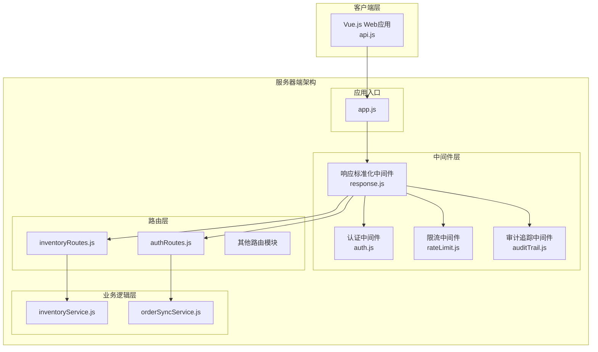
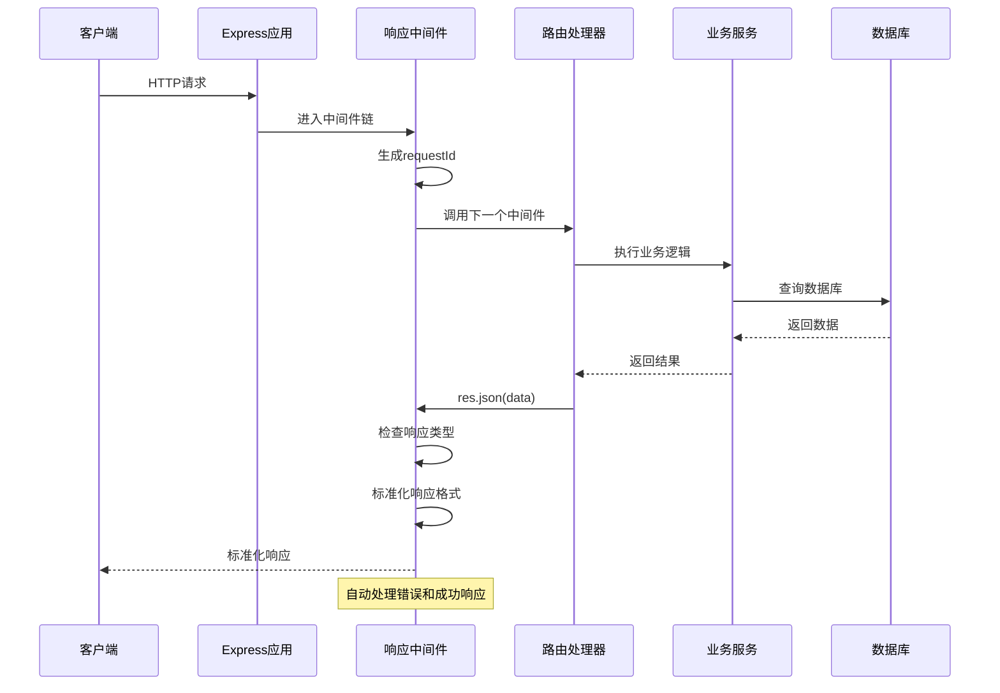
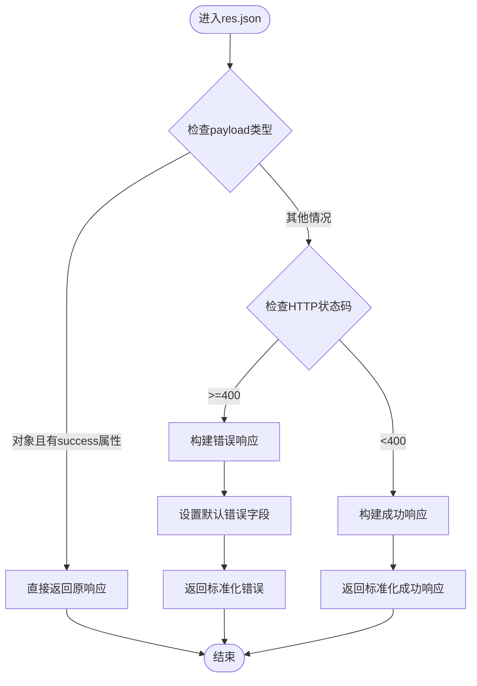
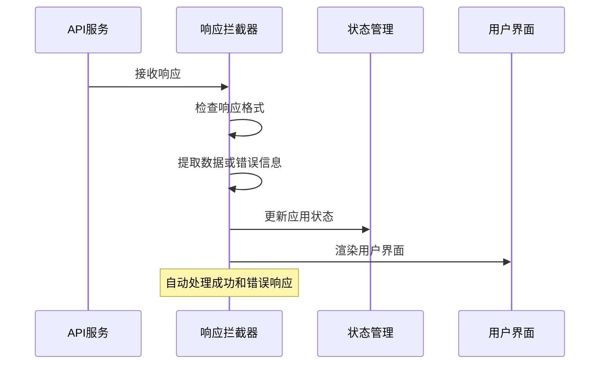
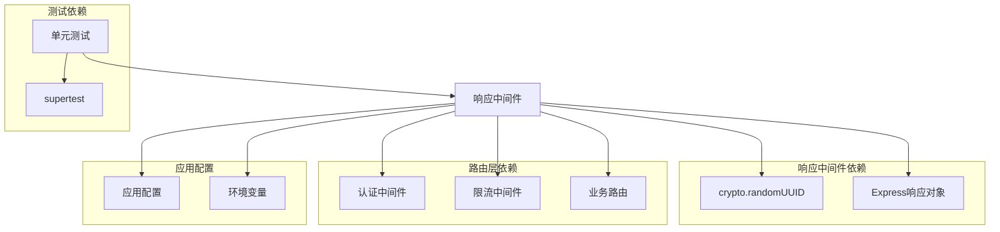

# 响应标准化中间件

<cite>
**本文档引用的文件**
- [response.js](file://server/src/middleware/response.js)
- [app.js](file://server/src/app.js)
- [middleware.test.js](file://server/test/middleware.test.js)
- [inventoryRoutes.js](file://server/src/routes/inventoryRoutes.js)
- [authRoutes.js](file://server/src/routes/authRoutes.js)
- [rateLimit.js](file://server/src/middleware/rateLimit.js)
- [api.js](file://web/src/services/api.js)
- [README.md](file://README.md)
</cite>

## 目录
1. [简介](#简介)
2. [项目结构](#项目结构)
3. [核心组件](#核心组件)
4. [架构概览](#架构概览)
5. [详细组件分析](#详细组件分析)
6. [依赖关系分析](#依赖关系分析)
7. [性能考虑](#性能考虑)
8. [故障排除指南](#故障排除指南)
9. [结论](#结论)

## 简介

库存管理系统响应标准化中间件是整个API架构的核心组件，负责统一所有HTTP响应的格式和行为。该中间件通过拦截Express应用的所有响应，确保前后端之间的数据交互遵循一致的协议规范，提供标准化的成功响应和错误响应格式。

该中间件的设计理念基于以下原则：
- **一致性**：所有API响应都遵循相同的结构
- **可预测性**：前端可以可靠地解析任何响应
- **可扩展性**：支持自定义响应格式和错误类型
- **安全性**：隐藏内部错误细节，仅向客户端提供必要的信息

## 项目结构

库存管理系统的响应标准化中间件位于服务器端的中间件层，与路由层和业务逻辑层紧密集成。

**图表来源**
- [response.js:1-62](file://server/src/middleware/response.js#L1-L62)
- [app.js:1-67](file://server/src/app.js#L1-L67)
- [inventoryRoutes.js:1-493](file://server/src/routes/inventoryRoutes.js#L1-L493)
- [authRoutes.js:1-72](file://server/src/routes/authRoutes.js#L1-L72)

**章节来源**
- [app.js:28-34](file://server/src/app.js#L28-L34)
- [README.md:22-29](file://README.md#L22-L29)

## 核心组件

响应标准化中间件由三个主要部分组成：

### 1. 基础响应包装器
- **功能**：自动包装所有响应数据
- **特性**：保持原始响应状态码，统一响应结构
- **实现**：通过劫持`res.json()`方法实现

### 2. 成功响应处理器
- **功能**：标准化成功响应格式
- **结构**：包含`success`标志、`data`主体和`requestId`
- **用途**：简化前端数据处理逻辑

### 3. 错误响应处理器
- **功能**：标准化错误响应格式
- **结构**：包含`success`标志、`code`错误代码、`message`消息和`details`详情
- **智能识别**：自动检测HTTP状态码并转换为标准错误格式

**章节来源**
- [response.js:3-57](file://server/src/middleware/response.js#L3-L57)

## 架构概览

响应标准化中间件在整个系统中的位置和作用如下：

**图表来源**
- [response.js:9-34](file://server/src/middleware/response.js#L9-L34)
- [app.js:32](file://server/src/app.js#L32)

## 详细组件分析

### 响应中间件核心实现

响应中间件通过以下机制实现响应标准化：

#### 请求ID生成和传播
- 使用`crypto.randomUUID()`生成唯一请求标识符
- 将请求ID设置到`req.requestId`属性
- 通过`x-request-id`响应头传递给客户端

#### 响应拦截机制
- 劫持`res.json()`方法，替换为自定义实现
- 保留原始`res.json`方法引用，用于转发未标准化的响应
- 实现智能响应格式判断逻辑

#### 成功响应标准化流程

**图表来源**
- [response.js:9-34](file://server/src/middleware/response.js#L9-L34)

#### 错误响应标准化流程

错误响应处理具有以下特点：
- 自动检测HTTP状态码≥400的情况
- 提供默认错误消息和代码
- 支持自定义错误详情对象
- 包含完整的请求追踪信息

#### 辅助方法实现

中间件提供了两个便捷方法：

1. **res.success()**：专门用于成功响应
   - 参数：数据内容、HTTP状态码（默认200）
   - 自动设置`success: true`

2. **res.fail()**：专门用于错误响应
   - 参数：错误代码、消息、详情对象、HTTP状态码（默认400）
   - 自动设置`success: false`

**章节来源**
- [response.js:36-54](file://server/src/middleware/response.js#L36-L54)

### 错误处理机制

系统采用多层次的错误处理策略：

#### 应用级错误处理
- 全局错误处理中间件捕获未处理异常
- 使用`res.fail()`方法返回标准化错误
- 避免向客户端暴露内部错误详情

#### 中间件级错误处理
- 限流中间件使用`res.fail()`返回特定错误类型
- 认证中间件返回相应的HTTP状态码和错误信息

#### 路由级错误处理
- 路由处理器根据业务逻辑返回适当的HTTP状态码
- 中间件自动将其转换为标准化格式

**章节来源**
- [app.js:57-64](file://server/src/app.js#L57-L64)
- [rateLimit.js:26-28](file://server/src/middleware/rateLimit.js#L26-L28)

### 前后端数据交互最佳实践

#### 前端响应拦截器设计

前端Vue.js应用实现了对应的响应拦截器：

**图表来源**
- [api.js:26-42](file://web/src/services/api.js#L26-L42)

#### 数据格式约定

前端拦截器遵循以下约定：
- 检测`payload.success`布尔值
- 成功响应：提取`payload.data`作为实际数据
- 错误响应：使用`payload.message`作为错误消息
- 保持响应头和状态码不变

**章节来源**
- [api.js:26-42](file://web/src/services/api.js#L26-L42)

## 依赖关系分析

响应中间件与其他系统组件的依赖关系如下：

**图表来源**
- [response.js:1](file://server/src/middleware/response.js#L1)
- [app.js:8](file://server/src/app.js#L8)

### 关键依赖关系

1. **UUID生成依赖**：使用Node.js内置的`crypto`模块
2. **Express集成依赖**：深度集成Express响应对象
3. **中间件链依赖**：在中间件链中的特定位置执行
4. **路由依赖**：为所有路由提供统一响应格式
5. **测试依赖**：通过单元测试验证功能正确性

**章节来源**
- [response.js:1](file://server/src/middleware/response.js#L1)
- [middleware.test.js:6](file://server/test/middleware.test.js#L6)

## 性能考虑

响应标准化中间件在设计时充分考虑了性能影响：

### 内存使用优化
- 使用函数绑定技术避免创建新的闭包
- 复用原始`res.json`方法引用
- 避免不必要的对象复制操作

### 执行效率
- 响应拦截仅在必要时进行格式转换
- 使用简单的条件判断减少分支开销
- 避免复杂的字符串操作和正则表达式

### 内存泄漏防护
- 不在请求对象上存储大量临时数据
- 及时释放中间件链中的引用
- 避免循环引用的创建

## 故障排除指南

### 常见问题诊断

#### 响应格式不一致
**症状**：某些API响应没有遵循标准格式
**原因**：直接调用`res.json()`而非使用辅助方法
**解决方案**：确保所有响应都通过中间件处理

#### 错误信息泄露
**症状**：客户端收到内部错误详情
**原因**：全局错误处理未正确配置
**解决方案**：检查应用级错误处理中间件

#### 请求ID缺失
**症状**：响应头缺少`x-request-id`
**原因**：中间件未正确初始化
**解决方案**：确认中间件在应用配置中的位置

**章节来源**
- [middleware.test.js:9-35](file://server/test/middleware.test.js#L9-L35)

### 调试技巧

1. **启用详细日志**：使用`morgan`中间件查看请求处理过程
2. **检查中间件顺序**：确保响应中间件在路由之前注册
3. **验证请求ID传播**：检查响应头是否包含正确的请求ID
4. **测试错误场景**：模拟各种错误情况验证响应格式

**章节来源**
- [app.js:32](file://server/src/app.js#L32)

## 结论

库存管理系统的响应标准化中间件是一个精心设计的架构组件，它通过统一的响应格式和错误处理机制，显著提升了系统的可维护性和用户体验。该中间件的主要优势包括：

### 设计优势
- **一致性**：确保所有API响应遵循相同格式
- **可预测性**：前端可以可靠地处理任何响应
- **可扩展性**：支持自定义响应格式和错误类型
- **安全性**：隐藏内部错误细节，保护系统安全

### 技术特色
- **智能响应识别**：自动区分成功和错误响应
- **请求追踪**：完整的请求ID跟踪机制
- **错误标准化**：统一的错误代码和消息格式
- **前后端协作**：与前端拦截器完美配合

### 最佳实践建议
1. **始终使用中间件**：不要绕过响应中间件直接发送响应
2. **合理使用辅助方法**：使用`res.success()`和`res.fail()`提高代码可读性
3. **保持错误信息简洁**：避免向客户端暴露敏感的内部错误详情
4. **监控响应质量**：定期检查响应格式的一致性和完整性

该中间件为整个库存管理系统的API层奠定了坚实的基础，确保了前后端交互的稳定性和可靠性。