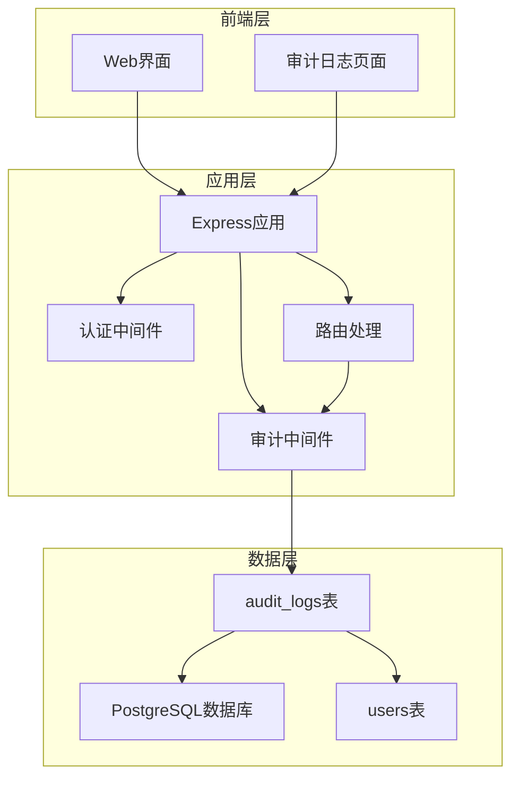
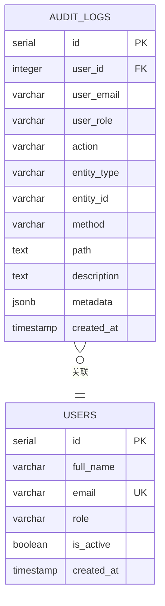
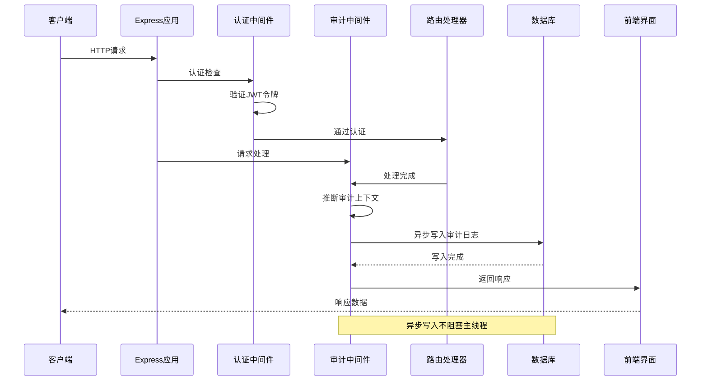
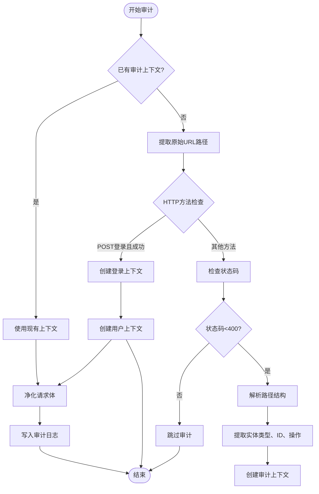
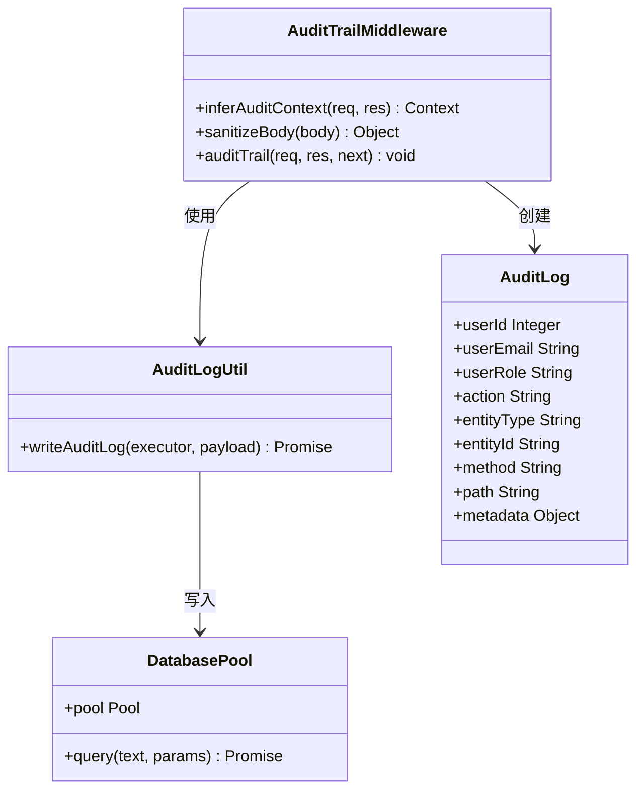
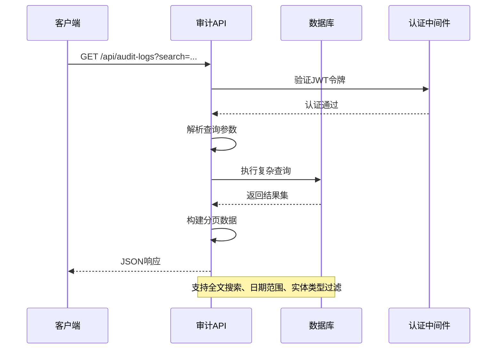
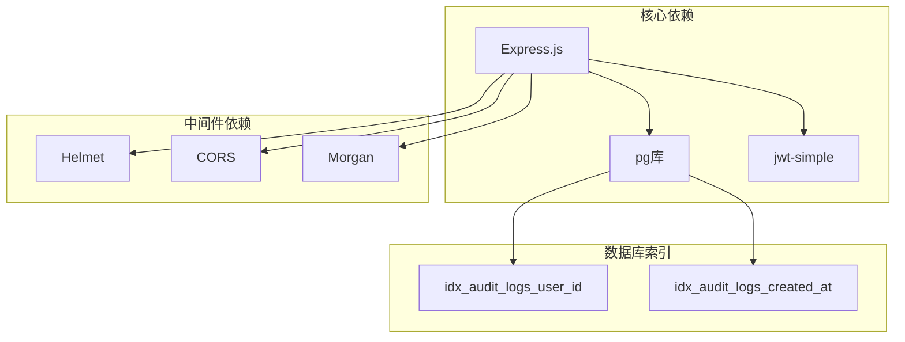
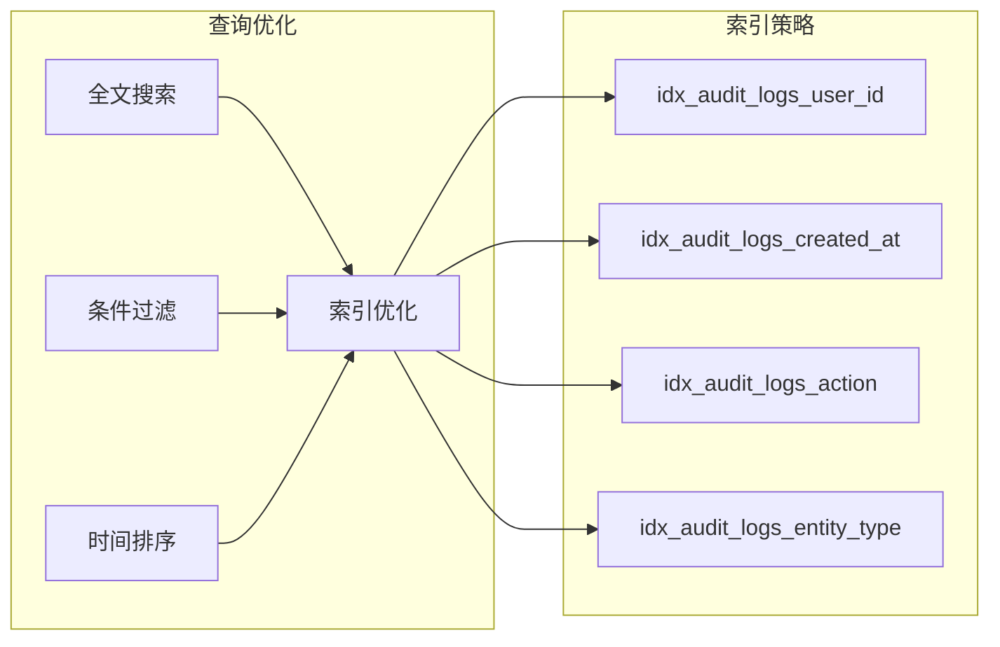

# 审计追踪中间件

<cite>
**本文档引用的文件**
- [auditTrail.js](file://server/src/middleware/auditTrail.js)
- [auditLog.js](file://server/src/utils/auditLog.js)
- [auditRoutes.js](file://server/src/routes/auditRoutes.js)
- [auth.js](file://server/src/middleware/auth.js)
- [db.js](file://server/src/config/db.js)
- [schema.sql](file://server/database/schema.sql)
- [app.js](file://server/src/app.js)
- [AuditLogsPage.vue](file://web/src/pages/AuditLogsPage.vue)
- [pagination.js](file://server/src/utils/pagination.js)
- [package.json](file://server/package.json)
- [authRoutes.js](file://server/src/routes/authRoutes.js)
</cite>

## 目录
1. [简介](#简介)
2. [项目结构](#项目结构)
3. [核心组件](#核心组件)
4. [架构概览](#架构概览)
5. [详细组件分析](#详细组件分析)
6. [依赖关系分析](#依赖关系分析)
7. [性能考虑](#性能考虑)
8. [故障排除指南](#故障排除指南)
9. [结论](#结论)
10. [附录](#附录)

## 简介

库存管理系统审计追踪中间件是一个关键的安全和合规组件，负责捕获和记录所有用户操作的详细信息。该系统实现了完整的操作日志记录机制，包括请求信息捕获、用户身份记录和操作详情追踪，为系统提供了强大的审计能力和合规性保障。

该中间件采用异步写入策略，确保不会阻塞正常的业务流程，同时通过智能的上下文推断机制自动识别各种操作类型，包括登录、库存盘点、告警更新等关键业务操作。

## 项目结构

审计追踪系统在整体项目架构中的位置如下：



**图表来源**
- [app.js:26-56](file://server/src/app.js#L26-L56)
- [auditTrail.js:47-79](file://server/src/middleware/auditTrail.js#L47-L79)
- [schema.sql:275-288](file://server/database/schema.sql#L275-L288)

**章节来源**
- [app.js:1-67](file://server/src/app.js#L1-L67)
- [auditTrail.js:1-84](file://server/src/middleware/auditTrail.js#L1-L84)

## 核心组件

### 审计中间件核心功能

审计中间件作为Express中间件，具备以下核心功能：

1. **请求拦截**: 在请求处理完成后捕获相关信息
2. **上下文推断**: 智能识别操作类型和实体信息
3. **数据净化**: 隐藏敏感信息（如密码）
4. **异步写入**: 不阻塞主线程的数据库写入
5. **错误处理**: 容错处理，不影响正常业务流程

### 数据模型设计

审计日志采用灵活的数据结构设计，支持JSONB格式的元数据存储：



**图表来源**
- [schema.sql:275-288](file://server/database/schema.sql#L275-L288)
- [auditLog.js:4-33](file://server/src/utils/auditLog.js#L4-L33)

**章节来源**
- [auditTrail.js:14-45](file://server/src/middleware/auditTrail.js#L14-L45)
- [auditLog.js:1-38](file://server/src/utils/auditLog.js#L1-L38)
- [schema.sql:275-288](file://server/database/schema.sql#L275-L288)

## 架构概览

审计追踪系统的整体架构采用中间件模式，与业务逻辑完全解耦：



**图表来源**
- [app.js:34](file://server/src/app.js#L34)
- [auditTrail.js:47-79](file://server/src/middleware/auditTrail.js#L47-L79)
- [auditLog.js:1-38](file://server/src/utils/auditLog.js#L1-L38)

## 详细组件分析

### 审计中间件实现

审计中间件通过事件监听机制捕获请求处理完成后的状态：

#### 上下文推断算法



**图表来源**
- [auditTrail.js:14-45](file://server/src/middleware/auditTrail.js#L14-L45)
- [auditTrail.js:47-79](file://server/src/middleware/auditTrail.js#L47-L79)

#### 敏感信息处理

中间件内置了智能的敏感信息过滤机制：

- **密码字段隐藏**: 自动检测并替换密码字段
- **自定义过滤规则**: 可扩展的过滤器系统
- **安全优先**: 不在日志中存储任何敏感数据

**章节来源**
- [auditTrail.js:4-12](file://server/src/middleware/auditTrail.js#L4-L12)
- [auditTrail.js:55-76](file://server/src/middleware/auditTrail.js#L55-L76)

### 审计日志存储机制

#### 数据库设计

审计日志表采用PostgreSQL的JSONB类型存储元数据，提供灵活的结构化存储能力：

| 字段名 | 类型 | 约束 | 描述 |
|--------|------|------|------|
| id | serial | 主键 | 日志唯一标识 |
| user_id | integer | 外键(users) | 用户标识 |
| user_email | varchar(150) |  | 用户邮箱 |
| user_role | varchar(20) |  | 用户角色 |
| action | varchar(80) | 必填 | 操作类型 |
| entity_type | varchar(80) | 必填 | 实体类型 |
| entity_id | varchar(120) |  | 实体标识 |
| method | varchar(10) | 必填 | HTTP方法 |
| path | text | 必填 | 请求路径 |
| description | text |  | 操作描述 |
| metadata | jsonb | 默认{} | 结构化元数据 |
| created_at | timestamp | 默认CURRENT_TIMESTAMP | 创建时间 |

#### 异步写入策略



**图表来源**
- [auditTrail.js:47-79](file://server/src/middleware/auditTrail.js#L47-L79)
- [auditLog.js:1-38](file://server/src/utils/auditLog.js#L1-L38)
- [db.js:15-19](file://server/src/config/db.js#L15-L19)

**章节来源**
- [auditLog.js:1-38](file://server/src/utils/auditLog.js#L1-L38)
- [db.js:1-25](file://server/src/config/db.js#L1-L25)

### 审计日志查询接口

#### 后端查询实现

审计日志查询接口提供了强大的搜索和过滤功能：



**图表来源**
- [auditRoutes.js:15-107](file://server/src/routes/auditRoutes.js#L15-L107)

#### 前端查询界面

前端提供了直观的审计日志查询界面，支持多种筛选条件：

- **搜索框**: 支持邮箱、路径、动作的模糊搜索
- **操作类型筛选**: LOGIN、STOCK_COUNT_*、ALERT_*等
- **实体类型筛选**: AUTH、USERS、PRODUCTS、INVENTORY等
- **日期范围筛选**: 开始和结束日期
- **预设筛选器**: 支持保存和重用常用筛选条件

**章节来源**
- [auditRoutes.js:15-107](file://server/src/routes/auditRoutes.js#L15-L107)
- [AuditLogsPage.vue:19-48](file://web/src/pages/AuditLogsPage.vue#L19-L48)

## 依赖关系分析

### 技术栈依赖

审计追踪系统依赖于以下核心技术组件：



**图表来源**
- [package.json:15-25](file://server/package.json#L15-L25)
- [schema.sql:431-432](file://server/database/schema.sql#L431-L432)

### 关键依赖关系

1. **认证集成**: 审计中间件依赖认证中间件提供的用户信息
2. **数据库连接**: 使用连接池进行高效的数据库操作
3. **路由集成**: 与所有业务路由无缝集成
4. **前端交互**: 提供RESTful API供前端查询使用

**章节来源**
- [package.json:15-25](file://server/package.json#L15-L25)
- [auth.js:5-29](file://server/src/middleware/auth.js#L5-L29)

## 性能考虑

### 异步写入优化

审计中间件采用了非阻塞的异步写入策略：

- **事件驱动**: 使用`res.on('finish')`事件确保在响应发送后才写入日志
- **Promise处理**: 所有数据库操作都返回Promise，避免阻塞主线程
- **错误隔离**: 写入失败不影响主要业务流程，仅记录错误日志

### 批量处理策略

虽然当前实现是单条记录写入，但系统设计支持未来的批量处理优化：

- **队列机制**: 可以引入消息队列进行批量处理
- **缓冲策略**: 支持内存缓冲减少数据库连接开销
- **背压处理**: 在高负载时自动降级处理

### 查询性能优化



**图表来源**
- [schema.sql:431-432](file://server/database/schema.sql#L431-L432)
- [auditRoutes.js:21-34](file://server/src/routes/auditRoutes.js#L21-L34)

**章节来源**
- [auditRoutes.js:66-98](file://server/src/routes/auditRoutes.js#L66-L98)
- [schema.sql:431-432](file://server/database/schema.sql#L431-L432)

## 故障排除指南

### 常见问题及解决方案

#### 审计日志未记录

**可能原因**:
1. 审计中间件未正确注册
2. 认证失败导致用户信息缺失
3. 数据库连接异常

**解决步骤**:
1. 检查中间件注册顺序
2. 验证JWT令牌有效性
3. 确认数据库连接状态

#### 查询性能问题

**症状**: 审计日志查询响应缓慢

**优化建议**:
1. 使用适当的分页参数
2. 添加合适的索引
3. 限制查询时间范围

#### 数据完整性问题

**症状**: 部分操作未被审计

**排查方法**:
1. 检查HTTP状态码过滤逻辑
2. 验证请求路径映射
3. 确认中间件执行顺序

**章节来源**
- [auditTrail.js:30-32](file://server/src/middleware/auditTrail.js#L30-L32)
- [auditRoutes.js:104-106](file://server/src/routes/auditRoutes.js#L104-L106)

## 结论

库存管理系统的审计追踪中间件提供了一个完整、高效且合规的审计解决方案。通过智能的上下文推断、灵活的数据存储和强大的查询功能，该系统能够满足现代企业对操作审计的各种需求。

### 主要优势

1. **非侵入式设计**: 中间件模式确保与业务逻辑完全解耦
2. **智能上下文推断**: 自动识别各种操作类型，减少手动配置
3. **高性能设计**: 异步写入和索引优化确保系统性能
4. **合规性保障**: 完整的操作记录满足审计要求
5. **用户体验友好**: 直观的前端查询界面

### 未来改进方向

1. **批量处理**: 实现日志队列和批量写入
2. **实时监控**: 添加审计日志的实时监控功能
3. **高级分析**: 提供更丰富的数据分析和报告功能
4. **数据保留策略**: 实现自动化的日志清理和归档

## 附录

### API参考

#### 审计日志查询接口

**GET** `/api/audit-logs`

**查询参数**:
- `search`: 搜索关键词
- `action`: 操作类型
- `entityType`: 实体类型
- `startDate`: 开始日期
- `endDate`: 结束日期
- `page`: 页码
- `pageSize`: 每页数量
- `all`: 是否查询全部数据

**响应示例**:
```json
{
  "items": [
    {
      "id": 1,
      "user_id": 1,
      "user_email": "admin@example.com",
      "user_role": "ADMIN",
      "action": "LOGIN",
      "entity_type": "AUTH",
      "entity_id": null,
      "method": "POST",
      "path": "/api/auth/login",
      "description": "User logged in",
      "metadata": {},
      "created_at": "2024-01-01T00:00:00Z"
    }
  ],
  "pagination": {
    "total": 100,
    "page": 1,
    "pageSize": 10,
    "totalPages": 10
  }
}
```

### 配置选项

#### 环境变量

- `DATABASE_URL`: 数据库连接字符串
- `JWT_SECRET`: JWT令牌密钥
- `PGSSLMODE`: PostgreSQL SSL模式
- `PG_CONNECT_TIMEOUT_MS`: 连接超时时间

#### 数据库索引

系统自动创建了以下索引以优化查询性能：
- `idx_audit_logs_user_id`: 按用户ID查询
- `idx_audit_logs_created_at`: 按时间排序
- 其他业务相关索引

**章节来源**
- [.env.example:1-4](file://server/.env.example#L1-L4)
- [schema.sql:431-432](file://server/database/schema.sql#L431-L432)