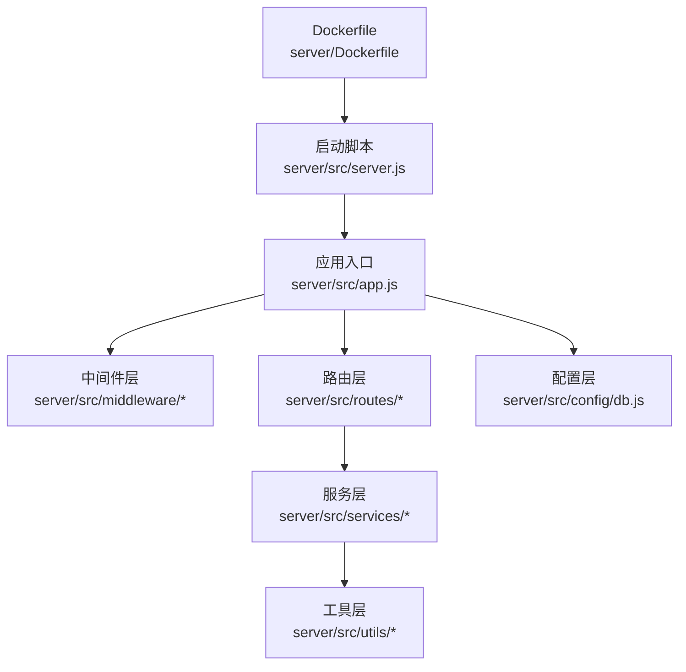
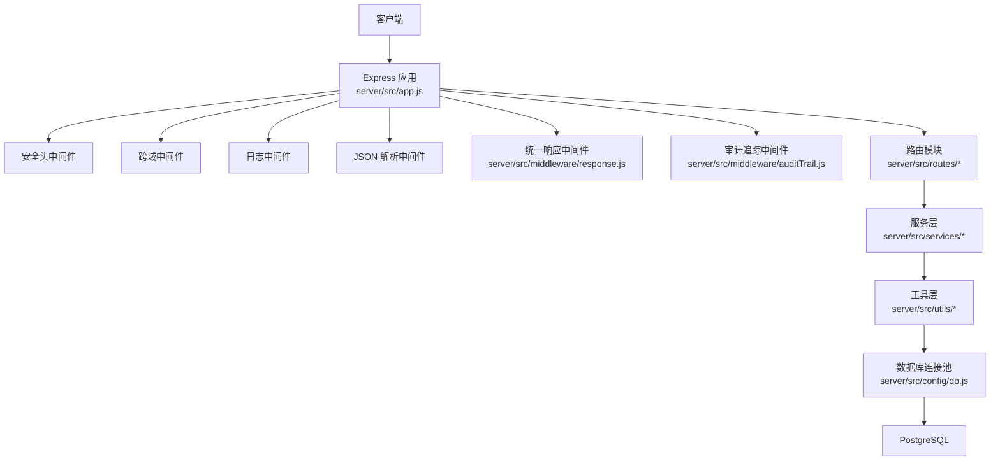
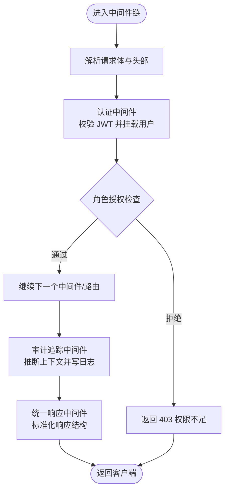
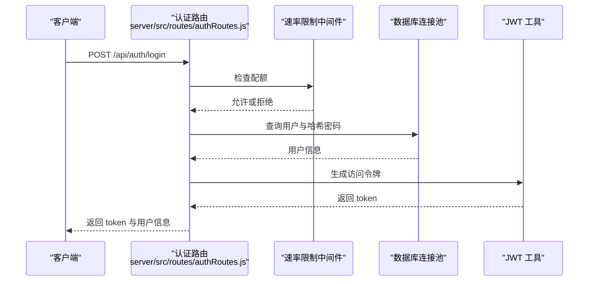
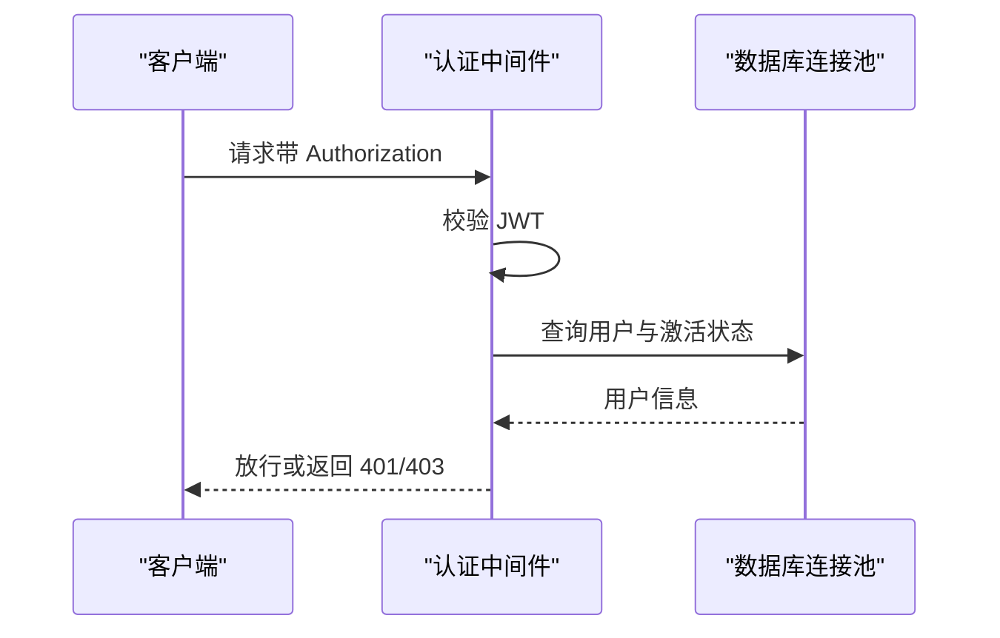
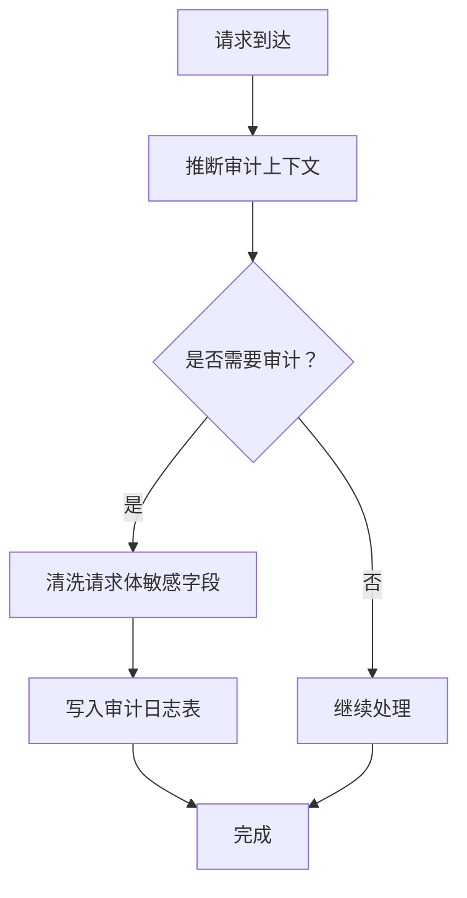
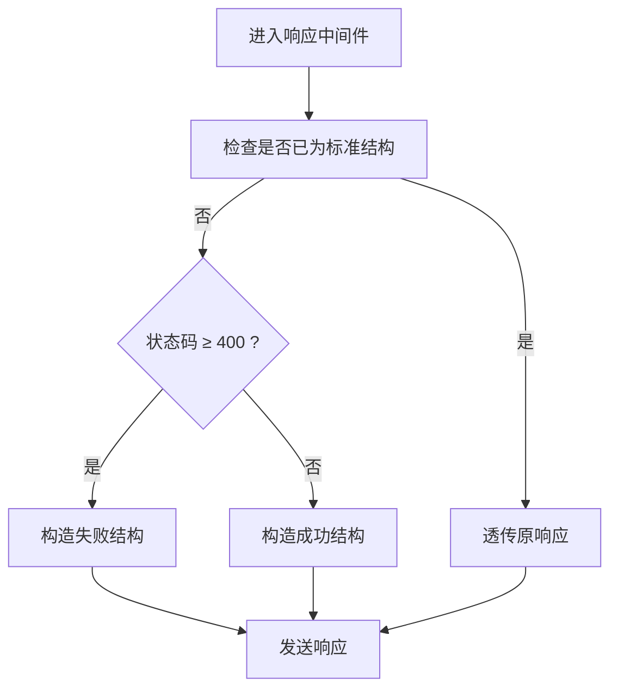
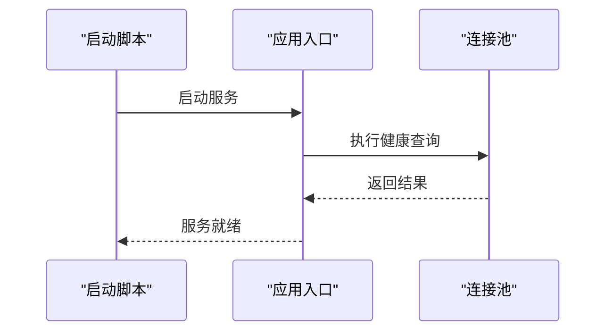
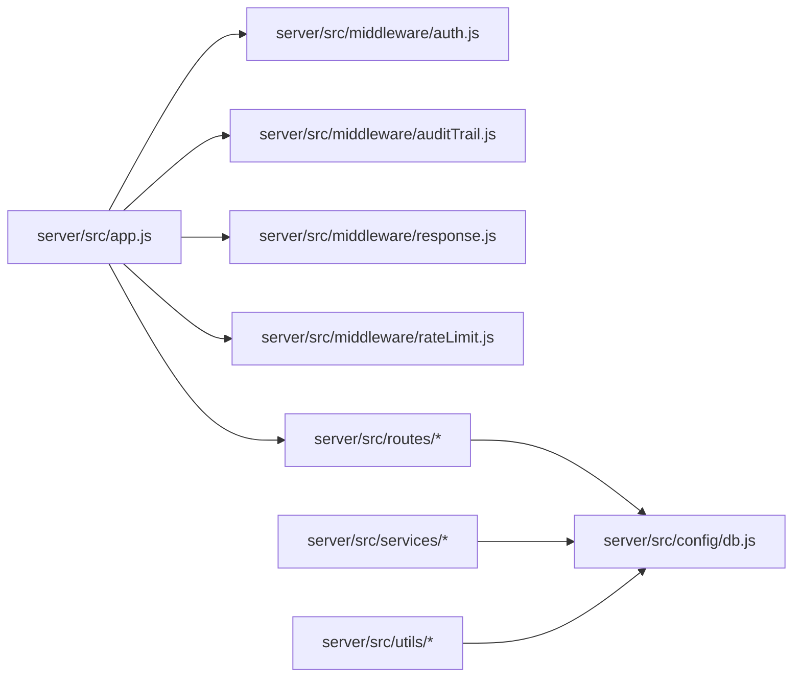

# 后端架构

<cite>
**本文引用的文件**
- [server/src/app.js](file://server/src/app.js)
- [server/src/server.js](file://server/src/server.js)
- [server/src/config/db.js](file://server/src/config/db.js)
- [server/src/middleware/auth.js](file://server/src/middleware/auth.js)
- [server/src/middleware/response.js](file://server/src/middleware/response.js)
- [server/src/middleware/auditTrail.js](file://server/src/middleware/auditTrail.js)
- [server/src/middleware/rateLimit.js](file://server/src/middleware/rateLimit.js)
- [server/src/routes/authRoutes.js](file://server/src/routes/authRoutes.js)
- [server/src/utils/auditLog.js](file://server/src/utils/auditLog.js)
- [server/src/utils/inventoryService.js](file://server/src/utils/inventoryService.js)
- [server/src/utils/pagination.js](file://server/src/utils/pagination.js)
- [server/src/services/marketplaceSyncService.js](file://server/src/services/marketplaceSyncService.js)
- [server/src/services/orderSyncService.js](file://server/src/services/orderSyncService.js)
- [server/package.json](file://server/package.json)
- [server/Dockerfile](file://server/Dockerfile)
</cite>

## 目录
1. [简介](#简介)
2. [项目结构](#项目结构)
3. [核心组件](#核心组件)
4. [架构总览](#架构总览)
5. [详细组件分析](#详细组件分析)
6. [依赖关系分析](#依赖关系分析)
7. [性能考量](#性能考量)
8. [故障排查指南](#故障排查指南)
9. [结论](#结论)
10. [附录](#附录)

## 简介
本仓库为库存管理系统的后端，采用 Express.js 构建 RESTful API，围绕“中间件—路由—控制器”模式组织代码；通过统一响应中间件实现响应标准化，结合审计追踪中间件记录关键操作；使用 PostgreSQL 连接池进行数据库访问与事务封装；提供认证授权、速率限制、健康检查等基础能力。系统支持市场渠道库存与订单同步、分页与库存服务工具函数，具备良好的扩展性与可维护性。

## 项目结构
后端以模块化方式组织，核心目录如下：
- config：数据库连接配置（PostgreSQL 连接池）
- middleware：通用中间件（认证、响应标准化、审计追踪、速率限制）
- routes：按功能域划分的路由模块（如 auth、inventory、orders、reports 等）
- services：领域服务（如市场渠道同步）
- utils：通用工具（审计日志写入、库存操作、分页）
- src/app.js：应用入口与中间件装配
- src/server.js：启动脚本与数据库连通性校验
- package.json：依赖与脚本定义
- Dockerfile：容器化构建

图表来源
- [server/src/app.js:1-67](file://server/src/app.js#L1-L67)
- [server/src/server.js:1-28](file://server/src/server.js#L1-L28)
- [server/src/config/db.js:1-25](file://server/src/config/db.js#L1-L25)

章节来源
- [server/src/app.js:1-67](file://server/src/app.js#L1-L67)
- [server/src/server.js:1-28](file://server/src/server.js#L1-L28)
- [server/src/config/db.js:1-25](file://server/src/config/db.js#L1-L25)
- [server/package.json:1-31](file://server/package.json#L1-L31)
- [server/Dockerfile:1-13](file://server/Dockerfile#L1-L13)

## 核心组件
- 应用入口与中间件装配：集中注册安全头、CORS、日志、JSON 解析、统一响应与审计中间件，并挂载各路由模块。
- 数据库连接：基于 pg 的连接池，自动判断 SSL 配置，支持超时与连接参数配置。
- 认证授权：基于 JWT 的令牌校验与角色授权中间件，确保受保护资源访问安全。
- 审计追踪：在请求完成后异步记录用户行为、实体类型、方法、路径与元数据。
- 统一响应：标准化成功/失败响应结构，注入请求 ID，便于问题定位与链路追踪。
- 速率限制：基于内存桶的滑动窗口限流，支持命名空间与重试时间提示。
- 服务与工具：库存服务封装、分页工具、市场渠道同步服务（含订单与库存）。

章节来源
- [server/src/app.js:1-67](file://server/src/app.js#L1-L67)
- [server/src/config/db.js:1-25](file://server/src/config/db.js#L1-L25)
- [server/src/middleware/auth.js:1-46](file://server/src/middleware/auth.js#L1-L46)
- [server/src/middleware/response.js:1-62](file://server/src/middleware/response.js#L1-L62)
- [server/src/middleware/auditTrail.js:1-84](file://server/src/middleware/auditTrail.js#L1-L84)
- [server/src/middleware/rateLimit.js:1-40](file://server/src/middleware/rateLimit.js#L1-L40)
- [server/src/utils/auditLog.js:1-38](file://server/src/utils/auditLog.js#L1-L38)
- [server/src/utils/inventoryService.js:1-45](file://server/src/utils/inventoryService.js#L1-L45)
- [server/src/utils/pagination.js:1-28](file://server/src/utils/pagination.js#L1-L28)
- [server/src/services/marketplaceSyncService.js:1-146](file://server/src/services/marketplaceSyncService.js#L1-L146)
- [server/src/services/orderSyncService.js:1-119](file://server/src/services/orderSyncService.js#L1-L119)

## 架构总览
下图展示从客户端到数据库的整体调用链路与关键组件交互：

图表来源
- [server/src/app.js:1-67](file://server/src/app.js#L1-L67)
- [server/src/middleware/response.js:1-62](file://server/src/middleware/response.js#L1-L62)
- [server/src/middleware/auditTrail.js:1-84](file://server/src/middleware/auditTrail.js#L1-L84)
- [server/src/config/db.js:1-25](file://server/src/config/db.js#L1-L25)

## 详细组件分析

### 中间件体系
- 认证中间件
  - 功能：解析 Authorization 头中的 Bearer Token，验证签名，查询用户并挂载到请求对象；对未激活用户拒绝访问。
  - 角色授权：提供基于角色的访问控制，用于菜单级权限控制。
- 审计追踪中间件
  - 功能：在响应完成事件中推断上下文（动作、实体类型、实体 ID），清洗敏感字段，写入审计日志表。
  - 上下文推断：根据路径与方法自动映射实体与动作，支持登录成功场景特殊标注。
- 统一响应中间件
  - 功能：为所有响应注入请求 ID；将任意返回值标准化为统一结构；提供 success/fail 辅助方法。
  - 错误处理：对状态码大于等于 400 自动转换为失败结构，保留原始错误细节。
- 速率限制中间件
  - 功能：基于客户端 IP 与命名空间的滑动窗口限流；超过阈值返回 429 并提示重试秒数。

图表来源
- [server/src/middleware/auth.js:1-46](file://server/src/middleware/auth.js#L1-L46)
- [server/src/middleware/auditTrail.js:1-84](file://server/src/middleware/auditTrail.js#L1-L84)
- [server/src/middleware/response.js:1-62](file://server/src/middleware/response.js#L1-L62)
- [server/src/middleware/rateLimit.js:1-40](file://server/src/middleware/rateLimit.js#L1-L40)

章节来源
- [server/src/middleware/auth.js:1-46](file://server/src/middleware/auth.js#L1-L46)
- [server/src/middleware/response.js:1-62](file://server/src/middleware/response.js#L1-L62)
- [server/src/middleware/auditTrail.js:1-84](file://server/src/middleware/auditTrail.js#L1-L84)
- [server/src/middleware/rateLimit.js:1-40](file://server/src/middleware/rateLimit.js#L1-L40)

### 路由组织与控制器模式
- 路由组织：按功能域拆分路由模块，统一前缀 /api，便于扩展与维护。
- 控制器模式：路由内部采用 async/await 处理请求，结合中间件完成鉴权、限流与审计；返回值通过统一响应中间件标准化。
- 示例：认证路由模块包含登录与获取当前用户信息两个端点，登录端点内置速率限制。

图表来源
- [server/src/routes/authRoutes.js:1-72](file://server/src/routes/authRoutes.js#L1-L72)
- [server/src/middleware/rateLimit.js:1-40](file://server/src/middleware/rateLimit.js#L1-L40)
- [server/src/config/db.js:1-25](file://server/src/config/db.js#L1-L25)

章节来源
- [server/src/routes/authRoutes.js:1-72](file://server/src/routes/authRoutes.js#L1-L72)

### 认证与授权机制
- 认证流程：客户端携带 Bearer Token；中间件解析并验证；查询用户并校验是否激活；通过后将用户信息挂载到请求对象。
- 授权流程：基于角色的访问控制，适用于后台菜单级权限。
- 安全建议：生产环境应启用 HTTPS、合理设置 JWT 过期时间与刷新策略、定期轮换密钥。

图表来源
- [server/src/middleware/auth.js:1-46](file://server/src/middleware/auth.js#L1-L46)
- [server/src/config/db.js:1-25](file://server/src/config/db.js#L1-L25)

章节来源
- [server/src/middleware/auth.js:1-46](file://server/src/middleware/auth.js#L1-L46)

### 审计追踪系统
- 写入时机：在响应完成事件中异步写入，避免阻塞主请求处理。
- 上下文推断：根据路径与方法推断实体类型与动作，支持登录成功场景特殊标注。
- 敏感信息处理：对请求体中的敏感字段进行脱敏。
- 存储结构：包含用户标识、角色、动作、实体类型、实体 ID、HTTP 方法、路径、描述与元数据。

图表来源
- [server/src/middleware/auditTrail.js:1-84](file://server/src/middleware/auditTrail.js#L1-L84)
- [server/src/utils/auditLog.js:1-38](file://server/src/utils/auditLog.js#L1-L38)

章节来源
- [server/src/middleware/auditTrail.js:1-84](file://server/src/middleware/auditTrail.js#L1-L84)
- [server/src/utils/auditLog.js:1-38](file://server/src/utils/auditLog.js#L1-L38)

### 响应标准化中间件
- 成功响应：统一包装 success 与 data 字段，并附带请求 ID。
- 失败响应：当状态码 ≥ 400 时，自动转换为统一失败结构，包含 code、message、details 与 requestId。
- 辅助方法：提供 res.success 与 res.fail 快捷方法，简化控制器编写。

图表来源
- [server/src/middleware/response.js:1-62](file://server/src/middleware/response.js#L1-L62)

章节来源
- [server/src/middleware/response.js:1-62](file://server/src/middleware/response.js#L1-L62)

### 数据库连接管理与事务处理
- 连接池配置：自动判断 SSL（本地/生产/显式配置），支持连接超时配置。
- 启动时校验：启动阶段执行一次数据库查询以确认可用性，超时则优雅退出。
- 事务封装：库存服务提供统一的库存行确保、查询与更新方法，便于在事务中复用。

图表来源
- [server/src/server.js:1-28](file://server/src/server.js#L1-L28)
- [server/src/config/db.js:1-25](file://server/src/config/db.js#L1-L25)

章节来源
- [server/src/server.js:1-28](file://server/src/server.js#L1-L28)
- [server/src/config/db.js:1-25](file://server/src/config/db.js#L1-L25)
- [server/src/utils/inventoryService.js:1-45](file://server/src/utils/inventoryService.js#L1-L45)

### 并发控制与一致性
- 乐观锁与冲突处理：库存更新使用原子 UPDATE，避免竞态；库存行通过 INSERT...ON CONFLICT 确保存在性。
- 服务层幂等：市场渠道同步服务对订单写入使用 ON CONFLICT 更新，保证重复同步不产生重复数据。
- 建议：对高并发写入场景引入分布式锁或队列化处理，避免热点 SKU 的竞争。

章节来源
- [server/src/utils/inventoryService.js:1-45](file://server/src/utils/inventoryService.js#L1-L45)
- [server/src/services/orderSyncService.js:1-119](file://server/src/services/orderSyncService.js#L1-L119)

### API 版本控制与错误处理
- 版本控制：当前路由前缀为 /api，未见明确版本号路径；建议后续引入 /api/v1 等前缀以支持多版本并行。
- 统一错误处理：应用级错误中间件捕获异常，优先使用统一响应失败结构，避免泄露堆栈细节。
- 健康检查：提供 /api/health 端点，便于探活与编排系统监控。

章节来源
- [server/src/app.js:1-67](file://server/src/app.js#L1-L67)

### 微服务化设计思路
- 模块化组织：现有按功能域拆分的路由与服务已具备良好内聚性，适合作为微服务边界的基础。
- 依赖注入：可在应用入口集中初始化服务实例与配置，通过工厂或模块导出的方式注入到路由与控制器。
- 服务拆分：可将市场渠道同步、订单处理、库存计算等作为独立服务，通过消息队列或 HTTP 接口通信。
- 配置管理：将环境变量与连接串集中管理，支持动态配置与灰度发布。

（本节为概念性内容，无需文件引用）

### 性能优化与缓存策略
- 连接池优化：合理设置最大连接数、空闲回收与超时参数，避免连接争用。
- 缓存策略：对只读数据（如字典、配置、静态清单）引入 Redis 缓存；对热点查询结果做短期缓存。
- 分页与索引：对列表查询使用分页与合适索引，避免全表扫描。
- 异步与批处理：对批量导入/同步场景采用流水线与分片，降低单次峰值压力。

（本节为通用指导，无需文件引用）

## 依赖关系分析
- 应用入口依赖中间件、路由与统一错误处理。
- 路由依赖认证中间件、速率限制与数据库查询。
- 服务层依赖数据库查询与工具函数。
- 工具层依赖数据库连接池与 JSON 序列化。

图表来源
- [server/src/app.js:1-67](file://server/src/app.js#L1-L67)
- [server/src/middleware/auth.js:1-46](file://server/src/middleware/auth.js#L1-L46)
- [server/src/middleware/auditTrail.js:1-84](file://server/src/middleware/auditTrail.js#L1-L84)
- [server/src/middleware/response.js:1-62](file://server/src/middleware/response.js#L1-L62)
- [server/src/middleware/rateLimit.js:1-40](file://server/src/middleware/rateLimit.js#L1-L40)
- [server/src/config/db.js:1-25](file://server/src/config/db.js#L1-L25)

章节来源
- [server/src/app.js:1-67](file://server/src/app.js#L1-L67)
- [server/src/config/db.js:1-25](file://server/src/config/db.js#L1-L25)

## 性能考量
- 启动时数据库连通性校验：在启动阶段快速失败，避免长时间等待导致的不可用。
- 连接池参数：根据并发与延迟要求调整连接数与超时，避免连接饥饿。
- 日志与审计：审计写入为异步，减少对主请求的影响；建议对高频写入场景增加缓冲或异步队列。
- 速率限制：针对登录等高风险端点设置更严格的配额，防止暴力破解与滥用。

章节来源
- [server/src/server.js:1-28](file://server/src/server.js#L1-L28)
- [server/src/config/db.js:1-25](file://server/src/config/db.js#L1-L25)
- [server/src/middleware/rateLimit.js:1-40](file://server/src/middleware/rateLimit.js#L1-L40)
- [server/src/middleware/auditTrail.js:1-84](file://server/src/middleware/auditTrail.js#L1-L84)

## 故障排查指南
- 认证失败：检查 Authorization 头格式、JWT 密钥与过期时间；确认用户状态为激活。
- 审计未记录：检查审计中间件顺序与 finish 事件绑定；确认数据库写入无异常。
- 统一响应异常：确认控制器返回值是否被中间件拦截；检查 res.success/res.fail 使用。
- 数据库连接失败：检查 DATABASE_URL、SSL 配置与网络连通性；查看启动日志中的超时信息。
- 速率限制触发：检查客户端 IP 与命名空间；关注 Retry-After 响应头。

章节来源
- [server/src/middleware/auth.js:1-46](file://server/src/middleware/auth.js#L1-L46)
- [server/src/middleware/auditTrail.js:1-84](file://server/src/middleware/auditTrail.js#L1-L84)
- [server/src/middleware/response.js:1-62](file://server/src/middleware/response.js#L1-L62)
- [server/src/server.js:1-28](file://server/src/server.js#L1-L28)
- [server/src/middleware/rateLimit.js:1-40](file://server/src/middleware/rateLimit.js#L1-L40)

## 结论
该后端架构以 Express 为核心，通过中间件体系实现了安全、可观测与一致性的 API 层；数据库连接池与工具函数提供了稳定的基础设施；认证授权、审计追踪与统一响应提升了安全性与可维护性。建议后续引入 API 版本控制、依赖注入与微服务拆分，配合缓存与异步处理进一步提升性能与可扩展性。

## 附录
- 健康检查端点：/api/health
- 认证相关端点：/api/auth/login、/api/auth/me
- 容器化部署：使用 Node.js Alpine 镜像，暴露 4000 端口

章节来源
- [server/src/app.js:1-67](file://server/src/app.js#L1-L67)
- [server/Dockerfile:1-13](file://server/Dockerfile#L1-L13)