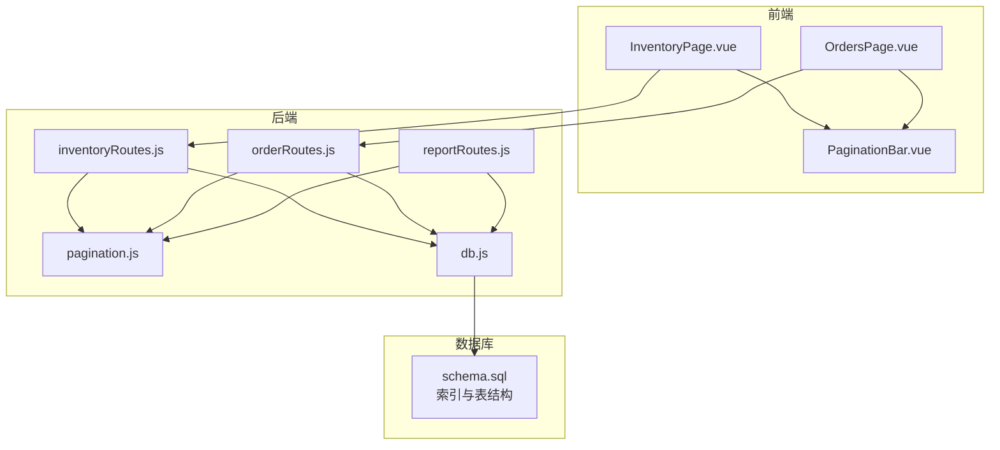
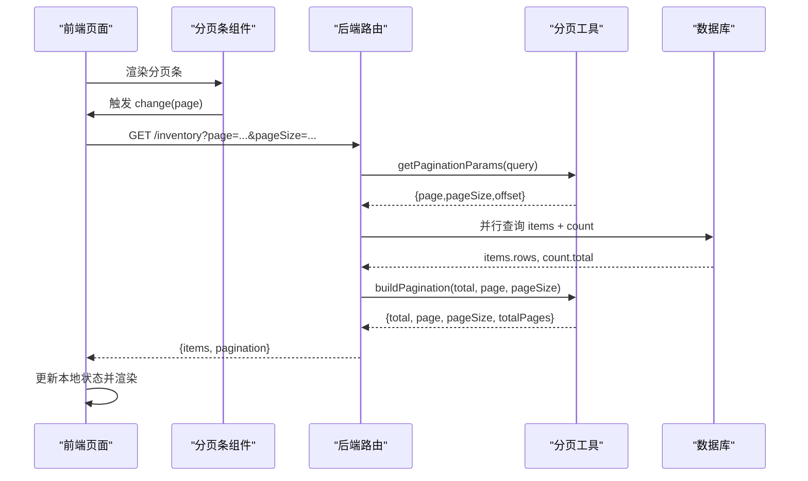
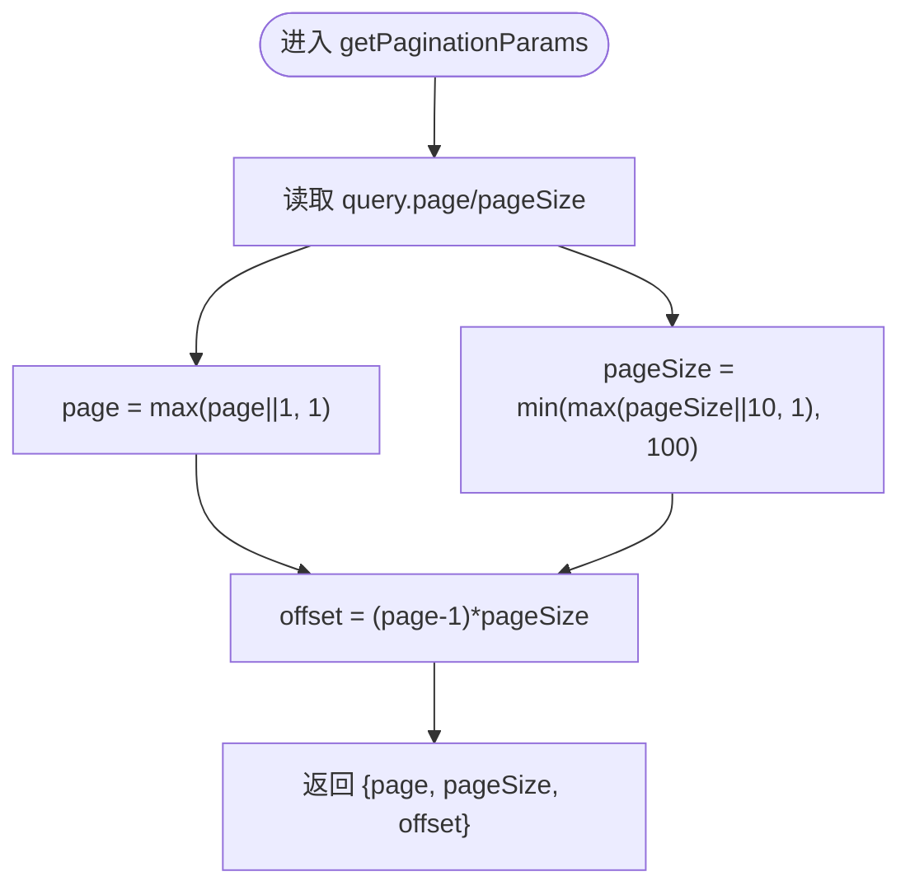
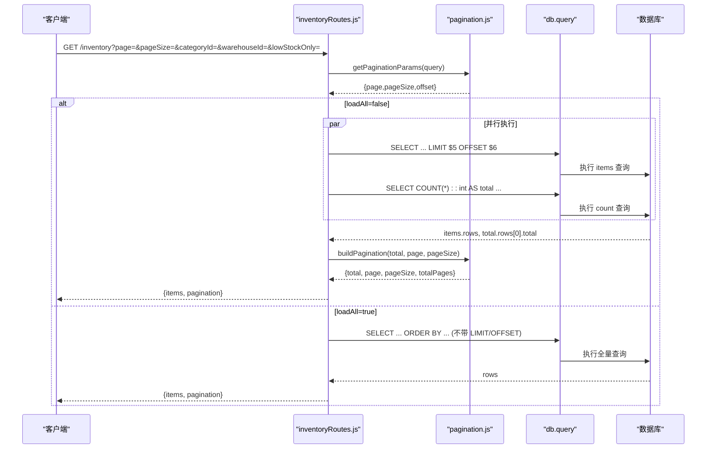
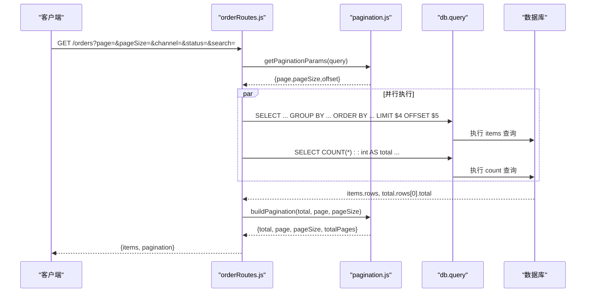
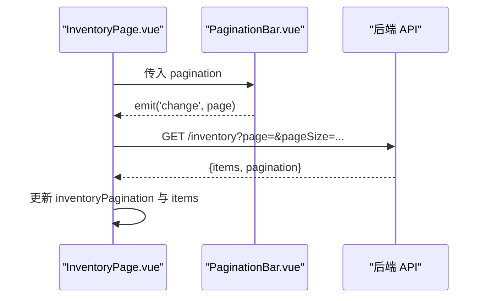
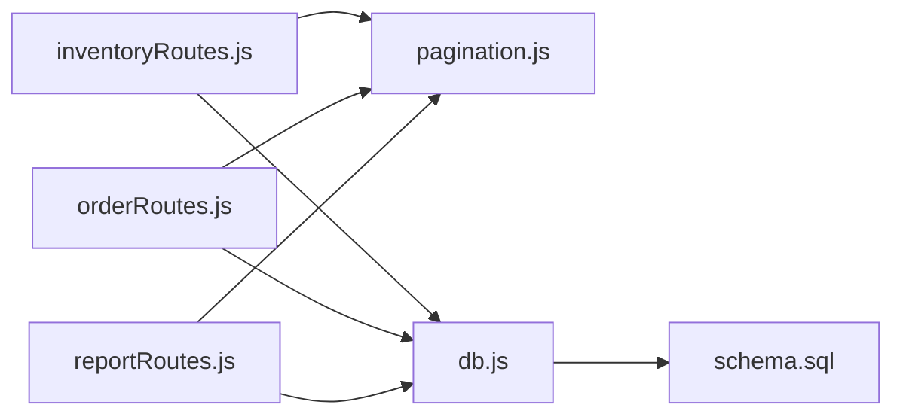

# 分页工具

<cite>
**本文引用的文件**
- [pagination.js](file://server/src/utils/pagination.js)
- [inventoryRoutes.js](file://server/src/routes/inventoryRoutes.js)
- [orderRoutes.js](file://server/src/routes/orderRoutes.js)
- [reportRoutes.js](file://server/src/routes/reportRoutes.js)
- [PaginationBar.vue](file://web/src/components/PaginationBar.vue)
- [InventoryPage.vue](file://web/src/pages/InventoryPage.vue)
- [OrdersPage.vue](file://web/src/pages/OrdersPage.vue)
- [db.js](file://server/src/config/db.js)
- [schema.sql](file://server/database/schema.sql)
- [costAccess.js](file://server/src/utils/costAccess.js)
</cite>

## 目录
1. [简介](#简介)
2. [项目结构](#项目结构)
3. [核心组件](#核心组件)
4. [架构总览](#架构总览)
5. [详细组件分析](#详细组件分析)
6. [依赖关系分析](#依赖关系分析)
7. [性能考量](#性能考量)
8. [故障排查指南](#故障排查指南)
9. [结论](#结论)
10. [附录](#附录)

## 简介
本文件系统性梳理库存系统的分页工具实现，覆盖后端统一分页参数解析与响应结构构建、前端分页组件与页面集成、查询优化策略（LIMIT/OFFSET 的高效使用、索引利用与查询计划优化）、结果集管理（参数校验、边界检查、空结果处理）、性能调优（缓存策略、批量加载、内存管理）、多场景分页实现示例（简单列表、复杂查询、大数据量处理），以及分页 API 设计、错误处理与用户体验优化的最佳实践。

## 项目结构
分页工具横跨后端路由层、通用工具层与前端页面组件：
- 后端：统一分页参数解析与分页响应结构构建，多路由（库存、订单、报表）复用
- 前端：分页条组件与页面级数据加载、过滤、翻页联动
- 数据库：索引与查询结构支撑高效分页

图表来源
- [inventoryRoutes.js:1-493](file://server/src/routes/inventoryRoutes.js#L1-L493)
- [orderRoutes.js:1-113](file://server/src/routes/orderRoutes.js#L1-L113)
- [reportRoutes.js:1-252](file://server/src/routes/reportRoutes.js#L1-L252)
- [pagination.js:1-28](file://server/src/utils/pagination.js#L1-L28)
- [db.js:1-25](file://server/src/config/db.js#L1-L25)
- [schema.sql:1-447](file://server/database/schema.sql#L1-L447)

章节来源
- [inventoryRoutes.js:1-493](file://server/src/routes/inventoryRoutes.js#L1-L493)
- [orderRoutes.js:1-113](file://server/src/routes/orderRoutes.js#L1-L113)
- [reportRoutes.js:1-252](file://server/src/routes/reportRoutes.js#L1-L252)
- [pagination.js:1-28](file://server/src/utils/pagination.js#L1-L28)
- [db.js:1-25](file://server/src/config/db.js#L1-L25)
- [schema.sql:1-447](file://server/database/schema.sql#L1-L447)

## 核心组件
- 统一分页参数解析与响应结构
  - 参数解析：page/pageSize 的边界校验与 offset 计算
  - 响应结构：total、page、pageSize、totalPages
- 路由层复用：库存、订单、报表等多处接口统一使用
- 前端分页条：最小化交互，触发 change 事件更新页码
- 数据库连接与查询：Promise.all 并行查询 items 与 count，降低往返延迟

章节来源
- [pagination.js:1-28](file://server/src/utils/pagination.js#L1-L28)
- [inventoryRoutes.js:17-151](file://server/src/routes/inventoryRoutes.js#L17-L151)
- [orderRoutes.js:31-81](file://server/src/routes/orderRoutes.js#L31-L81)
- [reportRoutes.js:16-127](file://server/src/routes/reportRoutes.js#L16-L127)
- [PaginationBar.vue:1-51](file://web/src/components/PaginationBar.vue#L1-L51)

## 架构总览
后端通过统一工具模块提供分页能力，各业务路由在 GET 接口上采用“并行查询 items 与 count”的模式，前端页面通过分页条组件驱动翻页请求，形成“参数标准化 → 查询并行化 → 结果结构化 → 组件渲染”的完整链路。

图表来源
- [inventoryRoutes.js:17-151](file://server/src/routes/inventoryRoutes.js#L17-L151)
- [pagination.js:1-28](file://server/src/utils/pagination.js#L1-L28)
- [db.js:1-25](file://server/src/config/db.js#L1-L25)

## 详细组件分析

### 后端分页工具模块
- 功能要点
  - 参数校验与默认值：page 最小为 1；pageSize 在 1~100 之间；自动计算 offset
  - 响应结构：统一输出 total、page、pageSize、totalPages
- 复杂度
  - 时间复杂度 O(1)，空间复杂度 O(1)
- 使用建议
  - 所有需要分页的 GET 接口均应调用该工具，确保前后端一致

图表来源
- [pagination.js:2-12](file://server/src/utils/pagination.js#L2-L12)

章节来源
- [pagination.js:1-28](file://server/src/utils/pagination.js#L1-L28)

### 库存接口（分页、搜索、筛选）
- 关键点
  - 支持“加载全部”模式（all=true）与“分页模式”二选一
  - 并行查询 items 与 count，减少 RTT
  - 搜索支持多字段模糊匹配；筛选支持类别、仓库、低库存
  - 成本字段按权限控制可见性
- 查询计划优化
  - 使用 LIMIT/OFFSET 实现分页
  - 建议在 products.name/sku/barcode、categories.name、warehouses.name/code 上建立索引以加速搜索
  - stock_levels 表已具备 product_id/warehouse_id 唯一索引，有利于库存聚合查询
- 错误处理
  - 统一捕获异常并返回友好消息

图表来源
- [inventoryRoutes.js:17-151](file://server/src/routes/inventoryRoutes.js#L17-L151)
- [pagination.js:15-22](file://server/src/utils/pagination.js#L15-L22)
- [schema.sql:410-447](file://server/database/schema.sql#L410-L447)

章节来源
- [inventoryRoutes.js:17-151](file://server/src/routes/inventoryRoutes.js#L17-L151)
- [schema.sql:410-447](file://server/database/schema.sql#L410-L447)

### 订单接口（分页、搜索、筛选）
- 关键点
  - 支持渠道、状态、关键词搜索
  - 使用 GROUP BY marketplace_order_items 以统计 item_count
  - 并行查询 items 与 count
- 查询计划优化
  - marketplace_orders 表已具备 channel、order_status 等索引，利于筛选与排序
  - 建议在 external_order_id、buyer_name 上建立索引以提升搜索效率

图表来源
- [orderRoutes.js:31-81](file://server/src/routes/orderRoutes.js#L31-L81)
- [schema.sql:420-421](file://server/database/schema.sql#L420-L421)

章节来源
- [orderRoutes.js:31-81](file://server/src/routes/orderRoutes.js#L31-L81)
- [schema.sql:420-421](file://server/database/schema.sql#L420-L421)

### 报表接口（分页、搜索、时间范围）
- 关键点
  - 支持“加载全部”与分页两种模式
  - 支持时间范围筛选与关键词搜索
  - 成本与库存价值按权限控制可见性
- 查询计划优化
  - stock_movements 已具备 created_at 索引，利于按时间排序与筛选

章节来源
- [reportRoutes.js:16-127](file://server/src/routes/reportRoutes.js#L16-L127)
- [reportRoutes.js:130-249](file://server/src/routes/reportRoutes.js#L130-L249)
- [schema.sql:418](file://server/database/schema.sql#L418)

### 前端分页组件与页面集成
- 分页条组件
  - 接收 pagination 对象，提供上一页/下一页按钮
  - 校验边界：禁用无效页码；触发 change(page) 事件
- 页面级集成
  - InventoryPage：同时维护库存与交易两个分页状态，分别请求并渲染
  - OrdersPage：集中管理筛选与分页，支持同步按钮与错误提示
- 用户体验
  - 切换筛选或搜索时重置到第 1 页，保证结果一致性
  - 加载态与错误态明确提示

图表来源
- [InventoryPage.vue:113-150](file://web/src/pages/InventoryPage.vue#L113-L150)
- [PaginationBar.vue:14-20](file://web/src/components/PaginationBar.vue#L14-L20)

章节来源
- [PaginationBar.vue:1-51](file://web/src/components/PaginationBar.vue#L1-L51)
- [InventoryPage.vue:113-150](file://web/src/pages/InventoryPage.vue#L113-L150)
- [OrdersPage.vue:33-53](file://web/src/pages/OrdersPage.vue#L33-L53)

## 依赖关系分析
- 路由依赖分页工具：inventoryRoutes、orderRoutes、reportRoutes 共同依赖 pagination.js
- 数据库依赖索引：schema.sql 中定义了大量索引，支撑搜索、筛选与排序
- 连接配置：db.js 提供连接池与 query 封装，统一 SSL 与超时设置

图表来源
- [inventoryRoutes.js:5](file://server/src/routes/inventoryRoutes.js#L5)
- [orderRoutes.js:5](file://server/src/routes/orderRoutes.js#L5)
- [reportRoutes.js:4](file://server/src/routes/reportRoutes.js#L4)
- [pagination.js:24-27](file://server/src/utils/pagination.js#L24-L27)
- [db.js:21-24](file://server/src/config/db.js#L21-L24)
- [schema.sql:410-447](file://server/database/schema.sql#L410-L447)

章节来源
- [inventoryRoutes.js:5](file://server/src/routes/inventoryRoutes.js#L5)
- [orderRoutes.js:5](file://server/src/routes/orderRoutes.js#L5)
- [reportRoutes.js:4](file://server/src/routes/reportRoutes.js#L4)
- [pagination.js:24-27](file://server/src/utils/pagination.js#L24-L27)
- [db.js:21-24](file://server/src/config/db.js#L21-L24)
- [schema.sql:410-447](file://server/database/schema.sql#L410-L447)

## 性能考量
- 查询优化策略
  - LIMIT/OFFSET 高效使用：在已建立合适索引的前提下，避免深度分页（大 offset）导致的扫描开销
  - 索引利用：products/category/warehouse 等高频搜索字段与 marketplace_orders 的 channel/status 已有索引；建议补充 external_order_id/buyer_name 等常用搜索字段索引
  - 查询计划优化：ORDER BY 字段尽量与索引匹配；必要时使用覆盖索引减少回表
- 结果集管理
  - 参数验证与边界检查：统一在 getPaginationParams 中完成，防止非法输入
  - 空结果处理：COUNT 查询返回 total=0 时，totalPages=ceil(0/pageSize)=0 或 1（取决于实现），前端需兼容
- 缓存策略
  - 读多写少的报表与列表可考虑短期缓存（如 Redis）以降低数据库压力
  - 对于高并发场景，可结合查询结果哈希与 ETag 实现缓存命中
- 批量加载与内存管理
  - 合理设置 pageSize（建议 20~100），避免单页过大导致内存占用与渲染卡顿
  - 前端分页组件仅渲染当前页数据，避免一次性渲染全量数据
- 大数据量处理
  - 对于超大表，优先考虑基于游标或基于光标的分页方案（如基于上次排序键的范围查询），以规避 OFFSET 过深带来的性能问题
  - 为高频查询建立物化视图或汇总表，定期刷新

[本节为通用性能指导，不直接分析具体文件]

## 故障排查指南
- 常见错误与定位
  - 分页参数非法：检查 page 是否为正整数、pageSize 是否在 1~100 区间
  - 查询超时：确认相关字段是否建立索引；检查 ORDER BY 与 WHERE 条件是否可走索引
  - 返回空结果：确认 COUNT 查询是否正确；检查筛选条件是否过于严格
- 错误处理最佳实践
  - 后端统一捕获异常并返回结构化错误信息
  - 前端区分网络错误与业务错误，提供明确提示与重试入口
- 安全与权限
  - 成本字段访问需通过成本访问令牌校验，避免越权暴露敏感数据

章节来源
- [pagination.js:2-12](file://server/src/utils/pagination.js#L2-L12)
- [inventoryRoutes.js:148-150](file://server/src/routes/inventoryRoutes.js#L148-L150)
- [orderRoutes.js:78-80](file://server/src/routes/orderRoutes.js#L78-L80)
- [reportRoutes.js:124-127](file://server/src/routes/reportRoutes.js#L124-L127)
- [costAccess.js:25-27](file://server/src/utils/costAccess.js#L25-L27)

## 结论
该分页工具通过“统一参数解析 + 统一响应结构 + 并行查询”的设计，在库存、订单、报表等多个场景实现了高内聚、低耦合的分页能力。配合数据库索引与前端组件化渲染，整体具备良好的扩展性与可维护性。建议后续在大数据量场景引入更高效的分页策略，并完善缓存与监控体系以进一步提升性能与稳定性。

[本节为总结性内容，不直接分析具体文件]

## 附录
- API 设计规范
  - 请求参数：page、pageSize、search、filters（按路由而定）
  - 响应结构：items、pagination（total、page、pageSize、totalPages）
  - 错误响应：message、error（可选）
- 用户体验优化
  - 切换筛选或搜索时重置到第 1 页
  - 显示加载态与错误态，提供清晰提示
  - 合理的 pageSize 默认值与上限，兼顾性能与易用性

[本节为通用规范说明，不直接分析具体文件]