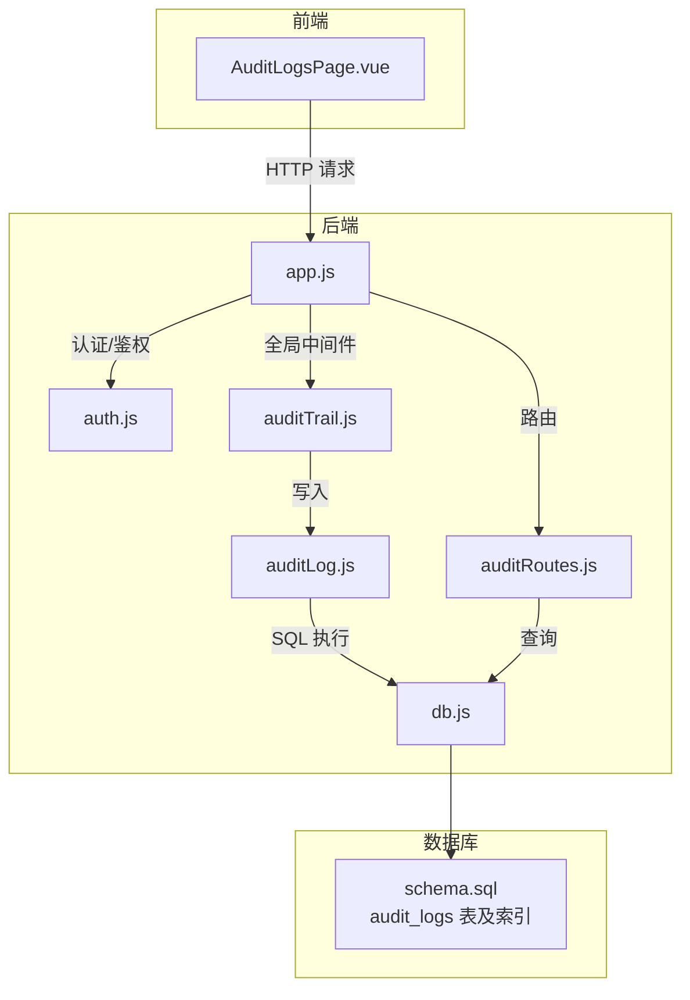
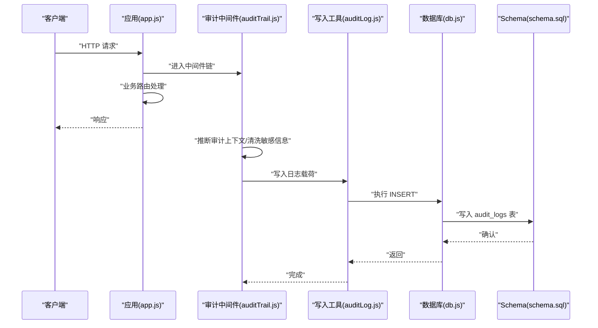
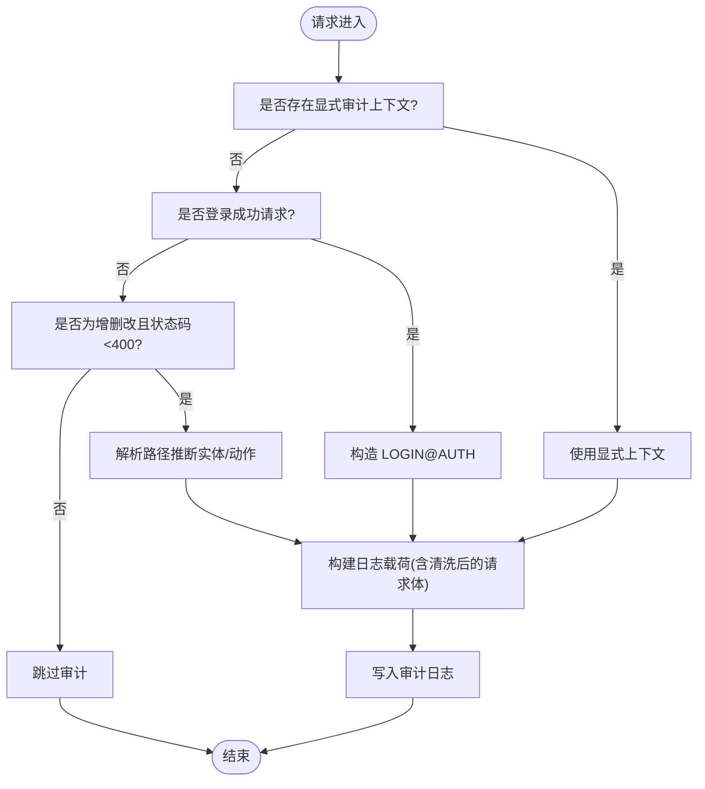
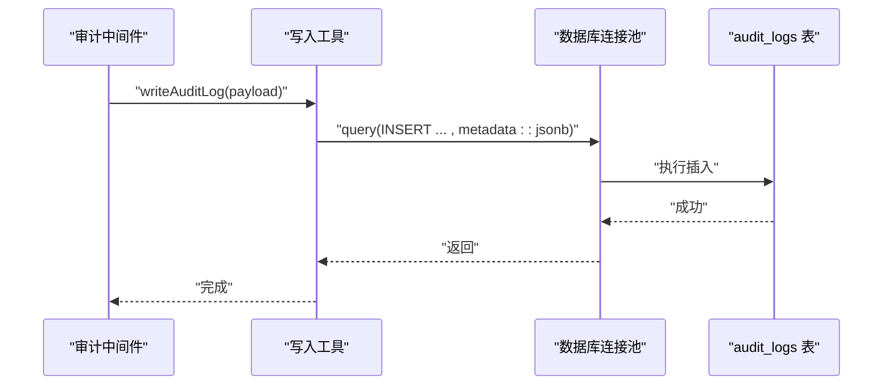
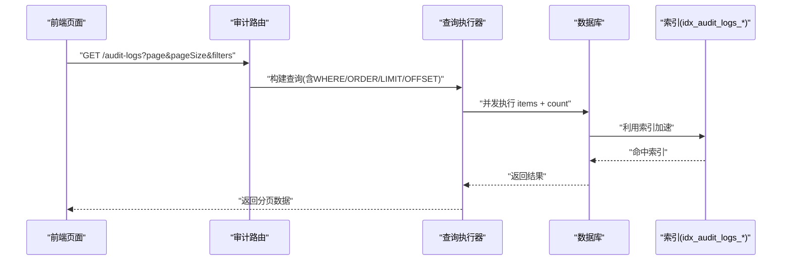
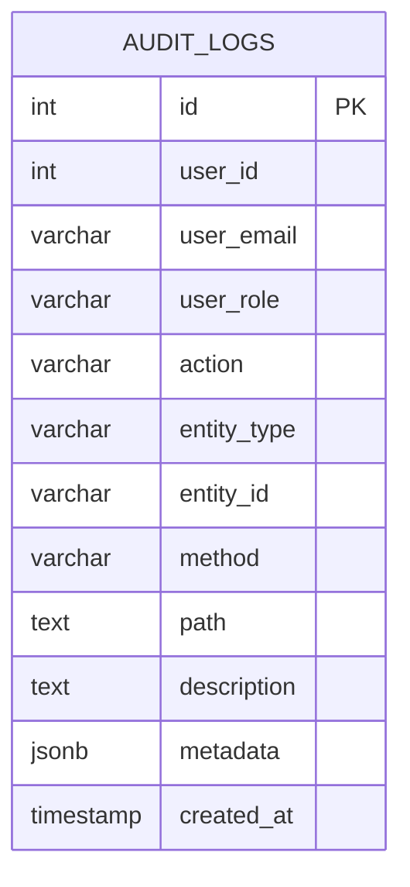
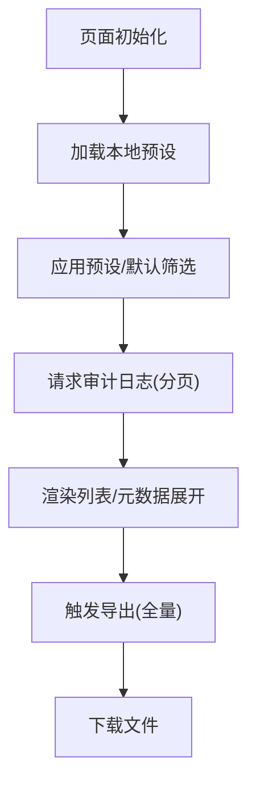
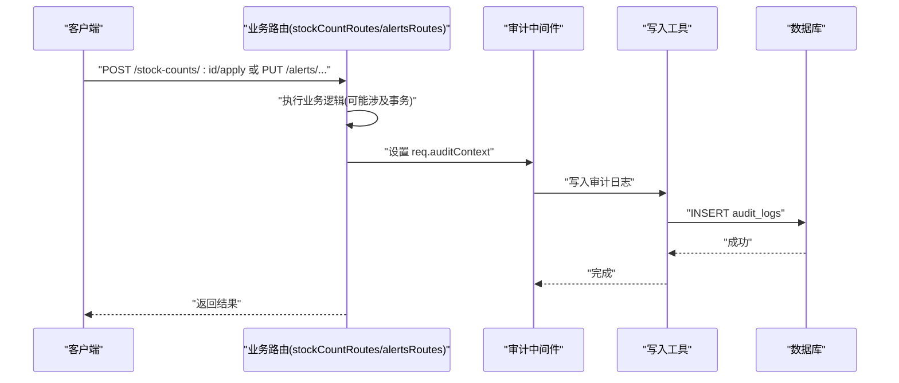
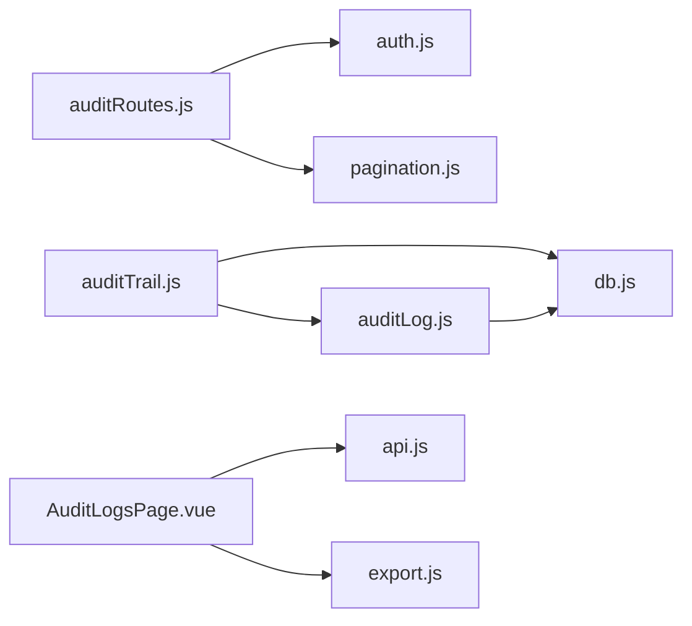

# 审计日志工具

<cite>
**本文引用的文件**
- [server/src/middleware/auditTrail.js](file://server/src/middleware/auditTrail.js)
- [server/src/utils/auditLog.js](file://server/src/utils/auditLog.js)
- [server/src/routes/auditRoutes.js](file://server/src/routes/auditRoutes.js)
- [server/src/app.js](file://server/src/app.js)
- [server/src/config/db.js](file://server/src/config/db.js)
- [server/src/middleware/auth.js](file://server/src/middleware/auth.js)
- [server/database/schema.sql](file://server/database/schema.sql)
- [web/src/pages/AuditLogsPage.vue](file://web/src/pages/AuditLogsPage.vue)
- [server/src/routers/stockCountRoutes.js](file://server/src/routes/stockCountRoutes.js)
- [server/src/routes/alertsRoutes.js](file://server/src/routes/alertsRoutes.js)
- [server/package.json](file://server/package.json)
</cite>

## 目录
1. [简介](#简介)
2. [项目结构](#项目结构)
3. [核心组件](#核心组件)
4. [架构总览](#架构总览)
5. [详细组件分析](#详细组件分析)
6. [依赖分析](#依赖分析)
7. [性能考虑](#性能考虑)
8. [故障排查指南](#故障排查指南)
9. [结论](#结论)
10. [附录](#附录)

## 简介
本文件系统化阐述库存管理系统的审计日志工具，涵盖以下方面：
- 操作记录机制与日志格式、字段定义与数据结构
- 数据追踪实现原理（变更前后对比、关联关系追踪、历史版本管理）
- 合规报告生成能力（审计轨迹、合规性检查、报告模板）
- 实际审计场景示例（用户操作、系统事件、数据变更）
- 日志存储策略、查询优化与隐私保护技术细节

## 项目结构
审计日志体系由“中间件采集 + 服务端持久化 + 前端展示 + 查询与导出”构成，核心文件分布如下：
- 中间件层：统一在应用启动时注册，拦截请求并在响应完成后落库
- 工具层：封装写入数据库的通用方法
- 路由层：提供审计日志查询接口，支持分页、过滤与全量导出
- 数据层：PostgreSQL 表结构定义，含索引与 JSONB 元数据
- 前端层：审计日志页面，支持筛选、预设、展开查看元数据与导出

图表来源
- [server/src/app.js:28-56](file://server/src/app.js#L28-L56)
- [server/src/middleware/auditTrail.js:47-79](file://server/src/middleware/auditTrail.js#L47-L79)
- [server/src/utils/auditLog.js:1-33](file://server/src/utils/auditLog.js#L1-L33)
- [server/src/routes/auditRoutes.js:15-107](file://server/src/routes/auditRoutes.js#L15-L107)
- [server/src/config/db.js:13-24](file://server/src/config/db.js#L13-L24)
- [server/database/schema.sql:275-288](file://server/database/schema.sql#L275-L288)

章节来源
- [server/src/app.js:28-56](file://server/src/app.js#L28-L56)
- [server/src/middleware/auditTrail.js:47-79](file://server/src/middleware/auditTrail.js#L47-L79)
- [server/src/utils/auditLog.js:1-33](file://server/src/utils/auditLog.js#L1-L33)
- [server/src/routes/auditRoutes.js:15-107](file://server/src/routes/auditRoutes.js#L15-L107)
- [server/src/config/db.js:13-24](file://server/src/config/db.js#L13-L24)
- [server/database/schema.sql:275-288](file://server/database/schema.sql#L275-L288)

## 核心组件
- 审计中间件：负责在请求完成时推断审计上下文、清洗敏感信息、构造日志载荷并调用写入工具
- 写入工具：将日志插入 PostgreSQL 的 audit_logs 表，metadata 字段以 JSONB 存储
- 审计路由：提供分页查询、条件过滤、全量导出能力，并受认证与角色限制
- 数据模型：audit_logs 表包含用户标识、动作类型、实体类型、路径、描述、元数据与时间戳等字段
- 前端页面：提供筛选器、分页条、元数据展开、CSV/JSON/PDF 导出与过滤预设

章节来源
- [server/src/middleware/auditTrail.js:14-45](file://server/src/middleware/auditTrail.js#L14-L45)
- [server/src/utils/auditLog.js:1-33](file://server/src/utils/auditLog.js#L1-L33)
- [server/src/routes/auditRoutes.js:15-107](file://server/src/routes/auditRoutes.js#L15-L107)
- [server/database/schema.sql:275-288](file://server/database/schema.sql#L275-L288)
- [web/src/pages/AuditLogsPage.vue:19-48](file://web/src/pages/AuditLogsPage.vue#L19-L48)

## 架构总览
审计流程从请求进入开始，经认证与业务处理，最终在响应完成时由中间件写入审计日志；前端通过审计路由查询与导出。

图表来源
- [server/src/app.js:34](file://server/src/app.js#L34)
- [server/src/middleware/auditTrail.js:47-79](file://server/src/middleware/auditTrail.js#L47-L79)
- [server/src/utils/auditLog.js:4-32](file://server/src/utils/auditLog.js#L4-L32)
- [server/src/config/db.js:23](file://server/src/config/db.js#L23)
- [server/database/schema.sql:275-288](file://server/database/schema.sql#L275-L288)

## 详细组件分析

### 审计中间件：上下文推断与日志载荷
- 上下文推断规则
  - 登录成功（POST /api/auth/login 且状态码 < 400）：动作 LOGIN，实体 AUTH
  - 非增删改或状态码 ≥ 400：跳过
  - 其他情况：基于路径推断实体类型与动作后缀，拼接为大写的 ENTITY_ACTION 形式
- 敏感信息清洗：对请求体中的密码字段进行脱敏
- 写入时机：使用响应 finish 事件，确保状态码可用
- 写入载荷字段：用户标识、角色、动作、实体类型、实体 ID、HTTP 方法、原始路径、描述、元数据（含状态码与清洗后的请求体）

图表来源
- [server/src/middleware/auditTrail.js:14-45](file://server/src/middleware/auditTrail.js#L14-L45)
- [server/src/middleware/auditTrail.js:47-79](file://server/src/middleware/auditTrail.js#L47-L79)

章节来源
- [server/src/middleware/auditTrail.js:4-12](file://server/src/middleware/auditTrail.js#L4-L12)
- [server/src/middleware/auditTrail.js:14-45](file://server/src/middleware/auditTrail.js#L14-L45)
- [server/src/middleware/auditTrail.js:47-79](file://server/src/middleware/auditTrail.js#L47-L79)

### 写入工具：统一 SQL 插入
- 将日志载荷转换为 SQL 参数，插入 audit_logs
- metadata 以 JSONB 类型存储，便于后续查询与扩展

图表来源
- [server/src/utils/auditLog.js:1-33](file://server/src/utils/auditLog.js#L1-L33)
- [server/src/config/db.js:23](file://server/src/config/db.js#L23)
- [server/database/schema.sql:275-288](file://server/database/schema.sql#L275-L288)

章节来源
- [server/src/utils/auditLog.js:1-33](file://server/src/utils/auditLog.js#L1-L33)
- [server/src/config/db.js:23](file://server/src/config/db.js#L23)

### 审计路由：查询、过滤与导出
- 认证与授权：仅管理员与经理可访问
- 查询参数：搜索关键词、动作、实体类型、起止日期、分页、是否全量
- 过滤逻辑：支持多字段模糊匹配与日期范围
- 性能优化：分页查询与总数统计并行执行
- 导出能力：前端可触发全量导出为 CSV/JSON/PDF

图表来源
- [server/src/routes/auditRoutes.js:15-107](file://server/src/routes/auditRoutes.js#L15-L107)
- [server/database/schema.sql:431-432](file://server/database/schema.sql#L431-L432)

章节来源
- [server/src/routes/auditRoutes.js:8-9](file://server/src/routes/auditRoutes.js#L8-L9)
- [server/src/routes/auditRoutes.js:15-107](file://server/src/routes/auditRoutes.js#L15-L107)

### 数据模型：audit_logs 表结构与索引
- 关键字段
  - user_id、user_email、user_role：审计主体
  - action、entity_type、entity_id：动作与实体定位
  - method、path、description：请求维度
  - metadata：JSONB，承载请求体与状态码等
  - created_at：审计时间
- 索引
  - idx_audit_logs_user_id：按用户检索
  - idx_audit_logs_created_at：按时间倒序
- 设计要点
  - JSONB 存储 metadata，兼顾灵活性与查询效率
  - created_at 默认值与排序提升时间序列查询性能

图表来源
- [server/database/schema.sql:275-288](file://server/database/schema.sql#L275-L288)

章节来源
- [server/database/schema.sql:275-288](file://server/database/schema.sql#L275-L288)
- [server/database/schema.sql:431-432](file://server/database/schema.sql#L431-L432)

### 前端页面：筛选、预设与导出
- 功能点
  - 筛选项：搜索、动作、实体类型、起止日期
  - 预设：本地存储筛选配置，支持保存、重命名、设为默认、删除
  - 展开查看：点击查看详情，展开 JSONB 元数据
  - 导出：CSV/JSON/PDF 三种格式，支持全量导出
- 交互流程
  - 加载时恢复默认预设或初始筛选
  - 触发筛选后重新加载分页数据
  - 导出时向后端请求全量数据并转存

图表来源
- [web/src/pages/AuditLogsPage.vue:54-73](file://web/src/pages/AuditLogsPage.vue#L54-L73)
- [web/src/pages/AuditLogsPage.vue:106-154](file://web/src/pages/AuditLogsPage.vue#L106-L154)

章节来源
- [web/src/pages/AuditLogsPage.vue:19-48](file://web/src/pages/AuditLogsPage.vue#L19-L48)
- [web/src/pages/AuditLogsPage.vue:54-73](file://web/src/pages/AuditLogsPage.vue#L54-L73)
- [web/src/pages/AuditLogsPage.vue:106-154](file://web/src/pages/AuditLogsPage.vue#L106-L154)

### 实际审计场景示例
- 登录审计
  - 条件：POST /api/auth/login 且响应状态码 < 400
  - 动作：LOGIN
  - 实体：AUTH
  - 元数据：包含状态码与清洗后的请求体
- 库存盘点流程
  - 创建：STOCK_COUNT_CREATE
  - 保存：STOCK_COUNT_SAVE
  - 完成：STOCK_COUNT_COMPLETE
  - 应用：STOCK_COUNT_APPLY（仅管理员/经理）
- 低库存告警更新
  - 单个更新：ALERT_UPDATE
  - 批量更新：ALERT_BULK_UPDATE

图表来源
- [server/src/routes/stockCountRoutes.js:151-156](file://server/src/routes/stockCountRoutes.js#L151-L156)
- [server/src/routes/stockCountRoutes.js:258-263](file://server/src/routes/stockCountRoutes.js#L258-L263)
- [server/src/routes/stockCountRoutes.js:311-316](file://server/src/routes/stockCountRoutes.js#L311-L316)
- [server/src/routes/stockCountRoutes.js:418-423](file://server/src/routes/stockCountRoutes.js#L418-L423)
- [server/src/routes/alertsRoutes.js:221-226](file://server/src/routes/alertsRoutes.js#L221-L226)
- [server/src/routes/alertsRoutes.js:274-279](file://server/src/routes/alertsRoutes.js#L274-L279)

章节来源
- [server/src/routes/stockCountRoutes.js:151-156](file://server/src/routes/stockCountRoutes.js#L151-L156)
- [server/src/routes/stockCountRoutes.js:258-263](file://server/src/routes/stockCountRoutes.js#L258-L263)
- [server/src/routes/stockCountRoutes.js:311-316](file://server/src/routes/stockCountRoutes.js#L311-L316)
- [server/src/routes/stockCountRoutes.js:418-423](file://server/src/routes/stockCountRoutes.js#L418-L423)
- [server/src/routes/alertsRoutes.js:221-226](file://server/src/routes/alertsRoutes.js#L221-L226)
- [server/src/routes/alertsRoutes.js:274-279](file://server/src/routes/alertsRoutes.js#L274-L279)

## 依赖分析
- 中间件依赖
  - 审计中间件依赖数据库连接池与写入工具
  - 写入工具依赖数据库查询执行器
- 路由依赖
  - 审计路由依赖认证中间件与分页工具
- 前端依赖
  - 审计页面依赖 API 服务与导出工具
- 外部依赖
  - Express、PG、JWT、Helmet、Morgan、CORS 等

图表来源
- [server/src/middleware/auditTrail.js:1-2](file://server/src/middleware/auditTrail.js#L1-L2)
- [server/src/utils/auditLog.js:1-3](file://server/src/utils/auditLog.js#L1-L3)
- [server/src/routes/auditRoutes.js:2-4](file://server/src/routes/auditRoutes.js#L2-L4)
- [server/src/middleware/auth.js:1-2](file://server/src/middleware/auth.js#L1-L2)
- [web/src/pages/AuditLogsPage.vue:5-6](file://web/src/pages/AuditLogsPage.vue#L5-L6)

章节来源
- [server/src/middleware/auditTrail.js:1-2](file://server/src/middleware/auditTrail.js#L1-L2)
- [server/src/utils/auditLog.js:1-3](file://server/src/utils/auditLog.js#L1-L3)
- [server/src/routes/auditRoutes.js:2-4](file://server/src/routes/auditRoutes.js#L2-L4)
- [server/src/middleware/auth.js:1-2](file://server/src/middleware/auth.js#L1-L2)
- [web/src/pages/AuditLogsPage.vue:5-6](file://web/src/pages/AuditLogsPage.vue#L5-L6)
- [server/package.json:15-24](file://server/package.json#L15-L24)

## 性能考虑
- 查询性能
  - 利用索引 idx_audit_logs_user_id 与 idx_audit_logs_created_at，加速按用户与时间的检索
  - 分页查询与总数统计并行执行，降低延迟
- 写入性能
  - 使用连接池与单条插入，避免频繁连接开销
  - metadata 采用 JSONB，减少结构变化带来的迁移成本
- 前端体验
  - 支持全量导出，避免前端无限滚动导致的内存压力
  - 提供筛选预设，减少重复请求

章节来源
- [server/database/schema.sql:431-432](file://server/database/schema.sql#L431-L432)
- [server/src/routes/auditRoutes.js:66-98](file://server/src/routes/auditRoutes.js#L66-L98)
- [server/src/config/db.js:15-19](file://server/src/config/db.js#L15-L19)

## 故障排查指南
- 审计日志未写入
  - 检查中间件是否正确注册于应用启动阶段
  - 确认请求方法与状态码满足写入条件
  - 查看写入异常日志输出
- 查询无结果或慢
  - 确认筛选条件是否过于严格
  - 检查索引是否生效
  - 使用全量导出验证数据存在性
- 前端无法导出
  - 检查网络请求是否成功
  - 确认浏览器未阻止下载
- 权限问题
  - 确认用户角色为 ADMIN 或 MANAGER
  - 检查路由是否正确挂载认证与授权中间件

章节来源
- [server/src/app.js:34](file://server/src/app.js#L34)
- [server/src/middleware/auditTrail.js:30-32](file://server/src/middleware/auditTrail.js#L30-L32)
- [server/src/routes/auditRoutes.js:8-9](file://server/src/routes/auditRoutes.js#L8-L9)
- [web/src/pages/AuditLogsPage.vue:106-154](file://web/src/pages/AuditLogsPage.vue#L106-L154)

## 结论
该审计日志工具通过“中间件自动采集 + 服务端统一写入 + 前端灵活查询与导出”的架构，实现了对用户操作、系统事件与数据变更的完整追踪。配合合理的索引设计与并行查询策略，能够在保证性能的同时满足合规审计需求。建议在生产环境中结合日志轮转与归档策略，进一步强化长期留存与检索效率。

## 附录
- 日志字段定义与含义
  - user_id、user_email、user_role：审计主体身份
  - action：动作标识（如 LOGIN、STOCK_COUNT_CREATE 等）
  - entity_type、entity_id：实体类型与实例标识
  - method、path、description：请求维度
  - metadata：JSONB，包含状态码与清洗后的请求体
  - created_at：审计时间
- 合规报告建议
  - 定期导出并归档审计日志
  - 建立基于动作与实体类型的合规检查清单
  - 对高风险操作（如应用库存盘点、批量更新告警）建立专项审查流程

章节来源
- [server/database/schema.sql:275-288](file://server/database/schema.sql#L275-L288)
- [server/src/utils/auditLog.js:1-33](file://server/src/utils/auditLog.js#L1-L33)
- [server/src/routes/auditRoutes.js:15-107](file://server/src/routes/auditRoutes.js#L15-L107)