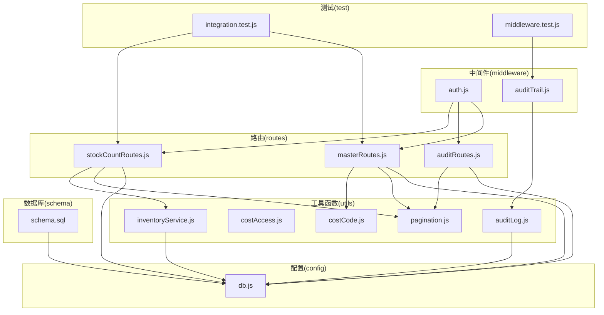
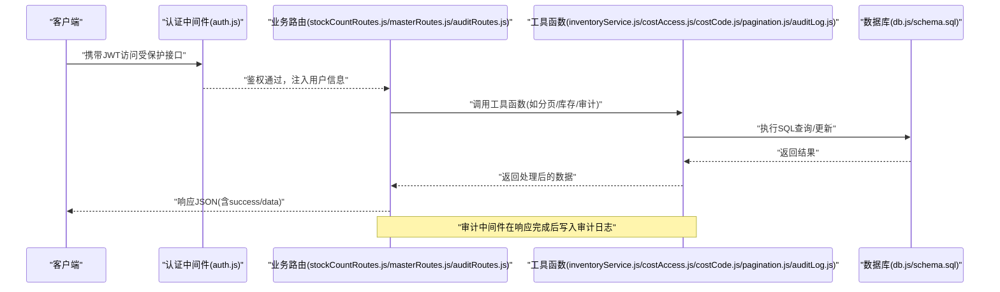
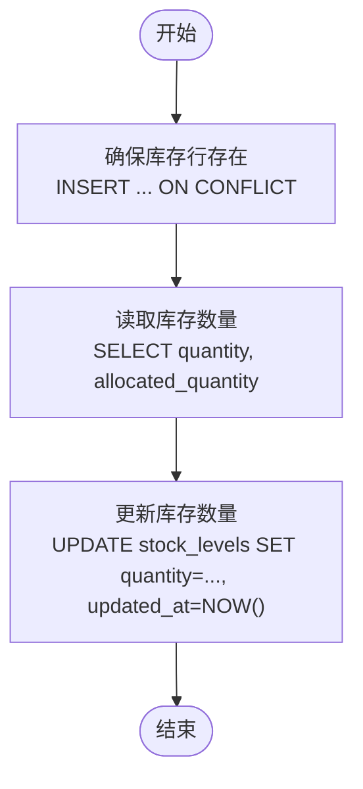
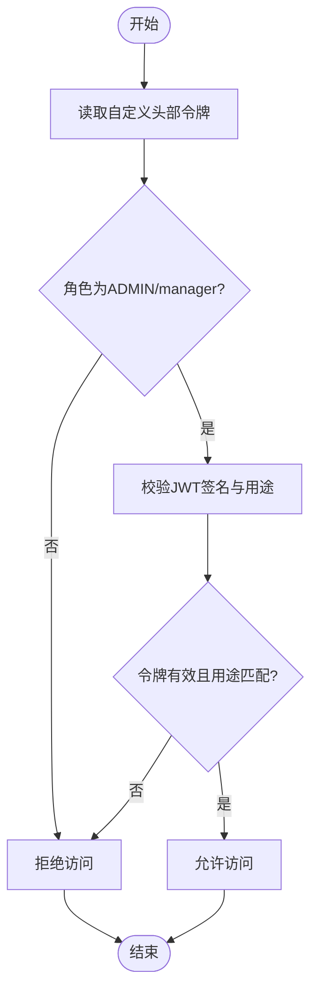
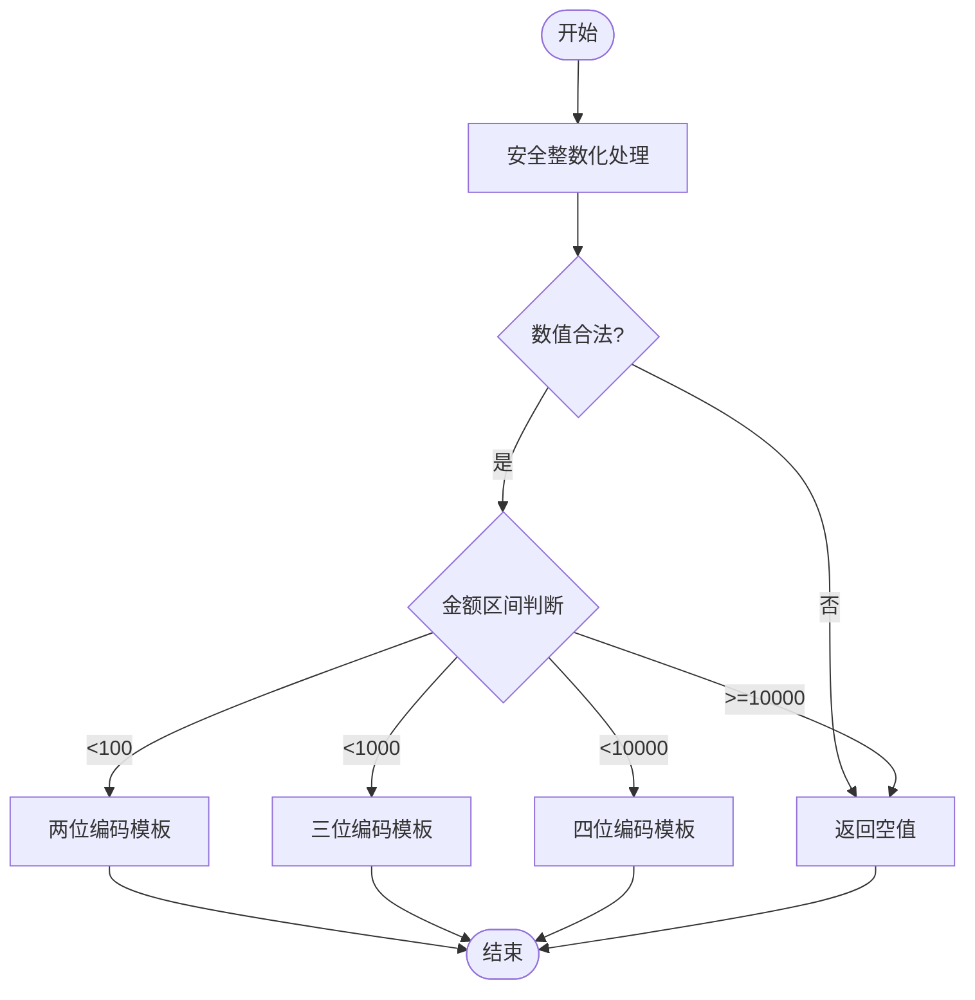
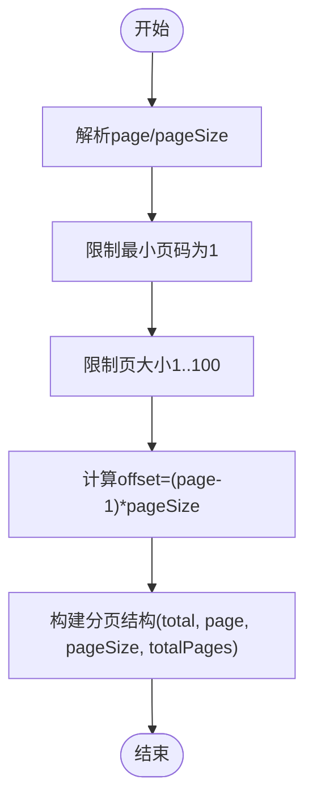
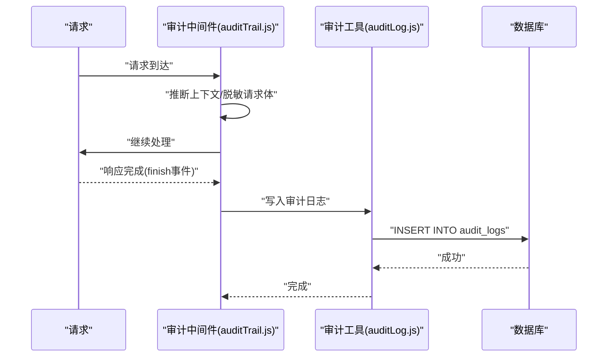
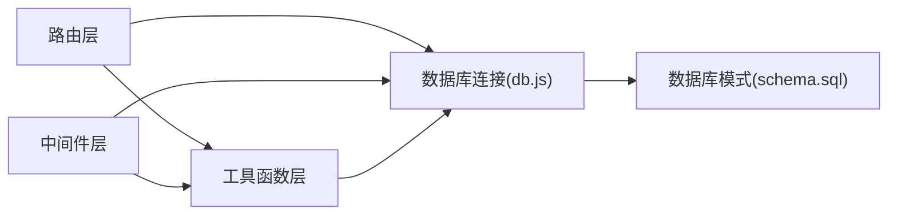

# 工具辅助模块

<cite>
**本文引用的文件**
- [inventoryService.js](file://server/src/utils/inventoryService.js)
- [costAccess.js](file://server/src/utils/costAccess.js)
- [costCode.js](file://server/src/utils/costCode.js)
- [pagination.js](file://server/src/utils/pagination.js)
- [auditLog.js](file://server/src/utils/auditLog.js)
- [auditTrail.js](file://server/src/middleware/auditTrail.js)
- [auth.js](file://server/src/middleware/auth.js)
- [stockCountRoutes.js](file://server/src/routes/stockCountRoutes.js)
- [auditRoutes.js](file://server/src/routes/auditRoutes.js)
- [masterRoutes.js](file://server/src/routes/masterRoutes.js)
- [schema.sql](file://server/database/schema.sql)
- [db.js](file://server/src/config/db.js)
- [integration.test.js](file://server/test/integration.test.js)
- [middleware.test.js](file://server/test/middleware.test.js)
- [package.json](file://server/package.json)
</cite>

## 目录
1. [简介](#简介)
2. [项目结构](#项目结构)
3. [核心组件](#核心组件)
4. [架构总览](#架构总览)
5. [详细组件分析](#详细组件分析)
6. [依赖关系分析](#依赖关系分析)
7. [性能考量](#性能考量)
8. [故障排查指南](#故障排查指南)
9. [结论](#结论)
10. [附录](#附录)

## 简介
本文件面向库存管理系统的“工具辅助模块”，围绕以下目标展开：统一库存计算与成本核算、成本访问控制、成本编码与财务对账、分页查询优化、审计日志与合规追踪，并结合现有路由与中间件展示工具模块在系统中的实际应用方式。文档同时总结了单元测试与最佳实践建议，帮助开发者快速理解与扩展这些工具。

## 项目结构
工具辅助模块位于后端服务目录中，主要由以下几类文件组成：
- 工具函数：库存服务、成本访问控制、成本编码、分页、审计日志
- 中间件：认证、审计轨迹、限流、响应包装
- 路由：库存盘点、审计日志查询、主数据与成本相关接口
- 数据库：模式定义与索引
- 测试：集成测试与中间件测试

图表来源
- [inventoryService.js:1-45](file://server/src/utils/inventoryService.js#L1-L45)
- [costAccess.js:1-32](file://server/src/utils/costAccess.js#L1-L32)
- [costCode.js:1-63](file://server/src/utils/costCode.js#L1-L63)
- [pagination.js:1-28](file://server/src/utils/pagination.js#L1-L28)
- [auditLog.js:1-38](file://server/src/utils/auditLog.js#L1-L38)
- [auditTrail.js:1-84](file://server/src/middleware/auditTrail.js#L1-L84)
- [auth.js:1-46](file://server/src/middleware/auth.js#L1-L46)
- [stockCountRoutes.js:1-434](file://server/src/routes/stockCountRoutes.js#L1-L434)
- [auditRoutes.js:1-110](file://server/src/routes/auditRoutes.js#L1-L110)
- [masterRoutes.js:1-800](file://server/src/routes/masterRoutes.js#L1-L800)
- [schema.sql:1-447](file://server/database/schema.sql#L1-L447)
- [db.js:1-25](file://server/src/config/db.js#L1-L25)
- [integration.test.js:1-162](file://server/test/integration.test.js#L1-L162)
- [middleware.test.js:1-52](file://server/test/middleware.test.js#L1-L52)

章节来源
- [package.json:1-31](file://server/package.json#L1-L31)

## 核心组件
本节从功能维度梳理工具模块的关键能力与实现要点。

- 库存服务工具
  - 统一库存增减逻辑封装，避免多处接口重复事务代码
  - 提供库存行确保、库存数量读取、库存更新等方法
  - 在库存盘点流程中用于原子性地调整库存与生成出入库流水

- 成本访问控制工具
  - 基于自定义请求头携带的令牌，校验用户角色与令牌目的
  - 仅允许管理员与经理查看成本信息，防止敏感数据泄露
  - 与主数据路由配合，实现成本字段的条件可见性

- 成本代码工具
  - 将数值型成本金额转换为可读的成本编码，便于财务对账与展示
  - 对输入进行安全整数化处理，保证编码规则的稳定性

- 分页工具
  - 统一分页参数解析与分页结构构建
  - 防止过大页大小与负页码，限制最大页大小以保护数据库
  - 与各查询路由配合，提升大数据量下的查询性能

- 审计日志工具
  - 写入审计日志，记录操作人、实体类型、路径、方法、描述与元数据
  - 通过中间件自动收集请求上下文，降低重复代码

章节来源
- [inventoryService.js:1-45](file://server/src/utils/inventoryService.js#L1-L45)
- [costAccess.js:1-32](file://server/src/utils/costAccess.js#L1-L32)
- [costCode.js:1-63](file://server/src/utils/costCode.js#L1-L63)
- [pagination.js:1-28](file://server/src/utils/pagination.js#L1-L28)
- [auditLog.js:1-38](file://server/src/utils/auditLog.js#L1-L38)

## 架构总览
工具模块在系统中的位置与交互如下：

图表来源
- [auth.js:1-46](file://server/src/middleware/auth.js#L1-L46)
- [stockCountRoutes.js:1-434](file://server/src/routes/stockCountRoutes.js#L1-L434)
- [masterRoutes.js:1-800](file://server/src/routes/masterRoutes.js#L1-L800)
- [auditRoutes.js:1-110](file://server/src/routes/auditRoutes.js#L1-L110)
- [inventoryService.js:1-45](file://server/src/utils/inventoryService.js#L1-L45)
- [costAccess.js:1-32](file://server/src/utils/costAccess.js#L1-L32)
- [costCode.js:1-63](file://server/src/utils/costCode.js#L1-L63)
- [pagination.js:1-28](file://server/src/utils/pagination.js#L1-L28)
- [auditLog.js:1-38](file://server/src/utils/auditLog.js#L1-L38)
- [db.js:1-25](file://server/src/config/db.js#L1-L25)
- [schema.sql:1-447](file://server/database/schema.sql#L1-L447)

## 详细组件分析

### 库存服务工具
- 功能职责
  - 确保存在库存记录（按产品+仓库去重）
  - 读取可用库存与已分配库存
  - 更新库存数量并记录更新时间
- 关键点
  - 使用冲突忽略插入，避免重复初始化
  - 读取时返回数字类型，便于后续计算
  - 更新时统一更新时间戳，便于审计与排序
- 典型调用场景
  - 库存盘点应用阶段：根据盘点结果批量更新库存
  - 出入库流水：根据差异生成出入库记录

图表来源
- [inventoryService.js:1-45](file://server/src/utils/inventoryService.js#L1-L45)

章节来源
- [inventoryService.js:1-45](file://server/src/utils/inventoryService.js#L1-L45)
- [stockCountRoutes.js:326-431](file://server/src/routes/stockCountRoutes.js#L326-L431)

### 成本访问控制工具
- 功能职责
  - 解析自定义头部令牌，校验JWT签名与用途
  - 限定角色为管理员或经理，且令牌需绑定当前用户
  - 提供是否可查看成本的判定函数
- 关键点
  - 令牌用途必须为特定值，防止误用
  - 头部名称固定，便于前端统一传递
  - 与主数据路由配合，实现成本字段的条件可见性

图表来源
- [costAccess.js:1-32](file://server/src/utils/costAccess.js#L1-L32)
- [masterRoutes.js:95-117](file://server/src/routes/masterRoutes.js#L95-L117)

章节来源
- [costAccess.js:1-32](file://server/src/utils/costAccess.js#L1-L32)
- [masterRoutes.js:95-117](file://server/src/routes/masterRoutes.js#L95-L117)

### 成本代码工具
- 功能职责
  - 将成本金额映射为固定长度的编码字符串，便于财务对账
  - 对输入进行安全整数化处理，过滤非法值
- 关键点
  - 不同金额区间采用不同的编码模板
  - 超出范围返回空值，避免异常编码
  - 与成本访问控制配合，仅在授权时显示真实成本

图表来源
- [costCode.js:1-63](file://server/src/utils/costCode.js#L1-L63)

章节来源
- [costCode.js:1-63](file://server/src/utils/costCode.js#L1-L63)
- [masterRoutes.js:119-137](file://server/src/routes/masterRoutes.js#L119-L137)

### 分页工具
- 功能职责
  - 解析分页参数：页码最小为1，页大小最小1、最大100
  - 计算偏移量并返回标准分页结构
- 关键点
  - 限制最大页大小，防止超大查询影响性能
  - 统一分页格式，前端表格组件可直接复用

图表来源
- [pagination.js:1-28](file://server/src/utils/pagination.js#L1-L28)

章节来源
- [pagination.js:1-28](file://server/src/utils/pagination.js#L1-L28)
- [stockCountRoutes.js:14-85](file://server/src/routes/stockCountRoutes.js#L14-L85)
- [auditRoutes.js:15-107](file://server/src/routes/auditRoutes.js#L15-L107)
- [masterRoutes.js:492-560](file://server/src/routes/masterRoutes.js#L492-L560)

### 审计日志工具
- 功能职责
  - 写入审计日志，包含用户标识、动作、实体类型、路径、方法、描述与元数据
  - 中间件自动推断上下文，捕获请求体与状态码
- 关键点
  - 仅对成功写入的请求记录审计日志
  - 敏感字段（如密码）在记录前进行脱敏

图表来源
- [auditTrail.js:1-84](file://server/src/middleware/auditTrail.js#L1-L84)
- [auditLog.js:1-38](file://server/src/utils/auditLog.js#L1-L38)

章节来源
- [auditTrail.js:1-84](file://server/src/middleware/auditTrail.js#L1-L84)
- [auditLog.js:1-38](file://server/src/utils/auditLog.js#L1-L38)

## 依赖关系分析
- 组件耦合
  - 路由层依赖工具函数与数据库连接池
  - 中间件依赖工具函数与数据库连接池
  - 工具函数依赖数据库连接池与配置
- 外部依赖
  - 数据库：PostgreSQL连接池
  - 加密与鉴权：JWT、bcrypt
  - Web框架：Express
- 潜在循环依赖
  - 当前模块组织清晰，未发现循环依赖

图表来源
- [db.js:1-25](file://server/src/config/db.js#L1-L25)
- [schema.sql:1-447](file://server/database/schema.sql#L1-L447)
- [stockCountRoutes.js:1-434](file://server/src/routes/stockCountRoutes.js#L1-L434)
- [auditRoutes.js:1-110](file://server/src/routes/auditRoutes.js#L1-L110)
- [masterRoutes.js:1-800](file://server/src/routes/masterRoutes.js#L1-L800)
- [auditTrail.js:1-84](file://server/src/middleware/auditTrail.js#L1-L84)
- [auth.js:1-46](file://server/src/middleware/auth.js#L1-L46)

章节来源
- [db.js:1-25](file://server/src/config/db.js#L1-L25)
- [schema.sql:1-447](file://server/database/schema.sql#L1-L447)

## 性能考量
- 查询优化
  - 使用LIMIT/OFFSET分页，避免一次性加载全部数据
  - 合理使用索引（如库存、审计日志、通知等表的常用查询列）
- 结果集管理
  - 分页工具限制最大页大小，防止内存压力
  - 批量查询时使用Promise并行，减少往返延迟
- 调优建议
  - 对高频查询列建立合适索引
  - 控制JSONB字段的深度与大小，避免冗余存储
  - 审计日志写入异步化，避免阻塞主请求链路

## 故障排查指南
- 认证失败
  - 检查Authorization头是否为Bearer Token
  - 校验JWT签名与过期时间
- 权限不足
  - 确认用户角色是否满足接口要求
  - 成本访问令牌是否正确传递与校验
- 分页异常
  - 检查page与pageSize是否在允许范围内
  - 确认offset计算与LIMIT设置一致
- 审计日志缺失
  - 确认中间件顺序与finish事件触发
  - 检查写入异常捕获与日志输出

章节来源
- [auth.js:1-46](file://server/src/middleware/auth.js#L1-L46)
- [costAccess.js:1-32](file://server/src/utils/costAccess.js#L1-L32)
- [pagination.js:1-28](file://server/src/utils/pagination.js#L1-L28)
- [auditTrail.js:1-84](file://server/src/middleware/auditTrail.js#L1-L84)

## 结论
工具辅助模块通过统一的库存、成本、分页与审计能力，显著提升了系统的可维护性与安全性。配合严格的访问控制与审计机制，能够满足库存管理与财务对账的合规需求。建议在生产环境中持续关注索引与查询性能，并完善监控与告警体系。

## 附录
- 单元测试与最佳实践
  - 集成测试覆盖成本历史与通知流程，验证成本访问令牌与历史记录一致性
  - 中间件测试验证响应包装与限流行为
  - 建议补充工具函数的边界条件与错误路径测试

章节来源
- [integration.test.js:1-162](file://server/test/integration.test.js#L1-L162)
- [middleware.test.js:1-52](file://server/test/middleware.test.js#L1-L52)