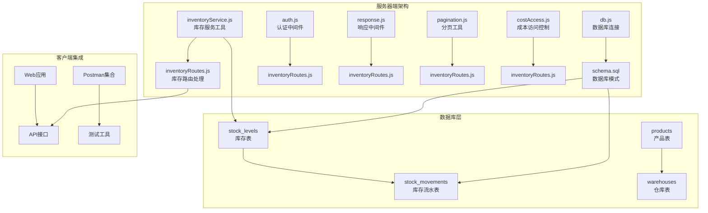
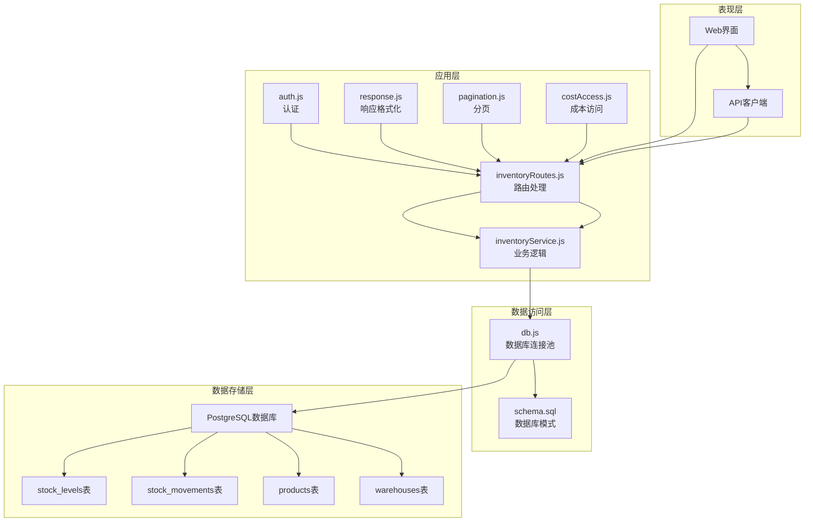
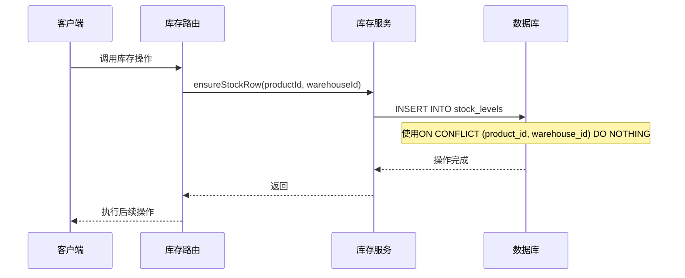
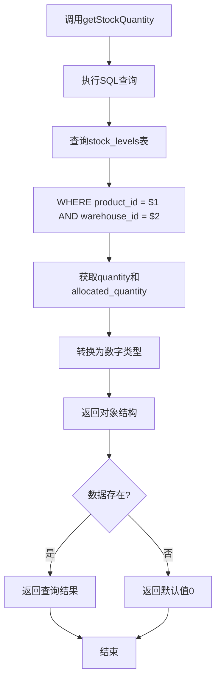
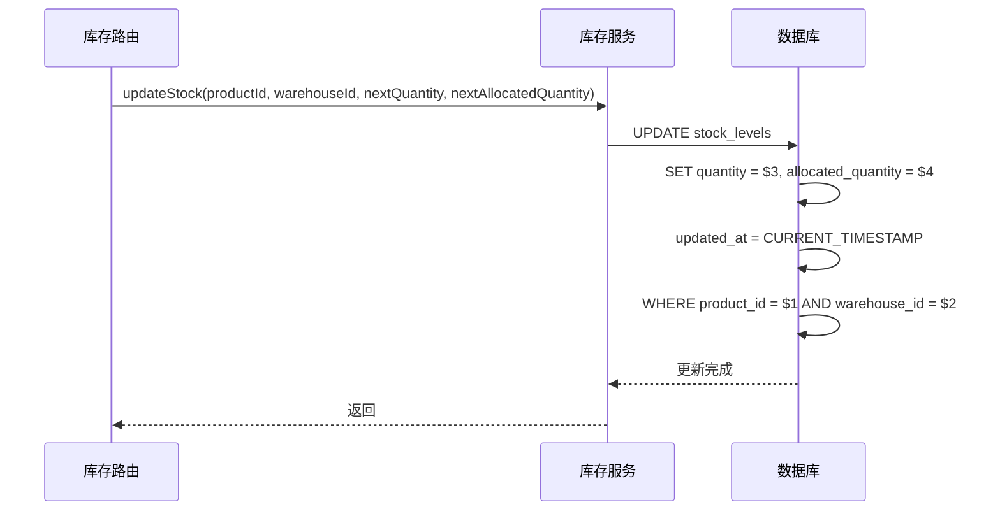
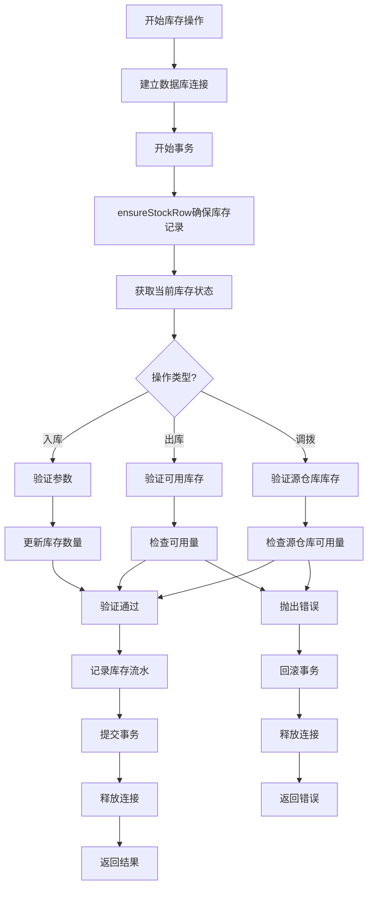
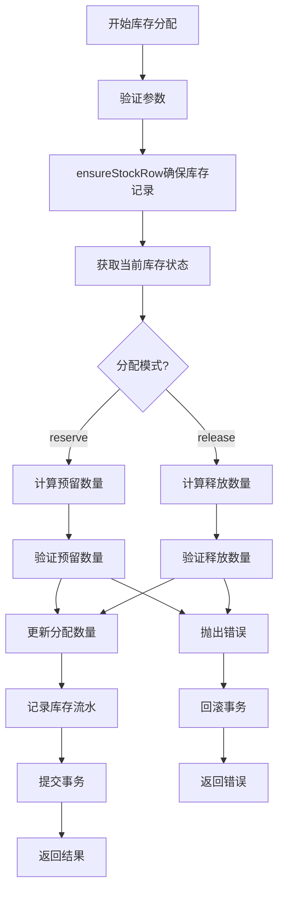
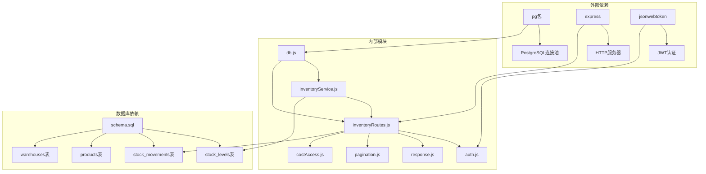

# 库存服务工具

<cite>
**本文档引用的文件**
- [inventoryService.js](file://server/src/utils/inventoryService.js)
- [inventoryRoutes.js](file://server/src/routes/inventoryRoutes.js)
- [db.js](file://server/src/config/db.js)
- [schema.sql](file://server/database/schema.sql)
- [auth.js](file://server/src/middleware/auth.js)
- [response.js](file://server/src/middleware/response.js)
- [pagination.js](file://server/src/utils/pagination.js)
- [costAccess.js](file://server/src/utils/costAccess.js)
- [seed.sql](file://server/database/seed.sql)
- [package.json](file://server/package.json)
</cite>

## 目录
1. [简介](#简介)
2. [项目结构](#项目结构)
3. [核心组件](#核心组件)
4. [架构概览](#架构概览)
5. [详细组件分析](#详细组件分析)
6. [依赖关系分析](#依赖关系分析)
7. [性能考虑](#性能考虑)
8. [故障排除指南](#故障排除指南)
9. [结论](#结论)

## 简介

库存服务工具是库存管理系统的核心模块，提供了统一的库存操作接口，通过封装常见的库存增减逻辑来避免重复的事务代码。该工具集成了PostgreSQL数据库，实现了完整的库存管理功能，包括库存行确保、库存查询、库存更新以及各种库存操作（入库、出库、调拨、分配）。

系统采用分层架构设计，通过中间件实现认证授权、响应格式化和速率限制等功能，确保系统的安全性和可维护性。

## 项目结构

库存服务工具位于服务器端的`server/src/utils/`目录下，主要包含以下关键文件：

**图表来源**
- [inventoryService.js:1-45](file://server/src/utils/inventoryService.js#L1-L45)
- [inventoryRoutes.js:1-493](file://server/src/routes/inventoryRoutes.js#L1-L493)
- [schema.sql:125-248](file://server/database/schema.sql#L125-L248)

**章节来源**
- [inventoryService.js:1-45](file://server/src/utils/inventoryService.js#L1-L45)
- [inventoryRoutes.js:1-493](file://server/src/routes/inventoryRoutes.js#L1-L493)
- [schema.sql:125-248](file://server/database/schema.sql#L125-L248)

## 核心组件

### 库存服务工具 (inventoryService.js)

库存服务工具提供了三个核心函数，构成了库存管理的基础：

1. **ensureStockRow**: 确保库存记录存在
2. **getStockQuantity**: 获取库存数量信息
3. **updateStock**: 更新库存状态

这些函数通过PostgreSQL的ON CONFLICT处理机制避免了重复的事务代码，确保数据的一致性和完整性。

**章节来源**
- [inventoryService.js:1-45](file://server/src/utils/inventoryService.js#L1-L45)

### 数据库模式 (schema.sql)

系统使用PostgreSQL作为数据存储，核心表包括：

- **stock_levels**: 存储每个产品在各个仓库中的库存状态
- **stock_movements**: 记录所有库存变动的历史
- **products**: 产品信息表
- **warehouses**: 仓库信息表

**章节来源**
- [schema.sql:125-248](file://server/database/schema.sql#L125-L248)

## 架构概览

库存服务工具采用分层架构，从底层到顶层的结构如下：

**图表来源**
- [inventoryRoutes.js:1-493](file://server/src/routes/inventoryRoutes.js#L1-L493)
- [inventoryService.js:1-45](file://server/src/utils/inventoryService.js#L1-L45)
- [db.js:1-25](file://server/src/config/db.js#L1-L25)

## 详细组件分析

### 库存行确保机制 (ensureStockRow)

ensureStockRow函数是库存管理的核心机制，它通过PostgreSQL的INSERT ... ON CONFLICT处理来避免重复的事务代码：

**图表来源**
- [inventoryService.js:2-11](file://server/src/utils/inventoryService.js#L2-L11)
- [inventoryRoutes.js:243-248](file://server/src/routes/inventoryRoutes.js#L243-L248)

#### 实现细节

- **唯一约束**: stock_levels表对(product_id, warehouse_id)设置了唯一约束
- **冲突处理**: 使用ON CONFLICT (product_id, warehouse_id) DO NOTHING避免重复插入
- **原子性**: 整个操作在单个事务中执行，确保数据一致性

**章节来源**
- [inventoryService.js:2-11](file://server/src/utils/inventoryService.js#L2-L11)
- [schema.sql:129-133](file://server/database/schema.sql#L129-L133)

### 库存查询功能 (getStockQuantity)

getStockQuantity函数提供了标准化的库存查询接口，返回结构化的库存数据：

**图表来源**
- [inventoryService.js:13-27](file://server/src/utils/inventoryService.js#L13-L27)

#### 返回值结构

getStockQuantity函数返回一个包含以下字段的对象：

- **onHandQuantity**: 实际可用库存数量
- **allocatedQuantity**: 已分配库存数量

这两个字段的组合可以计算出：
- **availableQuantity**: 可用库存 = onHandQuantity - allocatedQuantity

**章节来源**
- [inventoryService.js:13-27](file://server/src/utils/inventoryService.js#L13-L27)

### 库存更新机制 (updateStock)

updateStock函数实现了原子性的库存更新操作：

**图表来源**
- [inventoryService.js:29-38](file://server/src/utils/inventoryService.js#L29-L38)

#### 时间戳更新策略

updateStock函数采用了智能的时间戳更新策略：

- **条件更新**: 只有当库存数量发生变化时才更新updated_at字段
- **性能优化**: 避免了不必要的时间戳更新，减少数据库写入操作
- **审计追踪**: 保留了完整的库存变更历史

**章节来源**
- [inventoryService.js:29-38](file://server/src/utils/inventoryService.js#L29-L38)

### 库存操作流程

系统支持三种主要的库存操作，每种操作都遵循相同的事务模式：

**图表来源**
- [inventoryRoutes.js:229-403](file://server/src/routes/inventoryRoutes.js#L229-L403)

#### 入库操作 (Stock In)

入库操作需要验证目标仓库ID，并确保库存记录存在：

1. **参数验证**: 必须提供productId和正数quantity
2. **仓库验证**: 必须提供warehouseId
3. **库存初始化**: 通过ensureStockRow确保库存记录存在
4. **数量计算**: 新库存 = 当前库存 + 入库数量
5. **流水记录**: 记录IN类型的库存流水

#### 出库操作 (Stock Out)

出库操作需要验证可用库存是否充足：

1. **参数验证**: 必须提供productId、warehouseId和正数quantity
2. **可用库存检查**: 确保可用库存 >= 出库数量
3. **库存更新**: 新库存 = 当前库存 - 出库数量
4. **流水记录**: 记录OUT类型的库存流水

#### 调拨操作 (Transfer)

调拨操作涉及两个仓库的库存更新：

1. **参数验证**: 必须提供源仓库ID、目标仓库ID和正数quantity
2. **仓库验证**: 源仓库ID必须与目标仓库ID不同
3. **双仓库初始化**: 确保源仓库和目标仓库都有库存记录
4. **源仓库检查**: 验证源仓库可用库存充足
5. **双仓库更新**: 源仓库减少，目标仓库增加
6. **流水记录**: 记录TRANSFER类型的库存流水

**章节来源**
- [inventoryRoutes.js:229-403](file://server/src/routes/inventoryRoutes.js#L229-L403)

### 库存分配功能 (Allocate)

库存分配功能允许预留或释放订单占用的库存：

**图表来源**
- [inventoryRoutes.js:417-490](file://server/src/routes/inventoryRoutes.js#L417-L490)

**章节来源**
- [inventoryRoutes.js:417-490](file://server/src/routes/inventoryRoutes.js#L417-L490)

## 依赖关系分析

库存服务工具的依赖关系体现了清晰的分层架构：

**图表来源**
- [package.json:15-25](file://server/package.json#L15-L25)
- [inventoryService.js:1-45](file://server/src/utils/inventoryService.js#L1-L45)
- [inventoryRoutes.js:1-8](file://server/src/routes/inventoryRoutes.js#L1-L8)

### 外部依赖

系统使用以下关键外部依赖：

- **pg**: PostgreSQL驱动程序，提供连接池管理和查询执行
- **express**: Web框架，处理HTTP请求和路由
- **jsonwebtoken**: JWT令牌处理，实现用户认证
- **bcryptjs**: 密码哈希，用于用户密码安全存储

### 内部模块依赖

各模块之间的依赖关系清晰明确：

- **inventoryRoutes.js** 依赖 **inventoryService.js** 提供核心业务逻辑
- **inventoryRoutes.js** 依赖 **auth.js** 进行用户认证
- **inventoryRoutes.js** 依赖 **response.js** 标准化响应格式
- **inventoryRoutes.js** 依赖 **pagination.js** 处理分页逻辑
- **inventoryRoutes.js** 依赖 **costAccess.js** 控制成本访问权限

**章节来源**
- [package.json:15-25](file://server/package.json#L15-L25)
- [inventoryRoutes.js:1-8](file://server/src/routes/inventoryRoutes.js#L1-L8)

## 性能考虑

### 数据库优化

系统在数据库层面实现了多项性能优化：

1. **索引优化**: 在stock_levels表上建立了product_id和warehouse_id的索引
2. **唯一约束**: 通过UNIQUE约束确保数据完整性，同时支持快速查找
3. **批量查询**: 使用Promise.all并行执行查询，提高响应速度

### 缓存策略

虽然当前版本没有实现专门的缓存机制，但系统具备良好的缓存潜力：

- **连接池**: 使用pg连接池减少连接建立开销
- **查询优化**: 合理的索引设计支持高效的查询操作
- **分页机制**: 支持大数据量的分页查询，避免全表扫描

### 并发控制

系统通过以下机制确保并发安全性：

1. **事务隔离**: 所有库存操作都在事务中执行
2. **锁机制**: PostgreSQL的行级锁防止并发修改冲突
3. **乐观锁**: 通过版本号和时间戳实现并发控制

## 故障排除指南

### 常见错误及解决方案

#### 认证失败
**问题**: 用户无法通过认证
**原因**: 无效的JWT令牌或用户不存在
**解决方案**: 
- 检查JWT_SECRET环境变量配置
- 验证用户账户状态
- 确认令牌未过期

#### 权限不足
**问题**: 用户无法执行特定操作
**原因**: 角色权限不匹配
**解决方案**:
- 检查用户角色配置
- 验证操作所需的最小权限级别
- 确认中间件authorizeRoles正确配置

#### 库存不足
**问题**: 出库或调拨操作失败
**原因**: 可用库存小于请求数量
**解决方案**:
- 检查当前库存状态
- 验证allocated_quantity是否过高
- 确认是否有未完成的订单占用库存

#### 数据库连接问题
**问题**: 数据库操作失败
**原因**: 连接池耗尽或连接超时
**解决方案**:
- 检查DATABASE_URL配置
- 验证连接超时设置
- 监控连接池使用情况

### 调试技巧

1. **启用详细日志**: 在开发环境中启用详细的数据库查询日志
2. **监控事务**: 使用数据库监控工具跟踪长事务
3. **性能分析**: 使用性能分析工具识别慢查询
4. **并发测试**: 使用压力测试工具验证并发安全性

**章节来源**
- [auth.js:5-29](file://server/src/middleware/auth.js#L5-L29)
- [response.js:3-57](file://server/src/middleware/response.js#L3-L57)

## 结论

库存服务工具通过精心设计的架构和实现，为库存管理提供了强大而灵活的解决方案。其核心优势包括：

1. **统一的业务逻辑**: 通过ensureStockRow、getStockQuantity、updateStock三个函数封装了复杂的库存操作逻辑
2. **事务安全性**: 所有操作都在事务中执行，确保数据一致性
3. **性能优化**: 合理的数据库设计和查询优化保证了系统的高性能
4. **扩展性**: 清晰的分层架构便于功能扩展和维护
5. **安全性**: 完善的认证授权机制保护了系统的安全

该工具集成功合了现代Web应用的最佳实践，为构建可靠的库存管理系统奠定了坚实的基础。通过遵循本文档提供的最佳实践和使用指南，开发者可以有效地利用这些工具来满足各种库存管理需求。