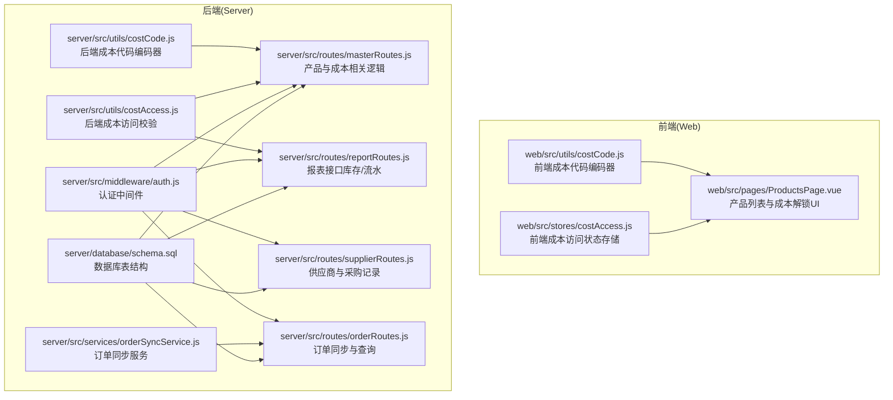
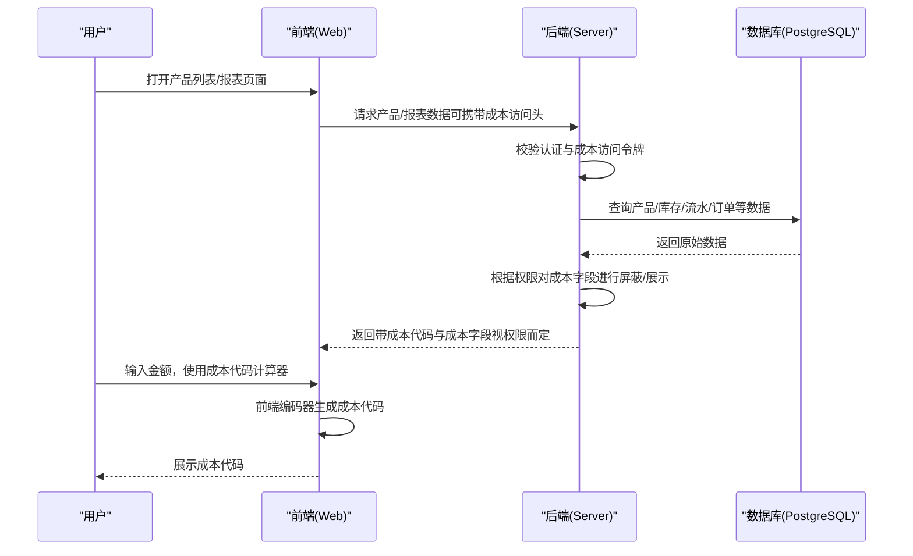
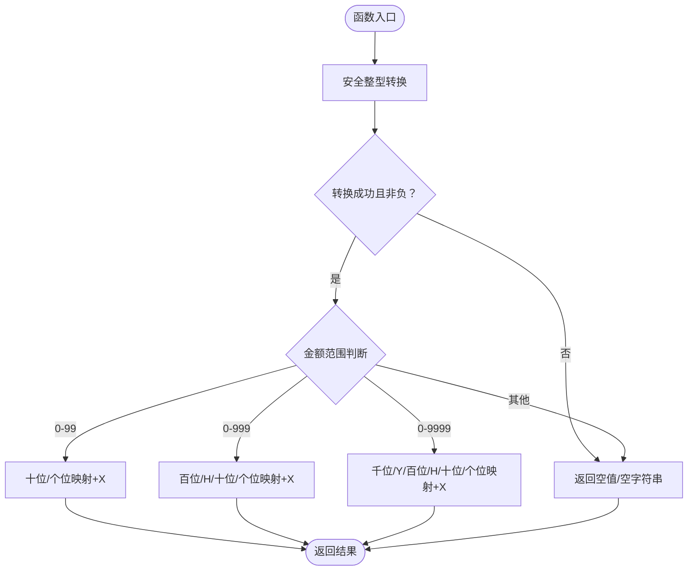
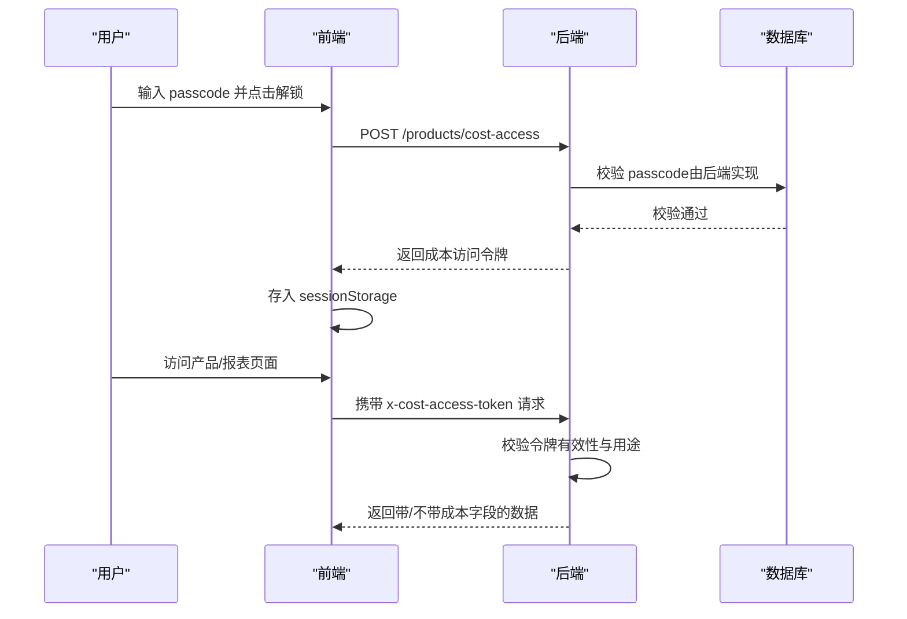
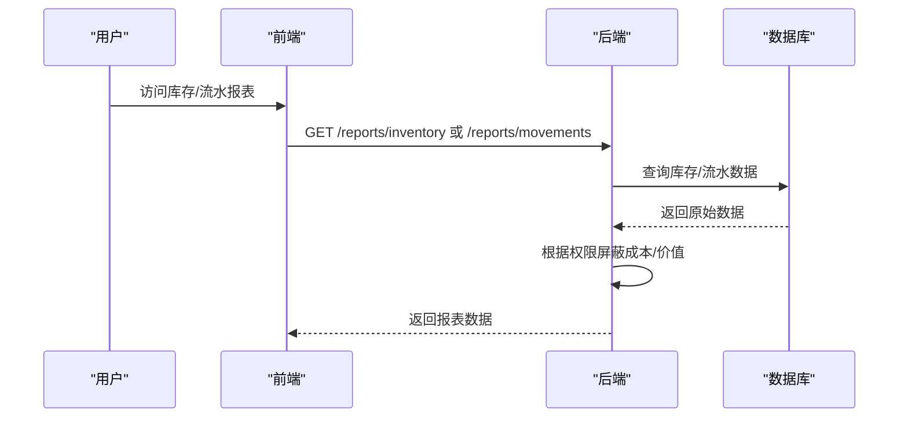
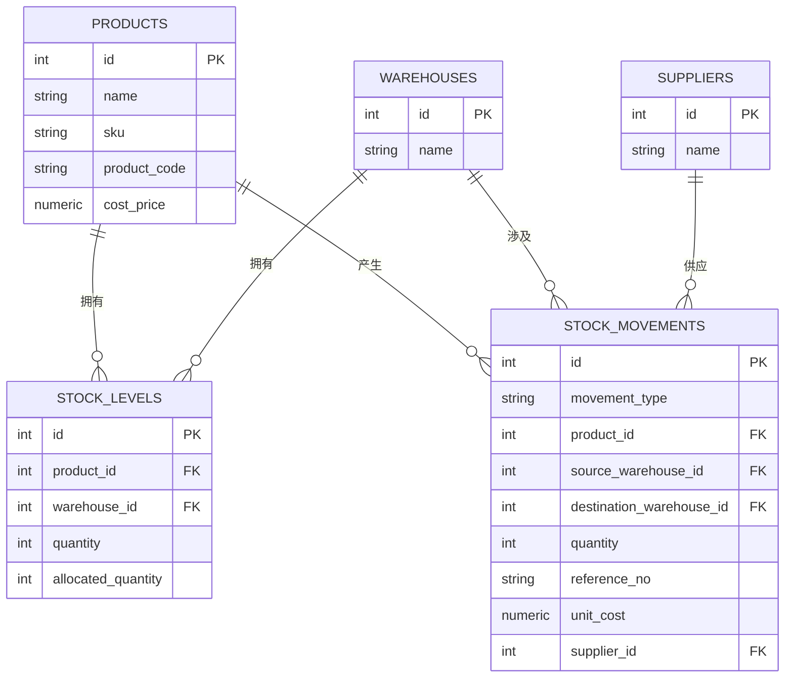
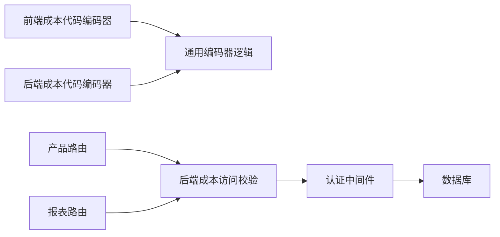

# 成本代码工具

<cite>
**本文引用的文件**
- [server/src/utils/costCode.js](file://server/src/utils/costCode.js)
- [web/src/utils/costCode.js](file://web/src/utils/costCode.js)
- [server/src/utils/costAccess.js](file://server/src/utils/costAccess.js)
- [web/src/stores/costAccess.js](file://web/src/stores/costAccess.js)
- [server/src/routes/masterRoutes.js](file://server/src/routes/masterRoutes.js)
- [server/src/routes/reportRoutes.js](file://server/src/routes/reportRoutes.js)
- [server/src/routes/supplierRoutes.js](file://server/src/routes/supplierRoutes.js)
- [server/src/routes/orderRoutes.js](file://server/src/routes/orderRoutes.js)
- [server/src/services/orderSyncService.js](file://server/src/services/orderSyncService.js)
- [server/src/middleware/auth.js](file://server/src/middleware/auth.js)
- [server/database/schema.sql](file://server/database/schema.sql)
- [postman/inventory_system_backend.postman_collection.json](file://postman/inventory_system_backend.postman_collection.json)
</cite>

## 目录
1. [简介](#简介)
2. [项目结构](#项目结构)
3. [核心组件](#核心组件)
4. [架构总览](#架构总览)
5. [详细组件分析](#详细组件分析)
6. [依赖关系分析](#依赖关系分析)
7. [性能考量](#性能考量)
8. [故障排查指南](#故障排查指南)
9. [结论](#结论)
10. [附录](#附录)

## 简介
本文件面向“成本代码工具”的实现与使用，围绕以下目标展开：
- 成本中心管理：解释成本代码的生成规则、层级结构与组织方式
- 费用归集与财务对账：说明成本分配、汇总统计与报表生成
- 数据验证与完整性：成本代码的验证规则、格式检查与数据一致性保障
- 实战场景：在采购、生产、销售等环节中如何应用成本代码进行费用追踪
- 维护与迁移：成本代码的维护策略、批量操作与数据迁移建议

本工具的核心能力包括：
- 将整数金额转换为“成本代码”（如 EHSTX、IHRTX），用于成本字段的可视化与安全展示
- 基于会话令牌的成本访问控制，确保敏感成本数据仅在授权状态下可见
- 在库存报表、流水报表等场景中按需屏蔽或展示成本字段
- 提供成本代码计算器，便于快速生成与核对

## 项目结构
后端采用 Express + PostgreSQL，前端采用 Vue 3 + Pinia；成本代码工具横跨前后端，分别提供编码算法与前端交互。

图表来源
- [server/src/utils/costCode.js:1-63](file://server/src/utils/costCode.js#L1-L63)
- [web/src/utils/costCode.js:1-59](file://web/src/utils/costCode.js#L1-L59)
- [server/src/utils/costAccess.js:1-32](file://server/src/utils/costAccess.js#L1-L32)
- [web/src/stores/costAccess.js:1-37](file://web/src/stores/costAccess.js#L1-L37)
- [server/src/routes/masterRoutes.js:1-1513](file://server/src/routes/masterRoutes.js#L1-L1513)
- [server/src/routes/reportRoutes.js:1-252](file://server/src/routes/reportRoutes.js#L1-L252)
- [server/src/routes/supplierRoutes.js:1-370](file://server/src/routes/supplierRoutes.js#L1-L370)
- [server/src/routes/orderRoutes.js:1-113](file://server/src/routes/orderRoutes.js#L1-L113)
- [server/src/services/orderSyncService.js:1-119](file://server/src/services/orderSyncService.js#L1-L119)
- [server/src/middleware/auth.js:1-46](file://server/src/middleware/auth.js#L1-L46)
- [server/database/schema.sql:1-447](file://server/database/schema.sql#L1-L447)

章节来源
- [server/src/utils/costCode.js:1-63](file://server/src/utils/costCode.js#L1-L63)
- [web/src/utils/costCode.js:1-59](file://web/src/utils/costCode.js#L1-L59)
- [server/src/utils/costAccess.js:1-32](file://server/src/utils/costAccess.js#L1-L32)
- [web/src/stores/costAccess.js:1-37](file://web/src/stores/costAccess.js#L1-L37)
- [server/src/routes/masterRoutes.js:1-1513](file://server/src/routes/masterRoutes.js#L1-L1513)
- [server/src/routes/reportRoutes.js:1-252](file://server/src/routes/reportRoutes.js#L1-L252)
- [server/src/routes/supplierRoutes.js:1-370](file://server/src/routes/supplierRoutes.js#L1-L370)
- [server/src/routes/orderRoutes.js:1-113](file://server/src/routes/orderRoutes.js#L1-L113)
- [server/src/services/orderSyncService.js:1-119](file://server/src/services/orderSyncService.js#L1-L119)
- [server/src/middleware/auth.js:1-46](file://server/src/middleware/auth.js#L1-L46)
- [server/database/schema.sql:1-447](file://server/database/schema.sql#L1-L447)

## 核心组件
- 成本代码编码器（前后端一致）
  - 功能：将整数金额映射为固定长度的字母串，作为“成本代码”
  - 规则：支持 0–99、0–999、0–9999 的金额范围，超过上限返回空值
  - 用途：在产品列表、报表等界面中替代真实成本数值显示，提升安全性
- 成本访问控制（前后端协同）
  - 后端：基于自定义头部与 JWT 校验，限定 ADMIN/MANAGER 角色
  - 前端：通过 Pinia 存储会话级解锁状态，本地 sessionStorage 持久化
- 报表与接口集成
  - 产品与成本相关接口在返回数据时根据访问权限动态屏蔽/展示成本字段
  - 报表接口支持按需加载全部数据并按权限处理成本字段

章节来源
- [server/src/utils/costCode.js:1-63](file://server/src/utils/costCode.js#L1-L63)
- [web/src/utils/costCode.js:1-59](file://web/src/utils/costCode.js#L1-L59)
- [server/src/utils/costAccess.js:1-32](file://server/src/utils/costAccess.js#L1-L32)
- [web/src/stores/costAccess.js:1-37](file://web/src/stores/costAccess.js#L1-L37)
- [server/src/routes/masterRoutes.js:119-130](file://server/src/routes/masterRoutes.js#L119-L130)
- [server/src/routes/reportRoutes.js:16-127](file://server/src/routes/reportRoutes.js#L16-L127)

## 架构总览
成本代码工具的运行流程如下：

图表来源
- [server/src/utils/costAccess.js:5-27](file://server/src/utils/costAccess.js#L5-L27)
- [server/src/routes/masterRoutes.js:119-130](file://server/src/routes/masterRoutes.js#L119-L130)
- [server/src/routes/reportRoutes.js:16-127](file://server/src/routes/reportRoutes.js#L16-L127)
- [web/src/utils/costCode.js:29-57](file://web/src/utils/costCode.js#L29-L57)

## 详细组件分析

### 成本代码生成与验证
- 生成规则
  - 0–99：两位十位/个位数字映射为字母，末尾加“X”
  - 0–999：三位百位/十位/个位数字映射为字母，格式含“H”
  - 0–9999：四位千位/百位/十位/个位数字映射为字母，格式含“YH”
  - 超出范围返回空值
- 安全性
  - 数字输入先做安全整型转换，非法或负数返回空值
  - 前端与后端采用相同的映射表，确保一致性
- 使用场景
  - 产品列表中的成本字段以“成本代码”呈现，真实成本在解锁后才可见
  - 报表导出时可按权限决定是否包含成本与库存价值

图表来源
- [server/src/utils/costCode.js:17-57](file://server/src/utils/costCode.js#L17-L57)
- [web/src/utils/costCode.js:17-57](file://web/src/utils/costCode.js#L17-L57)

章节来源
- [server/src/utils/costCode.js:1-63](file://server/src/utils/costCode.js#L1-L63)
- [web/src/utils/costCode.js:1-59](file://web/src/utils/costCode.js#L1-L59)

### 成本访问控制与权限
- 访问令牌
  - 自定义请求头：x-cost-access-token
  - 令牌内容：JWT，要求 purpose 为“cost-access”，且 userId 与当前用户一致
  - 仅 ADMIN/MANAGER 可申请访问
- 前端解锁
  - 通过调用后端接口提交 passcode，成功后在 sessionStorage 中保存令牌
  - 页面渲染时根据解锁状态决定是否展示真实成本
- 后端屏蔽
  - 在产品与报表接口中，根据 canViewCost 决定是否返回成本字段与库存价值

图表来源
- [server/src/utils/costAccess.js:5-27](file://server/src/utils/costAccess.js#L5-L27)
- [web/src/stores/costAccess.js:11-27](file://web/src/stores/costAccess.js#L11-L27)
- [postman/inventory_system_backend.postman_collection.json:100-118](file://postman/inventory_system_backend.postman_collection.json#L100-L118)

章节来源
- [server/src/utils/costAccess.js:1-32](file://server/src/utils/costAccess.js#L1-L32)
- [web/src/stores/costAccess.js:1-37](file://web/src/stores/costAccess.js#L1-L37)
- [postman/inventory_system_backend.postman_collection.json:100-118](file://postman/inventory_system_backend.postman_collection.json#L100-L118)

### 报表与费用归集
- 库存报表
  - 支持按关键字搜索、分页；当具备成本访问权限时，返回成本与库存价值
  - 库存价值 = 可用数量 × 成本单价（四舍五入至分）
- 流水报表
  - 支持时间范围与关键字搜索；包含出入库类型、仓库、参考单号等
- 与采购/销售的关联
  - 供应商页面展示最近采购流水，包含单位成本、数量、参考单号等
  - 订单同步服务从外部渠道抓取订单并写入内部表，便于后续对账

图表来源
- [server/src/routes/reportRoutes.js:16-127](file://server/src/routes/reportRoutes.js#L16-L127)
- [server/src/routes/supplierRoutes.js:171-232](file://server/src/routes/supplierRoutes.js#L171-L232)
- [server/src/routes/orderRoutes.js:13-29](file://server/src/routes/orderRoutes.js#L13-L29)
- [server/src/services/orderSyncService.js:19-114](file://server/src/services/orderSyncService.js#L19-L114)

章节来源
- [server/src/routes/reportRoutes.js:1-252](file://server/src/routes/reportRoutes.js#L1-L252)
- [server/src/routes/supplierRoutes.js:1-370](file://server/src/routes/supplierRoutes.js#L1-L370)
- [server/src/routes/orderRoutes.js:1-113](file://server/src/routes/orderRoutes.js#L1-L113)
- [server/src/services/orderSyncService.js:1-119](file://server/src/services/orderSyncService.js#L1-L119)

### 数据模型与关系
- 关键表
  - products：产品基础信息与成本单价
  - stock_levels：各仓库的库存数量与占用数量
  - stock_movements：出入库流水，包含单位成本、供应商等
  - supplier_payment_records：供应商付款记录
  - marketplace_orders / marketplace_order_items：外部订单与明细
- 关系
  - stock_movements 与 products、warehouses、suppliers 关联
  - 报表通过 JOIN 获取成本与库存价值

图表来源
- [server/database/schema.sql:32-54](file://server/database/schema.sql#L32-L54)
- [server/database/schema.sql:125-133](file://server/database/schema.sql#L125-L133)
- [server/database/schema.sql:237-248](file://server/database/schema.sql#L237-L248)
- [server/database/schema.sql:302-318](file://server/database/schema.sql#L302-L318)
- [server/database/schema.sql:221-235](file://server/database/schema.sql#L221-L235)

章节来源
- [server/database/schema.sql:1-447](file://server/database/schema.sql#L1-L447)

## 依赖关系分析
- 组件耦合
  - 成本代码编码器在前后端保持一致，降低沟通成本
  - 成本访问控制通过中间件与工具函数解耦，便于复用
- 外部依赖
  - JWT 用于令牌签发与校验
  - PostgreSQL 用于持久化与报表查询
- 潜在风险
  - 前端 sessionStorage 仅本地有效，刷新页面需重新解锁
  - 令牌有效期与角色限制需统一配置

图表来源
- [server/src/utils/costCode.js:1-63](file://server/src/utils/costCode.js#L1-L63)
- [web/src/utils/costCode.js:1-59](file://web/src/utils/costCode.js#L1-L59)
- [server/src/utils/costAccess.js:1-32](file://server/src/utils/costAccess.js#L1-L32)
- [server/src/middleware/auth.js:1-46](file://server/src/middleware/auth.js#L1-L46)
- [server/src/routes/masterRoutes.js:1-1513](file://server/src/routes/masterRoutes.js#L1-L1513)
- [server/src/routes/reportRoutes.js:1-252](file://server/src/routes/reportRoutes.js#L1-L252)

章节来源
- [server/src/utils/costCode.js:1-63](file://server/src/utils/costCode.js#L1-L63)
- [web/src/utils/costCode.js:1-59](file://web/src/utils/costCode.js#L1-L59)
- [server/src/utils/costAccess.js:1-32](file://server/src/utils/costAccess.js#L1-L32)
- [server/src/middleware/auth.js:1-46](file://server/src/middleware/auth.js#L1-L46)
- [server/src/routes/masterRoutes.js:1-1513](file://server/src/routes/masterRoutes.js#L1-L1513)
- [server/src/routes/reportRoutes.js:1-252](file://server/src/routes/reportRoutes.js#L1-L252)

## 性能考量
- 查询优化
  - 报表接口默认分页，支持“全量导出”模式（all=true）以满足大体量导出需求
  - 对常用字段建立索引，如 stock_levels(product_id, warehouse_id)、audit_logs(created_at)
- 计算开销
  - 成本代码编码为纯内存计算，复杂度低，对性能影响可忽略
- 安全与合规
  - 成本字段在未授权时屏蔽，减少敏感数据泄露风险
  - 通过中间件统一鉴权，避免重复校验

## 故障排查指南
- 无法看到成本字段
  - 确认已通过 /products/cost-access 成功解锁，并在请求头携带 x-cost-access-token
  - 检查用户角色是否为 ADMIN 或 MANAGER
- 成本代码为空
  - 检查输入金额是否在允许范围内（0–9999）
  - 确认输入为合法数字，避免负数或非有限数
- 报表导出成本缺失
  - 导出时使用 all=true 加载全部数据，再在前端按权限处理
- 令牌无效
  - 检查 JWT 是否过期、purpose 是否为“cost-access”、userId 是否匹配当前用户

章节来源
- [server/src/utils/costAccess.js:5-27](file://server/src/utils/costAccess.js#L5-L27)
- [server/src/routes/masterRoutes.js:119-130](file://server/src/routes/masterRoutes.js#L119-L130)
- [server/src/routes/reportRoutes.js:16-127](file://server/src/routes/reportRoutes.js#L16-L127)
- [postman/inventory_system_backend.postman_collection.json:100-118](file://postman/inventory_system_backend.postman_collection.json#L100-L118)

## 结论
成本代码工具通过“编码器 + 访问控制 + 报表集成”的组合，实现了成本数据的安全展示与高效追踪。其设计强调：
- 易用性：前端提供成本代码计算器，快速生成与核对
- 安全性：基于角色与令牌的成本访问控制，避免敏感信息泄露
- 可扩展性：编码规则清晰，易于扩展到更复杂的成本维度
- 可审计性：所有关键操作均有审计日志，配合报表实现财务对账闭环

## 附录

### 实际业务场景示例
- 采购环节
  - 供应商页面展示最近采购流水，包含单位成本、数量、参考单号，便于对账
  - 通过订单同步服务抓取外部订单，自动落库，形成完整的采购链路
- 生产环节
  - 产品成本单价变更时，记录历史与通知策略，便于追溯与预警
- 销售环节
  - 库存报表按仓库与品类汇总，结合成本与售价计算毛利，支撑销售决策

章节来源
- [server/src/routes/supplierRoutes.js:171-232](file://server/src/routes/supplierRoutes.js#L171-L232)
- [server/src/services/orderSyncService.js:19-114](file://server/src/services/orderSyncService.js#L19-L114)
- [server/src/routes/masterRoutes.js:234-281](file://server/src/routes/masterRoutes.js#L234-L281)
- [server/src/routes/reportRoutes.js:16-127](file://server/src/routes/reportRoutes.js#L16-L127)

### 成本代码维护与批量操作
- 维护建议
  - 保持前后端编码器一致，避免展示差异
  - 对成本字段变更设置阈值与通知策略，便于及时发现异常波动
- 批量操作
  - 产品列表支持批量选择与批量导出标签，间接支持批量成本核对
  - 报表支持全量导出，便于离线分析与审计

章节来源
- [web/src/pages/ProductsPage.vue:547-598](file://web/src/pages/ProductsPage.vue#L547-L598)
- [server/src/routes/reportRoutes.js:16-127](file://server/src/routes/reportRoutes.js#L16-L127)

### 数据迁移指引
- 迁移步骤
  - 评估现有成本字段与历史数据，确认迁移范围
  - 在迁移期间保持成本访问控制开启，确保数据一致性
  - 导出报表进行交叉验证，重点比对成本单价与库存价值
- 注意事项
  - 迁移后统一调整编码器版本，避免历史数据与新数据混用
  - 对历史流水补充单位成本字段，确保对账准确性