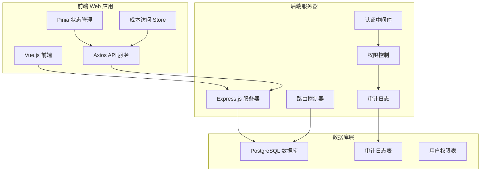
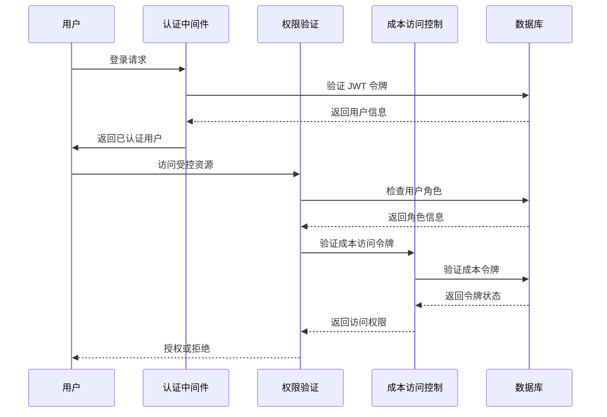
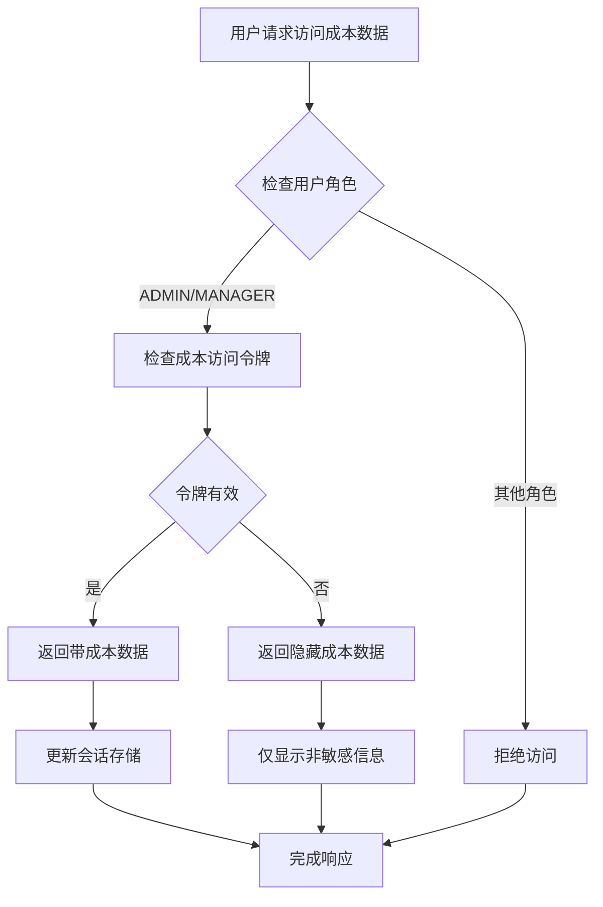
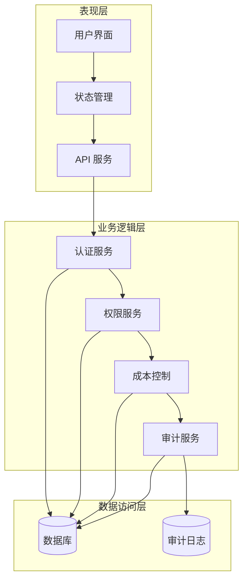
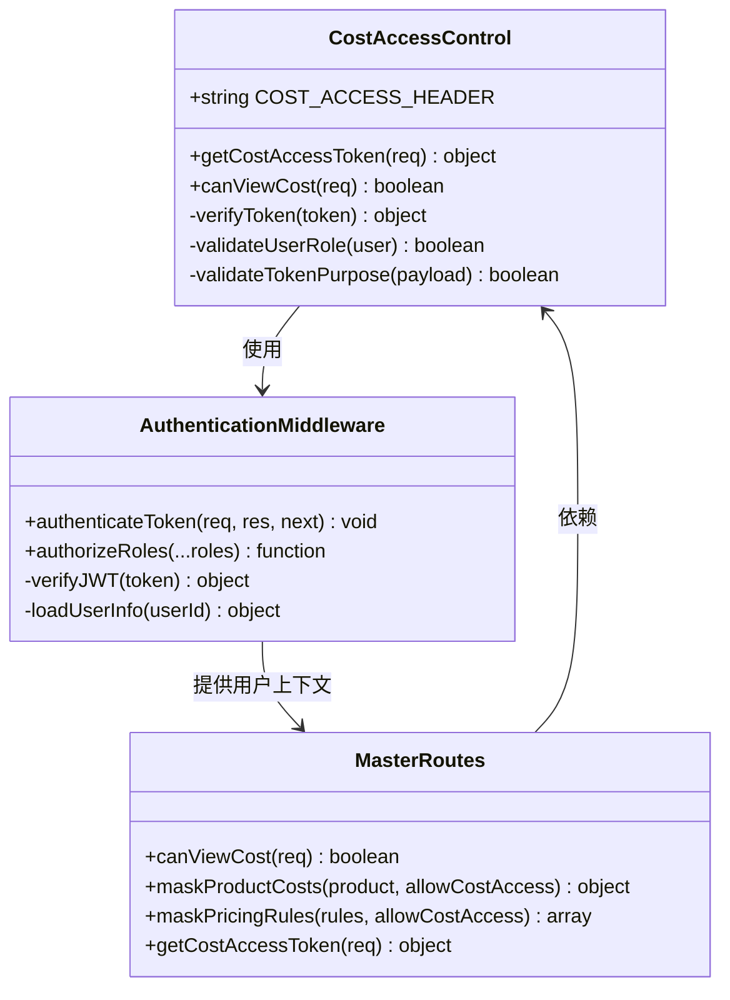
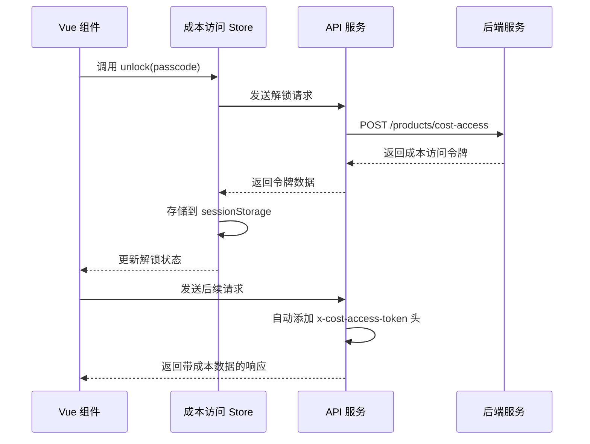
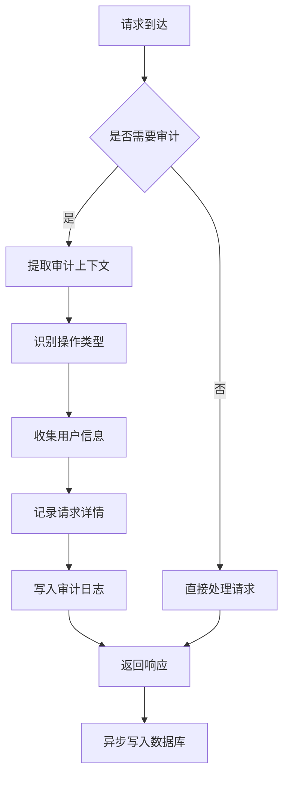
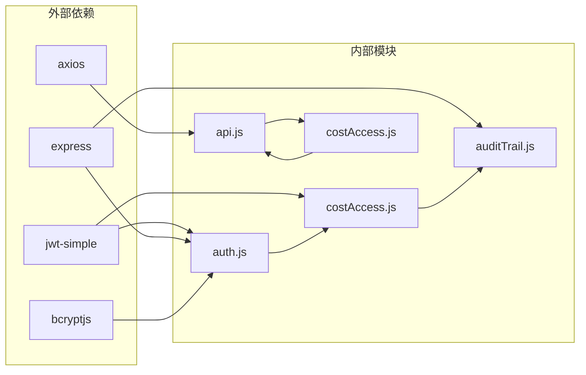

# 成本访问控制工具

<cite>
**本文档引用的文件**
- [server/src/utils/costAccess.js](file://server/src/utils/costAccess.js)
- [server/src/middleware/auth.js](file://server/src/middleware/auth.js)
- [server/src/middleware/auditTrail.js](file://server/src/middleware/auditTrail.js)
- [server/src/utils/auditLog.js](file://server/src/utils/auditLog.js)
- [server/src/routes/masterRoutes.js](file://server/src/routes/masterRoutes.js)
- [server/src/routes/inventoryRoutes.js](file://server/src/routes/inventoryRoutes.js)
- [web/src/stores/costAccess.js](file://web/src/stores/costAccess.js)
- [web/src/services/api.js](file://web/src/services/api.js)
- [web/src/constants/accessGuide.js](file://web/src/constants/accessGuide.js)
- [server/test/integration.test.js](file://server/test/integration.test.js)
- [postman/inventory_system_backend.postman_collection.json](file://postman/inventory_system_backend.postman_collection.json)
</cite>

## 目录
1. [简介](#简介)
2. [项目结构](#项目结构)
3. [核心组件](#核心组件)
4. [架构概览](#架构概览)
5. [详细组件分析](#详细组件分析)
6. [依赖关系分析](#依赖关系分析)
7. [性能考虑](#性能考虑)
8. [故障排除指南](#故障排除指南)
9. [结论](#结论)
10. [附录](#附录)

## 简介

成本访问控制工具是一个专为库存管理系统设计的安全访问控制解决方案。该工具通过双重认证机制确保只有授权用户才能访问敏感的成本数据，同时提供细粒度的权限管理和审计跟踪功能。

该系统的核心特性包括：
- 基于角色的访问控制（RBAC）
- 成本数据的动态可见性控制
- 多层安全验证机制
- 完整的操作审计日志
- 用户友好的权限管理界面

## 项目结构

项目采用前后端分离的架构设计，主要分为以下模块：

**图表来源**
- [server/src/app.js](file://server/src/app.js)
- [web/src/main.js](file://web/src/main.js)

**章节来源**
- [server/src/app.js](file://server/src/app.js)
- [web/src/main.js](file://web/src/main.js)

## 核心组件

### 认证与授权机制

系统采用多层认证架构，确保只有经过严格验证的用户才能访问敏感功能：

**图表来源**
- [server/src/middleware/auth.js](file://server/src/middleware/auth.js)
- [server/src/utils/costAccess.js](file://server/src/utils/costAccess.js)

### 成本数据访问控制

系统实现了灵活的成本数据访问控制机制，通过专门的令牌来控制成本价格的可见性：

**图表来源**
- [server/src/utils/costAccess.js](file://server/src/utils/costAccess.js)
- [web/src/stores/costAccess.js](file://web/src/stores/costAccess.js)

**章节来源**
- [server/src/middleware/auth.js](file://server/src/middleware/auth.js)
- [server/src/utils/costAccess.js](file://server/src/utils/costAccess.js)
- [web/src/stores/costAccess.js](file://web/src/stores/costAccess.js)

## 架构概览

系统采用分层架构设计，确保职责分离和安全性：

**图表来源**
- [server/src/middleware/auth.js](file://server/src/middleware/auth.js)
- [server/src/middleware/auditTrail.js](file://server/src/middleware/auditTrail.js)
- [web/src/services/api.js](file://web/src/services/api.js)

### 角色权限矩阵

系统定义了三种基本角色，每种角色具有不同的权限级别：

| 角色 | 权限描述 | 可访问功能 |
|------|----------|------------|
| ADMIN | 系统管理员 | 所有功能完全访问 |
| MANAGER | 仓库经理 | 日常运营功能 |
| STAFF | 前线员工 | 基础操作功能 |

**章节来源**
- [web/src/constants/accessGuide.js](file://web/src/constants/accessGuide.js)

## 详细组件分析

### 成本访问控制核心实现

#### 后端成本访问验证

成本访问控制的核心逻辑位于 `costAccess.js` 文件中，实现了严格的令牌验证机制：

**图表来源**
- [server/src/utils/costAccess.js](file://server/src/utils/costAccess.js)
- [server/src/middleware/auth.js](file://server/src/middleware/auth.js)
- [server/src/routes/masterRoutes.js](file://server/src/routes/masterRoutes.js)

#### 前端成本访问管理

前端通过 Pinia 状态管理实现成本访问的本地存储和同步：

**图表来源**
- [web/src/stores/costAccess.js](file://web/src/stores/costAccess.js)
- [web/src/services/api.js](file://web/src/services/api.js)

**章节来源**
- [server/src/utils/costAccess.js](file://server/src/utils/costAccess.js)
- [web/src/stores/costAccess.js](file://web/src/stores/costAccess.js)
- [web/src/services/api.js](file://web/src/services/api.js)

### 审计日志系统

系统实现了完整的操作审计功能，记录所有重要的用户活动：

**图表来源**
- [server/src/middleware/auditTrail.js](file://server/src/middleware/auditTrail.js)
- [server/src/utils/auditLog.js](file://server/src/utils/auditLog.js)

**章节来源**
- [server/src/middleware/auditTrail.js](file://server/src/middleware/auditTrail.js)
- [server/src/utils/auditLog.js](file://server/src/utils/auditLog.js)

### 数据访问限制机制

系统通过多种方式实现数据访问限制：

1. **路由级别的权限控制**
2. **运行时的成本数据遮蔽**
3. **用户会话状态管理**

**章节来源**
- [server/src/routes/inventoryRoutes.js](file://server/src/routes/inventoryRoutes.js)
- [server/src/routes/masterRoutes.js](file://server/src/routes/masterRoutes.js)

## 依赖关系分析

系统各组件之间的依赖关系如下：

**图表来源**
- [server/src/middleware/auth.js](file://server/src/middleware/auth.js)
- [server/src/utils/costAccess.js](file://server/src/utils/costAccess.js)
- [server/src/middleware/auditTrail.js](file://server/src/middleware/auditTrail.js)
- [web/src/services/api.js](file://web/src/services/api.js)
- [web/src/stores/costAccess.js](file://web/src/stores/costAccess.js)

**章节来源**
- [server/src/middleware/auth.js](file://server/src/middleware/auth.js)
- [server/src/utils/costAccess.js](file://server/src/utils/costAccess.js)
- [web/src/services/api.js](file://web/src/services/api.js)

## 性能考虑

系统在设计时充分考虑了性能优化：

### 缓存策略
- 成本访问令牌存储在 sessionStorage 中，避免重复验证
- 用户会话信息缓存在内存中
- 前端状态管理优化响应速度

### 数据传输优化
- 分页查询减少一次性数据传输量
- 条件查询优化数据库性能
- 成本数据按需加载

### 并发处理
- 异步操作避免阻塞主线程
- Promise 并行处理提高响应速度
- 连接池管理数据库连接

## 故障排除指南

### 常见问题及解决方案

#### 认证失败
**症状**: 用户无法登录或频繁被登出
**可能原因**:
- JWT 密钥配置错误
- 令牌过期
- 用户账户状态异常

**解决步骤**:
1. 检查环境变量配置
2. 验证用户账户状态
3. 重新生成认证令牌

#### 权限不足
**症状**: 用户收到 403 错误
**可能原因**:
- 用户角色权限不足
- 成本访问令牌缺失
- 会话状态过期

**解决步骤**:
1. 确认用户角色配置
2. 重新申请成本访问权限
3. 清除浏览器缓存重新登录

#### 审计日志异常
**症状**: 审计日志记录失败
**可能原因**:
- 数据库连接问题
- 审计表结构异常
- 权限不足

**解决步骤**:
1. 检查数据库连接状态
2. 验证审计表结构完整性
3. 确认写入权限

**章节来源**
- [server/src/middleware/auth.js](file://server/src/middleware/auth.js)
- [server/src/middleware/auditTrail.js](file://server/src/middleware/auditTrail.js)

## 结论

成本访问控制工具通过多层次的安全机制和灵活的权限管理，为库存管理系统提供了可靠的访问控制解决方案。系统的主要优势包括：

1. **强安全性**: 双重认证机制确保敏感数据的安全访问
2. **灵活性**: 支持细粒度的权限控制和动态访问管理
3. **可追溯性**: 完整的审计日志系统提供操作追踪能力
4. **易用性**: 用户友好的界面和清晰的权限说明

该工具适用于需要严格控制成本数据访问权限的企业级库存管理场景，能够有效防止敏感信息泄露，同时保持系统的可用性和性能。

## 附录

### 使用示例

#### 场景一：管理员查看产品成本
管理员需要查看产品的详细成本信息，包括采购价格、供应商信息等。

**操作流程**:
1. 管理员登录系统
2. 申请成本访问权限
3. 系统验证管理员身份
4. 返回带完整成本信息的产品详情

#### 场景二：普通员工查看库存状态
普通员工只需要查看库存数量和基本产品信息，不需要看到成本数据。

**操作流程**:
1. 员工登录系统
2. 系统返回隐藏成本数据的库存信息
3. 员工只能看到可用数量、仓库位置等公开信息

#### 场景三：跨部门协作
不同部门的员工需要在特定情况下访问成本数据。

**操作流程**:
1. 部门主管申请临时成本访问权限
2. 系统验证主管身份和权限
3. 在限定时间内提供成本数据访问
4. 权限到期自动失效

### 最佳实践建议

1. **定期审查权限**: 定期检查用户角色和权限分配
2. **监控异常访问**: 建立异常访问行为的监控机制
3. **最小权限原则**: 为用户分配完成工作所需的最小权限
4. **定期培训**: 对用户进行安全意识和权限管理培训
5. **备份恢复**: 建立完善的备份和恢复机制