# 应用服务器

<cite>
**本文引用的文件**
- [server/src/app.js](file://server/src/app.js)
- [server/src/server.js](file://server/src/server.js)
- [server/src/config/db.js](file://server/src/config/db.js)
- [server/src/middleware/auditTrail.js](file://server/src/middleware/auditTrail.js)
- [server/src/middleware/response.js](file://server/src/middleware/response.js)
- [server/src/middleware/auth.js](file://server/src/middleware/auth.js)
- [server/src/middleware/rateLimit.js](file://server/src/middleware/rateLimit.js)
- [server/src/utils/auditLog.js](file://server/src/utils/auditLog.js)
- [server/src/utils/inventoryService.js](file://server/src/utils/inventoryService.js)
- [server/src/utils/pagination.js](file://server/src/utils/pagination.js)
- [server/src/routes/inventoryRoutes.js](file://server/src/routes/inventoryRoutes.js)
- [server/src/routes/authRoutes.js](file://server/src/routes/authRoutes.js)
- [server/package.json](file://server/package.json)
- [server/Dockerfile](file://server/Dockerfile)
</cite>

## 目录
1. [简介](#简介)
2. [项目结构](#项目结构)
3. [核心组件](#核心组件)
4. [架构总览](#架构总览)
5. [详细组件分析](#详细组件分析)
6. [依赖关系分析](#依赖关系分析)
7. [性能考虑](#性能考虑)
8. [故障排除指南](#故障排除指南)
9. [结论](#结论)
10. [附录](#附录)

## 简介
本文件面向库存管理系统的应用服务器，聚焦于 Express 应用实例的初始化与运行机制，涵盖中间件配置（CORS、Helmet、日志、审计与统一响应）、路由注册策略、错误处理机制、服务器启动流程、健康检查端点以及基础配置选项。同时提供请求处理管道说明、性能优化建议、内存与进程监控最佳实践、生产部署注意事项与常见问题排查方法。

## 项目结构
应用服务器位于 server 子目录，采用按职责分层组织：
- 配置层：数据库连接池与 SSL 选择逻辑
- 中间件层：认证、审计、速率限制、统一响应包装
- 路由层：按业务域划分的 REST 接口
- 工具层：审计日志写入、库存事务封装、分页工具
- 启动入口：Express 应用与服务器启动脚本

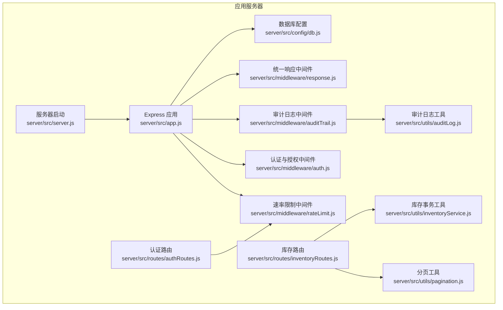

图表来源
- [server/src/app.js:1-67](file://server/src/app.js#L1-L67)
- [server/src/server.js:1-28](file://server/src/server.js#L1-L28)
- [server/src/config/db.js:1-25](file://server/src/config/db.js#L1-L25)
- [server/src/middleware/response.js:1-62](file://server/src/middleware/response.js#L1-L62)
- [server/src/middleware/auditTrail.js:1-84](file://server/src/middleware/auditTrail.js#L1-L84)
- [server/src/middleware/auth.js:1-46](file://server/src/middleware/auth.js#L1-L46)
- [server/src/middleware/rateLimit.js:1-40](file://server/src/middleware/rateLimit.js#L1-L40)
- [server/src/utils/auditLog.js:1-38](file://server/src/utils/auditLog.js#L1-L38)
- [server/src/utils/inventoryService.js:1-45](file://server/src/utils/inventoryService.js#L1-L45)
- [server/src/utils/pagination.js:1-28](file://server/src/utils/pagination.js#L1-L28)
- [server/src/routes/inventoryRoutes.js:1-493](file://server/src/routes/inventoryRoutes.js#L1-L493)
- [server/src/routes/authRoutes.js:1-72](file://server/src/routes/authRoutes.js#L1-L72)

章节来源
- [server/src/app.js:1-67](file://server/src/app.js#L1-L67)
- [server/src/server.js:1-28](file://server/src/server.js#L1-L28)

## 核心组件
- Express 应用初始化与中间件链
  - 安全头、跨域、JSON 解析、日志、审计与统一响应中间件依次入栈
  - 健康检查端点 /api/health 返回状态
- 路由注册
  - 按前缀分组注册各业务模块路由，如 /api/auth、/api/inventory、/api/orders 等
- 错误处理
  - 兜底错误中间件统一返回结构化错误响应，避免直接暴露堆栈
- 数据库连接
  - 使用 pg 连接池，根据环境与连接字符串自动决定是否启用 SSL
  - 启动阶段进行数据库连通性校验，超时则终止进程
- 认证与授权
  - 基于 JWT 的认证中间件，校验令牌并注入用户信息
  - 角色级授权中间件，限制特定操作的访问范围
- 速率限制
  - 基于内存桶的限流器，支持命名空间与窗口配置
- 统一响应
  - 自动为所有响应附加 requestId；成功/失败响应结构标准化
- 审计日志
  - 在请求完成后异步写入审计日志，敏感字段脱敏

章节来源
- [server/src/app.js:26-64](file://server/src/app.js#L26-L64)
- [server/src/server.js:13-25](file://server/src/server.js#L13-L25)
- [server/src/config/db.js:1-25](file://server/src/config/db.js#L1-L25)
- [server/src/middleware/auth.js:1-46](file://server/src/middleware/auth.js#L1-L46)
- [server/src/middleware/rateLimit.js:1-40](file://server/src/middleware/rateLimit.js#L1-L40)
- [server/src/middleware/response.js:1-62](file://server/src/middleware/response.js#L1-L62)
- [server/src/middleware/auditTrail.js:1-84](file://server/src/middleware/auditTrail.js#L1-L84)
- [server/src/utils/auditLog.js:1-38](file://server/src/utils/auditLog.js#L1-L38)

## 架构总览
下图展示从客户端请求到数据库查询与审计日志写入的整体流程，以及关键中间件在请求生命周期中的作用。

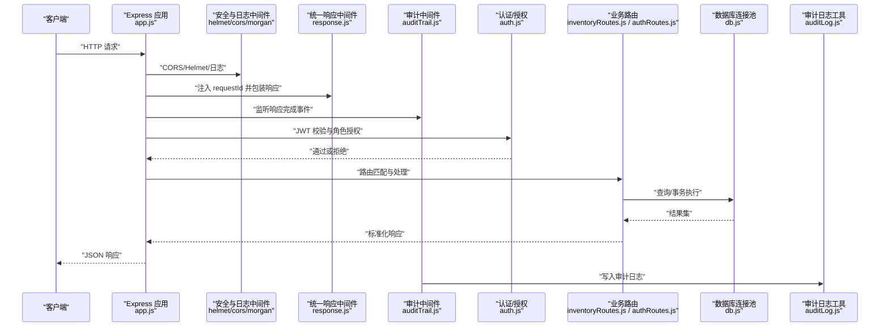

图表来源
- [server/src/app.js:28-34](file://server/src/app.js#L28-L34)
- [server/src/middleware/response.js:3-57](file://server/src/middleware/response.js#L3-L57)
- [server/src/middleware/auditTrail.js:47-79](file://server/src/middleware/auditTrail.js#L47-L79)
- [server/src/middleware/auth.js:5-29](file://server/src/middleware/auth.js#L5-L29)
- [server/src/routes/inventoryRoutes.js:1-20](file://server/src/routes/inventoryRoutes.js#L1-L20)
- [server/src/routes/authRoutes.js:1-20](file://server/src/routes/authRoutes.js#L1-L20)
- [server/src/config/db.js:15-19](file://server/src/config/db.js#L15-L19)
- [server/src/utils/auditLog.js:1-33](file://server/src/utils/auditLog.js#L1-L33)

## 详细组件分析

### Express 应用初始化与中间件管道
- 初始化顺序
  - 安全头：Helmet
  - 跨域：CORS
  - 日志：Morgan（开发格式）
  - 统一响应：注入 requestId 与响应包装函数
  - 审计日志：finish 事件后异步写入
- 健康检查
  - GET /api/health 返回服务可用状态
- 错误处理
  - 兜底错误中间件优先使用 res.fail 或 res.status(500) 返回结构化错误

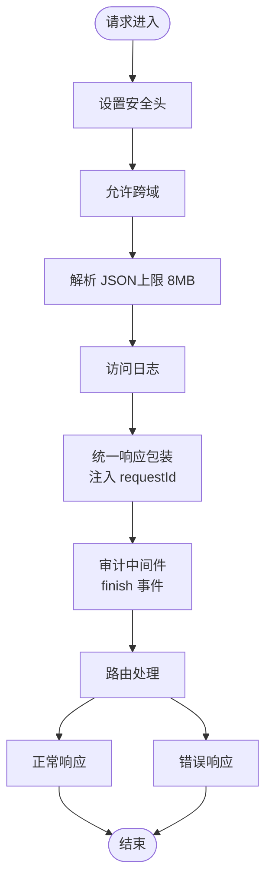

图表来源
- [server/src/app.js:28-38](file://server/src/app.js#L28-L38)
- [server/src/middleware/response.js:3-57](file://server/src/middleware/response.js#L3-L57)
- [server/src/middleware/auditTrail.js:47-79](file://server/src/middleware/auditTrail.js#L47-L79)

章节来源
- [server/src/app.js:26-64](file://server/src/app.js#L26-L64)

### 服务器启动流程与健康检查
- 启动流程
  - 读取端口（默认 4000），启动 HTTP 服务
  - 启动前对数据库执行一次查询以验证连通性，超时时间可配置
  - 失败时关闭服务器并退出进程
- 健康检查
  - GET /api/health 返回 { status: "ok" }

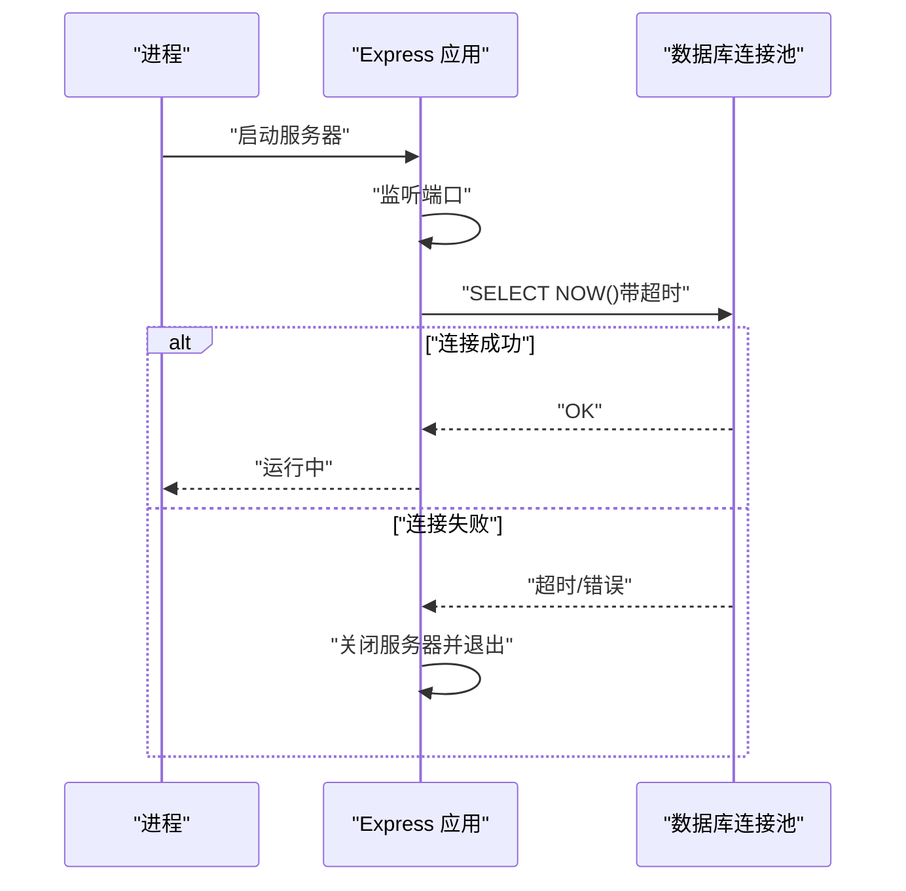

图表来源
- [server/src/server.js:13-25](file://server/src/server.js#L13-L25)

章节来源
- [server/src/server.js:1-28](file://server/src/server.js#L1-L28)

### 认证与授权中间件
- 认证
  - 从 Authorization 头提取 Bearer 令牌并校验
  - 成功后查询用户信息并注入到 req.user
- 授权
  - 角色白名单中间件，仅允许指定角色访问受保护接口

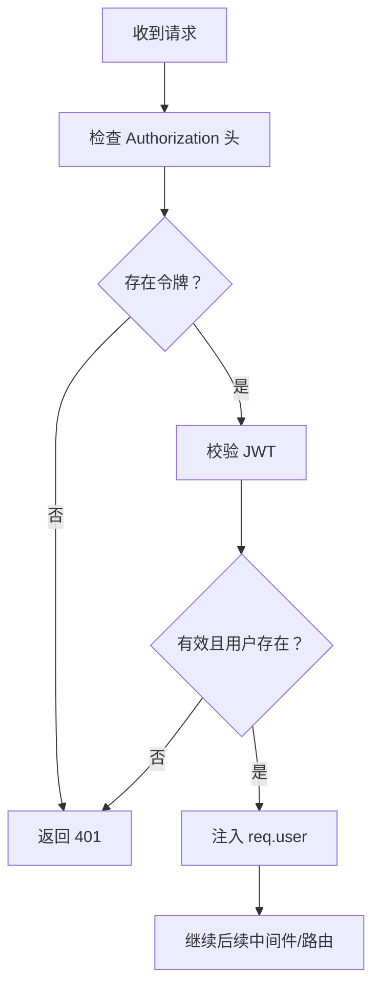

图表来源
- [server/src/middleware/auth.js:5-29](file://server/src/middleware/auth.js#L5-L29)

章节来源
- [server/src/middleware/auth.js:1-46](file://server/src/middleware/auth.js#L1-L46)

### 速率限制中间件
- 内存桶实现
  - 以 namespace:clientKey 为维度统计请求次数
  - 基于窗口时间与最大请求数判断是否触发限流
- 响应
  - 设置 Retry-After 头，使用 res.fail 或 429 返回结构化错误

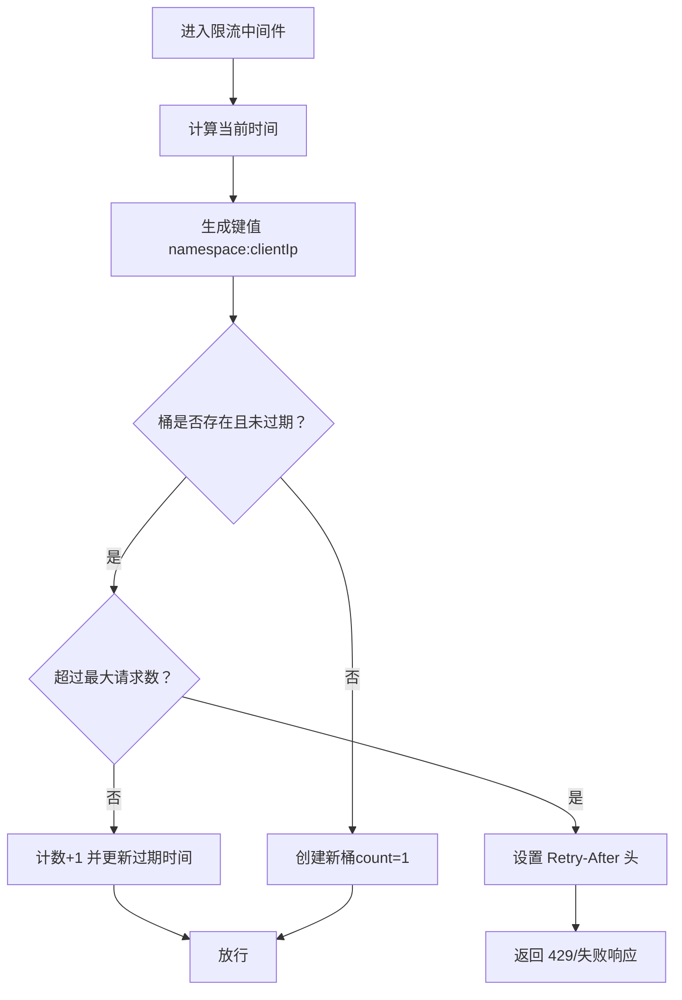

图表来源
- [server/src/middleware/rateLimit.js:9-35](file://server/src/middleware/rateLimit.js#L9-L35)

章节来源
- [server/src/middleware/rateLimit.js:1-40](file://server/src/middleware/rateLimit.js#L1-L40)

### 统一响应中间件
- 注入 x-request-id 与 req.requestId
- 重写 res.json：成功/失败自动包装标准结构
- 提供 res.success 与 res.fail 快捷方法

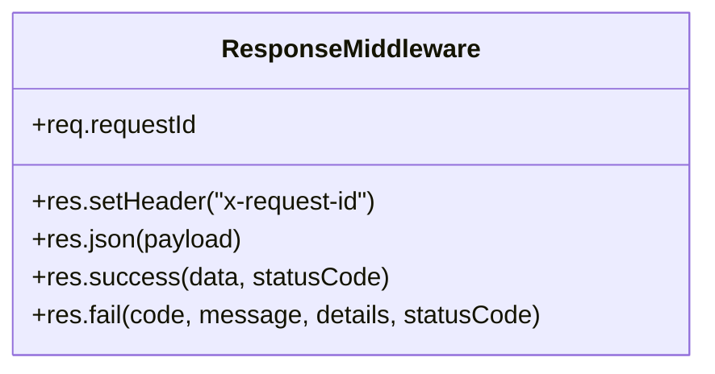

图表来源
- [server/src/middleware/response.js:3-57](file://server/src/middleware/response.js#L3-L57)

章节来源
- [server/src/middleware/response.js:1-62](file://server/src/middleware/response.js#L1-L62)

### 审计日志中间件与工具
- 审计上下文推断
  - 识别登录成功、增删改等动作，提取实体类型/ID/描述
  - 对敏感字段（如密码）进行脱敏
- 异步写入
  - finish 事件后调用工具函数写入审计日志表

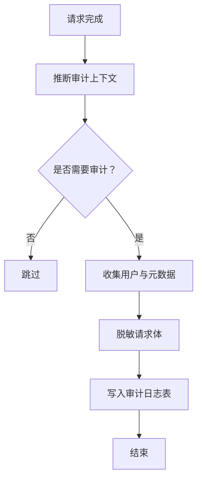

图表来源
- [server/src/middleware/auditTrail.js:14-79](file://server/src/middleware/auditTrail.js#L14-L79)
- [server/src/utils/auditLog.js:1-33](file://server/src/utils/auditLog.js#L1-L33)

章节来源
- [server/src/middleware/auditTrail.js:1-84](file://server/src/middleware/auditTrail.js#L1-L84)
- [server/src/utils/auditLog.js:1-38](file://server/src/utils/auditLog.js#L1-L38)

### 库存路由与事务封装
- 路由保护
  - 所有库存相关路由均使用 authenticateToken 作为前置中间件
- 事务封装
  - 统一的库存行确保、查询与更新函数，减少重复代码
- 分页与成本可见性
  - 统一分页参数与分页结构
  - 根据权限隐藏/显示成本价格字段

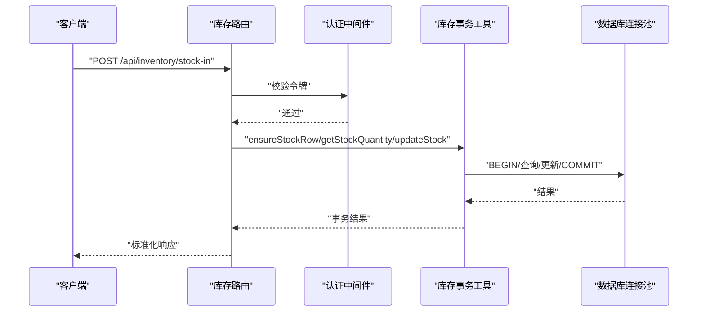

图表来源
- [server/src/routes/inventoryRoutes.js:10-20](file://server/src/routes/inventoryRoutes.js#L10-L20)
- [server/src/utils/inventoryService.js:2-38](file://server/src/utils/inventoryService.js#L2-L38)

章节来源
- [server/src/routes/inventoryRoutes.js:1-493](file://server/src/routes/inventoryRoutes.js#L1-L493)
- [server/src/utils/inventoryService.js:1-45](file://server/src/utils/inventoryService.js#L1-L45)
- [server/src/utils/pagination.js:1-28](file://server/src/utils/pagination.js#L1-L28)

### 认证路由与登录限流
- 登录接口
  - 校验邮箱与密码，验证用户状态，签发 JWT
  - 将审计用户信息注入到请求对象，便于审计
- 登录限流
  - 基于 IP 与命名空间的限流器，防止暴力破解

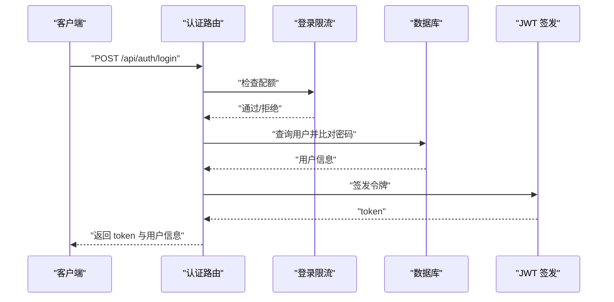

图表来源
- [server/src/routes/authRoutes.js:17-64](file://server/src/routes/authRoutes.js#L17-L64)
- [server/src/middleware/rateLimit.js:9-35](file://server/src/middleware/rateLimit.js#L9-L35)

章节来源
- [server/src/routes/authRoutes.js:1-72](file://server/src/routes/authRoutes.js#L1-L72)
- [server/src/middleware/rateLimit.js:1-40](file://server/src/middleware/rateLimit.js#L1-L40)

## 依赖关系分析
- 应用依赖
  - Express、CORS、Helmet、Morgan、pg、bcryptjs、jsonwebtoken、multer
- 启动脚本
  - 开发：nodemon
  - 生产：node
- 容器镜像
  - 基于 node:20-alpine，仅安装生产依赖，暴露 4000 端口

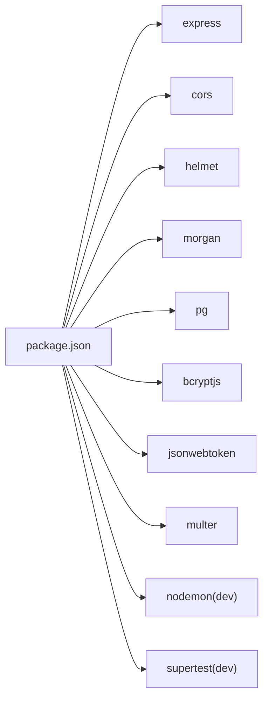

图表来源
- [server/package.json:15-29](file://server/package.json#L15-L29)

章节来源
- [server/package.json:1-31](file://server/package.json#L1-L31)
- [server/Dockerfile:1-13](file://server/Dockerfile#L1-L13)

## 性能考虑
- 请求体大小限制
  - JSON 解析上限 8MB，避免过大负载导致内存压力
- 数据库连接与 SSL
  - 自动根据连接字符串与环境选择 SSL；生产环境默认启用
  - 可配置连接超时，避免长时间阻塞启动
- 查询与分页
  - 库存与交易列表支持分页与条件过滤，降低单次响应体积
  - 使用并发查询构建分页数据，减少往返次数
- 事务与一致性
  - 库存变动使用显式事务，确保原子性与一致性
- 中间件开销
  - 审计日志在 finish 事件后异步写入，避免阻塞主响应路径
- 缓存与限流
  - 速率限制基于内存桶，适合轻量场景；高并发建议引入外部缓存或限流网关

章节来源
- [server/src/app.js:31-33](file://server/src/app.js#L31-L33)
- [server/src/config/db.js:3-11](file://server/src/config/db.js#L3-L11)
- [server/src/config/db.js:15-19](file://server/src/config/db.js#L15-L19)
- [server/src/routes/inventoryRoutes.js:76-139](file://server/src/routes/inventoryRoutes.js#L76-L139)
- [server/src/utils/inventoryService.js:2-38](file://server/src/utils/inventoryService.js#L2-L38)
- [server/src/middleware/auditTrail.js:47-79](file://server/src/middleware/auditTrail.js#L47-L79)
- [server/src/middleware/rateLimit.js:9-35](file://server/src/middleware/rateLimit.js#L9-L35)

## 故障排除指南
- 启动阶段数据库连接失败
  - 现象：启动后立即退出，控制台输出数据库连接错误
  - 排查：检查 DATABASE_URL、SSL 配置、网络连通性；调整 STARTUP_DB_TIMEOUT_MS
- 401 未授权
  - 现象：认证相关接口返回 401
  - 排查：确认 Authorization 头格式为 Bearer 令牌；核对 JWT_SECRET；检查用户状态
- 403 权限不足
  - 现象：受角色保护的接口返回 403
  - 排查：确认用户角色是否在授权白名单内
- 429 请求过多
  - 现象：登录接口频繁失败
  - 排查：查看 Retry-After 头；调整限流窗口与阈值；检查代理/负载均衡后的客户端 IP
- 500 内部错误
  - 现象：通用错误响应
  - 排查：查看统一错误中间件返回的 message 与 error 字段；检查审计日志与数据库异常
- 审计日志未写入
  - 现象：审计表无记录
  - 排查：确认审计中间件已注册；finish 事件是否触发；数据库写入异常

章节来源
- [server/src/server.js:18-24](file://server/src/server.js#L18-L24)
- [server/src/middleware/auth.js:9-28](file://server/src/middleware/auth.js#L9-L28)
- [server/src/middleware/rateLimit.js:23-29](file://server/src/middleware/rateLimit.js#L23-L29)
- [server/src/app.js:57-64](file://server/src/app.js#L57-L64)
- [server/src/middleware/auditTrail.js:73-75](file://server/src/middleware/auditTrail.js#L73-L75)

## 结论
本应用服务器围绕 Express 构建，采用中间件化设计，将安全、跨域、日志、审计、统一响应与限流等横切关注点解耦。通过严格的启动前数据库校验、结构化的错误处理与审计日志，提升了系统的可观测性与可靠性。结合分页与事务封装，满足了库存管理场景下的性能与一致性需求。生产部署建议配合容器编排、外部限流与监控告警体系，持续优化资源使用与稳定性。

## 附录
- 基础配置选项
  - 端口：PORT（默认 4000）
  - 数据库连接：DATABASE_URL（自动决定 SSL）
  - 启动数据库超时：STARTUP_DB_TIMEOUT_MS（毫秒）
  - 连接超时：PG_CONNECT_TIMEOUT_MS（毫秒）
  - JWT 密钥：JWT_SECRET
  - SSL 模式：PGSSLMODE（生产环境默认启用）
- 健康检查
  - GET /api/health
- 容器化
  - 镜像：node:20-alpine
  - 仅安装生产依赖，暴露 4000 端口

章节来源
- [server/src/server.js:4-4](file://server/src/server.js#L4-L4)
- [server/src/config/db.js:13-19](file://server/src/config/db.js#L13-L19)
- [server/src/app.js:36-38](file://server/src/app.js#L36-L38)
- [server/Dockerfile:1-13](file://server/Dockerfile#L1-L13)