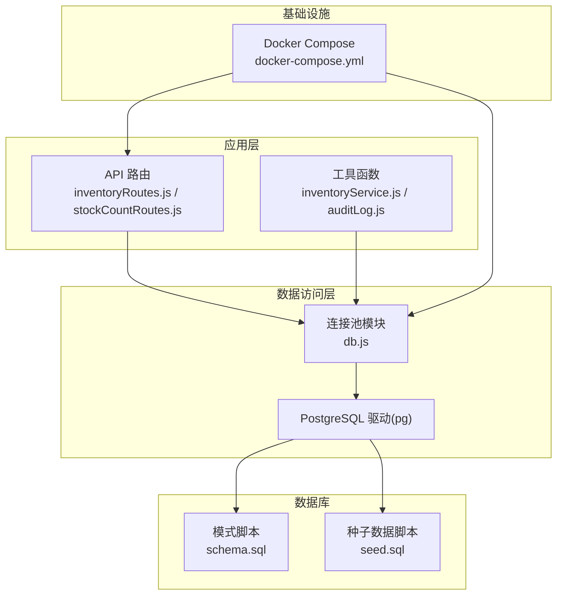
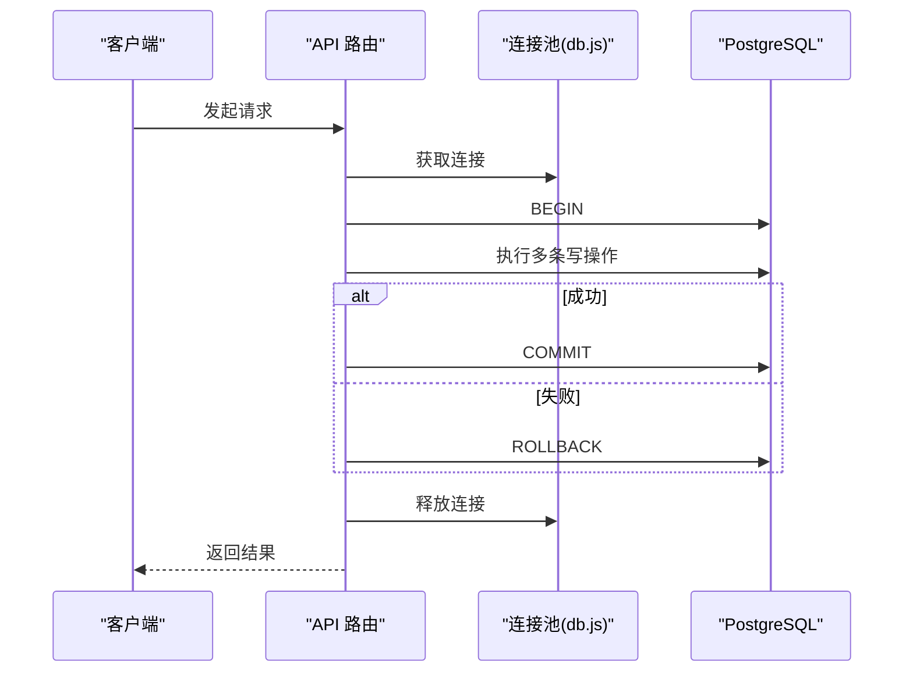
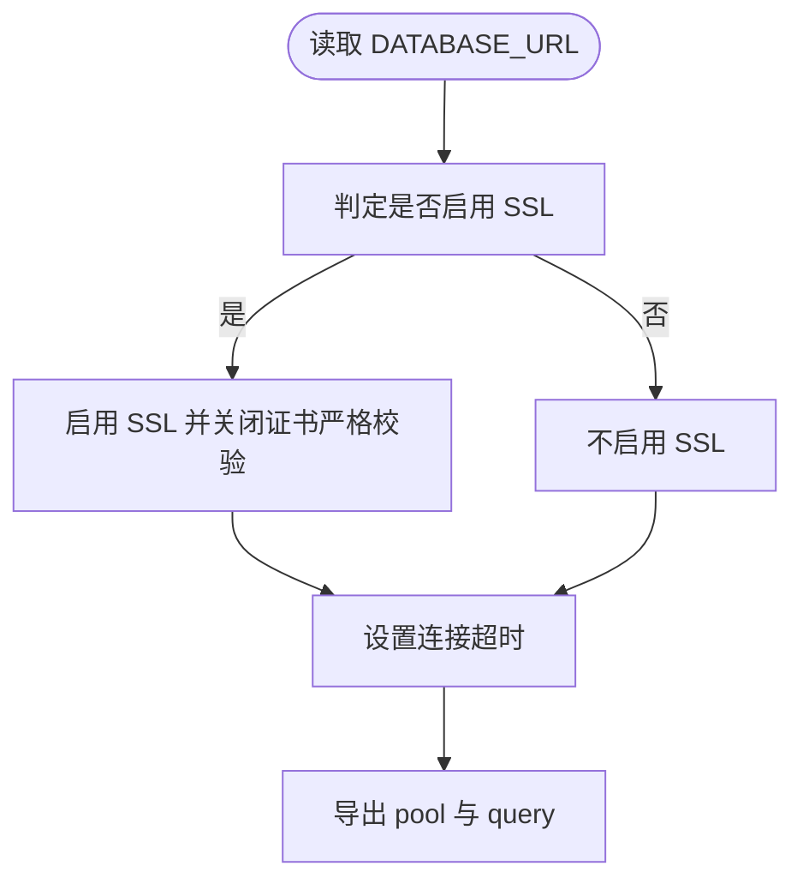
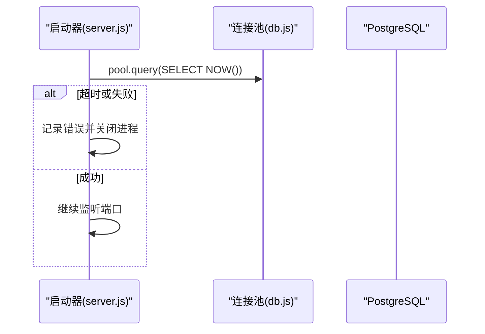
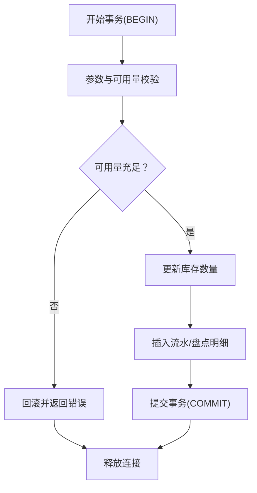
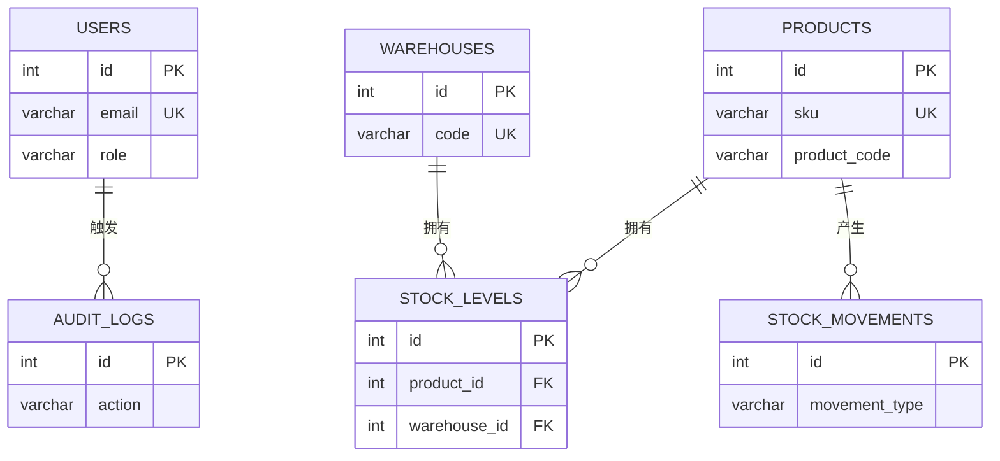
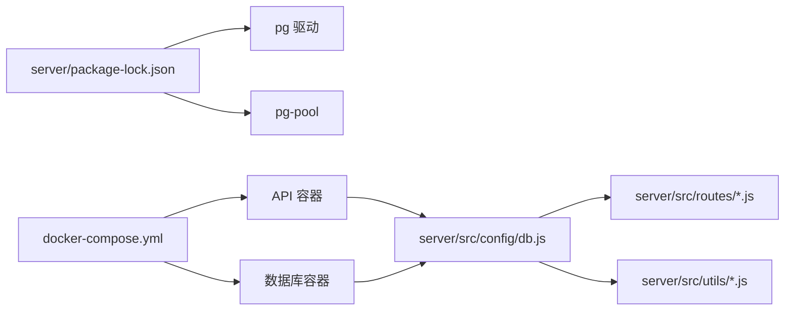

# 数据库连接

<cite>
**本文引用的文件**
- [server/src/config/db.js](file://server/src/config/db.js)
- [server/src/server.js](file://server/src/server.js)
- [server/src/utils/inventoryService.js](file://server/src/utils/inventoryService.js)
- [server/src/utils/auditLog.js](file://server/src/utils/auditLog.js)
- [server/src/routes/inventoryRoutes.js](file://server/src/routes/inventoryRoutes.js)
- [server/src/routes/stockCountRoutes.js](file://server/src/routes/stockCountRoutes.js)
- [server/database/schema.sql](file://server/database/schema.sql)
- [server/database/seed.sql](file://server/database/seed.sql)
- [docker-compose.yml](file://docker-compose.yml)
- [server/package-lock.json](file://server/package-lock.json)
</cite>

## 目录
1. [简介](#简介)
2. [项目结构](#项目结构)
3. [核心组件](#核心组件)
4. [架构总览](#架构总览)
5. [详细组件分析](#详细组件分析)
6. [依赖关系分析](#依赖关系分析)
7. [性能考量](#性能考量)
8. [故障排查指南](#故障排查指南)
9. [结论](#结论)
10. [附录](#附录)

## 简介
本文件聚焦于库存管理系统的数据库连接配置与运行机制，围绕以下主题展开：
- PostgreSQL 连接池配置与连接参数优化
- 连接生命周期管理与健康检查
- 安全配置、SSL 连接与凭据管理
- 事务处理机制、并发控制与死锁预防策略
- 连接健康检查、自动重连与故障转移建议
- 性能监控、慢查询分析与索引优化实践
- 备份恢复、迁移管理与版本控制最佳实践

## 项目结构
后端通过一个统一的连接池模块对外提供查询能力；业务路由在需要时从连接池获取客户端并显式开启事务，完成后释放回池。数据库初始化由 Docker Compose 在首次启动时执行 SQL 脚本完成。

**图表来源**
- [server/src/config/db.js:1-24](file://server/src/config/db.js#L1-L24)
- [server/src/routes/inventoryRoutes.js:237-402](file://server/src/routes/inventoryRoutes.js#L237-L402)
- [server/src/routes/stockCountRoutes.js:94-163](file://server/src/routes/stockCountRoutes.js#L94-L163)
- [server/src/utils/inventoryService.js:1-44](file://server/src/utils/inventoryService.js#L1-L44)
- [server/src/utils/auditLog.js:1-37](file://server/src/utils/auditLog.js#L1-L37)
- [server/database/schema.sql:1-447](file://server/database/schema.sql#L1-L447)
- [server/database/seed.sql:1-114](file://server/database/seed.sql#L1-L114)
- [docker-compose.yml:1-57](file://docker-compose.yml#L1-L57)

**章节来源**
- [server/src/config/db.js:1-24](file://server/src/config/db.js#L1-L24)
- [server/src/server.js:13-25](file://server/src/server.js#L13-L25)
- [docker-compose.yml:1-57](file://docker-compose.yml#L1-L57)

## 核心组件
- 连接池模块：封装 pg.Pool，按需启用 SSL，设置连接超时，导出通用 query 方法与 pool 实例。
- 业务路由：在关键写操作中显式获取连接、开启事务、提交或回滚、最终释放连接。
- 工具函数：库存增删改封装、审计日志写入等复用数据库访问。
- 模式与索引：schema 中定义表结构与大量索引，支撑高频查询与统计报表。
- 健康检查：服务启动前对数据库进行连接测试，失败则优雅退出。

**章节来源**
- [server/src/config/db.js:1-24](file://server/src/config/db.js#L1-L24)
- [server/src/routes/inventoryRoutes.js:237-402](file://server/src/routes/inventoryRoutes.js#L237-L402)
- [server/src/routes/stockCountRoutes.js:94-163](file://server/src/routes/stockCountRoutes.js#L94-L163)
- [server/src/utils/inventoryService.js:1-44](file://server/src/utils/inventoryService.js#L1-L44)
- [server/src/utils/auditLog.js:1-37](file://server/src/utils/auditLog.js#L1-L37)
- [server/database/schema.sql:1-447](file://server/database/schema.sql#L1-L447)
- [server/src/server.js:13-25](file://server/src/server.js#L13-L25)

## 架构总览
系统采用“连接池 + 显式事务”的设计：
- 连接池负责连接复用、超时控制与基本安全开关。
- 路由层在需要强一致性的写操作中使用 BEGIN/COMMIT/ROLLBACK 包裹。
- 启动阶段进行健康检查，确保数据库可用后再对外提供服务。

**图表来源**
- [server/src/routes/inventoryRoutes.js:237-402](file://server/src/routes/inventoryRoutes.js#L237-L402)
- [server/src/routes/stockCountRoutes.js:94-163](file://server/src/routes/stockCountRoutes.js#L94-L163)
- [server/src/config/db.js:15-24](file://server/src/config/db.js#L15-L24)

## 详细组件分析

### 连接池与连接参数
- 连接字符串来源：DATABASE_URL 环境变量。
- SSL 判定规则：当连接串包含特定参数、或环境变量强制要求、或生产环境时启用 SSL；实际启用时关闭证书严格校验以适配常见部署场景。
- 连接超时：connectionTimeoutMillis 可通过环境变量配置，默认值来自代码。
- 导出能力：pool.query 与 pool 实例，供各模块复用。

**图表来源**
- [server/src/config/db.js:3-19](file://server/src/config/db.js#L3-L19)
- [server/src/config/db.js:21-24](file://server/src/config/db.js#L21-L24)

**章节来源**
- [server/src/config/db.js:1-24](file://server/src/config/db.js#L1-L24)

### 连接生命周期与健康检查
- 启动健康检查：服务启动前尝试执行一次数据库查询，超时阈值可配置；失败则记录错误并关闭服务器进程。
- 路由级生命周期：每个写操作流程为“获取连接 → 开启事务 → 执行 → 提交/回滚 → 释放连接”。

**图表来源**
- [server/src/server.js:13-25](file://server/src/server.js#L13-L25)

**章节来源**
- [server/src/server.js:13-25](file://server/src/server.js#L13-L25)
- [server/src/routes/inventoryRoutes.js:237-402](file://server/src/routes/inventoryRoutes.js#L237-L402)
- [server/src/routes/stockCountRoutes.js:94-163](file://server/src/routes/stockCountRoutes.js#L94-L163)

### 事务处理机制与并发控制
- 事务边界：库存出入库与盘点流程均使用显式事务，确保一致性。
- 并发控制：部分流程使用行级锁（如 FOR UPDATE）限制并发修改。
- 死锁预防策略：
  - 固定顺序更新：如库存转移先更新源仓再更新目标仓，避免循环依赖。
  - 最小化事务时间：仅在必要范围内持有事务，尽快提交或回滚。
  - 重试与回滚：捕获异常后执行 ROLLBACK，释放连接，避免悬挂事务。

**图表来源**
- [server/src/routes/inventoryRoutes.js:240-396](file://server/src/routes/inventoryRoutes.js#L240-L396)
- [server/src/routes/stockCountRoutes.js:273-425](file://server/src/routes/stockCountRoutes.js#L273-L425)

**章节来源**
- [server/src/routes/inventoryRoutes.js:237-402](file://server/src/routes/inventoryRoutes.js#L237-L402)
- [server/src/routes/stockCountRoutes.js:94-163](file://server/src/routes/stockCountRoutes.js#L94-L163)
- [server/src/utils/inventoryService.js:1-44](file://server/src/utils/inventoryService.js#L1-L44)

### 安全配置、SSL 与凭据管理
- SSL：根据连接串、环境变量与运行环境动态决定是否启用；启用时关闭证书严格校验以兼容常见部署。
- 凭据：数据库凭据通过 DATABASE_URL 环境变量注入；在 Docker Compose 中集中配置。
- 建议：生产环境建议使用更严格的证书校验与密钥管理方案（例如外部密钥服务），并避免在连接串中明文暴露敏感信息。

**章节来源**
- [server/src/config/db.js:3-19](file://server/src/config/db.js#L3-L19)
- [docker-compose.yml:28-37](file://docker-compose.yml#L28-L37)

### 数据模型与索引
- 主要实体：用户、仓库、产品、库存、出入库流水、盘点、审计日志等。
- 索引覆盖高频查询字段：如产品分类、仓库、库存、订单、同步日志、审计日志等。
- 建议：结合慢查询分析结果持续优化索引，避免冗余索引影响写入性能。

**图表来源**
- [server/database/schema.sql:1-447](file://server/database/schema.sql#L1-L447)

**章节来源**
- [server/database/schema.sql:1-447](file://server/database/schema.sql#L1-L447)
- [server/database/seed.sql:1-114](file://server/database/seed.sql#L1-L114)

## 依赖关系分析
- 运行时依赖：后端使用 pg 驱动与 pg-pool 进行连接池管理。
- 启动依赖：Docker Compose 保证数据库容器健康后再启动 API 容器。
- 连接池依赖：连接池实例由 db.js 导出，被路由与工具模块共同使用。

**图表来源**
- [server/src/config/db.js:1-24](file://server/src/config/db.js#L1-L24)
- [server/package-lock.json:1415-1423](file://server/package-lock.json#L1415-L1423)
- [docker-compose.yml:1-57](file://docker-compose.yml#L1-57)

**章节来源**
- [server/src/config/db.js:1-24](file://server/src/config/db.js#L1-L24)
- [server/package-lock.json:1415-1423](file://server/package-lock.json#L1415-L1423)
- [docker-compose.yml:1-57](file://docker-compose.yml#L1-L57)

## 性能考量
- 连接池参数：当前实现未显式设置最大连接数、空闲超时等参数，建议结合负载评估在生产环境补充。
- 查询优化：利用 schema 中的索引覆盖高频查询；对复杂报表查询进行分页与物化视图优化。
- 慢查询分析：建议接入数据库慢查询日志与性能分析工具，定位热点 SQL 并针对性优化。
- 写入优化：批量写入、减少事务跨度、避免不必要的锁竞争。

[本节为通用指导，无需具体文件引用]

## 故障排查指南
- 启动失败（数据库不可达）：检查 DATABASE_URL、网络连通性与数据库健康状态；查看启动阶段的超时与错误日志。
- 事务异常：确认路由层是否正确包裹 BEGIN/COMMIT/ROLLBACK；检查 FOR UPDATE 使用是否导致锁等待。
- SSL 相关问题：若启用 SSL，注意证书校验策略；生产环境建议启用严格校验并妥善管理证书。
- 连接泄漏：确保每个获取的连接在 finally 中释放，避免长时间占用连接池资源。

**章节来源**
- [server/src/server.js:13-25](file://server/src/server.js#L13-L25)
- [server/src/routes/inventoryRoutes.js:237-402](file://server/src/routes/inventoryRoutes.js#L237-L402)
- [server/src/routes/stockCountRoutes.js:94-163](file://server/src/routes/stockCountRoutes.js#L94-L163)
- [server/src/config/db.js:3-19](file://server/src/config/db.js#L3-L19)

## 结论
该系统通过统一的连接池模块与显式事务机制，实现了对 PostgreSQL 的稳定访问。配合 Docker Compose 的健康检查与索引设计，满足了库存管理场景下的高可用与高性能需求。建议在生产环境中进一步完善连接池参数、SSL 与密钥管理、慢查询分析与索引优化策略，并建立完善的备份与迁移流程。

[本节为总结性内容，无需具体文件引用]

## 附录

### 环境变量与默认值
- DATABASE_URL：数据库连接字符串（必填）
- PG_CONNECT_TIMEOUT_MS：连接超时（毫秒，默认值来自代码）
- PGSSLMODE：SSL 模式（如 require）
- STARTUP_DB_TIMEOUT_MS：启动阶段数据库健康检查超时（毫秒）

**章节来源**
- [server/src/config/db.js:13-19](file://server/src/config/db.js#L13-L19)
- [server/src/server.js:19-20](file://server/src/server.js#L19-L20)

### 数据库初始化与健康检查
- 初始化：Docker Compose 在首次启动时执行 schema.sql 与 seed.sql。
- 健康检查：数据库容器自带健康检查命令；API 启动前执行一次数据库查询验证。

**章节来源**
- [docker-compose.yml:14-15](file://docker-compose.yml#L14-L15)
- [docker-compose.yml:16-20](file://docker-compose.yml#L16-L20)
- [server/src/server.js:13-25](file://server/src/server.js#L13-L25)