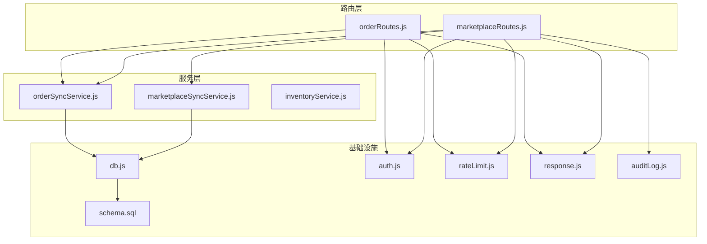
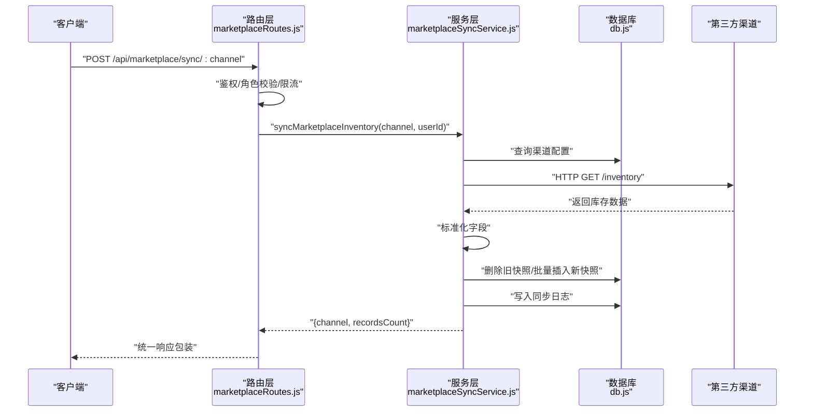
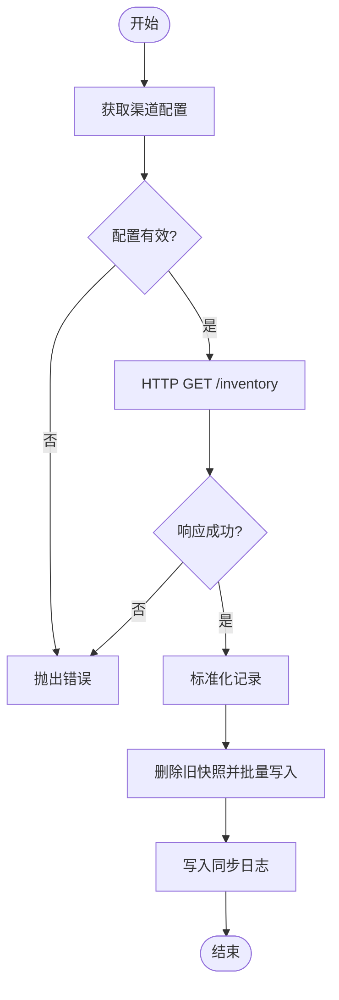
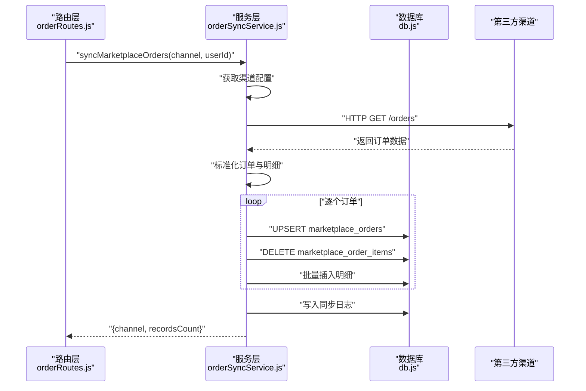
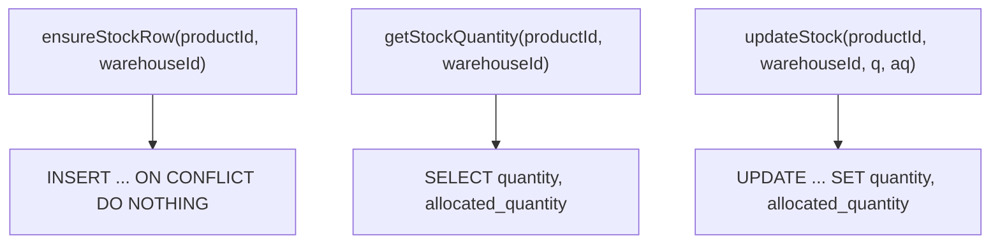
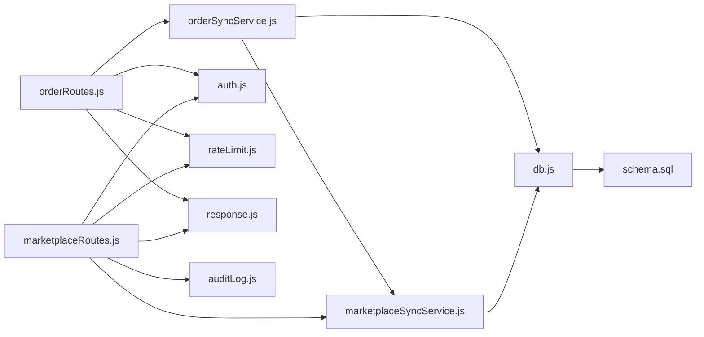

# 服务层

<cite>
**本文引用的文件**
- [marketplaceSyncService.js](file://server/src/services/marketplaceSyncService.js)
- [orderSyncService.js](file://server/src/services/orderSyncService.js)
- [inventoryService.js](file://server/src/utils/inventoryService.js)
- [marketplaceRoutes.js](file://server/src/routes/marketplaceRoutes.js)
- [orderRoutes.js](file://server/src/routes/orderRoutes.js)
- [schema.sql](file://server/database/schema.sql)
- [db.js](file://server/src/config/db.js)
- [auth.js](file://server/src/middleware/auth.js)
- [rateLimit.js](file://server/src/middleware/rateLimit.js)
- [response.js](file://server/src/middleware/response.js)
- [auditLog.js](file://server/src/utils/auditLog.js)
- [app.js](file://server/src/app.js)
- [package.json](file://server/package.json)
- [integration.test.js](file://server/test/integration.test.js)
- [middleware.test.js](file://server/test/middleware.test.js)
</cite>

## 目录
1. [简介](#简介)
2. [项目结构](#项目结构)
3. [核心组件](#核心组件)
4. [架构总览](#架构总览)
5. [组件详解](#组件详解)
6. [依赖关系分析](#依赖关系分析)
7. [性能与优化](#性能与优化)
8. [故障排查指南](#故障排查指南)
9. [结论](#结论)
10. [附录](#附录)

## 简介
本文件聚焦库存管理系统的“服务层”，系统性阐述服务层如何封装业务逻辑、处理数据、对接第三方电商渠道（Shopee/Lazada/TikTok），以及实现库存同步、订单同步、实时数据更新与状态流转。同时覆盖错误处理、重试与幂等性保障、单元与集成测试策略，以及性能优化、缓存与异步处理最佳实践。

## 项目结构
服务层位于后端服务目录，主要由以下模块组成：
- 服务模块：电商库存同步服务、电商订单同步服务、库存通用工具
- 路由模块：市场渠道路由、订单路由，负责鉴权、限流、审计与错误记录
- 数据库：PostgreSQL 连接池与完整表结构定义
- 中间件：认证、响应包装、速率限制、审计日志
- 测试：集成测试与中间件行为验证

图表来源
- [marketplaceSyncService.js:1-146](file://server/src/services/marketplaceSyncService.js#L1-L146)
- [orderSyncService.js:1-119](file://server/src/services/orderSyncService.js#L1-L119)
- [inventoryService.js:1-45](file://server/src/utils/inventoryService.js#L1-L45)
- [marketplaceRoutes.js:1-641](file://server/src/routes/marketplaceRoutes.js#L1-L641)
- [orderRoutes.js:1-113](file://server/src/routes/orderRoutes.js#L1-L113)
- [db.js:1-25](file://server/src/config/db.js#L1-L25)
- [auth.js:1-46](file://server/src/middleware/auth.js#L1-L46)
- [rateLimit.js:1-40](file://server/src/middleware/rateLimit.js#L1-L40)
- [response.js:1-62](file://server/src/middleware/response.js#L1-L62)
- [auditLog.js:1-38](file://server/src/utils/auditLog.js#L1-L38)
- [schema.sql:1-447](file://server/database/schema.sql#L1-L447)

章节来源
- [app.js:1-67](file://server/src/app.js#L1-L67)
- [package.json:1-31](file://server/package.json#L1-L31)

## 核心组件
- 电商库存同步服务：从第三方渠道拉取库存快照，标准化字段，落库并记录同步日志
- 电商订单同步服务：从第三方渠道拉取订单，标准化订单与订单明细，按渠道+外部订单号去重更新
- 库存通用工具：统一封装库存行确保、查询与更新，避免多处重复事务逻辑
- 路由与中间件：鉴权、角色授权、速率限制、统一响应包装、审计日志与错误记录
- 数据库：PostgreSQL 表结构与索引，支撑库存、订单、同步日志、错误日志、审计日志等

章节来源
- [marketplaceSyncService.js:100-140](file://server/src/services/marketplaceSyncService.js#L100-L140)
- [orderSyncService.js:19-114](file://server/src/services/orderSyncService.js#L19-L114)
- [inventoryService.js:2-38](file://server/src/utils/inventoryService.js#L2-L38)
- [marketplaceRoutes.js:144-202](file://server/src/routes/marketplaceRoutes.js#L144-L202)
- [orderRoutes.js:13-29](file://server/src/routes/orderRoutes.js#L13-L29)
- [schema.sql:137-235](file://server/database/schema.sql#L137-L235)

## 架构总览
服务层通过路由层接收请求，进行鉴权与限流后调用对应服务；服务层通过数据库连接池执行 SQL，完成第三方数据的标准化与持久化，并记录审计与错误日志。

图表来源
- [marketplaceRoutes.js:144-202](file://server/src/routes/marketplaceRoutes.js#L144-L202)
- [marketplaceSyncService.js:100-140](file://server/src/services/marketplaceSyncService.js#L100-L140)
- [db.js:13-24](file://server/src/config/db.js#L13-L24)

## 组件详解

### 电商库存同步服务
职责与流程
- 获取渠道配置：优先从数据库 marketplace_connections 查询有效配置，否则回退到环境变量
- 拉取库存：向渠道 inventory 接口发起请求，失败抛错
- 标准化：统一 onHand/allocated/available/externalSku/warehouseCode 等字段
- 快照落库：清空旧快照并批量写入新快照，关联产品与仓库
- 日志记录：写入 marketplace_sync_logs

幂等性与一致性
- 渠道维度全量替换快照，天然具备幂等性（多次执行结果一致）
- 使用 JSONB 字段存储原始响应，便于审计与重放

图表来源
- [marketplaceSyncService.js:18-37](file://server/src/services/marketplaceSyncService.js#L18-L37)
- [marketplaceSyncService.js:111-127](file://server/src/services/marketplaceSyncService.js#L111-L127)
- [marketplaceSyncService.js:60-98](file://server/src/services/marketplaceSyncService.js#L60-L98)
- [marketplaceSyncService.js:130-135](file://server/src/services/marketplaceSyncService.js#L130-L135)

章节来源
- [marketplaceSyncService.js:100-140](file://server/src/services/marketplaceSyncService.js#L100-L140)

### 电商订单同步服务
职责与流程
- 复用渠道配置：复用 marketplaceSyncService 的配置获取能力
- 拉取订单：向渠道 orders 接口发起请求
- 标准化：统一外部订单号、状态、买家名、金额、币种、下单时间、明细等
- 写入订单与明细：按渠道+外部订单号去重更新；删除旧明细后批量写入新明细
- 日志记录：写入 marketplace_sync_logs

幂等性与一致性
- 使用 ON CONFLICT (channel, external_order_id) DO UPDATE，保证重复同步幂等
- 明细侧先删后插，确保与上游最新状态一致

图表来源
- [orderRoutes.js:13-29](file://server/src/routes/orderRoutes.js#L13-L29)
- [orderSyncService.js:19-114](file://server/src/services/orderSyncService.js#L19-L114)
- [db.js:13-24](file://server/src/config/db.js#L13-L24)

章节来源
- [orderSyncService.js:19-114](file://server/src/services/orderSyncService.js#L19-L114)

### 库存通用工具
职责与流程
- 确保存在库存行：按 product_id + warehouse_id 确保存在初始库存记录
- 查询库存：返回在库与已分配数量
- 更新库存：原子更新在库与已分配数量并刷新更新时间

复杂度与性能
- 单次查询/更新均为 O(1)，索引覆盖 product_id 与 warehouse_id
- 通过复用连接与事务，减少往返开销

图表来源
- [inventoryService.js:2-38](file://server/src/utils/inventoryService.js#L2-L38)
- [schema.sql:125-133](file://server/database/schema.sql#L125-L133)

章节来源
- [inventoryService.js:2-38](file://server/src/utils/inventoryService.js#L2-L38)

### 路由与中间件协同
- 鉴权与授权：JWT 校验与角色白名单
- 速率限制：基于客户端 IP 与命名空间的滑动窗口计数
- 统一响应：success/fail 包装，自动注入 requestId
- 审计日志：记录操作主体、路径、方法、描述与元数据
- 错误日志：记录渠道、操作、错误码、消息与详情

章节来源
- [auth.js:5-29](file://server/src/middleware/auth.js#L5-L29)
- [auth.js:32-40](file://server/src/middleware/auth.js#L32-L40)
- [rateLimit.js:9-35](file://server/src/middleware/rateLimit.js#L9-L35)
- [response.js:36-54](file://server/src/middleware/response.js#L36-L54)
- [auditLog.js:1-33](file://server/src/utils/auditLog.js#L1-L33)
- [marketplaceRoutes.js:20-45](file://server/src/routes/marketplaceRoutes.js#L20-L45)
- [marketplaceRoutes.js:144-202](file://server/src/routes/marketplaceRoutes.js#L144-L202)
- [orderRoutes.js:13-29](file://server/src/routes/orderRoutes.js#L13-L29)

## 依赖关系分析
- 服务层依赖数据库连接池与表结构
- 路由层依赖服务层与中间件
- 订单服务复用库存同步服务的配置获取能力
- 全局中间件提供统一安全与可观测性

图表来源
- [marketplaceRoutes.js:1-12](file://server/src/routes/marketplaceRoutes.js#L1-L12)
- [orderRoutes.js:1-8](file://server/src/routes/orderRoutes.js#L1-L8)
- [marketplaceSyncService.js:1-1](file://server/src/services/marketplaceSyncService.js#L1-L1)
- [orderSyncService.js:1-2](file://server/src/services/orderSyncService.js#L1-L2)
- [db.js:13-24](file://server/src/config/db.js#L13-L24)
- [schema.sql:137-235](file://server/database/schema.sql#L137-L235)

章节来源
- [marketplaceRoutes.js:1-12](file://server/src/routes/marketplaceRoutes.js#L1-L12)
- [orderRoutes.js:1-8](file://server/src/routes/orderRoutes.js#L1-L8)

## 性能与优化
- 数据库层面
  - 已建立关键索引：库存、订单、同步日志、错误日志、审计日志等
  - 批量写入：库存快照与订单明细采用批量插入，降低往返次数
- 服务层层面
  - 标准化阶段统一字段映射，减少后续处理分支
  - 幂等写入：库存快照全量替换、订单按主键 UPSERT，避免重复计算
- 中间件层面
  - 速率限制：针对不同命名空间设置不同上限，避免热点路由被刷爆
  - 统一响应：减少错误处理分支，提升可观测性
- 可选优化建议
  - 缓存：对只读配置与常用查询结果做短期缓存（如渠道配置）
  - 异步：将非关键路径（如审计日志）改为异步队列，降低请求延迟
  - 分页与并发：对大列表查询使用分页与并发拉取，结合数据库连接池上限

章节来源
- [schema.sql:419-447](file://server/database/schema.sql#L419-L447)
- [marketplaceSyncService.js:60-98](file://server/src/services/marketplaceSyncService.js#L60-L98)
- [orderSyncService.js:74-99](file://server/src/services/orderSyncService.js#L74-L99)
- [rateLimit.js:9-35](file://server/src/middleware/rateLimit.js#L9-L35)
- [response.js:36-54](file://server/src/middleware/response.js#L36-L54)

## 故障排查指南
- 认证失败
  - 现象：401 未授权
  - 排查：确认 Authorization 头是否为 Bearer Token，JWT 是否有效
- 权限不足
  - 现象：403 禁止访问
  - 排查：确认用户角色是否满足路由要求
- 速率限制触发
  - 现象：429 请求过多
  - 排查：查看 retry-after 头或响应中的重试秒数
- 同步失败
  - 现象：同步日志状态为 FAILED，错误日志存在
  - 排查：检查渠道配置、令牌、网络连通性；查看 marketplace_error_logs 与 marketplace_sync_logs
- 幂等问题
  - 现象：重复同步导致数据不一致
  - 排查：确认是否使用了全量替换快照与 UPSERT 逻辑

章节来源
- [auth.js:9-28](file://server/src/middleware/auth.js#L9-L28)
- [rateLimit.js:23-29](file://server/src/middleware/rateLimit.js#L23-L29)
- [marketplaceRoutes.js:173-200](file://server/src/routes/marketplaceRoutes.js#L173-L200)
- [marketplaceRoutes.js:614-637](file://server/src/routes/marketplaceRoutes.js#L614-L637)
- [schema.sql:137-194](file://server/database/schema.sql#L137-L194)

## 结论
服务层以“标准化 + 幂等写入 + 统一日志”为核心设计原则，实现了与电商渠道的稳定对接与高效同步。配合路由层的安全与可观测性中间件，整体具备良好的可维护性与扩展性。建议在生产环境中结合缓存与异步队列进一步优化吞吐与延迟表现。

## 附录

### 服务层错误处理与重试机制
- 错误处理
  - 统一通过响应中间件包装错误，携带 requestId 便于追踪
  - 路由层捕获异常并写入 marketplace_sync_logs 与 marketplace_error_logs
- 重试机制
  - 当前实现未内置自动重试；可在上游网关或调度系统中实现指数退避重试
- 幂等性
  - 库存快照：全量替换，天然幂等
  - 订单：按主键 UPSERT，幂等

章节来源
- [response.js:9-34](file://server/src/middleware/response.js#L9-L34)
- [marketplaceRoutes.js:173-200](file://server/src/routes/marketplaceRoutes.js#L173-L200)
- [marketplaceRoutes.js:614-637](file://server/src/routes/marketplaceRoutes.js#L614-L637)
- [orderSyncService.js:49-70](file://server/src/services/orderSyncService.js#L49-L70)

### 单元与集成测试策略
- 单元测试
  - 对服务函数进行纯函数式测试，使用内存数据库或模拟数据库连接
  - 验证标准化逻辑、错误边界与返回值结构
- 集成测试
  - 使用 supertest 发起真实 HTTP 请求，覆盖鉴权、限流、响应包装与审计日志
  - 示例：集成测试中创建用户、登录、访问受保护路由并断言响应结构
- 模拟对象
  - 使用环境变量或测试配置切换数据库连接
  - 对第三方 HTTP 调用进行 mock 或使用本地回环地址

章节来源
- [integration.test.js:1-162](file://server/test/integration.test.js#L1-L162)
- [middleware.test.js:1-52](file://server/test/middleware.test.js#L1-L52)
- [package.json:6-9](file://server/package.json#L6-L9)