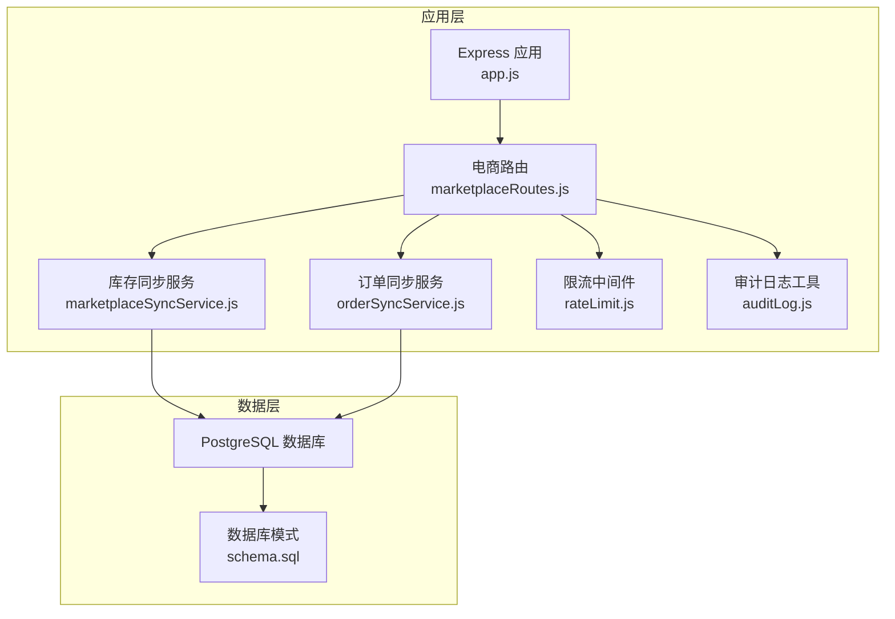
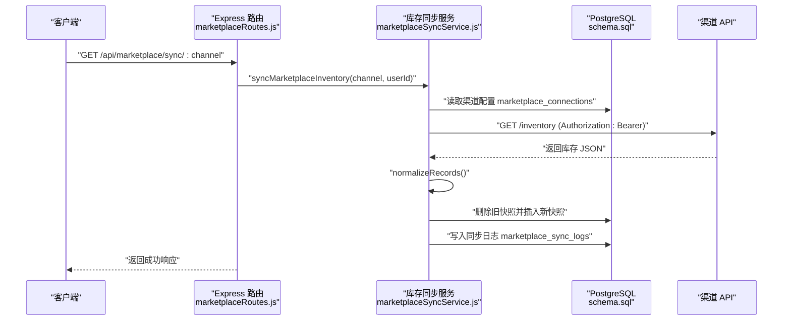
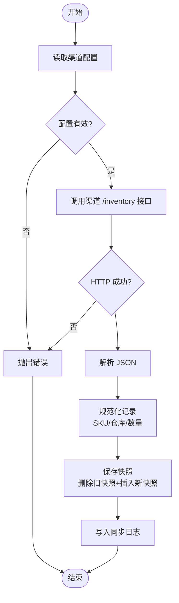
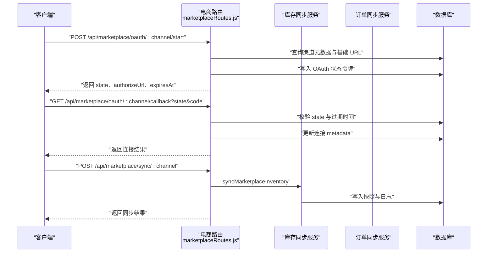
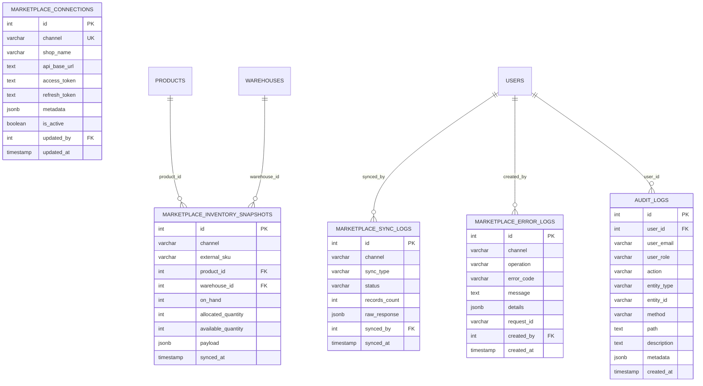
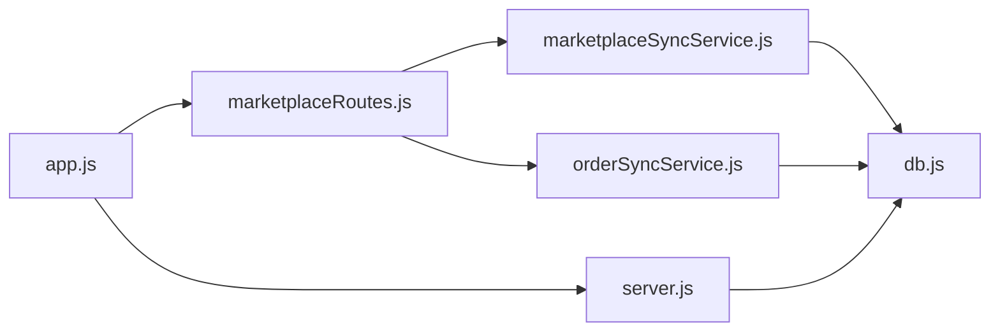

# 电商同步服务

<cite>
**本文档引用的文件**
- [marketplaceSyncService.js](file://server/src/services/marketplaceSyncService.js)
- [marketplaceRoutes.js](file://server/src/routes/marketplaceRoutes.js)
- [db.js](file://server/src/config/db.js)
- [schema.sql](file://server/database/schema.sql)
- [orderSyncService.js](file://server/src/services/orderSyncService.js)
- [rateLimit.js](file://server/src/middleware/rateLimit.js)
- [auditLog.js](file://server/src/utils/auditLog.js)
- [app.js](file://server/src/app.js)
- [server.js](file://server/src/server.js)
- [docker-compose.yml](file://docker-compose.yml)
- [package.json](file://server/package.json)
- [inventory_system_backend.postman_collection.json](file://postman/inventory_system_backend.postman_collection.json)
</cite>

## 目录
1. [简介](#简介)
2. [项目结构](#项目结构)
3. [核心组件](#核心组件)
4. [架构总览](#架构总览)
5. [详细组件分析](#详细组件分析)
6. [依赖关系分析](#依赖关系分析)
7. [性能考虑](#性能考虑)
8. [故障排除指南](#故障排除指南)
9. [结论](#结论)
10. [附录](#附录)

## 简介
本项目是一个电商库存与订单同步服务，支持对接 Shopee、Lazada、TikTok 三大渠道。核心能力包括：
- 渠道配置管理：支持通过数据库动态配置各渠道的 API 基础地址与访问令牌，并提供 OAuth 流程支持。
- 同步流程：从渠道 API 拉取库存与订单数据，进行数据规范化与映射，保存到本地快照表与日志表。
- 数据持久化：库存快照采用 JSONB 存储原始报文，便于回溯与二次处理；同时建立产品与仓库的外键关联。
- 日志与审计：统一记录同步日志、错误日志与审计轨迹，便于问题定位与合规追踪。
- 安全与限流：基于 IP 的速率限制，以及安全头、CORS、日志等基础安全措施。

## 项目结构
后端采用 Express + PostgreSQL 架构，核心目录与职责如下：
- server/src/config/db.js：数据库连接池配置，自动判断 SSL 使用策略。
- server/src/services/marketplaceSyncService.js：电商库存同步核心服务，负责配置读取、数据规范化、快照保存与日志记录。
- server/src/services/orderSyncService.js：电商订单同步服务，与库存同步类似的数据规范化与入库流程。
- server/src/routes/marketplaceRoutes.js：电商相关路由，包括连接配置、同步触发、OAuth、健康检查、日志查询等。
- server/database/schema.sql：数据库初始化脚本，定义了所有业务表及索引。
- server/src/middleware/rateLimit.js：通用速率限制中间件，按命名空间与客户端 IP 计数。
- server/src/utils/auditLog.js：审计日志工具，统一写入审计表。
- server/src/app.js：应用入口，注册中间件与路由。
- server/src/server.js：启动脚本，带数据库连通性校验。
- docker-compose.yml：本地开发与部署编排，包含数据库、API 与 Web 前端容器。
- postman/inventory_system_backend.postman_collection.json：后端 API Postman 集合，包含登录、市场同步等接口示例。

**图表来源**
- [app.js:1-67](file://server/src/app.js#L1-L67)
- [marketplaceRoutes.js:1-641](file://server/src/routes/marketplaceRoutes.js#L1-L641)
- [marketplaceSyncService.js:1-146](file://server/src/services/marketplaceSyncService.js#L1-L146)
- [orderSyncService.js:1-119](file://server/src/services/orderSyncService.js#L1-L119)
- [rateLimit.js:1-40](file://server/src/middleware/rateLimit.js#L1-L40)
- [auditLog.js:1-38](file://server/src/utils/auditLog.js#L1-L38)
- [schema.sql:1-447](file://server/database/schema.sql#L1-L447)

**章节来源**
- [app.js:1-67](file://server/src/app.js#L1-L67)
- [server.js:1-28](file://server/src/server.js#L1-L28)
- [docker-compose.yml:1-57](file://docker-compose.yml#L1-L57)

## 核心组件
- 渠道配置管理
  - 支持从数据库表 marketplace_connections 动态读取渠道配置，若未配置则回退到环境变量。
  - 提供连接测试接口，验证渠道端点与令牌可用性。
- API 端点获取
  - 库存同步端点：/api/marketplace/sync/:channel
  - 订单同步端点：/api/marketplace/orders/sync/:channel
  - OAuth 开始与回调：/api/marketplace/oauth/:channel/start 与 /api/marketplace/oauth/:channel/callback
- 认证令牌处理
  - 通过 Authorization: Bearer 方式传递访问令牌。
  - OAuth 状态令牌使用 UUID 并带过期时间控制。
- 库存数据规范化
  - SKU 映射：优先使用外部 SKU 字段，统一清洗与去空格。
  - 仓库代码解析：根据 warehouse_code 查找本地仓库 ID。
  - 数量字段标准化：onHand、allocated、available 三类数量统一转换为整型。
- 快照保存机制
  - 删除同渠道旧快照，插入新快照，保留原始报文 JSONB。
  - 外键关联：product_id 与 warehouse_id 可为空，便于后续匹配或异步处理。
- 同步日志与错误处理
  - 成功/失败均写入 marketplace_sync_logs。
  - 错误统一写入 marketplace_error_logs，并记录请求 ID 与用户信息。
  - 审计日志覆盖连接变更、同步触发、OAuth 流程等关键动作。
- 并发与限流
  - 为市场同步与 OAuth 分别设置独立命名空间的限流桶。
  - 默认每分钟最多 12 次同步请求，20 次 OAuth 请求。

**章节来源**
- [marketplaceSyncService.js:18-37](file://server/src/services/marketplaceSyncService.js#L18-L37)
- [marketplaceRoutes.js:144-202](file://server/src/routes/marketplaceRoutes.js#L144-L202)
- [marketplaceRoutes.js:204-375](file://server/src/routes/marketplaceRoutes.js#L204-L375)
- [marketplaceRoutes.js:377-435](file://server/src/routes/marketplaceRoutes.js#L377-L435)
- [marketplaceSyncService.js:39-58](file://server/src/services/marketplaceSyncService.js#L39-L58)
- [marketplaceSyncService.js:60-98](file://server/src/services/marketplaceSyncService.js#L60-L98)
- [marketplaceRoutes.js:173-200](file://server/src/routes/marketplaceRoutes.js#L173-L200)
- [marketplaceRoutes.js:20-30](file://server/src/routes/marketplaceRoutes.js#L20-L30)
- [marketplaceRoutes.js:32-45](file://server/src/routes/marketplaceRoutes.js#L32-L45)
- [rateLimit.js:9-35](file://server/src/middleware/rateLimit.js#L9-L35)

## 架构总览
下图展示从客户端到服务端再到渠道 API 的完整调用链路，以及数据库写入路径。

**图表来源**
- [marketplaceRoutes.js:144-202](file://server/src/routes/marketplaceRoutes.js#L144-L202)
- [marketplaceSyncService.js:100-140](file://server/src/services/marketplaceSyncService.js#L100-L140)
- [schema.sql:137-159](file://server/database/schema.sql#L137-L159)

## 详细组件分析

### 组件A：库存同步服务
- 职责
  - 读取渠道配置（数据库优先，环境变量回退）。
  - 调用渠道库存端点，解析并规范化数据。
  - 写入库存快照与同步日志。
- 关键流程
  - 配置读取：优先从 marketplace_connections 表读取，否则使用环境变量。
  - 规范化：统一 SKU、仓库码与数量字段，保留原始报文 JSONB。
  - 快照保存：先清理旧快照，再逐条插入，支持外键可空以兼容未匹配项。
  - 日志记录：无论成功或失败，均写入 marketplace_sync_logs。
- 错误处理
  - 缺少配置或端点/令牌无效时抛出明确错误。
  - HTTP 非 OK 状态同样抛错，交由路由层捕获并记录错误日志与审计。

**图表来源**
- [marketplaceSyncService.js:100-140](file://server/src/services/marketplaceSyncService.js#L100-L140)
- [marketplaceSyncService.js:39-58](file://server/src/services/marketplaceSyncService.js#L39-L58)
- [marketplaceSyncService.js:60-98](file://server/src/services/marketplaceSyncService.js#L60-L98)

**章节来源**
- [marketplaceSyncService.js:18-37](file://server/src/services/marketplaceSyncService.js#L18-L37)
- [marketplaceSyncService.js:39-58](file://server/src/services/marketplaceSyncService.js#L39-L58)
- [marketplaceSyncService.js:60-98](file://server/src/services/marketplaceSyncService.js#L60-L98)
- [marketplaceSyncService.js:100-140](file://server/src/services/marketplaceSyncService.js#L100-L140)

### 组件B：电商路由与控制器
- 连接配置管理
  - GET /api/marketplace/connections：列出所有渠道连接状态。
  - PUT /api/marketplace/connections/:channel：新增或更新渠道连接（支持 metadata JSONB）。
- 同步与健康检查
  - POST /api/marketplace/sync/:channel：触发库存同步，带速率限制。
  - POST /api/marketplace/connections/:channel/test：测试连接可用性。
- OAuth 流程
  - POST /api/marketplace/oauth/:channel/start：生成 state 令牌并持久化，返回授权 URL。
  - GET /api/marketplace/oauth/:channel/callback：校验 state、过期时间与错误参数，更新连接 metadata。
- 日志与状态
  - GET /api/marketplace/sync-logs：最近同步日志。
  - GET /api/marketplace/snapshots：最近库存快照（支持按渠道过滤）。
  - GET /api/marketplace/status/overview：概览连接、同步、订单、发货与近 7 日错误统计。
- 错误与审计
  - 所有异常均写入 marketplace_error_logs，并记录请求 ID 与用户信息。
  - 关键操作写入审计日志 audit_logs。

**图表来源**
- [marketplaceRoutes.js:204-375](file://server/src/routes/marketplaceRoutes.js#L204-L375)
- [marketplaceRoutes.js:144-202](file://server/src/routes/marketplaceRoutes.js#L144-L202)
- [marketplaceRoutes.js:437-554](file://server/src/routes/marketplaceRoutes.js#L437-L554)

**章节来源**
- [marketplaceRoutes.js:47-142](file://server/src/routes/marketplaceRoutes.js#L47-L142)
- [marketplaceRoutes.js:144-202](file://server/src/routes/marketplaceRoutes.js#L144-L202)
- [marketplaceRoutes.js:204-375](file://server/src/routes/marketplaceRoutes.js#L204-L375)
- [marketplaceRoutes.js:377-435](file://server/src/routes/marketplaceRoutes.js#L377-L435)
- [marketplaceRoutes.js:437-554](file://server/src/routes/marketplaceRoutes.js#L437-L554)

### 组件C：数据库模式与索引
- 主要表
  - marketplace_connections：渠道连接配置（含 JSONB 元数据）。
  - marketplace_inventory_snapshots：库存快照（JSONB 保存原始报文，外键可空）。
  - marketplace_sync_logs：同步日志（区分 inventory 与 orders）。
  - marketplace_error_logs：错误日志（JSONB 详情）。
  - audit_logs：审计日志（JSONB 元数据）。
- 索引
  - 对快照、订单、错误、OAuth 状态等高频查询字段建立索引，提升查询性能。

**图表来源**
- [schema.sql:137-194](file://server/database/schema.sql#L137-L194)
- [schema.sql:148-159](file://server/database/schema.sql#L148-L159)

**章节来源**
- [schema.sql:137-194](file://server/database/schema.sql#L137-L194)
- [schema.sql:419-425](file://server/database/schema.sql#L419-L425)

### 组件D：订单同步服务
- 与库存同步类似的数据规范化流程，但针对订单字段进行映射。
- 将订单与订单明细分别入库，明细中尝试根据外部 SKU 匹配本地产品 ID。
- 最终写入同步日志，区分同步类型为 orders。

**章节来源**
- [orderSyncService.js:4-17](file://server/src/services/orderSyncService.js#L4-L17)
- [orderSyncService.js:19-114](file://server/src/services/orderSyncService.js#L19-L114)

## 依赖关系分析
- 应用启动与中间件
  - app.js 注册安全头、CORS、日志、JSON 解析、统一响应与审计中间件。
  - server.js 在启动前进行数据库连通性校验，超时则优雅退出。
- 服务间依赖
  - marketplaceRoutes 依赖 marketplaceSyncService 与 orderSyncService。
  - 两者均依赖 db.js 的 query 封装执行 SQL。
- 外部依赖
  - Express 提供路由与中间件能力。
  - PG 连接池提供数据库访问。
  - dotenv 用于加载环境变量。

**图表来源**
- [app.js:1-67](file://server/src/app.js#L1-L67)
- [server.js:1-28](file://server/src/server.js#L1-L28)
- [marketplaceRoutes.js:1-14](file://server/src/routes/marketplaceRoutes.js#L1-L14)
- [marketplaceSyncService.js:1](file://server/src/services/marketplaceSyncService.js#L1)
- [orderSyncService.js:1](file://server/src/services/orderSyncService.js#L1)
- [db.js:1-25](file://server/src/config/db.js#L1-L25)

**章节来源**
- [app.js:1-67](file://server/src/app.js#L1-L67)
- [server.js:1-28](file://server/src/server.js#L1-L28)
- [package.json:15-25](file://server/package.json#L15-L25)

## 性能考虑
- 数据库连接与 SSL
  - 自动判断是否启用 SSL，生产环境默认启用，减少网络传输风险。
  - 连接超时可配置，避免长时间阻塞启动。
- 查询与索引
  - schema 中对高频查询字段建立索引，如快照 channel、订单状态、错误日志创建时间等。
- 速率限制
  - 同步与 OAuth 分别限流，防止突发流量导致下游压力过大。
- JSONB 存储
  - 原始报文以 JSONB 存储，便于后续分析与重放，但需关注存储膨胀与查询成本。
- 并发策略
  - 当前实现为串行逐条插入快照，若数据量大可考虑批量写入或分批处理以降低事务开销。

**章节来源**
- [db.js:3-11](file://server/src/config/db.js#L3-L11)
- [db.js:15-19](file://server/src/config/db.js#L15-L19)
- [schema.sql:419-425](file://server/database/schema.sql#L419-L425)
- [rateLimit.js:9-35](file://server/src/middleware/rateLimit.js#L9-L35)

## 故障排除指南
- 常见错误与定位
  - 不支持的渠道：检查路由中支持列表与传参大小写。
  - 缺失配置或令牌：确认数据库连接表已配置且令牌有效；或检查环境变量是否正确。
  - 连接测试失败：使用 /api/marketplace/connections/:channel/test 检查端点可达性与鉴权。
  - OAuth 失败：检查 state 是否存在、是否过期、回调是否携带错误参数。
- 日志与审计
  - 查看同步日志：/api/marketplace/sync-logs。
  - 查看错误日志：/api/marketplace/errors。
  - 查看审计日志：/api/audit-logs。
- 数据一致性
  - 快照删除策略：每次同步会先删除该渠道旧快照，确保只保留最新视图。
  - 外键可空：当 SKU 或仓库未匹配时，product_id 与 warehouse_id 可为空，便于后续处理。

**章节来源**
- [marketplaceRoutes.js:151-200](file://server/src/routes/marketplaceRoutes.js#L151-L200)
- [marketplaceRoutes.js:384-434](file://server/src/routes/marketplaceRoutes.js#L384-L434)
- [marketplaceRoutes.js:556-593](file://server/src/routes/marketplaceRoutes.js#L556-L593)
- [marketplaceSyncService.js:60-98](file://server/src/services/marketplaceSyncService.js#L60-L98)

## 结论
本电商同步服务提供了完整的渠道对接能力，涵盖配置管理、数据规范化、快照保存、日志与审计、OAuth 流程与限流保护。通过数据库模式设计与索引优化，能够支撑日常的库存与订单同步需求。建议在高并发场景下引入批量写入与异步处理策略，并持续监控错误日志与审计轨迹以保障系统稳定性。

## 附录

### 环境变量与配置示例
- 数据库连接
  - DATABASE_URL：PostgreSQL 连接字符串。
- JWT 与服务端口
  - JWT_SECRET：JWT 密钥。
  - PORT：服务监听端口。
- 渠道同步端点与令牌
  - SHOPEE_SYNC_ENDPOINT、SHOPEE_ACCESS_TOKEN
  - LAZADA_SYNC_ENDPOINT、LAZADA_ACCESS_TOKEN
  - TIKTOK_SYNC_ENDPOINT、TIKTOK_ACCESS_TOKEN
- 运行方式
  - 本地开发：docker-compose 启动数据库、API 与前端容器。
  - Postman：使用集合中的登录接口获取 Token，然后调用市场同步相关接口。

**章节来源**
- [docker-compose.yml:28-37](file://docker-compose.yml#L28-L37)
- [inventory_system_backend.postman_collection.json:32-65](file://postman/inventory_system_backend.postman_collection.json#L32-L65)