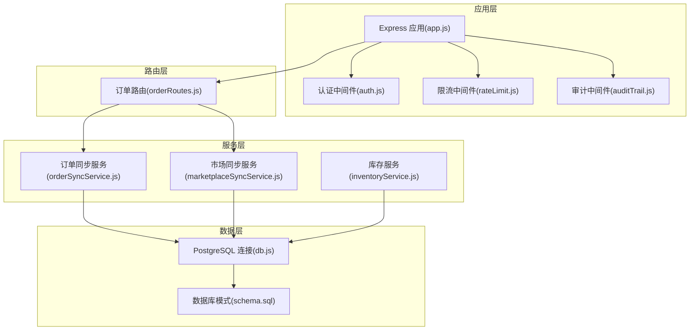
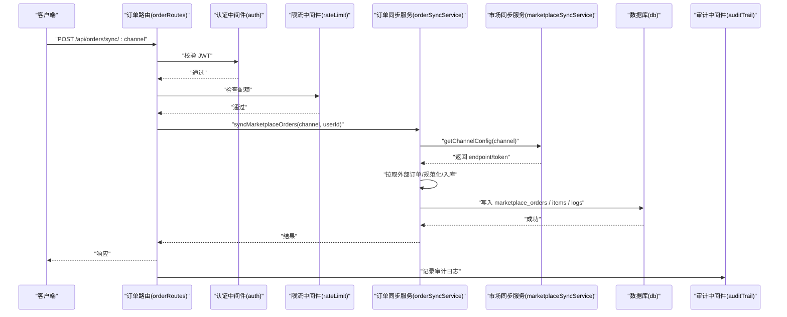
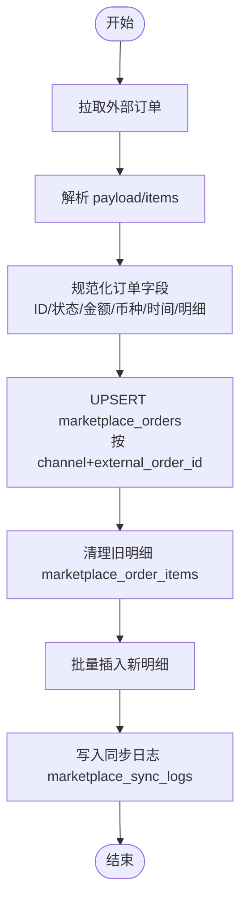
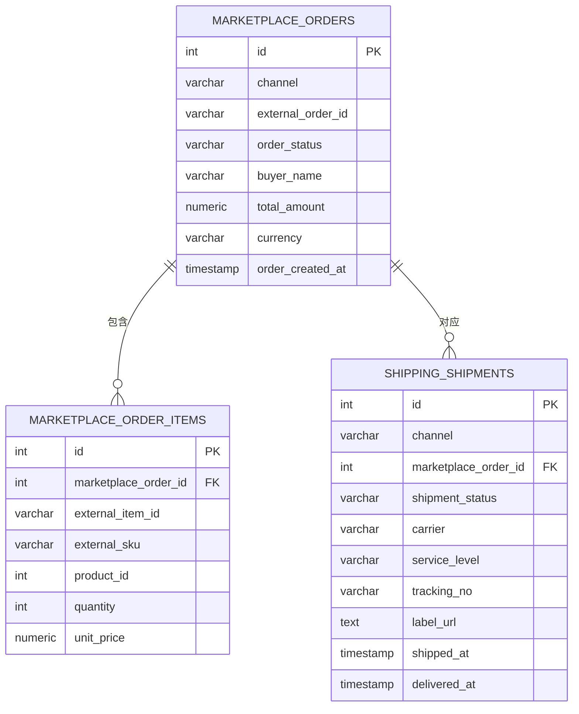
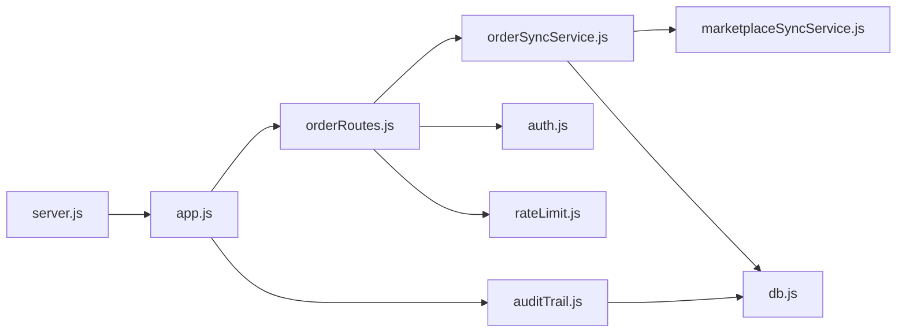

# 订单同步服务

<cite>
**本文档引用的文件**
- [orderSyncService.js](file://server/src/services/orderSyncService.js)
- [marketplaceSyncService.js](file://server/src/services/marketplaceSyncService.js)
- [orderRoutes.js](file://server/src/routes/orderRoutes.js)
- [schema.sql](file://server/database/schema.sql)
- [db.js](file://server/src/config/db.js)
- [auth.js](file://server/src/middleware/auth.js)
- [rateLimit.js](file://server/src/middleware/rateLimit.js)
- [auditTrail.js](file://server/src/middleware/auditTrail.js)
- [auditLog.js](file://server/src/utils/auditLog.js)
- [inventoryService.js](file://server/src/utils/inventoryService.js)
- [app.js](file://server/src/app.js)
- [server.js](file://server/src/server.js)
</cite>

## 目录
1. [简介](#简介)
2. [项目结构](#项目结构)
3. [核心组件](#核心组件)
4. [架构总览](#架构总览)
5. [详细组件分析](#详细组件分析)
6. [依赖关系分析](#依赖关系分析)
7. [性能考虑](#性能考虑)
8. [故障排查指南](#故障排查指南)
9. [结论](#结论)
10. [附录](#附录)

## 简介
本文件面向“订单同步服务”的实现与使用，系统性阐述从外部电商平台拉取订单、规范化数据、入库持久化、以及后续发货与物流跟踪的完整流程。文档重点覆盖以下方面：
- 订单获取与规范化：统一字段、类型转换、空值处理
- 订单状态映射与转换：待支付、已支付、已发货、已完成等状态的来源与更新策略
- 发货流程集成：物流商选择、面单生成、库存扣减
- 数据一致性与幂等：基于唯一键的插入/更新、事务边界与回滚策略
- 错误处理、重试策略与可观测性：错误日志、审计追踪、速率限制与健康检查

## 项目结构
后端采用 Express 框架，路由层负责鉴权与限流，服务层封装业务逻辑，数据库层通过 PostgreSQL 提供数据持久化。订单同步服务位于服务层，路由层提供对外接口。

图表来源
- [app.js:1-67](file://server/src/app.js#L1-L67)
- [orderRoutes.js:1-113](file://server/src/routes/orderRoutes.js#L1-L113)
- [orderSyncService.js:1-119](file://server/src/services/orderSyncService.js#L1-L119)
- [marketplaceSyncService.js:1-146](file://server/src/services/marketplaceSyncService.js#L1-L146)
- [inventoryService.js:1-45](file://server/src/utils/inventoryService.js#L1-L45)
- [db.js:1-25](file://server/src/config/db.js#L1-L25)
- [schema.sql:1-447](file://server/database/schema.sql#L1-L447)

章节来源
- [app.js:1-67](file://server/src/app.js#L1-L67)
- [orderRoutes.js:1-113](file://server/src/routes/orderRoutes.js#L1-L113)
- [orderSyncService.js:1-119](file://server/src/services/orderSyncService.js#L1-L119)
- [marketplaceSyncService.js:1-146](file://server/src/services/marketplaceSyncService.js#L1-L146)
- [inventoryService.js:1-45](file://server/src/utils/inventoryService.js#L1-L45)
- [db.js:1-25](file://server/src/config/db.js#L1-L25)
- [schema.sql:1-447](file://server/database/schema.sql#L1-L447)

## 核心组件
- 订单路由层：提供订单同步触发接口与查询接口，内置鉴权与限流。
- 订单同步服务：负责从外部渠道拉取订单、规范化数据、写入订单表与订单明细表，并记录同步日志。
- 市场同步服务：负责从外部渠道拉取库存快照，支持数据库配置优先与环境变量降级。
- 库存服务：封装库存增减的通用逻辑，确保行存在与一致性更新。
- 审计与限流：对所有写操作进行审计记录；对同步接口进行速率限制。
- 数据库模式：定义订单、订单明细、同步日志、库存快照、发货单等核心表结构。

章节来源
- [orderRoutes.js:13-29](file://server/src/routes/orderRoutes.js#L13-L29)
- [orderSyncService.js:19-114](file://server/src/services/orderSyncService.js#L19-L114)
- [marketplaceSyncService.js:18-37](file://server/src/services/marketplaceSyncService.js#L18-L37)
- [inventoryService.js:2-38](file://server/src/utils/inventoryService.js#L2-L38)
- [auditTrail.js:47-79](file://server/src/middleware/auditTrail.js#L47-L79)
- [rateLimit.js:9-35](file://server/src/middleware/rateLimit.js#L9-L35)
- [schema.sql:196-235](file://server/database/schema.sql#L196-L235)

## 架构总览
下图展示订单同步从触发到落库的关键交互路径，以及与库存、审计、限流等模块的协作关系。

图表来源
- [orderRoutes.js:13-29](file://server/src/routes/orderRoutes.js#L13-L29)
- [orderSyncService.js:19-114](file://server/src/services/orderSyncService.js#L19-L114)
- [marketplaceSyncService.js:18-37](file://server/src/services/marketplaceSyncService.js#L18-L37)
- [auditTrail.js:47-79](file://server/src/middleware/auditTrail.js#L47-L79)

## 详细组件分析

### 订单获取与规范化
- 规范化策略
  - 外部订单 ID：统一提取 orderId 或 externalOrderId，去除空白并转为字符串。
  - 订单状态：默认 PENDING，统一转大写。
  - 买家姓名：优先 buyerName，其次 customerName，空则置空。
  - 金额与币种：金额转数字，币种默认 USD 并转大写。
  - 时间戳：优先 orderCreatedAt 或 createdAt。
  - 明细：保留 items 数组，逐项规范化 SKU、数量、单价等。
- 幂等性保障
  - 使用 channel+external_order_id 唯一键约束，冲突时执行更新（ON CONFLICT）。
  - 每次同步会先删除旧明细再重新插入，确保与外部最新一致。
- 同步日志
  - 成功后写入 marketplace_sync_logs，记录通道、类型、状态、条数与原始响应摘要。

图表来源
- [orderSyncService.js:4-17](file://server/src/services/orderSyncService.js#L4-L17)
- [orderSyncService.js:42-100](file://server/src/services/orderSyncService.js#L42-L100)
- [orderSyncService.js:102-108](file://server/src/services/orderSyncService.js#L102-L108)

章节来源
- [orderSyncService.js:4-17](file://server/src/services/orderSyncService.js#L4-L17)
- [orderSyncService.js:42-100](file://server/src/services/orderSyncService.js#L42-L100)
- [orderSyncService.js:102-108](file://server/src/services/orderSyncService.js#L102-L108)

### 订单状态映射与转换
- 来源状态
  - 外部平台返回的订单状态作为输入，经规范化后写入 order_status 字段。
- 转换规则
  - 默认状态：未显式提供时使用 PENDING。
  - 统一大写：确保后续比较与展示的一致性。
  - 更新策略：每次同步以最新状态为准，通过 UPSERT 实现覆盖更新。
- 状态使用建议
  - 建议在业务层增加状态机，将外部状态映射为内部状态（如待支付、已支付、已发货、已完成），并在发货与物流回调中进行状态推进。

章节来源
- [orderSyncService.js:8-9](file://server/src/services/orderSyncService.js#L8-L9)
- [orderSyncService.js:49-57](file://server/src/services/orderSyncService.js#L49-L57)

### 发货流程集成
- 物流商选择与面单生成
  - 通过 shipping_shipments 表记录物流商、服务等级、运单号、标签链接等。
  - 建议在发货接口中设置 shipment_status=PENDING，调用物流商 API 后更新为 SHIPPED/DONE。
- 库存扣减
  - 建议在发货前或发货时，使用库存服务封装的 ensureStockRow/getStockQuantity/updateStock 执行扣减。
  - 对于组合商品，需拆分明细并逐项扣减。
- 幂等性
  - 面单生成与库存扣减应具备幂等保护（如按外部订单号去重、状态机推进）。

图表来源
- [schema.sql:196-235](file://server/database/schema.sql#L196-L235)

章节来源
- [schema.sql:196-235](file://server/database/schema.sql#L196-L235)
- [inventoryService.js:2-38](file://server/src/utils/inventoryService.js#L2-L38)

### 数据规范化与价格计算
- 客户信息
  - buyerName 优先级：buyerName > customerName > 空。
- 商品详情
  - externalSku 与 product_id 关联，缺失时保留外部 SKU 但产品 ID 留空。
- 价格与税费
  - 单价与数量转为数字，金额为总价；建议在业务层补充税费计算与分摊逻辑。
- 币种
  - 统一为大写，默认 USD；建议在业务层做汇率转换与本地化展示。

章节来源
- [orderSyncService.js:10-14](file://server/src/services/orderSyncService.js#L10-L14)
- [orderSyncService.js:76-96](file://server/src/services/orderSyncService.js#L76-L96)

### 路由与鉴权、限流
- 接口
  - POST /api/orders/sync/:channel：触发指定渠道订单同步。
  - GET /api/orders：分页查询订单，支持按渠道、状态、关键词过滤。
  - GET /api/orders/:id：查询订单详情及明细。
- 鉴权
  - 需要有效 JWT，且用户处于激活状态。
- 限流
  - orders-sync 命名空间，窗口 60 秒，最大 12 次/窗口。

章节来源
- [orderRoutes.js:13-29](file://server/src/routes/orderRoutes.js#L13-L29)
- [orderRoutes.js:31-81](file://server/src/routes/orderRoutes.js#L31-L81)
- [orderRoutes.js:83-110](file://server/src/routes/orderRoutes.js#L83-L110)
- [auth.js:5-29](file://server/src/middleware/auth.js#L5-L29)
- [rateLimit.js:9-35](file://server/src/middleware/rateLimit.js#L9-L35)

### 错误处理、重试策略与幂等性
- 错误处理
  - 订单同步：外部接口失败抛出错误；路由捕获并返回 400。
  - 通用错误：全局中间件统一兜底 500。
  - 审计日志：异常时仍尝试写入审计，失败不阻断主流程。
- 重试策略
  - 建议：对外部渠道接口增加指数退避重试；对数据库写入失败可重试一次。
- 幂等性
  - 订单：channel+external_order_id 唯一键，UPSERT 更新。
  - 明细：每次同步前清空旧明细，重新插入。
  - 发货：按外部订单号去重，状态机推进。

章节来源
- [orderRoutes.js:26-28](file://server/src/routes/orderRoutes.js#L26-L28)
- [orderSyncService.js:35-37](file://server/src/services/orderSyncService.js#L35-L37)
- [app.js:57-64](file://server/src/app.js#L57-L64)
- [auditTrail.js:73-75](file://server/src/middleware/auditTrail.js#L73-L75)

### 日志、监控与可观测性
- 同步日志
  - marketplace_sync_logs 记录通道、类型、状态、条数与原始响应摘要。
- 审计日志
  - auditTrail 自动记录写操作的上下文与请求体（敏感字段脱敏）。
- 健康检查
  - /api/health 返回服务状态；启动时进行数据库连接超时检测。

章节来源
- [orderSyncService.js:102-108](file://server/src/services/orderSyncService.js#L102-L108)
- [auditTrail.js:47-79](file://server/src/middleware/auditTrail.js#L47-L79)
- [app.js:36-38](file://server/src/app.js#L36-L38)
- [server.js:13-24](file://server/src/server.js#L13-L24)

## 依赖关系分析
- 组件耦合
  - 订单路由依赖认证与限流中间件；依赖订单同步服务。
  - 订单同步服务依赖市场同步服务获取渠道配置，依赖数据库执行写入。
  - 审计中间件独立运行，对所有写操作进行审计。
- 外部依赖
  - PostgreSQL 连接池；外部电商渠道 API（通过配置注入）。
- 可能的循环依赖
  - 当前模块间为单向依赖，无循环风险。

图表来源
- [orderRoutes.js:1-113](file://server/src/routes/orderRoutes.js#L1-L113)
- [orderSyncService.js:1-119](file://server/src/services/orderSyncService.js#L1-L119)
- [marketplaceSyncService.js:1-146](file://server/src/services/marketplaceSyncService.js#L1-L146)
- [db.js:1-25](file://server/src/config/db.js#L1-L25)
- [auditTrail.js:1-84](file://server/src/middleware/auditTrail.js#L1-L84)
- [app.js:1-67](file://server/src/app.js#L1-L67)
- [server.js:1-28](file://server/src/server.js#L1-L28)

章节来源
- [orderRoutes.js:1-113](file://server/src/routes/orderRoutes.js#L1-L113)
- [orderSyncService.js:1-119](file://server/src/services/orderSyncService.js#L1-L119)
- [marketplaceSyncService.js:1-146](file://server/src/services/marketplaceSyncService.js#L1-L146)
- [db.js:1-25](file://server/src/config/db.js#L1-L25)
- [auditTrail.js:1-84](file://server/src/middleware/auditTrail.js#L1-L84)
- [app.js:1-67](file://server/src/app.js#L1-L67)
- [server.js:1-28](file://server/src/server.js#L1-L28)

## 性能考虑
- 数据库索引
  - marketplace_orders 上已建立 channel、order_status 等索引，有利于查询与统计。
- 查询优化
  - 分页查询使用 LIMIT/OFFSET，建议结合 created_at/updated_at 排序字段优化。
- 写入优化
  - 批量插入明细时尽量减少往返；UPSERT 使用 RETURNING 获取自增主键。
- 连接池与超时
  - 数据库连接池已配置超时参数；启动阶段进行健康检查，避免冷启动失败。
- 缓存与异步
  - 可引入 Redis 缓存热点订单与 SKU 映射，降低数据库压力。
  - 将库存扣减与物流面单生成放入消息队列异步处理，提升吞吐。

章节来源
- [schema.sql:419-427](file://server/database/schema.sql#L419-L427)
- [orderRoutes.js:37-72](file://server/src/routes/orderRoutes.js#L37-L72)
- [db.js:15-19](file://server/src/config/db.js#L15-L19)
- [server.js:18-24](file://server/src/server.js#L18-L24)

## 故障排查指南
- 常见问题
  - 400 错误：渠道配置缺失或无效，检查 marketplace_connections 与环境变量。
  - 401/403：JWT 缺失、过期或权限不足，确认令牌与用户状态。
  - 429：请求过于频繁，调整调用频率或提高配额。
  - 500 错误：数据库连接失败或内部异常，查看启动日志与数据库连通性。
- 定位手段
  - 查看 marketplace_sync_logs 的最近记录，确认同步是否成功。
  - 审计日志 audit_logs 记录写操作上下文，辅助定位问题。
  - 启动日志 server.js 中的数据库连接超时提示。
- 修复建议
  - 对外接口失败时增加重试与熔断；对数据库写入失败进行幂等重试。
  - 在发货流程中加入库存校验与事务包裹，防止超卖。

章节来源
- [orderRoutes.js:16-18](file://server/src/routes/orderRoutes.js#L16-L18)
- [orderRoutes.js:26-28](file://server/src/routes/orderRoutes.js#L26-L28)
- [orderSyncService.js:22-24](file://server/src/services/orderSyncService.js#L22-L24)
- [auditTrail.js:47-79](file://server/src/middleware/auditTrail.js#L47-L79)
- [server.js:18-24](file://server/src/server.js#L18-L24)

## 结论
订单同步服务通过“规范化 + 幂等写入 + 审计 + 限流”的设计，在保证数据一致性的同时提供了良好的扩展性与可观测性。建议在现有基础上完善发货状态机、物流面单生成与库存扣减的事务化处理，并引入缓存与异步队列以进一步提升性能与可靠性。

## 附录
- 数据库模式要点
  - 订单与明细：marketplace_orders、marketplace_order_items
  - 同步日志：marketplace_sync_logs
  - 发货单：shipping_shipments
  - 库存与快照：stock_levels、marketplace_inventory_snapshots
- 关键字段说明
  - external_order_id：外部平台订单号，用于幂等匹配
  - order_status：订单状态，建议在业务层映射为内部状态
  - payload：原始响应 JSON，便于审计与重放
  - synced_at：同步时间，用于排序与统计

章节来源
- [schema.sql:137-235](file://server/database/schema.sql#L137-L235)