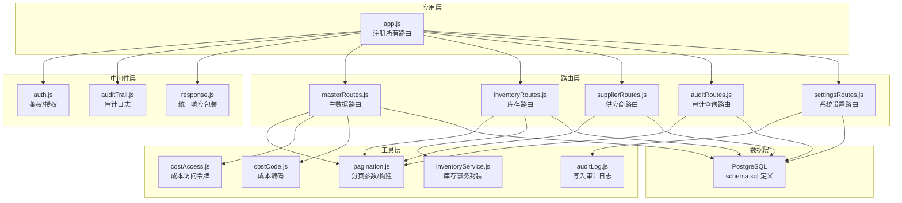
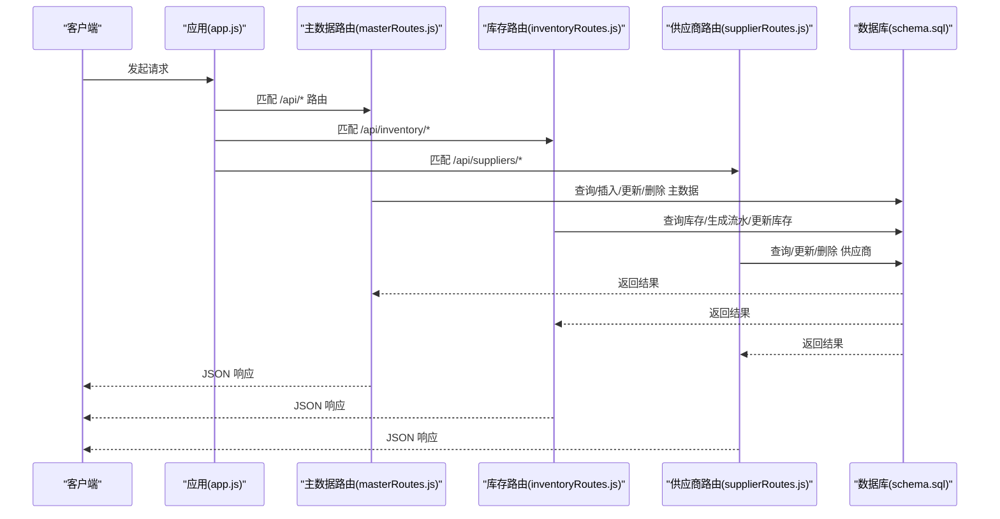
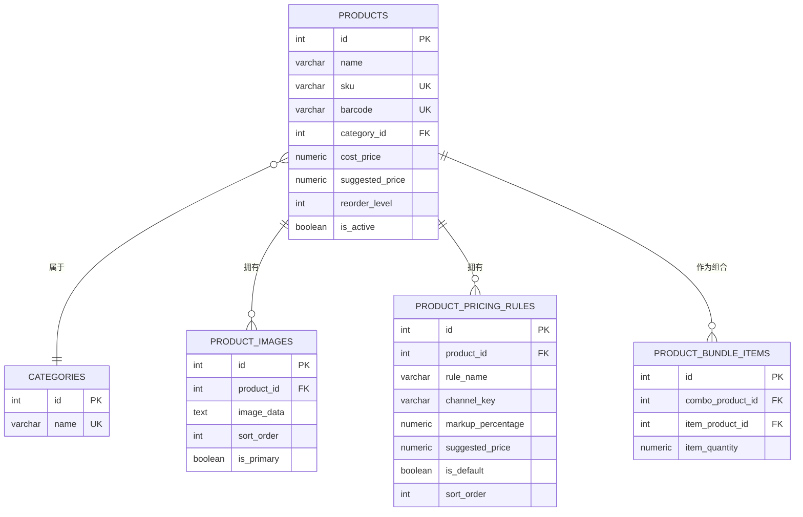
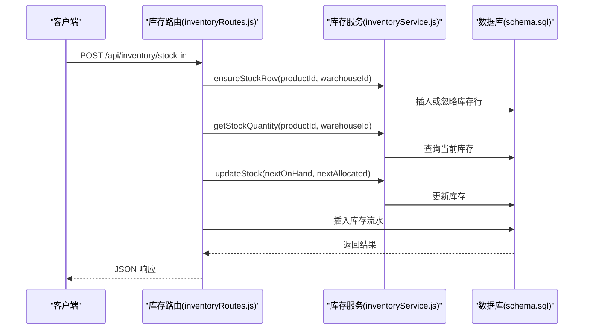
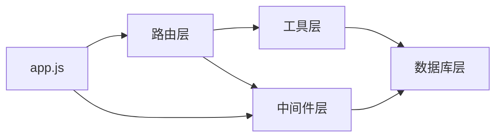

# 主数据路由

<cite>
**本文引用的文件**
- [masterRoutes.js](file://server/src/routes/masterRoutes.js)
- [inventoryRoutes.js](file://server/src/routes/inventoryRoutes.js)
- [supplierRoutes.js](file://server/src/routes/supplierRoutes.js)
- [auth.js](file://server/src/middleware/auth.js)
- [auditTrail.js](file://server/src/middleware/auditTrail.js)
- [pagination.js](file://server/src/utils/pagination.js)
- [costAccess.js](file://server/src/utils/costAccess.js)
- [costCode.js](file://server/src/utils/costCode.js)
- [auditLog.js](file://server/src/utils/auditLog.js)
- [schema.sql](file://server/database/schema.sql)
- [settingsRoutes.js](file://server/src/routes/settingsRoutes.js)
- [auditRoutes.js](file://server/src/routes/auditRoutes.js)
- [inventoryService.js](file://server/src/utils/inventoryService.js)
- [app.js](file://server/src/app.js)
- [package.json](file://server/package.json)
</cite>

## 目录
1. [简介](#简介)
2. [项目结构](#项目结构)
3. [核心组件](#核心组件)
4. [架构总览](#架构总览)
5. [详细组件分析](#详细组件分析)
6. [依赖分析](#依赖分析)
7. [性能考虑](#性能考虑)
8. [故障排查指南](#故障排查指南)
9. [结论](#结论)
10. [附录](#附录)

## 简介
本文件聚焦“主数据管理路由模块”，系统化梳理产品、分类、品牌（供应商）、规格（定价规则与组合）等主数据的 CRUD 路由，解释数据验证规则、唯一性约束与关联关系处理；阐述批量导入导出能力的设计思路与 API 接口设计；说明数据字典、枚举值与配置项的管理路由；提供搜索过滤、排序分页与数据权限控制的实现细节，并覆盖数据迁移、版本管理与审计追踪功能。

## 项目结构
主数据相关路由集中在后端 server/src/routes 下，配合中间件与工具函数完成鉴权、审计、分页与成本访问控制等功能。数据库结构在 server/database/schema.sql 中定义，包含主数据表及关联表。

图表来源
- [app.js:1-67](file://server/src/app.js#L1-L67)
- [auth.js:1-46](file://server/src/middleware/auth.js#L1-L46)
- [auditTrail.js:1-84](file://server/src/middleware/auditTrail.js#L1-L84)
- [pagination.js:1-28](file://server/src/utils/pagination.js#L1-L28)
- [costAccess.js:1-32](file://server/src/utils/costAccess.js#L1-L32)
- [costCode.js:1-63](file://server/src/utils/costCode.js#L1-L63)
- [inventoryService.js:1-45](file://server/src/utils/inventoryService.js#L1-L45)
- [auditLog.js:1-38](file://server/src/utils/auditLog.js#L1-L38)
- [schema.sql:1-447](file://server/database/schema.sql#L1-L447)

章节来源
- [app.js:1-67](file://server/src/app.js#L1-L67)
- [schema.sql:1-447](file://server/database/schema.sql#L1-L447)

## 核心组件
- 鉴权与授权中间件：基于 JWT 的用户认证与角色授权，确保敏感操作仅限 ADMIN/MANAGER/STAFF。
- 审计中间件：自动记录请求动作、实体类型、路径与元数据，支持统一审计查询。
- 分页工具：统一分页参数解析与分页结构构建，避免重复逻辑。
- 成本访问控制：通过专用令牌与编码机制，限制成本字段可见范围。
- 库存事务封装：统一封装库存行存在性保证、查询与更新，保障事务一致性。
- 数据库模式：定义主数据表、关联表、索引与约束，支撑主数据与库存流程。

章节来源
- [auth.js:1-46](file://server/src/middleware/auth.js#L1-L46)
- [auditTrail.js:1-84](file://server/src/middleware/auditTrail.js#L1-L84)
- [pagination.js:1-28](file://server/src/utils/pagination.js#L1-L28)
- [costAccess.js:1-32](file://server/src/utils/costAccess.js#L1-L32)
- [costCode.js:1-63](file://server/src/utils/costCode.js#L1-L63)
- [inventoryService.js:1-45](file://server/src/utils/inventoryService.js#L1-L45)
- [schema.sql:1-447](file://server/database/schema.sql#L1-L447)

## 架构总览
主数据路由模块围绕“产品、分类、供应商、定价规则、组合商品”等核心实体展开，结合库存与审计能力，形成完整的主数据生命周期管理闭环。

图表来源
- [app.js:40-55](file://server/src/app.js#L40-L55)
- [masterRoutes.js:492-773](file://server/src/routes/masterRoutes.js#L492-L773)
- [inventoryRoutes.js:16-151](file://server/src/routes/inventoryRoutes.js#L16-L151)
- [supplierRoutes.js:23-344](file://server/src/routes/supplierRoutes.js#L23-L344)
- [schema.sql:32-133](file://server/database/schema.sql#L32-L133)

## 详细组件分析

### 产品主数据路由（CRUD、关联加载、成本与定价）
- 路由范围：以 /api 为前缀的主数据路由，包含用户、分类、仓库、产品、定价规则、图片、组合商品等。
- 关键能力
  - 搜索与分页：支持按名称/描述/SKU/条码等字段模糊搜索，分页参数统一处理。
  - 关联加载：批量加载图片、定价规则、组合商品，计算活动定价规则与建议售价。
  - 成本与价格：成本字段可遮蔽，仅授权用户可见；支持建议价计算与默认定价规则生成。
  - 批量保存：支持一次性保存图片、定价规则、组合商品，内部进行清理与重插。
  - 主数据一致性：通过外键与唯一约束保证 SKU、条码、产品编码、仓库组合唯一等。
- 数据模型要点
  - 产品表：包含名称、SKU、条码、类别、单位、成本价、建议价、重购点、是否启用等。
  - 图片表：每产品多图，支持主图与排序。
  - 定价规则表：支持多渠道规则，默认规则与排序。
  - 组合商品表：组合产品与子商品数量关系，唯一约束防止重复。

图表来源
- [schema.sql:32-124](file://server/database/schema.sql#L32-L124)

章节来源
- [masterRoutes.js:492-773](file://server/src/routes/masterRoutes.js#L492-L773)
- [masterRoutes.js:465-490](file://server/src/routes/masterRoutes.js#L465-L490)
- [masterRoutes.js:377-463](file://server/src/routes/masterRoutes.js#L377-L463)
- [schema.sql:32-124](file://server/database/schema.sql#L32-L124)

### 分类主数据路由（CRUD、搜索、分页）
- 路由范围：GET/POST/PUT/DELETE /api/categories
- 能力特性
  - 支持 search 与 all 参数，全量加载或分页加载。
  - 名称唯一约束，防止重复。
  - 管理员与经理可创建/更新/删除。
- 数据模型要点
  - 分类表：名称唯一，描述可空。

章节来源
- [masterRoutes.js:664-773](file://server/src/routes/masterRoutes.js#L664-L773)
- [schema.sql:15-20](file://server/database/schema.sql#L15-L20)

### 供应商（品牌）主数据路由（CRUD、状态变更、产品关联）
- 路由范围：GET /api/suppliers, GET /api/suppliers/:id, POST/PUT/PATCH/DELETE /api/suppliers/:id
- 能力特性
  - 支持按状态筛选（全部/启用/停用），按名称、公司名、联系人、电话、邮箱模糊搜索。
  - 排序支持：名称、创建时间、更新时间、交货周期。
  - 详情接口返回供应商信息、关联产品与最近采购流水。
  - 状态变更接口支持 PATCH 更新启用状态。
- 数据模型要点
  - 供应商表：名称必填，公司名、联系人、电话、邮箱、地址、付款条件、交货周期、备注、启用状态等。
  - 产品-供应商关联表：唯一约束，主供应商标记。

章节来源
- [supplierRoutes.js:23-344](file://server/src/routes/supplierRoutes.js#L23-L344)
- [schema.sql:302-356](file://server/database/schema.sql#L302-L356)

### 库存与主数据联动（库存总览、流水、出入库/转移/占用）
- 路由范围：GET /api/inventory, GET /api/inventory/transactions, POST /api/inventory/stock-in, POST /api/inventory/stock-out, POST /api/inventory/transfer, POST /api/inventory/allocate
- 能力特性
  - 库存总览：支持按产品名/SKU/条码/分类/仓库/低库存筛选，搜索与分页。
  - 流水查询：支持按产品/单号/类型/仓库/人员搜索，类型筛选。
  - 出入库/转移/占用：统一事务封装，库存行不存在则自动创建，可用量校验，生成流水记录。
  - 成本字段遮蔽：根据成本访问令牌决定是否返回成本价。
- 数据模型要点
  - 库存表：产品-仓库唯一，数量与占用量非负。
  - 库存流水表：出入库、转移、占用均记录。

图表来源
- [inventoryRoutes.js:229-403](file://server/src/routes/inventoryRoutes.js#L229-L403)
- [inventoryService.js:1-45](file://server/src/utils/inventoryService.js#L1-L45)
- [schema.sql:125-248](file://server/database/schema.sql#L125-L248)

章节来源
- [inventoryRoutes.js:16-151](file://server/src/routes/inventoryRoutes.js#L16-L151)
- [inventoryRoutes.js:229-490](file://server/src/routes/inventoryRoutes.js#L229-L490)
- [inventoryService.js:1-45](file://server/src/utils/inventoryService.js#L1-L45)
- [schema.sql:125-248](file://server/database/schema.sql#L125-L248)

### 数据验证规则、唯一性约束与关联关系
- 验证规则
  - 必填字段：如产品名称、SKU、条码、分类 ID、仓库 ID（出入库/转移）、数量必须为正数。
  - 类型与范围：数量与占用量非负，交货周期非负，价格数值精度合理。
  - 角色授权：部分操作需 ADMIN/MANAGER/STAFF。
- 唯一性约束
  - 用户邮箱唯一、分类名称唯一、仓库编码唯一、产品 SKU/条码/产品编码唯一。
- 关联关系
  - 产品 → 分类（可空）
  - 产品 → 供应商（多对多，主供应商标记）
  - 产品 → 图片/定价规则/组合商品（一对多，级联删除）

章节来源
- [masterRoutes.js:566-593](file://server/src/routes/masterRoutes.js#L566-L593)
- [supplierRoutes.js:111-113](file://server/src/routes/supplierRoutes.js#L111-L113)
- [inventoryRoutes.js:234-236](file://server/src/routes/inventoryRoutes.js#L234-L236)
- [schema.sql:2-54](file://server/database/schema.sql#L2-L54)
- [schema.sql:302-356](file://server/database/schema.sql#L302-L356)

### 搜索过滤、排序分页与数据权限控制
- 搜索过滤
  - 支持 ILIKE 模糊匹配，多字段组合过滤。
  - 供应商支持状态筛选（全部/启用/停用）。
- 排序分页
  - 统一分页参数：page/pageSize，限制最大页大小，offset 计算。
  - 供应商支持按名称/创建时间/更新时间/交货周期排序。
- 数据权限控制
  - 鉴权中间件：JWT 校验，用户状态有效才放行。
  - 授权中间件：按角色白名单放行。
  - 成本访问控制：通过专用头部令牌与成本编码，限制成本字段可见性。

章节来源
- [masterRoutes.js:664-716](file://server/src/routes/masterRoutes.js#L664-L716)
- [supplierRoutes.js:23-92](file://server/src/routes/supplierRoutes.js#L23-L92)
- [pagination.js:1-28](file://server/src/utils/pagination.js#L1-L28)
- [auth.js:1-46](file://server/src/middleware/auth.js#L1-L46)
- [costAccess.js:1-32](file://server/src/utils/costAccess.js#L1-L32)
- [costCode.js:1-63](file://server/src/utils/costCode.js#L1-L63)

### 数据字典、枚举值与配置项管理
- 数据字典
  - 系统设置表：键值对存储，用于控制价格变动阈值、通知开关与目标角色等。
- 枚举值
  - 用户角色：ADMIN/MANAGER/STAFF。
  - 库存流水类型：IN/OUT/TRANSFER。
  - 低库存状态：OPEN/READ/IGNORED。
  - 供应商状态：启用/停用。
- 配置项
  - 价格变动通知阈值百分比、是否启用通知、通知角色集合。
  - 用户偏好货币（MYR/USD）。

章节来源
- [settingsRoutes.js:85-141](file://server/src/routes/settingsRoutes.js#L85-L141)
- [schema.sql:390-396](file://server/database/schema.sql#L390-L396)
- [auth.js:7](file://server/src/middleware/auth.js#L7)
- [schema.sql:239](file://server/database/schema.sql#L239)
- [schema.sql:294](file://server/database/schema.sql#L294)
- [schema.sql:313](file://server/database/schema.sql#L313)

### 批量导入导出（设计思路与接口设计）
- 设计思路
  - 导入：提供 CSV/Excel 模板，后端解析并批量校验（唯一性、格式、范围），逐条插入或更新，失败回滚。
  - 导出：按筛选条件生成报表，支持分页分批输出，避免内存峰值。
- 接口设计（示例）
  - POST /api/import/products：上传产品数据，返回导入结果与错误明细。
  - POST /api/import/suppliers：上传供应商数据。
  - GET /api/export/products：按筛选条件导出产品清单。
  - GET /api/export/suppliers：按筛选条件导出供应商清单。
- 注意事项
  - 使用事务或批量事务，保证原子性。
  - 对唯一性冲突与业务规则冲突进行分类处理与报告。
  - 大数据量采用流式写入与分页读取。

（本节为概念性设计说明，未直接分析具体源文件，故不附“章节来源”）

### 审计追踪与版本管理
- 审计追踪
  - 自动审计：中间件在响应完成后写入审计日志，记录用户、动作、实体、路径、方法、元数据与状态码。
  - 审计查询：支持按关键字、动作、实体类型、日期范围筛选，分页查询。
- 版本管理
  - 成本价历史：每次成本变更记录历史，保留最近 N 条，超限自动清理。
  - 系统设置：键值配置支持版本化更新，记录更新人与时间。
- 数据迁移
  - 初始迁移：通过 schema.sql 创建/升级表结构与索引。
  - 后续迁移：建议使用迁移工具（如 db-migrate/pg-migrate）维护结构演进，保持幂等。

章节来源
- [auditTrail.js:14-79](file://server/src/middleware/auditTrail.js#L14-L79)
- [auditLog.js:1-38](file://server/src/utils/auditLog.js#L1-L38)
- [auditRoutes.js:15-107](file://server/src/routes/auditRoutes.js#L15-L107)
- [masterRoutes.js:234-281](file://server/src/routes/masterRoutes.js#L234-L281)
- [schema.sql:275-288](file://server/database/schema.sql#L275-L288)
- [schema.sql:367-376](file://server/database/schema.sql#L367-L376)
- [schema.sql:390-396](file://server/database/schema.sql#L390-L396)

## 依赖分析
- 模块耦合
  - 路由层依赖中间件（鉴权、审计、响应包装）与工具层（分页、成本访问、库存服务）。
  - 工具层与数据库层解耦，通过统一查询接口访问。
- 外部依赖
  - Express、JWT、Bcrypt、PG、Helmet、Cors、Morgan 等。
- 潜在循环依赖
  - 当前结构清晰，无明显循环依赖迹象。

图表来源
- [app.js:9-25](file://server/src/app.js#L9-L25)
- [auth.js:1-46](file://server/src/middleware/auth.js#L1-L46)
- [auditTrail.js:1-84](file://server/src/middleware/auditTrail.js#L1-L84)
- [pagination.js:1-28](file://server/src/utils/pagination.js#L1-L28)
- [costAccess.js:1-32](file://server/src/utils/costAccess.js#L1-L32)
- [inventoryService.js:1-45](file://server/src/utils/inventoryService.js#L1-L45)

章节来源
- [package.json:15-29](file://server/package.json#L15-L29)
- [app.js:9-25](file://server/src/app.js#L9-L25)

## 性能考虑
- 分页与索引
  - 统一分页参数，避免全量加载；数据库为高频查询字段建立索引。
- 批量关联加载
  - 通过 IN 查询批量加载图片、定价规则、组合商品，减少 N+1 查询。
- 事务与锁
  - 入出库/转移使用事务，库存行存在性检查与更新原子化，降低并发冲突。
- 成本字段遮蔽
  - 默认隐藏成本，仅在具备成本访问令牌时返回，减少敏感数据传输。

章节来源
- [pagination.js:1-28](file://server/src/utils/pagination.js#L1-L28)
- [masterRoutes.js:465-490](file://server/src/routes/masterRoutes.js#L465-L490)
- [inventoryRoutes.js:229-403](file://server/src/routes/inventoryRoutes.js#L229-L403)
- [costAccess.js:25-27](file://server/src/utils/costAccess.js#L25-L27)
- [schema.sql:410-447](file://server/database/schema.sql#L410-L447)

## 故障排查指南
- 认证失败
  - 检查 Authorization 头是否为 Bearer Token，JWT 是否有效且用户状态正常。
- 权限不足
  - 确认用户角色是否满足接口授权要求。
- 数据唯一性冲突
  - SKU/条码/产品编码/仓库编码/分类名称等唯一约束冲突时，返回 400 并提示冲突字段。
- 库存不足
  - 出库/转移时可用量不足会触发错误，检查库存行是否存在与可用量计算。
- 审计日志查询
  - 使用审计路由按关键字、动作、实体类型、日期范围筛选，定位问题轨迹。

章节来源
- [auth.js:5-29](file://server/src/middleware/auth.js#L5-L29)
- [auth.js:32-40](file://server/src/middleware/auth.js#L32-L40)
- [masterRoutes.js:721-723](file://server/src/routes/masterRoutes.js#L721-L723)
- [inventoryRoutes.js:299-303](file://server/src/routes/inventoryRoutes.js#L299-L303)
- [auditRoutes.js:15-107](file://server/src/routes/auditRoutes.js#L15-L107)

## 结论
主数据路由模块通过统一的鉴权、审计、分页与成本访问控制，结合完善的数据库约束与索引，实现了产品、分类、供应商与库存的高可靠管理。配套的审计与配置体系为运营与合规提供了有力支撑。建议后续补充批量导入导出接口与迁移工具链，进一步完善主数据生命周期管理。

## 附录
- 关键环境变量
  - JWT_SECRET：用于签发与校验 JWT。
  - PRICE_CHANGE_ALERT_THRESHOLD_PERCENT：价格变动通知阈值百分比。
- 常用接口路径
  - GET /api/categories, POST/PUT/DELETE /api/categories/:id
  - GET /api/suppliers, GET /api/suppliers/:id, POST/PUT/PATCH/DELETE /api/suppliers/:id
  - GET /api/inventory, GET /api/inventory/transactions, POST /api/inventory/stock-in, POST /api/inventory/stock-out, POST /api/inventory/transfer, POST /api/inventory/allocate
  - GET/PUT /api/settings/price-change

章节来源
- [settingsRoutes.js:85-141](file://server/src/routes/settingsRoutes.js#L85-L141)
- [masterRoutes.js:664-773](file://server/src/routes/masterRoutes.js#L664-L773)
- [supplierRoutes.js:23-344](file://server/src/routes/supplierRoutes.js#L23-L344)
- [inventoryRoutes.js:16-151](file://server/src/routes/inventoryRoutes.js#L16-L151)