# 产品管理

<cite>
**本文档引用的文件**
- [server/src/routes/masterRoutes.js](file://server/src/routes/masterRoutes.js)
- [server/src/routes/inventoryRoutes.js](file://server/src/routes/inventoryRoutes.js)
- [server/src/utils/inventoryService.js](file://server/src/utils/inventoryService.js)
- [server/src/middleware/auth.js](file://server/src/middleware/auth.js)
- [server/src/utils/costAccess.js](file://server/src/utils/costAccess.js)
- [server/src/utils/costCode.js](file://server/src/utils/costCode.js)
- [server/src/utils/auditLog.js](file://server/src/utils/auditLog.js)
- [server/database/schema.sql](file://server/database/schema.sql)
- [server/database/seed.sql](file://server/database/seed.sql)
- [web/src/pages/ProductsPage.vue](file://web/src/pages/ProductsPage.vue)
- [web/src/pages/ProductFormPage.vue](file://web/src/pages/ProductFormPage.vue)
- [web/src/utils/productHelpers.js](file://web/src/utils/productHelpers.js)
- [web/src/services/api.js](file://web/src/services/api.js)
- [web/src/stores/costAccess.js](file://web/src/stores/costAccess.js)
</cite>

## 目录
1. [简介](#简介)
2. [项目结构](#项目结构)
3. [核心组件](#核心组件)
4. [架构概览](#架构概览)
5. [详细组件分析](#详细组件分析)
6. [依赖关系分析](#依赖关系分析)
7. [性能考虑](#性能考虑)
8. [故障排除指南](#故障排除指南)
9. [结论](#结论)
10. [附录](#附录)

## 简介
本系统是一个基于 Node.js 和 Vue.js 的库存管理系统，专注于产品管理功能。系统提供了完整的 CRUD 操作、智能的价格计算与定价策略、图片上传与管理、套餐组合、成本价格保护、权限控制等核心功能。通过前后端分离的设计，实现了高效的数据处理和用户体验。

## 项目结构
系统采用前后端分离架构，主要分为以下模块：

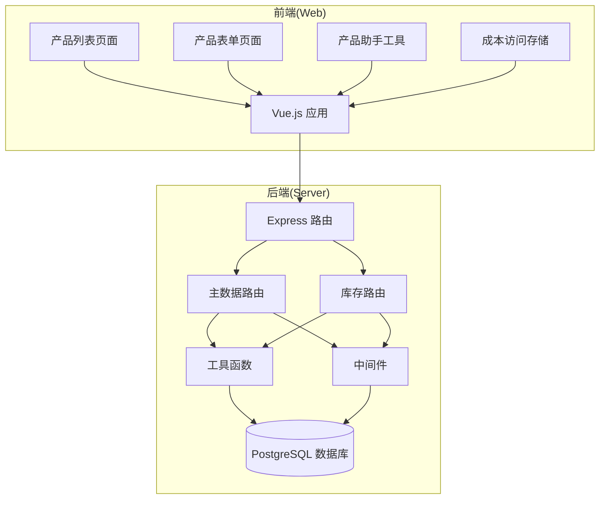

**图表来源**
- [server/src/routes/masterRoutes.js:1-1513](file://server/src/routes/masterRoutes.js#L1-L1513)
- [server/src/routes/inventoryRoutes.js:1-493](file://server/src/routes/inventoryRoutes.js#L1-L493)

**章节来源**
- [server/src/routes/masterRoutes.js:1-1513](file://server/src/routes/masterRoutes.js#L1-L1513)
- [server/src/routes/inventoryRoutes.js:1-493](file://server/src/routes/inventoryRoutes.js#L1-L493)

## 核心组件
系统的核心组件包括产品管理、库存管理、价格计算、权限控制等模块。每个组件都有明确的职责分工和交互关系。

### 数据模型设计
系统采用关系型数据库设计，核心表包括产品、分类、仓库、库存等实体：

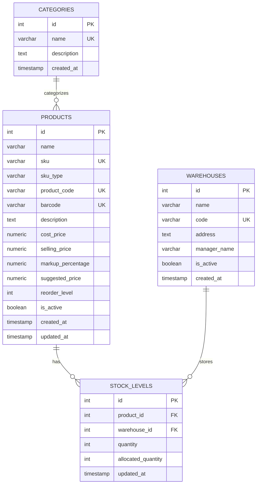

**图表来源**
- [server/database/schema.sql:32-133](file://server/database/schema.sql#L32-L133)

**章节来源**
- [server/database/schema.sql:1-447](file://server/database/schema.sql#L1-L447)
- [server/database/seed.sql:1-114](file://server/database/seed.sql#L1-L114)

## 架构概览
系统采用分层架构设计，确保了良好的可维护性和扩展性：

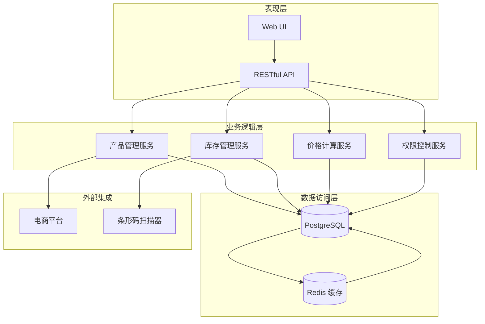

**图表来源**
- [server/src/middleware/auth.js:1-46](file://server/src/middleware/auth.js#L1-L46)
- [server/src/utils/costAccess.js:1-32](file://server/src/utils/costAccess.js#L1-L32)

## 详细组件分析

### 产品管理核心功能

#### CRUD 操作实现
系统提供了完整的 CRUD 操作，包括产品创建、查询、更新和删除：

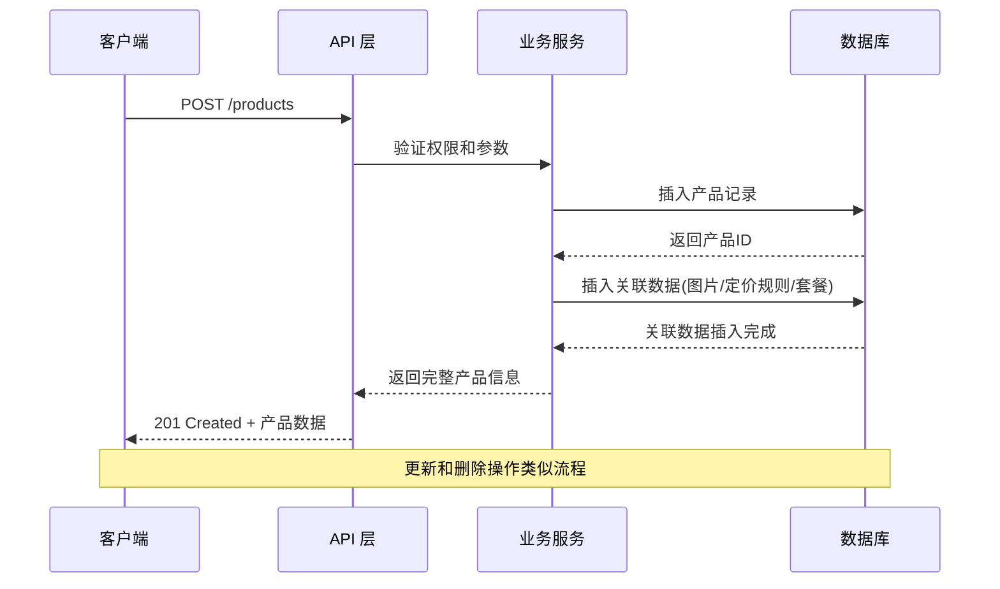

**图表来源**
- [server/src/routes/masterRoutes.js:1258-1360](file://server/src/routes/masterRoutes.js#L1258-L1360)
- [server/src/routes/masterRoutes.js:1362-1501](file://server/src/routes/masterRoutes.js#L1362-L1501)

#### SKU 生成规则
系统实现了智能的 SKU 生成机制：

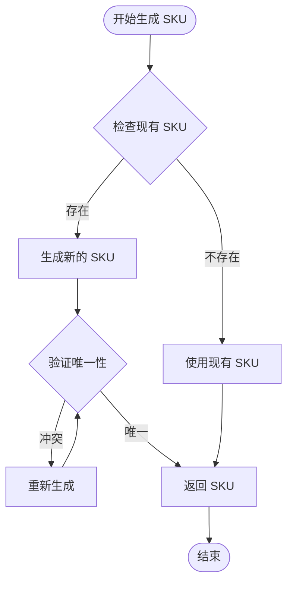

**图表来源**
- [server/src/routes/masterRoutes.js:18-20](file://server/src/routes/masterRoutes.js#L18-L20)

#### 价格计算与定价策略
系统支持多渠道定价策略和智能价格计算：

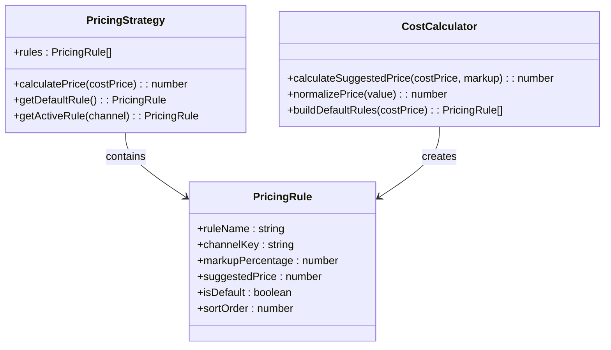

**图表来源**
- [server/src/routes/masterRoutes.js:26-93](file://server/src/routes/masterRoutes.js#L26-L93)
- [web/src/utils/productHelpers.js:21-44](file://web/src/utils/productHelpers.js#L21-L44)

**章节来源**
- [server/src/routes/masterRoutes.js:18-93](file://server/src/routes/masterRoutes.js#L18-L93)
- [web/src/utils/productHelpers.js:17-44](file://web/src/utils/productHelpers.js#L17-L44)

### 图片上传与管理
系统提供了完整的图片处理和管理功能：

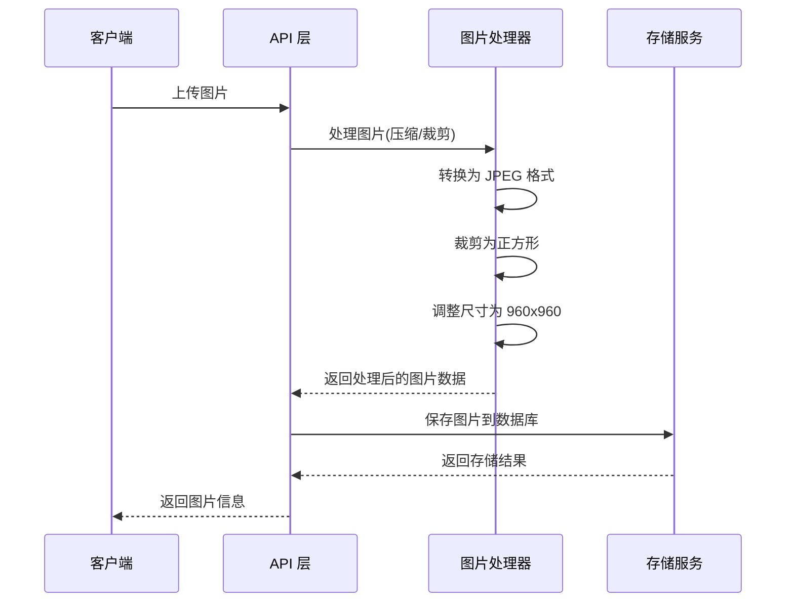

**图表来源**
- [web/src/utils/productHelpers.js:168-196](file://web/src/utils/productHelpers.js#L168-L196)
- [server/src/routes/masterRoutes.js:377-408](file://server/src/routes/masterRoutes.js#L377-L408)

#### 套餐组合功能
系统支持产品套餐的创建和管理：

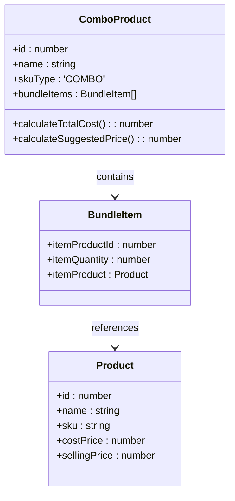

**图表来源**
- [server/src/routes/masterRoutes.js:433-463](file://server/src/routes/masterRoutes.js#L433-L463)
- [server/database/schema.sql:80-87](file://server/database/schema.sql#L80-L87)

**章节来源**
- [server/src/routes/masterRoutes.js:433-463](file://server/src/routes/masterRoutes.js#L433-L463)
- [server/database/schema.sql:80-87](file://server/database/schema.sql#L80-L87)

### 成本价格保护机制
系统实现了严格的成本价格保护机制：

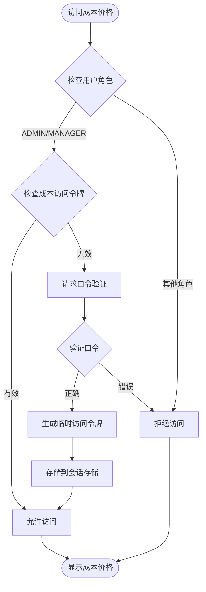

**图表来源**
- [server/src/utils/costAccess.js:5-27](file://server/src/utils/costAccess.js#L5-L27)
- [web/src/stores/costAccess.js:11-27](file://web/src/stores/costAccess.js#L11-L27)

**章节来源**
- [server/src/utils/costAccess.js:1-32](file://server/src/utils/costAccess.js#L1-L32)
- [web/src/stores/costAccess.js:1-37](file://web/src/stores/costAccess.js#L1-L37)

### 权限控制机制
系统采用基于角色的权限控制(RBAC)：

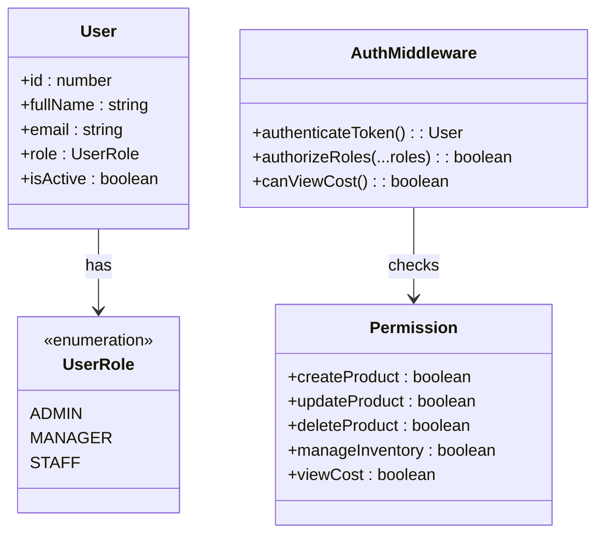

**图表来源**
- [server/src/middleware/auth.js:32-40](file://server/src/middleware/auth.js#L32-L40)
- [server/src/utils/costAccess.js:25-27](file://server/src/utils/costAccess.js#L25-L27)

**章节来源**
- [server/src/middleware/auth.js:1-46](file://server/src/middleware/auth.js#L1-L46)
- [server/src/utils/costAccess.js:1-32](file://server/src/utils/costAccess.js#L1-L32)

### 搜索过滤与批量操作
系统提供了强大的搜索过滤和批量操作功能：

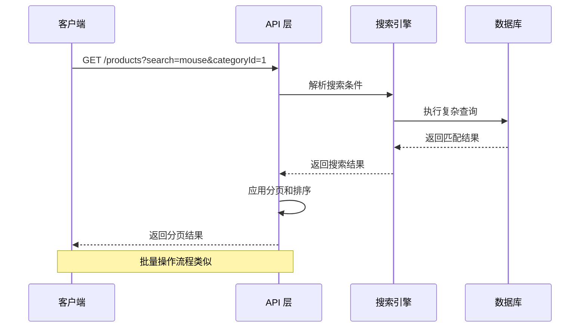

**图表来源**
- [server/src/routes/masterRoutes.js:892-1022](file://server/src/routes/masterRoutes.js#L892-L1022)
- [server/src/routes/inventoryRoutes.js:17-151](file://server/src/routes/inventoryRoutes.js#L17-L151)

**章节来源**
- [server/src/routes/masterRoutes.js:892-1022](file://server/src/routes/masterRoutes.js#L892-L1022)
- [server/src/routes/inventoryRoutes.js:17-151](file://server/src/routes/inventoryRoutes.js#L17-L151)

### 数据验证规则
系统实现了多层次的数据验证：

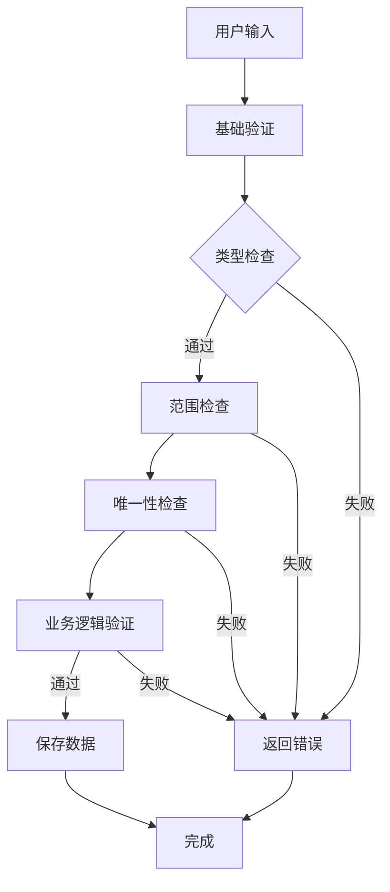

**图表来源**
- [server/src/routes/masterRoutes.js:1284-1286](file://server/src/routes/masterRoutes.js#L1284-L1286)
- [server/src/routes/inventoryRoutes.js:234-236](file://server/src/routes/inventoryRoutes.js#L234-L236)

**章节来源**
- [server/src/routes/masterRoutes.js:1284-1286](file://server/src/routes/masterRoutes.js#L1284-L1286)
- [server/src/routes/inventoryRoutes.js:234-236](file://server/src/routes/inventoryRoutes.js#L234-L236)

### 历史记录与审计追踪
系统提供了完整的历史记录和审计功能：

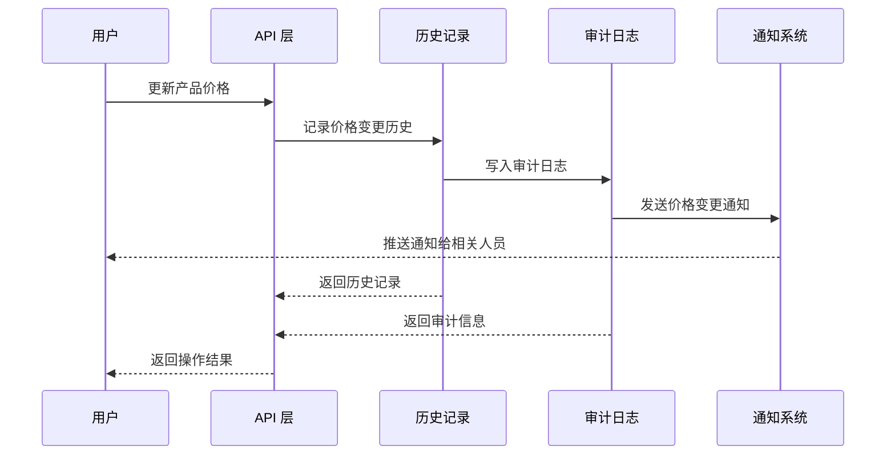

**图表来源**
- [server/src/routes/masterRoutes.js:234-281](file://server/src/routes/masterRoutes.js#L234-L281)
- [server/src/utils/auditLog.js:1-38](file://server/src/utils/auditLog.js#L1-L38)

**章节来源**
- [server/src/routes/masterRoutes.js:234-281](file://server/src/routes/masterRoutes.js#L234-L281)
- [server/src/utils/auditLog.js:1-38](file://server/src/utils/auditLog.js#L1-L38)

### 条形码生成与库存联动
系统集成了条形码生成功能和库存实时联动：

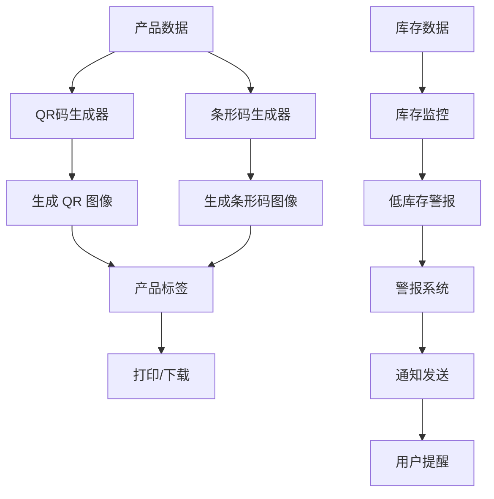

**图表来源**
- [web/src/utils/productHelpers.js:46-59](file://web/src/utils/productHelpers.js#L46-L59)
- [web/src/pages/ProductsPage.vue:495-520](file://web/src/pages/ProductsPage.vue#L495-L520)

**章节来源**
- [web/src/utils/productHelpers.js:46-59](file://web/src/utils/productHelpers.js#L46-L59)
- [web/src/pages/ProductsPage.vue:495-520](file://web/src/pages/ProductsPage.vue#L495-L520)

### 电商同步功能
系统支持与电商平台的同步：

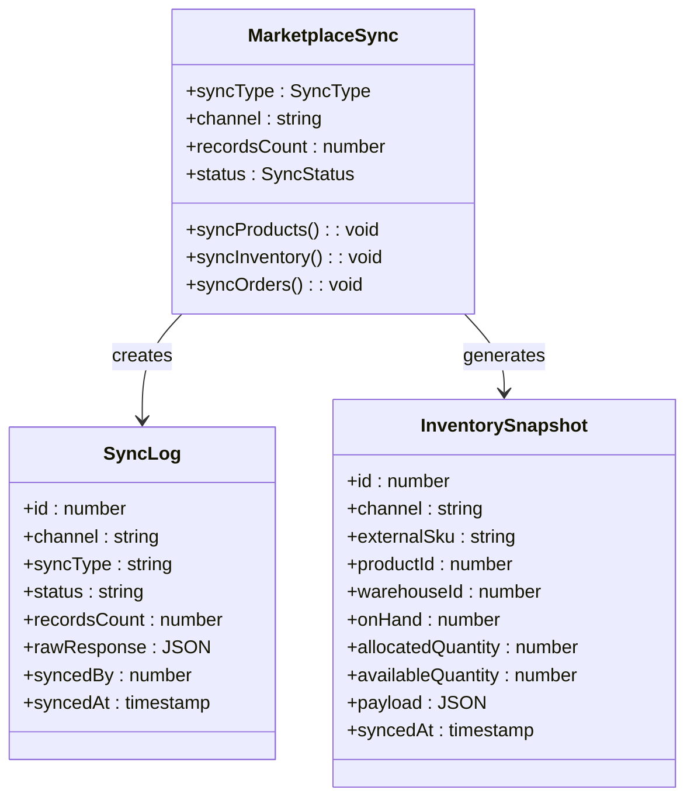

**图表来源**
- [server/database/schema.sql:137-172](file://server/database/schema.sql#L137-L172)
- [server/database/schema.sql:148-159](file://server/database/schema.sql#L148-L159)

**章节来源**
- [server/database/schema.sql:137-172](file://server/database/schema.sql#L137-L172)
- [server/database/schema.sql:148-159](file://server/database/schema.sql#L148-L159)

## 依赖关系分析

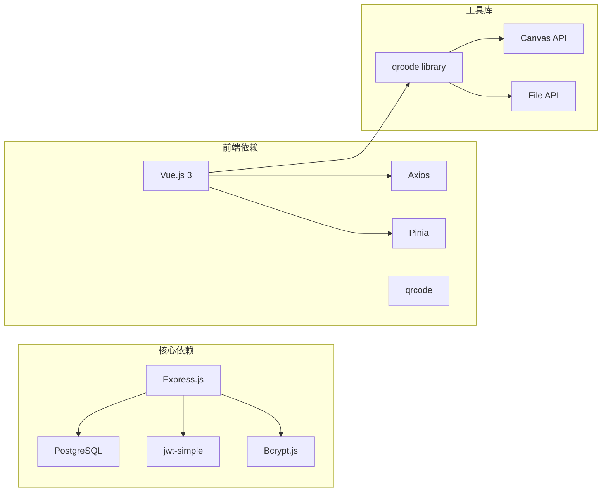

**图表来源**
- [package.json](file://package.json)
- [web/package.json](file://web/package.json)

**章节来源**
- [package.json](file://package.json)
- [web/package.json](file://web/package.json)

## 性能考虑
系统在设计时充分考虑了性能优化：

1. **数据库索引优化**: 为常用查询字段建立了适当的索引
2. **分页查询**: 大数据量场景下使用分页避免全量加载
3. **并发处理**: 使用连接池和异步查询提高并发性能
4. **缓存策略**: 关键数据采用缓存减少数据库压力
5. **图片优化**: 自动压缩和格式转换减少传输体积

## 故障排除指南

### 常见问题及解决方案

#### 权限相关问题
- **问题**: 无法访问成本价格
- **原因**: 缺少成本访问令牌或权限不足
- **解决**: 使用管理员账户登录并申请成本访问权限

#### 数据验证错误
- **问题**: 保存产品时出现验证错误
- **原因**: SKU 或产品编码重复
- **解决**: 检查唯一性约束并修改重复值

#### 图片上传失败
- **问题**: 图片上传后无法显示
- **原因**: 文件格式不支持或大小超限
- **解决**: 确保上传 JPG/PNG 格式且大小适中

**章节来源**
- [server/src/routes/masterRoutes.js:1024-1052](file://server/src/routes/masterRoutes.js#L1024-L1052)
- [web/src/pages/ProductFormPage.vue:126-171](file://web/src/pages/ProductFormPage.vue#L126-L171)

## 结论
本产品管理系统通过精心设计的架构和完善的功能实现，为企业提供了全面的产品管理解决方案。系统具备以下优势：

1. **功能完整性**: 覆盖产品管理的所有核心需求
2. **安全性强**: 多层次权限控制和数据保护
3. **扩展性强**: 模块化设计便于功能扩展
4. **用户体验佳**: 前后端分离提供流畅的交互体验
5. **性能优异**: 优化的数据库设计和查询策略

系统为企业的数字化转型提供了坚实的技术基础，能够有效提升产品管理效率和准确性。

## 附录

### API 接口规范
系统提供 RESTful API 接口，支持标准的 HTTP 方法和状态码。

### 数据库设计规范
采用关系型数据库设计，遵循第三范式，确保数据一致性和完整性。

### 前端组件规范
Vue.js 组件采用 Composition API，提供清晰的组件职责划分和数据流管理。