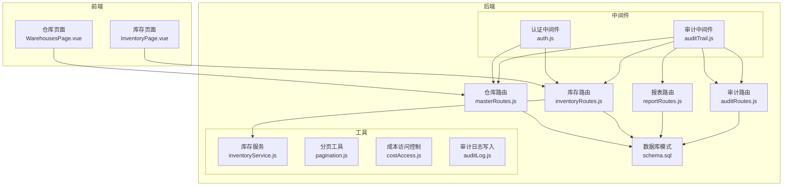
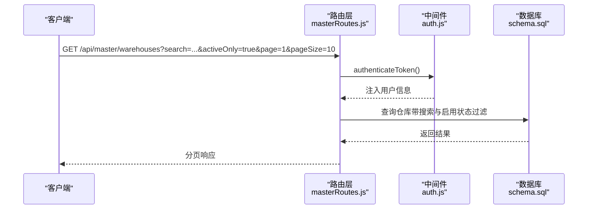
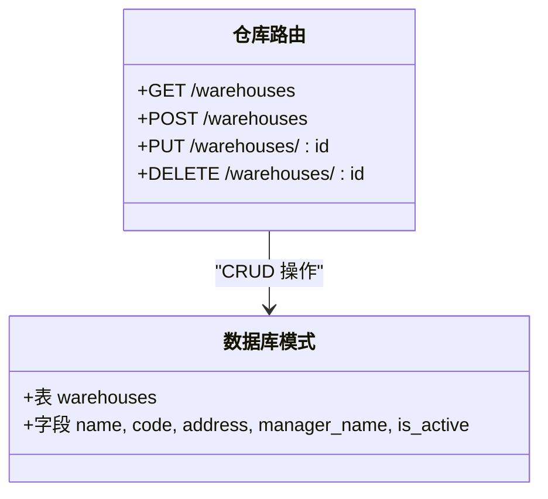
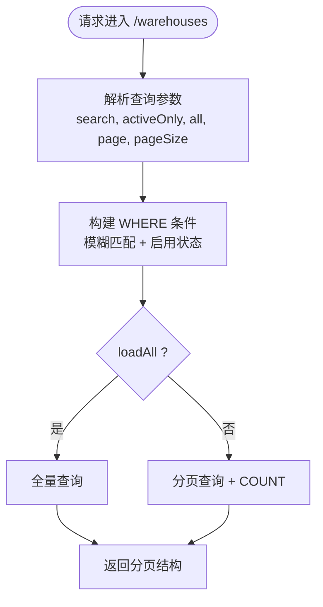
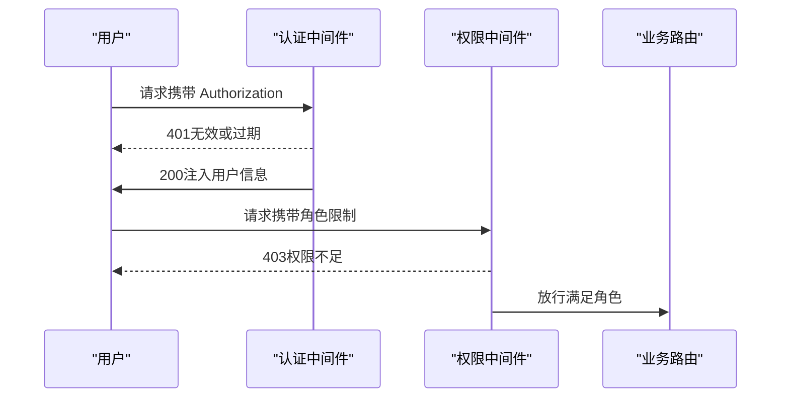
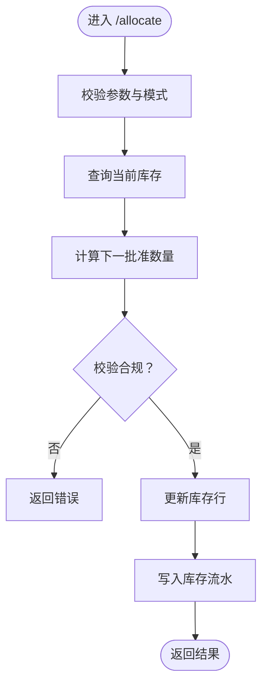
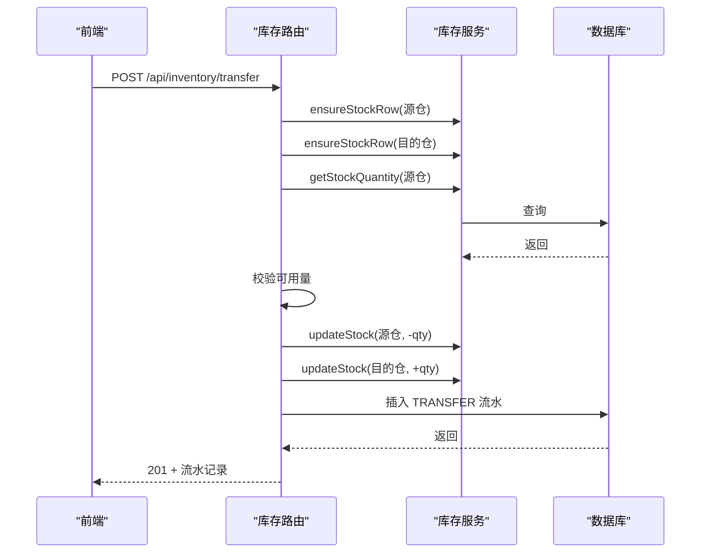
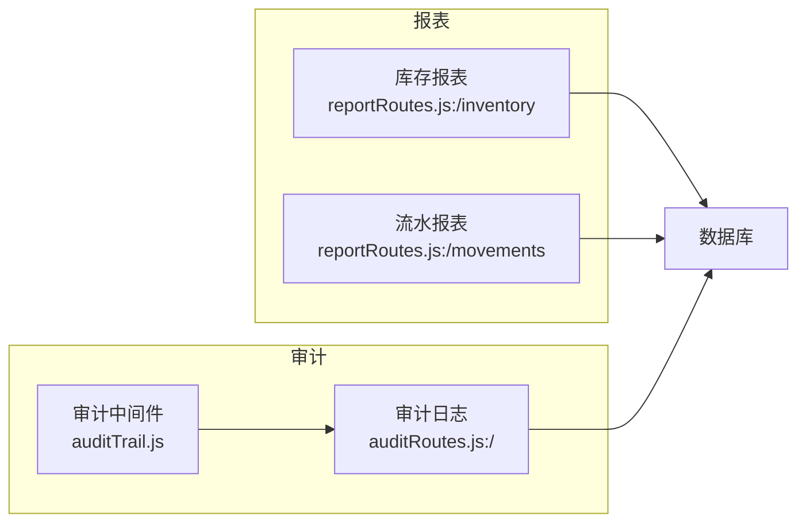
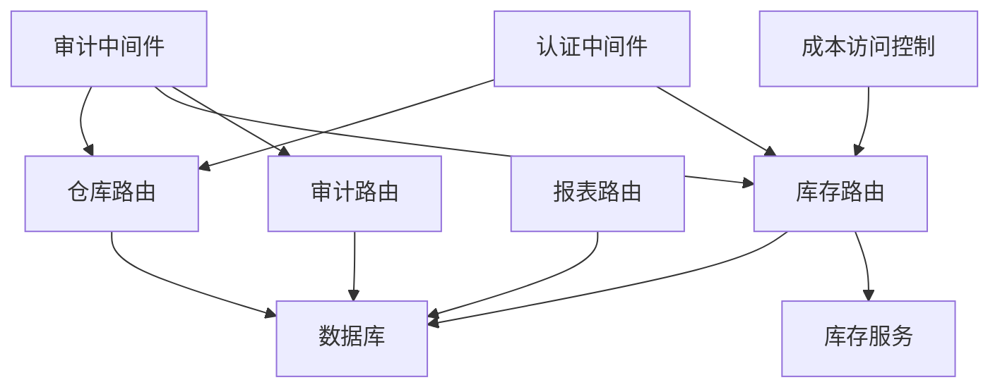

# 仓库管理

<cite>
**本文引用的文件**
- [仓库接口（masterRoutes.js）](file://server/src/routes/masterRoutes.js)
- [库存接口（inventoryRoutes.js）](file://server/src/routes/inventoryRoutes.js)
- [库存服务（inventoryService.js）](file://server/src/utils/inventoryService.js)
- [认证中间件（auth.js）](file://server/src/middleware/auth.js)
- [审计日志中间件（auditTrail.js）](file://server/src/middleware/auditTrail.js)
- [审计日志工具（auditLog.js）](file://server/src/utils/auditLog.js)
- [成本访问控制（costAccess.js）](file://server/src/utils/costAccess.js)
- [分页工具（pagination.js）](file://server/src/utils/pagination.js)
- [数据库模式（schema.sql）](file://server/database/schema.sql)
- [报表接口（reportRoutes.js）](file://server/src/routes/reportRoutes.js)
- [审计日志接口（auditRoutes.js）](file://server/src/routes/auditRoutes.js)
- [前端仓库页面（WarehousesPage.vue）](file://web/src/pages/WarehousesPage.vue)
- [前端库存页面（InventoryPage.vue）](file://web/src/pages/InventoryPage.vue)
- [Postman 集合（inventory_system_backend.postman_collection.json）](file://postman/inventory_system_backend.postman_collection.json)
</cite>

## 目录
1. [简介](#简介)
2. [项目结构](#项目结构)
3. [核心组件](#核心组件)
4. [架构概览](#架构概览)
5. [详细组件分析](#详细组件分析)
6. [依赖关系分析](#依赖关系分析)
7. [性能考虑](#性能考虑)
8. [故障排除指南](#故障排除指南)
9. [结论](#结论)
10. [附录](#附录)

## 简介
本文件面向仓库管理功能，提供从后端 API 到前端页面的完整技术文档。内容涵盖：
- 仓库的 CRUD 操作与状态管理
- 编码规则与搜索过滤
- 权限控制与审计追踪
- 多仓库支持与库存分配
- 库存变动（入库、出库、调拨、预留/释放）
- 报表统计与批量操作能力

## 项目结构
后端采用 Express + PostgreSQL 架构，仓库管理相关的核心模块包括：
- 路由层：仓库接口位于 masterRoutes.js；库存相关接口位于 inventoryRoutes.js；报表接口位于 reportRoutes.js；审计日志接口位于 auditRoutes.js
- 中间件：认证与授权（auth.js）、审计日志记录（auditTrail.js）
- 工具层：库存服务（inventoryService.js）、分页（pagination.js）、成本访问控制（costAccess.js）、审计日志写入（auditLog.js）
- 数据层：数据库模式定义在 schema.sql

**图表来源**
- [仓库接口（masterRoutes.js）:775-889](file://server/src/routes/masterRoutes.js#L775-L889)
- [库存接口（inventoryRoutes.js）:1-493](file://server/src/routes/inventoryRoutes.js#L1-L493)
- [库存服务（inventoryService.js）:1-45](file://server/src/utils/inventoryService.js#L1-L45)
- [认证中间件（auth.js）:1-46](file://server/src/middleware/auth.js#L1-L46)
- [审计日志中间件（auditTrail.js）:1-84](file://server/src/middleware/auditTrail.js#L1-L84)
- [数据库模式（schema.sql）:22-30](file://server/database/schema.sql#L22-L30)

**章节来源**
- [仓库接口（masterRoutes.js）:775-889](file://server/src/routes/masterRoutes.js#L775-L889)
- [库存接口（inventoryRoutes.js）:1-493](file://server/src/routes/inventoryRoutes.js#L1-L493)
- [数据库模式（schema.sql）:22-30](file://server/database/schema.sql#L22-L30)

## 核心组件
- 仓库管理（CRUD + 状态）
  - 支持按名称/编码/地址/负责人模糊搜索，支持仅显示启用状态
  - 支持分页与全量加载
  - 支持创建、更新（含启用/停用）、删除
- 库存管理（入库、出库、调拨、预留/释放）
  - 统一库存行确保与事务性更新
  - 出库/调拨前可用库存校验
  - 记录库存流水与审计
- 报表与统计
  - 库存报表：按产品、仓库汇总，支持导出
  - 流水报表：支持时间范围与关键词搜索
- 审计追踪
  - 自动记录变更行为、实体类型、请求路径、元数据等
  - 受限访问（管理员/经理）

**章节来源**
- [仓库接口（masterRoutes.js）:775-889](file://server/src/routes/masterRoutes.js#L775-L889)
- [库存接口（inventoryRoutes.js）:229-490](file://server/src/routes/inventoryRoutes.js#L229-L490)
- [库存服务（inventoryService.js）:1-45](file://server/src/utils/inventoryService.js#L1-L45)
- [报表接口（reportRoutes.js）:15-249](file://server/src/routes/reportRoutes.js#L15-L249)
- [审计日志接口（auditRoutes.js）:15-107](file://server/src/routes/auditRoutes.js#L15-L107)

## 架构概览
仓库管理遵循“路由 → 中间件 → 服务/工具 → 数据库”的分层设计。认证中间件负责鉴权，审计中间件负责记录审计日志。

**图表来源**
- [仓库接口（masterRoutes.js）:775-832](file://server/src/routes/masterRoutes.js#L775-L832)
- [认证中间件（auth.js）:5-29](file://server/src/middleware/auth.js#L5-L29)
- [数据库模式（schema.sql）:22-30](file://server/database/schema.sql#L22-L30)

## 详细组件分析

### 仓库 CRUD 与状态管理
- 接口能力
  - 列表：支持搜索、启用状态筛选、分页
  - 创建：需要名称与编码
  - 更新：支持启用/停用
  - 删除：级联删除（无外键约束冲突）
- 数据模型
  - 表：warehouses（字段：name、code、address、manager_name、is_active）
  - 索引：按名称排序，便于列表展示
- 权限控制
  - 仓库接口使用角色授权（ADMIN、MANAGER），保证基础维护安全

**图表来源**
- [仓库接口（masterRoutes.js）:775-889](file://server/src/routes/masterRoutes.js#L775-L889)
- [数据库模式（schema.sql）:22-30](file://server/database/schema.sql#L22-L30)

**章节来源**
- [仓库接口（masterRoutes.js）:775-889](file://server/src/routes/masterRoutes.js#L775-L889)
- [数据库模式（schema.sql）:22-30](file://server/database/schema.sql#L22-L30)

### 编码规则与搜索过滤
- 编码规则
  - 仓库编码唯一（UNIQUE），用于快速识别与关联
- 搜索与过滤
  - 支持名称、编码、地址、负责人姓名模糊匹配
  - 启用状态筛选（activeOnly）
  - 分页参数：page、pageSize（1~100）
- 前端集成
  - 仓库页面通过 API 参数传递搜索词与分页配置

**图表来源**
- [仓库接口（masterRoutes.js）:775-832](file://server/src/routes/masterRoutes.js#L775-L832)
- [分页工具（pagination.js）:2-28](file://server/src/utils/pagination.js#L2-L28)

**章节来源**
- [仓库接口（masterRoutes.js）:775-832](file://server/src/routes/masterRoutes.js#L775-L832)
- [前端仓库页面（WarehousesPage.vue）:28-98](file://web/src/pages/WarehousesPage.vue#L28-L98)

### 权限控制机制
- 认证
  - Bearer Token 校验，失败返回 401
  - 用户存在且激活才允许访问
- 授权
  - 角色白名单：ADMIN、MANAGER、STAFF（部分接口）
  - 仓库接口要求 ADMIN 或 MANAGER
- 成本价格访问控制
  - 通过自定义头 x-cost-access-token 获取临时授权令牌
  - 仅 ADMIN/MANAGER 且令牌有效时可见成本价

**图表来源**
- [认证中间件（auth.js）:5-40](file://server/src/middleware/auth.js#L5-L40)
- [成本访问控制（costAccess.js）:5-31](file://server/src/utils/costAccess.js#L5-L31)

**章节来源**
- [认证中间件（auth.js）:5-40](file://server/src/middleware/auth.js#L5-L40)
- [成本访问控制（costAccess.js）:5-31](file://server/src/utils/costAccess.js#L5-L31)

### 库存分配与可用量计算
- 关键指标
  - on_hand_quantity：实盘数量
  - order_allocated_quantity：订单预留数量
  - warehouse_available_quantity：可用数量 = MAX(on_hand - allocated, 0)
- 预留/释放
  - 支持 reserve/release 模式
  - 校验：预留数不能为负，且不超过实盘数
- 入库/出库/调拨
  - 统一通过 ensureStockRow 确保存在库存行
  - 使用事务更新 stock_levels 并写入 stock_movements

**图表来源**
- [库存接口（inventoryRoutes.js）:417-490](file://server/src/routes/inventoryRoutes.js#L417-L490)
- [库存服务（inventoryService.js）:13-38](file://server/src/utils/inventoryService.js#L13-L38)

**章节来源**
- [库存接口（inventoryRoutes.js）:417-490](file://server/src/routes/inventoryRoutes.js#L417-L490)
- [库存服务（inventoryService.js）:13-38](file://server/src/utils/inventoryService.js#L13-L38)

### 多仓库支持与库存转移
- 多仓库
  - stock_levels 以 (product_id, warehouse_id) 唯一索引，天然支持多仓库
- 调拨流程
  - 校验源仓可用量
  - 分别更新源仓与目的仓库存
  - 写入 TRANSFER 类型流水
- 前端交互
  - 库存页面提供选择源仓/目的仓、数量、参考号等

**图表来源**
- [库存接口（inventoryRoutes.js）:334-396](file://server/src/routes/inventoryRoutes.js#L334-L396)
- [库存服务（inventoryService.js）:2-11](file://server/src/utils/inventoryService.js#L2-L11)

**章节来源**
- [库存接口（inventoryRoutes.js）:334-396](file://server/src/routes/inventoryRoutes.js#L334-L396)
- [前端库存页面（InventoryPage.vue）:61-68](file://web/src/pages/InventoryPage.vue#L61-L68)

### 仓库统计、报表与审计
- 库存报表
  - 汇总产品、仓库、实盘、预留、可用、重购点、成本价与库存价值
  - 支持搜索与导出（all=true）
- 流水报表
  - 支持时间范围与关键词搜索，按时间倒序
- 审计日志
  - 自动记录登录、仓库、产品、库存等操作
  - 管理员/经理可查看与筛选

**图表来源**
- [报表接口（reportRoutes.js）:15-249](file://server/src/routes/reportRoutes.js#L15-L249)
- [审计日志接口（auditRoutes.js）:15-107](file://server/src/routes/auditRoutes.js#L15-L107)
- [审计日志中间件（auditTrail.js）:47-79](file://server/src/middleware/auditTrail.js#L47-L79)

**章节来源**
- [报表接口（reportRoutes.js）:15-249](file://server/src/routes/reportRoutes.js#L15-L249)
- [审计日志接口（auditRoutes.js）:15-107](file://server/src/routes/auditRoutes.js#L15-L107)
- [审计日志中间件（auditTrail.js）:47-79](file://server/src/middleware/auditTrail.js#L47-L79)

## 依赖关系分析
- 路由层依赖中间件与工具层
- 库存路由依赖库存服务与数据库
- 审计中间件贯穿所有受保护路由
- 成本访问控制依赖用户角色与自定义令牌

**图表来源**
- [库存接口（inventoryRoutes.js）:1-493](file://server/src/routes/inventoryRoutes.js#L1-L493)
- [库存服务（inventoryService.js）:1-45](file://server/src/utils/inventoryService.js#L1-L45)
- [认证中间件（auth.js）:1-46](file://server/src/middleware/auth.js#L1-L46)
- [审计日志中间件（auditTrail.js）:1-84](file://server/src/middleware/auditTrail.js#L1-L84)

**章节来源**
- [库存接口（inventoryRoutes.js）:1-493](file://server/src/routes/inventoryRoutes.js#L1-L493)
- [认证中间件（auth.js）:1-46](file://server/src/middleware/auth.js#L1-L46)

## 性能考虑
- 分页与全量加载
  - 默认分页（1~100），全量导出时使用 all=true
- 查询优化
  - 仓库列表与库存报表均使用 LIKE + 索引字段组合
  - 使用 LIMIT/OFFSET 与 COUNT(*) 并行查询
- 事务与一致性
  - 所有库存变动使用 BEGIN/COMMIT/Rollback 保证原子性
- 成本价可见性
  - 通过成本访问令牌控制敏感字段返回，降低前端复杂度

[本节为通用指导，无需列出具体文件来源]

## 故障排除指南
- 认证失败
  - 检查 Authorization 头是否为 Bearer Token
  - 确认用户存在且 is_active 为真
- 权限不足
  - 确认用户角色在允许范围内
  - 成本价访问需额外令牌头
- 库存不足
  - 出库/调拨前检查可用量（on_hand - allocated）
- 审计日志未记录
  - 确认中间件已注册且非 400+ 响应才会记录
  - 审计日志接口仅管理员/经理可访问

**章节来源**
- [认证中间件（auth.js）:5-29](file://server/src/middleware/auth.js#L5-L29)
- [审计日志中间件（auditTrail.js）:47-79](file://server/src/middleware/auditTrail.js#L47-L79)
- [库存接口（inventoryRoutes.js）:292-303](file://server/src/routes/inventoryRoutes.js#L292-L303)

## 结论
该仓库管理功能以清晰的分层架构实现，具备完善的权限控制、审计追踪与库存一致性保障。通过统一的库存服务与事务封装，确保多仓库场景下的库存分配与转移安全可靠。报表与审计能力为运营与合规提供了有力支撑。

[本节为总结性内容，无需列出具体文件来源]

## 附录

### API 一览（仓库）
- GET /api/master/warehouses
  - 查询参数：search、activeOnly、all、page、pageSize
  - 返回：items + pagination
- POST /api/master/warehouses
  - 请求体：name、code、address、managerName、isActive
  - 返回：新建仓库记录
- PUT /api/master/warehouses/:id
  - 请求体：同上
  - 返回：更新后的仓库记录
- DELETE /api/master/warehouses/:id
  - 返回：204

**章节来源**
- [仓库接口（masterRoutes.js）:775-889](file://server/src/routes/masterRoutes.js#L775-L889)

### API 一览（库存）
- POST /api/inventory/stock-in
  - 请求体：productId、warehouseId、quantity、referenceNo、notes、supplierId、unitCost、purchaseReason
- POST /api/inventory/stock-out
  - 请求体：productId、warehouseId、quantity、referenceNo、notes
- POST /api/inventory/transfer
  - 请求体：productId、sourceWarehouseId、destinationWarehouseId、quantity、referenceNo、notes
- POST /api/inventory/allocate
  - 请求体：productId、warehouseId、quantity、mode（reserve/release）、referenceNo、notes

**章节来源**
- [库存接口（inventoryRoutes.js）:405-490](file://server/src/routes/inventoryRoutes.js#L405-L490)

### 报表与审计
- GET /api/reports/inventory?search=&all=false&page=1&pageSize=10
- GET /api/reports/movements?startDate=&endDate=&search=&all=false&page=1&pageSize=10
- GET /api/audit-logs?search=&action=all&entityType=all&startDate=&endDate=&page=1&pageSize=20

**章节来源**
- [报表接口（reportRoutes.js）:15-249](file://server/src/routes/reportRoutes.js#L15-L249)
- [审计日志接口（auditRoutes.js）:15-107](file://server/src/routes/auditRoutes.js#L15-L107)
- [Postman 集合（inventory_system_backend.postman_collection.json）:438-473](file://postman/inventory_system_backend.postman_collection.json#L438-L473)