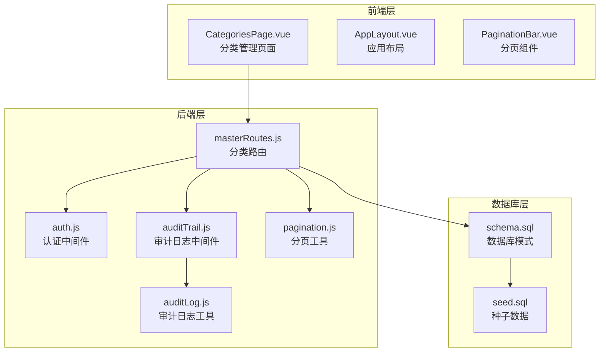
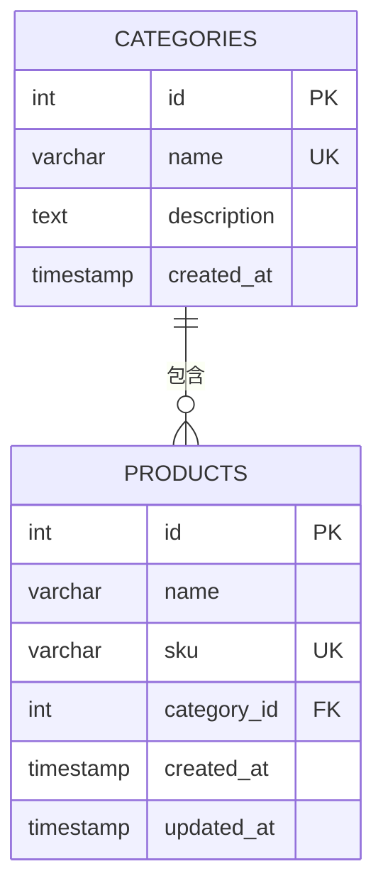
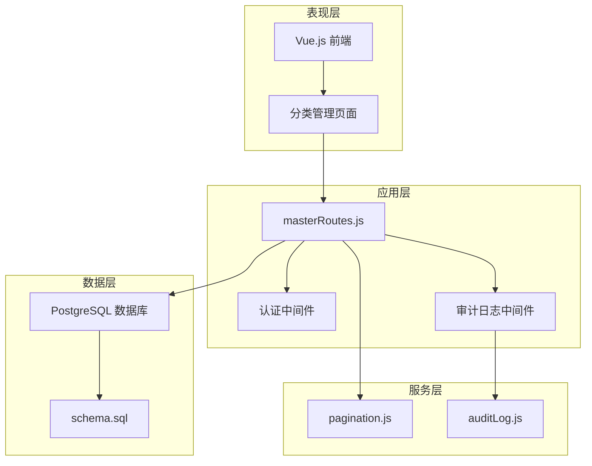
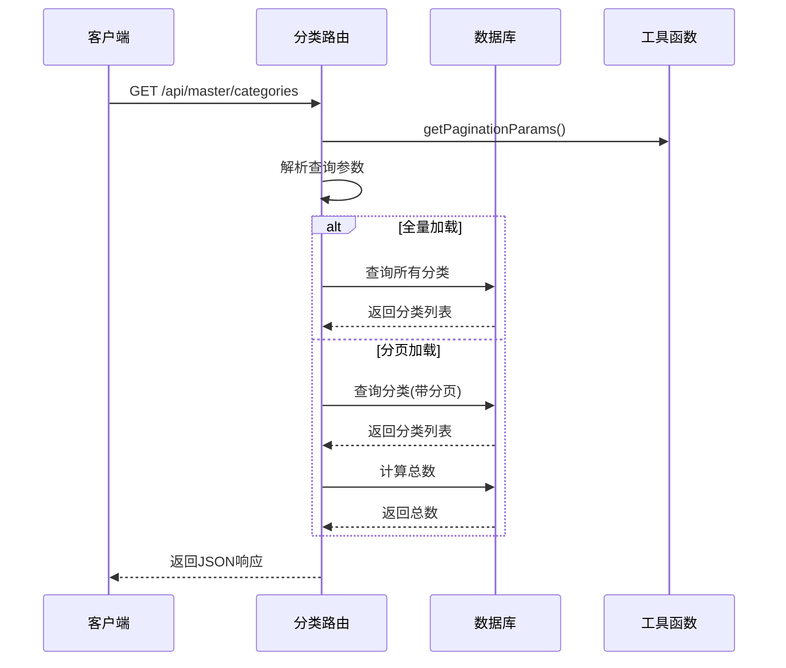
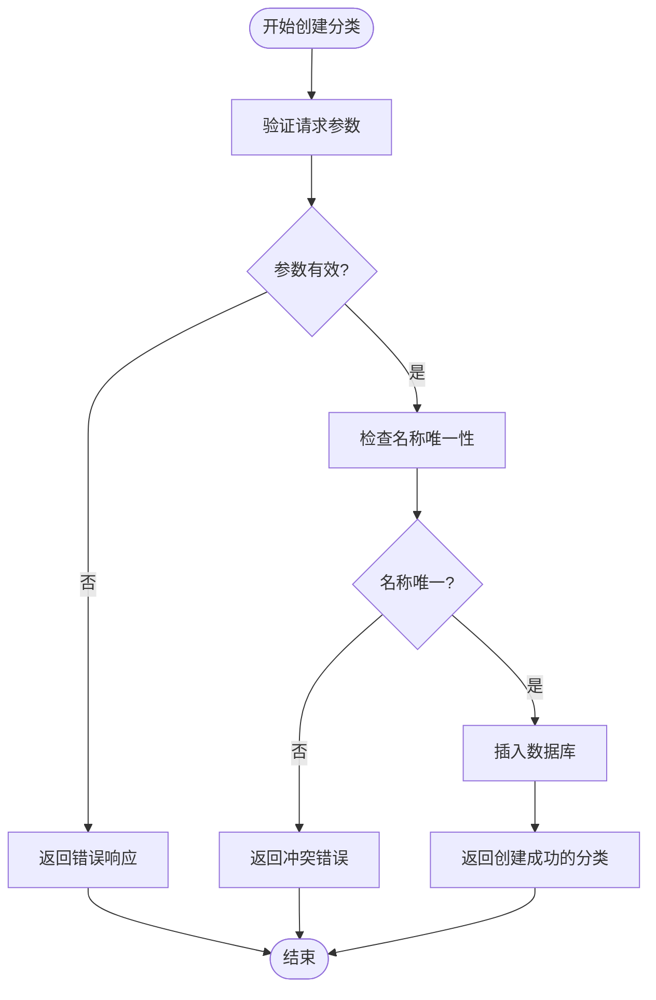
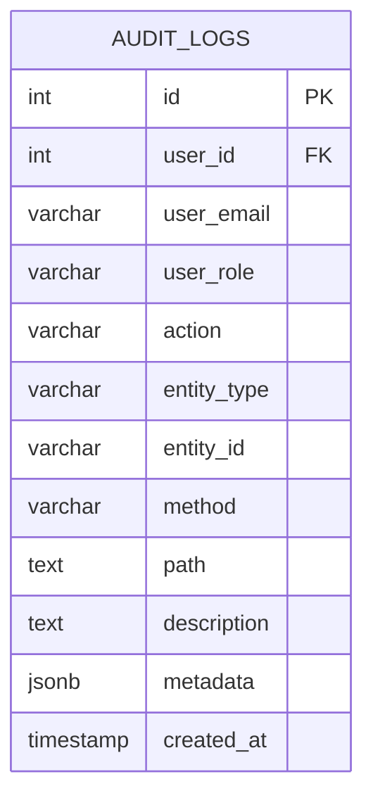
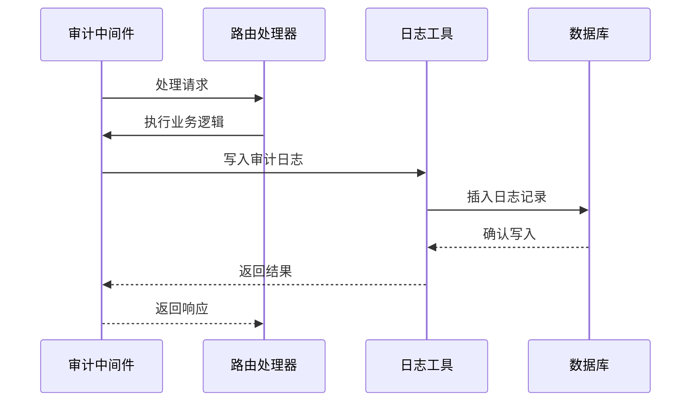

# 分类管理

<cite>
**本文档引用的文件**
- [masterRoutes.js](file://server/src/routes/masterRoutes.js)
- [auth.js](file://server/src/middleware/auth.js)
- [auditTrail.js](file://server/src/middleware/auditTrail.js)
- [auditLog.js](file://server/src/utils/auditLog.js)
- [CategoriesPage.vue](file://web/src/pages/CategoriesPage.vue)
- [pagination.js](file://server/src/utils/pagination.js)
- [schema.sql](file://server/database/schema.sql)
- [auditRoutes.js](file://server/src/routes/auditRoutes.js)
- [seed.sql](file://server/database/seed.sql)
</cite>

## 目录
1. [简介](#简介)
2. [项目结构](#项目结构)
3. [核心组件](#核心组件)
4. [架构概览](#架构概览)
5. [详细组件分析](#详细组件分析)
6. [依赖关系分析](#依赖关系分析)
7. [性能考虑](#性能考虑)
8. [故障排除指南](#故障排除指南)
9. [结论](#结论)

## 简介

分类管理功能是库存管理系统中的核心基础数据管理模块，负责维护产品分类的层级结构、CRUD操作以及与产品的关联关系。该功能实现了完整的分类生命周期管理，包括分类的创建、查询、更新、删除操作，同时提供了搜索、排序、分页等高级功能。

系统采用前后端分离架构，前端使用Vue.js构建用户界面，后端基于Node.js和Express框架提供RESTful API服务。分类管理功能通过严格的权限控制确保数据安全，并通过审计日志记录所有关键操作。

## 项目结构

分类管理功能在项目中的组织结构如下：



**图表来源**
- [masterRoutes.js:663-773](file://server/src/routes/masterRoutes.js#L663-L773)
- [CategoriesPage.vue:1-211](file://web/src/pages/CategoriesPage.vue#L1-L211)

**章节来源**
- [masterRoutes.js:663-773](file://server/src/routes/masterRoutes.js#L663-L773)
- [CategoriesPage.vue:1-211](file://web/src/pages/CategoriesPage.vue#L1-L211)

## 核心组件

### 数据模型

分类管理的核心数据模型基于以下数据库表结构：



**图表来源**
- [schema.sql:15-20](file://server/database/schema.sql#L15-L20)
- [schema.sql:32-54](file://server/database/schema.sql#L32-L54)

### 权限控制机制

系统采用基于角色的访问控制（RBAC）机制：

- **分类创建/更新/删除**：需要ADMIN或MANAGER角色
- **分类查询**：无需特殊权限，所有已认证用户可访问
- **成本价格访问**：通过专门的成本访问令牌控制

**章节来源**
- [masterRoutes.js:718-773](file://server/src/routes/masterRoutes.js#L718-L773)
- [auth.js:32-40](file://server/src/middleware/auth.js#L32-L40)

## 架构概览

分类管理系统的整体架构采用分层设计：



**图表来源**
- [masterRoutes.js:1-1513](file://server/src/routes/masterRoutes.js#L1-L1513)
- [auth.js:1-46](file://server/src/middleware/auth.js#L1-L46)

## 详细组件分析

### 分类路由实现

分类管理的核心路由实现位于masterRoutes.js文件中，提供了完整的CRUD操作：

#### GET /api/master/categories
支持搜索、分页和全量加载功能：



**图表来源**
- [masterRoutes.js:664-716](file://server/src/routes/masterRoutes.js#L664-L716)

#### POST /api/master/categories
创建新分类的完整流程：



**图表来源**
- [masterRoutes.js:718-739](file://server/src/routes/masterRoutes.js#L718-L739)

**章节来源**
- [masterRoutes.js:664-773](file://server/src/routes/masterRoutes.js#L664-L773)

### 前端组件实现

前端分类管理页面使用Vue.js构建，提供了完整的用户交互体验：

#### 页面组件结构
- **分类列表展示**：支持响应式表格和移动端卡片布局
- **搜索功能**：实时搜索分类名称和描述
- **分页控件**：集成PaginationBar组件
- **表单管理**：支持新增和编辑分类

#### 数据流管理


**图表来源**
- [CategoriesPage.vue:25-89](file://web/src/pages/CategoriesPage.vue#L25-L89)

**章节来源**
- [CategoriesPage.vue:1-211](file://web/src/pages/CategoriesPage.vue#L1-L211)

### 权限控制机制

系统实现了多层次的权限控制：

#### 认证中间件
- 验证JWT令牌的有效性
- 检查用户账户状态
- 将用户信息注入请求对象

#### 授权中间件
- 基于角色的访问控制
- 支持ADMIN、MANAGER、STAFF角色
- 动态权限验证

**章节来源**
- [auth.js:5-40](file://server/src/middleware/auth.js#L5-L40)

### 审计日志功能

系统提供了完整的审计日志功能，记录所有重要的操作：

#### 审计日志结构


**图表来源**
- [schema.sql:275-288](file://server/database/schema.sql#L275-L288)

#### 日志记录流程


**图表来源**
- [auditTrail.js:47-79](file://server/src/middleware/auditTrail.js#L47-L79)
- [auditLog.js:1-38](file://server/src/utils/auditLog.js#L1-L38)

**章节来源**
- [auditTrail.js:14-84](file://server/src/middleware/auditTrail.js#L14-L84)
- [auditLog.js:1-38](file://server/src/utils/auditLog.js#L1-L38)

## 依赖关系分析

### 数据库关系图

```mermaid
graph TB
subgraph "分类表"
CATEGORIES[categories]
end
subgraph "产品表"
PRODUCTS[products]
end
subgraph "索引优化"
IDX1[idx_categories_name]
IDX2[idx_products_category_id]
end
CATEGORIES --> |"1" -- "0..*"| PRODUCTS
PRODUCTS -.->|"外键约束"| CATEGORIES
CATEGORIES -.-> IDX1
PRODUCTS -.-> IDX2
```

**图表来源**
- [schema.sql:15-20](file://server/database/schema.sql#L15-L20)
- [schema.sql:44](file://server/database/schema.sql#L44)
- [schema.sql:410](file://server/database/schema.sql#L410)

### 关键依赖关系

#### 外键约束
- `products.category_id` 引用 `categories.id`
- 删除策略：`ON DELETE SET NULL`
- 允许产品在分类被删除后保持有效状态

#### 索引优化
- `categories.name` 唯一索引，确保分类名称唯一性
- `products.category_id` 普通索引，优化查询性能

**章节来源**
- [schema.sql:44](file://server/database/schema.sql#L44)
- [schema.sql:410](file://server/database/schema.sql#L410)

## 性能考虑

### 分页优化策略

系统实现了高效的分页机制：

#### 分页参数处理
- 默认每页10条记录，最大100条
- 使用OFFSET/LIMIT进行分页
- 并行查询数据和总数，提升响应速度

#### 查询优化
- 使用ILIKE进行模糊搜索
- 合理的WHERE条件组合
- 索引优化的查询路径

### 缓存策略

虽然分类数据相对静态，但系统仍考虑了缓存优化：

- 前端本地缓存最近访问的分类
- 后端查询结果缓存（可扩展）
- 搜索结果的智能缓存

## 故障排除指南

### 常见问题及解决方案

#### 认证失败
**症状**：401未授权错误
**原因**：
- 令牌缺失或格式不正确
- 令牌过期
- 用户账户无效

**解决方法**：
1. 检查Authorization头格式
2. 验证JWT令牌有效性
3. 确认用户账户状态

#### 权限不足
**症状**：403禁止访问
**原因**：用户角色不满足操作要求

**解决方法**：
1. 确认用户具有ADMIN或MANAGER角色
2. 检查具体的权限配置

#### 数据库约束冲突
**症状**：409冲突错误
**原因**：
- 分类名称重复
- 外键约束违反

**解决方法**：
1. 检查分类名称唯一性
2. 确认关联数据完整性

**章节来源**
- [auth.js:9-28](file://server/src/middleware/auth.js#L9-L28)
- [masterRoutes.js:718-739](file://server/src/routes/masterRoutes.js#L718-L739)

## 结论

分类管理功能作为库存管理系统的基础模块，实现了以下关键特性：

### 核心优势
- **完整的CRUD操作**：支持分类的全生命周期管理
- **灵活的查询能力**：搜索、排序、分页功能完善
- **严格的数据完整性**：外键约束和唯一性约束
- **强大的权限控制**：基于角色的细粒度访问控制
- **全面的审计功能**：完整的操作日志记录

### 技术特点
- **前后端分离架构**：清晰的职责划分
- **模块化设计**：可维护性和可扩展性强
- **性能优化**：合理的数据库设计和查询优化
- **安全性保障**：多层次的安全防护机制

### 未来改进方向
- 添加批量操作功能
- 实现分类层级结构支持
- 增强搜索算法的智能化
- 优化移动端用户体验

该分类管理功能为整个库存管理系统奠定了坚实的基础，为后续的功能扩展提供了良好的架构支撑。