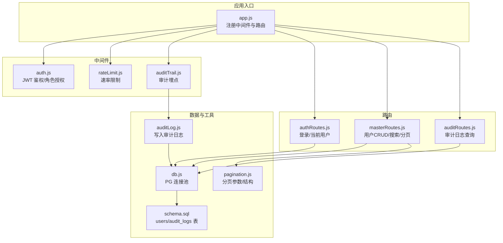
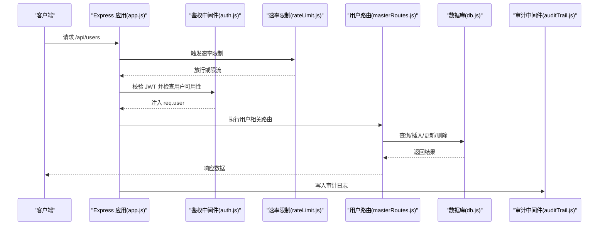
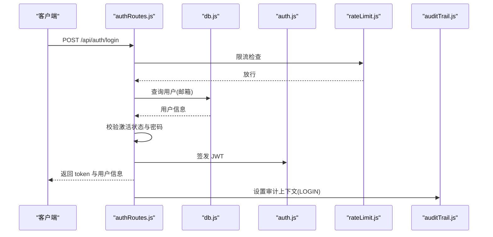
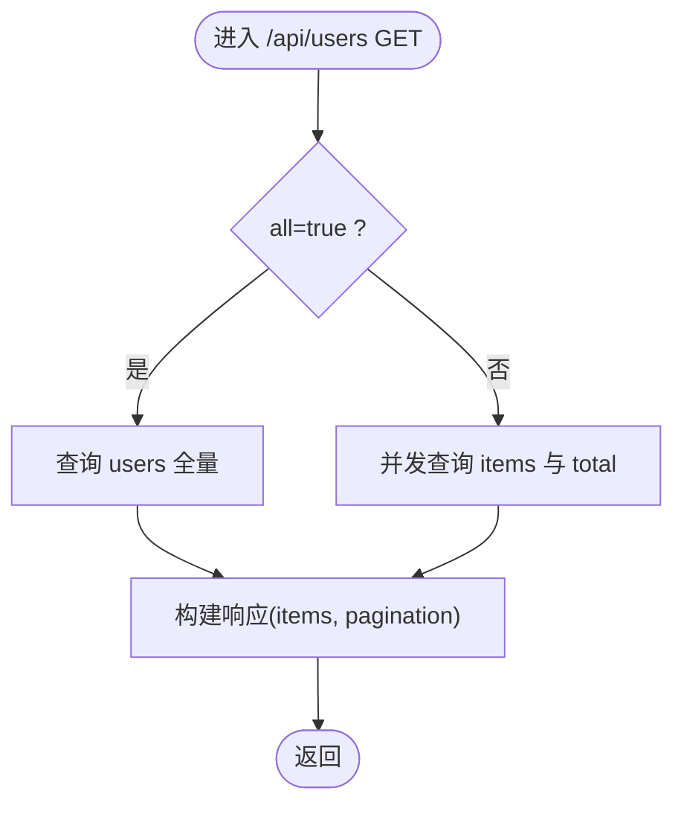
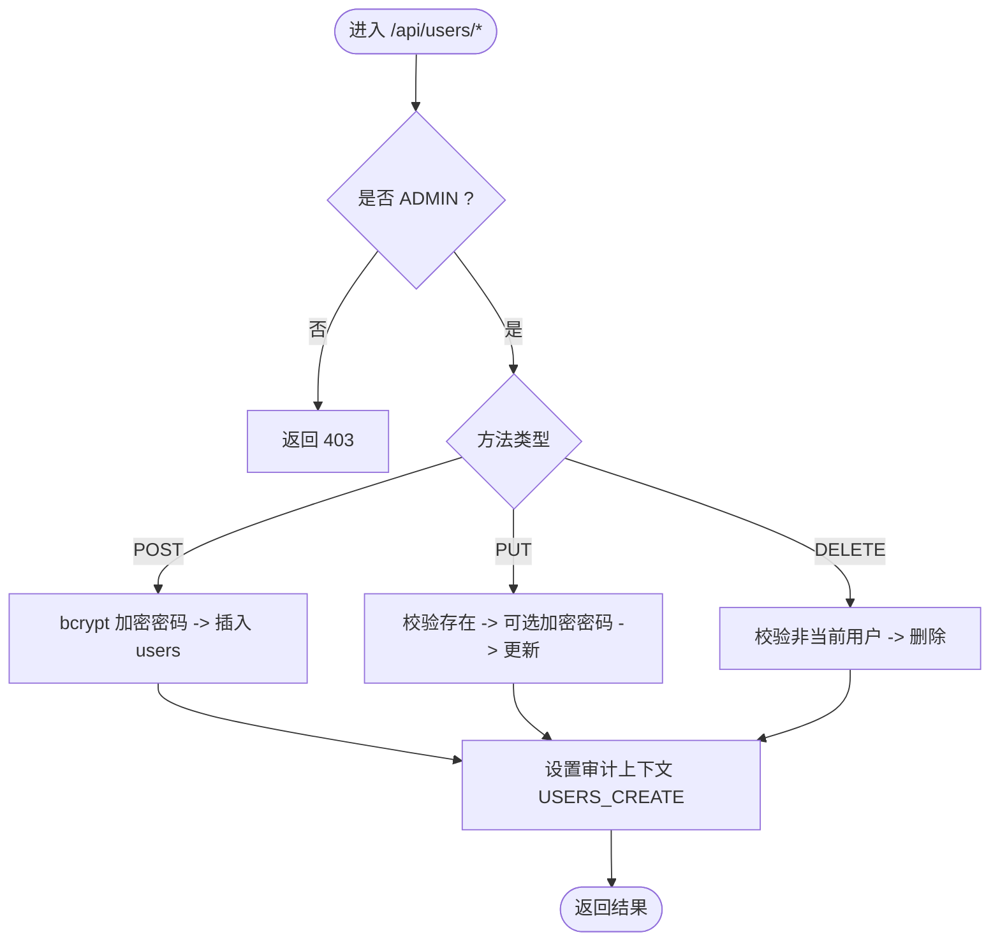
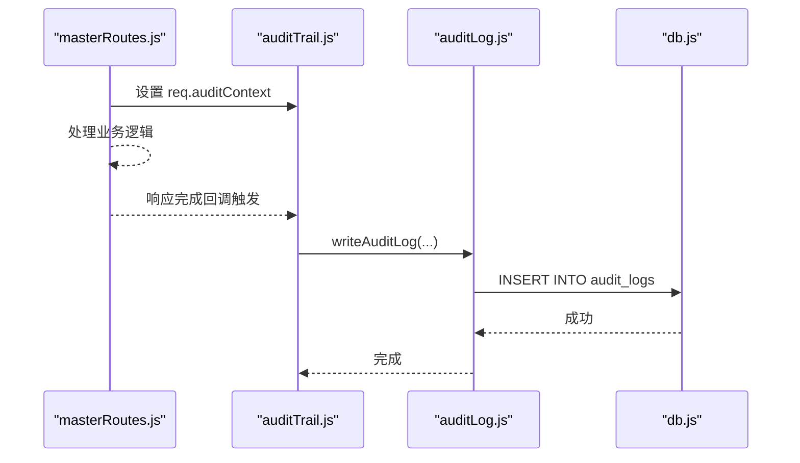
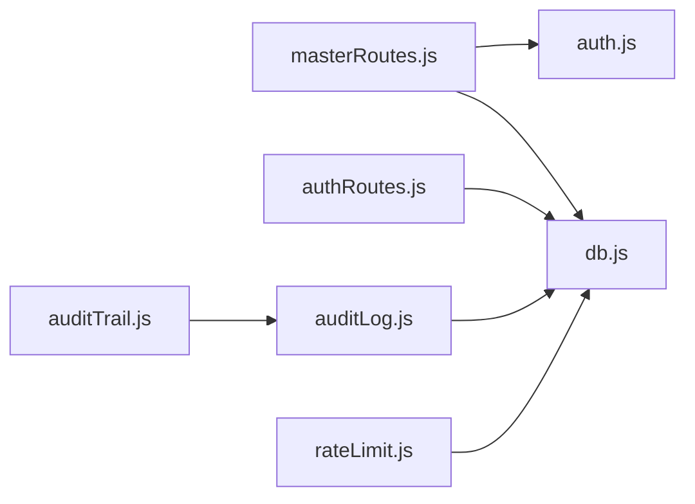
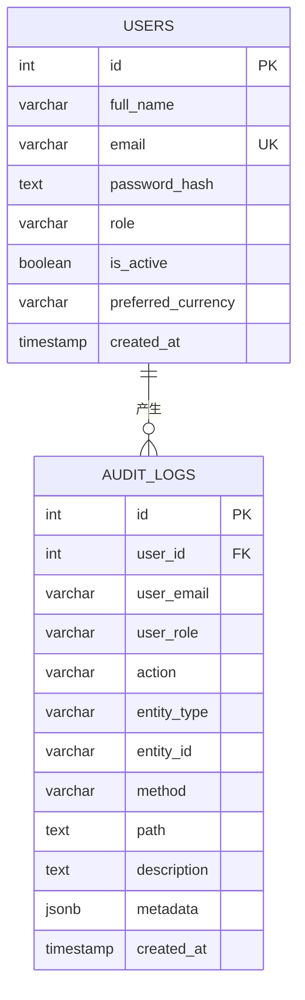

# 用户管理

<cite>
**本文引用的文件**
- [server/src/app.js](file://server/src/app.js)
- [server/src/routes/authRoutes.js](file://server/src/routes/authRoutes.js)
- [server/src/middleware/auth.js](file://server/src/middleware/auth.js)
- [server/src/middleware/rateLimit.js](file://server/src/middleware/rateLimit.js)
- [server/src/middleware/auditTrail.js](file://server/src/middleware/auditTrail.js)
- [server/src/utils/auditLog.js](file://server/src/utils/auditLog.js)
- [server/src/config/db.js](file://server/src/config/db.js)
- [server/database/schema.sql](file://server/database/schema.sql)
- [server/src/utils/pagination.js](file://server/src/utils/pagination.js)
- [server/src/routes/masterRoutes.js](file://server/src/routes/masterRoutes.js)
- [server/src/routes/auditRoutes.js](file://server/src/routes/auditRoutes.js)
</cite>

## 目录
1. [简介](#简介)
2. [项目结构](#项目结构)
3. [核心组件](#核心组件)
4. [架构总览](#架构总览)
5. [详细组件分析](#详细组件分析)
6. [依赖关系分析](#依赖关系分析)
7. [性能考虑](#性能考虑)
8. [故障排查指南](#故障排查指南)
9. [结论](#结论)
10. [附录](#附录)

## 简介
本文件围绕库存系统的“用户管理”能力进行系统化说明，覆盖用户 CRUD 操作、角色权限与安全控制、用户搜索与分页加载、密码加密机制、激活状态控制、权限验证、审计日志记录、用户列表优化与批量操作建议，以及安全策略实施要点。目标是帮助开发者与运维人员快速理解并正确使用用户管理功能。

## 项目结构
后端采用 Express + PostgreSQL 架构，用户管理相关能力集中在以下模块：
- 路由层：认证路由与主数据路由（含用户 CRUD）
- 中间件层：鉴权、速率限制、审计日志
- 数据访问层：数据库连接池与查询封装
- 数据模型：用户表与审计日志表
- 工具层：分页工具

**图表来源**
- [server/src/app.js:1-67](file://server/src/app.js#L1-L67)
- [server/src/middleware/auth.js:1-46](file://server/src/middleware/auth.js#L1-L46)
- [server/src/middleware/rateLimit.js:1-40](file://server/src/middleware/rateLimit.js#L1-L40)
- [server/src/middleware/auditTrail.js:1-84](file://server/src/middleware/auditTrail.js#L1-L84)
- [server/src/routes/authRoutes.js:1-72](file://server/src/routes/authRoutes.js#L1-L72)
- [server/src/routes/masterRoutes.js:500-699](file://server/src/routes/masterRoutes.js#L500-L699)
- [server/src/routes/auditRoutes.js:1-110](file://server/src/routes/auditRoutes.js#L1-L110)
- [server/src/config/db.js:1-25](file://server/src/config/db.js#L1-L25)
- [server/database/schema.sql:275-288](file://server/database/schema.sql#L275-L288)
- [server/src/utils/pagination.js:1-28](file://server/src/utils/pagination.js#L1-L28)
- [server/src/utils/auditLog.js:1-38](file://server/src/utils/auditLog.js#L1-L38)

**章节来源**
- [server/src/app.js:1-67](file://server/src/app.js#L1-L67)
- [server/src/config/db.js:1-25](file://server/src/config/db.js#L1-L25)
- [server/database/schema.sql:275-288](file://server/database/schema.sql#L275-L288)

## 核心组件
- 认证与授权中间件：负责 JWT 校验、用户可用性检查与基于角色的访问控制。
- 速率限制中间件：对登录等敏感接口进行限流保护。
- 审计日志中间件：统一捕获用户行为，写入审计日志表。
- 用户路由：提供用户搜索、分页、创建、更新、删除等能力，并受角色限制。
- 分页工具：统一处理分页参数与返回结构。
- 数据库连接：PostgreSQL 连接池与查询封装。

**章节来源**
- [server/src/middleware/auth.js:1-46](file://server/src/middleware/auth.js#L1-L46)
- [server/src/middleware/rateLimit.js:1-40](file://server/src/middleware/rateLimit.js#L1-L40)
- [server/src/middleware/auditTrail.js:1-84](file://server/src/middleware/auditTrail.js#L1-L84)
- [server/src/routes/masterRoutes.js:500-699](file://server/src/routes/masterRoutes.js#L500-L699)
- [server/src/utils/pagination.js:1-28](file://server/src/utils/pagination.js#L1-L28)
- [server/src/config/db.js:1-25](file://server/src/config/db.js#L1-L25)

## 架构总览
用户管理在系统中的交互流程如下：

**图表来源**
- [server/src/app.js:1-67](file://server/src/app.js#L1-L67)
- [server/src/middleware/auth.js:1-46](file://server/src/middleware/auth.js#L1-L46)
- [server/src/middleware/rateLimit.js:1-40](file://server/src/middleware/rateLimit.js#L1-L40)
- [server/src/routes/masterRoutes.js:500-699](file://server/src/routes/masterRoutes.js#L500-L699)
- [server/src/config/db.js:1-25](file://server/src/config/db.js#L1-L25)
- [server/src/middleware/auditTrail.js:1-84](file://server/src/middleware/auditTrail.js#L1-L84)

## 详细组件分析

### 用户认证与登录流程
- 登录接口接收邮箱与密码，查询用户并校验激活状态与密码哈希，签发 JWT。
- 登录接口受速率限制保护，防止暴力破解。
- 成功登录后，审计中间件记录登录事件。

**图表来源**
- [server/src/routes/authRoutes.js:17-64](file://server/src/routes/authRoutes.js#L17-L64)
- [server/src/middleware/rateLimit.js:9-35](file://server/src/middleware/rateLimit.js#L9-L35)
- [server/src/middleware/auditTrail.js:21-28](file://server/src/middleware/auditTrail.js#L21-L28)
- [server/src/middleware/auth.js:14-28](file://server/src/middleware/auth.js#L14-L28)
- [server/src/config/db.js:25-28](file://server/src/config/db.js#L25-L28)

**章节来源**
- [server/src/routes/authRoutes.js:17-64](file://server/src/routes/authRoutes.js#L17-L64)
- [server/src/middleware/rateLimit.js:9-35](file://server/src/middleware/rateLimit.js#L9-L35)
- [server/src/middleware/auditTrail.js:21-28](file://server/src/middleware/auditTrail.js#L21-L28)
- [server/src/middleware/auth.js:14-28](file://server/src/middleware/auth.js#L14-L28)
- [server/src/config/db.js:25-28](file://server/src/config/db.js#L25-L28)

### 用户搜索、分页与列表优化
- 支持按姓名、邮箱、角色模糊搜索；支持全量加载(all=true)与分页加载。
- 使用统一分页参数与返回结构，提升前端复用性。
- 列表查询通过并发获取数据与总数，减少延迟。

**图表来源**
- [server/src/routes/masterRoutes.js:500-560](file://server/src/routes/masterRoutes.js#L500-L560)
- [server/src/utils/pagination.js:15-22](file://server/src/utils/pagination.js#L15-L22)

**章节来源**
- [server/src/routes/masterRoutes.js:500-560](file://server/src/routes/masterRoutes.js#L500-L560)
- [server/src/utils/pagination.js:1-28](file://server/src/utils/pagination.js#L1-L28)

### 用户创建、更新与删除
- 创建：仅 ADMIN 可创建，密码经 bcrypt 加密后入库。
- 更新：仅 ADMIN 可更新；支持更新姓名、邮箱、角色、激活状态；可选更新密码（更新时再加密）。
- 删除：仅 ADMIN 可删除；禁止删除当前登录用户。

**图表来源**
- [server/src/routes/masterRoutes.js:563-661](file://server/src/routes/masterRoutes.js#L563-L661)
- [server/src/middleware/auth.js:32-40](file://server/src/middleware/auth.js#L32-L40)

**章节来源**
- [server/src/routes/masterRoutes.js:563-661](file://server/src/routes/masterRoutes.js#L563-L661)
- [server/src/middleware/auth.js:32-40](file://server/src/middleware/auth.js#L32-L40)

### 密码加密机制
- 新建与更新用户时，若提供新密码，则使用 bcrypt 进行加盐哈希存储。
- 登录时使用 bcrypt.compare 对比明文密码与存储的哈希值。

**章节来源**
- [server/src/routes/masterRoutes.js:571](file://server/src/routes/masterRoutes.js#L571)
- [server/src/routes/masterRoutes.js:604](file://server/src/routes/masterRoutes.js#L604)
- [server/src/routes/authRoutes.js:35](file://server/src/routes/authRoutes.js#L35)

### 角色权限与安全控制
- 角色定义：ADMIN、MANAGER、STAFF。
- 鉴权：JWT 校验与用户可用性检查。
- 授权：authorizeRoles 中间件限制特定路由仅允许指定角色访问。
- 登录速率限制：防止暴力破解。
- 审计：统一记录用户行为，含敏感字段脱敏。

**章节来源**
- [server/database/schema.sql:7](file://server/database/schema.sql#L7)
- [server/src/middleware/auth.js:32-40](file://server/src/middleware/auth.js#L32-L40)
- [server/src/middleware/rateLimit.js:9-35](file://server/src/middleware/rateLimit.js#L9-L35)
- [server/src/middleware/auditTrail.js:4-12](file://server/src/middleware/auditTrail.js#L4-L12)

### 审计日志功能
- 审计中间件在响应完成后异步写入审计日志，记录用户 ID/邮箱/角色、动作、实体类型、路径、方法、描述与元数据（含请求体与状态码）。
- 审计日志表包含索引，便于查询与统计。
- 用户路由在关键操作前设置审计上下文，确保动作可追溯。

**图表来源**
- [server/src/routes/masterRoutes.js:625-631](file://server/src/routes/masterRoutes.js#L625-L631)
- [server/src/middleware/auditTrail.js:47-79](file://server/src/middleware/auditTrail.js#L47-L79)
- [server/src/utils/auditLog.js:1-38](file://server/src/utils/auditLog.js#L1-L38)
- [server/src/config/db.js:25-28](file://server/src/config/db.js#L25-L28)

**章节来源**
- [server/src/middleware/auditTrail.js:14-79](file://server/src/middleware/auditTrail.js#L14-L79)
- [server/src/utils/auditLog.js:1-38](file://server/src/utils/auditLog.js#L1-L38)
- [server/database/schema.sql:275-288](file://server/database/schema.sql#L275-L288)

### 用户列表优化与批量操作建议
- 列表优化：使用并发查询获取 items 与 total，减少往返时间；支持全量加载与分页加载两种模式。
- 批量操作：当前未提供批量删除/更新接口。建议在新增批量接口时：
  - 引入事务保证一致性；
  - 控制单次批量规模，避免阻塞；
  - 为批量操作增加审计上下文与幂等标识；
  - 对高风险批量操作增加二次确认与最小权限原则。

**章节来源**
- [server/src/routes/masterRoutes.js:522-551](file://server/src/routes/masterRoutes.js#L522-L551)
- [server/src/utils/pagination.js:1-28](file://server/src/utils/pagination.js#L1-L28)

## 依赖关系分析
- 路由依赖中间件：用户路由依赖鉴权与角色授权中间件。
- 中间件依赖数据库：鉴权中间件与审计中间件均需查询用户信息。
- 审计日志依赖数据库：审计写入使用统一查询封装。
- 速率限制依赖客户端 IP：通过请求头与真实 IP 组合生成键。

**图表来源**
- [server/src/routes/masterRoutes.js:563-661](file://server/src/routes/masterRoutes.js#L563-L661)
- [server/src/middleware/auth.js:14-28](file://server/src/middleware/auth.js#L14-L28)
- [server/src/middleware/auditTrail.js:47-79](file://server/src/middleware/auditTrail.js#L47-L79)
- [server/src/utils/auditLog.js:1-38](file://server/src/utils/auditLog.js#L1-L38)
- [server/src/middleware/rateLimit.js:3-7](file://server/src/middleware/rateLimit.js#L3-L7)
- [server/src/config/db.js:25-28](file://server/src/config/db.js#L25-L28)

**章节来源**
- [server/src/routes/masterRoutes.js:563-661](file://server/src/routes/masterRoutes.js#L563-L661)
- [server/src/middleware/auth.js:14-28](file://server/src/middleware/auth.js#L14-L28)
- [server/src/middleware/auditTrail.js:47-79](file://server/src/middleware/auditTrail.js#L47-L79)
- [server/src/utils/auditLog.js:1-38](file://server/src/utils/auditLog.js#L1-L38)
- [server/src/middleware/rateLimit.js:3-7](file://server/src/middleware/rateLimit.js#L3-L7)
- [server/src/config/db.js:25-28](file://server/src/config/db.js#L25-L28)

## 性能考虑
- 分页参数边界：页码最小为 1，每页最大 100，避免超大分页导致数据库压力。
- 并发查询：列表接口并发获取 items 与 total，降低延迟。
- 审计日志异步写入：finish 事件后异步写入，避免阻塞主请求链路。
- 速率限制：登录接口限流，降低暴力破解风险与服务器负载。

**章节来源**
- [server/src/utils/pagination.js:2-12](file://server/src/utils/pagination.js#L2-L12)
- [server/src/routes/masterRoutes.js:522-551](file://server/src/routes/masterRoutes.js#L522-L551)
- [server/src/middleware/auditTrail.js:47-79](file://server/src/middleware/auditTrail.js#L47-L79)
- [server/src/middleware/rateLimit.js:9-35](file://server/src/middleware/rateLimit.js#L9-L35)

## 故障排查指南
- 登录失败
  - 检查邮箱是否存在且账户激活；确认密码正确。
  - 查看速率限制是否触发；查看审计日志中 LOGIN 动作记录。
- 权限不足
  - 确认当前用户角色是否具备所需权限；核对 authorizeRoles 的角色白名单。
- 用户更新/删除异常
  - 确认调用方是否为 ADMIN；更新时是否提供了必需字段；删除时是否尝试删除当前登录用户。
- 审计日志缺失
  - 确认审计中间件是否挂载；检查 writeAuditLog 是否抛错；核对审计日志表结构与索引。

**章节来源**
- [server/src/routes/authRoutes.js:31-39](file://server/src/routes/authRoutes.js#L31-L39)
- [server/src/middleware/rateLimit.js:23-29](file://server/src/middleware/rateLimit.js#L23-L29)
- [server/src/middleware/auth.js:32-40](file://server/src/middleware/auth.js#L32-L40)
- [server/src/routes/masterRoutes.js:591-599](file://server/src/routes/masterRoutes.js#L591-L599)
- [server/src/routes/masterRoutes.js:640-642](file://server/src/routes/masterRoutes.js#L640-L642)
- [server/src/middleware/auditTrail.js:57-76](file://server/src/middleware/auditTrail.js#L57-L76)
- [server/src/utils/auditLog.js:1-38](file://server/src/utils/auditLog.js#L1-L38)

## 结论
用户管理模块通过鉴权、授权、速率限制与审计日志形成完整的安全闭环；结合统一分页与并发查询实现良好的性能表现。建议在后续迭代中补充批量操作能力与更细粒度的权限控制，持续完善审计与合规要求。

## 附录
- 数据模型（用户与审计日志）
  

**图表来源**
- [server/database/schema.sql:2-11](file://server/database/schema.sql#L2-L11)
- [server/database/schema.sql:275-288](file://server/database/schema.sql#L275-L288)