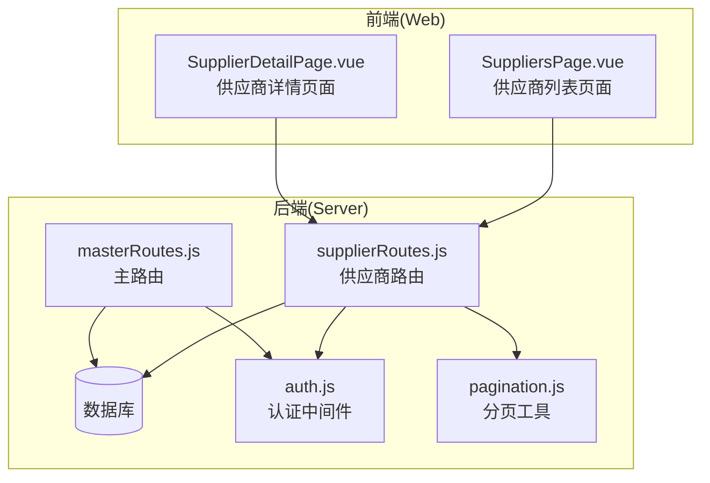
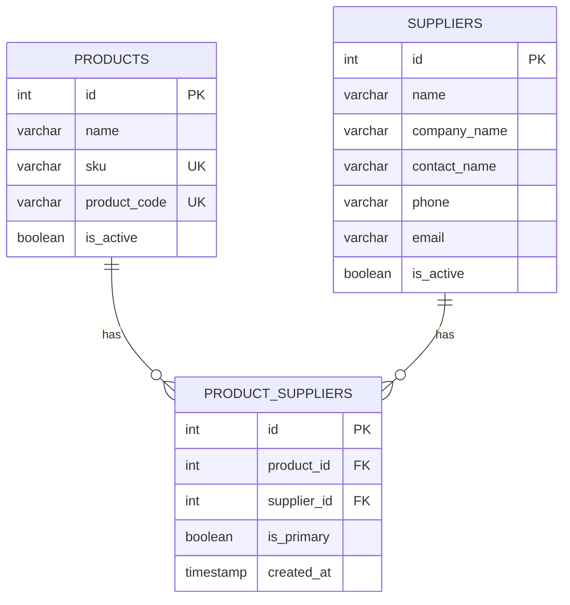
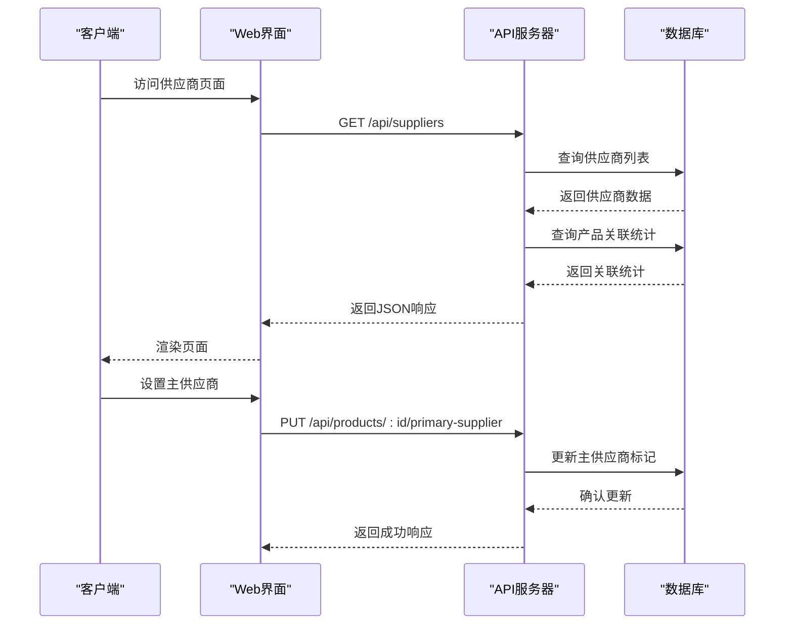
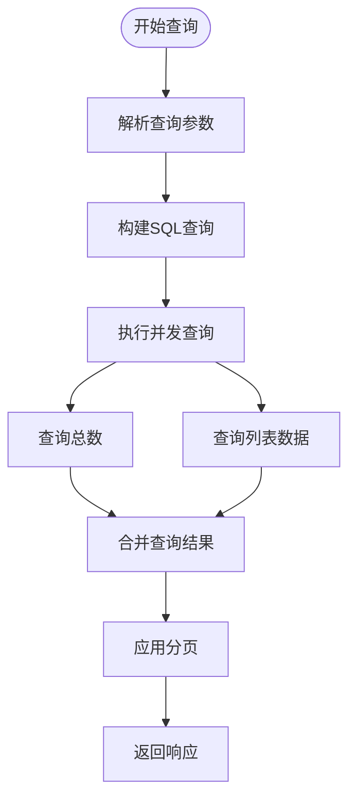
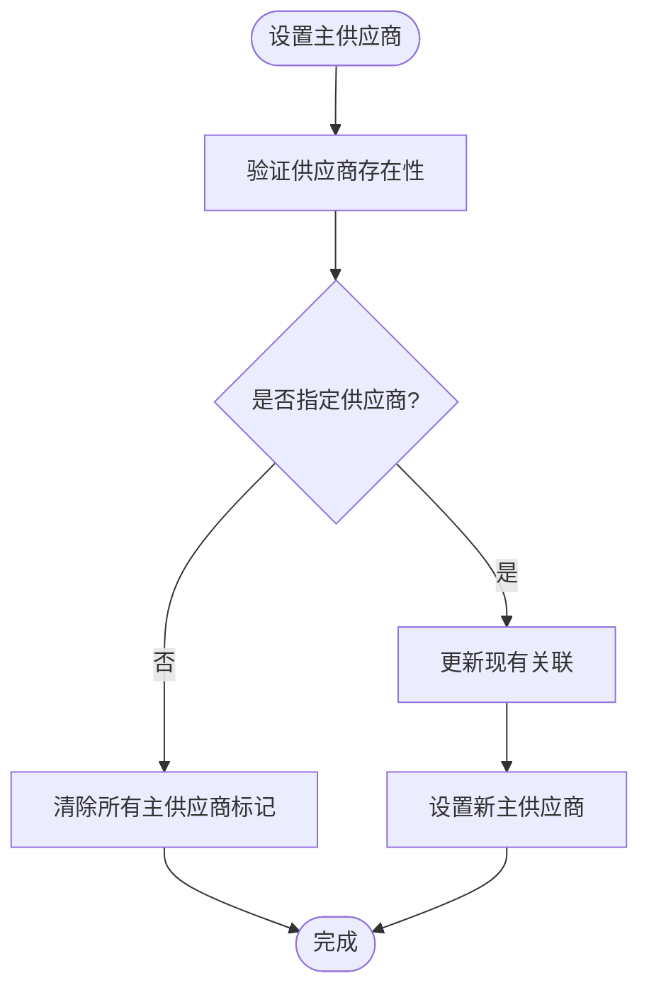
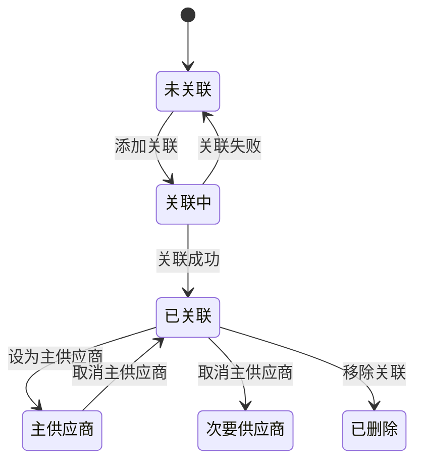
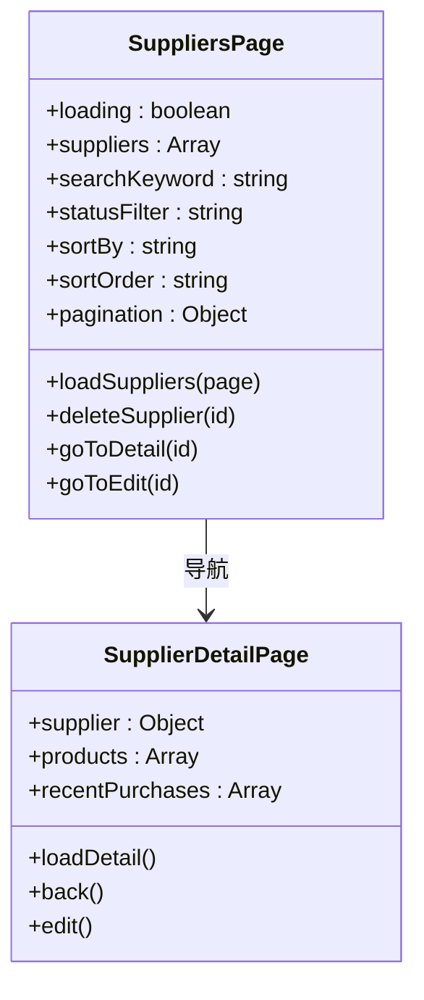
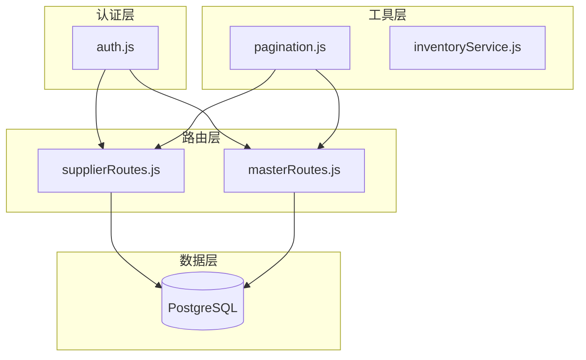

# 供应商产品关联管理

<cite>
**本文档引用的文件**
- [schema.sql](file://server/database/schema.sql)
- [masterRoutes.js](file://server/src/routes/masterRoutes.js)
- [supplierRoutes.js](file://server/src/routes/supplierRoutes.js)
- [SuppliersPage.vue](file://web/src/pages/SuppliersPage.vue)
- [SupplierDetailPage.vue](file://web/src/pages/SupplierDetailPage.vue)
- [pagination.js](file://server/src/utils/pagination.js)
- [auth.js](file://server/src/middleware/auth.js)
- [integration.test.js](file://server/test/integration.test.js)
</cite>

## 目录
1. [简介](#简介)
2. [项目结构](#项目结构)
3. [核心组件](#核心组件)
4. [架构概览](#架构概览)
5. [详细组件分析](#详细组件分析)
6. [依赖关系分析](#依赖关系分析)
7. [性能考虑](#性能考虑)
8. [故障排除指南](#故障排除指南)
9. [结论](#结论)

## 简介

本文件详细说明供应商产品关联管理功能，涵盖供应商与产品的双向关联关系维护、主供应商设置、产品关联管理等核心功能。重点解释 `product_suppliers` 关联表的作用和业务逻辑，供应商作为主供应商的优先级管理策略，以及产品-供应商匹配算法。文档同时包含数据一致性保证机制、批量操作和关系清理机制的实现细节。

## 项目结构

该系统采用前后端分离架构，供应商产品关联管理功能主要由以下组件构成：

**图表来源**
- [SuppliersPage.vue:1-272](file://web/src/pages/SuppliersPage.vue#L1-L272)
- [SupplierDetailPage.vue:1-207](file://web/src/pages/SupplierDetailPage.vue#L1-L207)
- [supplierRoutes.js:1-370](file://server/src/routes/supplierRoutes.js#L1-L370)
- [masterRoutes.js:1228-1256](file://server/src/routes/masterRoutes.js#L1228-L1256)

**章节来源**
- [SuppliersPage.vue:1-272](file://web/src/pages/SuppliersPage.vue#L1-L272)
- [SupplierDetailPage.vue:1-207](file://web/src/pages/SupplierDetailPage.vue#L1-L207)
- [supplierRoutes.js:1-370](file://server/src/routes/supplierRoutes.js#L1-L370)
- [masterRoutes.js:1228-1256](file://server/src/routes/masterRoutes.js#L1228-L1256)

## 核心组件

### 数据模型设计

系统通过 `product_suppliers` 关联表实现产品与供应商的多对多关系管理：

**图表来源**
- [schema.sql:348-356](file://server/database/schema.sql#L348-L356)

### 主要业务实体

1. **产品(Product)**: 核心商品实体，包含基本信息如名称、SKU、成本价等
2. **供应商(Supplier)**: 提供商品的实体，包含联系信息和业务条款
3. **产品-供应商关联(Product-Supplier Association)**: 中间表，维护多对多关系和主供应商标识

**章节来源**
- [schema.sql:32-54](file://server/database/schema.sql#L32-L54)
- [schema.sql:302-318](file://server/database/schema.sql#L302-L318)
- [schema.sql:348-356](file://server/database/schema.sql#L348-L356)

## 架构概览

供应商产品关联管理采用RESTful API架构，前后端通过HTTP协议通信：

**图表来源**
- [supplierRoutes.js:23-92](file://server/src/routes/supplierRoutes.js#L23-L92)
- [masterRoutes.js:1228-1256](file://server/src/routes/masterRoutes.js#L1228-L1256)

## 详细组件分析

### 1. 供应商列表查询功能

供应商列表查询支持多种筛选和排序选项：

#### 功能特性
- **搜索功能**: 支持按公司名称、联系人、电话等字段模糊搜索
- **状态过滤**: 支持显示所有、启用或停用的供应商
- **排序功能**: 支持按更新时间、创建时间、名称、交货周期排序
- **分页功能**: 支持大数据量的分页展示

#### 实现细节

**图表来源**
- [supplierRoutes.js:23-92](file://server/src/routes/supplierRoutes.js#L23-L92)

**章节来源**
- [supplierRoutes.js:23-92](file://server/src/routes/supplierRoutes.js#L23-L92)
- [pagination.js:1-28](file://server/src/utils/pagination.js#L1-L28)

### 2. 主供应商设置功能

主供应商设置是供应商产品关联管理的核心功能：

#### 设置算法

**图表来源**
- [masterRoutes.js:283-299](file://server/src/routes/masterRoutes.js#L283-L299)

#### 业务规则
1. **唯一性约束**: 每个产品只能有一个主供应商
2. **原子性操作**: 使用数据库事务确保数据一致性
3. **回退机制**: 当设置失败时自动回滚所有更改

**章节来源**
- [masterRoutes.js:283-299](file://server/src/routes/masterRoutes.js#L283-L299)

### 3. 产品关联管理功能

产品关联管理提供完整的供应商-产品关系维护能力：

#### 关联关系维护
- **添加关联**: 将供应商与产品建立关联关系
- **移除关联**: 删除不再需要的供应商-产品关系
- **主供应商切换**: 在多个供应商中选择主供应商
- **批量操作**: 支持批量设置主供应商

#### 数据一致性保证

**图表来源**
- [masterRoutes.js:283-299](file://server/src/routes/masterRoutes.js#L283-L299)

**章节来源**
- [masterRoutes.js:1228-1256](file://server/src/routes/masterRoutes.js#L1228-L1256)

### 4. 前端界面集成

#### 供应商列表页面
供应商列表页面提供完整的供应商管理界面：

**图表来源**
- [SuppliersPage.vue:1-272](file://web/src/pages/SuppliersPage.vue#L1-L272)
- [SupplierDetailPage.vue:1-207](file://web/src/pages/SupplierDetailPage.vue#L1-L207)

**章节来源**
- [SuppliersPage.vue:1-272](file://web/src/pages/SuppliersPage.vue#L1-L272)
- [SupplierDetailPage.vue:1-207](file://web/src/pages/SupplierDetailPage.vue#L1-L207)

## 依赖关系分析

### 技术依赖图

**图表来源**
- [auth.js:1-46](file://server/src/middleware/auth.js#L1-L46)
- [supplierRoutes.js:1-370](file://server/src/routes/supplierRoutes.js#L1-L370)
- [masterRoutes.js:1-1513](file://server/src/routes/masterRoutes.js#L1-L1513)

### 外部依赖

- **JWT认证**: 使用JSON Web Token进行用户身份验证
- **PostgreSQL**: 关系型数据库存储所有业务数据
- **Express.js**: Web应用框架
- **Vue.js**: 前端界面框架

**章节来源**
- [auth.js:1-46](file://server/src/middleware/auth.js#L1-L46)
- [pagination.js:1-28](file://server/src/utils/pagination.js#L1-L28)

## 性能考虑

### 查询优化

1. **索引优化**: 对常用查询字段建立适当索引
   - `product_suppliers(product_id)`
   - `product_suppliers(supplier_id)`
   - `product_suppliers(is_primary)`

2. **并发查询**: 使用Promise.all并行执行多个查询
3. **分页机制**: 避免一次性加载大量数据

### 缓存策略

- **查询结果缓存**: 对频繁访问的数据进行缓存
- **会话管理**: 使用JWT令牌减少数据库查询

## 故障排除指南

### 常见问题及解决方案

#### 1. 主供应商设置失败
**症状**: 设置主供应商时报错
**可能原因**:
- 供应商不存在
- 数据库连接异常
- 权限不足

**解决方法**:
1. 验证供应商ID有效性
2. 检查数据库连接状态
3. 确认用户权限

#### 2. 供应商列表查询缓慢
**症状**: 页面加载时间过长
**可能原因**:
- 缺少必要的数据库索引
- 查询条件过于复杂
- 数据量过大

**解决方法**:
1. 为常用查询字段添加索引
2. 优化查询条件
3. 实施分页和懒加载

#### 3. 数据不一致问题
**症状**: 主供应商标记错误
**可能原因**:
- 并发操作导致的竞争条件
- 事务未正确提交

**解决方法**:
1. 使用数据库事务确保原子性
2. 实施适当的锁机制
3. 重试机制处理临时冲突

**章节来源**
- [masterRoutes.js:283-299](file://server/src/routes/masterRoutes.js#L283-L299)
- [supplierRoutes.js:23-92](file://server/src/routes/supplierRoutes.js#L23-L92)

## 结论

供应商产品关联管理功能通过精心设计的数据库模式和API接口，实现了灵活而可靠的产品-供应商关系管理。核心特点包括：

1. **清晰的业务逻辑**: 通过 `product_suppliers` 关联表明确表达多对多关系
2. **强一致性的保证**: 使用数据库事务和约束确保数据完整性
3. **高效的查询性能**: 通过索引优化和分页机制提升用户体验
4. **完善的权限控制**: 基于角色的访问控制确保系统安全

该系统为库存管理提供了坚实的基础，支持复杂的供应链管理需求，同时保持了良好的可扩展性和维护性。