# 供应商基本信息管理

<cite>
**本文档引用的文件**
- [supplierRoutes.js](file://server/src/routes/supplierRoutes.js)
- [auth.js](file://server/src/middleware/auth.js)
- [auditTrail.js](file://server/src/middleware/auditTrail.js)
- [auditLog.js](file://server/src/utils/auditLog.js)
- [pagination.js](file://server/src/utils/pagination.js)
- [schema.sql](file://server/database/schema.sql)
- [SuppliersPage.vue](file://web/src/pages/SuppliersPage.vue)
- [SupplierDetailPage.vue](file://web/src/pages/SupplierDetailPage.vue)
- [SupplierFormPage.vue](file://web/src/pages/SupplierFormPage.vue)
- [app.js](file://server/src/app.js)
- [response.js](file://server/src/middleware/response.js)
</cite>

## 目录
1. [简介](#简介)
2. [项目结构](#项目结构)
3. [核心组件](#核心组件)
4. [架构概览](#架构概览)
5. [详细组件分析](#详细组件分析)
6. [依赖关系分析](#依赖关系分析)
7. [性能考虑](#性能考虑)
8. [故障排除指南](#故障排除指南)
9. [结论](#结论)

## 简介

供应商基本信息管理系统是库存管理系统的核心模块之一，负责维护和管理所有供应商的基本信息。该系统提供了完整的供应商生命周期管理功能，包括供应商的创建、查询、更新、状态管理和删除操作。

本系统采用前后端分离架构，后端基于Node.js + Express构建RESTful API，前端使用Vue.js开发响应式用户界面。系统集成了完善的权限控制、审计日志记录和数据验证机制，确保数据的安全性和完整性。

## 项目结构

系统采用模块化设计，主要分为以下层次：

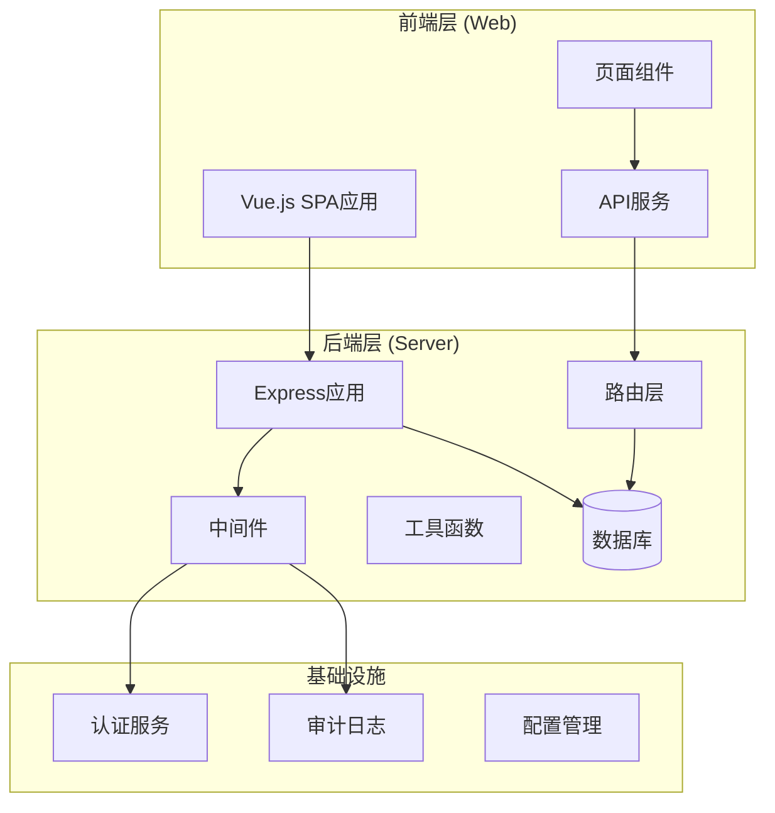

**图表来源**
- [app.js:1-67](file://server/src/app.js#L1-L67)
- [supplierRoutes.js:1-370](file://server/src/routes/supplierRoutes.js#L1-L370)

**章节来源**
- [app.js:1-67](file://server/src/app.js#L1-L67)
- [schema.sql:302-333](file://server/database/schema.sql#L302-L333)

## 核心组件

### 供应商数据模型

供应商表结构设计支持完整的供应商信息管理：

| 字段名 | 数据类型 | 约束 | 描述 |
|--------|----------|------|------|
| id | SERIAL | PRIMARY KEY | 供应商唯一标识符 |
| name | VARCHAR(180) | NOT NULL | 公司名称 |
| company_name | VARCHAR(180) |  | 公司全称 |
| contact_name | VARCHAR(120) |  | 联系人姓名 |
| phone | VARCHAR(60) |  | 联系电话 |
| email | VARCHAR(160) |  | 邮箱地址 |
| address | TEXT |  | 地址信息 |
| payment_terms | TEXT |  | 付款条件 |
| lead_time_days | INTEGER | NOT NULL DEFAULT 0, CHECK >= 0 | 交货周期（天） |
| notes | TEXT |  | 备注信息 |
| is_active | BOOLEAN | NOT NULL DEFAULT TRUE | 启用状态 |
| created_by | INTEGER | REFERENCES users(id) | 创建者 |
| updated_by | INTEGER | REFERENCES users(id) | 更新者 |
| created_at | TIMESTAMP | NOT NULL DEFAULT CURRENT_TIMESTAMP | 创建时间 |
| updated_at | TIMESTAMP | NOT NULL DEFAULT CURRENT_TIMESTAMP | 更新时间 |

### 权限控制机制

系统采用基于角色的访问控制（RBAC）：

- **ADMIN**: 系统管理员，拥有最高权限
- **MANAGER**: 管理员，具有大部分管理权限
- **STAFF**: 普通员工，有限的只读权限

供应商管理接口的权限要求：
- 列表查询：所有已认证用户
- 创建/更新/删除：ADMIN或MANAGER角色
- 状态更新：ADMIN或MANAGER角色

**章节来源**
- [schema.sql:302-333](file://server/database/schema.sql#L302-L333)
- [auth.js:32-40](file://server/src/middleware/auth.js#L32-L40)

## 架构概览

系统采用分层架构设计，确保关注点分离和代码的可维护性：

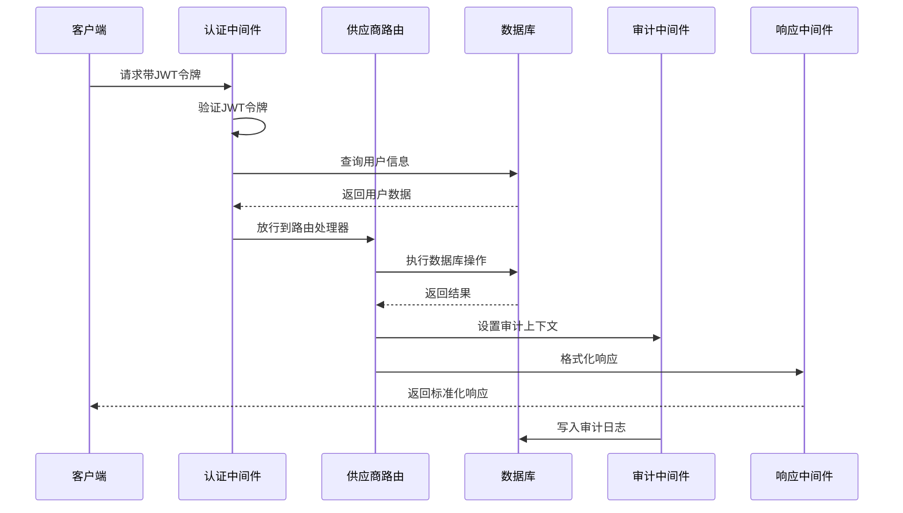

**图表来源**
- [app.js:28-34](file://server/src/app.js#L28-L34)
- [auth.js:5-29](file://server/src/middleware/auth.js#L5-L29)
- [auditTrail.js:47-79](file://server/src/middleware/auditTrail.js#L47-L79)

## 详细组件分析

### 供应商路由处理

#### GET /api/suppliers - 供应商列表查询

供应商列表查询接口支持多种查询条件和排序选项：

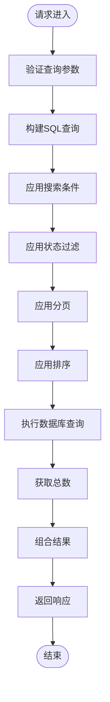

**图表来源**
- [supplierRoutes.js:23-92](file://server/src/routes/supplierRoutes.js#L23-L92)

查询参数支持：
- `search`: 搜索关键词（支持公司名称、联系人、电话、邮箱）
- `status`: 状态过滤（all/active/inactive）
- `sortBy`: 排序字段（name/created_at/updated_at/lead_time_days）
- `sortOrder`: 排序方向（asc/desc）
- `page`: 页码
- `pageSize`: 每页大小

#### POST /api/suppliers - 创建新供应商

供应商创建流程包含完整的数据验证和业务逻辑：

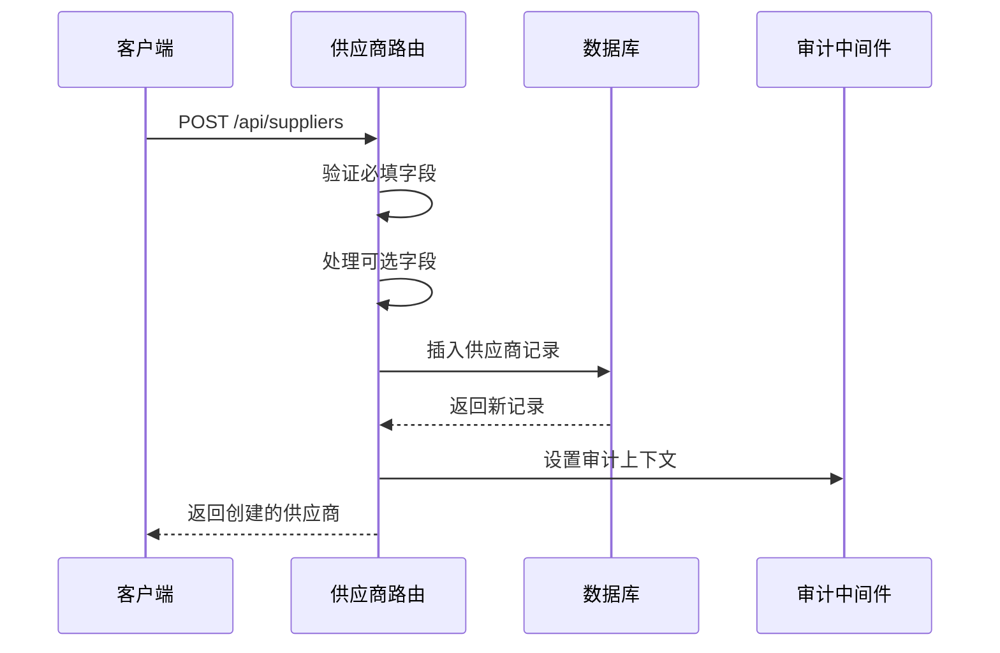

**图表来源**
- [supplierRoutes.js:94-169](file://server/src/routes/supplierRoutes.js#L94-L169)

创建时的字段处理：
- 必填字段：`name`（公司名称）
- 默认值：`isActive`默认为true，`leadTimeDays`默认为0
- 关联字段：自动设置`created_by`和`updated_by`为当前用户ID

#### GET /api/suppliers/:id - 获取供应商详情

供应商详情查询提供多维度的数据聚合：

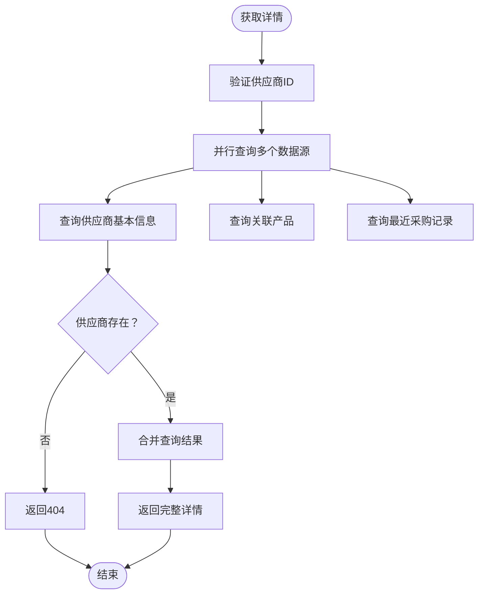

**图表来源**
- [supplierRoutes.js:171-232](file://server/src/routes/supplierRoutes.js#L171-L232)

详情页面包含的数据：
- 基本供应商信息
- 关联产品列表（按主供应商优先级排序）
- 最近10条采购记录（入库操作）

#### PUT /api/suppliers/:id - 更新供应商信息

供应商更新操作支持部分字段更新：

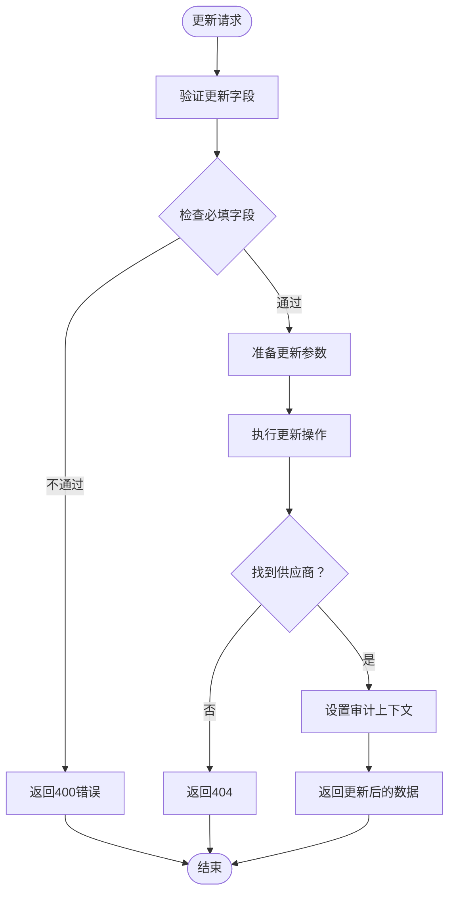

**图表来源**
- [supplierRoutes.js:234-313](file://server/src/routes/supplierRoutes.js#L234-L313)

更新时的字段处理：
- 必填字段：`name`（公司名称）
- 自动更新：`updated_by`和`updated_at`字段
- 状态字段：`isActive`支持启用/停用切换

#### PATCH /api/suppliers/:id/status - 更新供应商状态

专门的状态更新接口，简化了状态变更操作：

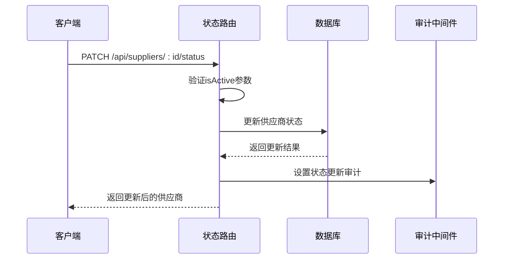

**图表来源**
- [supplierRoutes.js:315-344](file://server/src/routes/supplierRoutes.js#L315-L344)

#### DELETE /api/suppliers/:id - 删除供应商

供应商删除操作包含安全检查：

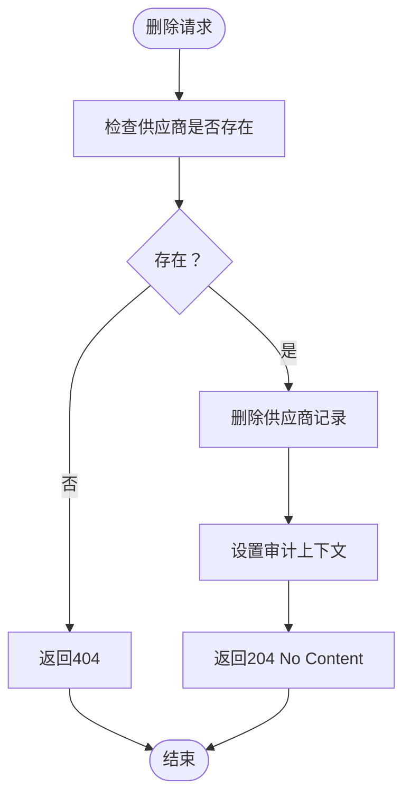

**图表来源**
- [supplierRoutes.js:346-367](file://server/src/routes/supplierRoutes.js#L346-L367)

**章节来源**
- [supplierRoutes.js:23-367](file://server/src/routes/supplierRoutes.js#L23-L367)

### 前端组件实现

#### 供应商列表页面

供应商列表页面提供完整的供应商管理界面：

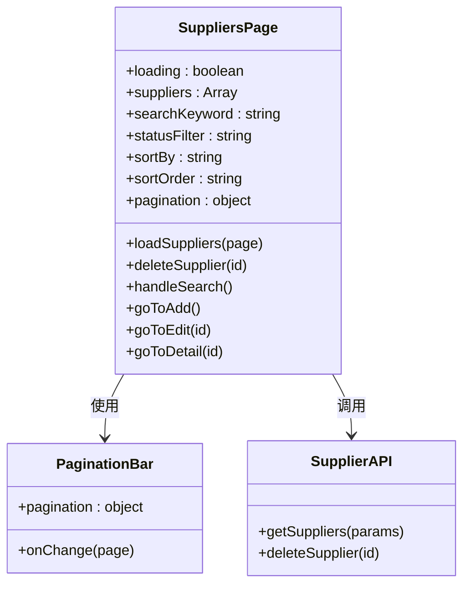

**图表来源**
- [SuppliersPage.vue:1-272](file://web/src/pages/SuppliersPage.vue#L1-L272)

页面功能特性：
- 实时搜索和过滤
- 多种排序方式
- 分页显示
- 批量操作支持

#### 供应商详情页面

供应商详情页面展示供应商的完整信息：

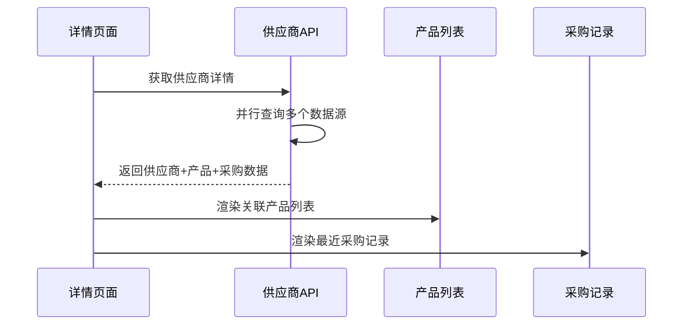

**图表来源**
- [SupplierDetailPage.vue:1-207](file://web/src/pages/SupplierDetailPage.vue#L1-L207)

详情页面包含：
- 供应商基本信息展示
- 关联产品列表（主供应商/次要供应商区分）
- 最近10条采购记录（入库操作）

#### 供应商表单页面

供应商表单页面支持供应商的创建和编辑：

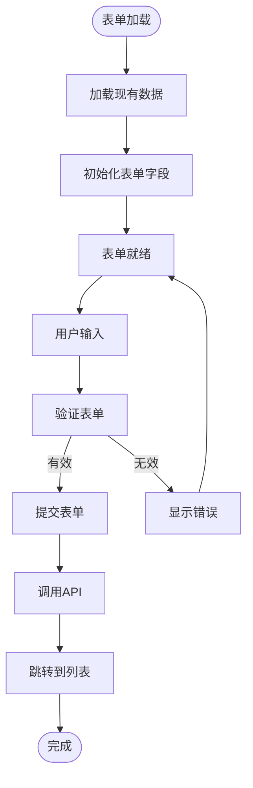

**图表来源**
- [SupplierFormPage.vue:1-261](file://web/src/pages/SupplierFormPage.vue#L1-L261)

表单字段支持：
- 公司名称（必填）
- 联系人信息
- 联系方式
- 业务信息（交货周期、付款条件等）
- 状态控制

**章节来源**
- [SuppliersPage.vue:44-101](file://web/src/pages/SuppliersPage.vue#L44-L101)
- [SupplierDetailPage.vue:36-69](file://web/src/pages/SupplierDetailPage.vue#L36-L69)
- [SupplierFormPage.vue:42-113](file://web/src/pages/SupplierFormPage.vue#L42-L113)

### 审计日志和权限控制

#### 审计日志系统

系统实现了完整的审计日志记录机制：

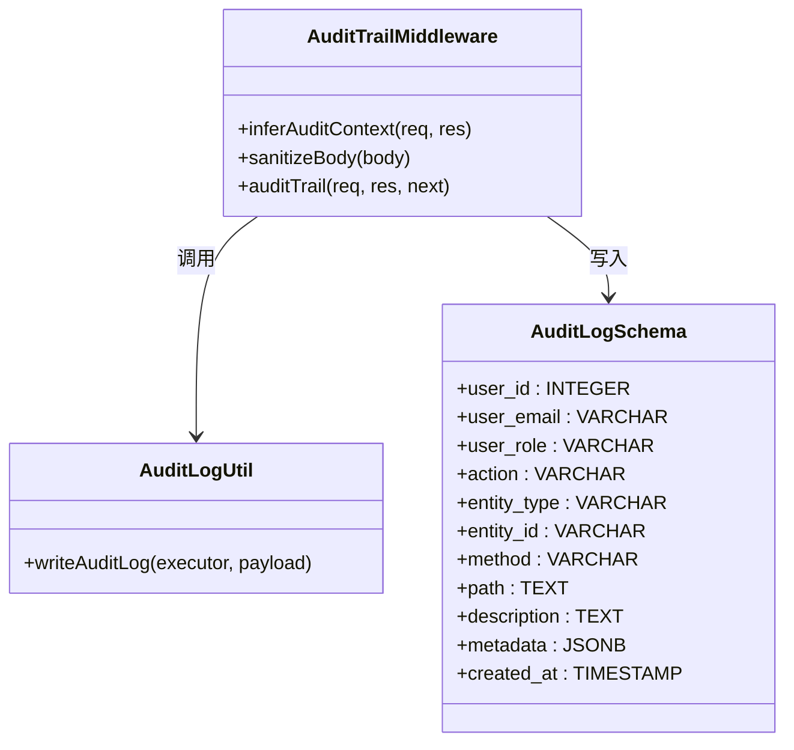

**图表来源**
- [auditTrail.js:1-84](file://server/src/middleware/auditTrail.js#L1-L84)
- [auditLog.js:1-38](file://server/src/utils/auditLog.js#L1-L38)
- [schema.sql:275-288](file://server/database/schema.sql#L275-L288)

审计日志记录内容：
- 用户身份信息（ID、邮箱、角色）
- 操作类型（CREATE/UPDATE/DELETE/STATUS_UPDATE）
- 实体信息（供应商相关操作）
- 请求元数据（方法、路径、状态码）
- 敏感信息脱敏处理

#### 权限控制机制

系统采用多层权限控制确保安全性：

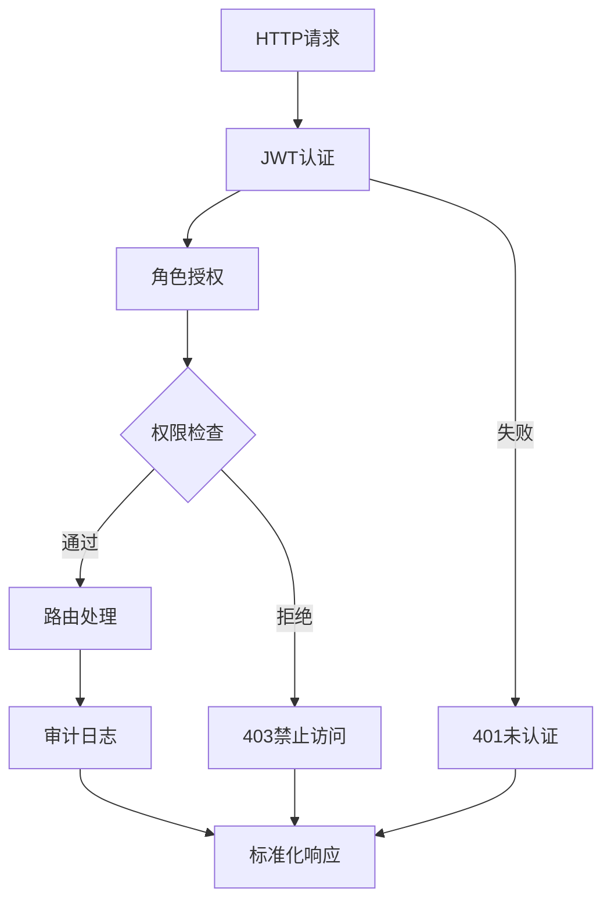

**图表来源**
- [auth.js:5-40](file://server/src/middleware/auth.js#L5-L40)
- [response.js:36-54](file://server/src/middleware/response.js#L36-L54)

权限控制特点：
- JWT令牌验证
- 用户状态检查（必须为激活状态）
- 角色权限验证
- 统一错误响应格式

**章节来源**
- [auditTrail.js:14-79](file://server/src/middleware/auditTrail.js#L14-L79)
- [auditLog.js:1-38](file://server/src/utils/auditLog.js#L1-L38)
- [auth.js:5-40](file://server/src/middleware/auth.js#L5-L40)
- [response.js:36-54](file://server/src/middleware/response.js#L36-L54)

## 依赖关系分析

系统各组件之间的依赖关系如下：

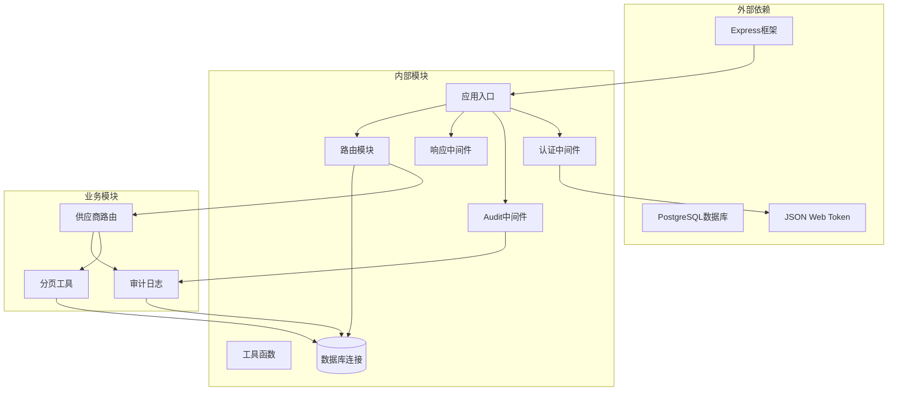

**图表来源**
- [app.js:1-67](file://server/src/app.js#L1-L67)
- [supplierRoutes.js:1-6](file://server/src/routes/supplierRoutes.js#L1-L6)
- [pagination.js:1-28](file://server/src/utils/pagination.js#L1-L28)

**章节来源**
- [app.js:1-67](file://server/src/app.js#L1-L67)
- [supplierRoutes.js:1-6](file://server/src/routes/supplierRoutes.js#L1-L6)

## 性能考虑

### 数据库优化

系统在数据库层面采用了多项优化措施：

1. **索引优化**：
   - 供应商名称索引：支持快速搜索
   - 状态过滤索引：加速状态查询
   - 复合索引：优化常用查询模式

2. **查询优化**：
   - 使用LIMIT和OFFSET进行分页
   - 并行查询减少响应时间
   - 智能排序字段选择

3. **内存优化**：
   - 流式处理大数据集
   - 连接池管理
   - 缓存策略

### 前端性能优化

1. **懒加载**：
   - 页面组件按需加载
   - 图片资源延迟加载

2. **虚拟滚动**：
   - 大列表使用虚拟滚动
   - 减少DOM节点数量

3. **缓存策略**：
   - API响应缓存
   - 表单数据本地存储

## 故障排除指南

### 常见问题及解决方案

#### 认证相关问题

**问题**：401 未认证
- **原因**：缺少有效的JWT令牌
- **解决方案**：确保请求头包含正确的Authorization: Bearer token

**问题**：403 禁止访问
- **原因**：用户角色不足或用户被停用
- **解决方案**：检查用户角色是否为ADMIN或MANAGER，确认用户状态为激活

#### 供应商操作问题

**问题**：创建供应商失败
- **原因**：缺少必填字段name
- **解决方案**：确保提供有效的公司名称

**问题**：更新供应商失败
- **原因**：供应商不存在或字段验证失败
- **解决方案**：确认供应商ID正确，检查必填字段

#### 数据库连接问题

**问题**：500 服务器错误
- **原因**：数据库连接异常或查询超时
- **解决方案**：检查数据库连接配置，查看数据库日志

**章节来源**
- [auth.js:9-28](file://server/src/middleware/auth.js#L9-L28)
- [supplierRoutes.js:111-113](file://server/src/routes/supplierRoutes.js#L111-L113)
- [response.js:14-27](file://server/src/middleware/response.js#L14-L27)

## 结论

供应商基本信息管理系统是一个功能完整、架构清晰的企业级应用。系统的主要优势包括：

1. **完整的功能覆盖**：支持供应商的全生命周期管理
2. **严格的安全控制**：基于角色的权限管理和审计日志
3. **良好的用户体验**：响应式的前端界面和直观的操作流程
4. **可扩展的设计**：模块化的架构便于功能扩展
5. **完善的错误处理**：统一的错误响应格式和详细的日志记录

系统通过合理的数据模型设计、严格的权限控制和完善的审计机制，为企业提供了可靠的供应商管理解决方案。未来可以在以下方面进一步优化：

- 添加供应商导入导出功能
- 增强搜索和过滤能力
- 优化移动端用户体验
- 扩展供应商评分和评价功能